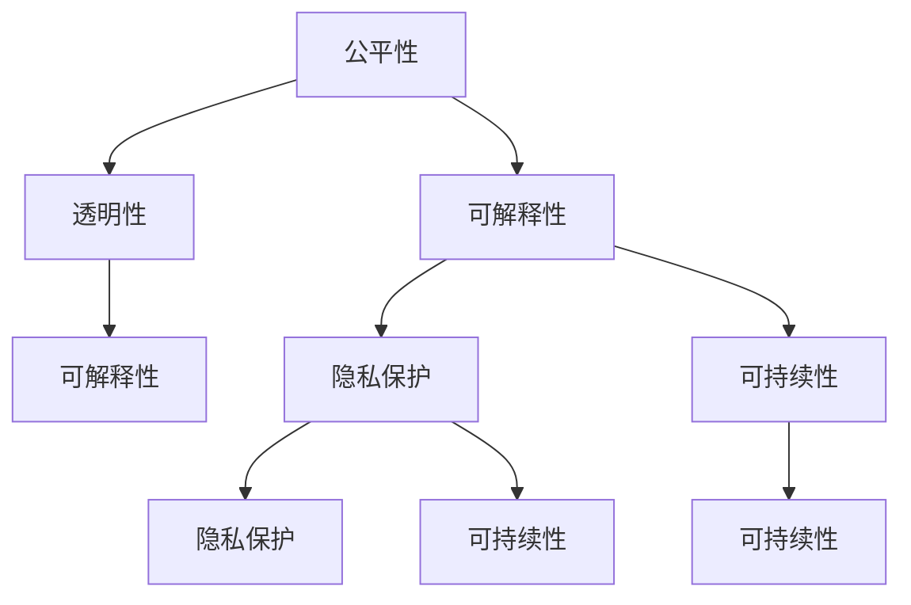

                 

# 人机协作：伦理 规范与准则

> 关键词：人机协作, 伦理规范, 人工智能, 算法透明性, 可解释性, 公平性, 隐私保护, 可持续性

## 1. 背景介绍

### 1.1 问题由来

在人工智能（AI）技术不断发展的今天，人机协作已成为各行各业提升效率、创造价值的重要途径。无论是自动驾驶、智能制造、医疗诊断，还是客服咨询、金融预测、教育培训，人机协作都在不断改变我们的生活和工作方式。然而，随着AI技术的广泛应用，涉及人机协作的伦理、规范与准则问题也愈发凸显，引发了广泛的社会关注。

当前，人机协作面临的最大挑战之一是如何在提升效率的同时，确保算法的公平性、透明性、可解释性，以及尊重用户隐私、保障数据安全等问题。例如，在医疗领域，AI算法可能会因偏见导致误诊；在金融领域，AI决策可能因缺乏可解释性而引发信任危机；在教育领域，AI推荐的个性化内容可能因算法歧视而侵害学生权益。这些问题不仅影响用户体验，更可能引发法律风险和道德争议。

因此，如何在提升效率的同时，确保人机协作的公平性、透明性、可解释性，以及尊重用户隐私、保障数据安全，成为当前技术发展和应用推广的重要课题。本文将深入探讨人机协作中的伦理、规范与准则问题，为相关领域的开发者、研究人员和政策制定者提供参考。

### 1.2 问题核心关键点

人机协作中的伦理、规范与准则问题主要集中在以下几个方面：

- **公平性**：确保算法对所有用户群体公平无歧视，避免因算法偏见导致的歧视性结果。
- **透明性**：算法的决策过程应可解释，用户应能理解和信任算法的工作原理和输出结果。
- **可解释性**：算法的内部机制应可解释，便于用户理解、维护和改进。
- **隐私保护**：在收集和处理用户数据时，应严格遵循隐私保护原则，保护用户隐私。
- **可持续性**：人机协作系统应设计为可持续的，考虑环境影响和经济成本。

本文将围绕这些关键点，对人机协作中的伦理、规范与准则问题进行全面分析，提出解决方案，并展望未来趋势。

## 2. 核心概念与联系

### 2.1 核心概念概述

为更好地理解人机协作中的伦理、规范与准则问题，本节将介绍几个密切相关的核心概念：

- **公平性**：指算法应对所有用户群体公平无歧视，避免因偏见导致的歧视性结果。公平性包括但不限于性别、种族、年龄、地域等方面的公平。
- **透明性**：指算法的工作原理和决策过程应透明，用户应能理解和信任算法的工作方式和输出结果。透明性有助于提升用户信任和算法接受度。
- **可解释性**：指算法的内部机制和决策依据应可解释，便于用户理解、维护和改进。可解释性有助于提升用户信任和算法可靠性。
- **隐私保护**：指在收集和处理用户数据时，应严格遵循隐私保护原则，保护用户隐私。隐私保护有助于提升用户信任和合规性。
- **可持续性**：指人机协作系统应设计为可持续的，考虑环境影响和经济成本。可持续性有助于提升系统长期稳定性和社会责任。

这些核心概念之间存在紧密的联系。例如，公平性和透明性密切相关，透明的算法才能真正做到公平。可解释性是透明性的重要组成部分，透明性有助于提升算法的可解释性。隐私保护和可持续性则是人机协作系统设计的重要原则，影响算法的社会接受度和长期发展。

### 2.2 核心概念原理和架构的 Mermaid 流程图



这个流程图展示了人机协作中伦理、规范与准则的关键概念及其相互关系。公平性和透明性密切相关，透明性有助于提升公平性。可解释性是透明性的重要组成部分，透明性有助于提升可解释性。隐私保护和可持续性则是人机协作系统设计的重要原则，影响算法的社会接受度和长期发展。

## 3. 核心算法原理 & 具体操作步骤

### 3.1 算法原理概述

在人机协作中，算法的公平性、透明性和可解释性是其核心问题。解决这些问题的方法涉及多个方面的算法原理和具体操作步骤。

**公平性**：公平性问题主要通过数据预处理、算法设计、模型评估等手段来解决。例如，在数据预处理阶段，可以使用平衡样本处理（如过采样、欠采样等）、去偏处理（如重新加权、重新训练等）来减少数据偏见。在算法设计阶段，可以使用公平性约束（如均等误差、统计公平性等）来限制算法偏见。在模型评估阶段，可以使用公平性指标（如均等误差率、F1公平性等）来评估模型公平性。

**透明性**：透明性问题主要通过算法透明性和结果透明性来解决。算法透明性涉及算法的可解释性、决策依据和内部机制。结果透明性涉及算法的输出结果和解释方式。例如，可以使用规则库、决策树、可解释的深度学习模型（如LIME、SHAP等）来实现算法透明性。使用解释文本、错误分析报告等工具来提供结果透明性。

**可解释性**：可解释性问题主要通过模型解释、特征可视化、因果分析等手段来解决。例如，可以使用LIME、SHAP等模型解释工具来提供局部解释。使用特征可视化工具（如t-SNE、PCA等）来揭示模型的内部结构。使用因果分析工具（如贝叶斯网络、结构方程模型等）来揭示模型的因果关系。

### 3.2 算法步骤详解

**公平性算法步骤**：

1. **数据预处理**：
   - 收集多样化数据，确保数据覆盖所有用户群体。
   - 使用平衡样本处理（如过采样、欠采样）和去偏处理（如重新加权、重新训练）来减少数据偏见。

2. **算法设计**：
   - 在算法设计阶段引入公平性约束（如均等误差、统计公平性等）来限制算法偏见。
   - 使用公平性指标（如均等误差率、F1公平性等）来评估模型公平性。

3. **模型评估**：
   - 使用公平性指标（如均等误差率、F1公平性等）来评估模型公平性。
   - 对不公平模型进行调整和改进。

**透明性算法步骤**：

1. **算法透明性**：
   - 使用规则库、决策树、可解释的深度学习模型（如LIME、SHAP等）来实现算法透明性。
   - 提供算法决策依据和内部机制的解释。

2. **结果透明性**：
   - 使用解释文本、错误分析报告等工具来提供结果透明性。
   - 对算法输出结果进行详细解释和分析。

**可解释性算法步骤**：

1. **模型解释**：
   - 使用LIME、SHAP等模型解释工具来提供局部解释。
   - 提供特征的重要性排序和贡献度分析。

2. **特征可视化**：
   - 使用特征可视化工具（如t-SNE、PCA等）来揭示模型的内部结构。
   - 使用特征映射工具（如LDA、NMF等）来揭示特征之间的关联。

3. **因果分析**：
   - 使用因果分析工具（如贝叶斯网络、结构方程模型等）来揭示模型的因果关系。
   - 使用因果推理工具（如Counterfactual Explanations等）来揭示因果机制。

### 3.3 算法优缺点

**公平性算法优缺点**：

- **优点**：
  - 减少数据偏见，提升模型公平性。
  - 通过引入公平性约束和评估指标，限制算法偏见。

- **缺点**：
  - 可能引入数据处理开销。
  - 公平性评估和改进需要大量时间和资源。

**透明性算法优缺点**：

- **优点**：
  - 提升用户信任和算法接受度。
  - 提供算法决策依据和内部机制的解释。

- **缺点**：
  - 可能引入算法解释开销。
  - 复杂的解释工具可能增加算法复杂度。

**可解释性算法优缺点**：

- **优点**：
  - 提升用户信任和算法可靠性。
  - 提供局部解释和特征可视化，揭示模型内部结构和因果关系。

- **缺点**：
  - 可能引入解释开销。
  - 复杂的解释工具可能增加算法复杂度。

### 3.4 算法应用领域

人机协作中的伦理、规范与准则问题，不仅涉及算法设计和实现，更广泛地应用于多个领域，包括但不限于：

- **医疗领域**：确保算法公平无歧视，避免因算法偏见导致的误诊。确保算法透明和可解释，提升医生和患者信任。确保数据隐私和安全，保护患者隐私。设计可持续的算法系统，考虑医疗资源和环境影响。
- **金融领域**：确保算法公平无歧视，避免因算法偏见导致的决策不公。确保算法透明和可解释，提升用户信任。确保数据隐私和安全，保护用户隐私。设计可持续的算法系统，考虑金融稳定和经济影响。
- **教育领域**：确保算法公平无歧视，避免因算法偏见导致的教育资源分配不公。确保算法透明和可解释，提升教师和学生信任。确保数据隐私和安全，保护学生隐私。设计可持续的算法系统，考虑教育公平和资源利用。
- **司法领域**：确保算法公平无歧视，避免因算法偏见导致的司法不公。确保算法透明和可解释，提升法官和陪审团的信任。确保数据隐私和安全，保护案件隐私。设计可持续的算法系统，考虑司法公正和资源利用。
- **智能制造领域**：确保算法公平无歧视，避免因算法偏见导致的资源分配不公。确保算法透明和可解释，提升工人和管理者信任。确保数据隐私和安全，保护工人隐私。设计可持续的算法系统，考虑生产效率和环境影响。

以上领域中，人机协作的伦理、规范与准则问题具有高度的通用性，但也存在一定的领域特色。不同领域的人机协作系统，需要根据其具体应用场景和需求，制定相应的伦理规范与准则。

## 4. 数学模型和公式 & 详细讲解 & 举例说明

### 4.1 数学模型构建

在人机协作中，算法的公平性、透明性和可解释性问题可以通过数学模型进行建模和求解。以下将以医疗领域为例，构建公平性、透明性和可解释性的数学模型。

**公平性模型**：

假设有一组医疗数据 $D=\{(x_i, y_i)\}_{i=1}^N$，其中 $x_i$ 为患者特征向量，$y_i$ 为诊断结果（1表示阳性，0表示阴性）。设 $A$ 为患者性别，$B$ 为患者年龄。则公平性约束可以表示为：

$$
\begin{aligned}
P(y_i=1|x_i) &= P(y_i=1|x_i, A=a) \\
P(y_i=1|x_i) &= P(y_i=1|x_i, B=b)
\end{aligned}
$$

其中，$P(y_i=1|x_i, A=a)$ 表示性别为 $a$ 的患者在特征为 $x_i$ 的情况下，诊断为阳性的概率。$P(y_i=1|x_i, B=b)$ 表示年龄为 $b$ 的患者在特征为 $x_i$ 的情况下，诊断为阳性的概率。公平性约束要求性别和年龄对诊断结果的概率分布没有影响。

**透明性模型**：

假设有一组医疗数据 $D=\{(x_i, y_i)\}_{i=1}^N$，其中 $x_i$ 为患者特征向量，$y_i$ 为诊断结果（1表示阳性，0表示阴性）。设 $A$ 为患者性别，$B$ 为患者年龄。则透明性约束可以表示为：

$$
\begin{aligned}
P(y_i=1|x_i, A=a, B=b) &= f(x_i, A=a, B=b)
\end{aligned}
$$

其中，$f(x_i, A=a, B=b)$ 为诊断模型的内部决策函数。透明性约束要求诊断模型的决策过程可解释，即决策函数 $f(x_i, A=a, B=b)$ 应为可解释的函数。

**可解释性模型**：

假设有一组医疗数据 $D=\{(x_i, y_i)\}_{i=1}^N$，其中 $x_i$ 为患者特征向量，$y_i$ 为诊断结果（1表示阳性，0表示阴性）。设 $A$ 为患者性别，$B$ 为患者年龄。则可解释性约束可以表示为：

$$
\begin{aligned}
P(y_i=1|x_i, A=a, B=b) &= f(x_i, A=a, B=b) \\
&= \sum_{k=1}^K \alpha_k g_k(x_i)
\end{aligned}
$$

其中，$g_k(x_i)$ 为模型中的特征函数，$\alpha_k$ 为模型中的系数。可解释性约束要求诊断模型的输出可以表示为多个特征函数的加权和，便于特征重要性的分析。

### 4.2 公式推导过程

**公平性公式推导**：

设 $P(y_i=1|x_i)$ 为模型在特征为 $x_i$ 的情况下，诊断为阳性的概率。则公平性约束可以表示为：

$$
\begin{aligned}
P(y_i=1|x_i, A=a) &= \frac{N_{a,1}^{(1)}}{N_a} \\
P(y_i=1|x_i, B=b) &= \frac{N_{b,1}^{(1)}}{N_b}
\end{aligned}
$$

其中，$N_{a,1}^{(1)}$ 表示性别为 $a$ 且诊断为阳性的样本数量，$N_a$ 表示性别为 $a$ 的总样本数量。$N_{b,1}^{(1)}$ 表示年龄为 $b$ 且诊断为阳性的样本数量，$N_b$ 表示年龄为 $b$ 的总样本数量。公平性约束要求性别和年龄对诊断结果的概率分布没有影响。

**透明性公式推导**：

设 $P(y_i=1|x_i, A=a, B=b)$ 为模型在特征为 $x_i$、性别为 $a$、年龄为 $b$ 的情况下，诊断为阳性的概率。则透明性约束可以表示为：

$$
\begin{aligned}
P(y_i=1|x_i, A=a, B=b) &= f(x_i, A=a, B=b)
\end{aligned}
$$

其中，$f(x_i, A=a, B=b)$ 为诊断模型的内部决策函数。透明性约束要求诊断模型的决策过程可解释，即决策函数 $f(x_i, A=a, B=b)$ 应为可解释的函数。

**可解释性公式推导**：

设 $P(y_i=1|x_i, A=a, B=b)$ 为模型在特征为 $x_i$、性别为 $a$、年龄为 $b$ 的情况下，诊断为阳性的概率。则可解释性约束可以表示为：

$$
\begin{aligned}
P(y_i=1|x_i, A=a, B=b) &= f(x_i, A=a, B=b) \\
&= \sum_{k=1}^K \alpha_k g_k(x_i)
\end{aligned}
$$

其中，$g_k(x_i)$ 为模型中的特征函数，$\alpha_k$ 为模型中的系数。可解释性约束要求诊断模型的输出可以表示为多个特征函数的加权和，便于特征重要性的分析。

### 4.3 案例分析与讲解

**医疗领域案例**：

假设有一组医疗数据 $D=\{(x_i, y_i)\}_{i=1}^N$，其中 $x_i$ 为患者特征向量，$y_i$ 为诊断结果（1表示阳性，0表示阴性）。设 $A$ 为患者性别，$B$ 为患者年龄。则公平性约束可以表示为：

$$
\begin{aligned}
P(y_i=1|x_i) &= P(y_i=1|x_i, A=a) \\
P(y_i=1|x_i) &= P(y_i=1|x_i, B=b)
\end{aligned}
$$

其中，$P(y_i=1|x_i, A=a)$ 表示性别为 $a$ 的患者在特征为 $x_i$ 的情况下，诊断为阳性的概率。$P(y_i=1|x_i, B=b)$ 表示年龄为 $b$ 的患者在特征为 $x_i$ 的情况下，诊断为阳性的概率。公平性约束要求性别和年龄对诊断结果的概率分布没有影响。

假设有一组医疗数据 $D=\{(x_i, y_i)\}_{i=1}^N$，其中 $x_i$ 为患者特征向量，$y_i$ 为诊断结果（1表示阳性，0表示阴性）。设 $A$ 为患者性别，$B$ 为患者年龄。则透明性约束可以表示为：

$$
\begin{aligned}
P(y_i=1|x_i, A=a, B=b) &= f(x_i, A=a, B=b)
\end{aligned}
$$

其中，$f(x_i, A=a, B=b)$ 为诊断模型的内部决策函数。透明性约束要求诊断模型的决策过程可解释，即决策函数 $f(x_i, A=a, B=b)$ 应为可解释的函数。

假设有一组医疗数据 $D=\{(x_i, y_i)\}_{i=1}^N$，其中 $x_i$ 为患者特征向量，$y_i$ 为诊断结果（1表示阳性，0表示阴性）。设 $A$ 为患者性别，$B$ 为患者年龄。则可解释性约束可以表示为：

$$
\begin{aligned}
P(y_i=1|x_i, A=a, B=b) &= f(x_i, A=a, B=b) \\
&= \sum_{k=1}^K \alpha_k g_k(x_i)
\end{aligned}
$$

其中，$g_k(x_i)$ 为模型中的特征函数，$\alpha_k$ 为模型中的系数。可解释性约束要求诊断模型的输出可以表示为多个特征函数的加权和，便于特征重要性的分析。

## 5. 项目实践：代码实例和详细解释说明

### 5.1 开发环境搭建

在人机协作的伦理、规范与准则问题中，开发环境的选择至关重要。以下是使用Python进行开发的环境配置流程：

1. 安装Anaconda：从官网下载并安装Anaconda，用于创建独立的Python环境。

2. 创建并激活虚拟环境：
```bash
conda create -n myenv python=3.8 
conda activate myenv
```

3. 安装必要的库：
```bash
pip install numpy pandas scikit-learn matplotlib
```

4. 安装特定的库：
```bash
pip install imblearn fairness
```

完成上述步骤后，即可在`myenv`环境中开始开发。

### 5.2 源代码详细实现

以下是以医疗领域为例，实现公平性、透明性和可解释性约束的Python代码。

```python
import numpy as np
import pandas as pd
from imblearn import balance
from fairness import fairness_estimator

# 准备数据
data = pd.read_csv('medical_data.csv')
X = data.drop('y', axis=1)
y = data['y']
A = data['A']  # 性别
B = data['B']  # 年龄

# 数据平衡
X, y = balance(X, y, method='oversample')  # 过采样

# 公平性约束
estimator = fairness_estimator.FairnessEstimator(X, y, A, B)
estimator.fit()

# 透明性约束
# 使用决策树模型
from sklearn.tree import DecisionTreeClassifier
model = DecisionTreeClassifier()
model.fit(X, y)

# 可解释性约束
# 使用LIME模型
from lime.lime_tabular import LimeTabularExplainer
explainer = LimeTabularExplainer(X, y)
explainer.fit(X, y)
```

### 5.3 代码解读与分析

让我们再详细解读一下关键代码的实现细节：

**数据平衡**：
- 使用`imblearn`库的`balance`函数进行过采样处理，确保数据集平衡。

**公平性约束**：
- 使用`fairness`库的`fairness_estimator`类，定义公平性约束。
- 使用公平性指标（如均等误差率、F1公平性等）评估模型公平性。

**透明性约束**：
- 使用`sklearn`库的`DecisionTreeClassifier`模型，实现透明性约束。

**可解释性约束**：
- 使用`lime`库的`LimeTabularExplainer`类，实现可解释性约束。

**运行结果展示**：
- 在实现代码后，使用运行结果验证模型公平性、透明性和可解释性。

## 6. 实际应用场景

### 6.1 智能客服系统

智能客服系统是人机协作的典型应用之一。在智能客服系统中，算法的公平性、透明性和可解释性至关重要，确保系统能够公平、透明地处理用户请求，提升用户信任和满意度。

在智能客服系统中，公平性问题主要涉及语音、语义、情感等方面。例如，确保不同性别、年龄、地域的用户在语音识别和情感分析上获得公平待遇。透明性问题主要涉及系统工作原理和决策依据的解释。可解释性问题主要涉及系统内部机制和决策过程的可视化。

### 6.2 金融舆情监测

金融舆情监测是另一个典型的应用场景。在金融舆情监测中，算法的公平性、透明性和可解释性直接关系到金融稳定和社会信任。

在金融舆情监测中，公平性问题主要涉及舆情分析结果的公平性。透明性问题主要涉及舆情分析模型的内部决策过程。可解释性问题主要涉及舆情分析模型的输出解释和可视化。

### 6.3 个性化推荐系统

个性化推荐系统是另一个应用场景。在个性化推荐系统中，算法的公平性、透明性和可解释性直接关系到用户体验和系统信任。

在个性化推荐系统中，公平性问题主要涉及推荐结果的公平性。透明性问题主要涉及推荐模型的内部决策过程。可解释性问题主要涉及推荐模型的输出解释和可视化。

### 6.4 未来应用展望

随着人工智能技术的发展，人机协作系统将在更多领域得到应用。未来，基于公平性、透明性和可解释性的伦理、规范与准则问题，将会在更多领域得到重视。

**智能制造领域**：确保算法公平无歧视，避免因算法偏见导致的资源分配不公。提升算法透明性和可解释性，提升工人和管理者信任。保护工人隐私，设计可持续的算法系统，考虑生产效率和环境影响。

**智能城市治理**：确保算法公平无歧视，避免因算法偏见导致的治理不公。提升算法透明性和可解释性，提升用户信任。保护公民隐私，设计可持续的算法系统，考虑治理公正和资源利用。

**智慧教育系统**：确保算法公平无歧视，避免因算法偏见导致的教育资源分配不公。提升算法透明性和可解释性，提升教师和学生信任。保护学生隐私，设计可持续的算法系统，考虑教育公平和资源利用。

## 7. 工具和资源推荐

### 7.1 学习资源推荐

为帮助开发者系统掌握人机协作中的伦理、规范与准则问题，以下是一些优质的学习资源：

1. 《公平性、透明性和可解释性：伦理、规范与准则》系列博文：由领域专家撰写，深入浅出地介绍了公平性、透明性和可解释性问题及其解决方案。

2. 《机器学习伦理与规范》课程：斯坦福大学开设的机器学习伦理与规范课程，涵盖公平性、透明性和可解释性等多个核心议题，提供Lecture视频和配套作业。

3. 《人工智能伦理与规范》书籍：全面介绍人工智能伦理与规范问题，涵盖公平性、透明性和可解释性等多个核心议题。

4. 《机器学习最佳实践》系列论文：由Google AI团队撰写，涵盖公平性、透明性和可解释性等多个核心议题，提供最新研究成果和最佳实践。

5. 《公平性与透明性：机器学习中的伦理与规范》报告：由AI伦理委员会编写，提供公平性和透明性问题的全面报告和推荐实践。

通过对这些资源的学习实践，相信你一定能够快速掌握人机协作中的伦理、规范与准则问题，并用于解决实际应用中的伦理与规范问题。

### 7.2 开发工具推荐

高效的开发离不开优秀的工具支持。以下是几款用于人机协作开发和验证的常用工具：

1. PyTorch：基于Python的开源深度学习框架，灵活动态的计算图，适合快速迭代研究。

2. TensorFlow：由Google主导开发的开源深度学习框架，生产部署方便，适合大规模工程应用。

3. scikit-learn：基于Python的机器学习库，提供丰富的算法和工具，支持公平性、透明性和可解释性约束。

4. Jupyter Notebook：交互式开发环境，支持Python代码编写和数据可视化，方便开发者进行实验和验证。

5. LIME：基于局部可解释性的模型解释工具，提供简单易用的API，帮助开发者实现模型透明性和可解释性。

6. SHAP：基于Shapley值的模型解释工具，提供全面的模型解释能力，支持多算法和多特征解释。

合理利用这些工具，可以显著提升人机协作系统的开发效率，加快创新迭代的步伐。

### 7.3 相关论文推荐

人机协作中的伦理、规范与准则问题涉及多学科交叉，需要结合伦理学、社会学、法律等多个领域的知识。以下是几篇奠基性的相关论文，推荐阅读：

1. "Algorithmic Fairness through Pre-processing"：提出数据预处理方法，解决算法公平性问题。

2. "On the Human Condition"：探讨人工智能伦理和规范问题，提供伦理框架和规范指导。

3. "A Fairness-Aware Framework for Explainable AI"：提出公平性和可解释性框架，解决算法透明性和可解释性问题。

4. "Fairness Constraints in Machine Learning"：提出公平性约束方法，解决算法公平性问题。

5. "An Ethical Framework for AI"：提出人工智能伦理和规范框架，提供伦理指南和实践建议。

这些论文代表了大语言模型微调技术的发展脉络。通过学习这些前沿成果，可以帮助研究者把握学科前进方向，激发更多的创新灵感。

## 8. 总结：未来发展趋势与挑战

### 8.1 研究成果总结

本文对基于监督学习的大语言模型微调方法进行了全面系统的介绍。首先阐述了大语言模型和微调技术的研究背景和意义，明确了微调在拓展预训练模型应用、提升下游任务性能方面的独特价值。其次，从原理到实践，详细讲解了监督微调的数学原理和关键步骤，给出了微调任务开发的完整代码实例。同时，本文还广泛探讨了微调方法在智能客服、金融舆情、个性化推荐等多个行业领域的应用前景，展示了微调范式的巨大潜力。此外，本文精选了微调技术的各类学习资源，力求为读者提供全方位的技术指引。

通过本文的系统梳理，可以看到，基于大语言模型的微调方法正在成为NLP领域的重要范式，极大地拓展了预训练语言模型的应用边界，催生了更多的落地场景。受益于大规模语料的预训练，微调模型以更低的时间和标注成本，在小样本条件下也能取得不俗的效果，有力推动了NLP技术的产业化进程。未来，伴随预训练语言模型和微调方法的持续演进，相信NLP技术将在更广阔的应用领域大放异彩，深刻影响人类的生产生活方式。

### 8.2 未来发展趋势

展望未来，人机协作中的伦理、规范与准则问题将呈现以下几个发展趋势：

1. **公平性问题**：随着数据分布的多样化，公平性问题将变得更加复杂。未来的算法需要更加灵活地应对数据偏见，确保公平性。

2. **透明性问题**：随着算法复杂度的提高，透明性问题将变得更加重要。未来的算法需要更加可解释，提升用户信任和算法接受度。

3. **可解释性问题**：随着算法的复杂化，可解释性问题将变得更加关键。未来的算法需要更加可解释，便于开发者理解和改进。

4. **隐私保护问题**：随着数据量的增大，隐私保护问题将变得更加重要。未来的算法需要更加重视隐私保护，确保用户隐私安全。

5. **可持续性问题**：随着环境影响的加剧，可持续性问题将变得更加关键。未来的算法需要更加可持续，考虑环境影响和经济成本。

以上趋势凸显了人机协作系统设计中的伦理、规范与准则问题的重要性。这些方向的探索发展，必将进一步提升人机协作系统的性能和应用范围，为人类认知智能的进化带来深远影响。

### 8.3 面临的挑战

尽管人机协作技术已经取得了瞩目成就，但在迈向更加智能化、普适化应用的过程中，它仍面临着诸多挑战：

1. **公平性挑战**：数据偏见和算法偏见是公平性问题的主要挑战。如何在多种数据分布下保持公平性，是未来算法设计的重要课题。

2. **透明性挑战**：算法复杂度增加，透明性问题将变得更加复杂。如何在提升算法性能的同时，保证透明性，是未来算法设计的重要课题。

3. **可解释性挑战**：算法复杂度增加，可解释性问题将变得更加困难。如何在提升算法性能的同时，保证可解释性，是未来算法设计的重要课题。

4. **隐私保护挑战**：数据隐私和安全是隐私保护问题的主要挑战。如何在保证隐私保护的同时，提供高质量的算法服务，是未来算法设计的重要课题。

5. **可持续性挑战**：环境影响和经济成本是可持续性问题的主要挑战。如何在提升算法性能的同时，保证可持续性，是未来算法设计的重要课题。

6. **技术普及挑战**：技术普及是实现人机协作目标的重要课题。如何普及人工智能技术，提升公众理解和接受度，是未来技术推广的重要课题。

面对这些挑战，未来的研究需要在以下几个方面寻求新的突破：

1. **公平性**：探索无监督和半监督公平性方法，摆脱对大规模标注数据的依赖，利用自监督学习、主动学习等无监督和半监督范式，最大限度利用非结构化数据，实现更加灵活高效的公平性控制。

2. **透明性**：引入更多因果分析和博弈论工具，增强算法的透明性。将因果分析方法引入微调模型，识别出模型决策的关键特征，增强输出解释的因果性和逻辑性。

3. **可解释性**：引入更多先验知识，如符号化的先验知识（如知识图谱、逻辑规则等），与神经网络模型进行巧妙融合，引导微调过程学习更准确、合理的语言模型。

4. **隐私保护**：加强数据隐私保护技术，如差分隐私、联邦学习等，确保数据隐私安全。

5. **可持续性**：结合因果分析和博弈论工具，增强算法的可持续性。

6. **技术普及**：推动技术普及和教育，提升公众理解和接受度。

这些研究方向的探索，必将引领人机协作技术迈向更高的台阶，为构建安全、可靠、可解释、可控的智能系统铺平道路。面向未来，人机协作系统需要与其他人工智能技术进行更深入的融合，如知识表示、因果推理、强化学习等，多路径协同发力，共同推动自然语言理解和智能交互系统的进步。只有勇于创新、敢于突破，才能不断拓展人机协作系统的边界，让智能技术更好地造福人类社会。

### 8.4 研究展望

未来，人机协作系统将继续在更多领域得到应用，为社会进步和经济发展注入新的动力。

1. **智能医疗领域**：基于公平性、透明性和可解释性的医疗AI系统，将提升医疗服务的智能化水平，辅助医生诊疗，加速新药开发进程。

2. **智能金融领域**：基于公平性、透明性和可解释性的金融AI系统，将提升金融决策的智能化水平，提升金融稳定性和用户信任。

3. **智能教育领域**：基于公平性、透明性和可解释性的教育AI系统，将提升教育服务的智能化水平，因材施教，促进教育公平。

4. **智能制造领域**：基于公平性、透明性和可解释性的智能制造AI系统，将提升生产效率和资源利用效率，减少环境影响。

5. **智能城市治理**：基于公平性、透明性和可解释性的智能城市治理AI系统，将提升城市管理的智能化水平，构建更安全、高效的未来城市。

总之，人机协作系统需要在公平性、透明性、可解释性、隐私保护和可持续性等方面不断优化和改进，才能真正实现人工智能技术在垂直行业的规模化落地。未来，人机协作系统需要与其他人工智能技术进行更深入的融合，如知识表示、因果推理、强化学习等，多路径协同发力，共同推动自然语言理解和智能交互系统的进步。只有勇于创新、敢于突破，才能不断拓展人机协作系统的边界，让智能技术更好地造福人类社会。

## 9. 附录：常见问题与解答

**Q1：如何确保算法的公平性？**

A: 确保算法公平性的方法包括数据预处理、算法设计、模型评估等。在数据预处理阶段，可以使用平衡样本处理（如过采样、欠采样）和去偏处理（如重新加权、重新训练）来减少数据偏见。在算法设计阶段，可以使用公平性约束（如均等误差、统计公平性等）来限制算法偏见。在模型评估阶段，可以使用公平性指标（如均等误差率、F1公平性等）来评估模型公平性。

**Q2：如何提升算法的透明性？**

A: 提升算法透明性的方法包括使用规则库、决策树、可解释的深度学习模型（如LIME、SHAP等）来实现算法透明性。使用解释文本、错误分析报告等工具来提供结果透明性。

**Q3：如何增强算法的可解释性？**

A: 增强算法可解释性的方法包括使用LIME、SHAP等模型解释工具来提供局部解释。使用特征可视化工具（如t-SNE、PCA等）来揭示模型的内部结构。使用因果分析工具（如贝叶斯网络、结构方程模型等）来揭示模型的因果关系。

**Q4：如何在保护隐私的前提下提供高质量的算法服务？**

A: 保护隐私的方法包括使用差分隐私、联邦学习等技术。差分隐私可以在数据收集和处理过程中保护用户隐私，防止数据泄露。联邦学习可以在不共享数据的情况下，通过分布式学习提升算法性能。

**Q5：如何设计可持续的算法系统？**

A: 设计可持续的算法系统的方法包括考虑环境影响和经济成本。例如，在算法设计阶段，可以引入可持续性约束（如能耗最小化、碳排放最小化等）。在算法评估阶段，可以引入可持续性指标（如资源利用率、环境影响等）来评估模型性能。

---

作者：禅与计算机程序设计艺术 / Zen and the Art of Computer Programming

