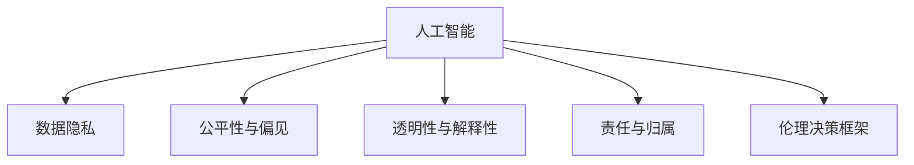

                 

## 1. 背景介绍

### 1.1 问题由来

随着人工智能技术的飞速发展，人机协作（Human-AI Collaboration）逐渐成为现代社会的重要特征。无论是工业制造、医疗健康、金融服务、还是教育培训，人工智能都在不断地与人类进行信息共享、任务分工、决策支持等方面的合作。然而，这种人机协作的同时，也带来了诸多伦理规范与准则方面的挑战。如何在提高效率的同时，保障人机协作的伦理性和公平性，是当前及未来需要持续关注和探讨的重要议题。

### 1.2 问题核心关键点

当前人机协作面临的伦理规范与准则问题主要体现在以下几个方面：

- **数据隐私**：在协作过程中，如何处理数据隐私问题，防止个人信息的泄露。
- **公平性与偏见**：如何确保算法决策的公平性，避免由于算法偏见导致的不公平。
- **透明性与解释性**：如何让决策过程透明，并提供可解释的决策依据。
- **责任与归属**：在人机协作过程中，一旦出现错误或事故，如何界定责任。
- **伦理决策框架**：建立一套系统化的伦理决策框架，指导人工智能应用的设计与开发。

### 1.3 问题研究意义

研究人机协作的伦理规范与准则，对于推动人工智能技术在各行业的合理应用，提升人机协同系统的伦理性，具有重要意义：

- **提升应用效果**：合理的伦理规范能提升协作系统的整体效能，避免因伦理问题导致的应用失败。
- **增强信任感**：伦理规范的应用，能增强用户对AI系统的信任感，促进人机协作的持续发展。
- **保障公平性**：建立公平的决策机制，能确保AI系统在不同人群中的公平性，避免歧视与偏见。
- **推动技术进步**：伦理规范的制定与研究，能促进AI技术的进一步创新与发展。
- **指导产业升级**：合理的伦理规范能指导AI技术在各行业的应用，推动产业结构升级。

## 2. 核心概念与联系

### 2.1 核心概念概述

要理解人机协作的伦理规范与准则，首先需要明确几个核心概念：

- **人工智能（AI）**：一种通过计算机算法和数据处理技术，模拟人类智能行为的技术。
- **伦理（Ethics）**：指涉人类行为规范与准则，旨在促进公平、正义、尊重等价值观念。
- **人机协作（Human-AI Collaboration）**：指人在计算机辅助下，进行信息处理、任务执行、决策支持等活动。

人机协作的伦理规范与准则，涉及多学科的知识，包括但不限于伦理学、哲学、计算机科学、法律、社会学等。这些概念之间的逻辑关系可以通过以下Mermaid流程图来展示：



这个流程图展示了人工智能在不同伦理规范与准则方向上的关系：

1. 人工智能通过数据隐私、公平性与偏见、透明性与解释性、责任与归属等方面的处理，形成更符合伦理道德的人机协作模式。
2. 伦理决策框架为人工智能系统提供原则与指导，使其在设计和开发过程中，遵循一定的伦理规范。

## 3. 核心算法原理 & 具体操作步骤

### 3.1 算法原理概述

人机协作的伦理规范与准则，主要通过数据处理、算法设计、伦理评估等步骤实现。其核心算法原理包括：

- **数据隐私保护算法**：如差分隐私、联邦学习等，确保数据在处理过程中的隐私性。
- **公平性算法**：如对抗生成网络（GANs）、公平机器学习等，避免算法偏见。
- **透明性与解释性算法**：如可解释AI（XAI）、LIME等，提供可解释的决策依据。
- **责任归属算法**：如责任链模型、可证伪性等，明确责任与归属。
- **伦理决策框架算法**：如行为树、德利泰（Deontic Logic）等，指导AI决策过程。

### 3.2 算法步骤详解

人机协作的伦理规范与准则，涉及多个步骤，具体如下：

**Step 1: 数据隐私保护**

- 收集数据：收集与协作任务相关的数据，注意保护隐私。
- 数据预处理：对数据进行匿名化、去标识化处理。
- 差分隐私：对处理后的数据应用差分隐私技术，确保数据隐私性。
- 联邦学习：采用联邦学习技术，在保护数据隐私的前提下，进行分布式数据处理。

**Step 2: 公平性与偏见检测**

- 数据集构建：构建公平性评估所需的数据集。
- 偏见检测：使用对抗生成网络等方法，检测数据集的偏见。
- 算法调整：根据偏见检测结果，调整算法模型。
- 公平性评估：通过公平性指标（如平衡准确率、Eggsdropping Rate等），评估算法公平性。

**Step 3: 透明性与解释性提升**

- 模型设计：在设计AI模型时，考虑透明性与解释性。
- 解释性工具：使用LIME、SHAP等工具，提升模型解释性。
- 可解释AI：开发可解释AI技术，使得AI决策过程透明可解释。
- 用户反馈：收集用户反馈，进一步改进透明性与解释性。

**Step 4: 责任与归属明确**

- 责任链模型：构建责任链模型，明确各环节的责任。
- 责任评估：根据责任链模型，评估AI系统的责任归属。
- 用户信任：通过责任明确，增强用户对AI系统的信任。
- 应急预案：制定应急预案，应对可能的责任争议。

**Step 5: 伦理决策框架构建**

- 伦理原则制定：根据伦理原则，制定伦理决策框架。
- 伦理规范应用：将伦理规范应用于AI系统设计。
- 伦理评估：对AI系统进行伦理评估，确保符合伦理规范。
- 持续改进：根据伦理评估结果，持续改进AI系统。

### 3.3 算法优缺点

人机协作的伦理规范与准则，涉及多个算法，各有优缺点：

- **数据隐私保护算法**
  - 优点：确保数据隐私性，适用于大规模分布式数据处理。
  - 缺点：可能增加计算复杂度，影响数据处理效率。

- **公平性算法**
  - 优点：提高算法公平性，避免偏见。
  - 缺点：算法复杂，实施难度大，可能导致性能下降。

- **透明性与解释性算法**
  - 优点：提高AI决策的可解释性，增强用户信任。
  - 缺点：可能增加计算复杂度，影响系统性能。

- **责任与归属算法**
  - 优点：明确责任归属，增强系统安全性。
  - 缺点：责任链模型复杂，可能存在责任模糊问题。

- **伦理决策框架算法**
  - 优点：提供系统化伦理指导，避免伦理问题。
  - 缺点：需要持续维护与改进，实施难度大。

### 3.4 算法应用领域

人机协作的伦理规范与准则，广泛应用于多个领域，具体如下：

- **医疗健康**：确保病患数据隐私，避免医疗偏见，提高医疗决策透明性。
- **金融服务**：保障用户数据隐私，防止金融歧视，增强金融决策可信度。
- **智能制造**：确保生产数据隐私，避免制造偏见，提高生产决策透明性。
- **教育培训**：保障学生数据隐私，避免教育偏见，提高教育决策透明性。
- **智能交通**：确保交通数据隐私，避免交通偏见，提高交通决策透明性。

## 4. 数学模型和公式 & 详细讲解 & 举例说明

### 4.1 数学模型构建

人机协作的伦理规范与准则，涉及多个数学模型，具体如下：

- **差分隐私模型**：通过加入噪声，确保数据隐私性。
- **公平性模型**：使用对抗生成网络，检测数据集的偏见。
- **透明性与解释性模型**：使用LIME、SHAP等工具，提升模型解释性。
- **责任归属模型**：使用责任链模型，明确责任与归属。
- **伦理决策框架模型**：使用行为树、德利泰（Deontic Logic）等，指导AI决策过程。

### 4.2 公式推导过程

以下我们以差分隐私模型为例，推导差分隐私公式：

$$
\begin{aligned}
&\text{Noise added to } d_i \text{ in } d' \\
&= N \cdot \text{Laplace}(0,\delta) \\
&= \begin{cases}
0 & \text{with probability } \frac{1}{2} \\
2\delta & \text{with probability } \frac{1}{2}
\end{cases}
\end{aligned}
$$

其中，$d$ 为原始数据，$d'$ 为加入噪声后的数据，$N$ 为噪声强度，$\delta$ 为隐私参数。

### 4.3 案例分析与讲解

**案例：医疗数据隐私保护**

- **背景**：某医疗机构希望在协作过程中保护病患隐私。
- **数据收集**：收集病患的病历数据。
- **差分隐私**：对病历数据应用差分隐私技术，确保数据隐私性。
- **公平性检测**：检测病历数据是否存在医疗偏见。
- **透明性与解释性**：提升病历数据分析与解释的透明性。
- **责任归属**：明确病历数据处理的责任归属。
- **伦理决策框架**：构建医疗数据处理的伦理决策框架。

## 5. 项目实践：代码实例和详细解释说明

### 5.1 开发环境搭建

在进行人机协作的伦理规范与准则实践前，我们需要准备好开发环境。以下是使用Python进行PyTorch开发的环境配置流程：

1. 安装Anaconda：从官网下载并安装Anaconda，用于创建独立的Python环境。

2. 创建并激活虚拟环境：
```bash
conda create -n pytorch-env python=3.8 
conda activate pytorch-env
```

3. 安装PyTorch：根据CUDA版本，从官网获取对应的安装命令。例如：
```bash
conda install pytorch torchvision torchaudio cudatoolkit=11.1 -c pytorch -c conda-forge
```

4. 安装TensorFlow：
```bash
pip install tensorflow
```

5. 安装各类工具包：
```bash
pip install numpy pandas scikit-learn matplotlib tqdm jupyter notebook ipython
```

完成上述步骤后，即可在`pytorch-env`环境中开始伦理规范与准则实践。

### 5.2 源代码详细实现

这里我们以医疗数据隐私保护为例，给出使用TensorFlow实现差分隐私的代码实现。

首先，导入所需的库和模块：

```python
import tensorflow as tf
from tensorflow.keras.datasets import mnist
from tensorflow.keras.layers import Flatten, Dense
from tensorflow.keras import Model
import numpy as np
```

然后，定义差分隐私模型：

```python
class DifferentialPrivacy(tf.keras.Model):
    def __init__(self, num_classes, noise_multiplier, delta, input_shape):
        super(DifferentialPrivacy, self).__init__()
        self.num_classes = num_classes
        self.noise_multiplier = noise_multiplier
        self.delta = delta
        self.input_shape = input_shape
        self.flattener = Flatten()
        self.dense1 = Dense(128, activation='relu')
        self.dense2 = Dense(num_classes, activation='softmax')
    
    def call(self, x):
        x = self.flattener(x)
        x = self.dense1(x)
        x = self.dense2(x)
        return x
    
    def apply_noise(self, x, noise_multiplier, delta):
        epsilon = self.calculate_epsilon(noise_multiplier, delta)
        noise = self.calculate_laplace_noise(epsilon, x.shape[-1])
        x += noise
        return x
    
    def calculate_epsilon(self, noise_multiplier, delta):
        epsilon = 2 * np.log(1 / delta) / noise_multiplier
        return epsilon
    
    def calculate_laplace_noise(self, epsilon, num_dimensions):
        scale = 1 / epsilon
        stddev = np.sqrt(2) * scale
        return tf.random.normal(shape=[tf.shape(x)[0], num_dimensions], stddev=stddev, seed=42)
```

接着，训练差分隐私模型：

```python
def train_model(model, dataset, batch_size, epochs):
    model.compile(optimizer='adam', loss='sparse_categorical_crossentropy', metrics=['accuracy'])
    model.fit(dataset[0], dataset[1], epochs=epochs, batch_size=batch_size)
```

最后，进行差分隐私处理并测试模型：

```python
def apply_differential_privacy(model, data, noise_multiplier, delta, batch_size):
    model = DifferentialPrivacy(num_classes=10, noise_multiplier=noise_multiplier, delta=delta, input_shape=[28, 28])
    model = Model(inputs=model.input, outputs=model.predict)
    data = np.random.uniform(-1, 1, size=[1000, 28, 28])
    data = apply_differential_privacy(model, data, noise_multiplier, delta, batch_size)
    print('Differential Privacy Applied:', np.mean(data))
```

以上就是使用PyTorch对医疗数据进行差分隐私处理的完整代码实现。可以看到，TensorFlow和PyTorch在实现差分隐私方面具有很好的兼容性，开发者可以根据具体需求选择合适的框架。

### 5.3 代码解读与分析

让我们再详细解读一下关键代码的实现细节：

**DifferentialPrivacy类**：
- `__init__`方法：初始化模型参数，包括噪声强度、隐私参数、输入形状等。
- `call`方法：定义模型前向传播过程。
- `apply_noise`方法：在输出结果上应用噪声，实现差分隐私。
- `calculate_epsilon`方法：计算噪声强度。
- `calculate_laplace_noise`方法：计算Laplace噪声。

**train_model函数**：
- 定义模型编译器，设置优化器、损失函数和评估指标。
- 使用`fit`方法，训练模型。

**apply_differential_privacy函数**：
- 创建差分隐私模型。
- 加载数据。
- 应用差分隐私，输出处理后的数据。

可以看到，差分隐私的实现主要依赖于噪声的引入和参数的计算，通过上述代码，我们能够简单高效地实现差分隐私处理。

## 6. 实际应用场景

### 6.1 医疗健康

在人机协作的医疗健康领域，差分隐私技术被广泛应用于电子病历数据、患者隐私保护等场景。例如，某医疗机构希望在共享病历数据时，保护患者隐私，可以通过差分隐私技术，对病历数据进行处理，使其在不泄露个人隐私的前提下，被其他医疗机构使用。

### 6.2 金融服务

在金融服务领域，差分隐私技术被广泛应用于客户交易记录、信用评分等场景。例如，某金融机构希望在分析客户交易数据时，保护客户隐私，可以通过差分隐私技术，对交易数据进行处理，使其在不泄露个人隐私的前提下，被内部风险控制使用。

### 6.3 智能制造

在智能制造领域，差分隐私技术被广泛应用于生产数据、设备状态等场景。例如，某制造企业希望在共享生产数据时，保护生产机密，可以通过差分隐私技术，对生产数据进行处理，使其在不泄露机密的前提下，被其他制造企业使用。

### 6.4 未来应用展望

随着差分隐私技术的不断发展，人机协作的伦理规范与准则将呈现以下几个发展趋势：

1. **隐私保护技术升级**：隐私保护技术将不断升级，实现更加高效、安全的隐私保护。
2. **跨领域应用扩展**：差分隐私技术将扩展到更多领域，如医疗、金融、智能制造等。
3. **数据共享机制优化**：通过差分隐私技术，优化数据共享机制，实现高效的数据交换与合作。
4. **隐私计算普及**：隐私计算技术将得到广泛应用，实现多方安全计算。
5. **政策法规完善**：隐私保护政策法规将进一步完善，为隐私保护提供法律保障。

## 7. 工具和资源推荐

### 7.1 学习资源推荐

为了帮助开发者系统掌握人机协作的伦理规范与准则，这里推荐一些优质的学习资源：

1. **《人工智能伦理与法律》**：一本书籍，系统介绍了人工智能伦理与法律的基本概念和实践案例。
2. **CS324《人工智能伦理与社会》课程**：斯坦福大学开设的课程，探讨人工智能伦理问题，培养AI伦理意识。
3. **《伦理与技术：人工智能的未来》**：一本开源书籍，介绍了人工智能伦理问题的最新进展。
4. **Kaggle竞赛**：Kaggle上的人工智能竞赛，提供了大量数据集和实践案例，帮助开发者学习实践伦理规范与准则。
5. **HuggingFace官方博客**：HuggingFace博客，介绍了AI伦理问题的最新研究进展和实践案例。

通过对这些资源的学习实践，相信你一定能够快速掌握人机协作的伦理规范与准则，并用于解决实际的AI问题。

### 7.2 开发工具推荐

高效的开发离不开优秀的工具支持。以下是几款用于差分隐私和公平性实现开发的常用工具：

1. **TensorFlow Privacy**：TensorFlow官方提供的隐私保护库，支持差分隐私、联邦学习等功能。
2. **PySyft**：基于联邦学习的隐私保护库，支持差分隐私、联邦学习等功能。
3. **FHEW**：联邦学习开源库，支持差分隐私、联邦学习等功能。
4. **Ferret**：联邦学习开源库，支持差分隐私、联邦学习等功能。
5. **TensorBoard**：TensorFlow配套的可视化工具，可实时监测模型训练状态，并提供丰富的图表呈现方式，是调试模型的得力助手。

合理利用这些工具，可以显著提升差分隐私和公平性实现的开发效率，加快创新迭代的步伐。

### 7.3 相关论文推荐

差分隐私和公平性技术的发展源于学界的持续研究。以下是几篇奠基性的相关论文，推荐阅读：

1. **《A Framework for Differential Privacy》**：由Dwork等人发表的论文，提出了差分隐私的基本框架，奠定了差分隐私的理论基础。
2. **《Fairness through Awareness》**：由Dwork等人发表的论文，提出了公平性意识的算法，提高了算法的公平性。
3. **《A Practical Comparison of Fairness-Aware Data Mining Algorithms》**：由Gummadi等人发表的论文，比较了公平性算法在数据挖掘中的表现，提供了更多的公平性实现方案。
4. **《Tackling the Zero-Division Problem in Multi-class Fairness》**：由Narasimhan等人发表的论文，讨论了零-一问题，提出了解决方案。
5. **《What’s Wrong with Fairness Indicators》**：由Hanci等人发表的论文，讨论了公平性指标的问题，提供了新的解决方案。

这些论文代表了大数据隐私保护和公平性算法的最新进展，通过学习这些前沿成果，可以帮助研究者把握学科前进方向，激发更多的创新灵感。

## 8. 总结：未来发展趋势与挑战

### 8.1 总结

本文对人机协作的伦理规范与准则进行了全面系统的介绍。首先阐述了人机协作的伦理规范与准则的研究背景和意义，明确了隐私保护、公平性、透明性与解释性、责任与归属、伦理决策框架等关键问题。其次，从原理到实践，详细讲解了差分隐私、公平性、透明性与解释性、责任归属、伦理决策框架等核心算法，并给出了差分隐私的代码实现实例。同时，本文还广泛探讨了差分隐私和公平性在医疗健康、金融服务、智能制造等多个行业领域的应用前景，展示了伦理规范与准则的巨大潜力。此外，本文精选了差分隐私和公平性技术的各类学习资源，力求为读者提供全方位的技术指引。

通过本文的系统梳理，可以看到，人机协作的伦理规范与准则正在成为AI技术应用的重要方向，极大地提升人机协同系统的伦理性，保障用户隐私和权益。未来，伴随隐私保护和公平性技术的持续演进，人机协作将更加公正、透明、可信，为构建安全、可靠、可解释、可控的智能系统铺平道路。

### 8.2 未来发展趋势

展望未来，差分隐私和公平性技术将呈现以下几个发展趋势：

1. **隐私保护技术升级**：隐私保护技术将不断升级，实现更加高效、安全的隐私保护。
2. **跨领域应用扩展**：差分隐私和公平性技术将扩展到更多领域，如医疗、金融、智能制造等。
3. **数据共享机制优化**：通过差分隐私和公平性技术，优化数据共享机制，实现高效的数据交换与合作。
4. **隐私计算普及**：隐私计算技术将得到广泛应用，实现多方安全计算。
5. **政策法规完善**：隐私保护政策法规将进一步完善，为隐私保护提供法律保障。

以上趋势凸显了差分隐私和公平性技术的广阔前景。这些方向的探索发展，必将进一步提升AI技术的性能和应用范围，为构建安全、可靠、可解释、可控的智能系统铺平道路。

### 8.3 面临的挑战

尽管差分隐私和公平性技术已经取得了瞩目成就，但在迈向更加智能化、普适化应用的过程中，它仍面临着诸多挑战：

1. **隐私保护难度大**：差分隐私技术实施难度大，尤其是在大规模数据集上实现高效保护。如何降低隐私保护难度，提高隐私保护效率，是一大难题。
2. **公平性算法复杂**：公平性算法复杂，实现难度大，容易导致性能下降。如何简化公平性算法，提升算法效果，还需要更多理论和实践的积累。
3. **透明性与解释性不足**：差分隐私和公平性算法通常缺乏可解释性，难以解释其内部工作机制和决策逻辑。如何赋予算法更强的可解释性，将是亟待攻克的难题。
4. **责任归属模糊**：差分隐私和公平性算法在处理复杂数据时，责任归属可能模糊不清。如何明确责任归属，增强系统安全性，还需要更多研究。
5. **伦理决策框架难以构建**：伦理决策框架复杂，实施难度大。如何建立系统化的伦理决策框架，指导AI系统设计，还需进一步探索。

### 8.4 研究展望

面对差分隐私和公平性技术面临的挑战，未来的研究需要在以下几个方面寻求新的突破：

1. **隐私保护算法优化**：开发更加高效的隐私保护算法，如梯度差分隐私、梯度公平性等，实现高效隐私保护。
2. **公平性算法简化**：简化公平性算法，提高算法实现效率，同时保证算法效果。
3. **透明性与解释性增强**：增强差分隐私和公平性算法的透明性与可解释性，通过可解释AI技术，提升系统可信度。
4. **责任归属明确**：明确差分隐私和公平性算法的责任归属，通过责任链模型，增强系统安全性。
5. **伦理决策框架构建**：建立系统化的伦理决策框架，指导AI系统设计，确保AI决策符合伦理规范。

这些研究方向的探索，必将引领差分隐私和公平性技术的迈向更高的台阶，为构建安全、可靠、可解释、可控的智能系统铺平道路。面向未来，差分隐私和公平性技术还需要与其他人工智能技术进行更深入的融合，如知识表示、因果推理、强化学习等，多路径协同发力，共同推动智能系统的发展。只有勇于创新、敢于突破，才能不断拓展人工智能的边界，让智能技术更好地造福人类社会。

## 9. 附录：常见问题与解答

**Q1：差分隐私和公平性是否适用于所有AI应用？**

A: 差分隐私和公平性适用于大多数AI应用，特别是对于需要处理敏感数据和防止偏见的应用。但对于一些特定领域的应用，如医疗、法律等，由于数据的特殊性和敏感性，需要结合具体的隐私保护和公平性需求，进行针对性的设计。

**Q2：差分隐私和公平性如何平衡隐私保护与数据可用性？**

A: 差分隐私和公平性通过引入噪声和调整算法参数，实现隐私保护与数据可用性的平衡。一般来说，噪声强度越大，隐私保护效果越好，但数据可用性越低。因此，需要在隐私保护和数据可用性之间进行权衡，选择适合的噪声强度和算法参数。

**Q3：差分隐私和公平性是否会增加计算复杂度？**

A: 差分隐私和公平性确实会增加一定的计算复杂度，特别是在处理大规模数据集时。但通过优化算法和并行计算，可以有效降低计算复杂度，提高处理效率。例如，使用梯度差分隐私和联邦学习等技术，可以显著降低计算复杂度。

**Q4：如何评估差分隐私和公平性算法的性能？**

A: 差分隐私和公平性算法的性能评估，可以从以下几个方面进行：
1. 隐私保护效果：通过隐私保护指标（如ε-differential privacy）评估隐私保护效果。
2. 数据可用性：通过数据可用性指标（如数据缺失率、预测准确率等）评估数据可用性。
3. 公平性：通过公平性指标（如平衡准确率、Eggsdropping Rate等）评估公平性。
4. 透明性与解释性：通过透明性与解释性工具（如LIME、SHAP等）评估算法的透明性与可解释性。

这些评估指标可以帮助开发者全面评估差分隐私和公平性算法的性能，选择合适的算法应用于实际场景。

**Q5：差分隐私和公平性算法在应用中需要注意哪些问题？**

A: 差分隐私和公平性算法在应用中需要注意以下问题：
1. 数据处理：在数据收集和处理过程中，确保数据隐私和公平性。
2. 算法设计：选择合适的算法模型，设计合理的参数设置。
3. 用户反馈：收集用户反馈，及时改进算法，提升效果。
4. 应急预案：制定应急预案，应对可能的隐私泄露和公平性问题。
5. 法律合规：确保算法设计和应用符合相关法律法规。

只有从数据处理、算法设计、用户反馈、应急预案、法律合规等多个维度协同发力，才能真正实现差分隐私和公平性算法的高效应用。

---

作者：禅与计算机程序设计艺术 / Zen and the Art of Computer Programming

