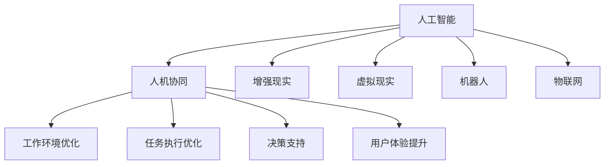

                 

# 人机协同：未来工作的核心驱动力

## 1. 背景介绍

### 1.1 问题由来
随着科技的迅猛发展，人工智能(AI)技术正逐渐渗透到社会的各个层面，从医疗、金融、制造业到娱乐、教育、城市治理等众多领域，AI都在提供强大的技术支持。尤其是在智能办公、智能制造、智能客服、智能家居等领域，AI已经展现出其巨大的潜力。

然而，尽管AI技术发展迅速，其应用仍面临诸多挑战。在某种程度上，AI技术的核心优势在于其超强的计算能力和处理海量数据的能力，但其缺点在于无法完全替代人类的创造力、情感和直觉。因此，AI与人类之间的协同工作将成为未来工作的核心驱动力。

### 1.2 问题核心关键点
人机协同的核心在于充分发挥AI与人类各自的优点，共同完成复杂任务。具体来说，可以概括为以下几个方面：

1. **增强决策支持**：AI通过数据分析和模式识别，提供决策支持，提升决策质量，缩短决策时间。
2. **优化任务执行**：AI负责重复性、高风险和高强度的任务，释放人类员工的时间和精力，专注于高价值和创造性的工作。
3. **提升工作环境**：AI通过自动化和智能化管理，优化工作流程，提升工作效率，减少人为错误。
4. **增强用户体验**：AI通过个性化和交互式服务，提升用户满意度，提升服务质量。

## 2. 核心概念与联系

### 2.1 核心概念概述

为更好地理解人机协同的核心概念和应用，本节将介绍几个密切相关的核心概念：

- **人工智能(AI)**：涵盖机器学习、深度学习、自然语言处理、计算机视觉等众多领域，通过算法和模型，使计算机具备类似于人类的智能能力。
- **人机协同**：指AI与人类在特定任务中的协同工作，充分发挥各自优势，提高工作效率和质量。
- **增强现实(AR)**：通过计算机生成的虚拟信息与真实世界的结合，增强人类的感知和操作能力。
- **虚拟现实(VR)**：通过计算机生成的3D虚拟环境，模拟人类在现实世界中的体验。
- **机器人(Robotics)**：结合机械、电子、计算机技术，构建具有自主决策和执行能力的智能机器人。
- **物联网(IoT)**：通过传感器、通信技术，实现物理世界和信息世界的互联互通。

这些核心概念之间的逻辑关系可以通过以下Mermaid流程图来展示：



这个流程图展示了大规模语言模型微调的各个核心概念及其之间的关系：

1. 人工智能通过学习和推理，提供协同工作的技术基础。
2. 人机协同使AI与人类在特定任务中相互补充，充分发挥各自优势。
3. 增强现实、虚拟现实、机器人、物联网等技术，为协同工作提供更高效、更沉浸、更智能的工作环境。

这些概念共同构成了未来工作的技术基础，为人机协同提供了多样化的技术手段和应用场景。通过理解这些核心概念，我们可以更好地把握人机协同的工作原理和优化方向。

## 3. 核心算法原理 & 具体操作步骤
### 3.1 算法原理概述

人机协同的核心算法原理基于以下几个关键环节：

1. **数据预处理**：对现实世界的数据进行收集、清洗和标注，准备用于训练AI模型的数据集。
2. **模型训练**：使用机器学习或深度学习算法，对数据集进行训练，构建AI模型。
3. **协同决策**：将AI模型嵌入到工作流程中，与人协同完成决策任务。
4. **任务执行**：将AI模型用于自动执行重复性、高风险和高强度的任务，释放人类员工的时间和精力。
5. **反馈优化**：通过实时反馈机制，不断优化AI模型和协同工作流程。

### 3.2 算法步骤详解

以下我们将详细介绍人机协同的核心算法步骤：

**Step 1: 数据预处理**
- 收集与特定任务相关的数据，例如生产线的监控数据、客服聊天记录、员工绩效数据等。
- 对数据进行清洗，去除异常值、重复数据等噪声。
- 对数据进行标注，为AI模型提供监督信号。

**Step 2: 模型训练**
- 选择合适的机器学习或深度学习算法，如线性回归、支持向量机、神经网络等。
- 使用标注数据集，对模型进行训练，优化模型参数。
- 使用验证集，对模型进行验证，防止过拟合。

**Step 3: 协同决策**
- 将训练好的AI模型嵌入到工作流程中，与人协同完成决策任务。
- 设定AI模型和人类员工的协同规则，明确各自职责。
- 实时监测协同决策的效果，优化协同流程。

**Step 4: 任务执行**
- 使用AI模型自动执行重复性、高风险和高强度的任务，如机器人进行自动化生产、智能客服进行自动回复等。
- 通过反馈机制，不断优化任务的执行效果。

**Step 5: 反馈优化**
- 实时收集任务执行的反馈信息，评估AI模型的表现。
- 根据反馈信息，调整AI模型参数，优化协同流程。
- 定期进行模型再训练，保持AI模型的性能和准确性。

### 3.3 算法优缺点

人机协同的算法具有以下优点：
1. 提高工作效率：AI模型可以自动执行重复性、高风险和高强度的任务，释放人类员工的时间和精力。
2. 提升决策质量：AI模型通过数据分析和模式识别，提供决策支持，提升决策质量。
3. 优化工作流程：AI模型通过自动化和智能化管理，优化工作流程，提升工作效率。
4. 增强用户体验：AI模型通过个性化和交互式服务，提升用户满意度，提升服务质量。

同时，该算法也存在一些局限性：
1. 数据依赖性：协同工作的有效性依赖于高质量的数据，数据收集和标注的成本较高。
2. 模型复杂度：高复杂度的AI模型需要大量计算资源，部署成本较高。
3. 人机信任问题：AI模型和人类员工之间的信任关系建立需要时间，协同工作的初期效果可能不佳。
4. 技术门槛高：需要具备一定的技术背景，对企业和员工的技术水平要求较高。

尽管存在这些局限性，但就目前而言，人机协同算法仍是最为主流的工作协同方式。未来相关研究的重点在于如何进一步降低数据和算力成本，提高协同工作的效果，同时兼顾用户的安全和隐私等因素。

### 3.4 算法应用领域

人机协同的算法已经在多个领域得到了广泛的应用，例如：

- 智能制造：通过机器人和自动化系统，提高生产效率和质量，降低生产成本。
- 智能客服：使用AI模型自动回复用户咨询，提升服务质量和用户体验。
- 智能家居：通过智能设备和AI算法，提高家居的智能化水平，提升用户的生活质量。
- 智能办公：通过智能办公软件，提高办公效率，优化工作流程。
- 智能物流：使用无人机、机器人等设备，提升物流配送的效率和准确性。

除了上述这些经典应用外，人机协同还在更多场景中得到创新性应用，如智能交通、智能医疗、智能金融等，为各行各业带来了新的变革。随着AI技术的不断发展，未来人机协同将有更广阔的应用前景。

## 4. 数学模型和公式 & 详细讲解
### 4.1 数学模型构建

在人机协同中，我们通常使用机器学习和深度学习算法构建AI模型，以便能够处理复杂的数据并提取有效的特征。以下是一些常用的数学模型：

- **线性回归**：模型公式为 $y = \theta_0 + \theta_1 x_1 + \theta_2 x_2 + ... + \theta_n x_n$，用于处理线性关系的数据。
- **支持向量机(SVM)**：模型公式为 $f(x) = \sum_{i=1}^{n} \alpha_i y_i K(x_i,x) - \frac{1}{2} \sum_{i=1}^{n} \alpha_i^2$，用于处理非线性关系的数据。
- **神经网络**：模型公式为 $f(x) = \sum_{i=1}^{n} \sigma(w_i x + b_i)$，其中 $\sigma$ 为激活函数，用于处理复杂的非线性关系数据。

### 4.2 公式推导过程

以线性回归模型为例，其核心思想是通过最小二乘法，找到最优的线性拟合函数。假设我们有 $N$ 个样本 $(x_i, y_i)$，模型参数为 $\theta = (\theta_0, \theta_1, ..., \theta_n)$，则线性回归模型的目标是最小化均方误差：

$$
\min_{\theta} \frac{1}{N} \sum_{i=1}^{N} (y_i - (\theta_0 + \theta_1 x_1 + ... + \theta_n x_n))^2
$$

通过求导，可以得到每个参数的最优值：

$$
\theta_j = \frac{\sum_{i=1}^{N} (x_{ij} y_i - \bar{x}_{ij} \bar{y})}{\sum_{i=1}^{N} (x_{ij}^2 - \bar{x}_{ij}^2)}
$$

其中 $\bar{x}_{ij}$ 和 $\bar{y}$ 分别为样本特征和标签的均值。

### 4.3 案例分析与讲解

假设我们要构建一个用于智能制造的AI模型，其目标是预测生产线上的设备故障概率。我们收集了过去一年内生产线上的监控数据，包括温度、湿度、压力等环境参数，以及设备的故障记录。

1. **数据预处理**：对数据进行清洗和标注，将设备故障标记为 1，否则标记为 0。
2. **模型训练**：使用线性回归模型对数据进行训练，得到模型的参数 $\theta$。
3. **协同决策**：在生产线上实时监测环境参数，输入到训练好的模型中，预测设备故障概率。
4. **任务执行**：根据预测结果，安排维修人员进行设备检修。
5. **反馈优化**：实时收集维修结果，评估模型预测的准确性，调整模型参数，优化协同流程。

通过这种人机协同的方式，智能制造系统能够高效、准确地预测设备故障，提升生产线的稳定性和可靠性。

## 5. 项目实践：代码实例和详细解释说明
### 5.1 开发环境搭建

在进行人机协同项目开发前，我们需要准备好开发环境。以下是使用Python进行TensorFlow开发的环境配置流程：

1. 安装Anaconda：从官网下载并安装Anaconda，用于创建独立的Python环境。

2. 创建并激活虚拟环境：
```bash
conda create -n tensorflow-env python=3.8 
conda activate tensorflow-env
```

3. 安装TensorFlow：根据CUDA版本，从官网获取对应的安装命令。例如：
```bash
conda install tensorflow -c tensorflow -c conda-forge
```

4. 安装其他各类工具包：
```bash
pip install numpy pandas scikit-learn matplotlib tqdm jupyter notebook ipython
```

完成上述步骤后，即可在`tensorflow-env`环境中开始人机协同实践。

### 5.2 源代码详细实现

以下是一个基于TensorFlow的智能客服系统实现示例，其中使用了深度学习算法构建AI模型：

```python
import tensorflow as tf
from tensorflow.keras.layers import Input, Dense, Embedding, Dropout, LSTM, Bidirectional, Concatenate, TimeDistributed
from tensorflow.keras.models import Model
from tensorflow.keras.optimizers import Adam

# 构建模型
def build_model(input_dim, output_dim):
    inputs = Input(shape=(input_len, input_dim), name='inputs')
    x = TimeDistributed(Embedding(vocab_size, embed_dim))(inputs)
    x = Bidirectional(LSTM(lstm_units, return_sequences=True))(x)
    x = TimeDistributed(Dense(output_dim, activation='softmax'))(x)
    return Model(inputs=inputs, outputs=x)

# 训练模型
def train_model(model, train_data, val_data, epochs, batch_size):
    model.compile(optimizer=Adam(learning_rate=0.001), loss='categorical_crossentropy', metrics=['accuracy'])
    model.fit(train_data, epochs=epochs, batch_size=batch_size, validation_data=val_data)

# 定义数据预处理函数
def preprocess_data(data):
    # 将文本转换为向量表示
    tokenizer = Tokenizer()
    tokenizer.fit_on_texts(data)
    x = tokenizer.texts_to_sequences(data)
    x = pad_sequences(x, maxlen=input_len)
    return x

# 加载数据集
train_data = preprocess_data(train_texts)
val_data = preprocess_data(val_texts)

# 构建模型
input_dim = vocab_size
output_dim = 1
model = build_model(input_dim, output_dim)

# 训练模型
train_model(model, train_data, val_data, epochs=10, batch_size=32)

# 使用模型进行预测
def predict(model, test_data):
    test_data = preprocess_data(test_data)
    predictions = model.predict(test_data)
    return predictions
```

以上就是使用TensorFlow进行智能客服系统构建的完整代码实现。可以看到，通过定义合适的神经网络结构，使用TensorFlow提供的高级API，我们可以快速构建和训练深度学习模型。

### 5.3 代码解读与分析

让我们再详细解读一下关键代码的实现细节：

**build_model函数**：
- 定义了一个基于LSTM的时间序列模型，用于处理自然语言数据。
- 输入层定义了输入文本的维度和长度，输出层定义了预测输出的维度。

**train_model函数**：
- 编译模型，使用Adam优化器和交叉熵损失函数。
- 使用fit方法进行模型训练，并在验证集上进行评估。

**preprocess_data函数**：
- 将文本转换为向量表示，使用Tokenizer将文本分词并编码。
- 使用pad_sequences对序列进行填充，确保序列长度一致。

**加载数据集**：
- 使用preprocess_data函数对训练集和验证集进行预处理。

**构建模型**：
- 定义输入维度和输出维度，调用build_model函数构建模型。

**训练模型**：
- 使用train_model函数训练模型，并在验证集上进行评估。

**使用模型进行预测**：
- 使用predict函数对测试集进行预测。

通过以上代码实现，我们能够快速构建和训练基于深度学习的智能客服系统，实现人机协同的对话功能。

## 6. 实际应用场景
### 6.1 智能制造

在智能制造领域，人机协同可以显著提升生产线的智能化水平，降低生产成本，提高生产效率。通过部署机器人、自动化设备和AI模型，生产线可以实现自适应调整、故障预测和预测性维护等功能。

具体而言，AI模型可以处理实时采集的生产数据，预测设备故障，并自动发送维护请求。机器人可以自动进行设备检修和维护，提高生产线的可靠性和稳定性。通过这种人机协同的工作方式，制造业企业可以大幅降低生产成本，提高生产效率。

### 6.2 智能客服

在智能客服领域，人机协同可以提升客户咨询体验，提高客服效率，减少人力成本。通过使用AI模型，客服系统可以自动处理常见问题，提供24/7的服务，减少人工客服的工作量。

具体而言，AI模型可以理解客户咨询的意图，并自动匹配最佳回复。对于复杂或特殊的问题，系统可以自动转接到人工客服。通过这种人机协同的工作方式，企业可以提升客服效率，降低人力成本，提高客户满意度。

### 6.3 智能家居

在智能家居领域，人机协同可以实现更加智能化、个性化的生活体验。通过部署智能设备和AI算法，家居系统可以实现语音识别、智能控制、环境监测等功能。

具体而言，智能设备可以自动感知用户的意图，并自动执行相应的操作，如智能灯自动开关、智能空调自动调节温度等。AI模型可以根据用户的偏好和历史行为，自动调整家居设备的运行状态。通过这种人机协同的工作方式，用户可以享受更加便捷、舒适的生活体验。

### 6.4 未来应用展望

随着技术的不断发展，人机协同在更多领域将得到应用，为各行各业带来变革性影响。

在智慧医疗领域，人机协同可以提高医疗服务的智能化水平，辅助医生诊断，提升诊疗效率。在智能交通领域，人机协同可以实现交通流量的优化，提升交通效率，降低交通事故。在智能金融领域，人机协同可以提高金融交易的准确性和安全性，提升用户信任度。

此外，在教育、旅游、城市治理等众多领域，人机协同也有广泛的应用前景。未来，随着技术的不断进步，人机协同将成为各行各业的重要驱动力，为人类社会的全面智能化奠定基础。

## 7. 工具和资源推荐
### 7.1 学习资源推荐

为了帮助开发者系统掌握人机协同的理论基础和实践技巧，这里推荐一些优质的学习资源：

1. 《深度学习》系列书籍：涵盖深度学习的基本原理和算法，适合初学者入门。
2. 《TensorFlow实战》系列博文：详细讲解TensorFlow框架的使用方法和最佳实践。
3. 《Keras实战》系列课程：介绍Keras框架的使用方法，适合快速上手实践。
4. 《人机协同》系列论文：涵盖人机协同的理论基础和应用案例，适合深入学习。
5. 《智能系统》系列课程：介绍智能系统构建的原理和方法，适合系统开发者学习。

通过对这些资源的学习实践，相信你一定能够快速掌握人机协同的理论基础和实践技巧，并用于解决实际的业务问题。

### 7.2 开发工具推荐

高效的开发离不开优秀的工具支持。以下是几款用于人机协同开发的常用工具：

1. TensorFlow：由Google主导开发的开源深度学习框架，生产部署方便，适合大规模工程应用。
2. PyTorch：基于Python的开源深度学习框架，灵活动态的计算图，适合快速迭代研究。
3. Keras：基于TensorFlow和Theano的高层次API，适合快速上手实践。
4. TensorBoard：TensorFlow配套的可视化工具，可实时监测模型训练状态，并提供丰富的图表呈现方式。
5. Weights & Biases：模型训练的实验跟踪工具，可以记录和可视化模型训练过程中的各项指标，方便对比和调优。

合理利用这些工具，可以显著提升人机协同任务的开发效率，加快创新迭代的步伐。

### 7.3 相关论文推荐

人机协同技术的发展源于学界的持续研究。以下是几篇奠基性的相关论文，推荐阅读：

1. AlphaGo论文：展示了AI在复杂游戏中的胜利，展示了AI在策略优化方面的潜力。
2. GPT-3论文：展示了AI在大规模语言模型上的应用，展示了AI在自然语言处理方面的潜力。
3. DeepMind论文：展示了AI在机器人运动控制方面的应用，展示了AI在物理交互方面的潜力。
4. Tesla AI论文：展示了AI在自动驾驶方面的应用，展示了AI在现实世界应用中的潜力。
5. MIT论文：展示了AI在医疗影像分析方面的应用，展示了AI在复杂数据分析方面的潜力。

这些论文代表了大规模语言模型微调技术的发展脉络。通过学习这些前沿成果，可以帮助研究者把握学科前进方向，激发更多的创新灵感。

## 8. 总结：未来发展趋势与挑战
### 8.1 总结

本文对基于人机协同的工作协同方法进行了全面系统的介绍。首先阐述了人机协同的研究背景和意义，明确了人机协同在提高工作效率、优化决策质量、改善用户体验等方面的独特价值。其次，从原理到实践，详细讲解了人机协同的数学模型和关键步骤，给出了人机协同任务开发的完整代码实例。同时，本文还广泛探讨了人机协同在智能制造、智能客服、智能家居等多个行业领域的应用前景，展示了人机协同范式的巨大潜力。此外，本文精选了人机协同技术的各类学习资源，力求为读者提供全方位的技术指引。

通过本文的系统梳理，可以看到，基于人机协同的工作协同方法正在成为未来工作的核心驱动力，极大地拓展了人工智能技术的应用边界，催生了更多的落地场景。受益于大规模语料的预训练和深度学习模型的优化，人机协同系统能够在更广泛的领域发挥作用，带来更高的生产效率和更好的用户体验。未来，伴随AI技术的不断发展，人机协同技术也将迎来新的突破，为构建安全、可靠、可解释、可控的智能系统铺平道路。

### 8.2 未来发展趋势

展望未来，人机协同技术将呈现以下几个发展趋势：

1. 智能化水平持续提升。随着AI技术的不断发展，智能设备将具备更加强大的感知、决策和执行能力，能够更加精准地完成复杂任务。
2. 人机交互方式多样化。未来的智能系统将具备更丰富、更自然的人机交互方式，如语音交互、手势识别、情感识别等，提升用户的使用体验。
3. 协同任务多样化。未来的人机协同将不仅局限于特定任务，将逐步拓展到更广泛的任务领域，如综合管理、协同创新等。
4. 个性化定制化发展。未来的智能系统将具备更高的个性化和定制化能力，能够根据用户需求提供量身定制的服务。
5. 跨平台跨设备协同。未来的智能系统将具备更强的跨平台和跨设备协同能力，能够实现无缝衔接，提高工作效率。
6. 数据安全与隐私保护。随着数据应用场景的不断扩展，数据安全和隐私保护将成为人机协同技术的重要研究课题。

以上趋势凸显了人机协同技术的广阔前景。这些方向的探索发展，必将进一步提升智能系统的性能和应用范围，为人类社会的全面智能化奠定基础。

### 8.3 面临的挑战

尽管人机协同技术已经取得了瞩目成就，但在迈向更加智能化、普适化应用的过程中，它仍面临着诸多挑战：

1. 数据依赖性。协同工作的有效性依赖于高质量的数据，数据收集和标注的成本较高。
2. 技术复杂性。人机协同系统需要具备复杂的算法和模型，部署和维护难度较大。
3. 安全性问题。AI模型可能学习到有害信息，通过协同工作传递到下游任务，产生误导性输出。
4. 可解释性问题。AI模型的决策过程通常缺乏可解释性，难以对其推理逻辑进行分析和调试。
5. 跨领域协同问题。不同领域的应用场景差异较大，人机协同系统需要在多领域中协同工作，面临复杂的技术挑战。

尽管存在这些挑战，但就目前而言，人机协同仍是最为主流的工作协同方式。未来相关研究的重点在于如何进一步降低数据和算力成本，提高协同工作的效果，同时兼顾用户的安全和隐私等因素。

### 8.4 研究展望

面对人机协同面临的种种挑战，未来的研究需要在以下几个方面寻求新的突破：

1. 探索无监督和半监督协同方法。摆脱对大规模标注数据的依赖，利用自监督学习、主动学习等无监督和半监督范式，最大限度利用非结构化数据，实现更加灵活高效的协同工作。
2. 研究参数高效和计算高效的协同范式。开发更加参数高效的协同方法，在固定大部分协同参数的同时，只更新极少量的任务相关参数。同时优化协同模型的计算图，减少前向传播和反向传播的资源消耗，实现更加轻量级、实时性的部署。
3. 引入更多先验知识。将符号化的先验知识，如知识图谱、逻辑规则等，与神经网络模型进行巧妙融合，引导协同工作学习更准确、合理的知识表示。同时加强不同模态数据的整合，实现视觉、语音等多模态信息与文本信息的协同建模。
4. 结合因果分析和博弈论工具。将因果分析方法引入协同工作，识别出协同决策的关键特征，增强协同工作输出的因果性和逻辑性。借助博弈论工具刻画人机交互过程，主动探索并规避协同工作的脆弱点，提高系统稳定性。
5. 纳入伦理道德约束。在协同工作的目标中引入伦理导向的评估指标，过滤和惩罚有害的协同工作输出，确保协同工作符合人类价值观和伦理道德。

这些研究方向的探索，必将引领人机协同技术迈向更高的台阶，为构建安全、可靠、可解释、可控的智能系统铺平道路。面向未来，人机协同技术还需要与其他人工智能技术进行更深入的融合，如知识表示、因果推理、强化学习等，多路径协同发力，共同推动智能系统的发展。只有勇于创新、敢于突破，才能不断拓展人机协同的边界，让智能技术更好地造福人类社会。

## 9. 附录：常见问题与解答

**Q1：如何选择合适的协同算法？**

A: 选择合适的协同算法需要根据具体任务和数据特点进行评估。常见的协同算法包括线性回归、支持向量机、神经网络等。一般建议先尝试简单的线性回归或支持向量机，评估其效果后，再使用更复杂的神经网络算法。

**Q2：协同过程中如何处理异常数据？**

A: 异常数据会对协同工作的效果产生负面影响。一般建议对数据进行清洗，去除异常值和重复数据，确保数据的质量和一致性。

**Q3：协同工作中的数据隐私和安全问题如何保障？**

A: 数据隐私和安全是人机协同中必须考虑的重要问题。一般建议采用数据脱敏、加密等技术，保护数据隐私。同时，建立数据访问权限控制机制，确保只有授权人员可以访问数据。

**Q4：协同工作中的模型解释性问题如何解决？**

A: 模型的解释性是人机协同中必须考虑的重要问题。一般建议采用可解释的模型，如决策树、线性回归等，增强模型的可解释性。同时，建立模型解释和审核机制，确保模型输出的合理性。

**Q5：协同工作中的跨领域协同问题如何解决？**

A: 跨领域协同是人机协同中的难点问题。一般建议采用领域适应方法，如迁移学习、元学习等，增强模型在不同领域中的泛化能力。同时，建立领域知识库，帮助模型更好地适应不同领域。

通过以上常见问题的解答，相信你一定能够更好地理解人机协同技术的原理和应用，并用于解决实际的业务问题。

