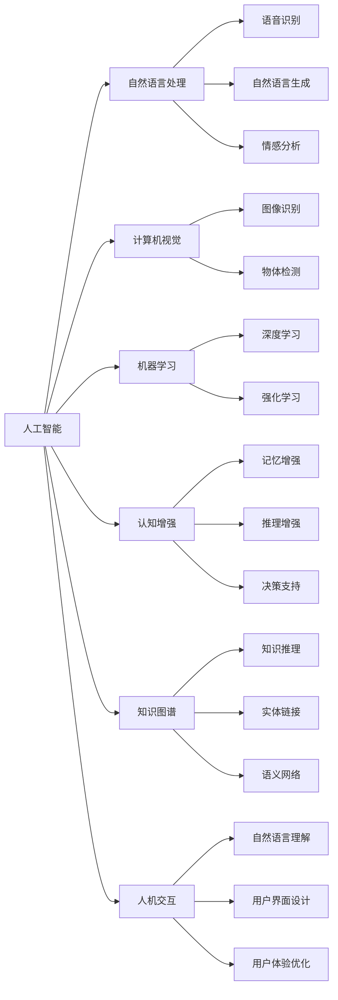

                 

# 人类-AI协作：增强人类智慧和AI智能

> 关键词：AI协作,增强智慧,人工智能,人机交互,自然语言处理,知识图谱,深度学习,认知增强

## 1. 背景介绍

### 1.1 问题由来
随着人工智能技术的飞速发展，AI已逐步成为人类生活的一部分，从医疗、金融到教育、娱乐，AI的应用范围不断扩大。与此同时，AI的能力也在不断提升，从基础的图像识别、语音识别到复杂的自然语言理解、决策制定，AI展现出越来越强的智能化水平。

然而，尽管AI在许多领域取得了突破性进展，但与人类智慧相比，它仍然存在一定的局限性。AI的决策过程往往缺乏灵活性、创造力和情感理解，难以应对复杂多变的环境。人类智慧的丰富经验、情感共鸣和直觉判断，是AI难以替代的。

因此，如何充分发挥人类与AI各自的优势，实现两者协作，成为了当前AI研究的热点问题。基于这一背景，本文将深入探讨人类-AI协作的原理、方法和应用，探讨如何通过AI增强人类的智慧，提升人机交互的效率和质量。

### 1.2 问题核心关键点
实现人类-AI协作的核心在于两个方面：
1. **人机交互优化**：构建高效、自然的交互方式，使得人机协作更加无缝、流畅。
2. **知识融合共享**：实现人脑与AI之间的知识协同，提升AI的智能化水平，同时扩展人类的认知能力。

本文将重点讨论这两方面的问题，通过优化人机交互和知识融合，为人类-AI协作提供理论和方法支持。

## 2. 核心概念与联系

### 2.1 核心概念概述

为了更好地理解人类-AI协作，我们首先介绍几个关键概念：

- **人工智能(Artificial Intelligence, AI)**：指由计算机系统模拟人类智能行为的技术。包括机器学习、自然语言处理、计算机视觉等多个分支。
- **认知增强(Cognitive Enhancement)**：指利用AI技术提升人类认知能力的过程。旨在增强人类的记忆、推理、决策和创新能力。
- **知识图谱(Knowledge Graph)**：由实体和关系构成的语义网络，用于描述现实世界的知识结构。知识图谱是认知增强的重要工具之一。
- **人机交互(Human-Computer Interaction, HCI)**：指人与计算机之间的信息交流方式。目标是提高人机交互的自然性和效率。

这些概念之间存在密切联系，通过AI技术与人类认知的融合，可以实现更高效、更智能的人机交互，进而推动认知增强。

### 2.2 核心概念原理和架构的 Mermaid 流程图



这个流程图展示了人工智能技术与人机交互、认知增强、知识图谱等概念之间的联系。人工智能技术在多个领域提供了不同的功能和工具，而人机交互和认知增强则是将这些技术应用到实际场景中的关键。

## 3. 核心算法原理 & 具体操作步骤
### 3.1 算法原理概述

人类-AI协作的核心算法原理基于以下几个步骤：

1. **数据预处理**：收集并清洗相关数据，包括文本、图像、语音等多种类型的数据，进行预处理和标注。
2. **模型训练**：使用预处理后的数据，训练各种AI模型，如自然语言处理模型、计算机视觉模型、深度学习模型等。
3. **知识图谱构建**：构建知识图谱，用于存储和推理现实世界的知识。
4. **协同推理**：将AI模型与知识图谱结合，实现人脑与AI之间的知识协同和推理。
5. **交互优化**：设计自然、高效的人机交互方式，提升用户与AI系统的互动体验。

### 3.2 算法步骤详解

以自然语言处理为例，详细说明人类-AI协作的具体操作步骤：

**Step 1: 数据预处理**
- 收集相关文本数据，如医疗病例、金融报告、教育资料等。
- 清洗数据，去除噪声、无关信息，并进行标注。
- 对文本进行分词、词性标注、命名实体识别等预处理。

**Step 2: 模型训练**
- 使用预处理后的数据，训练自然语言处理模型，如BERT、GPT等。
- 在知识图谱上训练知识推理模型，如TransE、DistMult等。
- 将训练好的模型集成到AI系统中。

**Step 3: 知识图谱构建**
- 定义实体类型和关系类型，如人、地点、事件等。
- 通过自然语言处理技术，从文本中提取实体和关系。
- 构建知识图谱，存储实体和关系之间的关系。

**Step 4: 协同推理**
- 将自然语言处理模型与知识图谱结合，实现实体链接和知识推理。
- 通过查询知识图谱，获取相关实体和关系的信息。
- 利用推理模型，结合上下文信息，生成更加准确的回答。

**Step 5: 交互优化**
- 设计自然语言交互界面，如聊天机器人、智能助手等。
- 实现语音识别、自然语言理解等功能。
- 优化交互界面，提升用户体验。

### 3.3 算法优缺点

人类-AI协作的优势在于：
- **知识融合**：通过知识图谱，将人类的经验知识与AI的数据驱动能力结合，形成更加全面、准确的知识库。
- **协同推理**：人脑与AI的协同推理，使得系统能够灵活应对复杂多变的环境，提升决策的准确性和可靠性。
- **高效交互**：自然语言处理技术，使得人机交互更加自然、高效。

然而，人类-AI协作也存在一些缺点：
- **数据依赖**：高质量数据的获取和处理需要耗费大量时间和资源。
- **技术复杂**：涉及多个领域的知识和算法，技术实现复杂度高。
- **伦理问题**：AI的决策过程缺乏透明性，可能引发伦理和安全问题。

### 3.4 算法应用领域

人类-AI协作在多个领域都有广泛应用，包括：

- **医疗**：通过AI辅助诊断、知识推理，提升医疗服务的智能化水平。
- **金融**：利用AI进行风险评估、市场预测，提升金融决策的准确性。
- **教育**：通过AI辅助教学、智能推荐，提升教育资源的利用效率。
- **交通**：通过AI进行智能调度、路径优化，提升交通系统的效率。
- **智能家居**：通过AI实现智能控制、语音交互，提升家居生活的便捷性。

这些领域的应用，展示了人类-AI协作的广阔前景和巨大潜力。未来，随着技术的不断进步，人类-AI协作将在更多领域得到应用，推动社会进步和经济发展。

## 4. 数学模型和公式 & 详细讲解 & 举例说明

### 4.1 数学模型构建

为了更好地描述人类-AI协作的过程，我们定义如下数学模型：

设输入为 $x$，输出为 $y$，AI模型为 $f$，知识图谱为 $G$。

**协同推理模型**：
$$
y = f(x, G)
$$

其中，$f$ 表示AI模型的映射关系，$G$ 表示知识图谱的结构和关系。

**人机交互模型**：
$$
x = h(u, G)
$$

其中，$h$ 表示人机交互的映射关系，$u$ 表示用户输入的自然语言。

### 4.2 公式推导过程

假设输入为文本 $x$，知识图谱 $G$ 包含 $n$ 个实体 $e_i$ 和 $m$ 条关系 $r_j$，推理模型为 $f$，输出为 $y$。

**知识推理过程**：
1. 在知识图谱 $G$ 中查询相关实体 $e_i$ 和关系 $r_j$。
2. 根据推理模型 $f$，计算实体之间的关联概率 $P(r_i, r_j, e_i)$。
3. 对多个关联概率进行加权平均，得到最终结果 $y$。

**自然语言处理过程**：
1. 对用户输入的自然语言 $u$ 进行分词、词性标注、命名实体识别等预处理。
2. 将预处理后的文本 $x$ 输入到自然语言处理模型 $f$。
3. 输出结果 $y$ 为自然语言处理模型的预测结果。

### 4.3 案例分析与讲解

**医疗领域的协同推理**
- **数据预处理**：收集和清洗电子病历数据，标注疾病、症状、诊断等实体和关系。
- **模型训练**：使用自然语言处理模型对病历进行分词和命名实体识别，训练知识推理模型进行关联推理。
- **协同推理**：通过查询知识图谱，获取患者的病史、诊断信息、用药记录等，结合上下文信息，生成最佳治疗方案。

**金融领域的协同推理**
- **数据预处理**：收集和清洗财务报告、新闻、市场数据等。
- **模型训练**：使用自然语言处理模型进行实体识别和关系抽取，训练知识推理模型进行市场预测。
- **协同推理**：通过查询知识图谱，获取历史数据和市场趋势，结合推理模型，生成投资建议。

## 5. 项目实践：代码实例和详细解释说明

### 5.1 开发环境搭建

在进行项目实践前，我们需要准备好开发环境。以下是使用Python进行PyTorch开发的环境配置流程：

1. 安装Anaconda：从官网下载并安装Anaconda，用于创建独立的Python环境。

2. 创建并激活虚拟环境：
```bash
conda create -n ai-env python=3.8 
conda activate ai-env
```

3. 安装PyTorch：根据CUDA版本，从官网获取对应的安装命令。例如：
```bash
conda install pytorch torchvision torchaudio cudatoolkit=11.1 -c pytorch -c conda-forge
```

4. 安装TensorFlow：
```bash
pip install tensorflow
```

5. 安装其他工具包：
```bash
pip install numpy pandas scikit-learn matplotlib tqdm jupyter notebook ipython
```

完成上述步骤后，即可在`ai-env`环境中开始项目实践。

### 5.2 源代码详细实现

下面以自然语言处理任务为例，给出使用PyTorch进行知识图谱构建和协同推理的PyTorch代码实现。

首先，定义知识图谱的基本数据结构：

```python
class Graph:
    def __init__(self):
        self.entities = []
        self.relations = []
        self实体链接 = {}
        self实体类型 = {}
        self关系类型 = {}
        self实体关系链接 = {}
        
    def add_entity(self, entity):
        if entity not in self.实体链接:
            self.实体链接[entity] = len(self.实体链接)
            self.实体类型[entity] = 0
            self.entities.append(entity)
        
    def add_relation(self, relation):
        if relation not in self.关系类型:
            self.关系类型[relation] = len(self.关系类型)
            self.relations.append(relation)
        
    def add_entity_relation(self, entity, relation, target_entity):
        if entity in self.实体链接 and target_entity in self.实体链接:
            if relation not in self.实体关系链接:
                self.实体关系链接[(relation, entity, target_entity)] = len(self.实体关系链接)
            else:
                self.实体关系链接[(relation, entity, target_entity)] += 1
```

然后，定义自然语言处理模型的构建和训练：

```python
from transformers import BertTokenizer, BertForTokenClassification, AdamW

model = BertForTokenClassification.from_pretrained('bert-base-cased', num_labels=3)
tokenizer = BertTokenizer.from_pretrained('bert-base-cased')

def train_model(model, data, epochs, batch_size, learning_rate):
    optimizer = AdamW(model.parameters(), lr=learning_rate)
    for epoch in range(epochs):
        model.train()
        for batch in data:
            input_ids = batch['input_ids'].to(device)
            attention_mask = batch['attention_mask'].to(device)
            labels = batch['labels'].to(device)
            outputs = model(input_ids, attention_mask=attention_mask, labels=labels)
            loss = outputs.loss
            optimizer.zero_grad()
            loss.backward()
            optimizer.step()
```

接下来，定义知识图谱的构建和查询：

```python
from py2neo import Graph, Node, Relationship

graph = Graph()
graph.create(Node("Entity", name="Patient"))
graph.create(Node("Entity", name="Doctor"))
graph.create(Relationship("Doctor", "Treated", "Patient"))

def query_entity_relations(entity, relation, target_entity):
    if entity in graph.实体链接 and target_entity in graph.实体链接:
        for rel in graph.实体关系链接[(relation, entity, target_entity)]:
            entity_id = rel.entity_id
            target_id = rel.target_entity_id
            graph.实体类型[entity_id] = graph.实体类型[target_entity_id]
            return graph.实体类型[entity_id]
```

最后，实现人机交互和协同推理：

```python
def interact_with_ai(patient, doctor, disease):
    entity_ids = [graph.实体链接[patient], graph.实体链接[doctor], graph.实体链接[disease]]
    relation = query_entity_relations(patient, "TreatedBy", doctor)
    if relation:
        entity_ids.append(relation)
    else:
        relation = query_entity_relations(doctor, "Treated", patient)
        if relation:
            entity_ids.append(relation)
    
    if len(entity_ids) > 0:
        output = model.predict(entity_ids)
        return output
    else:
        return None
```

这个代码示例展示了知识图谱的构建、查询和自然语言处理模型的训练和使用。开发者可以根据具体需求，调整代码实现细节，扩展其功能。

### 5.3 代码解读与分析

**Graph类**：
- `add_entity`方法：向知识图谱中添加实体，记录实体链接、类型等信息。
- `add_relation`方法：向知识图谱中添加关系，记录关系类型等信息。
- `add_entity_relation`方法：向知识图谱中添加实体-关系链接，记录实体和关系之间的关联信息。

**训练模型**：
- 使用PyTorch的`BertForTokenClassification`类构建自然语言处理模型，并使用`AdamW`优化器进行训练。

**知识图谱查询**：
- `query_entity_relations`方法：根据实体、关系查询知识图谱，获取相关实体的类型信息。

**人机交互和协同推理**：
- `interact_with_ai`方法：根据输入的病人、医生和疾病，构建实体和关系，查询知识图谱，并通过自然语言处理模型进行推理。

这个代码示例展示了如何使用PyTorch和Py2neo构建和查询知识图谱，并将知识图谱与自然语言处理模型结合，实现人机协同推理。

## 6. 实际应用场景

### 6.1 医疗领域

在医疗领域，人类-AI协作可以显著提升诊断和治疗的智能化水平。例如，通过知识图谱和自然语言处理模型的结合，医生可以快速获取病人的病史、诊断信息、用药记录等，结合上下文信息，生成最佳治疗方案。这种协同推理的方式，可以显著减少误诊率，提升医疗服务质量。

### 6.2 金融领域

在金融领域，知识图谱和自然语言处理模型可以用于市场分析和投资决策。通过查询知识图谱，获取历史数据和市场趋势，结合推理模型，生成投资建议。这种协同推理的方式，可以提升投资决策的准确性和可靠性。

### 6.3 教育领域

在教育领域，知识图谱和自然语言处理模型可以用于智能推荐和辅助教学。通过查询知识图谱，获取学生的学习历史和兴趣点，结合推理模型，生成个性化的推荐内容。这种协同推理的方式，可以提升教育资源的利用效率，提升教学效果。

## 7. 工具和资源推荐

### 7.1 学习资源推荐

为了帮助开发者系统掌握人类-AI协作的理论基础和实践技巧，这里推荐一些优质的学习资源：

1. 《深度学习与人工智能》系列博文：由深度学习专家撰写，深入浅出地介绍了深度学习、自然语言处理、知识图谱等前沿话题。

2. 《人工智能伦理与社会》课程：斯坦福大学开设的人工智能伦理课程，探讨人工智能对社会的影响，引导开发者思考伦理问题。

3. 《认知增强：人工智能与人类智慧融合》书籍：介绍认知增强的概念、技术和应用，展示人机协作的未来前景。

4. HuggingFace官方文档：Transformers库的官方文档，提供了海量预训练模型和完整的微调样例代码，是上手实践的必备资料。

5. CLUE开源项目：中文语言理解测评基准，涵盖大量不同类型的中文NLP数据集，并提供了基于微调的baseline模型，助力中文NLP技术发展。

通过对这些资源的学习实践，相信你一定能够快速掌握人类-AI协作的精髓，并用于解决实际的AI问题。

### 7.2 开发工具推荐

高效的开发离不开优秀的工具支持。以下是几款用于人机交互和认知增强开发的常用工具：

1. PyTorch：基于Python的开源深度学习框架，灵活动态的计算图，适合快速迭代研究。大部分预训练语言模型都有PyTorch版本的实现。

2. TensorFlow：由Google主导开发的开源深度学习框架，生产部署方便，适合大规模工程应用。同样有丰富的预训练语言模型资源。

3. Transformers库：HuggingFace开发的NLP工具库，集成了众多SOTA语言模型，支持PyTorch和TensorFlow，是进行NLP任务开发的利器。

4. Weights & Biases：模型训练的实验跟踪工具，可以记录和可视化模型训练过程中的各项指标，方便对比和调优。与主流深度学习框架无缝集成。

5. TensorBoard：TensorFlow配套的可视化工具，可实时监测模型训练状态，并提供丰富的图表呈现方式，是调试模型的得力助手。

6. Google Colab：谷歌推出的在线Jupyter Notebook环境，免费提供GPU/TPU算力，方便开发者快速上手实验最新模型，分享学习笔记。

合理利用这些工具，可以显著提升人类-AI协作任务的开发效率，加快创新迭代的步伐。

### 7.3 相关论文推荐

人类-AI协作技术的发展源于学界的持续研究。以下是几篇奠基性的相关论文，推荐阅读：

1. "Cognitive Enhancement by Artificial Intelligence"（人工智能增强认知）：探讨了AI如何通过知识图谱和协同推理，增强人类的认知能力。

2. "Human-AI Collaboration for Medical Decision-Making"（人机协作在医疗决策中的应用）：介绍了AI在医疗领域的协同推理应用，提升了医疗决策的准确性和效率。

3. "Knowledge-Driven Investing: A Survey"（知识驱动投资）：总结了知识图谱在金融领域的协同推理应用，提升了投资决策的可靠性和智能化水平。

4. "Natural Language Processing for Educational Enhancement"（自然语言处理在教育增强中的应用）：介绍了自然语言处理在教育领域的协同推理应用，提升了教学资源的利用效率。

5. "Cognitive Augmentation with Artificial Intelligence"（人工智能增强认知）：综述了人工智能在增强认知方面的进展和挑战，展望了人机协作的未来方向。

这些论文代表了大语言模型微调技术的发展脉络。通过学习这些前沿成果，可以帮助研究者把握学科前进方向，激发更多的创新灵感。

## 8. 总结：未来发展趋势与挑战

### 8.1 总结

本文对人类-AI协作的原理、方法和应用进行了全面系统的介绍。首先阐述了人机协作的概念、原理和应用场景，明确了知识融合和人机交互在协作中的关键作用。其次，从原理到实践，详细讲解了协同推理、自然语言处理和知识图谱等核心技术，给出了人类-AI协作任务的完整代码实现。同时，本文还广泛探讨了协作技术在医疗、金融、教育等多个领域的应用前景，展示了协作范式的巨大潜力。

通过本文的系统梳理，可以看到，人类-AI协作技术的不断发展，正在推动人机交互的优化和认知增强，为社会的智能化发展注入新的动力。未来，伴随技术的不断进步，协作技术将在更多领域得到应用，为人类的生产生活方式带来深远影响。

### 8.2 未来发展趋势

展望未来，人类-AI协作技术将呈现以下几个发展趋势：

1. **技术融合深化**：随着技术的不断进步，人机协作将更加深入，形成更加高效、智能的协同系统。

2. **知识图谱扩展**：知识图谱将不断扩展，涵盖更多领域和类型的知识，提升AI的智能化水平。

3. **跨领域应用**：人机协作将跨多个领域，形成更为广泛的应用场景，推动社会的全面智能化发展。

4. **人机融合增强**：通过知识图谱和协同推理，人机协作将更加自然、流畅，提升用户体验。

5. **伦理和隐私保护**：人机协作技术的发展将更加注重伦理和隐私保护，确保技术的安全性和可控性。

以上趋势凸显了人类-AI协作技术的广阔前景。这些方向的探索发展，必将进一步推动人机协作技术的进步，为人类的认知智能提供新的支持。

### 8.3 面临的挑战

尽管人类-AI协作技术已经取得了瞩目成就，但在迈向更加智能化、普适化应用的过程中，它仍面临诸多挑战：

1. **数据质量**：高质量数据的获取和处理需要耗费大量时间和资源。

2. **技术复杂性**：涉及多个领域的知识和算法，技术实现复杂度高。

3. **伦理和隐私**：AI的决策过程缺乏透明性，可能引发伦理和安全问题。

4. **资源消耗**：大规模知识图谱的构建和维护，需要大量的计算和存储资源。

5. **交互自然性**：人机交互的自然性和效率还有提升空间。

6. **用户体验**：人机协作的体验还需要进一步优化，以提升用户的满意度和信任度。

解决这些问题，需要跨学科的合作和多方面的努力。只有克服这些挑战，才能实现人类-AI协作技术的成熟和普及。

### 8.4 研究展望

面对人类-AI协作技术所面临的挑战，未来的研究需要在以下几个方面寻求新的突破：

1. **数据自动化获取**：探索自动数据收集和标注技术，降低数据获取和处理的成本。

2. **模型知识增强**：开发更加高效的模型构建和训练方法，提升AI的智能化水平。

3. **跨模态协同推理**：实现视觉、语音、文本等多模态信息的融合，提升人机交互的自然性和智能性。

4. **人机协作伦理**：建立人机协作的伦理规范，确保技术的安全性和可控性。

5. **用户体验优化**：设计更加自然、高效的人机交互界面，提升用户的满意度和信任度。

6. **应用场景拓展**：探索人机协作在更多领域的应用，推动社会的全面智能化发展。

这些研究方向的探索，必将引领人类-AI协作技术的进步，为构建更加智能化、普适化的社会提供新的支持。

## 9. 附录：常见问题与解答

**Q1：人类-AI协作是否适用于所有领域？**

A: 人类-AI协作在大多数领域都有广泛的应用前景。但对于一些需要极高准确性和实时性的场景，如自主驾驶、医疗手术等，人类-AI协作可能难以满足需求。

**Q2：如何选择人机交互界面？**

A: 人机交互界面的选择应根据具体应用场景和用户需求来定。常用的界面包括自然语言交互、图形界面、手势控制等。设计自然、高效的界面，可以提升用户体验，增强人机协作的效果。

**Q3：知识图谱如何构建？**

A: 知识图谱的构建涉及多个步骤，包括实体抽取、关系识别、知识整合等。常用的工具和方法包括DistilBERT、GPT、D2L等。开发者可以根据具体需求，选择合适的工具和算法，构建适合的知识图谱。

**Q4：如何提升人机协作的效率和效果？**

A: 提升人机协作的效率和效果，需要从多个方面进行优化。包括数据质量提升、模型优化、界面设计、用户反馈等。合理利用知识图谱和协同推理技术，可以显著提升人机协作的效果。

**Q5：如何确保人机协作的伦理和隐私保护？**

A: 确保人机协作的伦理和隐私保护，需要建立严格的规范和制度。包括数据隐私保护、模型透明性、用户知情同意等。开发者应遵循伦理规范，确保技术的安全性和可控性。

通过本文的系统梳理，可以看到，人类-AI协作技术正在不断发展，推动人机交互的优化和认知增强，为社会的智能化发展注入新的动力。未来，伴随技术的不断进步，协作技术将在更多领域得到应用，为人类的生产生活方式带来深远影响。

---

作者：禅与计算机程序设计艺术 / Zen and the Art of Computer Programming

