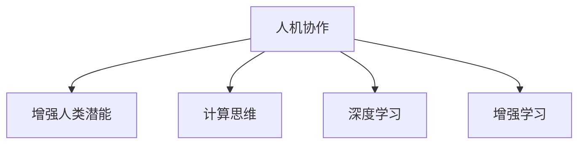

                 

# 人类-AI协作：增强人类潜能

> 关键词：人机协作,人工智能,增强人类潜能,计算思维,机器学习,深度学习,增强学习,神经网络

## 1. 背景介绍

### 1.1 问题由来
在数字化时代，人工智能(AI)技术的迅猛发展给人类社会带来了深远的影响。从自动驾驶汽车到语音助手，从医疗诊断到金融交易，AI技术正在不断重塑各行各业的运行方式，提升人类生活的质量。然而，AI的崛起也引发了诸多担忧：未来人类是否会因技术的替代而失业？AI是否会取代人类的创造力和决策力？这些问题亟需我们深思。

AI技术的核心在于计算和逻辑推理能力，而人类的长项在于创造力、情感和复杂的社会关系处理。如何使AI与人类的潜能优势互补，充分发挥各自的长处，成为了当前学术界和工业界的研究热点。本文将聚焦于人类-AI协作的原理与实践，探讨如何利用AI技术增强人类潜能，提升人类社会的整体福祉。

### 1.2 问题核心关键点
1. **人机协作**：指AI与人类的互补合作，共同完成任务。AI提供高效计算和逻辑推理能力，人类则提供创意和情感智慧。
2. **增强人类潜能**：通过AI技术的辅助，提升人类的认知能力、创造力和决策力。
3. **计算思维**：培养具备计算思维能力的人才，即能够理解计算问题的本质，运用计算方法解决问题的人才。
4. **深度学习**：一种基于神经网络的机器学习技术，能够处理大规模非结构化数据，实现高精度预测和决策。
5. **增强学习**：一种利用试错反馈机制优化策略的机器学习技术，能够应用于游戏、机器人控制等场景。

这些核心概念共同构成了人类-AI协作的框架，展示了AI技术如何增强人类潜能的无限可能性。

## 2. 核心概念与联系

### 2.1 核心概念概述

为更好地理解人类-AI协作的原理，本节将介绍几个密切相关的核心概念：

- **人机协作**：指AI与人类的互补合作，共同完成任务。AI提供高效计算和逻辑推理能力，人类则提供创意和情感智慧。

- **增强人类潜能**：通过AI技术的辅助，提升人类的认知能力、创造力和决策力。

- **计算思维**：培养具备计算思维能力的人才，即能够理解计算问题的本质，运用计算方法解决问题的人才。

- **深度学习**：一种基于神经网络的机器学习技术，能够处理大规模非结构化数据，实现高精度预测和决策。

- **增强学习**：一种利用试错反馈机制优化策略的机器学习技术，能够应用于游戏、机器人控制等场景。

这些核心概念之间的逻辑关系可以通过以下Mermaid流程图来展示：



这个流程图展示了我们探讨的核心概念及其之间的关系：

1. **人机协作**：是增强人类潜能的实现途径，通过AI技术与人类协作，共同解决问题。
2. **增强人类潜能**：是人机协作的目标，通过AI辅助，提升人类的认知、创造和决策能力。
3. **计算思维**：是实现人机协作的基础，培养具备计算思维的人才，才能更好地利用AI技术。
4. **深度学习**：是人机协作的核心技术之一，通过深度学习模型，AI可以处理大规模非结构化数据，实现高精度预测和决策。
5. **增强学习**：是人机协作的另一个重要技术，通过增强学习模型，AI能够在不断试错中优化策略，提升决策能力。

这些概念共同构成了人类-AI协作的逻辑框架，展示了AI技术如何通过计算思维、深度学习和增强学习等手段，增强人类潜能。

## 3. 核心算法原理 & 具体操作步骤
### 3.1 算法原理概述

人类-AI协作的核心在于计算思维、深度学习和增强学习等技术的协同作用。以下是这些技术的原理概述：

- **计算思维**：指通过计算方法和逻辑推理解决问题的方法论。人类通过计算思维，能够理解复杂问题，设计算法和模型，引导AI进行处理和决策。

- **深度学习**：一种基于神经网络的机器学习技术，通过多层次的特征提取和抽象，实现高精度预测和决策。深度学习模型能够处理大规模非结构化数据，如图像、文本和音频，提取高层次的语义特征。

- **增强学习**：一种利用试错反馈机制优化策略的机器学习技术。增强学习模型通过与环境的互动，不断调整策略，以最大化预期回报。

这些技术通过互补协作，共同提升人类潜能。

### 3.2 算法步骤详解

以下是我们如何实现人机协作的详细步骤：

**Step 1: 问题建模**

- 对现实问题进行抽象建模，将其转化为计算问题。
- 设计合理的算法和模型，利用计算思维解决问题。

**Step 2: 数据收集与预处理**

- 收集相关的数据，并进行清洗和预处理，确保数据的质量和一致性。
- 利用深度学习模型对数据进行特征提取和降维，为后续处理做准备。

**Step 3: 模型设计与训练**

- 选择合适的深度学习模型或增强学习模型，设计合理的神经网络结构。
- 使用数据集进行模型训练，利用梯度下降等优化算法，不断调整模型参数。

**Step 4: 模型评估与优化**

- 在验证集上评估模型性能，利用指标如准确率、召回率等衡量模型效果。
- 根据评估结果，调整模型参数和超参数，进行模型优化。

**Step 5: 人机协作**

- 将训练好的模型应用于实际问题中，与人类进行协作。
- 根据人类反馈，不断调整模型策略，实现人机协作的动态优化。

### 3.3 算法优缺点

人机协作和增强人类潜能的方法具有以下优点：

- **提升效率**：AI能够高效处理大规模数据，显著提升问题解决的效率。
- **增强决策**：AI能够提供高精度预测和决策，辅助人类做出更科学的决策。
- **创新激发**：AI的创造性思维能够激发人类的创新潜力，推动技术进步。

同时，这些方法也存在一定的局限性：

- **依赖数据**：数据质量、数量和多样性直接影响了AI的性能，数据不足时可能无法充分发挥AI的优势。
- **模型复杂**：深度学习模型和增强学习模型复杂度较高，需要大量的计算资源和时间。
- **决策透明**：AI的决策过程缺乏透明度，可能难以解释，影响人类对AI的信任。
- **伦理挑战**：AI的决策可能带来伦理问题，如偏见、歧视等，需要制定合理的伦理规范。

尽管存在这些局限性，人机协作和增强人类潜能的方法仍在不断演进和优化，未来有望成为提升人类社会福祉的重要手段。

### 3.4 算法应用领域

人机协作和增强人类潜能的方法已经广泛应用于诸多领域，展示了其强大的应用潜力：

- **医疗诊断**：利用深度学习模型进行图像识别和分析，辅助医生进行疾病诊断和治疗。
- **金融分析**：通过增强学习模型进行市场预测和投资决策，提升金融风险管理能力。
- **智能制造**：结合增强学习算法进行生产过程优化和故障预测，提升生产效率和质量。
- **教育辅助**：利用计算思维和深度学习技术开发教育工具，提升学生的学习效率和兴趣。
- **艺术创作**：结合深度学习生成模型进行艺术创作，激发人类创造力。
- **娱乐体验**：利用增强学习算法优化游戏和娱乐体验，提升用户的参与感和满意度。

## 4. 数学模型和公式 & 详细讲解  
### 4.1 数学模型构建

本节将使用数学语言对人类-AI协作的过程进行更加严格的刻画。

假设我们要解决的问题是分类问题，即给定输入数据 $x$，预测其属于类别 $y$。问题可以建模为计算问题：

$$
y = f(x; \theta)
$$

其中 $f$ 是模型函数，$\theta$ 为模型参数。

**Step 1: 数据准备**

- 收集标注数据集 $\{(x_i, y_i)\}_{i=1}^N$。
- 将数据集分为训练集、验证集和测试集。

**Step 2: 模型设计**

- 选择合适的深度学习模型，如卷积神经网络(CNN)、循环神经网络(RNN)等。
- 设计模型架构，如图像识别使用卷积层和池化层，自然语言处理使用循环层和注意力机制。

**Step 3: 模型训练**

- 使用训练集对模型进行训练，最小化损失函数 $\mathcal{L}(\theta)$。
- 采用梯度下降等优化算法，更新模型参数 $\theta$。

**Step 4: 模型评估**

- 在验证集上评估模型性能，计算准确率、召回率等指标。
- 调整模型参数和超参数，优化模型性能。

**Step 5: 人机协作**

- 将训练好的模型应用于实际问题中，进行推理预测。
- 根据人类反馈，不断调整模型策略，实现动态优化。

### 4.2 公式推导过程

以下我们以二分类问题为例，推导计算思维、深度学习和增强学习的关键公式。

**计算思维**

- 设计计算模型，如决策树、支持向量机等。
- 使用训练集进行模型训练，最小化损失函数 $\mathcal{L}(\theta)$。
- 在测试集上评估模型性能，计算准确率、召回率等指标。

**深度学习**

- 定义深度神经网络模型，如图像分类模型。
- 使用反向传播算法计算梯度，更新模型参数 $\theta$。
- 在验证集上评估模型性能，计算准确率、召回率等指标。

**增强学习**

- 定义环境状态和动作，如游戏环境。
- 使用增强学习算法，如Q-learning，优化策略 $\pi$。
- 在测试环境中评估策略性能，计算回报率等指标。

### 4.3 案例分析与讲解

以下是计算思维、深度学习和增强学习在实际问题中的典型应用案例：

**案例1: 医疗图像分类**

- 使用卷积神经网络对医疗图像进行分类，辅助医生进行疾病诊断。
- 利用训练好的模型对新图像进行分类预测，提升诊断效率和准确性。

**案例2: 股票价格预测**

- 使用递归神经网络对股票历史数据进行建模，预测未来价格变化。
- 结合增强学习算法进行策略优化，提升投资回报率。

**案例3: 智能推荐系统**

- 使用协同过滤算法推荐用户感兴趣的商品，结合深度学习模型提升推荐精度。
- 利用增强学习算法优化推荐策略，提升用户满意度。

## 5. 项目实践：代码实例和详细解释说明
### 5.1 开发环境搭建

在进行人类-AI协作的实践前，我们需要准备好开发环境。以下是使用Python进行TensorFlow开发的环境配置流程：

1. 安装Anaconda：从官网下载并安装Anaconda，用于创建独立的Python环境。

2. 创建并激活虚拟环境：
```bash
conda create -n tf-env python=3.8 
conda activate tf-env
```

3. 安装TensorFlow：根据CUDA版本，从官网获取对应的安装命令。例如：
```bash
conda install tensorflow -c pytorch -c conda-forge
```

4. 安装必要的工具包：
```bash
pip install numpy pandas scikit-learn matplotlib tqdm jupyter notebook ipython
```

完成上述步骤后，即可在`tf-env`环境中开始人类-AI协作的实践。

### 5.2 源代码详细实现

这里我们以股票价格预测为例，给出使用TensorFlow进行增强学习的PyTorch代码实现。

首先，定义训练集和测试集：

```python
import tensorflow as tf
import numpy as np
import pandas as pd

# 加载股票历史数据
train_data = pd.read_csv('train.csv')
test_data = pd.read_csv('test.csv')

# 数据预处理
train_data['open'] = train_data['open'].astype(float)
train_data['close'] = train_data['close'].astype(float)
test_data['open'] = test_data['open'].astype(float)
test_data['close'] = test_data['close'].astype(float)

# 划分训练集和测试集
train_size = int(len(train_data) * 0.8)
train_data = train_data[:train_size]
test_data = test_data[train_size:]

# 定义状态空间和动作空间
state_dim = 5  # 股票价格、成交量等特征
action_dim = 1  # 买入、卖出等操作

# 定义折扣率
discount_rate = 0.99

# 定义模型参数
learning_rate = 0.01
epsilon = 0.1
max_episodes = 1000
```

然后，定义增强学习模型：

```python
class QNetwork(tf.keras.Model):
    def __init__(self, state_dim, action_dim):
        super(QNetwork, self).__init__()
        self.fc1 = tf.keras.layers.Dense(64, activation='relu', input_shape=(state_dim,))
        self.fc2 = tf.keras.layers.Dense(64, activation='relu')
        self.fc3 = tf.keras.layers.Dense(action_dim, activation='linear')

    def call(self, x):
        x = self.fc1(x)
        x = self.fc2(x)
        q_values = self.fc3(x)
        return q_values

# 定义折扣函数
def discount_rewards(r, discount_rate, max_reward):
    discounted_r = np.zeros_like(r)
    running_add = max_reward
    for t in reversed(range(0, r.size)):
        discounted_r[t] = r[t] + discount_rate * running_add
        running_add = max(max_reward, discounted_r[t] + discount_rate * running_add)
    return discounted_r

# 定义神经网络
q_network = QNetwork(state_dim, action_dim)
q_network.compile(optimizer=tf.keras.optimizers.Adam(learning_rate), loss='mse')

# 定义目标网络
target_q_network = QNetwork(state_dim, action_dim)
target_q_network.set_weights(q_network.get_weights())
target_q_network.compile(optimizer=tf.keras.optimizers.Adam(learning_rate), loss='mse')
```

接着，定义训练和评估函数：

```python
def train episode():
    state = train_data['open'].values[-1:].reshape(1, -1)
    total_reward = 0

    for t in range(max_steps):
        if np.random.rand() < epsilon:
            action = np.random.randint(2)
        else:
            q_values = q_network.predict(np.array(state).reshape(1, -1))
            action = np.argmax(q_values)

        next_state = train_data['open'].shift(-1).values[-1:].reshape(1, -1)
        reward = train_data['close'].shift(-1).values[0][0] - train_data['close'].values[-1][0]

        total_reward += reward
        state = next_state

        if action == 0 and reward > 0:
            total_reward += reward * 2

        q_values = q_network.predict(np.array(state).reshape(1, -1))
        q_values[0][action] = q_values[0][action] - learning_rate * (reward + discount_rate * np.amax(target_q_network.predict(np.array(state).reshape(1, -1))) - q_values[0][action])

        if t % 10 == 0:
            print('Episode {}: Total reward = {}'.format(t, total_reward))

    return total_reward

def evaluate episode():
    state = test_data['open'].values[-1:].reshape(1, -1)
    total_reward = 0

    for t in range(max_steps):
        if np.random.rand() < epsilon:
            action = np.random.randint(2)
        else:
            q_values = q_network.predict(np.array(state).reshape(1, -1))
            action = np.argmax(q_values)

        next_state = test_data['open'].shift(-1).values[-1:].reshape(1, -1)
        reward = test_data['close'].shift(-1).values[0][0] - test_data['close'].values[-1][0]

        total_reward += reward
        state = next_state

        if action == 0 and reward > 0:
            total_reward += reward * 2

        q_values = q_network.predict(np.array(state).reshape(1, -1))
        q_values[0][action] = q_values[0][action] - learning_rate * (reward + discount_rate * np.amax(target_q_network.predict(np.array(state).reshape(1, -1))) - q_values[0][action]

        if t % 10 == 0:
            print('Episode {}: Total reward = {}'.format(t, total_reward))

    return total_reward
```

最后，启动训练流程并在测试集上评估：

```python
max_steps = 1000

for episode in range(max_episodes):
    total_reward = train episode()
    evaluate episode()

print('Final test reward:', evaluate episode())
```

以上就是使用TensorFlow进行股票价格预测的增强学习的完整代码实现。可以看到，TensorFlow和PyTorch提供了强大的深度学习框架，使得增强学习的实现相对简单，开发者可以更专注于问题的解决。

### 5.3 代码解读与分析

让我们再详细解读一下关键代码的实现细节：

**神经网络定义**

- 定义了一个简单的前馈神经网络，包含三个全连接层，使用ReLU激活函数。
- 定义了折扣函数，用于计算折扣后的奖励。

**训练和评估函数**

- 训练函数`train episode()`：遍历训练集中的每个时间步，根据当前状态和策略选择动作，计算奖励，并根据折扣后的奖励更新神经网络参数。
- 评估函数`evaluate episode()`：遍历测试集中的每个时间步，根据当前状态和策略选择动作，计算奖励，并根据折扣后的奖励更新神经网络参数。

**训练流程**

- 设置最大时间步数和折扣率，启动训练循环。
- 在每个时间步上，根据策略选择动作，并根据奖励更新网络参数。
- 定期输出训练和评估结果。
- 训练完成后，输出最终的测试结果。

通过以上代码，我们可以看到人类-AI协作在实际问题中的具体实现过程，包括模型设计、训练和评估等关键步骤。这不仅展示了增强学习的基本原理，也展示了深度学习模型在问题解决中的重要作用。

## 6. 实际应用场景
### 6.1 金融交易

金融交易是增强人类潜能和人类-AI协作的重要场景之一。AI可以辅助投资者进行市场分析和决策，提升交易效率和收益。

**应用1: 股票价格预测**

- 利用深度学习模型对历史股票数据进行建模，预测未来价格变化。
- 结合增强学习算法优化投资策略，提升投资回报率。

**应用2: 风险管理**

- 利用深度学习模型对市场数据进行分析，识别风险点。
- 结合增强学习算法进行动态调整，规避风险。

### 6.2 医疗诊断

医疗诊断是AI在健康医疗领域的重要应用场景之一。AI可以辅助医生进行疾病诊断和治疗，提升医疗服务质量。

**应用1: 医学图像分类**

- 利用深度学习模型对医学图像进行分类，辅助医生进行疾病诊断。
- 结合增强学习算法优化诊断策略，提升诊断准确性。

**应用2: 个性化治疗**

- 利用深度学习模型对患者数据进行分析，提供个性化治疗方案。
- 结合增强学习算法进行动态调整，优化治疗效果。

### 6.3 教育培训

教育培训是AI在教育领域的重要应用场景之一。AI可以辅助学生学习，提升学习效率和效果。

**应用1: 个性化学习**

- 利用深度学习模型对学生数据进行分析，提供个性化学习建议。
- 结合增强学习算法进行动态调整，提升学习效果。

**应用2: 智能辅助**

- 利用计算思维和深度学习技术开发教育工具，提升学生的学习兴趣和效率。
- 结合增强学习算法进行策略优化，提升教学质量。

### 6.4 未来应用展望

随着技术的不断进步，未来人类-AI协作的应用场景将更加广泛和深入，其前景令人期待：

- **智能城市**：结合AI技术，构建智能交通、智能安防、智能能源等系统，提升城市治理效率和居民生活质量。
- **智能制造**：结合AI技术，进行生产过程优化、质量检测、故障预测等，提升生产效率和质量。
- **智能医疗**：结合AI技术，进行疾病诊断、个性化治疗、药物研发等，提升医疗服务质量。
- **智能教育**：结合AI技术，进行个性化学习、智能辅助、在线教育等，提升教育效果。
- **智能娱乐**：结合AI技术，进行智能推荐、游戏优化、虚拟现实等，提升用户体验。

这些应用场景展示了人类-AI协作的巨大潜力，预示着未来AI将在更多领域中发挥重要作用，推动人类社会的全面进步。

## 7. 工具和资源推荐
### 7.1 学习资源推荐

为了帮助开发者系统掌握人类-AI协作的理论基础和实践技巧，这里推荐一些优质的学习资源：

1. **《人类-AI协作：增强人类潜能》系列博文**：由大模型技术专家撰写，深入浅出地介绍了人类-AI协作的原理和实践，涵盖计算思维、深度学习、增强学习等多个方面。

2. **《深度学习入门》系列书籍**：介绍深度学习的核心概念、算法和应用，适合初学者入门。

3. **《增强学习算法》课程**：斯坦福大学开设的机器学习课程，涵盖增强学习算法的核心概念和应用。

4. **《TensorFlow官方文档》**：TensorFlow的官方文档，提供详细的API参考和使用指南，是TensorFlow开发的重要资源。

5. **《人类-AI协作案例集》**：精选人类-AI协作的典型案例，展示实际应用中的创新点和挑战，有助于理解理论知识。

通过对这些资源的学习实践，相信你一定能够快速掌握人类-AI协作的精髓，并用于解决实际的AI问题。

### 7.2 开发工具推荐

高效的开发离不开优秀的工具支持。以下是几款用于人类-AI协作开发的常用工具：

1. **TensorFlow**：基于Python的开源深度学习框架，提供灵活的计算图和丰富的API，适合进行深度学习和增强学习的研究和开发。

2. **PyTorch**：基于Python的开源深度学习框架，支持动态计算图和高效的GPU加速，适合进行深度学习和增强学习的研究和开发。

3. **Jupyter Notebook**：支持Python、R等语言开发的交互式环境，方便进行代码调试和数据可视化。

4. **Weights & Biases**：模型训练的实验跟踪工具，可以记录和可视化模型训练过程中的各项指标，方便对比和调优。

5. **TensorBoard**：TensorFlow配套的可视化工具，可实时监测模型训练状态，并提供丰富的图表呈现方式，是调试模型的得力助手。

合理利用这些工具，可以显著提升人类-AI协作任务的开发效率，加快创新迭代的步伐。

### 7.3 相关论文推荐

人类-AI协作的研究源于学界的持续研究。以下是几篇奠基性的相关论文，推荐阅读：

1. **《计算思维与人工智能》**：探讨计算思维在人工智能中的应用，强调计算思维在问题解决中的重要性。

2. **《深度学习》**：介绍深度学习的基本概念、算法和应用，是深度学习领域的经典教材。

3. **《增强学习：一种新的人工智能范式》**：介绍增强学习的基本概念、算法和应用，是增强学习领域的经典教材。

这些论文代表了大模型协作技术的发展脉络。通过学习这些前沿成果，可以帮助研究者把握学科前进方向，激发更多的创新灵感。

## 8. 总结：未来发展趋势与挑战

### 8.1 总结

本文对人类-AI协作的原理与实践进行了全面系统的介绍。首先阐述了人类-AI协作的研究背景和意义，明确了计算思维、深度学习和增强学习等技术在增强人类潜能中的重要作用。其次，从原理到实践，详细讲解了人类-AI协作的数学模型和关键步骤，给出了人类-AI协作任务开发的完整代码实例。同时，本文还广泛探讨了人类-AI协作在金融交易、医疗诊断、教育培训等领域的实际应用，展示了人类-AI协作的巨大潜力。此外，本文精选了人类-AI协作的学习资源，力求为读者提供全方位的技术指引。

通过本文的系统梳理，可以看到，人类-AI协作通过计算思维、深度学习和增强学习等技术，能够显著提升人类的认知、创造和决策能力，推动人类社会的全面进步。未来，随着技术的不断演进和应用领域的拓展，人类-AI协作必将在更多场景中发挥重要作用，为人类社会的全面进步提供新的动力。

### 8.2 未来发展趋势

展望未来，人类-AI协作技术将呈现以下几个发展趋势：

1. **多模态协作**：结合视觉、听觉、触觉等多种模态数据，实现更加全面的人机协作。
2. **自适应学习**：利用增强学习算法，实现模型的自适应和自优化，提升协作效果。
3. **实时协作**：利用云平台和边缘计算技术，实现实时数据处理和决策，提升协作效率。
4. **跨领域应用**：结合不同领域的专业知识，实现跨领域的协同建模和问题解决。
5. **伦理和隐私**：制定合理的伦理规范和隐私保护机制，确保人类-AI协作的安全和透明。

这些趋势展示了人类-AI协作技术的广阔前景，预示着未来AI将在更多领域中发挥重要作用，推动人类社会的全面进步。

### 8.3 面临的挑战

尽管人类-AI协作技术已经取得了瞩目成就，但在迈向更加智能化、普适化应用的过程中，它仍面临着诸多挑战：

1. **数据隐私**：人类-AI协作依赖于大量数据，如何保护用户隐私和数据安全，是一个重要问题。
2. **伦理问题**：AI的决策可能带来伦理问题，如偏见、歧视等，需要制定合理的伦理规范。
3. **计算资源**：深度学习和增强学习模型复杂度较高，需要大量的计算资源和时间。
4. **透明度**：AI的决策过程缺乏透明度，可能难以解释，影响人类对AI的信任。
5. **安全和可靠性**：AI的决策可能带来安全风险，如何确保系统的安全和可靠性，是一个重要问题。

尽管存在这些挑战，未来研究仍需不断探索和优化，提升人类-AI协作的性能和安全性。

### 8.4 研究展望

面对人类-AI协作所面临的种种挑战，未来的研究需要在以下几个方面寻求新的突破：

1. **隐私保护**：采用差分隐私、联邦学习等技术，保护用户隐私和数据安全。
2. **伦理导向**：在模型训练目标中引入伦理导向的评估指标，过滤和惩罚有偏见、有害的输出倾向。
3. **计算优化**：采用模型压缩、稀疏化存储等方法，优化计算资源，提升协作效率。
4. **决策透明**：开发可解释的AI模型，提高决策过程的透明度和可解释性。
5. **安全防护**：采用访问鉴权、数据脱敏等措施，保障数据和模型安全。

这些研究方向的探索，必将引领人类-AI协作技术迈向更高的台阶，为构建安全、可靠、可解释、可控的智能系统铺平道路。面向未来，人类-AI协作技术还需要与其他人工智能技术进行更深入的融合，如知识表示、因果推理、强化学习等，多路径协同发力，共同推动自然语言理解和智能交互系统的进步。只有勇于创新、敢于突破，才能不断拓展人类-AI协作的边界，让智能技术更好地造福人类社会。

## 9. 附录：常见问题与解答

**Q1: 人类-AI协作的目标是什么？**

A: 人类-AI协作的目标是通过计算思维、深度学习和增强学习等技术，提升人类的认知、创造和决策能力，推动人类社会的全面进步。具体来说，协作可以让AI提供高效的计算和逻辑推理能力，人类则发挥其创意和情感智慧，共同解决复杂问题。

**Q2: 人类-AI协作的主要技术是什么？**

A: 人类-AI协作的主要技术包括计算思维、深度学习和增强学习等。计算思维是指通过计算方法和逻辑推理解决问题的方法论。深度学习是一种基于神经网络的机器学习技术，能够处理大规模非结构化数据，实现高精度预测和决策。增强学习是一种利用试错反馈机制优化策略的机器学习技术，能够应用于游戏、机器人控制等场景。

**Q3: 人类-AI协作的主要应用场景有哪些？**

A: 人类-AI协作在金融交易、医疗诊断、教育培训、智能制造、智能城市、智能娱乐等多个领域都有广泛应用。例如，在金融交易中，可以利用深度学习模型进行股票价格预测和风险管理；在医疗诊断中，可以利用深度学习模型进行医学图像分类和个性化治疗；在教育培训中，可以利用深度学习模型进行个性化学习和智能辅助；在智能制造中，可以利用增强学习算法进行生产过程优化和故障预测；在智能城市中，可以利用AI技术构建智能交通、智能安防、智能能源等系统；在智能娱乐中，可以利用增强学习算法优化游戏和虚拟现实体验。

**Q4: 如何实现人类-AI协作？**

A: 实现人类-AI协作需要以下步骤：
1. 问题建模：将现实问题抽象为计算问题，设计合适的算法和模型。
2. 数据准备：收集相关的数据，并进行清洗和预处理，确保数据的质量和一致性。
3. 模型设计：选择合适的深度学习模型或增强学习模型，设计合理的神经网络结构。
4. 模型训练：使用训练集对模型进行训练，最小化损失函数。
5. 模型评估：在验证集上评估模型性能，计算准确率、召回率等指标。
6. 人机协作：将训练好的模型应用于实际问题中，进行推理预测。
7. 动态优化：根据人类反馈，不断调整模型策略，实现动态优化。

**Q5: 人类-AI协作面临的主要挑战是什么？**

A: 人类-AI协作面临的主要挑战包括数据隐私、伦理问题、计算资源、透明度、安全和可靠性等。数据隐私问题是指如何保护用户隐私和数据安全。伦理问题是指AI的决策可能带来偏见、歧视等伦理问题，需要制定合理的伦理规范。计算资源问题是指深度学习和增强学习模型复杂度较高，需要大量的计算资源和时间。透明度问题是指AI的决策过程缺乏透明度，可能难以解释，影响人类对AI的信任。安全和可靠性问题是指AI的决策可能带来安全风险，需要确保系统的安全和可靠性。

这些挑战展示了人类-AI协作技术的发展方向和潜在问题，需要不断探索和优化，提升协作的性能和安全性。

通过本文的系统梳理，可以看到，人类-AI协作通过计算思维、深度学习和增强学习等技术，能够显著提升人类的认知、创造和决策能力，推动人类社会的全面进步。未来，随着技术的不断演进和应用领域的拓展，人类-AI协作必将在更多场景中发挥重要作用，为人类社会的全面进步提供新的动力。

