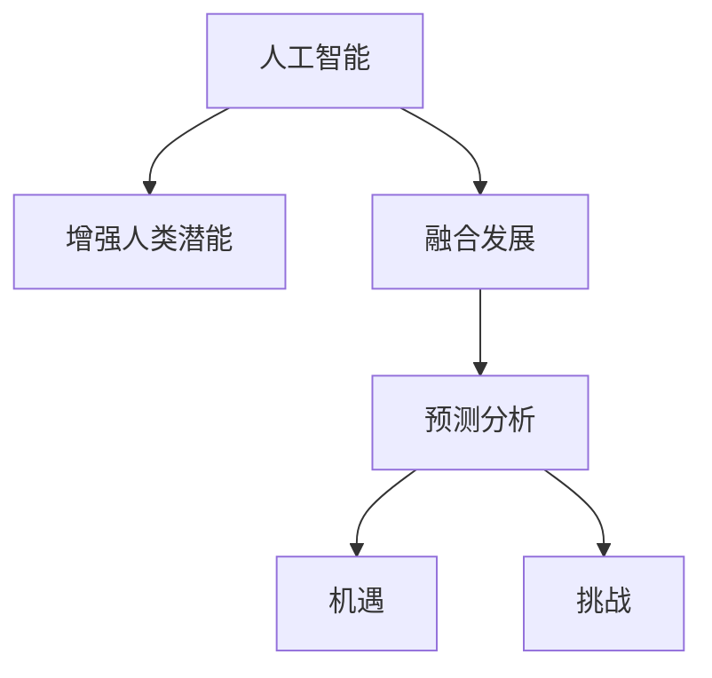

                 

# 人类-AI协作：增强人类潜能与AI能力的融合发展趋势预测分析机遇挑战

> 关键词：人工智能，协作，增强人类潜能，融合发展，预测分析，机遇，挑战

## 1. 背景介绍

### 1.1 问题由来

近年来，人工智能（AI）技术迅猛发展，深度学习、自然语言处理、计算机视觉等技术不断突破。AI技术正逐步渗透到各行各业，对人类工作和生活方式产生了深远影响。然而，AI技术的迅速发展也引发了一系列社会、伦理和治理问题，如就业替代、数据隐私、算法偏见等。在这样一个背景下，如何更好地利用AI技术，既发挥其优势，又能避免其负面影响，成为当前社会和技术界的重要课题。

### 1.2 问题核心关键点

本文旨在探讨人工智能与人类协作的趋势、机遇和挑战，分析AI技术在增强人类潜能和提升AI能力方面的发展方向，预测未来AI与人类协作的新模式，并提供相关的建议和指导。

## 2. 核心概念与联系

### 2.1 核心概念概述

为更好地理解AI与人类协作的趋势，本节将介绍几个密切相关的核心概念：

- **人工智能（AI）**：通过计算机模拟人类智能活动的技术体系，包括机器学习、深度学习、自然语言处理等。
- **增强人类潜能（Augmented Human Capability）**：通过AI技术扩展和增强人类的认知、决策和行动能力，提升人类在复杂环境中的表现。
- **融合发展（Convergence Development）**：AI技术与人类在信息、认知、决策等方面的相互融合和相互增强，实现共生共荣。
- **预测分析（Predictive Analysis）**：利用AI技术对未来趋势进行预测和分析，帮助决策者制定更有效的策略。
- **机遇与挑战（Opportunities and Challenges）**：AI技术在推动社会进步的同时，也带来了前所未有的挑战，需要在技术、伦理和社会治理等方面进行平衡和协调。

这些核心概念之间的逻辑关系可以通过以下Mermaid流程图来展示：



这个流程图展示了一些核心概念及其之间的关系：

1. 人工智能通过模拟人类智能活动，能够扩展和增强人类的潜能。
2. 融合发展是指AI与人类在信息、认知、决策等方面的相互融合，提升双方的能力。
3. 预测分析利用AI技术对未来趋势进行预测和分析，为决策提供科学依据。
4. 机遇与挑战并存，AI技术在推动社会进步的同时，也带来了新的问题。

## 3. 核心算法原理 & 具体操作步骤

### 3.1 算法原理概述

AI与人类协作的算法原理主要基于强化学习、迁移学习、协同过滤等技术。强化学习通过奖励机制训练AI模型，使其能够自主学习并在实际场景中表现良好；迁移学习通过将已有知识应用到新任务上，加速新任务的学习；协同过滤则通过分析用户行为数据，推荐相似内容，提升用户体验。

### 3.2 算法步骤详解

AI与人类协作的具体步骤包括：

1. **数据收集与预处理**：收集人类行为数据和环境数据，进行清洗和标准化处理。
2. **模型训练与优化**：使用强化学习、迁移学习等算法训练AI模型，优化模型性能。
3. **模型部署与测试**：将训练好的模型部署到实际场景中，并进行测试和评估，验证模型的效果。
4. **人机交互与反馈**：通过人机交互系统收集人类反馈，调整和优化AI模型。
5. **持续改进与更新**：根据反馈数据和环境变化，不断改进和更新AI模型。

### 3.3 算法优缺点

AI与人类协作的算法具有以下优点：

- **效率提升**：AI模型可以快速处理大量数据，提高决策效率。
- **智能增强**：通过AI模型的辅助，人类可以更好地利用数据和信息，提升决策能力。
- **个性化服务**：AI模型能够根据用户行为和偏好提供个性化服务，提升用户体验。

同时，这些算法也存在一定的局限性：

- **数据依赖**：模型效果依赖于数据的质量和数量，缺乏高质量数据可能影响模型表现。
- **黑箱问题**：某些AI模型的决策过程复杂，难以解释，难以保证透明性和公平性。
- **伦理风险**：AI模型可能存在偏见和歧视，对特定群体造成不公。

### 3.4 算法应用领域

AI与人类协作的应用领域非常广泛，以下是几个典型场景：

- **医疗健康**：通过AI模型分析患者数据，辅助医生进行诊断和治疗，提升医疗服务的精准度和效率。
- **教育培训**：利用AI模型分析学习者行为，提供个性化学习推荐，提升学习效果。
- **智能制造**：通过AI模型优化生产流程和质量控制，提高生产效率和产品质量。
- **金融服务**：使用AI模型进行风险评估和欺诈检测，提升金融服务的可靠性和安全性。
- **城市管理**：通过AI模型分析城市数据，优化交通管理和公共服务，提升城市运行效率。

## 4. 数学模型和公式 & 详细讲解 & 举例说明

### 4.1 数学模型构建

AI与人类协作的数学模型通常包括强化学习、迁移学习、协同过滤等模型。以强化学习为例，模型构建包括状态空间、动作空间、奖励函数等关键组件。

- **状态空间（State Space）**：描述环境中的各种可能状态，如医疗数据、用户行为等。
- **动作空间（Action Space）**：描述AI模型可以采取的行动，如诊断建议、内容推荐等。
- **奖励函数（Reward Function）**：根据AI模型的行动和环境变化，计算奖励值，激励模型学习。

### 4.2 公式推导过程

以强化学习中的Q-learning算法为例，推导其核心公式：

$$
Q(s_t, a_t) = Q(s_t, a_t) + \alpha [r_t + \gamma \max_{a_{t+1}} Q(s_{t+1}, a_{t+1}) - Q(s_t, a_t)]
$$

其中：
- $s_t$ 表示当前状态，$a_t$ 表示当前动作，$r_t$ 表示当前奖励，$\gamma$ 表示折扣因子，$\alpha$ 表示学习率。

### 4.3 案例分析与讲解

以医疗健康领域的AI应用为例，使用强化学习模型对患者数据进行训练，构建推荐系统，辅助医生进行诊断和治疗。该模型需要处理大量医疗数据，包括患者的病历、实验室检查结果、影像数据等。通过强化学习，模型能够在不断反馈中优化推荐策略，提升诊断和治疗效果。

## 5. 项目实践：代码实例和详细解释说明

### 5.1 开发环境搭建

在进行AI与人类协作的实践前，我们需要准备好开发环境。以下是使用Python进行强化学习开发的常见环境配置流程：

1. 安装Anaconda：从官网下载并安装Anaconda，用于创建独立的Python环境。

2. 创建并激活虚拟环境：
```bash
conda create -n rl-env python=3.8 
conda activate rl-env
```

3. 安装相关库：
```bash
pip install gym gymnasium gym-spreadsheet gym-pandas gym-owari gym-vars
```

4. 安装OpenAI Gym：
```bash
pip install gym[atari] numpy gym-pybullet
```

完成上述步骤后，即可在`rl-env`环境中开始强化学习实践。

### 5.2 源代码详细实现

以下是使用Python和Gym库实现Q-learning算法的示例代码：

```python
import gym
import numpy as np

env = gym.make('CartPole-v1')

# 初始化Q表
Q = np.zeros([env.observation_space.shape[0], env.action_space.n])

# 定义学习率和折扣因子
alpha = 0.5
gamma = 0.9

# 训练过程
for episode in range(1000):
    state = env.reset()
    done = False
    while not done:
        # 根据Q表选择动作
        action = np.argmax(Q[state])
        # 执行动作，获取奖励和下一状态
        next_state, reward, done, _ = env.step(action)
        # 更新Q表
        Q[state, action] += alpha * (reward + gamma * np.max(Q[next_state]) - Q[state, action])
        state = next_state

print("Q表：", Q)
```

### 5.3 代码解读与分析

让我们再详细解读一下关键代码的实现细节：

- `gym.make('CartPole-v1')`：创建一个CartPole环境，该环境用于测试强化学习算法的性能。
- `Q = np.zeros([env.observation_space.shape[0], env.action_space.n])`：初始化Q表，用于存储状态-动作对的历史奖励信息。
- `while not done:`：模拟环境中的每一轮状态-动作序列。
- `Q[state, action] += alpha * (reward + gamma * np.max(Q[next_state]) - Q[state, action])`：根据Q表选择动作，并更新Q表。

运行上述代码，可以观察到Q表的变化，分析强化学习算法的收敛性和效果。

### 5.4 运行结果展示

运行上述代码后，可以观察到Q表的逐步优化过程，以及最终的学习效果。例如，在CartPole环境中，Q表逐步逼近最优解，使得AI模型能够更好地控制小车，使其在稳定的状态下保持平衡。

## 6. 实际应用场景

### 6.1 医疗健康

AI与人类协作在医疗健康领域有着广泛应用。例如，利用深度学习模型对患者影像数据进行自动分析，提供初步诊断建议；使用强化学习模型对患者数据进行分析，优化治疗方案；利用自然语言处理技术分析患者文本数据，提供情感支持和心理辅导。这些应用不仅提高了医疗服务的效率和质量，还减轻了医生的工作负担，提升了患者的满意度。

### 6.2 教育培训

AI与人类协作在教育培训领域也有着广泛应用。例如，利用机器学习技术对学生学习数据进行分析，提供个性化学习推荐；使用自然语言处理技术分析学生作业和反馈，提供针对性的教学建议；利用增强现实技术提供互动式教学，增强学生的学习兴趣和效果。这些应用不仅提高了教学质量，还提升了学生的学习体验和效率。

### 6.3 智能制造

AI与人类协作在智能制造领域也有着广泛应用。例如，利用机器学习模型对生产数据进行分析，优化生产流程和质量控制；使用增强现实技术辅助工人进行设备维护和操作；利用自然语言处理技术分析生产记录和反馈，提供生产优化建议。这些应用不仅提高了生产效率和产品质量，还提升了生产线的智能化水平。

### 6.4 未来应用展望

随着AI技术的不断发展，AI与人类协作的应用场景将会更加丰富和多样化。未来的发展方向可能包括：

1. **多模态融合**：将视觉、听觉、触觉等多模态数据融合，提升AI模型对复杂环境的理解和反应能力。
2. **跨领域协作**：将AI技术与不同领域的专业知识结合，提升跨领域协作的效率和效果。
3. **智能决策**：通过AI模型对大量数据进行分析，提供科学决策支持，提升决策的精准性和可靠性。
4. **实时交互**：利用自然语言处理技术实现实时的人机交互，提升用户体验和互动效果。

## 7. 工具和资源推荐

### 7.1 学习资源推荐

为了帮助开发者系统掌握AI与人类协作的理论基础和实践技巧，这里推荐一些优质的学习资源：

1. **《人工智能基础》系列博文**：由大模型技术专家撰写，深入浅出地介绍了AI技术的基础知识，涵盖强化学习、自然语言处理、计算机视觉等领域。
2. **《深度学习》课程**：斯坦福大学开设的深度学习明星课程，有Lecture视频和配套作业，带你入门AI技术的基本概念和经典模型。
3. **《强化学习》书籍**：Sutton和Barto的经典之作，全面介绍了强化学习的基本原理和应用案例。
4. **《自然语言处理》书籍**：D Jurafsky和J Harchol-Bing的著作，涵盖自然语言处理的基本概念和技术。
5. **OpenAI Gym**：一个开源的AI研究平台，提供多种环境和算法，方便研究者进行实验和测试。

通过对这些资源的学习实践，相信你一定能够快速掌握AI与人类协作的精髓，并用于解决实际的AI应用问题。

### 7.2 开发工具推荐

高效的开发离不开优秀的工具支持。以下是几款用于AI与人类协作开发的常用工具：

1. **Python**：广泛用于AI和机器学习领域，拥有丰富的第三方库和框架，如NumPy、Pandas、TensorFlow等。
2. **Jupyter Notebook**：一个交互式的笔记本环境，支持代码执行和数据分析，方便研究和实验。
3. **Gym**：一个开源的AI研究平台，提供多种环境和算法，方便研究者进行实验和测试。
4. **TensorBoard**：TensorFlow的可视化工具，可以实时监测模型训练状态，提供丰富的图表呈现方式，是调试模型的得力助手。
5. **AutoML**：自动化机器学习工具，可以自动搜索最优模型和超参数，提高模型开发的效率和效果。

合理利用这些工具，可以显著提升AI与人类协作的开发效率，加快创新迭代的步伐。

### 7.3 相关论文推荐

AI与人类协作的发展源于学界的持续研究。以下是几篇奠基性的相关论文，推荐阅读：

1. **DeepMind的AlphaGo**：利用深度学习和强化学习技术，让AI模型在围棋领域超越人类水平，展示了AI在复杂决策中的强大能力。
2. **GPT-3的发布**：OpenAI发布的自然语言处理大模型，展示了AI在语言生成和理解方面的突破。
3. **AlphaStar**：利用强化学习和自我对弈技术，让AI模型在星际争霸游戏中取得优异成绩，展示了AI在复杂策略游戏中的能力。
4. **AlphaFold**：利用深度学习和强化学习技术，让AI模型在蛋白质折叠问题上取得突破，展示了AI在生物信息学中的潜力。
5. **GNN（Graph Neural Networks）**：利用图神经网络技术，将AI应用于社交网络和知识图谱领域，展示了AI在复杂网络分析中的应用。

这些论文代表了大模型技术的发展脉络。通过学习这些前沿成果，可以帮助研究者把握学科前进方向，激发更多的创新灵感。

## 8. 总结：未来发展趋势与挑战

### 8.1 总结

本文对AI与人类协作的趋势、机遇和挑战进行了全面系统的介绍。首先阐述了AI技术在增强人类潜能和提升AI能力方面的独特价值，明确了AI与人类协作在各行业领域的广泛应用。其次，从原理到实践，详细讲解了AI与人类协作的数学模型和具体算法，提供了微调模型的完整代码实例。同时，本文还探讨了AI与人类协作在医疗健康、教育培训、智能制造等领域的实际应用，展示了AI技术在不同行业中的巨大潜力。最后，本文精选了AI与人类协作的相关学习资源，力求为读者提供全方位的技术指引。

通过本文的系统梳理，可以看到，AI与人类协作技术正在成为AI落地应用的重要范式，极大地拓展了AI技术的应用边界，催生了更多的落地场景。受益于大规模数据和算力的支持，AI与人类协作在各行业领域的应用前景广阔。未来，伴随AI技术的持续演进，AI与人类协作必将在更多领域发挥作用，为经济社会发展注入新的动力。

### 8.2 未来发展趋势

展望未来，AI与人类协作的发展趋势可能包括：

1. **多模态融合**：将视觉、听觉、触觉等多模态数据融合，提升AI模型对复杂环境的理解和反应能力。
2. **跨领域协作**：将AI技术与不同领域的专业知识结合，提升跨领域协作的效率和效果。
3. **智能决策**：通过AI模型对大量数据进行分析，提供科学决策支持，提升决策的精准性和可靠性。
4. **实时交互**：利用自然语言处理技术实现实时的人机交互，提升用户体验和互动效果。
5. **自适应学习**：利用增强学习技术，让AI模型能够自适应不同的环境和工作任务，提高其泛化性和鲁棒性。

以上趋势凸显了AI与人类协作技术的广阔前景。这些方向的探索发展，必将进一步提升AI技术在各行业领域的应用效果，为人类认知智能的进化带来深远影响。

### 8.3 面临的挑战

尽管AI与人类协作技术已经取得了显著进展，但在迈向更加智能化、普适化应用的过程中，仍面临诸多挑战：

1. **数据隐私和安全**：AI模型需要大量数据进行训练，但数据隐私和安全问题日益突出，需要在数据收集和使用中加以保护。
2. **算法透明性**：AI模型往往被视为"黑箱"系统，难以解释其内部工作机制和决策逻辑，需要在算法设计和开发中提高透明性和可解释性。
3. **伦理和公平性**：AI模型可能存在偏见和歧视，对特定群体造成不公，需要在算法设计和应用中考虑伦理和公平性问题。
4. **资源和成本**：AI模型的训练和应用需要大量资源和成本，需要寻找更加高效和低成本的解决方案。
5. **法律和政策**：AI技术的发展需要相应的法律和政策支持，需要在技术发展和应用推广中加以平衡和协调。

### 8.4 研究展望

为了应对AI与人类协作面临的挑战，未来的研究需要在以下几个方面寻求新的突破：

1. **数据隐私保护**：利用差分隐私、联邦学习等技术，保护用户数据隐私。
2. **算法透明性**：引入可解释性技术和工具，提高AI模型的透明性和可解释性。
3. **伦理和公平性**：引入伦理导向的评估指标，过滤和惩罚有偏见和歧视的输出倾向。
4. **资源和成本优化**：利用模型压缩、稀疏化存储等技术，优化AI模型的计算和存储资源。
5. **法律和政策支持**：制定和完善相关法律法规，支持AI技术的健康发展和应用推广。

这些研究方向的探索，必将引领AI与人类协作技术迈向更高的台阶，为构建安全、可靠、可解释、可控的智能系统铺平道路。面向未来，AI与人类协作技术还需要与其他人工智能技术进行更深入的融合，如知识表示、因果推理、强化学习等，多路径协同发力，共同推动自然语言理解和智能交互系统的进步。只有勇于创新、敢于突破，才能不断拓展AI技术在各行业领域的应用边界，让智能技术更好地造福人类社会。

## 9. 附录：常见问题与解答

**Q1：AI与人类协作是否适用于所有行业？**

A: AI与人类协作技术可以在大多数行业中得到应用，但其应用效果和范围取决于行业特性和数据资源的丰富程度。例如，金融、医疗、教育等数据资源丰富的行业，AI与人类协作的应用效果会更好。

**Q2：如何选择合适的AI与人类协作算法？**

A: 选择合适的AI与人类协作算法需要考虑多个因素，如任务特性、数据类型、计算资源等。一般建议先进行模型评估和实验，选择最适合的算法。例如，对于推荐系统，可以使用协同过滤、深度学习等算法；对于情感分析，可以使用自然语言处理技术。

**Q3：AI与人类协作的模型如何部署？**

A: AI与人类协作的模型部署需要考虑多个因素，如模型大小、计算资源、系统架构等。一般建议采用云服务或本地服务器进行模型部署。例如，使用AWS、阿里云等云服务进行模型部署，或使用Kubernetes等容器化技术进行模型部署。

**Q4：AI与人类协作的模型如何持续改进？**

A: AI与人类协作的模型需要不断进行训练和优化，才能保持其性能和效果。一般建议定期进行模型重训练，并利用在线学习和增量学习技术，实时更新模型参数。例如，在电商网站中，可以使用在线学习技术，根据用户行为数据实时调整推荐策略。

**Q5：AI与人类协作的模型如何保证安全性和公平性？**

A: AI与人类协作的模型需要保证安全性和公平性，以避免对特定群体造成不公。一般建议引入伦理导向的评估指标，过滤和惩罚有偏见和歧视的输出倾向。例如，在招聘系统中，可以使用公平性评估指标，避免对特定性别或年龄群体的不公。

总之，AI与人类协作技术的发展前景广阔，但需要在技术、伦理和社会治理等方面进行全面考虑，才能充分发挥其优势，造福全人类。相信随着学界和产业界的共同努力，AI与人类协作技术必将迎来新的突破，推动人类社会的全面进步。

