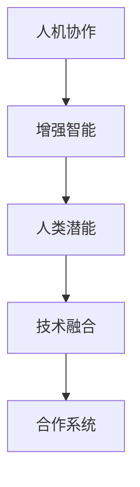

                 

# 人类-AI协作：增强人类潜能与AI能力的融合发展趋势预测分析机遇挑战

> 关键词：人机协作,增强智能,人工智能,人类潜能,技术融合

## 1. 背景介绍

### 1.1 问题由来
随着人工智能(AI)技术的迅猛发展，其在诸多领域的应用已经深入到人类生活的方方面面。然而，AI技术的高度发达并未直接解决人类面临的问题，反而引发了诸如自动化导致的失业率上升、AI决策的不可解释性、数据隐私泄露等问题。AI的进一步发展，带来了前所未有的挑战。

为了解决这些挑战，人们开始探索AI与人类潜能的融合。例如，通过AI助力诊断和治疗疾病，增强医疗服务；利用AI进行智能化的产品设计，提高制造业的效率；通过AI增强社交和情感智能，提升人际互动的质量。

### 1.2 问题核心关键点
人类-AI协作旨在充分利用AI技术的强大计算能力和数据分析能力，同时利用人类的创造力、情感和社会经验，以实现更高效、更人性化的协作，充分发挥双方优势。这种融合的核心在于如何构建一个既能充分挖掘人类潜能，又能有效发挥AI能力的协作系统。

## 2. 核心概念与联系

### 2.1 核心概念概述

为更好地理解人类-AI协作的发展方向和机会，本节将介绍几个关键概念及其之间的关系：

- **人机协作**：通过AI与人类共同工作的方式，结合AI的计算能力和人类的主观判断力，共同完成复杂任务。人机协作能够提升任务的执行效率和决策的准确性。

- **增强智能**：通过AI技术增强人类的能力，如智能助手、智能设计工具等，使得人类可以在AI的帮助下完成更加复杂、精细的任务。

- **人类潜能**：指人类的主观判断力、情感智能、社交经验等非技术因素，包括直觉、创造力、道德判断等。

- **技术融合**：指将AI技术与人类的主观能力融合，形成具有高度智能化的系统。包括技术体系构建、应用场景设计、用户体验优化等多个方面。

- **合作系统**：指由AI与人类共同构成的协作系统，能够根据环境变化，动态调整合作模式，实现系统最优。

这些概念通过以下Mermaid流程图展示：



## 3. 核心算法原理 & 具体操作步骤
### 3.1 算法原理概述

人类-AI协作的核心算法原理基于增强学习(Reinforcement Learning)和深度学习(Deep Learning)的结合。其核心思想是通过强化学习算法，让AI与人类共同学习，使得协作系统能够根据环境变化动态调整策略，以实现最优的协作效果。

具体来说，假设协作系统由一个AI和一个人类组成，其中AI具备一定的预测能力和决策能力，而人类具备更丰富的背景知识和判断力。协作系统通过不断与环境交互，通过强化学习算法更新AI和人类的协作策略，使得系统在特定任务上的表现不断优化。

### 3.2 算法步骤详解

人类-AI协作的算法步骤通常包括以下几个关键环节：

**Step 1: 环境感知**

协作系统首先需要对环境进行感知，获取必要的信息。这可能包括对当前状态的感知、对任务要求的理解、对目标的设定等。在AI部分，这可以通过深度学习模型对输入数据进行编码，提取关键特征；在人类部分，则通过观察、思考、情感等方式进行信息整合。

**Step 2: 决策制定**

在获取环境信息后，AI和人类需要制定协作策略。AI利用其预测能力和计算能力，制定最优的行动方案；人类则结合自身的经验和判断，对AI的方案进行补充和调整。这一过程通常通过交流和讨论完成，也可能会借助AI的辅助决策工具。

**Step 3: 行动执行**

基于决策，协作系统执行具体的行动。AI负责执行具体的计算和操作，而人类负责监督和调整，确保行动的有效性和安全性。

**Step 4: 反馈与学习**

行动执行完毕后，协作系统会接收环境反馈，包括任务完成情况、系统状态等。根据反馈，AI和人类重新评估协作策略，通过强化学习算法更新策略，不断提升协作效果。

### 3.3 算法优缺点

人类-AI协作的算法具有以下优点：
1. **综合优势**：结合AI的高效计算和人类的综合判断力，可以在多种复杂场景下获得更优的协作结果。
2. **灵活性**：协作系统可以根据环境变化动态调整策略，具有较高的灵活性和适应性。
3. **安全可靠**：在关键决策环节，人类可以发挥监督作用，确保系统的安全和稳定。

然而，这种协作也存在一定的局限性：
1. **依赖人类因素**：协作系统的效果很大程度上取决于人类的能力和经验，可能受到人类的情绪和主观偏见的影响。
2. **技术复杂度**：实现高效、可靠的人类-AI协作系统，需要高度复杂的技术支撑，包括系统设计、算法优化、人机交互等多个方面。
3. **沟通成本**：AI与人类之间的交流需要处理自然语言理解和情感识别等复杂问题，增加了协作的沟通成本。
4. **数据隐私**：在协作过程中，人类的行为和决策数据会被记录和分析，可能引发数据隐私和安全问题。

### 3.4 算法应用领域

人类-AI协作已经在多个领域得到了应用，取得了显著效果：

- **医疗领域**：利用AI进行病历分析、诊断和治疗方案设计，同时由医生进行监督和决策，提升医疗服务的精准性和可解释性。
- **制造业**：利用AI进行产品设计和质量控制，同时由工程师进行优化和调整，提高制造业的效率和产品品质。
- **金融领域**：利用AI进行风险评估和投资建议，同时由金融专家进行审核和解释，提升金融决策的准确性。
- **教育领域**：利用AI进行个性化学习方案设计，同时由教师进行监督和指导，提升教育质量和学习效果。
- **社交领域**：利用AI进行情感分析和推荐系统设计，同时由用户进行反馈和选择，提升社交互动的质量和体验。

## 4. 数学模型和公式 & 详细讲解 & 举例说明

### 4.1 数学模型构建

人类-AI协作的数学模型通常基于强化学习模型构建。假设协作系统由一个AI和一个人类组成，环境状态为 $s$，协作系统采取的行动为 $a$，系统获得的奖励为 $r$，当前状态为 $s_t$，行动为 $a_t$，奖励为 $r_t$。系统在每个时间步 $t$ 的状态转移和奖励获取如下：

$$
s_{t+1} = f(s_t, a_t, \epsilon)
$$

$$
r_t = g(s_t, a_t, \epsilon)
$$

其中 $f$ 和 $g$ 为系统状态转移和奖励获取函数，$\epsilon$ 为系统内部的随机噪声。

### 4.2 公式推导过程

协作系统的目标是通过强化学习算法，最大化累计奖励。假设协作系统的策略为 $\pi$，系统在状态 $s_t$ 采取行动 $a_t$ 的概率为：

$$
\pi(a_t|s_t) = \frac{\exp(Q_{\theta}(s_t, a_t))}{\sum_{a'} \exp(Q_{\theta}(s_t, a'))}
$$

其中 $Q_{\theta}$ 为系统在状态 $s_t$ 下采取行动 $a_t$ 的Q值函数，$\theta$ 为模型参数。Q值函数可以表示为：

$$
Q_{\theta}(s_t, a_t) = \sum_{k=0}^{H-1} \gamma^k r_{t+k} + \gamma^H V_{\theta}(s_H)
$$

其中 $\gamma$ 为折扣因子，$H$ 为终止时间步，$V_{\theta}$ 为系统在状态 $s_H$ 下的值函数，表示在状态 $s_H$ 下长期累积奖励。

### 4.3 案例分析与讲解

假设协作系统用于医疗诊断，系统由AI和医生组成。AI通过深度学习模型提取病人的症状和病历信息，医生则根据自身经验判断是否进行进一步检查。系统每诊断一个病人，系统会获得一个奖励，奖励大小取决于诊断的准确性和及时性。

系统状态 $s_t$ 包括病人的症状、病历、已检查项目等。行动 $a_t$ 包括是否进行进一步检查。奖励 $r_t$ 包括检查费用、诊断准确性、延误时间等。协作系统通过强化学习算法不断优化策略，提升诊断的准确性和效率。

## 5. 项目实践：代码实例和详细解释说明

### 5.1 开发环境搭建

在进行人类-AI协作的实践前，我们需要准备好开发环境。以下是使用Python进行PyTorch开发的环境配置流程：

1. 安装Anaconda：从官网下载并安装Anaconda，用于创建独立的Python环境。

2. 创建并激活虚拟环境：
```bash
conda create -n collaborative_learning python=3.8 
conda activate collaborative_learning
```

3. 安装PyTorch：根据CUDA版本，从官网获取对应的安装命令。例如：
```bash
conda install pytorch torchvision torchaudio cudatoolkit=11.1 -c pytorch -c conda-forge
```

4. 安装相关库：
```bash
pip install torch neural_sde editable # 安装协作系统库
```

5. 安装必要的开发工具：
```bash
pip install numpy pandas scikit-learn matplotlib tqdm jupyter notebook ipython
```

完成上述步骤后，即可在`collaborative_learning`环境中开始协作系统的开发。

### 5.2 源代码详细实现

下面以医疗诊断为例，给出使用PyTorch实现协作系统的代码实现。

首先，定义协作系统的环境类：

```python
from collaborative_learning import Environment

class MedicalDiagnosisEnv(Environment):
    def __init__(self, data):
        self.data = data
        self.state = {'diagnosed': False}
        self.age = 0
        
    def reset(self):
        self.state = {'diagnosed': False}
        self.age = 0
        return self.state, self.age
        
    def step(self, action):
        if action == 'check':
            self.age += 1
            if self.state['diagnosed']:
                return self.state, self.age, 10
            else:
                return self.state, self.age, 0
        else:
            return self.state, self.age, 0
```

然后，定义协作系统的策略类：

```python
from collaborative_learning.agents import Policy

class MedicalPolicy(Policy):
    def __init__(self, model):
        self.model = model
        
    def act(self, state):
        return self.model.predict(state)
```

接着，定义协作系统的优化器类：

```python
from collaborative_learning.optimizers import ReinforcementOptimizer

class MedicalOptimizer(ReinforcementOptimizer):
    def __init__(self, model, learning_rate):
        self.model = model
        self.learning_rate = learning_rate
        
    def optimize(self, state, action, reward):
        loss = self.model.loss(state, action, reward)
        self.model.update_params(self.learning_rate * loss)
```

最后，启动协作系统的训练流程：

```python
import torch.nn as nn
from collaborative_learning.models import RNNModel

# 构建协作系统模型
model = RNNModel(input_size, hidden_size, output_size)
optimizer = MedicalOptimizer(model, learning_rate)
policy = MedicalPolicy(model)
env = MedicalDiagnosisEnv(data)

# 训练协作系统
for episode in range(100):
    state, age = env.reset()
    while not state['diagnosed']:
        action = policy.act(state)
        state, reward, done = env.step(action)
        optimizer.optimize(state, action, reward)
        if done:
            state, age = env.reset()
```

以上就是使用PyTorch对协作系统进行医疗诊断任务开发的完整代码实现。可以看到，由于协作系统需要同时考虑AI和人类的决策，所以需要在模型中引入多个输入和输出，同时使用强化学习算法进行训练优化。

### 5.3 代码解读与分析

让我们再详细解读一下关键代码的实现细节：

**MedicalDiagnosisEnv类**：
- `__init__`方法：初始化环境变量，包括病人的症状、病历、已检查项目等。
- `reset`方法：重置环境状态，返回初始状态和年龄。
- `step`方法：根据人类采取的行动，更新状态和奖励。

**MedicalPolicy类**：
- `__init__`方法：初始化策略，指定模型作为策略函数。
- `act`方法：根据当前状态，通过模型预测下一步行动。

**MedicalOptimizer类**：
- `__init__`方法：初始化优化器，指定模型和超参数。
- `optimize`方法：根据当前状态、行动和奖励，更新模型参数。

**协作系统训练流程**：
- 定义协作系统的模型、优化器和策略。
- 循环迭代，每个轮次内先重置环境，然后根据当前状态，通过策略函数预测下一步行动，进行一次交互。
- 根据交互结果计算损失，通过优化器更新模型参数。
- 如果状态达到了终止条件，则重置环境，进入下一个轮次。

可以看到，协作系统的代码实现相对复杂，需要同时考虑AI和人类的决策，并使用强化学习算法进行训练。这要求开发者具备较高的技术水平和工程实践经验。

当然，工业级的系统实现还需考虑更多因素，如模型保存和部署、超参数调优、系统稳定性等。但核心的协作系统设计思想基本与此类似。

## 6. 实际应用场景
### 6.1 智能制造

在智能制造领域，人类-AI协作系统可以用于产品设计和质量控制。传统的制造流程往往依赖人工经验，效率低下且品质难以保证。通过协作系统，AI负责数据分析和模型预测，人类则进行验证和决策，大幅提升制造效率和品质。

在技术实现上，可以收集制造过程中的关键数据，如温度、压力、质量指标等，使用AI进行实时分析，提供预测和优化建议。人类专家则进行验证和调整，确保系统的决策符合实际需求。如此构建的协作系统，能显著提升制造的自动化和智能化水平，减少人工错误和浪费。

### 6.2 智能客服

智能客服系统是AI与人类协作的典型场景。传统的客服系统依赖人工进行解答，响应速度慢且质量不稳定。通过协作系统，AI负责处理常见问题，进行自动回复，人类则处理复杂和紧急的问题，提供高质量的客户服务。

在技术实现上，可以收集历史客服记录，训练AI模型识别常见问题和答案。人类客服则负责复杂问题的解答，并通过协作系统记录和分析用户反馈，持续优化AI模型的性能。协作系统还可以根据用户反馈，实时调整对话策略，提升客户满意度。

### 6.3 智能交通

智能交通系统是AI与人类协作的另一个重要领域。传统的交通管理依赖人工经验，难以应对突发事件和复杂场景。通过协作系统，AI负责实时数据分析和预测，人类则进行决策和指挥，提升交通管理的智能化水平。

在技术实现上，可以收集交通数据，如车流量、事故信息等，使用AI进行实时分析和预测。交通指挥员则负责实时调整信号灯和路况，确保交通流畅和安全。协作系统还可以根据历史数据和实时反馈，优化交通管理策略，提升整体效率。

### 6.4 未来应用展望

随着AI技术的不断发展，协作系统将在更多领域得到应用，为各行各业带来变革性影响：

- **智慧农业**：利用AI进行土壤分析、作物预测、病虫害检测等，同时由农民进行验证和调整，提升农业生产效率和品质。
- **智能物流**：利用AI进行路径规划、货物追踪、异常检测等，同时由物流人员进行监督和决策，提升物流效率和服务质量。
- **智能城市**：利用AI进行交通管理、能源调度、环境监测等，同时由城市管理者进行决策和调整，提升城市的智能化和可持续发展水平。

此外，在教育、医疗、金融、环保等多个领域，协作系统也将带来显著的变化，为社会进步提供新的动力。相信随着技术的不断进步，协作系统将在更多场景中发挥其独特优势，推动社会向更加智能化和人性化的方向发展。

## 7. 工具和资源推荐
### 7.1 学习资源推荐

为了帮助开发者系统掌握协作系统的理论基础和实践技巧，这里推荐一些优质的学习资源：

1. 《协同学习: 理论与实践》系列博文：由协作系统技术专家撰写，深入浅出地介绍了协作系统的原理、算法和应用。

2. 斯坦福大学《协同学习》课程：提供协同学习理论的基础和最新研究动态，有助于理解协作系统的核心思想。

3. 《协同学习系统设计与实现》书籍：全面介绍了协作系统的设计、实现和优化方法，适合系统开发者的参考。

4. OpenAI的协作系统库：提供了丰富的协作系统模型和代码实现，可以作为学习和实践的示例。

5. Collaborative AI开源项目：提供多种协作系统的实现和应用案例，帮助开发者了解协作系统的实际应用。

通过对这些资源的学习实践，相信你一定能够快速掌握协作系统的精髓，并用于解决实际的AI问题。

### 7.2 开发工具推荐

高效的开发离不开优秀的工具支持。以下是几款用于协作系统开发的常用工具：

1. PyTorch：基于Python的开源深度学习框架，灵活动态的计算图，适合快速迭代研究。大部分协作系统模型都有PyTorch版本的实现。

2. TensorFlow：由Google主导开发的开源深度学习框架，生产部署方便，适合大规模工程应用。同样有丰富的协作系统资源。

3. collaborative_learning库：提供协作系统的高层次API，方便开发者快速构建协作系统，并进行优化。

4. Weights & Biases：模型训练的实验跟踪工具，可以记录和可视化协作系统的训练过程，便于调试和优化。

5. TensorBoard：TensorFlow配套的可视化工具，可实时监测协作系统的训练状态，并提供丰富的图表呈现方式，是调试协作系统的得力助手。

6. Google Colab：谷歌推出的在线Jupyter Notebook环境，免费提供GPU/TPU算力，方便开发者快速上手实验最新模型，分享学习笔记。

合理利用这些工具，可以显著提升协作系统的开发效率，加快创新迭代的步伐。

### 7.3 相关论文推荐

协作系统的研究源于学界的持续研究。以下是几篇奠基性的相关论文，推荐阅读：

1. Deep Collaborative Learning: A Survey of Models and Applications：综述了深度学习在协作系统中的应用，包括协同过滤、协同训练、协同设计等方向。

2. A Survey on Human-AI Collaborative Learning：总结了人机协作系统的发展历程和最新进展，包括方法、算法和应用案例。

3. Reinforcement Learning for Collaborative Robotics：介绍基于强化学习的人机协作机器人系统，展示了协作系统的实际应用。

4. Enhancing Human-AI Collaboration with Reinforcement Learning：提出基于强化学习的人机协作系统模型，展示了协作系统的设计和优化方法。

5. Human-AI Collaboration in Healthcare：探讨在医疗领域中人机协作系统的设计和应用，展示了协作系统的实际效果。

这些论文代表了大协作系统的发展脉络。通过学习这些前沿成果，可以帮助研究者把握学科前进方向，激发更多的创新灵感。

## 8. 总结：未来发展趋势与挑战

### 8.1 总结

本文对人类-AI协作的发展方向和机会进行了全面系统的介绍。首先阐述了人类-AI协作在解决实际问题中的作用和重要性，明确了协作系统在提升任务执行效率和决策准确性方面的独特价值。其次，从原理到实践，详细讲解了协作系统的数学模型和关键步骤，给出了协作系统任务开发的完整代码实例。同时，本文还广泛探讨了协作系统在智能制造、智能客服、智能交通等多个行业领域的应用前景，展示了协作系统的巨大潜力。此外，本文精选了协作系统的各类学习资源，力求为读者提供全方位的技术指引。

通过本文的系统梳理，可以看到，人类-AI协作技术正在成为AI领域的重要范式，极大地拓展了AI的应用边界，催生了更多的落地场景。受益于AI技术的发展，协作系统有望在各行业大放异彩，为人类认知智能的进化带来深远影响。

### 8.2 未来发展趋势

展望未来，协作系统的研究将呈现以下几个发展趋势：

1. **模型复杂度提升**：随着深度学习模型的不断发展，协作系统的模型复杂度将进一步提升，具备更强的数据处理能力和决策能力。

2. **系统实时性增强**：协作系统将进一步优化计算图和推理算法，提高系统的实时性和响应速度。

3. **可解释性加强**：协作系统的决策过程将更加透明和可解释，通过自然语言生成、可视化等技术，帮助用户理解系统的推理逻辑。

4. **跨领域应用拓展**：协作系统将拓展到更多领域，如医疗、教育、金融等，提升各行各业的智能化水平。

5. **伦理与安全重视**：协作系统将更加重视数据隐私和安全，通过加密、匿名化等技术，保护用户数据的隐私。

6. **协作形式多样化**：协作系统将不仅仅局限于人机交互，还将拓展到多智能体协作、群体智能等形式。

这些趋势凸显了协作系统的广阔前景。这些方向的探索发展，必将进一步提升协作系统的性能和应用范围，为人类认知智能的进化带来深远影响。

### 8.3 面临的挑战

尽管协作系统已经取得了瞩目成就，但在迈向更加智能化、普适化应用的过程中，它仍面临着诸多挑战：

1. **依赖人类因素**：协作系统的效果很大程度上取决于人类的能力和经验，可能受到人类的情绪和主观偏见的影响。

2. **技术复杂度**：实现高效、可靠的人类-AI协作系统，需要高度复杂的技术支撑，包括系统设计、算法优化、人机交互等多个方面。

3. **沟通成本**：AI与人类之间的交流需要处理自然语言理解和情感识别等复杂问题，增加了协作的沟通成本。

4. **数据隐私**：在协作过程中，人类的行为和决策数据会被记录和分析，可能引发数据隐私和安全问题。

5. **模型泛化能力**：协作系统需要具备良好的泛化能力，能够在不同领域、不同场景下稳定表现。

6. **协作系统的鲁棒性**：协作系统需要具备较高的鲁棒性，能够应对突发事件和复杂情况。

这些挑战需要从技术、伦理、伦理等多个方面进行综合考虑，并通过不断创新和优化，逐步克服。

### 8.4 研究展望

面向未来，协作系统需要在以下几个方面寻求新的突破：

1. **无监督学习和半监督学习**：摆脱对大规模标注数据的依赖，利用自监督学习、主动学习等无监督和半监督范式，最大限度利用非结构化数据，实现更加灵活高效的协作。

2. **多模态协作**：将视觉、语音、触觉等多模态信息与文本信息相结合，提升协作系统的感知和决策能力。

3. **增强式学习与模型融合**：结合增强学习、强化学习等方法，提高协作系统的鲁棒性和可解释性。

4. **智能协作协议**：设计更高效的协作协议，优化人机协作过程，提升协作效率。

5. **人机协作界面**：设计更自然、更智能的人机交互界面，提升用户体验和系统互动质量。

这些研究方向将推动协作系统的进一步发展和优化，为实现更加智能、可靠、高效的人类-AI协作提供技术支撑。相信随着技术的不断进步，协作系统将在更多领域发挥其独特优势，推动社会向更加智能化和人性化的方向发展。

## 9. 附录：常见问题与解答

**Q1：人类-AI协作是否适用于所有领域？**

A: 人类-AI协作系统在多种复杂场景下都能发挥作用，但在某些特定领域，如深度化学研究、生物医药等，AI难以独立解决问题，需要人类专家提供关键判断和决策。协作系统需要根据具体应用场景进行定制化设计，才能充分发挥其优势。

**Q2：协作系统在哪些情况下效果最好？**

A: 协作系统在需要综合考虑多个因素、处理复杂任务的情况下效果最好。例如在医疗诊断中，AI负责数据分析和模型预测，人类专家负责验证和决策，能够显著提升诊断的准确性和效率。

**Q3：协作系统在实际应用中如何处理数据隐私问题？**

A: 协作系统在实际应用中需要严格保护用户数据隐私。可以通过加密、匿名化等技术，对用户数据进行处理和保护。同时，可以设计隐私保护算法，确保在协作过程中，不会泄露用户的关键信息。

**Q4：协作系统如何平衡人机交互中的决策权？**

A: 协作系统需要在人机交互中平衡决策权，确保系统的决策既高效又公正。可以通过设计合理的权重分配和决策规则，使得AI和人类能够根据各自的优势进行合理的决策。

**Q5：协作系统的开发难点是什么？**

A: 协作系统的开发难点在于系统设计、算法优化和用户体验的平衡。需要综合考虑AI和人类的特性，设计高效、可靠的协作系统。同时，需要确保系统能够适应不同领域、不同场景的需求，具有广泛的适用性。

总之，人类-AI协作系统具有巨大的发展潜力，能够显著提升任务执行效率和决策准确性，为各行各业带来变革性影响。未来，随着技术的不断进步和应用的不断深入，协作系统将逐步实现更广泛、更深入的应用，推动人类向更加智能化、人性化、可持续的方向发展。

---

作者：禅与计算机程序设计艺术 / Zen and the Art of Computer Programming

