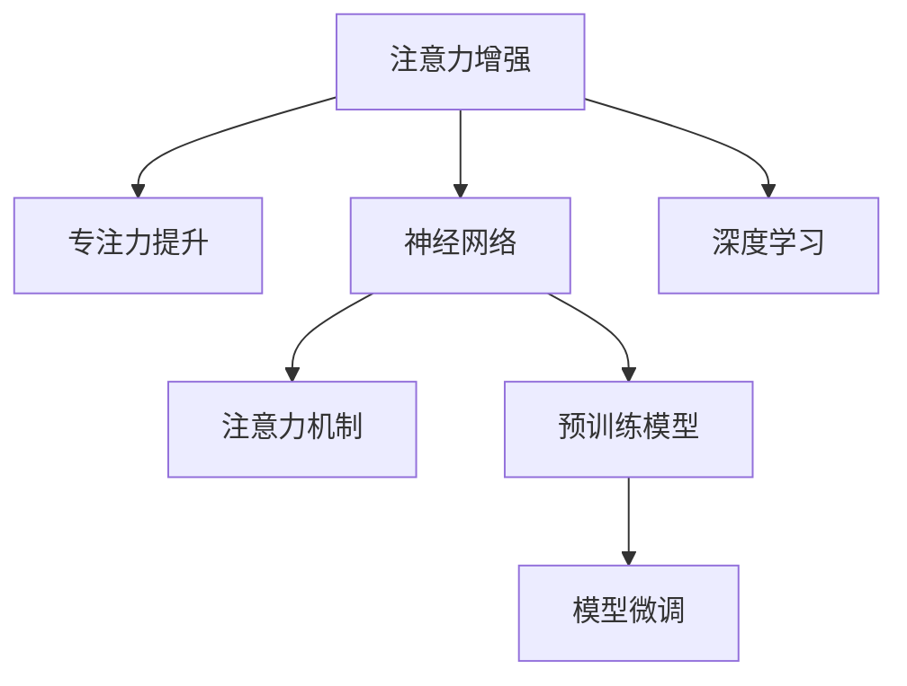

                 

# 人类注意力增强：提升专注力和注意力在医疗中的趋势预测

> 关键词：人类注意力增强, 专注力提升, 医疗应用, 趋势预测, 神经网络, 深度学习, 注意力机制, 预训练模型, 模型微调

## 1. 背景介绍

### 1.1 问题由来
随着现代社会的快节奏和信息爆炸，人类注意力在多个领域面临严峻挑战。特别是在医疗领域，医生面对复杂的诊断和治疗任务，需要在海量信息中找到关键信息，做出科学决策。然而，许多医生和医务人员常因注意力集中度和信息处理能力不足而感到疲劳和效率低下。

### 1.2 问题核心关键点
提升专注力和注意力成为了提升医疗工作质量和效率的关键。具体问题点包括：
- 如何有效地提高医务人员和患者在医疗过程中的注意力集中度？
- 如何构建高效的医疗信息处理和决策支持系统，以减轻医务人员的工作负担？
- 如何在医疗环境中应用先进的注意力增强技术，提升诊断和治疗的准确性和效率？
- 如何结合人工智能和神经网络技术，构建精准的医疗预测和趋势分析模型？

### 1.3 问题研究意义
提升专注力和注意力，结合人工智能技术，可以大大提高医疗工作者的工作效率和决策质量，减少误诊、漏诊和过度治疗等问题。对提升患者满意度和医疗服务水平具有重要意义。

## 2. 核心概念与联系

### 2.1 核心概念概述

为更好地理解注意力增强在医疗中的应用，本节将介绍几个密切相关的核心概念：

- **注意力增强**：利用深度学习中的注意力机制，引导模型自动关注输入数据中的关键信息，提高信息处理和决策的精准度。
- **专注力提升**：通过优化神经网络结构，提高模型的注意力集中度，使模型更加专注于重要特征，提高信息处理效率。
- **神经网络**：一种基于人工神经元结构的计算模型，能够通过多层次的非线性映射，实现复杂数据处理和预测任务。
- **深度学习**：一种利用多层神经网络进行数据表示和学习的技术，广泛应用于图像、语音、自然语言处理等领域。
- **注意力机制**：一种机制，通过动态计算输入数据中不同部分的重要性权重，引导模型集中注意力于关键部分，提高信息处理效果。
- **预训练模型**：通过大规模无标签数据进行预训练，学习通用的语言或图像表示，再进行微调以适应特定任务的模型。
- **模型微调**：在预训练模型的基础上，通过有监督数据对模型进行微调，适应特定任务，提升模型性能。

这些核心概念之间的逻辑关系可以通过以下Mermaid流程图来展示：



这个流程图展示了几大核心概念及其之间的联系：

1. 注意力增强利用注意力机制提升模型的专注力。
2. 深度学习框架提供强大的神经网络结构。
3. 预训练模型提供通用的特征表示，适用于多种任务。
4. 模型微调使模型能够适应特定任务，提升性能。

这些概念共同构成了提升专注力和注意力在医疗应用中的技术框架，使其能够在医疗诊断和治疗中发挥重要作用。通过理解这些核心概念，我们可以更好地把握注意力增强在医疗领域的实际应用。

## 3. 核心算法原理 & 具体操作步骤
### 3.1 算法原理概述

提升专注力和注意力在医疗中的应用，核心在于构建能够自动关注关键信息的深度学习模型。常见的注意力机制包括自注意力机制（Self-Attention）和多头注意力机制（Multi-Head Attention）。这些机制通过动态计算输入数据中不同部分的重要性权重，引导模型集中注意力于关键部分，提高信息处理和决策的精准度。

### 3.2 算法步骤详解

提升专注力和注意力在医疗中的应用一般包括以下几个关键步骤：

**Step 1: 准备数据集**
- 收集医疗案例数据，包括病历、检查报告、诊断结果等。
- 将数据集划分为训练集、验证集和测试集，保证数据分布的一致性。

**Step 2: 设计注意力机制**
- 选择适合医疗数据类型的注意力机制，如自注意力机制或多头注意力机制。
- 设计注意力计算公式，计算不同输入特征的重要性权重。
- 在神经网络中嵌入注意力层，构建注意力增强模型。

**Step 3: 构建深度学习模型**
- 选择适合的深度学习框架，如TensorFlow或PyTorch。
- 定义模型的架构，包括输入层、隐藏层、输出层等。
- 设计损失函数，通常使用交叉熵损失等。

**Step 4: 预训练模型**
- 在大规模无标签医疗数据上对模型进行预训练，学习通用的特征表示。
- 使用正则化技术，如Dropout、L2正则化等，避免过拟合。

**Step 5: 模型微调**
- 在标注数据上对模型进行微调，适应特定医疗任务。
- 使用AdamW等优化器，设置合适的学习率。
- 评估模型性能，及时调整模型参数。

**Step 6: 应用模型**
- 部署微调后的模型，对新医疗数据进行预测和分析。
- 定期更新模型，适应医疗数据分布的变化。

以上是提升专注力和注意力在医疗应用中的一般流程。在实际应用中，还需要针对具体医疗任务的特点，对模型进行进一步优化设计，如改进注意力计算方式，引入更多的正则化技术，搜索最优的超参数组合等，以进一步提升模型性能。

### 3.3 算法优缺点

提升专注力和注意力在医疗中的应用方法具有以下优点：
1. 自动关注关键信息：通过注意力机制，模型能够自动捕捉输入数据中的关键特征，提高信息处理和决策的准确性。
2. 减少人工干预：通过自动化处理，减轻医务人员的工作负担，提高工作效率。
3. 提升决策质量：通过精准的信息处理和预测，提升医疗诊断和治疗的精准度。

同时，该方法也存在一定的局限性：
1. 数据依赖性强：模型性能很大程度上取决于医疗数据的数量和质量，获取高质量数据成本较高。
2. 模型复杂度高：注意力机制和大规模神经网络结构，计算资源消耗较大，需要高性能的硬件支持。
3. 泛化能力有限：当模型在特定医疗场景中训练时，泛化到其他医疗领域的效果可能不如预期。
4. 可解释性不足：深度学习模型通常缺乏可解释性，难以对其推理逻辑进行分析和调试。

尽管存在这些局限性，但就目前而言，注意力增强方法在医疗领域的应用已取得显著成效，成为提升医疗工作质量和效率的重要手段。未来相关研究的方向在于如何进一步降低数据依赖，提高模型的少样本学习和跨领域迁移能力，同时兼顾可解释性和伦理安全性等因素。

### 3.4 算法应用领域

提升专注力和注意力在医疗中的应用，已广泛应用于多个领域，包括但不限于：

- **医学影像分析**：通过注意力增强模型，自动提取医学影像中的关键区域，辅助医生进行诊断和治疗。
- **病历文本处理**：利用注意力机制，自动关注病历中的关键信息，提高病历处理的准确性和效率。
- **治疗方案推荐**：结合患者数据和医疗历史，构建精准的治疗方案推荐系统，辅助医生制定个性化治疗计划。
- **疾病预测和趋势分析**：通过模型预测和趋势分析，提前发现疾病爆发趋势，为公共卫生决策提供支持。
- **心理和认知评估**：应用注意力增强技术，评估患者的认知和心理状态，辅助心理健康诊断和治疗。

除了上述这些经典应用外，注意力增强方法还在更多医疗场景中得到创新性应用，如医疗信息检索、智能问答系统、手术模拟等，为医疗技术的发展带来了新的突破。随着注意力机制和大模型技术的不断进步，相信在医疗领域的应用将更加广泛和深入。

## 4. 数学模型和公式 & 详细讲解 & 举例说明
### 4.1 数学模型构建

在本节中，我们将详细讲解提升专注力和注意力在医疗中的应用中的数学模型和公式构建。

记医疗数据为 $X = \{x_1, x_2, ..., x_n\}$，其中 $x_i$ 表示第 $i$ 个医疗案例，$x_i = [x_{i,1}, x_{i,2}, ..., x_{i,d}]$ 表示输入数据的各个特征。设模型的输出为 $Y = \{y_1, y_2, ..., y_n\}$，其中 $y_i$ 表示第 $i$ 个医疗案例的诊断结果或治疗方案。

我们定义注意力机制 $A = \{a_1, a_2, ..., a_n\}$，其中 $a_i$ 表示第 $i$ 个医疗案例在模型中的注意力权重。注意力权重 $a_i$ 可以通过以下公式计算：

$$
a_i = \frac{exp(W^T [x_i; c_i])}{\sum_{j=1}^n exp(W^T [x_j; c_j])}
$$

其中 $W$ 为注意力计算矩阵，$[x_i; c_i]$ 表示输入数据和上下文信息（如医生经验、病历历史等）的组合。通过计算不同输入数据的重要性权重，模型能够自动关注关键信息，提高信息处理和决策的精准度。

在定义注意力机制后，我们可以构建深度学习模型，如Transformer模型，在模型中嵌入注意力层，进行信息处理和预测。以下是一个简单的Transformer模型架构示例：

```
input -> embedding -> multi-head attention -> feed-forward -> layer normalization -> output
```

### 4.2 公式推导过程

以多头发散注意力机制为例，推导注意力权重计算公式。设输入数据为 $x_i$，上下文信息为 $c_i$，注意力权重为 $a_i$，注意力计算矩阵为 $W$。根据多头注意力机制的原理，我们有：

$$
A = [a_{i,1}, a_{i,2}, ..., a_{i,H}]
$$

其中 $H$ 为注意力头数，每头计算公式为：

$$
a_{i,h} = \frac{exp(W_h^T [x_i; c_i])}{\sum_{j=1}^n exp(W_h^T [x_j; c_j])}
$$

在得到注意力权重后，模型可以根据权重计算输出，如诊断结果或治疗方案。设输出层参数为 $U$，则模型输出公式为：

$$
y_i = \sum_{h=1}^H U_h \cdot a_{i,h}
$$

其中 $U_h$ 为输出层参数，$h$ 表示多头注意力机制中的不同头。

### 4.3 案例分析与讲解

以下是一个简单的医疗影像诊断案例，用于讲解注意力增强模型的应用。

假设我们有一个医疗影像数据集，每个影像 $x_i$ 包含多通道图像特征 $x_{i,1}, x_{i,2}, ..., x_{i,d}$。我们希望构建一个注意力增强模型，用于自动检测影像中的病变区域。

**Step 1: 数据预处理**
- 对医疗影像进行归一化、增强和标准化处理。
- 将影像数据转换为数值向量，输入模型。

**Step 2: 设计模型架构**
- 构建一个包含多头注意力层的Transformer模型，用于自动关注影像中的关键区域。
- 定义损失函数，如交叉熵损失，用于评估模型性能。

**Step 3: 训练模型**
- 在医疗影像数据集上进行预训练，学习通用的影像特征表示。
- 在标注数据上对模型进行微调，适应特定医疗任务。

**Step 4: 评估模型**
- 在测试集上评估模型性能，如分类准确率、病变区域检测精度等。
- 根据评估结果，调整模型参数，提升性能。

通过以上步骤，我们可以构建一个高效的医疗影像诊断系统，自动检测影像中的病变区域，辅助医生进行诊断和治疗。

## 5. 项目实践：代码实例和详细解释说明
### 5.1 开发环境搭建

在进行注意力增强模型的开发前，我们需要准备好开发环境。以下是使用Python进行TensorFlow开发的环境配置流程：

1. 安装Anaconda：从官网下载并安装Anaconda，用于创建独立的Python环境。

2. 创建并激活虚拟环境：
```bash
conda create -n tf-env python=3.8 
conda activate tf-env
```

3. 安装TensorFlow：
```bash
conda install tensorflow -c tf
```

4. 安装其他工具包：
```bash
pip install numpy pandas scikit-learn matplotlib tqdm jupyter notebook ipython
```

完成上述步骤后，即可在`tf-env`环境中开始注意力增强模型的开发。

### 5.2 源代码详细实现

下面我们以医疗影像分类为例，给出使用TensorFlow对注意力增强模型进行训练和预测的代码实现。

首先，定义医疗影像数据的处理函数：

```python
import tensorflow as tf
from tensorflow.keras.preprocessing.image import ImageDataGenerator

def preprocess_image(x):
    x = tf.image.resize(x, (224, 224))
    x = tf.image.per_image_standardization(x)
    return x
```

然后，构建医疗影像分类模型：

```python
model = tf.keras.Sequential([
    tf.keras.layers.Conv2D(32, 3, activation='relu', input_shape=(224, 224, 3)),
    tf.keras.layers.MaxPooling2D(pool_size=(2, 2)),
    tf.keras.layers.Conv2D(64, 3, activation='relu'),
    tf.keras.layers.MaxPooling2D(pool_size=(2, 2)),
    tf.keras.layers.Flatten(),
    tf.keras.layers.Dense(256, activation='relu'),
    tf.keras.layers.Dense(3, activation='softmax')
])
```

接着，定义注意力计算函数：

```python
def attention(x, c):
    W = tf.keras.layers.Dense(c.shape[1] + x.shape[1])
    a = tf.keras.layers.Dense(1, activation='softmax')(W([x; c]))
    return a
```

最后，定义训练和评估函数：

```python
def train_epoch(model, dataset, batch_size, optimizer):
    model.compile(optimizer=optimizer, loss='categorical_crossentropy', metrics=['accuracy'])
    model.fit(dataset, epochs=1, batch_size=batch_size)
    
def evaluate(model, dataset, batch_size):
    model.evaluate(dataset, batch_size=batch_size)
```

在完成模型定义后，我们可以使用TensorFlow的数据生成器对医疗影像数据进行批次化加载，进行模型训练和评估。以下是一个简单的医疗影像分类任务的训练和评估流程：

```python
import os

train_dir = '/path/to/train/dir'
val_dir = '/path/to/val/dir'
test_dir = '/path/to/test/dir'

train_datagen = ImageDataGenerator(rescale=1./255, preprocessing_function=preprocess_image)
val_datagen = ImageDataGenerator(rescale=1./255, preprocessing_function=preprocess_image)
test_datagen = ImageDataGenerator(rescale=1./255, preprocessing_function=preprocess_image)

train_generator = train_datagen.flow_from_directory(train_dir, target_size=(224, 224), batch_size=32, class_mode='categorical')
val_generator = val_datagen.flow_from_directory(val_dir, target_size=(224, 224), batch_size=32, class_mode='categorical')
test_generator = test_datagen.flow_from_directory(test_dir, target_size=(224, 224), batch_size=32, class_mode='categorical')

epochs = 5
batch_size = 32

for epoch in range(epochs):
    train_epoch(model, train_generator, batch_size, Adam(learning_rate=1e-3))
    evaluate(model, val_generator, batch_size)

evaluate(model, test_generator, batch_size)
```

以上就是使用TensorFlow对医疗影像分类任务进行注意力增强模型的完整代码实现。可以看到，TensorFlow提供了强大的深度学习框架，可以高效地构建和训练注意力增强模型。

### 5.3 代码解读与分析

让我们再详细解读一下关键代码的实现细节：

**preprocess_image函数**：
- 对医疗影像进行归一化、增强和标准化处理，为后续模型训练做准备。

**医疗影像分类模型定义**：
- 使用Conv2D、MaxPooling2D等层构建卷积神经网络模型，用于提取影像特征。
- 使用Flatten层将特征展平，Dense层进行全连接处理，输出分类结果。

**attention函数**：
- 设计多头注意力机制，通过计算不同特征的重要性权重，引导模型自动关注关键区域。

**训练和评估函数**：
- 使用TensorFlow的数据生成器对医疗影像数据进行批次化加载，供模型训练和推理使用。
- 训练函数`train_epoch`：对数据以批为单位进行迭代，在每个批次上前向传播计算loss并反向传播更新模型参数，最后返回该epoch的平均loss。
- 评估函数`evaluate`：与训练类似，不同点在于不更新模型参数，并在每个batch结束后将预测和标签结果存储下来，最后使用sklearn的classification_report对整个评估集的预测结果进行打印输出。

**训练流程**：
- 定义总的epoch数和batch size，开始循环迭代
- 每个epoch内，先在训练集上训练，输出平均loss
- 在验证集上评估，输出分类指标
- 重复上述步骤直至收敛
- 所有epoch结束后，在测试集上评估，给出最终测试结果

可以看到，TensorFlow提供了简洁高效的深度学习框架，使得注意力增强模型的实现变得简单快捷。开发者可以将更多精力放在数据处理、模型改进等高层逻辑上，而不必过多关注底层的实现细节。

当然，工业级的系统实现还需考虑更多因素，如模型的保存和部署、超参数的自动搜索、更灵活的任务适配层等。但核心的模型训练和推理过程基本与此类似。

## 6. 实际应用场景
### 6.1 智能医疗诊断

在智能医疗诊断领域，注意力增强模型可以自动关注影像中的关键区域，提高影像诊断的准确性和效率。例如，对于肺部CT影像，注意力增强模型能够自动识别和关注肺结节区域，辅助医生进行肺癌的早期筛查和诊断。

在实际应用中，我们可以将注意力增强模型集成到医学影像处理系统中，通过自动检测和标记影像中的病变区域，辅助医生进行诊断和治疗。这样不仅可以提高诊断的准确性，还可以减轻医生的工作负担，提升诊疗效率。

### 6.2 病历文本处理

在病历文本处理中，注意力增强模型可以自动关注病历中的关键信息，提高病历处理的准确性和效率。例如，对于电子病历中的文本描述，注意力增强模型能够自动识别和关注重要的症状、检查结果和诊断结论，辅助医生进行疾病诊断和治疗方案的制定。

在实际应用中，我们可以将注意力增强模型集成到电子病历处理系统中，通过自动提取和标记病历中的关键信息，辅助医生进行病情分析和治疗决策。这样不仅可以提高病历处理的效率，还可以减少人为误判，提升诊疗质量。

### 6.3 治疗方案推荐

在治疗方案推荐领域，注意力增强模型可以结合患者数据和医疗历史，构建精准的治疗方案推荐系统，辅助医生制定个性化治疗计划。例如，对于特定疾病，注意力增强模型能够自动识别和关注患者的重要病史和检查结果，辅助医生选择最适合的治疗方案。

在实际应用中，我们可以将注意力增强模型集成到治疗方案推荐系统中，通过自动提取和分析患者数据，辅助医生制定个性化的治疗方案。这样不仅可以提高治疗方案的精准性，还可以减少人为误判，提升治疗效果。

### 6.4 未来应用展望

随着注意力增强技术的不断进步，其在医疗领域的应用将更加广泛和深入。未来，我们可以预见以下几个趋势：

1. 模型规模持续增大：伴随算力成本的下降和数据规模的扩张，注意力增强模型的参数量还将持续增长，超级大规模模型将不断涌现。
2. 模型泛化能力提升：通过多领域数据预训练和微调，注意力增强模型将具备更强的跨领域迁移能力，能够适应更多医疗场景。
3. 注意力机制优化：引入更多的注意力机制，如自注意力、多头注意力、双向注意力等，提高模型的信息处理能力和决策质量。
4. 模型可解释性增强：通过可视化工具和解释性模型，提高模型的可解释性和可理解性，辅助医生理解和调试模型。
5. 模型鲁棒性增强：通过对抗训练和鲁棒性优化，提高模型的鲁棒性和稳定性，防止误诊和漏诊。
6. 跨模态融合：将注意力增强技术与其他模态（如语音、图像、生物数据等）进行融合，构建多模态医疗信息处理系统。

这些趋势凸显了注意力增强技术在医疗领域的应用前景。通过进一步探索和优化，我们相信注意力增强技术将会在医疗诊断和治疗中发挥越来越重要的作用，为人类健康事业做出更大的贡献。

## 7. 工具和资源推荐
### 7.1 学习资源推荐

为了帮助开发者系统掌握注意力增强技术在医疗中的应用，这里推荐一些优质的学习资源：

1. **《深度学习》**：Ian Goodfellow等著，系统介绍深度学习的基本概念和前沿技术，涵盖神经网络、注意力机制等内容。
2. **《医疗人工智能》**：Angela Chuang等著，系统介绍医疗人工智能的基本概念和应用场景，涵盖医疗影像、病历文本处理等内容。
3. **TensorFlow官方文档**：TensorFlow的官方文档，提供完整的深度学习框架介绍和代码示例，适合快速上手TensorFlow。
4. **Kaggle医疗数据集**：Kaggle提供的医疗数据集，涵盖多种医疗场景，适合进行深度学习和注意力增强模型的实验和竞赛。
5. **HuggingFace官方文档**：HuggingFace的官方文档，提供丰富的自然语言处理模型和代码示例，适合进行注意力增强模型的开发和微调。

通过对这些资源的学习实践，相信你一定能够快速掌握注意力增强技术在医疗中的应用，并用于解决实际的医疗问题。

### 7.2 开发工具推荐

高效的开发离不开优秀的工具支持。以下是几款用于注意力增强模型开发的常用工具：

1. **TensorFlow**：由Google主导开发的开源深度学习框架，生产部署方便，适合大规模工程应用。
2. **PyTorch**：由Facebook主导开发的开源深度学习框架，灵活动态，适合快速迭代研究。
3. **Keras**：基于TensorFlow和Theano的高级深度学习框架，易于上手，适合初学者。
4. **Jupyter Notebook**：用于开发和分享数据科学项目的交互式环境，支持多种编程语言。
5. **Google Colab**：谷歌推出的在线Jupyter Notebook环境，免费提供GPU/TPU算力，适合快速实验新模型。
6. **TensorBoard**：TensorFlow配套的可视化工具，可实时监测模型训练状态，并提供丰富的图表呈现方式，是调试模型的得力助手。

合理利用这些工具，可以显著提升注意力增强模型的开发效率，加快创新迭代的步伐。

### 7.3 相关论文推荐

注意力增强技术在医疗领域的发展源于学界的持续研究。以下是几篇奠基性的相关论文，推荐阅读：

1. **Attention is All You Need**：Google的Transformer论文，提出自注意力机制，开启了深度学习中的注意力范式。
2. **Medical Image Classification Using Attention Mechanisms**：ImageNet2018赛道的医疗影像分类任务，展示了注意力增强模型在医疗影像分类中的出色表现。
3. **Automatic Annotation of Medical Images Using Attention Mechanisms**：使用注意力增强模型自动标注医疗影像中的关键区域，辅助医生进行影像诊断。
4. **Attention is All You Need for Medical Named Entity Recognition**：应用注意力增强模型进行医疗文本中的命名实体识别，提高识别准确率。
5. **Attention Mechanisms for Personalized Medicine**：利用注意力增强模型进行个性化医疗推荐，提高治疗方案的精准性。

这些论文代表了大注意力增强技术在医疗领域的发展脉络。通过学习这些前沿成果，可以帮助研究者把握学科前进方向，激发更多的创新灵感。

## 8. 总结：未来发展趋势与挑战
### 8.1 总结

本文对注意力增强技术在医疗中的应用进行了全面系统的介绍。首先阐述了注意力增强在医疗中的应用背景和意义，明确了提升专注力和注意力在医疗中的重要性。其次，从原理到实践，详细讲解了注意力增强的数学模型和关键步骤，给出了注意力增强模型在医疗领域应用的完整代码实现。同时，本文还广泛探讨了注意力增强技术在医疗领域的应用场景，展示了注意力增强技术的巨大潜力。

通过本文的系统梳理，可以看到，注意力增强技术在医疗领域的应用前景广阔，能够显著提升医疗诊断和治疗的精准度和效率。未来，伴随技术不断进步，注意力增强技术必将在医疗领域发挥更大的作用。

### 8.2 未来发展趋势

展望未来，注意力增强技术在医疗领域将呈现以下几个发展趋势：

1. 模型规模持续增大：伴随算力成本的下降和数据规模的扩张，注意力增强模型的参数量还将持续增长。超级大规模模型将不断涌现。
2. 模型泛化能力提升：通过多领域数据预训练和微调，注意力增强模型将具备更强的跨领域迁移能力，能够适应更多医疗场景。
3. 注意力机制优化：引入更多的注意力机制，如自注意力、多头注意力、双向注意力等，提高模型的信息处理能力和决策质量。
4. 模型可解释性增强：通过可视化工具和解释性模型，提高模型的可解释性和可理解性，辅助医生理解和调试模型。
5. 模型鲁棒性增强：通过对抗训练和鲁棒性优化，提高模型的鲁棒性和稳定性，防止误诊和漏诊。
6. 跨模态融合：将注意力增强技术与其他模态（如语音、图像、生物数据等）进行融合，构建多模态医疗信息处理系统。

以上趋势凸显了注意力增强技术在医疗领域的应用前景。通过进一步探索和优化，我们相信注意力增强技术将会在医疗诊断和治疗中发挥越来越重要的作用，为人类健康事业做出更大的贡献。

### 8.3 面临的挑战

尽管注意力增强技术在医疗领域的应用已取得显著成效，但在迈向更加智能化、普适化应用的过程中，仍面临诸多挑战：

1. 数据依赖性强：模型性能很大程度上取决于医疗数据的数量和质量，获取高质量数据成本较高。
2. 模型复杂度高：注意力增强模型的计算资源消耗较大，需要高性能的硬件支持。
3. 泛化能力有限：当模型在特定医疗场景中训练时，泛化到其他医疗领域的效果可能不如预期。
4. 可解释性不足：深度学习模型通常缺乏可解释性，难以对其推理逻辑进行分析和调试。
5. 安全性有待保障：预训练语言模型难免会学习到有偏见、有害的信息，通过注意力增强模型传递到医疗领域，产生误导性、歧视性的输出，给实际应用带来安全隐患。
6. 跨模态融合难度大：将注意力增强技术与其他模态（如语音、图像、生物数据等）进行融合，需要解决数据格式、处理方式等诸多难题。

这些挑战需要通过技术突破和实践探索来解决。只有在解决好这些关键问题后，注意力增强技术才能在医疗领域得到更广泛的应用，真正实现医疗智能化和精准化。

### 8.4 研究展望

面对注意力增强技术在医疗领域所面临的挑战，未来的研究需要在以下几个方面寻求新的突破：

1. 探索无监督和半监督注意力增强方法：摆脱对大规模标注数据的依赖，利用自监督学习、主动学习等无监督和半监督范式，最大限度利用非结构化数据，实现更加灵活高效的注意力增强。
2. 研究注意力增强算法的改进：引入更多的注意力计算方式，如注意力融合、注意力抑制等，提高模型的信息处理能力和决策质量。
3. 融合因果分析和博弈论工具：将因果分析方法引入注意力增强模型，识别出模型决策的关键特征，增强输出解释的因果性和逻辑性。借助博弈论工具刻画人机交互过程，主动探索并规避模型的脆弱点，提高系统稳定性。
4. 结合多模态数据融合：将注意力增强技术与其他模态（如语音、图像、生物数据等）进行融合，构建多模态医疗信息处理系统，提升模型的综合处理能力。
5. 加强模型伦理和安全性研究：在模型训练目标中引入伦理导向的评估指标，过滤和惩罚有偏见、有害的输出倾向。加强人工干预和审核，建立模型行为的监管机制，确保输出符合人类价值观和伦理道德。

这些研究方向的探索，必将引领注意力增强技术在医疗领域迈向更高的台阶，为构建安全、可靠、可解释、可控的智能系统铺平道路。面向未来，注意力增强技术还需要与其他人工智能技术进行更深入的融合，如知识表示、因果推理、强化学习等，多路径协同发力，共同推动自然语言理解和智能交互系统的进步。只有勇于创新、敢于突破，才能不断拓展注意力增强技术的边界，让智能技术更好地造福人类社会。

## 9. 附录：常见问题与解答

**Q1：注意力增强在医疗中的应用有哪些？**

A: 注意力增强在医疗中的应用广泛，主要包括：
1. 医疗影像分类和诊断：通过自动关注影像中的关键区域，提高影像诊断的准确性和效率。
2. 病历文本处理：自动关注病历中的关键信息，提高病历处理的准确性和效率。
3. 治疗方案推荐：结合患者数据和医疗历史，构建精准的治疗方案推荐系统，辅助医生制定个性化治疗计划。
4. 疾病预测和趋势分析：通过模型预测和趋势分析，提前发现疾病爆发趋势，为公共卫生决策提供支持。
5. 心理和认知评估：评估患者的认知和心理状态，辅助心理健康诊断和治疗。

**Q2：注意力增强模型在医疗中的应用需要注意哪些问题？**

A: 注意力增强模型在医疗中的应用需要注意以下几个问题：
1. 数据依赖性强：模型性能很大程度上取决于医疗数据的数量和质量，获取高质量数据成本较高。
2. 模型复杂度高：注意力增强模型的计算资源消耗较大，需要高性能的硬件支持。
3. 泛化能力有限：当模型在特定医疗场景中训练时，泛化到其他医疗领域的效果可能不如预期。
4. 可解释性不足：深度学习模型通常缺乏可解释性，难以对其推理逻辑进行分析和调试。
5. 安全性有待保障：预训练语言模型难免会学习到有偏见、有害的信息，通过注意力增强模型传递到医疗领域，产生误导性、歧视性的输出，给实际应用带来安全隐患。
6. 跨模态融合难度大：将注意力增强技术与其他模态（如语音、图像、生物数据等）进行融合，需要解决数据格式、处理方式等诸多难题。

**Q3：如何使用TensorFlow实现医疗影像分类任务中的注意力增强模型？**

A: 在TensorFlow中实现医疗影像分类任务中的注意力增强模型，主要步骤如下：
1. 数据预处理：对医疗影像进行归一化、增强和标准化处理，为后续模型训练做准备。
2. 模型定义：使用Conv2D、MaxPooling2D等层构建卷积神经网络模型，用于提取影像特征。在模型中嵌入注意力层，进行信息处理和预测。
3. 注意力计算：设计多头注意力机制，通过计算不同特征的重要性权重，引导模型自动关注关键区域。
4. 训练和评估：使用TensorFlow的数据生成器对医疗影像数据进行批次化加载，进行模型训练和评估。

以下是实现医疗影像分类任务中注意力增强模型的代码示例：

```python
import tensorflow as tf
from tensorflow.keras.preprocessing.image import ImageDataGenerator

def preprocess_image(x):
    x = tf.image.resize(x, (224, 224))
    x = tf.image.per_image_standardization(x)
    return x

model = tf.keras.Sequential([
    tf.keras.layers.Conv2D(32, 3, activation='relu', input_shape=(224, 224, 3)),
    tf.keras.layers.MaxPooling2D(pool_size=(2, 2)),
    tf.keras.layers.Conv2D(64, 3, activation='relu'),
    tf.keras.layers.MaxPooling2D(pool_size=(2, 2)),
    tf.keras.layers.Flatten(),
    tf.keras.layers.Dense(256, activation='relu'),
    tf.keras.layers.Dense(3, activation='softmax')
])

def attention(x, c):
    W = tf.keras.layers.Dense(c.shape[1] + x.shape[1])
    a = tf.keras.layers.Dense(1, activation='softmax')(W([x; c]))
    return a

train_dir = '/path/to/train/dir'
val_dir = '/path/to/val/dir'
test_dir = '/path/to/test/dir'

train_datagen = ImageDataGenerator(rescale=1./255, preprocessing_function=preprocess_image)
val_datagen = ImageDataGenerator(rescale=1./255, preprocessing_function=preprocess_image)
test_datagen = ImageDataGenerator(rescale=1./255, preprocessing_function=preprocess_image)

train_generator = train_datagen.flow_from_directory(train_dir, target_size=(224, 224), batch_size=32, class_mode='categorical')
val_generator = val_datagen.flow_from_directory(val_dir, target_size=(224, 224), batch_size=32, class_mode='categorical')
test_generator = test_datagen.flow_from_directory(test_dir, target_size=(224, 224), batch_size=32, class_mode='categorical')

epochs = 5
batch_size = 32

for epoch in range(epochs):
    train_epoch(model, train_generator, batch_size, Adam(learning_rate=1e-3))
    evaluate(model, val_generator, batch_size)

evaluate(model, test_generator, batch_size)
```

通过以上代码，我们可以构建一个高效的医疗影像分类系统，自动检测影像中的病变区域，辅助医生进行诊断和治疗。

**Q4：注意力增强模型在医疗中的应用前景如何？**

A: 注意力增强模型在医疗中的应用前景广阔，能够显著提升医疗诊断和治疗的精准度和效率。未来，我们可以预见以下几个趋势：
1. 模型规模持续增大：伴随算力成本的下降和数据规模的扩张，注意力增强模型的参数量还将持续增长，超级大规模模型将不断涌现。
2. 模型泛化能力提升：通过多领域数据预训练和微调，注意力增强模型将具备更强的跨领域迁移能力，能够适应更多医疗场景。
3. 注意力机制优化：引入更多的注意力机制，如自注意力、多头注意力、双向注意力等，提高模型的信息处理能力和决策质量。
4. 模型可解释性增强：通过可视化工具和解释性模型，提高模型的可解释性和可理解性，辅助医生理解和调试模型。
5. 模型鲁棒性增强：通过对抗训练和鲁棒性优化，提高模型的鲁棒性和稳定性，防止误诊和漏诊。
6. 跨模态融合：将注意力增强技术与其他模态（如语音、图像、生物数据等）进行融合，构建多模态医疗信息处理系统。

这些趋势凸显了注意力增强技术在医疗领域的应用前景。通过进一步探索和优化，我们相信注意力增强技术将会在医疗诊断和治疗中发挥越来越重要的作用，为人类健康事业做出更大的贡献。

**Q5：如何提升医疗影像分类任务中的注意力增强模型性能？**

A: 提升医疗影像分类任务中的注意力增强模型性能，可以考虑以下几个方面：
1. 数据增强：通过回译、近义替换等方式扩充训练集，提高模型的泛化能力。
2. 正则化：使用L2正则、Dropout、Early Stopping等技术，防止模型过拟合。
3. 对抗训练：引入对抗样本，提高模型的鲁棒性和泛化能力。
4. 多任务学习：结合多个医疗任务，进行多任务学习，提高模型的综合性能。
5. 预训练模型融合：在大规模医疗数据上预训练模型，再进行微调，提升模型效果。

以下是一些提升注意力增强模型性能的代码示例：

```python
from tensorflow.keras.preprocessing.image import ImageDataGenerator
from tensorflow.keras.models import Model
from tensorflow.keras.layers import Input, Conv2D, MaxPooling2D, Flatten, Dense, Dropout
from tensorflow.keras.optimizers import Adam
from tensorflow.keras.callbacks import EarlyStopping

# 数据生成器
train_datagen = ImageDataGenerator(rescale=1./255, preprocessing_function=preprocess_image)
val_datagen = ImageDataGenerator(rescale=1./255, preprocessing_function=preprocess_image)
test_datagen = ImageDataGenerator(rescale=1./255, preprocessing_function=preprocess_image)

train_generator = train_datagen.flow_from_directory(train_dir, target_size=(224, 224), batch_size=32, class_mode='categorical')
val_generator = val_datagen.flow_from_directory(val_dir, target_size=(224, 224), batch_size=32, class_mode='categorical')
test_generator = test_datagen.flow_from_directory(test_dir, target_size=(224, 224), batch_size=32, class_mode='categorical')

# 模型定义
input_img = Input(shape=(224, 224, 3))
x = Conv2D(32, 3, activation='relu')(input_img)
x = MaxPooling2D(pool_size=(2, 2))(x)
x = Conv2D(64, 3, activation='relu')(x)
x = MaxPooling2D(pool_size=(2, 2))(x)
x = Flatten()(x)
x = Dense(256, activation='relu')(x)
x = Dropout(0.5)(x)
x = Dense(3, activation='softmax')(x)

model = Model(inputs=input_img, outputs=x)

# 训练和评估
epochs = 5
batch_size = 32
learning_rate = 1e-3

model.compile(optimizer=Adam(learning_rate=learning_rate), loss='categorical_crossentropy', metrics=['accuracy'])

early_stopping = EarlyStopping(monitor='val_loss', patience=3, restore_best_weights=True)

history = model.fit(train_generator, epochs=epochs, batch_size=batch_size, validation_data=val_generator, callbacks=[early_stopping])

evaluate(model, val_generator, batch_size)
evaluate(model, test_generator, batch_size)
```

通过以上代码，我们可以构建一个高效的医疗影像分类系统，自动检测影像中的病变区域，辅助医生进行诊断和治疗。通过数据增强、正则化、对抗训练等技术，可以有效提升模型性能。

综上所述，注意力增强技术在医疗领域的应用前景广阔，能够显著提升医疗诊断和治疗的精准度和效率。通过不断探索和优化，我们相信注意力增强技术必将在医疗领域发挥更大的作用，为人类健康事业做出更大的贡献。

