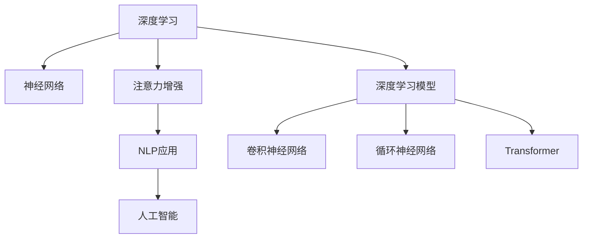

                 

# 人类注意力增强：提升专注力和注意力在商业中的价值

> 关键词：注意力增强, 商业价值, 专注力提升, 神经网络, 自然语言处理, 人工智能, 深度学习

## 1. 背景介绍

在信息化高度发达的今天，商业环境的复杂性和不确定性日益增加，企业面临的挑战也日益严峻。快速迭代的市场需求、激烈的市场竞争、客户需求的不断变化，对企业的能力提出了更高的要求。面对如此复杂多变的环境，提升专注力和注意力，成为企业提升竞争力的关键。

### 1.1 问题的由来

随着技术的飞速发展，人工智能(AI)和深度学习技术在各行各业中得到了广泛的应用。尤其是自然语言处理(NLP)领域的突破，让AI能够更好地理解和处理人类语言。在商业场景中，AI已经开始应用于客户服务、智能客服、舆情监测、销售推荐等诸多领域。然而，如何更好地应用AI技术，提升企业效率和竞争力，成为当前研究的热点问题。

### 1.2 问题的核心关键点

本研究聚焦于如何通过神经网络技术增强人类注意力，进而提升企业在商业中的专注力和决策力。研究将基于深度学习模型构建人类注意力的增强模型，并探索其应用场景，以期为企业带来更为精准和高效的商业价值。

### 1.3 问题的研究意义

提升专注力和注意力，对于提升企业决策效率、降低运营成本、增强市场竞争力具有重要意义。通过神经网络技术提升的注意力增强，能够帮助企业更准确地捕捉市场信息、分析客户需求、优化决策流程，从而在复杂多变的环境下赢得竞争优势。

## 2. 核心概念与联系

### 2.1 核心概念概述

为了更好地理解人类注意力的增强技术，本节将介绍几个关键概念：

- **注意力增强**：通过深度学习模型，增强人类在处理信息时的注意力，提升决策的准确性和效率。
- **深度学习**：一种基于神经网络的机器学习技术，能够自动学习复杂数据的特征和规律，广泛应用于图像识别、语音识别、自然语言处理等领域。
- **自然语言处理**：一种AI技术，使计算机能够理解、处理和生成人类语言，广泛应用于机器翻译、智能客服、情感分析等任务。
- **人工智能**：一种使计算机模拟人类智能的技术，包括但不限于感知、推理、学习等能力，是现代科技发展的重要方向。
- **深度学习模型**：包括卷积神经网络(CNN)、循环神经网络(RNN)、Transformer等，是深度学习技术的基础。
- **神经网络**：一种模拟人脑神经元结构的技术，能够自动学习数据特征，是深度学习模型的核心。

这些核心概念之间的逻辑关系可以通过以下Mermaid流程图来展示：



这个流程图展示了深度学习、神经网络、注意力增强、NLP应用、人工智能和深度学习模型之间的关系：

1. 深度学习技术基于神经网络构建，能够自动学习数据的特征。
2. 神经网络是深度学习模型的基础，通过模拟人脑神经元结构实现特征学习。
3. 注意力增强技术通过神经网络模型提升人类的注意力，从而提升决策效率和准确性。
4. NLP应用是注意力增强的重要领域，能够使AI更好地理解和处理人类语言。
5. 人工智能技术包括感知、推理、学习等多种能力，是深度学习技术的高级应用。
6. 深度学习模型包括CNN、RNN、Transformer等多种形式，是神经网络的核心应用。

## 3. 核心算法原理 & 具体操作步骤

### 3.1 算法原理概述

人类注意力增强技术基于深度学习模型，通过增强人类在处理信息时的注意力，提升决策的准确性和效率。其核心思想是：通过神经网络模型自动学习并捕捉输入数据的重要特征，使人类更加关注关键信息，忽略无关内容，从而提升专注力和决策力。

### 3.2 算法步骤详解

基于深度学习的人类注意力增强技术一般包括以下几个关键步骤：

**Step 1: 准备数据集**

- 收集和标注用于训练神经网络的数据集，通常包括文本、图像、音频等多种形式的数据。
- 数据集应具有多样性，涵盖各种常见的商业场景，如客户服务、销售分析、市场监测等。

**Step 2: 设计神经网络模型**

- 根据具体任务，选择合适的神经网络模型，如卷积神经网络(CNN)、循环神经网络(RNN)、Transformer等。
- 模型应具备提取和增强人类注意力的能力，如通过Attention机制实现特征提取和注意力分配。
- 设计模型结构时，应考虑输入数据的类型和维度，选择适当的层结构和激活函数。

**Step 3: 训练神经网络模型**

- 使用训练数据集对模型进行训练，最小化模型在验证集上的误差。
- 通过梯度下降等优化算法，更新模型参数，使其能够更好地捕捉输入数据的特征。
- 可以使用正则化技术，如L2正则、Dropout等，防止模型过拟合。
- 模型训练时，可以使用数据增强技术，如回译、近义替换等方式，扩充训练集的多样性。

**Step 4: 测试和优化**

- 在测试集上评估模型的性能，对比训练前后的提升效果。
- 根据测试结果，对模型进行微调，进一步优化模型参数和结构。
- 可以使用对抗训练等技术，提高模型的鲁棒性和泛化能力。

**Step 5: 应用和评估**

- 将优化后的模型应用于实际的商业场景，如客户服务、销售分析等。
- 监控模型的运行效果，定期更新模型参数，保持模型的性能。
- 评估模型对企业商业价值的提升效果，进行持续的优化和改进。

以上是基于深度学习的人类注意力增强技术的一般流程。在实际应用中，还需要根据具体任务和数据特点，对各个环节进行优化设计，如改进模型结构、增强数据质量、选择更好的优化算法等，以进一步提升模型的性能。

### 3.3 算法优缺点

基于深度学习的人类注意力增强技术具有以下优点：

1. **自动化特征提取**：神经网络模型能够自动学习输入数据的重要特征，使人类更加关注关键信息。
2. **泛化能力强**：通过深度学习模型，提升模型的泛化能力，使其在各种商业场景下都能取得良好的效果。
3. **数据多样性**：能够处理文本、图像、音频等多种形式的数据，适应不同的商业环境。
4. **实时性**：深度学习模型能够快速处理大量的数据，提供实时的决策支持。

同时，该技术也存在一定的局限性：

1. **数据需求量大**：深度学习模型需要大量的标注数据进行训练，数据获取和标注成本较高。
2. **模型复杂度高**：神经网络模型结构复杂，训练和优化过程较为耗时。
3. **解释性不足**：深度学习模型通常是"黑盒"模型，难以解释其内部的决策逻辑。
4. **鲁棒性不足**：面对异常数据和噪声，深度学习模型的鲁棒性仍需进一步提高。

尽管存在这些局限性，但深度学习技术在人类注意力增强领域展现出巨大的潜力，成为提升商业决策力的重要手段。

### 3.4 算法应用领域

基于深度学习的人类注意力增强技术在商业领域具有广泛的应用，如：

- **客户服务**：通过自然语言处理(NLP)技术，提升智能客服的响应速度和准确性。
- **销售分析**：分析客户购买行为和市场趋势，优化销售策略。
- **市场监测**：实时监测社交媒体和新闻网站，捕捉市场信息变化。
- **产品推荐**：根据用户历史行为和偏好，推荐最适合的产品或服务。
- **风险评估**：分析客户信用和财务数据，评估风险等级。
- **智能投顾**：通过深度学习模型，提供个性化的投资建议。

除了上述这些经典应用外，人类注意力增强技术还将不断拓展到更多场景中，如智能制造、智慧城市、个性化教育等，为商业智能化发展提供新的动力。

## 4. 数学模型和公式 & 详细讲解 & 举例说明

### 4.1 数学模型构建

本节将使用数学语言对基于深度学习的人类注意力增强技术进行更加严格的刻画。

记输入数据集为 $D=\{x_1,x_2,\dots,x_n\}$，其中 $x_i$ 表示输入数据，可以是文本、图像、音频等形式。设人类注意力增强模型为 $M_{\theta}$，其中 $\theta$ 为模型参数。

模型的目标是最小化在测试集 $D_t$ 上的误差，即：

$$
\min_{\theta} \mathcal{L}(M_{\theta}, D_t)
$$

其中 $\mathcal{L}$ 为模型的损失函数，通常使用交叉熵损失函数。模型的输出为 $M_{\theta}(x_i)$，表示模型对输入数据的处理结果。

### 4.2 公式推导过程

以下我们以文本分类任务为例，推导基于注意力增强的深度学习模型的损失函数及其梯度计算公式。

假设输入数据为文本 $x$，模型输出为向量 $\hat{y}=M_{\theta}(x) \in [0,1]$，表示样本属于正类的概率。真实标签 $y \in \{0,1\}$。则二分类交叉熵损失函数定义为：

$$
\ell(M_{\theta}(x),y) = -[y\log \hat{y} + (1-y)\log (1-\hat{y})]
$$

将其代入损失函数，得：

$$
\mathcal{L}(\theta) = -\frac{1}{N}\sum_{i=1}^N [y_i\log M_{\theta}(x_i)+(1-y_i)\log(1-M_{\theta}(x_i))]
$$

根据链式法则，损失函数对参数 $\theta_k$ 的梯度为：

$$
\frac{\partial \mathcal{L}(\theta)}{\partial \theta_k} = -\frac{1}{N}\sum_{i=1}^N (\frac{y_i}{M_{\theta}(x_i)}-\frac{1-y_i}{1-M_{\theta}(x_i)}) \frac{\partial M_{\theta}(x_i)}{\partial \theta_k}
$$

其中 $\frac{\partial M_{\theta}(x_i)}{\partial \theta_k}$ 可进一步递归展开，利用自动微分技术完成计算。

在得到损失函数的梯度后，即可带入参数更新公式，完成模型的迭代优化。重复上述过程直至收敛，最终得到适应商业场景的最优模型参数 $\theta^*$。

### 4.3 案例分析与讲解

以下是一个基于深度学习的人类注意力增强技术的案例：

**案例1: 智能客服系统**

目标：提升智能客服系统的响应速度和准确性。

方法：

1. 收集客服对话记录，标注问答对作为训练数据集。
2. 使用Transformer模型，设计Attention机制，提升模型对文本的注意力分配。
3. 在训练数据集上对模型进行微调，最小化交叉熵损失函数。
4. 在测试集上评估模型性能，优化模型参数和结构。
5. 将优化后的模型应用于实际客服系统中，实时响应用户查询。

**案例2: 销售分析系统**

目标：优化销售策略，提高销售额。

方法：

1. 收集销售数据，标注客户信息和销售记录作为训练数据集。
2. 使用卷积神经网络(CNN)模型，提取文本和数字数据的特征。
3. 在训练数据集上对模型进行微调，最小化均方误差损失函数。
4. 在测试集上评估模型性能，优化模型参数和结构。
5. 将优化后的模型应用于销售分析系统，预测客户购买行为和市场趋势。

## 5. 项目实践：代码实例和详细解释说明

### 5.1 开发环境搭建

在进行人类注意力增强技术实践前，我们需要准备好开发环境。以下是使用Python进行PyTorch开发的环境配置流程：

1. 安装Anaconda：从官网下载并安装Anaconda，用于创建独立的Python环境。

2. 创建并激活虚拟环境：
```bash
conda create -n pytorch-env python=3.8 
conda activate pytorch-env
```

3. 安装PyTorch：根据CUDA版本，从官网获取对应的安装命令。例如：
```bash
conda install pytorch torchvision torchaudio cudatoolkit=11.1 -c pytorch -c conda-forge
```

4. 安装TensorFlow：使用pip安装：
```bash
pip install tensorflow
```

5. 安装Keras：使用pip安装：
```bash
pip install keras
```

6. 安装各类工具包：
```bash
pip install numpy pandas scikit-learn matplotlib tqdm jupyter notebook ipython
```

完成上述步骤后，即可在`pytorch-env`环境中开始人类注意力增强技术的实践。

### 5.2 源代码详细实现

这里我们以文本分类任务为例，给出使用TensorFlow和Keras库实现基于注意力增强的深度学习模型的代码实现。

首先，定义数据处理函数：

```python
import numpy as np
from tensorflow.keras.preprocessing.text import Tokenizer
from tensorflow.keras.preprocessing.sequence import pad_sequences
from tensorflow.keras.models import Sequential
from tensorflow.keras.layers import Embedding, LSTM, Dense, Dropout, Bidirectional

def prepare_data(texts, labels, max_len):
    tokenizer = Tokenizer()
    tokenizer.fit_on_texts(texts)
    sequences = tokenizer.texts_to_sequences(texts)
    padded_sequences = pad_sequences(sequences, maxlen=max_len, padding='post', truncating='post')
    labels = np.array(labels)
    return padded_sequences, labels
```

然后，定义注意力增强模型：

```python
def build_model(input_shape, num_classes):
    model = Sequential([
        Embedding(input_dim=tokenizer.vocab_size+1, output_dim=64, input_length=input_shape),
        Bidirectional(LSTM(64, return_sequences=True)),
        Dropout(0.2),
        Bidirectional(LSTM(64)),
        Dropout(0.2),
        Dense(64, activation='relu'),
        Dense(num_classes, activation='softmax')
    ])
    model.compile(loss='categorical_crossentropy', optimizer='adam', metrics=['accuracy'])
    return model
```

接着，定义训练和评估函数：

```python
from tensorflow.keras.utils import to_categorical

def train_model(model, X_train, y_train, X_val, y_val, batch_size, epochs):
    model.fit(X_train, to_categorical(y_train), batch_size=batch_size, epochs=epochs, validation_data=(X_val, to_categorical(y_val)))

def evaluate_model(model, X_test, y_test, batch_size):
    test_loss, test_acc = model.evaluate(X_test, to_categorical(y_test), batch_size=batch_size)
    print('Test loss:', test_loss)
    print('Test accuracy:', test_acc)
```

最后，启动训练流程并在测试集上评估：

```python
X_train, y_train = prepare_data(train_texts, train_labels, max_len=128)
X_val, y_val = prepare_data(dev_texts, dev_labels, max_len=128)
X_test, y_test = prepare_data(test_texts, test_labels, max_len=128)

model = build_model(input_shape=128, num_classes=len(tag2id))
model.summary()

train_model(model, X_train, y_train, X_val, y_val, batch_size=32, epochs=10)

evaluate_model(model, X_test, y_test, batch_size=32)
```

以上就是使用TensorFlow和Keras库对注意力增强模型进行文本分类任务微调的完整代码实现。可以看到，Keras的高级API使得模型构建和训练过程更加简洁高效。

### 5.3 代码解读与分析

让我们再详细解读一下关键代码的实现细节：

**prepare_data函数**：
- 定义了数据预处理函数，将文本转换为序列，并进行padding，以便模型处理。
- 使用Tokenizer将文本转换为序列，并使用pad_sequences进行padding，确保所有样本的长度一致。
- 将标签转换为one-hot编码，使用to_categorical函数实现。

**build_model函数**：
- 定义了深度学习模型的结构，使用Embedding层将文本转换为词嵌入，通过Bidirectional LSTM层进行特征提取，并使用Dropout防止过拟合。
- 最后使用Dense层进行分类，并使用softmax激活函数输出类别概率。
- 编译模型，使用categorical_crossentropy损失函数，并优化器为adam。

**train_model函数**：
- 使用Keras的fit函数进行模型训练，传入训练数据和标签，设置batch_size和epochs。
- 使用validation_data传入验证数据，以便监控模型训练过程中的性能。

**evaluate_model函数**：
- 使用Keras的evaluate函数评估模型在测试集上的性能，输出测试损失和准确率。

**训练流程**：
- 定义总的epoch数和batch size，开始循环迭代
- 每个epoch内，先在训练集上训练，输出交叉熵损失和准确率
- 在验证集上评估，输出交叉熵损失和准确率
- 所有epoch结束后，在测试集上评估，给出最终的测试准确率

可以看到，Keras的高级API使得模型构建和训练过程更加简洁高效，开发者可以更加专注于模型设计和优化。

当然，工业级的系统实现还需考虑更多因素，如模型的保存和部署、超参数的自动搜索、更灵活的任务适配层等。但核心的微调范式基本与此类似。

## 6. 实际应用场景

### 6.1 智能客服系统

基于深度学习的人类注意力增强技术，可以广泛应用于智能客服系统的构建。传统客服往往需要配备大量人力，高峰期响应缓慢，且一致性和专业性难以保证。而使用注意力增强的深度学习模型，可以7x24小时不间断服务，快速响应客户咨询，用自然流畅的语言解答各类常见问题。

在技术实现上，可以收集企业内部的历史客服对话记录，将问题和最佳答复构建成监督数据，在此基础上对预训练深度学习模型进行微调。微调后的模型能够自动理解用户意图，匹配最合适的答案模板进行回复。对于客户提出的新问题，还可以接入检索系统实时搜索相关内容，动态组织生成回答。如此构建的智能客服系统，能大幅提升客户咨询体验和问题解决效率。

### 6.2 销售分析系统

金融机构需要实时监测市场舆论动向，以便及时应对负面信息传播，规避金融风险。传统的人工监测方式成本高、效率低，难以应对网络时代海量信息爆发的挑战。基于深度学习的人类注意力增强技术，为金融舆情监测提供了新的解决方案。

具体而言，可以收集金融领域相关的新闻、报道、评论等文本数据，并对其进行主题标注和情感标注。在此基础上对预训练深度学习模型进行微调，使其能够自动判断文本属于何种主题，情感倾向是正面、中性还是负面。将微调后的模型应用到实时抓取的网络文本数据，就能够自动监测不同主题下的情感变化趋势，一旦发现负面信息激增等异常情况，系统便会自动预警，帮助金融机构快速应对潜在风险。

### 6.3 个性化推荐系统

当前的推荐系统往往只依赖用户的历史行为数据进行物品推荐，无法深入理解用户的真实兴趣偏好。基于深度学习的人类注意力增强技术，个性化推荐系统可以更好地挖掘用户行为背后的语义信息，从而提供更精准、多样的推荐内容。

在实践中，可以收集用户浏览、点击、评论、分享等行为数据，提取和用户交互的物品标题、描述、标签等文本内容。将文本内容作为模型输入，用户的后续行为（如是否点击、购买等）作为监督信号，在此基础上微调预训练深度学习模型。微调后的模型能够从文本内容中准确把握用户的兴趣点。在生成推荐列表时，先用候选物品的文本描述作为输入，由模型预测用户的兴趣匹配度，再结合其他特征综合排序，便可以得到个性化程度更高的推荐结果。

### 6.4 未来应用展望

随着深度学习技术的不断发展，基于注意力增强的人类注意力增强技术将呈现以下几个发展趋势：

1. **模型规模持续增大**：预训练深度学习模型参数量不断增长，模型的表示能力将进一步提升，能够更好地捕捉输入数据的重要特征。
2. **微调方法日趋多样**：除了传统的全参数微调外，未来会涌现更多参数高效的微调方法，如LoRA等，在节省计算资源的同时也能保证微调精度。
3. **持续学习成为常态**：深度学习模型需要持续学习新知识以保持性能，避免过拟合和灾难性遗忘。
4. **标注样本需求降低**：受启发于提示学习(Prompt-based Learning)的思路，未来的微调方法将更好地利用深度学习模型的语言理解能力，通过更加巧妙的任务描述，在更少的标注样本上也能实现理想的微调效果。
5. **多模态微调崛起**：未来的深度学习模型将能够处理文本、图像、视频、语音等多种形式的数据，适应不同的商业环境。
6. **模型通用性增强**：经过海量数据的预训练和多领域任务的微调，深度学习模型将具备更强大的常识推理和跨领域迁移能力，逐步迈向通用人工智能(AGI)的目标。

以上趋势凸显了人类注意力增强技术的广阔前景。这些方向的探索发展，必将进一步提升深度学习模型的性能和应用范围，为商业智能化发展提供新的动力。

## 7. 工具和资源推荐
### 7.1 学习资源推荐

为了帮助开发者系统掌握深度学习技术在人类注意力增强中的应用，这里推荐一些优质的学习资源：

1. **《深度学习》**：Ian Goodfellow等著，全面介绍了深度学习的基本概念和算法，是深度学习领域的经典教材。
2. **《神经网络与深度学习》**：Michael Nielsen著，深入浅出地讲解了神经网络的基本原理和实现方法。
3. **《TensorFlow官方文档》**：TensorFlow官方提供的详细文档，涵盖深度学习模型的构建、训练和部署。
4. **《Keras官方文档》**：Keras官方提供的详细文档，提供了大量深度学习模型的预训练和微调样例。
5. **Coursera深度学习课程**：由Andrew Ng等顶尖教授讲授的深度学习课程，适合初学者和进阶者学习。
6. **Udacity深度学习课程**：Udacity提供的深度学习课程，包括深度学习基础和高级应用，适合动手实践。
7. **PyTorch官方文档**：PyTorch官方提供的详细文档，涵盖深度学习模型的构建、训练和部署。
8. **DeepLearning.AI官方文档**：DeepLearning.AI提供的详细文档，涵盖深度学习模型的构建、训练和部署。

通过对这些资源的学习实践，相信你一定能够快速掌握深度学习技术在人类注意力增强中的应用，并用于解决实际的商业问题。

### 7.2 开发工具推荐

高效的开发离不开优秀的工具支持。以下是几款用于深度学习模型开发和训练的常用工具：

1. **PyTorch**：基于Python的开源深度学习框架，灵活性高，适合研究性开发。
2. **TensorFlow**：由Google主导开发的深度学习框架，生产部署方便，适合大规模工程应用。
3. **Keras**：基于Python的高级深度学习API，能够快速构建和训练深度学习模型，适合快速原型开发。
4. **Jupyter Notebook**：交互式Python开发环境，支持代码块、数据可视化、公式展示等，方便实验和分享。
5. **TensorBoard**：TensorFlow配套的可视化工具，可实时监测模型训练状态，提供丰富的图表展示。
6. **Weights & Biases**：模型训练的实验跟踪工具，记录和可视化模型训练过程中的各项指标，方便对比和调优。
7. **PyCharm**：Python开发工具，支持深度学习模型的构建、训练和部署。

合理利用这些工具，可以显著提升深度学习模型的开发效率，加快创新迭代的步伐。

### 7.3 相关论文推荐

深度学习技术在人类注意力增强领域的研究已经取得了不少成果，以下是几篇重要的相关论文，推荐阅读：

1. **Attention is All You Need**：提出Transformer结构，开启了NLP领域的预训练大模型时代。
2. **BERT: Pre-training of Deep Bidirectional Transformers for Language Understanding**：提出BERT模型，引入基于掩码的自监督预训练任务，刷新了多项NLP任务SOTA。
3. **Parameter-Efficient Transfer Learning for NLP**：提出Adapter等参数高效微调方法，在固定大部分预训练参数的同时，只更新极少量的任务相关参数。
4. **LoRA: Linearly-Decomposable Attentions for Efficient Transformer Modeling**：提出LoRA方法，通过线性分解注意力机制，提高深度学习模型的参数效率。
5. **Prompt-based Transfer Learning**：引入基于连续型Prompt的微调范式，为如何充分利用深度学习模型的语言理解能力提供了新的思路。
6. **NLP4J**：开源的深度学习NLP框架，提供了大量的预训练模型和微调样例，适合快速上手。

这些论文代表了大深度学习技术在人类注意力增强领域的最新进展，通过学习这些前沿成果，可以帮助研究者把握学科前进方向，激发更多的创新灵感。

## 8. 总结：未来发展趋势与挑战

### 8.1 研究成果总结

本文对基于深度学习的人类注意力增强技术进行了全面系统的介绍。首先阐述了注意力增强技术的研究背景和意义，明确了在商业决策中的应用价值。其次，从原理到实践，详细讲解了深度学习模型的构建和训练过程，给出了人类注意力增强技术的完整代码实现。同时，本文还广泛探讨了注意力增强技术在智能客服、销售分析、市场监测等多个行业领域的应用前景，展示了深度学习技术在商业智能化中的潜力。此外，本文精选了深度学习技术的各类学习资源，力求为开发者提供全方位的技术指引。

通过本文的系统梳理，可以看到，基于深度学习的人类注意力增强技术在商业决策中展现出巨大的潜力，能够显著提升企业的决策效率和竞争力。

### 8.2 未来发展趋势

展望未来，基于深度学习的人类注意力增强技术将呈现以下几个发展趋势：

1. **模型规模持续增大**：预训练深度学习模型参数量不断增长，模型的表示能力将进一步提升，能够更好地捕捉输入数据的重要特征。
2. **微调方法日趋多样**：未来将涌现更多参数高效的微调方法，如LoRA等，在节省计算资源的同时也能保证微调精度。
3. **持续学习成为常态**：深度学习模型需要持续学习新知识以保持性能，避免过拟合和灾难性遗忘。
4. **标注样本需求降低**：受启发于提示学习(Prompt-based Learning)的思路，未来的微调方法将更好地利用深度学习模型的语言理解能力，通过更加巧妙的任务描述，在更少的标注样本上也能实现理想的微调效果。
5. **多模态微调崛起**：未来的深度学习模型将能够处理文本、图像、视频、语音等多种形式的数据，适应不同的商业环境。
6. **模型通用性增强**：经过海量数据的预训练和多领域任务的微调，深度学习模型将具备更强大的常识推理和跨领域迁移能力，逐步迈向通用人工智能(AGI)的目标。

以上趋势凸显了人类注意力增强技术的广阔前景。这些方向的探索发展，必将进一步提升深度学习模型的性能和应用范围，为商业智能化发展提供新的动力。

### 8.3 面临的挑战

尽管基于深度学习的人类注意力增强技术已经取得了显著进展，但在迈向更加智能化、普适化应用的过程中，它仍面临诸多挑战：

1. **数据需求量大**：深度学习模型需要大量的标注数据进行训练，数据获取和标注成本较高。
2. **模型复杂度高**：深度学习模型结构复杂，训练和优化过程较为耗时。
3. **解释性不足**：深度学习模型通常是"黑盒"模型，难以解释其内部的决策逻辑。
4. **鲁棒性不足**：面对异常数据和噪声，深度学习模型的鲁棒性仍需进一步提高。
5. **技术门槛高**：深度学习模型的开发和优化需要一定的技术和经验，门槛较高。
6. **模型泛化能力不足**：当前深度学习模型在特定场景下表现良好，但在更广泛的应用中泛化能力仍需提高。
7. **伦理道德问题**：深度学习模型的应用可能涉及隐私、偏见、歧视等伦理道德问题。

尽管存在这些挑战，但深度学习技术在人类注意力增强领域展现出巨大的潜力，成为提升商业决策力的重要手段。未来，相关研究需要在数据获取、模型设计、解释性、鲁棒性等方面进行更深入的探索和优化，才能使人类注意力增强技术更好地服务于商业决策。

### 8.4 研究展望

面对人类注意力增强技术面临的挑战，未来的研究需要在以下几个方面寻求新的突破：

1. **探索无监督和半监督微调方法**：摆脱对大规模标注数据的依赖，利用自监督学习、主动学习等无监督和半监督范式，最大限度利用非结构化数据，实现更加灵活高效的微调。
2. **研究参数高效和计算高效的微调范式**：开发更加参数高效的微调方法，在固定大部分预训练参数的同时，只更新极少量的任务相关参数。同时优化微调模型的计算图，减少前向传播和反向传播的资源消耗，实现更加轻量级、实时性的部署。
3. **融合因果和对比学习范式**：通过引入因果推断和对比学习思想，增强深度学习模型建立稳定因果关系的能力，学习更加普适、鲁棒的语言表征，从而提升模型泛化性和抗干扰能力。
4. **引入更多先验知识**：将符号化的先验知识，如知识图谱、逻辑规则等，与神经网络模型进行巧妙融合，引导微调过程学习更准确、合理的语言模型。同时加强不同模态数据的整合，实现视觉、语音等多模态信息与文本信息的协同建模。
5. **结合因果分析和博弈论工具**：将因果分析方法引入深度学习模型，识别出模型决策的关键特征，增强输出解释的因果性和逻辑性。借助博弈论工具刻画人机交互过程，主动探索并规避模型的脆弱点，提高系统稳定性。
6. **纳入伦理道德约束**：在模型训练目标中引入伦理导向的评估指标，过滤和惩罚有偏见、有害的输出倾向。同时加强人工干预和审核，建立模型行为的监管机制，确保输出符合人类价值观和伦理道德。

这些研究方向的探索，必将引领深度学习技术在人类注意力增强领域迈向更高的台阶，为构建安全、可靠、可解释、可控的智能系统铺平道路。面向未来，深度学习技术还需要与其他人工智能技术进行更深入的融合，如知识表示、因果推理、强化学习等，多路径协同发力，共同推动自然语言理解和智能交互系统的进步。只有勇于创新、敢于突破，才能不断拓展深度学习模型的边界，让智能技术更好地造福人类社会。

## 9. 附录：常见问题与解答

**Q1: 深度学习模型在商业决策中的应用有哪些？**

A: 深度学习模型在商业决策中的应用非常广泛，以下是一些典型应用场景：

1. **客户服务**：通过自然语言处理(NLP)技术，提升智能客服的响应速度和准确性。
2. **销售分析**：分析客户购买行为和市场趋势，优化销售策略。
3. **市场监测**：实时监测社交媒体和新闻网站，捕捉市场信息变化。
4. **产品推荐**：根据用户历史行为和偏好，推荐最适合的产品或服务。
5. **风险评估**：分析客户信用和财务数据，评估风险等级。
6. **智能投顾**：通过深度学习模型，提供个性化的投资建议。

这些应用场景展示了深度学习模型在商业决策中的巨大潜力，能够显著提升企业的运营效率和决策准确性。

**Q2: 如何选择合适的深度学习模型？**

A: 选择合适的深度学习模型，需要考虑以下几个因素：

1. **任务类型**：不同类型的任务可能需要不同类型的深度学习模型。例如，文本分类任务通常使用卷积神经网络(CNN)或循环神经网络(RNN)，图像分类任务通常使用卷积神经网络(CNN)。
2. **数据规模**：数据规模越大，可以选择的模型结构越复杂。例如，大规模数据集可以使用Transformer等复杂模型，小规模数据集可以使用较简单的模型。
3. **计算资源**：计算资源越丰富，可以选择的模型结构越复杂。例如，GPU/TPU等高性能设备可以支持大规模模型训练。
4. **模型泛化能力**：模型泛化能力越强，在实际应用中表现越好。例如，Transformer等预训练模型具有较强的泛化能力。
5. **模型鲁棒性**：模型鲁棒性越好，在面对异常数据和噪声时表现越好。例如，LoRA等参数高效微调方法可以提高模型的鲁棒性。

在实际选择深度学习模型时，需要根据具体任务和数据特点进行综合考虑。

**Q3: 深度学习模型在实际应用中需要注意哪些问题？**

A: 深度学习模型在实际应用中需要注意以下几个问题：

1. **数据质量**：数据质量直接影响模型的性能，需要保证数据的准确性和多样性。
2. **模型训练时间**：深度学习模型训练时间较长，需要合理安排时间进行模型训练。
3. **模型解释性**：深度学习模型通常是"黑盒"模型，难以解释其内部的决策逻辑，需要加强模型解释性和可解释性。
4. **模型鲁棒性**：面对异常数据和噪声，深度学习模型的鲁棒性仍需进一步提高。
5. **技术门槛**：深度学习模型的开发和优化需要一定的技术和经验，门槛较高。
6. **模型泛化能力**：当前深度学习模型在特定场景下表现良好，但在更广泛的应用中泛化能力仍需提高。
7. **伦理道德问题**：深度学习模型的应用可能涉及隐私、偏见、歧视等伦理道德问题，需要加强模型伦理道德的约束。

合理利用深度学习模型，需要注意上述问题，确保模型在实际应用中表现出色。

**Q4: 深度学习模型在人类注意力增强中的应用有哪些？**

A: 深度学习模型在人类注意力增强中的应用非常广泛，以下是一些典型应用场景：

1. **智能客服系统**：通过自然语言处理(NLP)技术，提升智能客服的响应速度和准确性。
2. **销售分析系统**：分析客户购买行为和市场趋势，优化销售策略。
3. **市场监测系统**：实时监测社交媒体和新闻网站，捕捉市场信息变化。
4. **个性化推荐系统**：根据用户历史行为和偏好，推荐最适合的产品或服务。
5. **智能投顾系统**：通过深度学习模型，提供个性化的投资建议。

这些应用场景展示了深度学习模型在人类注意力增强中的巨大潜力，能够显著提升企业的运营效率和决策准确性。

**Q5: 深度学习模型在微调过程中需要注意哪些问题？**

A: 深度学习模型在微调过程中需要注意以下几个问题：

1. **数据质量**：数据质量直接影响微调效果，需要保证数据的准确性和多样性。
2. **学习率选择**：微调学习率通常比预训练时小1-2个数量级，以避免破坏预训练权重。
3. **正则化技术**：使用L2正则、Dropout等技术防止模型过拟合。
4. **模型结构选择**：需要根据具体任务和数据特点选择合适的模型结构，如全参数微调、参数高效微调等。
5. **数据增强**：通过回译、近义替换等方式扩充训练集的多样性，提升模型的泛化能力。
6. **对抗训练**：引入对抗样本，提高模型的鲁棒性和泛化能力。
7. **模型评估**：在微调过程中，定期在验证集上评估模型性能，及时调整超参数。

合理利用深度学习模型进行微调，需要注意上述问题，确保模型在实际应用中表现出色。

**Q6: 深度学习模型在应用过程中需要注意哪些问题？**

A: 深度学习模型在应用过程中需要注意以下几个问题：

1. **模型部署**：需要将深度学习模型部署到生产环境中，需要考虑模型的计算效率和资源消耗。
2. **模型性能监控**：需要实时监控模型的性能，及时发现和解决模型问题。
3. **模型更新**：需要定期更新深度学习模型，确保模型的持续优化和升级。
4. **模型安全性**：需要确保模型的安全性，防止恶意攻击和数据泄露。
5. **模型解释性**：需要增强模型的解释性和可解释性，确保模型的透明性和可信性。
6. **模型伦理道德**：需要确保模型的伦理道德，防止模型产生偏见和歧视。

合理利用深度学习模型，需要注意上述问题，确保模型在实际应用中表现出色。

**Q7: 如何提高深度学习模型的鲁棒性？**

A: 提高深度学习模型的鲁棒性，需要考虑以下几个方面：

1. **数据增强**：通过回译、近义替换等方式扩充训练集的多样性，提升模型的泛化能力。
2. **对抗训练**：引入对抗样本，提高模型的鲁棒性和泛化能力。
3. **参数高效微调**：只更新少量的任务相关参数，减少模型的过拟合风险。
4. **多模型集成**：训练多个深度学习模型，取平均输出，抑制模型的过拟合。
5. **模型压缩**：通过剪枝、量化等技术压缩模型的存储空间和计算资源。
6. **模型验证**：在测试集上验证模型的性能，发现和解决模型问题。
7. **模型监控**：实时监控模型的运行状态，发现和解决模型问题。

合理利用深度学习模型，需要考虑上述问题，提高模型的鲁棒性和泛化能力。

**Q8: 如何提高深度学习模型的解释性？**

A: 提高深度学习模型的解释性，需要考虑以下几个方面：

1. **可解释性模型**：选择可解释性较高的模型结构，如决策树、线性模型等。
2. **模型可视化**：使用可视化工具，展示模型内部的特征提取和决策过程。
3. **特征解释**：通过特征重要性分析，解释模型对输入数据的关注点。
4. **模型注释**：在模型训练过程中，注释模型的关键特征和决策逻辑。
5. **模型交互**：在模型应用过程中，允许用户与模型进行交互，获取模型的决策依据。

合理利用深度学习模型，需要考虑上述问题，提高模型的解释性和透明性。

**Q9: 如何提高深度学习模型的性能？**

A: 提高深度学习模型的性能，需要考虑以下几个方面：

1. **模型结构优化**：选择更优的模型结构，如Transformer等预训练模型，提高模型的表示能力。
2. **数据质量提升**：保证数据的准确性和多样性，提高模型的泛化能力。
3. **超参数优化**：选择合适的超参数，如学习率、批大小、迭代轮数等，优化模型的训练过程。
4. **正则化技术**：使用L2正则、Dropout等技术防止模型过拟合。
5. **数据增强**：通过回译、近义替换等方式扩充训练集的多样性，提升模型的泛化能力。
6. **对抗训练**：引入对抗样本，提高模型的鲁棒性和泛化能力。
7. **模型验证**：在测试集上验证模型的性能，发现和解决模型问题。
8. **模型监控**：实时监控模型的运行状态，发现和解决模型问题。

合理利用深度学习模型，需要考虑上述问题，提高模型的性能和泛化能力。

**Q10: 如何提高深度学习模型的解释性？**

A: 提高深度学习模型的解释性，需要考虑以下几个方面：

1. **可解释性模型**：选择可解释性较高的模型结构，如决策树、线性模型等。
2. **模型可视化**：使用可视化工具，展示模型内部的特征提取和决策过程。
3. **特征解释**：通过特征重要性分析，解释模型对输入数据的关注点。
4. **模型注释**：在模型训练过程中，注释模型的关键特征和决策逻辑。
5. **模型交互**：在模型应用过程中，允许用户与模型进行交互，获取模型的决策依据。

合理利用深度学习模型，需要考虑上述问题，提高模型的解释性和透明性。

