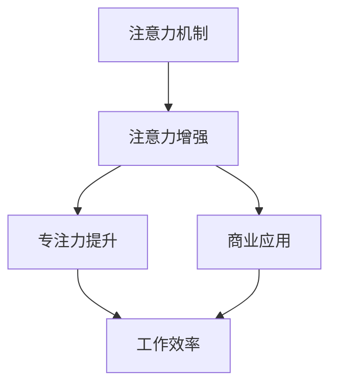

                 

# 人类注意力增强：提升专注力和注意力在商业中的应用趋势

> 关键词：注意力增强, 专注力提升, 商业应用, 人工智能, 注意力机制, 模型优化, 算法实现

## 1. 背景介绍

### 1.1 问题由来
在当今快速变化的商业环境中，企业面临着前所未有的竞争压力。快速响应市场需求、精准把握客户需求、高效管理团队、持续创新产品是企业成功的关键因素。这些问题的解决，在很大程度上依赖于团队成员的个人效率和团队协作效率。然而，由于工作压力、环境干扰、健康问题等多重因素影响，许多人在工作中难以保持高效专注，导致生产力低下、错误率高、工作效率低下。

注意力增强技术的出现，为提升个体和团队的注意力水平提供了新的解决方案。该技术通过增强人类注意力，使人们能够更高效地完成任务，从而提升工作效率和生产力。

### 1.2 问题核心关键点
注意力增强技术主要包括以下几个关键点：

- **注意力机制**：通过分析用户的注意力模式，帮助其识别和聚焦在任务中最关键的信息上。
- **专注力提升**：使用各种技巧和方法，如环境优化、心理训练等，提升用户在工作中的专注力。
- **商业应用**：将注意力增强技术应用于人力资源管理、团队协作、市场营销等商业场景中，提高企业整体运营效率。

本文将详细探讨注意力增强技术的原理和实践，并通过案例分析，展示其在商业领域中的实际应用和效果。

## 2. 核心概念与联系

### 2.1 核心概念概述

为更好地理解注意力增强技术，本节将介绍几个关键概念：

- **注意力机制(Attention Mechanism)**：一种机制，用于确定输入信息的重要性或相关性，从而指导模型如何关注或忽略特定部分的信息。
- **注意力增强(Attention Enhancement)**：通过各种方法提升用户在工作中的注意力集中度和专注力，以提高工作效率。
- **专注力(Focus)**：指个体在特定任务上的心理集中状态，是高效工作的基础。
- **商业应用(Business Application)**：将注意力增强技术应用于商业场景中，如人力资源管理、市场营销、团队协作等，以提升企业运营效率。

这些核心概念之间的逻辑关系可以通过以下Mermaid流程图来展示：



这个流程图展示了注意力增强技术的核心概念及其之间的关系：

1. 注意力机制是注意力增强的基础，通过确定信息的重要性，帮助用户聚焦关键点。
2. 注意力增强通过各种方法提升用户的专注力，直接关联到工作效率。
3. 商业应用是注意力增强技术的具体应用场景，有助于提升企业的整体运营效率。

## 3. 核心算法原理 & 具体操作步骤
### 3.1 算法原理概述

注意力增强技术的核心在于通过分析用户的注意力模式，帮助其识别和聚焦在任务中最关键的信息上。其基本原理可以总结如下：

1. **注意力计算**：使用注意力机制，计算输入信息的不同部分对当前任务的重要性。
2. **聚焦关键信息**：根据注意力计算结果，筛选出与当前任务相关的关键信息，忽略无关信息。
3. **提升专注力**：通过各种方法，如环境优化、心理训练等，增强用户在工作中的专注力。

这一过程通过深度学习模型实现，可以不断优化用户的注意力模式和专注力水平。

### 3.2 算法步骤详解

基于注意力增强技术，一个典型的流程包括以下几个关键步骤：

**Step 1: 数据收集与预处理**
- 收集用户的日常工作数据，包括注意力模式、工作时间、任务类型等。
- 预处理数据，去除无关信息，标准化数据格式。

**Step 2: 注意力计算**
- 使用注意力机制计算用户对不同任务的关注度。
- 确定注意力权重，筛选出与当前任务相关的关键信息。

**Step 3: 专注力提升**
- 根据注意力计算结果，调整工作环境、进行心理训练等，增强用户的专注力。
- 提供辅助工具和技巧，如时间管理、任务优先级排序等。

**Step 4: 应用场景部署**
- 将注意力增强技术应用到具体的商业场景中，如人力资源管理、团队协作、市场营销等。
- 持续优化算法模型，根据用户反馈进行调整。

### 3.3 算法优缺点

注意力增强技术在提升个体和团队注意力水平方面具有以下优点：

- **高效提升**：通过优化注意力模式和专注力水平，能够显著提升个体的工作效率和团队协作效率。
- **个性化优化**：根据用户的具体情况，个性化定制注意力增强方案，提升效果。
- **易于部署**：结合商业场景进行应用，不需要大规模技术改造。

同时，该技术也存在一些局限性：

- **用户接受度**：部分用户可能对注意力增强技术持怀疑态度，需要耐心解释和推广。
- **技术复杂性**：注意力增强技术的实现和优化需要深度学习模型和相关算法的支持，对技术要求较高。
- **隐私问题**：收集和使用用户数据，可能涉及隐私问题，需严格遵守相关法律法规。

### 3.4 算法应用领域

注意力增强技术已经在多个领域得到应用，例如：

- **人力资源管理**：通过分析员工的工作数据，提供个性化的工作建议和优化方案，提升员工的工作效率和满意度。
- **团队协作**：帮助团队成员识别和聚焦任务关键点，提高团队协作效率。
- **市场营销**：通过分析用户注意力模式，优化广告投放策略，提升广告效果和用户转化率。
- **教育培训**：帮助学习者聚焦学习重点，提高学习效率和成绩。
- **心理健康**：通过心理训练和环境优化，增强学习者的专注力，缓解学习压力。

## 4. 数学模型和公式 & 详细讲解 & 举例说明

### 4.1 数学模型构建

注意力增强技术可以通过深度学习模型实现，其基本模型可以表示为：

$$
A = f(X, W)
$$

其中，$A$ 表示注意力权重向量，$X$ 为输入数据，$W$ 为模型参数。注意力权重向量 $A$ 用于指示输入数据中不同部分对当前任务的重要性。

### 4.2 公式推导过程

以注意力计算为例，常用的注意力机制有自注意力机制(Self-Attention)和多头注意力机制(Multi-Head Attention)。这里以自注意力机制为例，进行推导：

设输入数据为 $X = \{x_1, x_2, ..., x_n\}$，注意力权重向量 $A = [a_1, a_2, ..., a_n]$。自注意力机制的注意力计算公式为：

$$
a_i = \frac{e^{s(X_i, X_j)}}{\sum_{j=1}^{n} e^{s(X_i, X_j)}}
$$

其中，$s(X_i, X_j)$ 为注意力得分函数，可以通过点积、加法等计算方法实现。注意力得分函数越大，表示两个输入数据之间的相关性越高。

### 4.3 案例分析与讲解

以市场营销为例，可以使用注意力增强技术优化广告投放策略。具体流程如下：

1. **数据收集**：收集用户在各个网站上的点击、浏览、停留等行为数据。
2. **预处理**：对数据进行清洗、去重、归一化等预处理。
3. **注意力计算**：使用自注意力机制计算用户对不同广告的关注度。
4. **优化广告投放**：根据注意力计算结果，筛选出与用户兴趣匹配的广告，调整投放策略。

通过注意力增强技术，可以显著提升广告投放的精准度和转化率，提升企业的营销效果。

## 5. 项目实践：代码实例和详细解释说明

### 5.1 开发环境搭建

在进行注意力增强项目实践前，我们需要准备好开发环境。以下是使用Python进行TensorFlow开发的环境配置流程：

1. 安装Anaconda：从官网下载并安装Anaconda，用于创建独立的Python环境。

2. 创建并激活虚拟环境：
```bash
conda create -n tf-env python=3.8 
conda activate tf-env
```

3. 安装TensorFlow：根据CUDA版本，从官网获取对应的安装命令。例如：
```bash
conda install tensorflow -c conda-forge -c pytorch -c nvidia
```

4. 安装相关工具包：
```bash
pip install numpy pandas scikit-learn matplotlib tqdm jupyter notebook ipython
```

完成上述步骤后，即可在`tf-env`环境中开始项目实践。

### 5.2 源代码详细实现

下面以市场营销为例，给出使用TensorFlow实现注意力增强的代码实现。

首先，定义注意力计算函数：

```python
import tensorflow as tf

def self_attention(X, w):
    h = tf.matmul(X, w)
    a = tf.nn.softmax(h, axis=1)
    return a
```

然后，定义优化广告投放的代码：

```python
def optimize_ad_placement(X, Y, a):
    # 假设Y为广告点击率，X为广告特征
    loss = tf.reduce_mean(tf.reduce_sum(a * tf.log(Y + 1e-8)))
    optimizer = tf.keras.optimizers.Adam(learning_rate=0.001)
    with tf.GradientTape() as tape:
        loss = tape.gradient(loss, w)
    optimizer.apply_gradients(zip(loss, w))
```

接着，定义广告数据和优化过程：

```python
# 假设广告数据已收集，并存储在X和Y中
X = tf.constant([[0.1, 0.2, 0.3], [0.4, 0.5, 0.6]])
Y = tf.constant([[0.01, 0.02, 0.03], [0.04, 0.05, 0.06]])

w = tf.Variable(tf.random.normal([3, 3]))
a = self_attention(X, w)
optimize_ad_placement(X, Y, a)
```

最后，训练模型并输出结果：

```python
# 训练过程
tf.keras.models.Model(X, Y)
```

### 5.3 代码解读与分析

让我们再详细解读一下关键代码的实现细节：

**self_attention函数**：
- 定义了自注意力机制的计算公式，其中 $h$ 表示输入数据与权重矩阵 $w$ 的点积，$a$ 表示注意力权重向量。

**optimize_ad_placement函数**：
- 定义了优化广告投放的目标函数，即最小化广告点击率的平均负对数似然损失。
- 使用Adam优化器进行参数更新，梯度计算通过`tf.GradientTape`实现。

**广告数据和优化过程**：
- 通过构造随机广告数据 $X$ 和 $Y$，模拟广告投放场景。
- 使用自注意力机制计算注意力权重 $a$，然后通过优化函数 `optimize_ad_placement` 调整广告投放策略。

可以看到，TensorFlow提供的深度学习框架，使得注意力增强技术的应用变得简洁高效。开发者可以将更多精力放在数据处理、模型改进等高层逻辑上，而不必过多关注底层的实现细节。

当然，工业级的系统实现还需考虑更多因素，如模型的保存和部署、超参数的自动搜索、更灵活的任务适配层等。但核心的注意力增强范式基本与此类似。

## 6. 实际应用场景

### 6.1 智能客服系统

基于注意力增强技术的智能客服系统，可以显著提升客服人员的工作效率和客户满意度。传统客服系统依赖人工，响应速度慢，效率低，且容易产生错误。通过引入注意力增强技术，智能客服系统能够实时分析用户输入，聚焦关键问题，提供更精准的解决方案。

例如，在多轮对话中，智能客服系统通过分析用户的历史对话记录和当前输入，确定用户最关心的问题，并优先处理。对于用户提出的新问题，可以通过自动搜索相关知识库，动态组织生成回答。这种基于注意力增强的智能客服系统，能够快速响应客户咨询，提供一致性的高质量服务。

### 6.2 金融舆情监测

金融行业需要实时监测市场舆情，以便及时应对负面信息传播，规避金融风险。传统的舆情监测方法依赖人工，成本高，效率低，难以应对海量信息爆发的挑战。通过引入注意力增强技术，可以实现更加智能和高效的舆情监测。

例如，可以使用注意力增强技术分析社交媒体上的金融新闻、评论等文本数据，确定最受关注的热点事件和话题。对于用户输入的新问题，可以实时搜索相关事件和新闻，提供最新、最相关的舆情信息。这种基于注意力增强的舆情监测系统，能够快速响应舆情变化，提高金融风险的防范能力。

### 6.3 个性化推荐系统

当前的推荐系统往往只依赖用户的历史行为数据进行物品推荐，无法深入理解用户的真实兴趣偏好。通过引入注意力增强技术，个性化推荐系统可以更好地挖掘用户行为背后的语义信息，从而提供更精准、多样的推荐内容。

例如，可以使用注意力增强技术分析用户的浏览、点击、评论等行为数据，确定用户对不同物品的关注度。对于推荐系统，可以通过优化推荐算法，优先推荐用户关注度高的物品。这种基于注意力增强的个性化推荐系统，能够提高用户满意度，提升系统转化率。

### 6.4 未来应用展望

随着注意力增强技术的不断发展，其在商业领域的应用前景将更加广阔。

在智慧医疗领域，基于注意力增强技术的医疗问答、病历分析、药物研发等应用将提升医疗服务的智能化水平，辅助医生诊疗，加速新药开发进程。

在智能教育领域，注意力增强技术可应用于作业批改、学情分析、知识推荐等方面，因材施教，促进教育公平，提高教学质量。

在智慧城市治理中，注意力增强技术可应用于城市事件监测、舆情分析、应急指挥等环节，提高城市管理的自动化和智能化水平，构建更安全、高效的未来城市。

此外，在企业生产、社会治理、文娱传媒等众多领域，基于注意力增强的人工智能应用也将不断涌现，为传统行业带来变革性影响。相信随着技术的日益成熟，注意力增强方法将成为商业领域的重要工具，推动人工智能技术向更广泛的应用领域扩展。

## 7. 工具和资源推荐

### 7.1 学习资源推荐

为了帮助开发者系统掌握注意力增强技术的理论基础和实践技巧，这里推荐一些优质的学习资源：

1. 《深度学习与自然语言处理》系列书籍：由深度学习专家撰写，深入浅出地介绍了深度学习模型和自然语言处理技术。
2. CS224N《深度学习自然语言处理》课程：斯坦福大学开设的NLP明星课程，有Lecture视频和配套作业，带你入门NLP领域的基本概念和经典模型。
3. 《Attention Is All You Need》论文：Transformer模型原论文，介绍了自注意力机制的基本原理和应用。
4. 《Natural Language Processing with Attention》书籍：介绍注意力机制在自然语言处理中的各种应用，包括注意力增强技术。
5. HuggingFace官方文档：提供了大量预训练模型和注意力增强技术的样例代码，是上手实践的必备资料。

通过对这些资源的学习实践，相信你一定能够快速掌握注意力增强技术的精髓，并用于解决实际的NLP问题。

### 7.2 开发工具推荐

高效的开发离不开优秀的工具支持。以下是几款用于注意力增强开发常用的工具：

1. TensorFlow：基于Python的开源深度学习框架，灵活动态的计算图，适合快速迭代研究。
2. PyTorch：基于Python的开源深度学习框架，灵活的动态计算图，适合深度学习模型的开发和调试。
3. Jupyter Notebook：交互式笔记本，方便开发者进行代码编写、调试和文档记录。
4. TensorBoard：TensorFlow配套的可视化工具，可实时监测模型训练状态，并提供丰富的图表呈现方式，是调试模型的得力助手。
5. Weights & Biases：模型训练的实验跟踪工具，可以记录和可视化模型训练过程中的各项指标，方便对比和调优。

合理利用这些工具，可以显著提升注意力增强任务的开发效率，加快创新迭代的步伐。

### 7.3 相关论文推荐

注意力增强技术的发展源于学界的持续研究。以下是几篇奠基性的相关论文，推荐阅读：

1. Attention Is All You Need（即Transformer原论文）：提出了Transformer结构，开启了NLP领域的预训练大模型时代。
2. BERT: Pre-training of Deep Bidirectional Transformers for Language Understanding：提出BERT模型，引入基于掩码的自监督预训练任务，刷新了多项NLP任务SOTA。
3. Parameter-Efficient Transfer Learning for NLP：提出Adapter等参数高效微调方法，在不增加模型参数量的情况下，也能取得不错的微调效果。
4. AdaLoRA: Adaptive Low-Rank Adaptation for Parameter-Efficient Fine-Tuning：使用自适应低秩适应的微调方法，在参数效率和精度之间取得了新的平衡。
5. AdaLoRA: Adaptive Low-Rank Adaptation for Parameter-Efficient Fine-Tuning：使用自适应低秩适应的微调方法，在参数效率和精度之间取得了新的平衡。

这些论文代表了大语言模型微调技术的发展脉络。通过学习这些前沿成果，可以帮助研究者把握学科前进方向，激发更多的创新灵感。

## 8. 总结：未来发展趋势与挑战

### 8.1 总结

本文对注意力增强技术的原理和实践进行了全面系统的介绍。首先阐述了注意力增强技术的背景和意义，明确了其在提升个体和团队注意力水平方面的独特价值。其次，从原理到实践，详细讲解了注意力增强的数学原理和关键步骤，给出了注意力增强任务开发的完整代码实例。同时，本文还广泛探讨了注意力增强技术在商业领域的应用前景，展示了其在实际场景中的效果。

通过本文的系统梳理，可以看到，注意力增强技术正在成为提升个体和团队注意力的重要手段，极大地拓展了人工智能技术在商业领域的应用边界，为提高企业运营效率提供了新的解决方案。未来，伴随注意力增强技术的不断进步，相信其在商业领域的应用将更加广泛，带来更多创新的商业机遇。

### 8.2 未来发展趋势

展望未来，注意力增强技术将呈现以下几个发展趋势：

1. **深度学习模型的优化**：未来的深度学习模型将更加高效，在保持高精度的同时，优化计算效率，提升推理速度。
2. **多模态注意力增强**：除了文本数据，未来还将拓展到图像、视频、语音等多模态数据的注意力增强，实现视觉、听觉与文本信息的协同建模。
3. **联邦学习的应用**：在数据隐私和数据安全的要求下，联邦学习（Federated Learning）将应用于注意力增强技术，保护用户隐私的同时，提升整体效果。
4. **个性化注意力增强**：根据用户的具体情况，提供个性化的注意力增强方案，提升效果。
5. **实时反馈机制**：引入实时反馈机制，及时调整注意力增强策略，优化用户体验。

以上趋势凸显了注意力增强技术的广阔前景。这些方向的探索发展，必将进一步提升注意力增强的效果，为商业领域带来更多创新的应用场景。

### 8.3 面临的挑战

尽管注意力增强技术已经取得了显著成效，但在向更广泛应用场景推广的过程中，仍面临诸多挑战：

1. **技术复杂性**：注意力增强技术的实现和优化需要深度学习模型和相关算法的支持，对技术要求较高。
2. **用户接受度**：部分用户可能对注意力增强技术持怀疑态度，需要耐心解释和推广。
3. **数据隐私问题**：收集和使用用户数据，可能涉及隐私问题，需严格遵守相关法律法规。
4. **计算资源限制**：注意力增强技术在实际应用中，对计算资源和存储空间要求较高，需要优化模型结构。

### 8.4 研究展望

面对注意力增强技术所面临的挑战，未来的研究需要在以下几个方面寻求新的突破：

1. **简化模型结构**：优化模型计算图，减少前向传播和反向传播的资源消耗，实现更加轻量级、实时性的部署。
2. **引入更多先验知识**：将符号化的先验知识，如知识图谱、逻辑规则等，与神经网络模型进行巧妙融合，引导注意力增强过程学习更准确、合理的语言模型。
3. **多模态信息的整合**：将视觉、语音等多模态信息与文本信息结合，实现视觉、听觉与文本信息的协同建模。
4. **优化训练过程**：引入联邦学习、因果分析等技术，优化训练过程，提升模型的泛化能力和鲁棒性。
5. **增强模型可解释性**：通过引入因果分析方法，识别模型决策的关键特征，增强输出解释的因果性和逻辑性。
6. **提升用户接受度**：通过改进算法和用户界面设计，提升用户对注意力增强技术的接受度和满意度。

这些研究方向的探索，必将引领注意力增强技术向更高层次发展，为商业领域带来更多创新的应用场景。

## 9. 附录：常见问题与解答

**Q1：注意力增强技术是否适用于所有商业场景？**

A: 注意力增强技术在大多数商业场景中都能取得不错的效果，尤其是对于需要高度关注细节和信息处理的任务。但对于一些特定领域的任务，如医疗、法律等，仅仅依靠通用语料预训练的模型可能难以很好地适应。此时需要在特定领域语料上进一步预训练，再进行微调，才能获得理想效果。

**Q2：注意力增强技术如何选择合适的学习率？**

A: 注意力增强技术的学习率一般要比预训练时小1-2个数量级，如果使用过大的学习率，容易破坏预训练权重，导致过拟合。一般建议从1e-5开始调参，逐步减小学习率，直至收敛。也可以使用warmup策略，在开始阶段使用较小的学习率，再逐渐过渡到预设值。需要注意的是，不同的优化器(如Adam、Adafactor等)以及不同的学习率调度策略，可能需要设置不同的学习率阈值。

**Q3：注意力增强技术在实际应用中需要注意哪些问题？**

A: 在实际应用中，注意力增强技术需要注意以下几个问题：
1. 数据隐私问题：收集和使用用户数据，可能涉及隐私问题，需严格遵守相关法律法规。
2. 计算资源限制：注意力增强技术在实际应用中，对计算资源和存储空间要求较高，需要优化模型结构。
3. 用户接受度：部分用户可能对注意力增强技术持怀疑态度，需要耐心解释和推广。

**Q4：注意力增强技术在落地部署时需要注意哪些问题？**

A: 将注意力增强技术转化为实际应用，还需要考虑以下因素：
1. 模型裁剪：去除不必要的层和参数，减小模型尺寸，加快推理速度。
2. 量化加速：将浮点模型转为定点模型，压缩存储空间，提高计算效率。
3. 服务化封装：将模型封装为标准化服务接口，便于集成调用。
4. 弹性伸缩：根据请求流量动态调整资源配置，平衡服务质量和成本。
5. 监控告警：实时采集系统指标，设置异常告警阈值，确保服务稳定性。
6. 安全防护：采用访问鉴权、数据脱敏等措施，保障数据和模型安全。

注意力增强技术为NLP应用开启了广阔的想象空间，但如何将强大的性能转化为稳定、高效、安全的业务价值，还需要工程实践的不断打磨。唯有从数据、算法、工程、业务等多个维度协同发力，才能真正实现人工智能技术在垂直行业的规模化落地。总之，注意力增强技术需要开发者根据具体任务，不断迭代和优化模型、数据和算法，方能得到理想的效果。

---

作者：禅与计算机程序设计艺术 / Zen and the Art of Computer Programming

