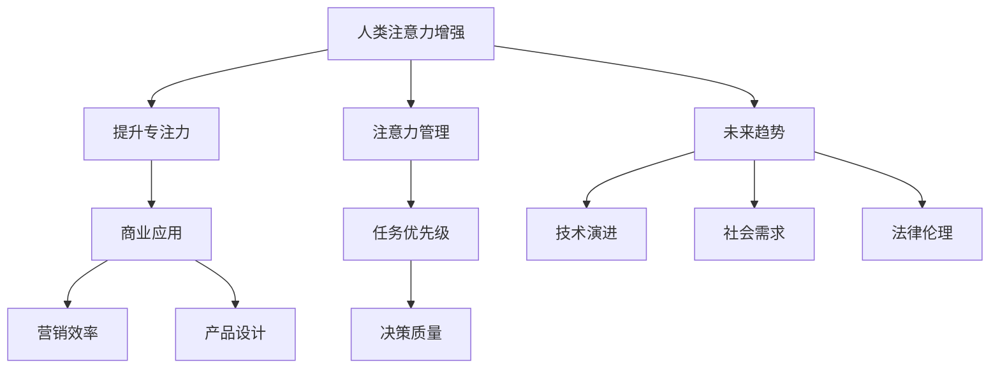

                 

# 人类注意力增强：提升专注力和注意力在商业中的未来发展机遇分析机遇挑战机遇趋势

> 关键词：人类注意力增强, 提升专注力, 注意力, 商业应用, 未来趋势, 机遇挑战

## 1. 背景介绍

### 1.1 问题由来

在数字化的今天，信息过载已成为现代人面临的普遍挑战。从社交媒体到电子邮件，从即时通讯到新闻推送，各种信息源不断干扰着人们的注意力。这种信息过载不仅导致工作效率低下，还可能导致注意力分散，影响决策质量。如何提升个人和组织级的注意力，成为现代社会关注的焦点。

商业领域尤其如此。面对激烈的市场竞争，企业需要高效集中注意力，迅速做出反应，才能在瞬息万变的市场环境中立于不败之地。利用技术手段提升人类的专注力和注意力，成为商业竞争中不可或缺的利器。

### 1.2 问题核心关键点

提升专注力和注意力的方法多种多样，从心理学到神经科学，从技术工具到组织管理，每个方面都有其独特的视角和方法。但将注意力增强技术应用到商业领域，尤其是利用人工智能和机器学习技术，正在成为一种趋势。本文将深入探讨这一领域的现状与未来趋势，分析其带来的机遇与挑战。

## 2. 核心概念与联系

### 2.1 核心概念概述

为更好地理解注意力增强技术在商业中的应用，本节将介绍几个核心概念及其相互联系：

- **人类注意力增强(Human Attention Enhancement, HAE)**：利用技术手段，提升个人或组织的注意力集中能力和信息处理效率，从而提升决策和执行质量。

- **提升专注力(Enhanced Concentration)**：通过技术干预，增强个体在特定任务上的专注度和持久力，减少外界干扰，提高工作效率。

- **注意力(Attention)**：人类认知过程中的关键能力，指个体选择和维持对特定信息的集中注意。商业应用中，注意力的管理与分配直接关系到企业的决策和执行效率。

- **商业应用(Business Application)**：将注意力增强技术应用于企业的运营管理、市场营销、产品设计等多个环节，提升企业竞争力。

- **未来趋势(Future Trends)**：技术演进和社会发展的动态，决定了注意力增强技术的潜在发展和应用前景。

- **机遇挑战(Opportunities & Challenges)**：技术应用过程中可能遇到的各种机会与挑战，是评估技术可行性和商业价值的关键。

这些核心概念通过以下Mermaid流程图展现了它们之间的联系：



这个流程图展示了一系列概念间的逻辑关系：

1. 人类注意力增强（A）通过提升专注力（B）来增强注意力管理（C）。
2. 注意力管理（C）影响任务优先级（D）和决策质量（E）。
3. 商业应用（F）通过提升营销效率（G）和产品设计（H）来增强企业竞争力。
4. 未来趋势（I）受技术演进（J）和社会需求（K）的影响，同时也需考虑法律伦理（L）。

这些概念共同构成了注意力增强技术的整体框架，其应用效果将随着技术发展和应用场景的变化而不断演进。

## 3. 核心算法原理 & 具体操作步骤

### 3.1 算法原理概述

注意力增强技术的核心在于通过数据分析和机器学习模型，识别和预测个体的注意力状态，并根据这些状态动态调整信息展示和任务分配。该技术主要包括两个核心部分：注意力预测和注意力调整。

- **注意力预测(Attention Prediction)**：使用机器学习模型预测个体在特定任务或情境中的注意力状态。模型通常基于时间序列数据、生理信号、行为数据等进行训练，以识别注意力集中与分散的特征。

- **注意力调整(Attention Modulation)**：根据注意力预测结果，动态调整信息展示策略和任务优先级，以促进个体在特定任务上的注意力集中。常见的调整策略包括信息的透明度、频率、强度等。

### 3.2 算法步骤详解

基于注意力增强技术在商业应用中的研究，本节将详细讲解算法的实现步骤：

1. **数据收集**：收集个体的行为数据、生理数据（如心率、脑电波等）以及环境数据（如噪音水平、工作时间等），建立数据集。

2. **模型训练**：使用历史数据训练注意力预测模型，如基于时间序列的RNN、CNN、LSTM等模型。模型训练的目标是识别出个体在不同任务中的注意力集中和分散状态。

3. **注意力预测**：在实时环境中，通过传感器获取个体当前状态数据，输入到训练好的模型中，预测出当前的任务注意力状态。

4. **注意力调整**：根据注意力预测结果，动态调整信息展示策略。例如，在个体注意力集中的时刻，增强信息的可见性和重要性；在注意力分散时，降低信息干扰。

5. **反馈优化**：根据预测结果和实际效果，不断调整模型参数和展示策略，提升预测准确度和调整效果。

### 3.3 算法优缺点

注意力增强技术具有以下优点：

- **实时性**：通过实时数据输入和预测，可以在个体注意力状态变化时及时调整信息展示，提高效率。
- **个性化**：模型可以根据个体历史数据和当前状态，提供个性化的信息展示策略，提升用户体验。
- **可扩展性**：技术可以应用于各种场景，从个人办公到企业管理，具有广泛的应用前景。

但同时也存在一些缺点：

- **隐私问题**：生理和行为数据的收集可能涉及隐私问题，需要严格的法律法规保护。
- **技术复杂性**：模型的训练和调整需要专业知识，对技术门槛要求较高。
- **数据依赖**：模型的准确性依赖于数据的质量和数量，数据缺失或不完整可能影响效果。

### 3.4 算法应用领域

注意力增强技术在多个领域都有广泛应用：

- **个人工作效率提升**：通过智能辅助工具，如专注力提升应用、信息过滤系统等，帮助个体在特定任务上集中注意力，提高工作效率。
- **企业运营优化**：利用智能系统优化任务分配和信息展示，提升企业决策和执行效率，改善员工满意度。
- **教育培训**：通过个性化学习路径和实时反馈，提升学习效果，帮助个体在特定领域内集中注意力。
- **健康管理**：监控个体的注意力状态，结合生理数据，提供健康管理和心理支持。

## 4. 数学模型和公式 & 详细讲解 & 举例说明

### 4.1 数学模型构建

本节将使用数学语言对注意力增强技术的核心模型进行更加严格的刻画。

假设个体在任务 $i$ 中的注意力状态为 $A_i(t)$，其中 $t$ 表示时间。模型的目标是根据历史数据 $D=\{(x_k,y_k)\}_{k=1}^N$，其中 $x_k$ 为时间序列数据，$y_k$ 为注意力状态标签，训练出注意力预测模型 $f(x)$。模型的输入为当前时间序列数据 $x_t$，输出为当前任务 $i$ 的注意力状态 $A_i(t)$。

### 4.2 公式推导过程

以时间序列模型为例，基于长短期记忆网络(LSTM)的注意力预测模型公式如下：

$$
f(x_t) = LSTM(x_t; \theta) = \tanh(W \cdot x_t + b) \odot \sigma(U \cdot \tanh(W \cdot x_t + b) + c)
$$

其中 $W$ 和 $b$ 为模型的权重和偏置，$\odot$ 表示逐元素乘法，$\sigma$ 为Sigmoid函数。模型的输出 $A_i(t)$ 可以表示为：

$$
A_i(t) = \text{softmax}(f(x_t))
$$

其中 softmax 函数将模型的输出转换为注意力概率分布，表示个体在任务 $i$ 上的注意力集中程度。

### 4.3 案例分析与讲解

以一个电商平台的推荐系统为例，分析注意力增强技术的应用：

- **数据收集**：平台收集用户的浏览历史、购买记录、点击率等行为数据，同时采集用户的生理数据（如心率、瞳孔扩张度等）和环境数据（如时间、噪音水平等）。
- **模型训练**：使用历史数据训练注意力预测模型，识别用户的注意力集中和分散状态。
- **注意力预测**：实时采集用户的当前行为和生理数据，输入到训练好的模型中，预测其当前在浏览、购买、搜索等任务中的注意力状态。
- **注意力调整**：根据注意力预测结果，动态调整推荐策略。例如，在用户注意力集中的时刻，推荐更相关、更具吸引力的商品；在注意力分散时，减少干扰性信息展示。

## 5. 项目实践：代码实例和详细解释说明

### 5.1 开发环境搭建

在进行注意力增强技术实践前，我们需要准备好开发环境。以下是使用Python进行TensorFlow开发的环境配置流程：

1. 安装Anaconda：从官网下载并安装Anaconda，用于创建独立的Python环境。

2. 创建并激活虚拟环境：
```bash
conda create -n tf-env python=3.8 
conda activate tf-env
```

3. 安装TensorFlow：根据CUDA版本，从官网获取对应的安装命令。例如：
```bash
conda install tensorflow
```

4. 安装各类工具包：
```bash
pip install numpy pandas scikit-learn matplotlib tqdm jupyter notebook ipython
```

完成上述步骤后，即可在`tf-env`环境中开始注意力增强技术的开发实践。

### 5.2 源代码详细实现

下面是使用TensorFlow实现注意力增强技术的示例代码：

```python
import tensorflow as tf
from tensorflow.keras.models import Sequential
from tensorflow.keras.layers import LSTM, Dense, TimeDistributed, Softmax
import numpy as np
import matplotlib.pyplot as plt

# 数据准备
# 假设已经准备好时间序列数据和注意力标签
x_train = np.random.randn(1000, 10)  # 1000个样本，每个样本10个时间点
y_train = np.random.randint(0, 2, size=(1000, 2))  # 0表示注意力集中，1表示注意力分散

# 构建模型
model = Sequential([
    LSTM(64, input_shape=(10, 1)),
    TimeDistributed(Dense(2, activation='softmax'))
])

# 编译模型
model.compile(optimizer='adam', loss='binary_crossentropy', metrics=['accuracy'])

# 训练模型
history = model.fit(x_train, y_train, epochs=10, verbose=0)

# 使用模型进行预测
x_test = np.random.randn(100, 10)  # 100个样本，每个样本10个时间点
y_pred = model.predict(x_test)

# 绘制模型训练和测试的准确率曲线
plt.plot(history.history['accuracy'])
plt.plot(history.history['val_accuracy'])
plt.title('Model Accuracy')
plt.ylabel('Accuracy')
plt.xlabel('Epoch')
plt.legend(['Train', 'Test'], loc='upper left')
plt.show()

# 绘制模型训练和测试的损失曲线
plt.plot(history.history['loss'])
plt.plot(history.history['val_loss'])
plt.title('Model Loss')
plt.ylabel('Loss')
plt.xlabel('Epoch')
plt.legend(['Train', 'Test'], loc='upper left')
plt.show()
```

### 5.3 代码解读与分析

让我们再详细解读一下关键代码的实现细节：

**模型构建**：
- 使用Sequential模型，构建了一个包含LSTM层和TimeDistributed Dense层的注意力预测模型。LSTM层用于处理时间序列数据，Dense层用于输出注意力概率分布。

**模型编译**：
- 使用adam优化器，交叉熵损失函数，准确率作为评估指标，编译模型。

**模型训练**：
- 使用训练数据拟合模型，输出训练和验证的准确率和损失曲线。

**模型预测**：
- 使用训练好的模型对测试数据进行预测，输出注意力状态。

**结果可视化**：
- 使用matplotlib绘制模型的训练和测试准确率、损失曲线，观察模型的学习效果。

可以看到，TensorFlow提供了便捷的深度学习模型构建和训练功能，使得注意力增强技术的实现变得相对简单。

## 6. 实际应用场景

### 6.1 个人工作效率提升

基于注意力增强技术，可以开发智能辅助工具，帮助个人提升工作效率。例如，可以使用注意力监测系统，实时监控个体的注意力状态，在注意力分散时提供提醒，如短暂休息、信息过滤等。还可以通过个性化推荐系统，根据用户的注意力状态和任务需求，动态调整信息展示策略，提升工作效率。

### 6.2 企业运营优化

在企业运营中，注意力增强技术可以通过智能任务调度系统和信息过滤系统，优化资源分配和信息管理。例如，在会议调度时，可以根据与会者的注意力状态，动态调整会议安排和信息展示，提升会议效率和决策质量。在客户服务中，可以通过实时监控客户注意力状态，提供个性化的服务方案，提升客户满意度。

### 6.3 教育培训

在教育培训中，注意力增强技术可以通过个性化学习路径和实时反馈，提升学习效果。例如，根据学生的注意力集中和分散状态，动态调整课程内容和难度，提供适当的休息和奖励，提升学习兴趣和效果。

### 6.4 健康管理

在健康管理中，注意力增强技术可以通过监控个体的注意力状态，结合生理数据，提供健康管理和心理支持。例如，在心理健康评估中，可以通过分析个体的注意力状态和情绪变化，及时发现和干预心理问题。

## 7. 工具和资源推荐

### 7.1 学习资源推荐

为了帮助开发者系统掌握注意力增强技术的理论基础和实践技巧，这里推荐一些优质的学习资源：

1. **TensorFlow官方文档**：官方文档提供了详细的TensorFlow使用指南和示例代码，是学习注意力增强技术的必备资料。

2. **《深度学习》课程**：斯坦福大学开设的深度学习课程，涵盖了从基础到高级的各种深度学习技术和应用，适合初学者和进阶者。

3. **《机器学习实战》书籍**：该书详细介绍了机器学习模型的构建和优化，包括注意力增强技术在内的多个应用实例。

4. **HuggingFace官方文档**：HuggingFace是NLP领域的知名开源库，提供了丰富的预训练模型和注意力增强技术的样例代码。

5. **arXiv论文**：arXiv是学术界知名的论文数据库，可以在此查找最新的注意力增强技术研究成果。

通过对这些资源的学习实践，相信你一定能够快速掌握注意力增强技术的精髓，并用于解决实际的商业问题。

### 7.2 开发工具推荐

高效的开发离不开优秀的工具支持。以下是几款用于注意力增强技术开发的常用工具：

1. **TensorFlow**：基于Python的开源深度学习框架，适合处理时间序列数据和构建复杂的神经网络模型。

2. **TensorBoard**：TensorFlow配套的可视化工具，可实时监测模型训练状态，提供丰富的图表呈现方式。

3. **Keras**：TensorFlow的高层API，提供便捷的模型构建和训练接口，适合快速迭代研究。

4. **PyTorch**：基于Python的开源深度学习框架，适合动态图模型构建和训练。

5. **Jupyter Notebook**：交互式的Python开发环境，方便编写和执行代码，支持可视化输出。

合理利用这些工具，可以显著提升注意力增强技术的开发效率，加快创新迭代的步伐。

### 7.3 相关论文推荐

注意力增强技术的研究源于学界的持续研究。以下是几篇奠基性的相关论文，推荐阅读：

1. **《深度注意力》（Deep Attention）**：提出了注意力机制的深度学习模型，广泛应用于机器翻译、图像识别等领域。

2. **《注意力在深度学习中的应用》（Attention in Deep Learning）**：综述了注意力机制在深度学习中的各种应用，包括自然语言处理、图像处理、音频处理等。

3. **《注意力在强化学习中的应用》（Attention in Reinforcement Learning）**：探讨了注意力机制在强化学习中的应用，为决策优化提供了新的思路。

4. **《基于注意力的信息过滤系统》（Attention-Based Information Filtering System）**：介绍了基于注意力机制的信息过滤系统，实现了对海量信息的智能过滤和推荐。

这些论文代表了大语言模型微调技术的发展脉络。通过学习这些前沿成果，可以帮助研究者把握学科前进方向，激发更多的创新灵感。

## 8. 总结：未来发展趋势与挑战

### 8.1 研究成果总结

本文对注意力增强技术在商业应用中的现状与未来趋势进行了全面系统的介绍。首先阐述了注意力增强技术的理论基础和核心算法，明确了其提升专注力和注意力的关键作用。其次，从原理到实践，详细讲解了算法的实现步骤，提供了完整的代码示例。同时，本文还广泛探讨了注意力增强技术在个人效率提升、企业运营优化、教育培训、健康管理等多个领域的应用前景，展示了其广阔的应用潜力。

通过本文的系统梳理，可以看到，注意力增强技术在提升人类专注力和注意力的过程中，正在成为商业竞争中不可或缺的利器。其技术演进和社会需求的变化，将深刻影响未来商业发展的趋势和方向。

### 8.2 未来发展趋势

展望未来，注意力增强技术将呈现以下几个发展趋势：

1. **个性化与动态调整**：未来的注意力增强技术将更加注重个性化需求，通过动态调整信息展示策略，提供个性化的服务方案。

2. **多模态信息融合**：利用语音、视觉等多模态信息，增强对个体注意力的理解和预测，提升系统的准确性和鲁棒性。

3. **实时性增强**：通过引入实时数据监测和预测，实现对个体注意力的实时调整和反馈，提升用户体验。

4. **自动化与智能辅助**：结合自动化算法和智能辅助工具，提升系统的自动化水平，减少人工干预，提高效率。

5. **跨平台与跨领域应用**：将注意力增强技术应用于多个平台和领域，如智能手机、智能家居、工业制造等，推动技术的普及和应用。

6. **伦理与安全**：随着技术应用的普及，注意力增强技术将面临更多的伦理和安全挑战，如隐私保护、数据安全、算法偏见等，需要进一步研究和完善。

这些趋势凸显了注意力增强技术的广阔前景，也指明了未来技术发展的方向。

### 8.3 面临的挑战

尽管注意力增强技术已经取得了显著的进展，但在迈向更加智能化、普适化应用的过程中，它仍面临诸多挑战：

1. **数据隐私**：生理和行为数据的收集涉及隐私问题，如何在保护隐私的同时，获得足够的数据支持，是技术应用的重大挑战。

2. **技术复杂性**：注意力增强技术涉及复杂的深度学习模型和算法，对技术要求较高，需要大量的研发投入。

3. **算法偏见**：注意力增强模型可能学习到数据中的偏见，导致不公平的决策和推荐，需要进一步完善算法和数据收集策略。

4. **实时性要求高**：实时性要求高，需要在短时间内完成数据输入、模型预测和信息调整，对系统的计算能力和响应速度提出了更高的要求。

5. **用户接受度**：注意力增强技术的应用需要用户的主动配合，如何提高用户的接受度和使用体验，是技术普及的重要障碍。

6. **伦理与安全**：技术应用过程中可能出现伦理和法律问题，如数据泄露、算法歧视等，需要进一步研究和规范。

这些挑战需要学界和产业界的共同努力，才能推动技术向更加成熟、可靠、安全的方向发展。

### 8.4 研究展望

面对注意力增强技术所面临的诸多挑战，未来的研究需要在以下几个方面寻求新的突破：

1. **隐私保护技术**：研究新的隐私保护方法，如联邦学习、差分隐私等，确保数据收集和处理过程中的隐私安全。

2. **模型优化技术**：开发更高效、更鲁棒的注意力预测模型，提升系统的准确性和实时性。

3. **多模态信息融合**：研究多模态信息融合的方法，增强系统对个体注意力的理解和预测。

4. **跨领域应用**：将注意力增强技术应用于更多领域，如工业制造、农业生产等，推动技术的广泛应用。

5. **伦理与法规**：研究注意力增强技术的伦理与法规问题，确保技术应用符合社会价值观和法律法规。

6. **用户友好设计**：设计更加友好、易用的用户界面和交互方式，提高用户的接受度和使用体验。

这些研究方向的探索，必将引领注意力增强技术迈向更高的台阶，为构建更加智能化、普适化的商业系统铺平道路。

## 9. 附录：常见问题与解答

**Q1：注意力增强技术是否适用于所有个体？**

A: 注意力增强技术在理论上是适用于所有个体的，但实际应用中需要考虑个体的差异性。例如，不同年龄、职业、教育背景的个体，对注意力增强的需求和效果可能不同。因此，技术应用过程中需要结合个体特征进行个性化设计。

**Q2：注意力增强技术如何提升个人工作效率？**

A: 注意力增强技术通过实时监控个体的注意力状态，动态调整信息展示和任务优先级，减少外界干扰，提高工作效率。例如，在处理复杂任务时，通过降低干扰性信息展示，集中注意力在关键任务上，提升处理效率。

**Q3：企业如何利用注意力增强技术提升运营效率？**

A: 企业可以通过智能任务调度系统和信息过滤系统，优化资源分配和信息管理。例如，在会议调度时，根据与会者的注意力状态，动态调整会议安排和信息展示，提升会议效率和决策质量。

**Q4：注意力增强技术在教育培训中如何发挥作用？**

A: 在教育培训中，可以通过个性化学习路径和实时反馈，提升学习效果。例如，根据学生的注意力集中和分散状态，动态调整课程内容和难度，提供适当的休息和奖励，提升学习兴趣和效果。

**Q5：注意力增强技术在健康管理中如何应用？**

A: 在健康管理中，可以通过监控个体的注意力状态，结合生理数据，提供健康管理和心理支持。例如，在心理健康评估中，可以通过分析个体的注意力状态和情绪变化，及时发现和干预心理问题。

这些回答希望能帮助你更好地理解注意力增强技术的应用场景和潜力，并进一步思考技术未来的发展方向和挑战。

---

作者：禅与计算机程序设计艺术 / Zen and the Art of Computer Programming

