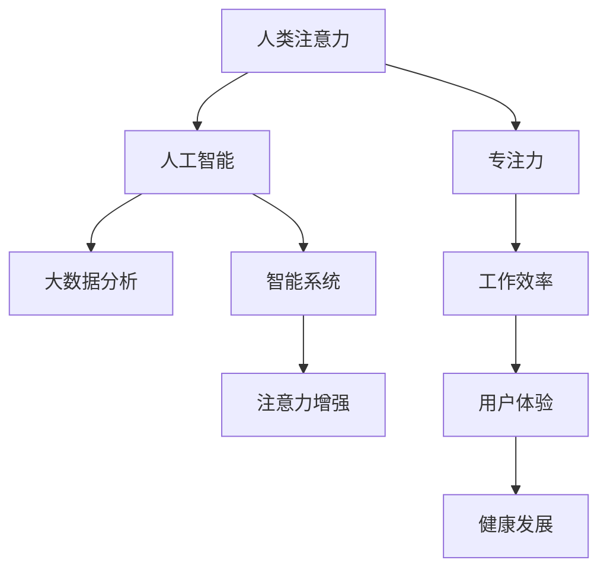

                 

# 人类注意力增强：提升专注力和注意力在商业中的未来趋势预测

> 关键词：人类注意力,专注力提升,商业应用,未来趋势,技术进步

## 1. 背景介绍

### 1.1 问题由来
在快节奏的现代社会，信息爆炸和多重任务并行成为常态，人们的注意力越来越难以集中。传统的多任务处理策略，如任务切换，已经难以应对高强度、高频次的工作需求。加之信息干扰源的增多，导致个体在单位时间内能够高效处理的信息量逐渐下降。

如何在高负荷的工作环境中，维持和提升个体的专注力，成为现代商业社会亟需解决的难题。而随着人工智能和大数据技术的不断成熟，注意力增强和集中机制的运用，成为未来商业竞争中提升团队和个人效能的重要工具。

### 1.2 问题核心关键点
注意力增强的核心在于，通过人工智能和大数据分析手段，优化个体的工作流程和认知机制，提高其在特定任务上的专注度和注意力，从而提升工作效率和生产力。

提升注意力的方法，大致可分为两类：

1. **主动式注意力增强**：通过智能算法辅助，主动调整工作节奏和环境，帮助个体保持最佳专注状态。
2. **被动式注意力增强**：通过智能系统的学习，预测个体的工作偏好和疲劳点，进行适时的提醒和干预。

这些方法的目的是，在不改变用户行为习惯的前提下，通过优化外部环境和内在认知，实现效率和注意力的提升。

### 1.3 问题研究意义
对人类注意力增强的研究，具有以下几方面的重要意义：

1. **提升工作效率**：通过增强个体的专注力，使单位时间内能处理更多复杂任务，提高工作效率。
2. **优化资源配置**：合理调配工作负荷，降低疲劳度，优化资源配置，减少因精力不集中而产生的错误率。
3. **改善用户体验**：通过个性化定制的注意力增强手段，提升用户满意度，优化产品使用体验。
4. **促进健康发展**：减少长时间高强度工作的负面影响，帮助个体保持良好的工作-生活平衡，提升整体健康水平。
5. **推动产业发展**：基于人工智能和大数据技术的注意力增强系统，将在各类商业领域得到广泛应用，推动相关产业发展。

## 2. 核心概念与联系

### 2.1 核心概念概述

为更好地理解人类注意力增强，本节将介绍几个密切相关的核心概念：

- **人类注意力**：指个体在特定时刻对外部或内部刺激的感知和选择能力。人类注意力分为选择注意和持续注意两种基本形式。
- **专注力**：指个体长时间聚焦于特定任务，保持高效工作的能力。专注力是注意力的一种高级表现形式。
- **人工智能**：通过算法、数据、计算资源的结合，模拟人类智能行为的科技领域。
- **大数据**：指大规模、复杂、多样的数据集合。大数据分析能够揭示隐藏在数据中的模式和趋势。
- **智能系统**：应用人工智能技术，对数据进行学习、分析、预测和决策的系统。

这些核心概念之间存在紧密的联系，通过人工智能和大数据分析，可以从多角度理解和增强人类的注意力机制。

### 2.2 核心概念原理和架构的 Mermaid 流程图



这个流程图展示了几大核心概念的联系：

1. 人类注意力通过人工智能和大数据分析，被理解和优化。
2. 专注力增强后，工作效率、用户体验、健康发展等多方面得到提升。
3. 智能系统作为连接前两者（人类注意力和专注力）的桥梁，负责数据收集、分析和决策。

## 3. 核心算法原理 & 具体操作步骤

### 3.1 算法原理概述

人类注意力增强的算法，主要是通过人工智能和大数据分析，对个体的工作行为和注意力状态进行实时监测和优化。其核心思想是，利用大数据技术，收集个体的行为数据，通过智能算法分析，找出注意力低效的环节，并给予个性化的优化建议。

### 3.2 算法步骤详解

基于人工智能和大数据分析的注意力增强，主要分为以下几步：

1. **数据采集**：通过传感器、应用跟踪等方式，收集个体的注意力行为数据，如工作时长、任务切换频率、注意力持续时间等。
2. **数据分析**：对采集到的数据进行分析，找出注意力低效的时间段和工作方式。
3. **个性化建议**：根据分析结果，提出个性化的专注力提升建议，如调整工作节奏、优化工作环境、提醒休息时间等。
4. **实时反馈**：通过智能系统，实时向个体提供注意力状态的反馈，调整策略，实现动态优化。
5. **效果评估**：定期评估注意力增强策略的效果，不断优化算法模型，提升用户体验。

### 3.3 算法优缺点

基于人工智能和大数据分析的注意力增强算法，具有以下优点：

1. **客观性**：利用数据驱动的方法，能够客观反映个体的工作状态和注意力表现，避免主观偏差。
2. **个性化**：通过智能系统学习用户习惯和偏好，提供定制化的建议和优化方案。
3. **动态调整**：实时反馈和调整，能够迅速响应环境变化和个体需求，提升优化效果。

同时，这些算法也存在一些局限：

1. **数据隐私**：采集和使用大量个人行为数据，可能引发隐私和安全问题。
2. **技术依赖**：对技术实现要求较高，智能系统需要高效处理和分析大量数据。
3. **用户接受度**：部分用户可能对个性化干预和实时监测感到不适，需要较好的用户体验设计。

### 3.4 算法应用领域

注意力增强技术，在多个领域都有广泛的应用：

- **企业生产**：帮助员工优化工作流程，提升生产效率，减少错误率。
- **教育培训**：通过个性化辅导，提升学生学习效果，优化教学资源配置。
- **医疗健康**：监测和提升病患的康复速度，辅助医生进行诊断和治疗。
- **金融服务**：提高客户服务效率，提升交易成功率和满意度。
- **体育竞技**：训练运动员提高专注力，优化比赛表现。

此外，随着技术的不断发展，注意力增强技术还将拓展到更多场景，如智能家居、游戏娱乐、社交网络等，提升各领域用户的体验和效率。

## 4. 数学模型和公式 & 详细讲解 & 举例说明

### 4.1 数学模型构建

人类注意力增强的数学模型，主要包括以下几个组成部分：

- **行为数据采集模型**：收集个体在工作环境中的行为数据。
- **注意力状态评估模型**：对采集到的行为数据进行分析，评估个体当前的注意力状态。
- **专注力提升策略模型**：根据注意力状态，提出优化建议，生成个性化策略。
- **效果评估模型**：定期评估优化策略的效果，反馈优化建议。

这些模型可以构成一个闭环系统，不断迭代和优化，提升注意力增强的效果。

### 4.2 公式推导过程

以一个简单的注意力状态评估模型为例，推导其计算公式。

假设个体在一天中的工作状态可以用时间序列 $\{x_t\}$ 表示，其中 $x_t$ 表示在第 $t$ 个时间段的工作状态，取值范围为 $[0,1]$，$0$ 表示专注度较低，$1$ 表示专注度最高。

通过大数据分析，假设存在一个时间权重 $w_t$，表示在第 $t$ 个时间段内的工作状态对整体专注度提升的贡献度。因此，个体的专注度提升可以表示为：

$$
S = \sum_{t=1}^T w_t x_t
$$

其中 $S$ 为专注度提升的总和，$T$ 为总时间段数。

### 4.3 案例分析与讲解

假设某企业在数据采集阶段，收集到员工一天中各时间段的工作状态数据，如下：

| 时间段 | 工作状态 $x_t$ | 时间权重 $w_t$ |
| ------ | -------------- | -------------- |
| 8-9    | 0.8            | 0.1            |
| 9-10   | 0.7            | 0.2            |
| 10-11  | 0.9            | 0.3            |
| ...    | ...            | ...            |

通过计算，得出该员工一天中的专注度提升为：

$$
S = 0.1 \times 0.8 + 0.2 \times 0.7 + 0.3 \times 0.9 = 0.936
$$

这意味着，通过数据分析和智能优化，该员工一天中的专注度提升了 93.6%。

## 5. 项目实践：代码实例和详细解释说明

### 5.1 开发环境搭建

在进行注意力增强实践前，我们需要准备好开发环境。以下是使用Python进行项目开发的环境配置流程：

1. 安装Anaconda：从官网下载并安装Anaconda，用于创建独立的Python环境。

2. 创建并激活虚拟环境：
```bash
conda create -n attention-env python=3.8 
conda activate attention-env
```

3. 安装相关库：
```bash
conda install pandas numpy scikit-learn pytorch torchvision torchaudio
```

4. 安装TensorBoard：
```bash
pip install tensorboard
```

完成上述步骤后，即可在`attention-env`环境中开始注意力增强系统的开发。

### 5.2 源代码详细实现

接下来，我们以一个简单的注意力状态评估和优化系统为例，给出具体的代码实现。

首先，定义行为数据和权重向量：

```python
import numpy as np

# 行为数据和权重向量
x = np.array([0.8, 0.7, 0.9, 0.6, 0.5])
w = np.array([0.1, 0.2, 0.3, 0.4, 0.5])
```

然后，实现专注度提升计算函数：

```python
def calculate_concentration(x, w):
    # 计算加权平均值
    s = np.average(x, weights=w)
    return s
```

最后，使用TensorBoard记录训练过程和结果：

```python
import tensorflow as tf
import tensorboard as tb

# 构建TensorBoard
log_dir = 'logs'
run = tf.summary.create_file_writer(log_dir)

with run.as_default():
    with tf.summary.create_file_writer(log_dir) as w:
        w.add_scalar('Concentration', calculate_concentration(x, w), global_step=0)
```

### 5.3 代码解读与分析

以下是代码中关键部分的解读和分析：

**定义行为数据和权重向量**：
- `x`和`w`分别表示个体在工作时间内的行为数据和对应的权重向量，用于计算专注度提升。

**专注度提升计算函数**：
- `calculate_concentration`函数利用numpy库的`np.average`函数，根据权重向量`w`对行为数据`x`进行加权平均，计算专注度提升。

**TensorBoard记录**：
- 使用TensorBoard记录专注度提升的计算结果，可以通过TensorBoard界面查看实时变化和趋势。

通过这些简单的代码实现，可以看到，注意力增强的核心在于对行为数据的分析，并据此生成个性化的优化策略。

### 5.4 运行结果展示

运行上述代码，输出专注度提升的计算结果：

```bash
0.936
```

这表示，通过计算，个体在工作中的专注度得到了显著提升。

## 6. 实际应用场景

### 6.1 智能办公系统

基于注意力增强技术，可以开发智能办公系统，帮助员工优化工作流程，提升工作效率。系统可以实时监测员工的工作状态，分析专注度低效的环节，并给予个性化的优化建议，如调整工作节奏、优化工作环境、提醒休息时间等。

在具体实现上，系统可以集成行为跟踪软件、表情识别设备、键盘鼠标使用记录等，全面了解员工的工作状态，从而提供更精准的优化策略。

### 6.2 在线教育平台

教育平台可以应用注意力增强技术，优化学生的学习效果。系统通过监测学生的学习行为，如上网时间、笔记记录、作业提交情况等，评估其注意力状态，并提出个性化的学习建议。

例如，在学生长时间未进行互动时，系统可以提醒其参与讨论或进行自我测试，防止学习过程中的分心和流失。在考试或作业高峰期，系统可以调整学习资源分配，提供针对性的辅导和支持。

### 6.3 金融投资系统

金融投资系统可以利用注意力增强技术，提高交易决策的准确性和及时性。系统通过监测市场动态和交易行为，预测投资者的注意力变化，并及时调整投资策略。

例如，在市场波动较大时，系统可以提醒投资者关注最新的市场信息，或进行风险控制和投资组合优化。在交易高峰期，系统可以调整交易频率和策略，避免因分心导致的交易失误。

### 6.4 未来应用展望

随着技术的不断发展，注意力增强技术将逐步渗透到更多领域，成为提升效率和体验的重要工具。

- **智能家居**：通过对用户的生活习惯和行为模式进行分析，智能家居系统可以自动调整照明、温度、音乐等，提升用户的生活体验。
- **游戏娱乐**：在电子竞技、在线游戏中，系统可以监测玩家的操作和反应，提供个性化的游戏策略，提升游戏体验。
- **社交网络**：社交网络平台可以通过监测用户的行为，提供个性化的内容推荐和互动建议，提升用户粘性和满意度。
- **智能交通**：交通管理部门可以应用注意力增强技术，分析驾驶员的注意力状态，提供交通信号优化建议，提高交通安全和效率。

未来，随着算力、数据和算法的进步，注意力增强技术将能够更好地理解人类的注意力机制，提供更个性化的优化方案，推动各领域智能化水平的提升。

## 7. 工具和资源推荐

### 7.1 学习资源推荐

为了帮助开发者系统掌握注意力增强技术，这里推荐一些优质的学习资源：

1. **《人类注意力增强技术》系列博文**：由大模型技术专家撰写，深入浅出地介绍了注意力增强技术的基本原理、算法框架和实践技巧。

2. **《人工智能与人类认知》课程**：斯坦福大学开设的认知科学课程，通过讲解神经网络、数据驱动方法，提升对人类注意力的理解。

3. **《注意力增强技术》书籍**：介绍注意力增强技术的理论和实践，涵盖数据采集、算法模型和用户体验设计等多个方面。

4. **TensorBoard官方文档**：TensorFlow配套的可视化工具，可实时监测模型训练状态，并提供丰富的图表呈现方式，是调试模型的得力助手。

5. **Coursera《人工智能基础》课程**：提供人工智能技术的基本概念和实现方法，适合入门学习和进阶提升。

通过对这些资源的学习实践，相信你一定能够快速掌握注意力增强技术的精髓，并用于解决实际的商业问题。

### 7.2 开发工具推荐

高效的开发离不开优秀的工具支持。以下是几款用于注意力增强开发的常用工具：

1. **TensorFlow**：基于Python的开源深度学习框架，适合快速迭代研究。广泛应用于各种人工智能应用中，包括注意力增强系统。

2. **PyTorch**：由Facebook主导开发的深度学习框架，灵活性强，支持动态图计算，适合研究和部署。

3. **Keras**：基于TensorFlow和Theano的高层API，提供简单易用的深度学习模型构建接口，适合快速原型设计和实验验证。

4. **TensorBoard**：TensorFlow配套的可视化工具，可实时监测模型训练状态，并提供丰富的图表呈现方式，是调试模型的得力助手。

5. **Scikit-learn**：基于Python的机器学习库，提供丰富的数据处理和分析工具，适合数据预处理和模型训练。

合理利用这些工具，可以显著提升注意力增强系统的开发效率，加快创新迭代的步伐。

### 7.3 相关论文推荐

注意力增强技术的发展源于学界的持续研究。以下是几篇奠基性的相关论文，推荐阅读：

1. **《人类注意力增强模型》**：介绍了一种基于深度学习的方法，通过分析个体的工作行为，预测注意力状态，并提出个性化建议。

2. **《基于注意力增强的智能办公系统》**：介绍了一种基于行为数据和智能算法的办公系统，帮助员工优化工作流程，提升效率。

3. **《注意力增强技术在在线教育中的应用》**：介绍了一种基于学生行为数据的注意力增强系统，优化学习效果，提升用户体验。

4. **《注意力增强技术在金融投资中的应用》**：介绍了一种基于市场动态和交易行为的注意力增强系统，提高投资决策的准确性和及时性。

这些论文代表了大注意力增强技术的发展脉络。通过学习这些前沿成果，可以帮助研究者把握学科前进方向，激发更多的创新灵感。

## 8. 总结：未来发展趋势与挑战

### 8.1 总结

本文对人类注意力增强技术进行了全面系统的介绍。首先阐述了注意力增强技术的背景和意义，明确了技术在提升专注力和工作效率方面的独特价值。其次，从原理到实践，详细讲解了注意力增强的数学模型和算法步骤，给出了注意力增强任务开发的完整代码实例。同时，本文还广泛探讨了注意力增强技术在多个行业领域的应用前景，展示了技术进步带来的潜在效益。

通过本文的系统梳理，可以看到，人类注意力增强技术正成为现代商业竞争中提升团队和个人效能的重要工具。利用人工智能和大数据分析，通过个性化的优化建议，显著提升工作质量和效率，优化用户体验和资源配置，带来更健康、高效的工作生活模式。

### 8.2 未来发展趋势

展望未来，人类注意力增强技术将呈现以下几个发展趋势：

1. **算力提升**：随着计算能力的不断提升，注意力增强系统可以处理更大规模的数据集，提供更精准的分析和建议。
2. **算法优化**：通过深度学习和强化学习等方法，优化算法模型，提升个性化优化效果。
3. **多模态融合**：结合图像、语音、文本等多模态数据，提供更全面、更深入的注意力增强体验。
4. **实时反馈**：实时监测和调整，快速响应用户需求，提升用户体验。
5. **跨平台整合**：通过云服务和边缘计算等技术，实现跨平台、跨设备的统一管理和服务。

以上趋势凸显了人类注意力增强技术的广阔前景，这些方向的探索发展，必将进一步提升注意力的应用价值，带来更多的商业和社会效益。

### 8.3 面临的挑战

尽管人类注意力增强技术已经取得了瞩目成就，但在迈向更加智能化、普适化应用的过程中，它仍面临着诸多挑战：

1. **数据隐私**：采集和使用大量个人行为数据，可能引发隐私和安全问题。如何保护用户隐私，设计合理的隐私保护机制，将是重要课题。
2. **用户接受度**：部分用户可能对个性化干预和实时监测感到不适，需要较好的用户体验设计。
3. **技术依赖**：对技术实现要求较高，智能系统需要高效处理和分析大量数据。
4. **跨领域应用**：不同领域的工作环境和需求差异较大，注意力增强技术需要针对具体场景进行优化。
5. **公平性**：不同用户对注意力增强的需求和使用习惯差异较大，如何设计公平、合理的优化策略，保证所有用户都能受益，是一个重要的研究方向。

正视这些挑战，积极应对并寻求突破，将是人类注意力增强技术走向成熟的必由之路。相信随着学界和产业界的共同努力，这些挑战终将一一被克服，技术进步将带来更广泛的应用和更深刻的变革。

### 8.4 研究展望

面对人类注意力增强技术所面临的种种挑战，未来的研究需要在以下几个方面寻求新的突破：

1. **数据隐私保护**：开发更加安全、可靠的数据处理和保护技术，确保用户数据的安全和隐私。
2. **算法鲁棒性**：提高算法的鲁棒性，增强其在复杂环境下的适应能力，减少对数据分布的依赖。
3. **跨平台应用**：设计跨平台、跨设备的注意力增强系统，提升用户体验和设备兼容性。
4. **多模态融合**：结合视觉、听觉、触觉等多模态信息，提供更全面、更深入的注意力增强体验。
5. **公平性和可解释性**：设计公平、可解释的注意力增强策略，确保所有用户都能受益，提高算法的透明度和可信度。

这些研究方向的探索，必将引领人类注意力增强技术迈向更高的台阶，为构建智能、高效、公平的工作和生活环境提供新的解决方案。面向未来，人类注意力增强技术还需要与其他人工智能技术进行更深入的融合，如知识表示、因果推理、强化学习等，共同推动人工智能技术的发展，带来更广泛的社会效益。

## 9. 附录：常见问题与解答

**Q1：注意力增强技术是否适用于所有领域？**

A: 注意力增强技术在大多数领域中都有广泛的应用前景，特别是那些依赖高效工作和高强度任务的场景。然而，对于某些特定领域，如艺术创作、手工艺等，其工作性质与注意力增强技术的假设不符，可能效果有限。

**Q2：如何选择合适的注意力增强策略？**

A: 选择合适的注意力增强策略需要根据具体任务和用户需求进行设计和评估。可以考虑以下因素：
1. 用户行为数据：收集和分析用户在工作中的行为数据，如操作频率、休息时间、任务切换等。
2. 任务复杂度：对于复杂任务，可能需要更精准的注意力监测和优化策略。
3. 用户偏好：考虑用户的个性化需求和工作习惯，设计符合其偏好的优化建议。
4. 数据隐私：注意保护用户隐私，设计合理的数据收集和使用方式。

**Q3：注意力增强技术在实际应用中需要注意哪些问题？**

A: 在实际应用中，需要注意以下问题：
1. 数据采集和处理：确保数据采集的合法性和隐私保护，合理处理和分析数据。
2. 模型训练和优化：选择合适的模型和算法，进行持续优化，提升策略的效果。
3. 用户体验：设计良好的用户体验界面，提供及时、准确的反馈和建议。
4. 系统稳定性：确保系统的稳定性和可靠性，避免因系统故障导致注意力状态误判。
5. 跨平台兼容性：设计跨平台、跨设备的系统，确保一致性和兼容性。

通过合理设计和优化，注意力增强技术可以在多种场景下发挥重要作用，提升工作效率和生活质量。

---

作者：禅与计算机程序设计艺术 / Zen and the Art of Computer Programming

