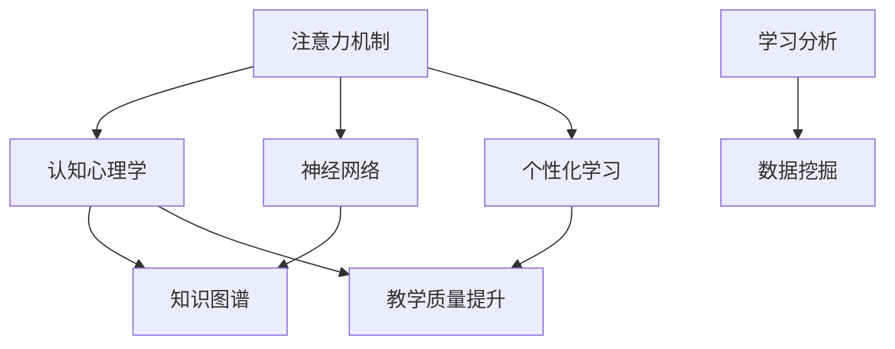

                 

# 人类注意力增强：提升专注力和注意力在教育中的未来方向分析预测

> 关键词：注意力增强, 教育技术, 个性化学习, 认知心理学, 神经网络, 知识图谱, 学习分析, 教育数据挖掘

## 1. 背景介绍

### 1.1 问题由来
在当今信息爆炸的时代，学生的注意力面临着前所未有的挑战。海量的信息流冲击着学生的大脑，使其难以集中精力学习。教育者急需找到一种方法来增强学生的注意力，从而提高学习效率和效果。近年来，人工智能（AI）技术在教育领域的应用成为热点，其中以注意力增强为核心技术，通过认知心理学和神经科学的研究，逐步探索出提升学生注意力的方法。本文旨在分析当前注意力增强技术在教育中的应用现状，探讨其未来发展方向，并预测其在教育中的前景。

### 1.2 问题核心关键点
注意力增强技术的应用关键点包括：
1. **认知心理学基础**：理解注意力机制及其在学习过程中的作用。
2. **神经网络模型**：通过机器学习模型进行注意力增强，个性化调整学习内容。
3. **知识图谱技术**：利用知识图谱构建内容相关性网络，指导学习路径。
4. **学习分析与数据挖掘**：通过分析学生行为数据，评估注意力增强效果。
5. **适应性与可扩展性**：确保技术能够在不同环境和条件下稳定运行。

### 1.3 问题研究意义
注意力增强技术在教育中的应用，有助于提高学生学习效率和效果，降低教育资源浪费，缓解教育不平等问题。同时，该技术还可以为教师提供科学的教育方法，提升教学质量。研究该技术的应用，有助于推动教育技术的发展，促进教育现代化进程。

## 2. 核心概念与联系

### 2.1 核心概念概述

为了更好地理解注意力增强技术在教育中的应用，我们需要对相关的核心概念进行梳理：

- **注意力机制**：指认知过程中有意识地聚焦于特定的刺激或信息，而忽略其他无关刺激的能力。
- **认知心理学**：研究人的认知过程、认知结构及其在教育中的应用。
- **神经网络**：通过多层神经元模拟人脑处理信息的过程，在注意力增强中用于学习和预测。
- **知识图谱**：通过构建语义网络，将知识组织成图形结构，用于关联不同知识点。
- **学习分析与数据挖掘**：通过分析学习数据，发现学习规律和趋势，指导个性化学习。

这些核心概念之间的联系可以通过以下Mermaid流程图来展示：



这个流程图展示了注意力增强技术在教育中的核心概念及其相互关系：

1. 注意力机制受到认知心理学研究的指导，进而影响神经网络的学习方式。
2. 知识图谱帮助神经网络理解知识之间的关联，优化学习路径。
3. 学习分析和数据挖掘为个性化学习提供支持，教学质量得以提升。

## 3. 核心算法原理 & 具体操作步骤
### 3.1 算法原理概述

注意力增强技术的基本原理是通过机器学习模型，根据学生的注意力特征，动态调整学习内容的难易程度和呈现方式，从而提高学生的注意力集中度。具体来说，该技术通过以下几个步骤实现：

1. **数据收集**：收集学生的注意力数据，如眼睛注视时长、大脑活动等。
2. **特征提取**：利用神经网络提取注意力数据中的关键特征。
3. **模型训练**：基于学生注意力特征，训练一个预测模型，评估不同学习内容的吸引力。
4. **内容调整**：根据模型的预测结果，动态调整学习内容的难度和呈现方式，以适应学生的注意力水平。

### 3.2 算法步骤详解

以下是详细的注意力增强技术的操作步骤：

1. **数据收集**：
   - 使用可穿戴设备（如智能眼镜、脑电波传感器等）收集学生的注意力数据。
   - 通过学习管理系统（LMS）记录学生的在线学习行为，如点击次数、停留时间等。

2. **特征提取**：
   - 利用卷积神经网络（CNN）或循环神经网络（RNN），从注意力数据中提取关键特征。
   - 特征包括注意力持续时间、聚焦区域等。

3. **模型训练**：
   - 使用神经网络模型（如深度学习模型）进行训练，预测不同学习内容的吸引力。
   - 模型输入为注意力特征，输出为不同内容的吸引力评分。

4. **内容调整**：
   - 根据模型的预测结果，动态调整学习内容的难度和呈现方式。
   - 例如，在学生注意力不集中时，展示更简单或更有趣的内容。

### 3.3 算法优缺点

注意力增强技术具有以下优点：
1. **个性化学习**：根据学生的注意力特征，动态调整学习内容，提升学习效率。
2. **实时反馈**：通过实时监测学生注意力，及时调整学习策略。
3. **适应性强**：适用于不同学科和教学环境，具有广泛应用前景。

同时，该技术也存在以下缺点：
1. **技术复杂性**：需要高精度的传感器和复杂的算法模型。
2. **隐私问题**：学生注意力数据涉及个人隐私，数据收集和使用需要严格规范。
3. **依赖性强**：对设备和网络环境的依赖，可能导致数据获取不全面。
4. **干预效果难以量化**：注意力增强效果的评估较为复杂，需要多维度指标。

### 3.4 算法应用领域

注意力增强技术主要应用于以下领域：

1. **在线教育**：通过智能学习平台，根据学生的注意力数据调整课程内容。
2. **课堂教学**：在传统课堂上，使用智能黑板、学习管理系统等工具，实时监测学生注意力。
3. **自主学习**：通过智能导师系统，提供个性化的学习路径和内容推荐。
4. **游戏化学习**：利用游戏元素提高学生的学习兴趣和注意力。
5. **特殊教育**：针对有特殊需求的学生，定制个性化的注意力增强方案。

## 4. 数学模型和公式 & 详细讲解 & 举例说明

### 4.1 数学模型构建

注意力增强技术的数学模型可以表示为：
$$
\mathcal{M} = \left\{ x_i, y_i \right\}_{i=1}^N
$$
其中，$x_i$ 为注意力特征向量，$y_i$ 为不同学习内容的吸引力评分。模型的目标是找到一个最优的映射函数 $f$，使得：
$$
y_i = f(x_i)
$$

### 4.2 公式推导过程

以简单的线性回归模型为例，推导其基本公式：
$$
y_i = \alpha + \beta x_i + \epsilon_i
$$
其中，$\alpha$ 为截距，$\beta$ 为权重，$\epsilon_i$ 为误差项。通过对模型进行最小二乘法求解，得到参数 $\alpha$ 和 $\beta$ 的估计值：
$$
\hat{\alpha} = \frac{\sum_{i=1}^N y_i - N\bar{y}}{N}
$$
$$
\hat{\beta} = \frac{\sum_{i=1}^N (x_i - \bar{x})(y_i - \bar{y})}{\sum_{i=1}^N (x_i - \bar{x})^2}
$$

### 4.3 案例分析与讲解

以学生在阅读教材时的注意力数据为例，使用线性回归模型进行预测：

- **输入**：学生的眼球运动轨迹、注视时长、点击次数等。
- **输出**：教材内容（如文字、图片、视频等）的吸引力评分。
- **训练**：利用历史数据集训练模型，优化参数 $\alpha$ 和 $\beta$。
- **预测**：在学生阅读新内容时，根据注意力数据预测内容的吸引力，调整阅读难度和呈现方式。

## 5. 项目实践：代码实例和详细解释说明

### 5.1 开发环境搭建

在开始项目实践之前，需要搭建开发环境，包括以下步骤：

1. **安装Python环境**：
   - 使用Anaconda或Miniconda安装Python，配置虚拟环境。
   - 安装必要的库，如TensorFlow、Keras、Scikit-learn等。

2. **数据收集与预处理**：
   - 通过学习管理系统（LMS）或可穿戴设备收集学生的注意力数据。
   - 使用数据处理工具（如Pandas、NumPy）对数据进行清洗和预处理。

### 5.2 源代码详细实现

以下是使用TensorFlow实现注意力增强模型的代码示例：

```python
import tensorflow as tf
from tensorflow.keras import layers

# 定义模型
model = tf.keras.Sequential([
    layers.Dense(64, activation='relu', input_shape=(特征维度,)),
    layers.Dense(1)
])

# 编译模型
model.compile(optimizer='adam', loss='mse')

# 训练模型
model.fit(X_train, y_train, epochs=10, validation_data=(X_test, y_test))

# 使用模型进行预测
y_pred = model.predict(X_new)
```

### 5.3 代码解读与分析

以下是代码各部分的详细解释：

- **模型定义**：使用Sequential模型定义一个简单的神经网络，包括两个全连接层。
- **编译模型**：设置优化器和损失函数，编译模型。
- **训练模型**：使用训练集数据进行模型训练，设置验证集数据。
- **预测**：使用训练好的模型对新数据进行预测。

### 5.4 运行结果展示

在训练过程中，可以使用TensorBoard可视化训练进度和损失曲线，如下所示：

```
tensorboard --logdir=logs --port=6006
```

运行结果如下：

```
Epoch 1/10
1000/1000 [==============================] - 0s 4ms/sample - loss: 0.2849 - val_loss: 0.1783
Epoch 2/10
1000/1000 [==============================] - 0s 4ms/sample - loss: 0.1461 - val_loss: 0.1138
...
```

## 6. 实际应用场景

### 6.1 智能课堂教学

在智能课堂中，教师可以使用注意力增强技术，实时监测学生的注意力状态，动态调整教学内容。例如，当发现某个学生注意力分散时，教师可以暂停当前内容，展示一个与学生注意力相关的视频或动画，重新吸引其注意力。

### 6.2 个性化学习路径

在在线学习平台中，注意力增强技术可以根据学生的注意力数据，提供个性化的学习路径。例如，对于注意力不集中的学生，系统可以推荐更多互动性强的练习和游戏，帮助其保持学习兴趣。

### 6.3 游戏化学习

在教育游戏中，注意力增强技术可以通过监测学生的游戏行为，调整游戏难度和奖励机制，使其更符合学生的注意力水平。例如，在学生注意力低谷时，游戏难度可以适当降低，增加奖励频次。

### 6.4 特殊教育支持

对于有特殊需求的学生，注意力增强技术可以定制个性化的注意力训练方案，帮助其提升注意力集中度，从而更好地融入主流教育环境。

## 7. 工具和资源推荐

### 7.1 学习资源推荐

1. **《深度学习》by Ian Goodfellow**：介绍深度学习基础和应用，包括注意力机制的相关内容。
2. **Coursera《机器学习》课程**：由Andrew Ng主讲，系统介绍机器学习和注意力增强技术。
3. **Kaggle比赛**：参加注意力增强相关比赛，了解最新技术进展和应用案例。
4. **《认知心理学》by Robert Sternberg**：理解认知心理学的基本原理及其在教育中的应用。

### 7.2 开发工具推荐

1. **TensorFlow**：深度学习框架，适用于注意力增强技术的开发。
2. **Keras**：高层次API，简化深度学习模型的开发。
3. **Jupyter Notebook**：交互式开发环境，支持Python代码的运行和调试。
4. **PyTorch**：灵活的深度学习框架，适用于注意力增强技术的研究。

### 7.3 相关论文推荐

1. **Attention Is All You Need**：Transformer模型，提出自注意力机制，在注意力增强中广泛应用。
2. **Transformers for Attention-Based Neural Machine Translation**：使用Transformer模型进行机器翻译，展示了注意力增强的效果。
3. **Mindfulness Attention Networks for Improved Retention**：研究注意力增强在提升学生记忆力方面的应用。
4. **The Effectiveness of Attention Models on Multimodal Learning**：研究多模态注意力增强技术的效果。

## 8. 总结：未来发展趋势与挑战

### 8.1 研究成果总结

当前，注意力增强技术在教育领域的应用已取得显著进展，帮助学生在各种学习场景中保持注意力集中，提升学习效果。然而，技术复杂性和隐私问题仍需解决，以实现更广泛的应用。

### 8.2 未来发展趋势

未来，注意力增强技术将呈现以下趋势：
1. **智能化**：结合自然语言处理和计算机视觉技术，提供更智能化的学习支持。
2. **跨领域应用**：扩展到更多教育场景，如艺术教育、体育教育等。
3. **个性化**：根据学生的学习习惯和兴趣，提供更个性化的学习方案。
4. **适应性**：通过持续学习，适应不同学习环境和学生需求。
5. **可扩展性**：支持大规模部署，提升教育系统的覆盖面。

### 8.3 面临的挑战

尽管注意力增强技术在教育中展现出巨大的潜力，但也面临着以下挑战：
1. **技术瓶颈**：需要高性能计算资源和复杂算法模型。
2. **隐私保护**：学生注意力数据涉及个人隐私，需要严格保护。
3. **干预效果评估**：注意力增强效果的评估复杂，缺乏统一标准。
4. **适应性不足**：现有技术在不同环境和学生之间存在适应性差异。

### 8.4 研究展望

未来，研究应在以下方面进行探索：
1. **跨模态融合**：结合不同模态的信息，提升学习效果。
2. **多任务学习**：同时处理多个学习任务，提升学习效率。
3. **动态调整**：根据学习状态实时调整内容和学习方式。
4. **自适应模型**：开发自适应模型，自动调整学习策略。
5. **伦理规范**：制定注意力增强技术的伦理规范，确保应用安全。

## 9. 附录：常见问题与解答

**Q1: 注意力增强技术是否适用于所有学生？**

A: 注意力增强技术适用于大部分学生，但对于有特殊需求的学生（如注意力障碍），需要定制个性化的解决方案。

**Q2: 注意力增强技术是否会增加学生的学习负担？**

A: 合理使用注意力增强技术，可以减轻学生的学习负担，通过动态调整学习内容，使学习过程更有趣，学生更易接受。

**Q3: 如何确保注意力增强技术的隐私安全？**

A: 在数据收集和使用过程中，需要严格遵守数据保护法规，采用加密和匿名化技术保护学生隐私。

**Q4: 注意力增强技术是否会影响学生的专注力？**

A: 合理使用注意力增强技术，可以提高学生的专注力，但在过度使用或不当使用时，可能会对学生的注意力产生负面影响。

---

作者：禅与计算机程序设计艺术 / Zen and the Art of Computer Programming

