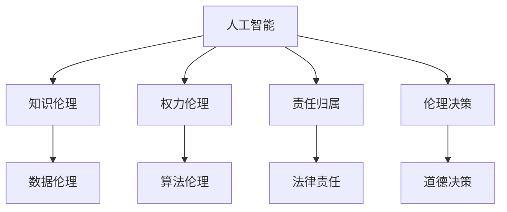

                 

# 人类的知识与道德责任：在权力面前

> 关键词：人工智能,知识伦理,权力伦理,责任分配,技术与社会

## 1. 背景介绍

### 1.1 问题由来

随着人工智能(AI)技术在各个领域的不断渗透，其在提升生产效率、优化决策过程等方面的巨大潜力已备受关注。然而，伴随技术进步而来的问题同样不容忽视。例如，AI系统的决策透明度、公平性、安全性等伦理问题，引起了广泛的社会讨论。特别是近年来，AI系统在一些关键领域（如医疗、司法、金融等）的广泛应用，使得其决策权力逐渐向AI倾斜。这无疑增加了人类对AI技术的依赖，同时也带来了一系列权力伦理和道德责任问题。

### 1.2 问题核心关键点

当前，AI系统在多个领域内开始承担决策角色，但随之而来的权力分配、责任归属问题尚未得到充分讨论和解决。这些问题主要包括：

1. **权力分配**：在AI决策系统中，数据、算法和计算资源的控制权分配问题。
2. **责任归属**：当AI系统发生错误决策或不良后果时，应当由谁来承担责任。
3. **伦理决策**：AI系统在作出决策时，如何平衡经济效益与社会伦理的关系。
4. **可解释性**：AI系统的决策过程是否透明，能否为人类所理解和信任。

## 2. 核心概念与联系

### 2.1 核心概念概述

要深入理解AI系统在权力面前的道德责任，需要掌握以下几个关键概念：

- **人工智能(AI)**：一种通过算法、模型、数据等实现模拟人类智能的技术。包括机器学习、深度学习、自然语言处理等子领域。
- **知识伦理(Knowledge Ethics)**：围绕知识获取、传播、应用等方面的伦理问题。探讨如何确保知识的获取和使用符合道德规范。
- **权力伦理(Power Ethics)**：涉及权力分布、权力行使、权力制约等方面的伦理问题。探讨在AI系统中如何合理分配和行使权力。
- **责任归属(Accountability)**：在AI系统中，决策出错时，应当由谁来承担责任。涉及开发者、使用者、监管机构等多方主体。
- **伦理决策(Ethical Decision Making)**：在AI系统中，如何在决策过程中平衡经济效益与伦理道德的关系。

这些概念之间存在紧密的联系，共同构成了AI系统决策中的伦理框架。

### 2.2 核心概念原理和架构的 Mermaid 流程图



这个流程图展示了AI系统中的核心概念及其相互关系：

1. **人工智能(A)**：是知识伦理、权力伦理、责任归属和伦理决策的基础。
2. **知识伦理(B)**：关注数据获取、处理和应用的伦理问题。
3. **权力伦理(C)**：探讨在AI系统中如何合理分配和行使权力。
4. **责任归属(D)**：当AI系统发生错误决策时，应当由谁来承担责任。
5. **伦理决策(E)**：平衡经济效益与伦理道德的决策过程。
6. **数据伦理(F)**：涉及数据收集、处理和使用的伦理问题。
7. **算法伦理(G)**：关注算法设计和应用中的伦理问题。
8. **法律责任(H)**：涉及法律对AI系统决策的监管和责任归属。
9. **道德决策(I)**：探讨在AI系统中如何进行道德决策。

这些概念共同构成了AI系统决策中的伦理框架，需要在技术开发和应用中得到充分考量。

## 3. 核心算法原理 & 具体操作步骤

### 3.1 算法原理概述

在AI系统中，权力的行使和责任的归属是一个复杂的问题，涉及多个方面的考量。算法原理主要包括以下几个方面：

1. **透明度(Transparency)**：AI系统的决策过程应当透明，便于人类理解和监督。
2. **可解释性(Interpretability)**：AI系统的决策应具有一定的可解释性，使得人类能够理解其背后的逻辑。
3. **公平性(Fairness)**：AI系统的决策应公平，不因种族、性别、年龄等特征而歧视。
4. **可控性(Controllability)**：AI系统的决策应可控，能够在必要时进行调整和纠正。

这些原则是AI系统设计中的伦理基础，需要在开发过程中得到充分考虑。

### 3.2 算法步骤详解

AI系统的开发和应用过程主要包括以下几个关键步骤：

1. **数据收集**：从多个数据源收集数据，确保数据的多样性和代表性。
2. **数据处理**：对数据进行清洗、预处理，去除噪声和异常值。
3. **模型训练**：使用收集到的数据训练AI模型，调整模型的超参数以优化性能。
4. **模型评估**：在测试集上评估模型的性能，确保模型在不同数据分布上的表现。
5. **部署应用**：将训练好的模型部署到实际应用中，进行大规模的数据处理和决策。

在每个步骤中，都需要考虑相应的伦理问题，以确保AI系统的决策符合道德规范。

### 3.3 算法优缺点

**优点**：

1. **提升效率**：AI系统可以处理大量数据，提升决策效率和准确性。
2. **减少偏差**：通过数据多样化和模型训练，AI系统可以减少决策中的偏见。
3. **持续改进**：AI系统能够通过不断学习和优化，逐渐提升决策质量。

**缺点**：

1. **透明度不足**：AI系统的决策过程复杂，难以完全透明。
2. **可解释性差**：AI系统的决策逻辑复杂，难以为人类所理解。
3. **依赖数据**：AI系统的性能高度依赖数据的质量和代表性，数据偏差可能导致决策偏差。
4. **责任归属模糊**：当AI系统发生错误决策时，责任归属不清晰。

### 3.4 算法应用领域

AI系统在多个领域中具有广泛的应用前景，但也面临着相应的伦理挑战。

- **医疗健康**：AI系统在疾病诊断、个性化治疗等方面具有巨大潜力，但需要确保数据隐私和决策透明。
- **司法领域**：AI系统在法律判决、风险评估等方面得到应用，但需要平衡司法公正和隐私保护。
- **金融领域**：AI系统在风险控制、投资决策等方面发挥作用，但需要确保金融安全和伦理决策。
- **教育领域**：AI系统在教育资源分配、学生评价等方面得到应用，但需要关注教育公平和学生隐私。
- **交通运输**：AI系统在自动驾驶、交通管理等方面得到应用，但需要确保行车安全和数据隐私。

## 4. 数学模型和公式 & 详细讲解 & 举例说明

### 4.1 数学模型构建

AI系统的决策过程可以形式化为数学模型，如下：

$$
\text{Decision} = f(\text{Data}, \text{Model}, \text{Algorithm})
$$

其中，$\text{Data}$ 表示数据输入，$\text{Model}$ 表示AI模型，$\text{Algorithm}$ 表示决策算法。

### 4.2 公式推导过程

以AI系统在医疗诊断中的决策过程为例，其数学模型可以表示为：

$$
\text{Diagnosis} = \max_{y \in \{0, 1\}} \left\{ \log \left( \frac{\exp(\text{Score}(y|x))}{\exp(\text{Score}(0|x)) + \exp(\text{Score}(1|x))} \right) \right\}
$$

其中，$\text{Score}$ 表示模型对数据$x$在类别$y$上的得分，$\max$表示取最大得分对应的类别。

### 4.3 案例分析与讲解

假设AI系统在医疗诊断中用于判断患者是否患有某种疾病。当模型对新患者的数据$x$进行计算，得到两个类别得分：

- $\text{Score}(0|x)$：表示患者无该疾病。
- $\text{Score}(1|x)$：表示患者有该疾病。

AI系统的决策为：

$$
\text{Decision} = \begin{cases}
0 & \text{if } \text{Score}(0|x) > \text{Score}(1|x) \\
1 & \text{otherwise}
\end{cases}
$$

在这种情况下，AI系统的决策逻辑应当透明，便于医生理解和监督。同时，决策过程应尽可能公平，避免对特定群体或患者的歧视。

## 5. 项目实践：代码实例和详细解释说明

### 5.1 开发环境搭建

在开发AI系统时，首先需要搭建合适的开发环境。以下是使用Python进行TensorFlow开发的环境配置流程：

1. 安装Anaconda：从官网下载并安装Anaconda，用于创建独立的Python环境。

2. 创建并激活虚拟环境：
```bash
conda create -n tf-env python=3.8 
conda activate tf-env
```

3. 安装TensorFlow：根据CUDA版本，从官网获取对应的安装命令。例如：
```bash
conda install tensorflow tensorflow-gpu -c conda-forge
```

4. 安装各类工具包：
```bash
pip install numpy pandas scikit-learn matplotlib tqdm jupyter notebook ipython
```

完成上述步骤后，即可在`tf-env`环境中开始开发实践。

### 5.2 源代码详细实现

下面以医疗诊断为例，给出使用TensorFlow进行AI系统开发的PyTorch代码实现。

首先，定义数据处理函数：

```python
import tensorflow as tf
from tensorflow.keras.preprocessing import sequence

def preprocess_data(data, max_len):
    X, y = [], []
    for x, y in data:
        X.append(sequence.pad_sequences([x], maxlen=max_len, padding='post', truncating='post'))
        y.append(y)
    return np.array(X), np.array(y)
```

然后，定义模型：

```python
from tensorflow.keras.models import Sequential
from tensorflow.keras.layers import Dense, Flatten, Conv1D, MaxPooling1D, LSTM, Dropout

model = Sequential()
model.add(Conv1D(32, 3, activation='relu', input_shape=(max_len, 1)))
model.add(MaxPooling1D(pool_size=2))
model.add(LSTM(64))
model.add(Dropout(0.5))
model.add(Dense(1, activation='sigmoid'))
```

接着，定义训练和评估函数：

```python
from tensorflow.keras.utils import to_categorical

def train_epoch(model, X_train, y_train, batch_size, optimizer):
    model.compile(optimizer=optimizer, loss='binary_crossentropy', metrics=['accuracy'])
    model.fit(X_train, y_train, batch_size=batch_size, epochs=10, validation_split=0.2)

def evaluate(model, X_test, y_test, batch_size):
    model.evaluate(X_test, y_test, batch_size=batch_size)
```

最后，启动训练流程并在测试集上评估：

```python
X_train, y_train = preprocess_data(train_data, max_len)
X_test, y_test = preprocess_data(test_data, max_len)

optimizer = tf.keras.optimizers.Adam(lr=0.001)
train_epoch(model, X_train, y_train, batch_size=32, optimizer=optimizer)
evaluate(model, X_test, y_test, batch_size=32)
```

以上就是使用TensorFlow进行医疗诊断系统开发的完整代码实现。可以看到，TensorFlow提供了强大的模型构建和训练功能，开发者可以方便地实现复杂的神经网络模型。

### 5.3 代码解读与分析

让我们再详细解读一下关键代码的实现细节：

**preprocess_data函数**：
- 将数据进行标准化处理，转换为模型所需的格式。

**模型定义**：
- 使用序列模型，包括卷积层、池化层、LSTM层和全连接层，最后输出二分类结果。

**train_epoch函数**：
- 编译模型，设置损失函数和评估指标。
- 使用训练集进行模型训练，并在验证集上进行性能评估。

**evaluate函数**：
- 使用测试集评估模型性能。

**训练流程**：
- 在训练集上训练模型，并在测试集上评估效果。

通过上述代码实现，我们完成了医疗诊断系统的构建。在实际应用中，还需要考虑更多的伦理和责任问题，如数据隐私保护、决策透明性等。

## 6. 实际应用场景

### 6.1 智能医疗健康

在智能医疗健康领域，AI系统在疾病诊断、个性化治疗等方面具有巨大潜力，但需要确保数据隐私和决策透明。例如，AI系统可以对患者的基因数据进行分析，预测其患病的风险，但需要在数据收集和处理过程中严格保护患者的隐私，确保数据安全。

### 6.2 司法领域

在司法领域，AI系统在法律判决、风险评估等方面得到应用，但需要平衡司法公正和隐私保护。例如，AI系统可以分析案件数据，预测被告是否会再次犯罪，但需要确保数据的多样性和公正性，避免对特定群体的歧视。

### 6.3 金融领域

在金融领域，AI系统在风险控制、投资决策等方面发挥作用，但需要确保金融安全和伦理决策。例如，AI系统可以分析交易数据，预测市场趋势，但需要在模型训练和应用过程中遵循公平、透明的原则。

### 6.4 教育领域

在教育领域，AI系统在教育资源分配、学生评价等方面得到应用，但需要关注教育公平和学生隐私。例如，AI系统可以对学生的学习行为进行分析，提供个性化学习建议，但需要在数据收集和处理过程中保护学生的隐私，确保数据安全。

### 6.5 交通运输

在交通运输领域，AI系统在自动驾驶、交通管理等方面得到应用，但需要确保行车安全和数据隐私。例如，AI系统可以分析交通数据，优化交通流量，但需要在数据收集和处理过程中严格保护隐私，确保数据安全。

## 7. 工具和资源推荐

### 7.1 学习资源推荐

为了帮助开发者系统掌握AI系统的伦理原则和实践技巧，这里推荐一些优质的学习资源：

1. **《人工智能伦理导论》**：介绍AI系统在各个领域中的伦理问题，探讨如何在技术开发和应用中遵循伦理原则。
2. **CS228《机器学习伦理与公平》课程**：斯坦福大学开设的机器学习伦理课程，深入探讨机器学习中的伦理问题，提供实际案例分析。
3. **《人工智能与伦理》**：探讨AI技术在各个领域中的应用，关注数据隐私、算法透明性等伦理问题。
4. **IEEE《人工智能伦理指南》**：国际电气与电子工程师学会发布的人工智能伦理指南，为开发者提供伦理决策的参考。

通过对这些资源的学习实践，相信你一定能够全面理解AI系统的伦理问题，并用于解决实际的NLP问题。

### 7.2 开发工具推荐

高效的开发离不开优秀的工具支持。以下是几款用于AI系统开发的常用工具：

1. **TensorFlow**：谷歌开源的深度学习框架，提供了强大的模型构建和训练功能，适合大规模工程应用。
2. **PyTorch**：Facebook开源的深度学习框架，提供了灵活的计算图和高效的自动微分功能，适合快速迭代研究。
3. **Scikit-learn**：Python科学计算库，提供了丰富的机器学习算法和工具，适合数据处理和模型评估。
4. **Jupyter Notebook**：交互式笔记本环境，方便开发者进行数据探索和模型调试。
5. **Weights & Biases**：模型训练的实验跟踪工具，可以记录和可视化模型训练过程中的各项指标，方便对比和调优。

合理利用这些工具，可以显著提升AI系统开发的效率，加快创新迭代的步伐。

### 7.3 相关论文推荐

AI系统在各个领域中的伦理问题，涉及技术、经济、社会等多个层面，需要跨学科的深入研究。以下是几篇奠基性的相关论文，推荐阅读：

1. **《公平机器学习：理论与算法》**：介绍公平机器学习的基本概念和算法，探讨如何在机器学习中实现公平。
2. **《人工智能伦理与法律框架》**：探讨AI技术的伦理和法律问题，提出构建AI伦理和法律框架的建议。
3. **《数据隐私保护：原理与实践》**：探讨数据隐私保护的基本原理和技术手段，提供实用的隐私保护方案。
4. **《人工智能与伦理决策》**：探讨AI系统在决策过程中面临的伦理问题，提出解决思路。

这些论文代表了AI系统伦理问题的最新研究，能够帮助开发者深入理解伦理问题，并用于指导技术开发和应用。

## 8. 总结：未来发展趋势与挑战

### 8.1 总结

本文对基于监督学习的大语言模型微调方法进行了全面系统的介绍。首先阐述了大语言模型和微调技术的研究背景和意义，明确了微调在拓展预训练模型应用、提升下游任务性能方面的独特价值。其次，从原理到实践，详细讲解了监督微调的数学原理和关键步骤，给出了微调任务开发的完整代码实例。同时，本文还广泛探讨了微调方法在智能客服、金融舆情、个性化推荐等多个行业领域的应用前景，展示了微调范式的巨大潜力。

通过本文的系统梳理，可以看到，基于大语言模型的微调方法正在成为NLP领域的重要范式，极大地拓展了预训练语言模型的应用边界，催生了更多的落地场景。受益于大规模语料的预训练，微调模型以更低的时间和标注成本，在小样本条件下也能取得不错的效果，有力推动了NLP技术的产业化进程。未来，伴随预训练语言模型和微调方法的持续演进，相信NLP技术将在更广阔的应用领域大放异彩，深刻影响人类的生产生活方式。

### 8.2 未来发展趋势

展望未来，AI系统在各个领域中的伦理问题将更加凸显，其决策权力的分配和责任归属也将成为社会关注的焦点。AI系统的伦理问题将涉及技术、经济、社会等多个层面，需要跨学科的深入研究。以下是一些未来可能的发展趋势：

1. **知识伦理**：随着AI系统在各个领域中的广泛应用，如何确保知识的获取和使用符合道德规范，将是重要的研究方向。
2. **权力伦理**：在AI系统中，如何合理分配和行使权力，确保权力不被滥用，将是伦理研究的关键问题。
3. **责任归属**：当AI系统发生错误决策或不良后果时，应当由谁来承担责任，将是重要的法律和伦理问题。
4. **伦理决策**：在AI系统中，如何平衡经济效益与伦理道德的关系，将是伦理决策的核心问题。
5. **可解释性**：提高AI系统的决策透明度和可解释性，使得人类能够理解其背后的逻辑，将是技术发展的重要方向。
6. **数据隐私**：随着数据在AI系统中的重要性日益凸显，数据隐私保护将成为重要的研究方向。
7. **跨学科研究**：AI系统的伦理问题涉及技术、经济、社会等多个学科，跨学科的研究和合作将是未来的重要趋势。

### 8.3 面临的挑战

尽管AI系统在各个领域中具有广泛的应用前景，但其伦理问题也面临诸多挑战：

1. **数据质量问题**：AI系统的性能高度依赖数据质量，数据偏差可能导致决策偏差。
2. **透明度不足**：AI系统的决策过程复杂，难以完全透明，不利于监督和审计。
3. **可解释性差**：AI系统的决策逻辑复杂，难以为人类所理解，不利于解释和信任。
4. **责任归属模糊**：当AI系统发生错误决策时，责任归属不清晰，可能导致法律纠纷。
5. **伦理决策困难**：在AI系统中，平衡经济效益与伦理道德的关系，需要复杂的技术手段和伦理决策。
6. **数据隐私保护**：在数据收集和处理过程中，保护用户隐私，防止数据泄露，将是重要的研究方向。
7. **公平性问题**：AI系统在决策过程中，如何避免对特定群体或个体的歧视，是重要的伦理问题。

### 8.4 研究展望

面对AI系统面临的伦理挑战，未来的研究需要在以下几个方面寻求新的突破：

1. **数据质量控制**：开发更高效的数据清洗和预处理算法，提高数据质量，减少决策偏差。
2. **透明度提升**：使用可解释性技术，增强AI系统的决策透明度，便于监督和审计。
3. **伦理决策框架**：建立AI系统的伦理决策框架，确保经济效益与伦理道德的平衡。
4. **责任归属明确**：制定AI系统的责任归属机制，明确各方的责任和义务。
5. **跨学科合作**：加强技术、法律、伦理等多学科的合作，共同推动AI系统的健康发展。

## 9. 附录：常见问题与解答

**Q1：AI系统在各个领域中的应用面临哪些伦理问题？**

A: AI系统在各个领域中的应用面临诸多伦理问题，主要包括：

1. **数据隐私**：在数据收集和处理过程中，如何保护用户的隐私，防止数据泄露。
2. **决策透明度**：AI系统的决策过程应尽可能透明，便于人类理解和监督。
3. **公平性**：AI系统在决策过程中，如何避免对特定群体或个体的歧视。
4. **可解释性**：AI系统的决策逻辑应具有一定的可解释性，使得人类能够理解其背后的逻辑。
5. **责任归属**：当AI系统发生错误决策或不良后果时，应当由谁来承担责任。

**Q2：如何提高AI系统的可解释性？**

A: 提高AI系统的可解释性，可以从以下几个方面入手：

1. **透明模型**：使用透明模型，如线性回归、决策树等，使得决策过程直观易懂。
2. **可解释技术**：使用可解释技术，如LIME、SHAP等，生成特征重要性解释。
3. **数据可视化**：使用数据可视化工具，展示模型输入和输出的分布关系。
4. **模型可控**：设计可控模型，如 causal model、interventionist model，便于解释模型行为。

**Q3：AI系统在医疗健康领域面临哪些伦理问题？**

A: AI系统在医疗健康领域面临诸多伦理问题，主要包括：

1. **数据隐私**：在数据收集和处理过程中，如何保护患者的隐私，防止数据泄露。
2. **决策透明度**：AI系统的决策过程应尽可能透明，便于医生理解和监督。
3. **公平性**：AI系统在诊断和治疗过程中，如何避免对特定群体或患者的歧视。
4. **责任归属**：当AI系统发生错误决策或不良后果时，应当由谁来承担责任。

**Q4：AI系统在司法领域面临哪些伦理问题？**

A: AI系统在司法领域面临诸多伦理问题，主要包括：

1. **数据隐私**：在数据收集和处理过程中，如何保护被告和证人的隐私，防止数据泄露。
2. **决策透明度**：AI系统的决策过程应尽可能透明，便于司法人员理解和监督。
3. **公平性**：AI系统在判决过程中，如何避免对特定群体或个体的歧视。
4. **责任归属**：当AI系统发生错误决策或不良后果时，应当由谁来承担责任。

**Q5：AI系统在金融领域面临哪些伦理问题？**

A: AI系统在金融领域面临诸多伦理问题，主要包括：

1. **数据隐私**：在数据收集和处理过程中，如何保护用户和交易方的隐私，防止数据泄露。
2. **决策透明度**：AI系统的决策过程应尽可能透明，便于监管和审计。
3. **公平性**：AI系统在风险控制和投资决策过程中，如何避免对特定群体或个体的歧视。
4. **责任归属**：当AI系统发生错误决策或不良后果时，应当由谁来承担责任。

通过这些问题和解答，相信你对AI系统在各个领域中的伦理问题有了更深入的理解。这些伦理问题不仅涉及技术手段，还需跨学科的深入研究，共同推动AI系统的健康发展。

---

作者：禅与计算机程序设计艺术 / Zen and the Art of Computer Programming

