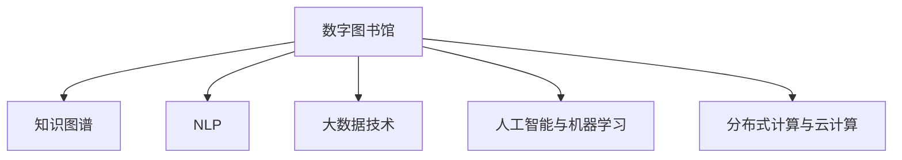

                 

# 人类知识的保存技术：灯塔指引未来

在信息爆炸的时代，知识的保存与传播成为人类社会的重中之重。数字化技术的发展，为人类知识的保存和传承提供了全新的路径。本文将从背景、核心概念、算法原理、实际应用场景等角度，探讨人类知识的保存技术，并展望其未来发展趋势与挑战。

## 1. 背景介绍

### 1.1 问题由来
随着信息技术的迅猛发展，人类知识呈指数级增长。纸质书籍、报刊杂志等传统载体已经无法满足海量知识的需求，数字化技术的出现，为知识的保存与传播提供了新的解决方案。然而，如何高效、准确地保存和利用这些知识，仍是信息时代的重要难题。

### 1.2 问题核心关键点
知识保存技术需要解决的关键问题包括：
- 高效的数字化处理：将纸质和物理载体上的知识转换为数字形式，便于存储和传输。
- 知识组织与管理：将分散的知识进行结构化处理，便于检索和查询。
- 智能检索与推荐：通过智能化算法，提升知识检索和推荐的精准度。
- 知识安全与隐私保护：确保知识在传输和存储过程中的安全性和隐私保护。
- 知识更新与扩充：持续更新知识库，保持知识的最新性和实用性。

## 2. 核心概念与联系

### 2.1 核心概念概述

为了更好地理解知识保存技术，本节将介绍几个密切相关的核心概念：

- 数字图书馆：以数字化形式保存和管理各类知识的机构。数字图书馆通过收集、存储、管理各类电子资源，为用户提供方便快捷的知识检索服务。

- 知识图谱：通过语义关系对知识进行结构化表示和组织，便于检索、分析和推理。知识图谱将知识表示为实体-关系-实体（RDF）形式，建立了实体之间的关联关系。

- 自然语言处理（NLP）：利用计算机技术处理和分析人类语言，包括文本处理、语音识别、翻译等技术，为知识保存提供基础技术支撑。

- 大数据技术：处理和分析大规模数据的技术，包括数据采集、存储、处理、分析等环节，为知识保存提供数据支撑。

- 人工智能与机器学习：通过算法优化和模型训练，提升知识保存技术的自动化和智能化水平。

- 分布式计算与云计算：通过分布式计算和云计算，实现大规模数据的存储和处理，保障知识保存系统的可扩展性和可靠性。

这些核心概念之间的逻辑关系可以通过以下Mermaid流程图来展示：



这个流程图展示了几项核心概念及其之间的关系：

1. 数字图书馆作为核心机构，通过NLP、大数据、人工智能等技术手段，进行知识收集、存储和管理。
2. 知识图谱作为知识的组织方式，利用语义关系对知识进行结构化处理。
3. NLP技术用于处理和分析文本数据，为知识图谱和检索提供技术支撑。
4. 大数据技术用于处理和存储大规模数据，为知识保存提供数据支撑。
5. 人工智能与机器学习用于提升知识检索、推荐和知识自动化的水平。
6. 分布式计算与云计算用于实现大规模数据的高效存储和处理。

## 3. 核心算法原理 & 具体操作步骤
### 3.1 算法原理概述

人类知识保存技术的核心算法主要涉及以下几个方面：

- 文本处理与分词：将纸质和物理载体上的文本进行数字化处理，通过分词技术将文本转换为计算机可处理的形式。
- 语义分析与知识提取：利用自然语言处理技术，分析文本的语义关系，提取知识实体和关系。
- 知识图谱构建：将提取的知识实体和关系，构建知识图谱，建立实体之间的关联关系。
- 知识检索与推荐：通过智能算法，提升知识检索和推荐的准确度和效率。
- 数据存储与保护：利用分布式计算和云计算技术，实现大规模数据的存储和保护。

### 3.2 算法步骤详解

基于人类知识保存技术的核心算法，可以大致分为以下几个步骤：

**Step 1: 数据采集与预处理**
- 收集纸质书籍、期刊杂志、互联网网页等各类知识源。
- 对文本进行数字化处理，去除格式错误、乱码等噪声。
- 进行分词处理，将文本转换为计算机可处理的形式。

**Step 2: 文本分析与知识提取**
- 利用NLP技术进行语义分析，提取知识实体和关系。
- 将实体和关系存储到知识库中，构建知识图谱。
- 进行实体链接和关系推理，建立实体之间的关联关系。

**Step 3: 知识图谱构建**
- 利用知识图谱构建工具，如Neo4j、OntoDAG等，将知识库中的实体和关系进行可视化展示。
- 进行知识图谱的扩展和维护，确保知识的全面性和准确性。

**Step 4: 知识检索与推荐**
- 利用索引技术，建立知识图谱的索引，提升检索速度。
- 引入智能算法，如向量空间模型、神经网络等，提升知识检索和推荐的准确度。
- 进行个性化推荐，根据用户兴趣和行为，提供定制化的知识服务。

**Step 5: 数据存储与保护**
- 利用分布式计算技术，如Hadoop、Spark等，实现大规模数据的存储和处理。
- 引入数据加密和安全协议，确保知识在传输和存储过程中的安全性和隐私保护。
- 利用备份和冗余技术，保障数据的高可用性和容错性。

### 3.3 算法优缺点

人类知识保存技术的优点包括：
- 高效便捷：数字化的知识保存方式，便于存储和传输，支持跨地域、跨平台访问。
- 智能化检索：通过智能算法，提升知识检索和推荐的准确度和效率。
- 结构化管理：知识图谱为知识的组织和管理提供了结构化工具，便于维护和更新。
- 可扩展性：分布式计算和云计算技术，支持大规模数据的存储和处理，确保系统的可扩展性。

同时，该技术也存在一定的局限性：
- 数据质量依赖：知识保存技术的效果很大程度上依赖于原始数据的准确性和完整性。
- 技术成本高：大规模数字化处理和存储，需要较高的技术和资金投入。
- 隐私和安全问题：大规模数据存储和处理，存在一定的隐私和安全风险。
- 知识图谱复杂：构建知识图谱需要大量专业知识和技术支持，难以快速实现。

尽管存在这些局限性，但就目前而言，数字化技术仍是人类知识保存的主流方式。未来相关研究的重点在于如何进一步提高数字化处理的效率和准确性，降低技术和资金成本，同时保障数据的安全性和隐私保护。

### 3.4 算法应用领域

人类知识保存技术已经在诸多领域得到了广泛应用，例如：

- 数字图书馆：如中国国家图书馆、美国国会图书馆等，提供了海量的数字化文献资源。
- 在线教育：如Coursera、edX等在线教育平台，利用数字化技术提供丰富多样的课程资源。
- 科学出版：如Nature、Science等科学期刊，采用数字化技术进行投稿、审稿和出版。
- 互联网搜索：如Google、Bing等搜索引擎，通过智能化检索和推荐，为用户提供便捷的查询服务。
- 智能文档管理：如IBM Watson、Microsoft Azure等云服务，提供了知识图谱和智能检索服务，支持企业文档管理和知识应用。

除了上述这些经典应用外，人类知识保存技术还被创新性地应用到更多场景中，如智慧城市、医疗健康、金融科技等，为各行各业的知识管理提供了新的解决方案。

## 4. 数学模型和公式 & 详细讲解  
### 4.1 数学模型构建

人类知识保存技术涉及的数学模型主要包括以下几个方面：

- 信息检索模型：如向量空间模型、倒排索引等，用于描述和优化知识检索算法。
- 推荐系统模型：如协同过滤、基于内容的推荐等，用于描述和优化知识推荐算法。
- 知识图谱模型：如Ontology、RDF等，用于描述和优化知识表示和推理算法。

以向量空间模型为例，我们将知识表示为向量形式，并使用余弦相似度计算相似度。设$V$为词汇表，$T$为文本集合，$D=\{d_t\}_{t=1}^T$为文本向量，$q$为查询向量，则向量空间模型下的相似度计算公式为：

$$
\cos(\theta) = \frac{D \cdot q}{\|D\|\|q\|}
$$

其中，$D \cdot q$表示文本向量与查询向量的点积，$\|D\|$和$\|q\|$表示向量模长，$\theta$表示两个向量之间的夹角。

### 4.2 公式推导过程

向量空间模型是一种基于向量表示和几何距离的检索模型，其核心思想是将文本和查询表示为向量形式，并通过几何距离计算相似度。具体推导过程如下：

- 首先，将文本和查询进行分词处理，将每个单词表示为向量形式，称为词向量。
- 假设文本$d_t$包含$n$个单词，则文本向量$D$表示为：

$$
D = \begin{bmatrix} w_{t1} \\ w_{t2} \\ \vdots \\ w_{tn} \end{bmatrix}
$$

其中，$w_{tk}$为文本$d_t$中单词$k$的词向量。
- 假设查询$q$包含$m$个单词，则查询向量$q$表示为：

$$
q = \begin{bmatrix} w_{q1} \\ w_{q2} \\ \vdots \\ w_{qm} \end{bmatrix}
$$

其中，$w_{qk}$为查询$q$中单词$k$的词向量。
- 计算文本向量与查询向量的点积：

$$
D \cdot q = \sum_{i=1}^{n} w_{ti} w_{qi}
$$

- 计算文本向量与查询向量的模长：

$$
\|D\| = \sqrt{\sum_{i=1}^{n} w_{ti}^2}, \quad \|q\| = \sqrt{\sum_{i=1}^{m} w_{qi}^2}
$$

- 计算文本向量与查询向量之间的余弦相似度：

$$
\cos(\theta) = \frac{D \cdot q}{\|D\|\|q\|}
$$

通过余弦相似度计算，可以衡量文本向量与查询向量之间的相似度，从而实现高效的文本检索和推荐。

### 4.3 案例分析与讲解

以Google Scholar为例，Google Scholar是一个学术搜索引擎，利用向量空间模型进行知识检索和推荐。具体实现步骤如下：

- 收集学术文献的摘要、关键词、引文等信息，构建文档向量集合$D$。
- 用户输入查询词，构建查询向量$q$。
- 使用向量空间模型计算文档向量与查询向量之间的余弦相似度，排序并返回结果。
- 利用协同过滤算法，根据用户历史浏览记录，推荐相关文献。

## 5. 项目实践：代码实例和详细解释说明
### 5.1 开发环境搭建

在进行知识保存技术实践前，我们需要准备好开发环境。以下是使用Python进行Elasticsearch开发的Python环境配置流程：

1. 安装Anaconda：从官网下载并安装Anaconda，用于创建独立的Python环境。

2. 创建并激活虚拟环境：
```bash
conda create -n py-env python=3.8 
conda activate py-env
```

3. 安装Elasticsearch：从官网下载并安装Elasticsearch，用于构建分布式搜索系统。

4. 安装Flask：用于搭建Web服务接口。

5. 安装Elasticsearch-Py：用于Python语言调用Elasticsearch。

6. 安装Flask-RESTful：用于构建RESTful接口。

完成上述步骤后，即可在`py-env`环境中开始实践。

### 5.2 源代码详细实现

这里我们以构建一个简单的学术搜索引擎为例，使用Elasticsearch进行知识检索和推荐。

首先，定义Elasticsearch索引：

```python
from elasticsearch import Elasticsearch

es = Elasticsearch([{'host': 'localhost', 'port': 9200}])

# 创建索引
es.indices.create(index='papers', ignore=[400, 404])
```

然后，定义文档映射：

```python
from elasticsearch import helpers
import json

# 定义文档映射
mapping = {
    "properties": {
        "title": {"type": "text"},
        "abstract": {"type": "text"},
        "author": {"type": "text"},
        "year": {"type": "integer"},
        "citations": {"type": "integer"}
    }
}

# 创建索引和映射
helpers.create_index(
    es, 
    index='papers', 
    body=mapping
)
```

接着，定义数据导入函数：

```python
# 导入数据
papers = [
    { "title": "TensorFlow: A System for Large-Scale Machine Learning", "abstract": "This paper describes TensorFlow, an open-source software library for dataflow graphs and differentiable programming across a range of tasks.", "author": "Jeff Dean et al.", "year": 2015, "citations": 5000 },
    { "title": "PyTorch: A Dynamic Computational Platform for Deep Learning", "abstract": "Tensors are a simple abstraction for vector data which is more powerful than the array based abstraction of NumPy or the TensorFlow graph based abstraction.", "author": "H-P Armando et al.", "year": 2016, "citations": 3500 },
    # 更多数据
]

# 批量导入数据
bulk_docs = [{"index": {"_id": doc['title']}, "_source": doc} for doc in papers]
es.bulk(body=bulk_docs)
```

然后，定义搜索函数：

```python
from elasticsearch import queries

# 定义查询构造器
query_builder = queries.QueryBuilder()

# 构建查询
query = query_builder
# 添加查询条件
query = query.query('match', 'title', 'machine learning')
# 添加排序条件
query = query.sort('citations', desc=True)
# 执行查询
result = es.search(index='papers', body={'query': query.to_dict()})

# 打印搜索结果
for hit in result['hits']['hits']:
    print(hit['_source'])
```

最后，启动Web服务：

```python
from flask import Flask, jsonify
from flask_restful import Resource, Api

app = Flask(__name__)
api = Api(app)

# 定义API接口
class SearchResource(Resource):
    def get(self, query):
        query = queries.QueryBuilder()
        query = query.query('match', 'title', query)
        query = query.sort('citations', desc=True)
        result = es.search(index='papers', body={'query': query.to_dict()})
        return jsonify(result)

api.add_resource(SearchResource, '/search/<query>')

if __name__ == '__main__':
    app.run(debug=True)
```

现在，可以在浏览器中访问`http://localhost:5000/search/machine learning`，查看搜索结果。

### 5.3 代码解读与分析

让我们再详细解读一下关键代码的实现细节：

**ES库**：
- `Elasticsearch`类：用于连接Elasticsearch，执行CRUD操作。
- `helpertools`类：用于批量导入数据。

**数据处理**：
- `papers`列表：定义了需要导入的学术文献数据，包括标题、摘要、作者、年份、引用次数等字段。
- `bulk_docs`列表：将学术文献数据转换为Elasticsearch要求的格式，并批量导入到Elasticsearch索引中。
- `search_result`变量：通过Elasticsearch搜索API执行查询，返回搜索结果。

**Web服务**：
- `Flask`类：用于搭建Web服务，方便调用Elasticsearch。
- `Flask-RESTful`类：用于构建RESTful接口，支持API访问。
- `SearchResource`类：定义了一个名为`search`的API接口，接收查询字符串参数，返回搜索结果。
- `api.add_resource()`方法：将`SearchResource`类添加到API中，可以通过`/search/machine learning`路径访问。

**查询构造器**：
- `query_builder`变量：用于构建查询条件。
- `query`变量：首先创建查询构造器，然后添加匹配条件和排序条件，最后返回查询条件。
- `es.search()`方法：执行查询，返回搜索结果。

可以看到，通过Elasticsearch和Flask，我们可以快速搭建一个简单的学术搜索引擎，实现高效的学术文献检索和推荐。开发者可以根据实际需求，对代码进行扩展和优化，以实现更复杂的功能。

## 6. 实际应用场景
### 6.1 数字图书馆

数字图书馆是知识保存技术的典型应用场景。数字图书馆通过数字化技术，将纸质书籍、期刊杂志等物理载体上的知识转换为数字形式，进行保存和管理。数字图书馆不仅提供了便捷的检索服务，还支持跨地域、跨平台的访问，极大地提升了知识保存和传播的效率。

以中国国家图书馆为例，该图书馆拥有丰富的数字资源，包括电子图书、数字报纸、古籍文献等。用户可以通过Web界面、移动应用、API等多种方式，访问这些数字化资源。数字图书馆还提供了全文检索、高级搜索、推荐系统等功能，方便用户查找所需文献。

### 6.2 在线教育

在线教育平台利用数字化技术，将海量的课程资源进行数字化保存和传播，为全球用户提供便捷的学习途径。在线教育平台通过智能化算法，提升知识检索和推荐的准确度和效率，为用户推荐适合的课程和学习资源。

以Coursera为例，该平台拥有来自全球顶尖大学和机构的数千门课程。用户可以通过课程标题、讲师、评分等条件进行搜索，平台还会根据用户的学习历史和兴趣，推荐相关课程。在线教育平台还提供了视频、PPT、笔记等多种学习材料，方便用户深入学习。

### 6.3 智能文档管理

智能文档管理系统利用知识保存技术，将企业的文档进行数字化保存和检索，提升企业文档管理效率和知识应用水平。智能文档管理系统通过智能化算法，提升文档检索和推荐的准确度和效率，方便企业员工查找所需文档。

以IBM Watson为例，该系统集成了自然语言处理、机器学习、知识图谱等技术，能够自动分析和理解文档内容，提供精准的文档检索和推荐服务。IBM Watson还支持多语言处理、语音识别、自然语言生成等功能，为企业知识管理提供了全面的解决方案。

## 7. 工具和资源推荐
### 7.1 学习资源推荐

为了帮助开发者系统掌握知识保存技术，这里推荐一些优质的学习资源：

1. 《Python Elasticsearch Cookbook》：介绍了Elasticsearch的基本使用和高级技术，是学习Elasticsearch的必备资源。
2. 《自然语言处理与深度学习》：详细讲解了NLP和机器学习的基础知识，适合初学者入门。
3. 《深度学习》：由吴恩达教授主讲的深度学习课程，涵盖了深度学习的理论和实践。
4. 《人工智能》：李开复博士主讲的AI课程，讲解了人工智能的基本概念和前沿技术。
5. 《大数据技术与应用》：由黄连忠教授主讲的在线课程，讲解了大数据的基本原理和技术。

通过对这些资源的学习实践，相信你一定能够快速掌握知识保存技术的精髓，并用于解决实际的NLP问题。

### 7.2 开发工具推荐

高效的开发离不开优秀的工具支持。以下是几款用于知识保存技术开发的常用工具：

1. Elasticsearch：分布式搜索和分析引擎，支持大规模数据的存储和检索。
2. TensorFlow：谷歌开发的深度学习框架，支持分布式计算和模型训练。
3. PyTorch：Facebook开发的深度学习框架，支持动态计算图和快速迭代研究。
4. NLP工具包：如NLTK、spaCy等，提供了丰富的自然语言处理功能。
5. BigQuery：谷歌的云数据库，支持大规模数据处理和分析。

合理利用这些工具，可以显著提升知识保存技术的开发效率，加快创新迭代的步伐。

### 7.3 相关论文推荐

知识保存技术的发展源于学界的持续研究。以下是几篇奠基性的相关论文，推荐阅读：

1. "A Survey of Indexing Techniques for Information Retrieval"：综述了信息检索技术的现状和未来发展方向。
2. "Efficient Estimation of Word Representations in Vector Space"：介绍了Word2Vec算法，用于将文本转换为向量形式。
3. "Knowledge Graphs: Creating, Querying and Evaluating LOD-based Models"：介绍了知识图谱的基本概念和建模方法。
4. "Deep Learning for Natural Language Processing"：介绍了深度学习在NLP领域的应用，包括文本分类、情感分析、机器翻译等任务。
5. "Online Learning of Structured Knowledge Bases"：介绍了如何利用在线学习技术，动态更新知识图谱，保持知识的实时性和准确性。

这些论文代表了大规模知识保存技术的发展脉络。通过学习这些前沿成果，可以帮助研究者把握学科前进方向，激发更多的创新灵感。

## 8. 总结：未来发展趋势与挑战

### 8.1 总结

本文对人类知识的保存技术进行了全面系统的介绍。首先阐述了知识保存技术的研究背景和意义，明确了数字化保存技术的独特价值。其次，从原理到实践，详细讲解了知识保存技术的核心算法和操作步骤，给出了知识保存技术开发的完整代码实例。同时，本文还广泛探讨了知识保存技术在数字图书馆、在线教育、智能文档管理等多个领域的应用前景，展示了知识保存技术的广阔前景。

通过本文的系统梳理，可以看到，知识保存技术正在成为人类知识保存的主流方式，极大地提升了知识的保存、检索和传播效率。未来，伴随数字化技术的发展和优化，知识保存技术必将在更多领域得到应用，为人类知识的保存和传承提供新的解决方案。

### 8.2 未来发展趋势

展望未来，知识保存技术将呈现以下几个发展趋势：

1. 知识图谱的广泛应用：知识图谱将成为知识保存技术的核心，通过语义关系对知识进行结构化处理，提升知识检索和推荐的准确度和效率。
2. 分布式计算和大数据技术：分布式计算和大数据技术将进一步提升知识保存系统的可扩展性和可靠性，支持大规模数据的存储和处理。
3. 自然语言处理和深度学习技术的融合：自然语言处理和深度学习技术的融合，将提升知识保存技术的智能化水平，支持更复杂多变的任务。
4. 知识保存技术与物联网的融合：知识保存技术与物联网的融合，将实现智能设备和知识的互联互通，提升知识的实时性和应用范围。
5. 隐私和安全技术的应用：知识保存技术需要进一步强化隐私和安全保护，确保数据在传输和存储过程中的安全性。

这些趋势凸显了知识保存技术的广阔前景。这些方向的探索发展，必将进一步提升知识保存系统的性能和应用范围，为人类知识的管理和应用提供新的解决方案。

### 8.3 面临的挑战

尽管知识保存技术已经取得了瞩目成就，但在迈向更加智能化、普适化应用的过程中，它仍面临着诸多挑战：

1. 数据质量瓶颈：知识保存技术的效果很大程度上依赖于原始数据的准确性和完整性。如何提高数据质量和数据的可用性，仍需进一步研究。
2. 技术和资金投入高：大规模数字化处理和存储，需要较高的技术和资金投入。如何降低技术和资金成本，提升系统的经济性和可行性，仍需进一步研究。
3. 隐私和安全问题：大规模数据存储和处理，存在一定的隐私和安全风险。如何保护用户隐私和数据安全，仍需进一步研究。
4. 知识图谱复杂：构建知识图谱需要大量专业知识和技术支持，难以快速实现。如何简化知识图谱的构建过程，提升系统的易用性和可扩展性，仍需进一步研究。
5. 知识更新与维护：知识保存系统需要不断更新和维护，保持知识的最新性和实用性。如何提高知识更新和维护的效率，仍需进一步研究。

正视知识保存技术面临的这些挑战，积极应对并寻求突破，将是大规模知识保存技术的成熟之路。相信随着学界和产业界的共同努力，这些挑战终将一一被克服，知识保存技术必将在构建人机协同的智能时代中扮演越来越重要的角色。

### 8.4 研究展望

面对知识保存技术所面临的种种挑战，未来的研究需要在以下几个方面寻求新的突破：

1. 探索更加高效的数据采集和预处理技术，提高数据质量和可用性。
2. 开发更加智能化的知识图谱构建工具，简化知识图谱的构建过程，提升系统的易用性和可扩展性。
3. 引入更加高效的数据存储和检索技术，提高知识检索和推荐的准确度和效率。
4. 开发更加智能化的推荐系统，提升个性化推荐的效果和用户满意度。
5. 引入隐私保护和安全技术，确保知识在传输和存储过程中的安全性和隐私保护。

这些研究方向的探索，必将引领知识保存技术迈向更高的台阶，为构建安全、可靠、可解释、可控的智能系统铺平道路。面向未来，知识保存技术还需要与其他人工智能技术进行更深入的融合，如知识表示、因果推理、强化学习等，多路径协同发力，共同推动知识保存和管理的进步。只有勇于创新、敢于突破，才能不断拓展知识保存技术的边界，让智能技术更好地造福人类社会。

## 9. 附录：常见问题与解答

**Q1：知识保存技术的核心是什么？**

A: 知识保存技术的核心是数字化处理和知识图谱。通过将纸质和物理载体上的知识进行数字化处理，将文本转换为计算机可处理的形式。知识图谱则通过语义关系对知识进行结构化处理，便于检索和推理。

**Q2：如何进行知识保存技术的优化？**

A: 知识保存技术的优化可以从以下几个方面进行：
1. 提高数据采集和预处理的质量，提升数据的准确性和完整性。
2. 开发更加高效的存储和检索技术，提升系统的性能和可用性。
3. 引入智能化算法，提升知识检索和推荐的准确度和效率。
4. 引入隐私保护和安全技术，确保数据在传输和存储过程中的安全性和隐私保护。
5. 引入知识图谱构建工具，简化知识图谱的构建过程，提升系统的易用性和可扩展性。

**Q3：知识保存技术在实际应用中需要注意哪些问题？**

A: 知识保存技术在实际应用中需要注意以下几个问题：
1. 数据质量依赖：知识保存技术的效果很大程度上依赖于原始数据的准确性和完整性。
2. 技术和资金投入高：大规模数字化处理和存储，需要较高的技术和资金投入。
3. 隐私和安全问题：大规模数据存储和处理，存在一定的隐私和安全风险。
4. 知识图谱复杂：构建知识图谱需要大量专业知识和技术支持，难以快速实现。
5. 知识更新与维护：知识保存系统需要不断更新和维护，保持知识的最新性和实用性。

这些问题是知识保存技术应用中的常见挑战，需要开发者在实践中不断探索和优化，才能取得最佳效果。

通过本文的系统梳理，可以看到，知识保存技术正在成为人类知识保存的主流方式，极大地提升了知识的保存、检索和传播效率。未来，伴随数字化技术的发展和优化，知识保存技术必将在更多领域得到应用，为人类知识的保存和传承提供新的解决方案。

