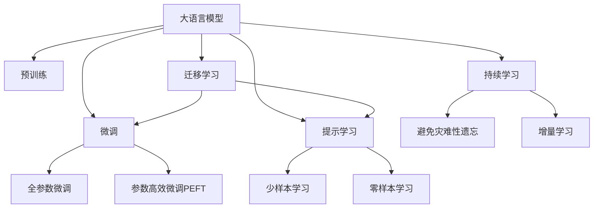

                 

# 人类知识的保存技术：灯塔指引未来

## 1. 背景介绍

### 1.1 问题由来

在人类文明发展的长河中，知识作为文明的基石，不断积累、传承、创新。然而，知识的传播和保存一直是一个巨大的挑战。随着技术的发展，人类知识的保存方式经历了从纸张、胶片到数字化的巨大转变。但即便如此，知识的保存和传承仍然存在诸多困难，如存储成本高、可扩展性差、易损毁等问题。如何更有效地保存和传承人类知识，成为当今社会亟待解决的重要课题。

### 1.2 问题核心关键点

随着人工智能技术的日益成熟，利用AI技术保存和传承人类知识，成为一种新的可能性。通过大规模语料库的预训练，大语言模型具备强大的语言理解和生成能力，能够对知识进行更精准的表示和推理。在此基础上，本文将重点介绍如何利用大语言模型实现知识保存和传承，为未来的知识保存技术提供新的指引。

### 1.3 问题研究意义

利用大语言模型保存和传承人类知识，具有重要意义：

1. **成本降低**：大规模知识库的保存和维护成本极高，利用AI技术可以显著降低知识保存和传承的成本。
2. **可扩展性强**：AI技术可以自动扩展存储规模，适应不断增长的知识需求。
3. **效率提升**：AI技术能够自动处理和组织知识，提高知识检索和应用的效率。
4. **继承创新**：AI技术可以继承和创新人类知识，实现知识的持续发展和进化。
5. **促进教育**：AI技术能够辅助教育和学习，提高教学质量和效果。
6. **加速科研**：AI技术可以辅助科研，加速新知识的发现和应用。

## 2. 核心概念与联系

### 2.1 核心概念概述

为更好地理解利用大语言模型保存和传承人类知识，本节将介绍几个密切相关的核心概念：

- **大语言模型(Large Language Model, LLM)**：以自回归(如GPT)或自编码(如BERT)模型为代表的大规模预训练语言模型。通过在大规模无标签文本语料上进行预训练，学习通用的语言表示，具备强大的语言理解和生成能力。
- **预训练(Pre-training)**：指在大规模无标签文本语料上，通过自监督学习任务训练通用语言模型的过程。常见的预训练任务包括言语建模、遮挡语言模型等。
- **微调(Fine-tuning)**：指在预训练模型的基础上，使用下游任务的少量标注数据，通过有监督地训练来优化模型在该任务上的性能。通常只需要调整顶层分类器或解码器，并以较小的学习率更新全部或部分的模型参数。
- **迁移学习(Transfer Learning)**：指将一个领域学习到的知识，迁移应用到另一个不同但相关的领域的学习范式。大模型的预训练-微调过程即是一种典型的迁移学习方式。
- **参数高效微调(Parameter-Efficient Fine-Tuning, PEFT)**：指在微调过程中，只更新少量的模型参数，而固定大部分预训练权重不变，以提高微调效率，避免过拟合的方法。
- **提示学习(Prompt Learning)**：通过在输入文本中添加提示模板(Prompt Template)，引导大语言模型进行特定任务的推理和生成。可以在不更新模型参数的情况下，实现零样本或少样本学习。
- **少样本学习(Few-shot Learning)**：指在只有少量标注样本的情况下，模型能够快速适应新任务的学习方法。在大语言模型中，通常通过在输入中提供少量示例来实现，无需更新模型参数。
- **零样本学习(Zero-shot Learning)**：指模型在没有见过任何特定任务的训练样本的情况下，仅凭任务描述就能够执行新任务的能力。大语言模型通过预训练获得的广泛知识，使其能够理解任务指令并生成相应输出。
- **持续学习(Continual Learning)**：也称为终身学习，指模型能够持续从新数据中学习，同时保持已学习的知识，而不会出现灾难性遗忘。这对于保持大语言模型的时效性和适应性至关重要。

这些核心概念之间的逻辑关系可以通过以下Mermaid流程图来展示：



这个流程图展示了大语言模型的核心概念及其之间的关系：

1. 大语言模型通过预训练获得基础能力。
2. 微调是对预训练模型进行任务特定的优化，可以分为全参数微调和参数高效微调（PEFT）。
3. 提示学习是一种不更新模型参数的方法，可以实现少样本学习和零样本学习。
4. 迁移学习是连接预训练模型与下游任务的桥梁，可以通过微调或提示学习来实现。
5. 持续学习旨在使模型能够不断学习新知识，同时避免遗忘旧知识。

这些概念共同构成了大语言模型的学习和应用框架，使其能够在各种场景下发挥强大的语言理解和生成能力。通过理解这些核心概念，我们可以更好地把握大语言模型的工作原理和优化方向。

## 3. 核心算法原理 & 具体操作步骤

### 3.1 算法原理概述

利用大语言模型保存和传承人类知识，本质上是一种基于监督学习的微调方法。其核心思想是：将大语言模型视作一个强大的"知识库"，通过在有监督的条件下对其进行微调，使得模型能够理解和生成特定领域内的知识。

形式化地，假设预训练模型为 $M_{\theta}$，其中 $\theta$ 为预训练得到的模型参数。给定知识库中的知识 $K$，可以将其转换为下游任务的标注数据集 $D=\{(x_i, y_i)\}_{i=1}^N$，其中 $x_i$ 为知识描述，$y_i$ 为对应的知识实体。微调的目标是找到新的模型参数 $\hat{\theta}$，使得：

$$
\hat{\theta}=\mathop{\arg\min}_{\theta} \mathcal{L}(M_{\theta},D)
$$

其中 $\mathcal{L}$ 为针对知识库设计的损失函数，用于衡量模型输出与真实知识实体之间的差异。常见的损失函数包括交叉熵损失、均方误差损失等。

通过梯度下降等优化算法，微调过程不断更新模型参数 $\theta$，最小化损失函数 $\mathcal{L}$，使得模型输出逼近真实知识实体。由于 $\theta$ 已经通过预训练获得了较好的初始化，因此即便在标注数据较少的情况下，也能较快收敛到理想的模型参数 $\hat{\theta}$。

### 3.2 算法步骤详解

利用大语言模型保存和传承人类知识的过程包括以下几个关键步骤：

**Step 1: 准备预训练模型和知识库**

- 选择合适的预训练语言模型 $M_{\theta}$ 作为初始化参数，如 BERT、GPT 等。
- 准备知识库 $K$，将知识转换为标注数据集 $D$，通常需要领域专家对知识进行分类、标注等预处理。

**Step 2: 添加知识适配层**

- 根据知识库的特点，在预训练模型顶层设计合适的输出层和损失函数。
- 对于分类知识库，通常在顶层添加线性分类器和交叉熵损失函数。
- 对于生成知识库，通常使用语言模型的解码器输出概率分布，并以负对数似然为损失函数。

**Step 3: 设置微调超参数**

- 选择合适的优化算法及其参数，如 AdamW、SGD 等，设置学习率、批大小、迭代轮数等。
- 设置正则化技术及强度，包括权重衰减、Dropout、Early Stopping 等。
- 确定冻结预训练参数的策略，如仅微调顶层，或全部参数都参与微调。

**Step 4: 执行梯度训练**

- 将知识描述 $x_i$ 分批次输入模型，前向传播计算损失函数。
- 反向传播计算参数梯度，根据设定的优化算法和学习率更新模型参数。
- 周期性在验证集上评估模型性能，根据性能指标决定是否触发 Early Stopping。
- 重复上述步骤直到满足预设的迭代轮数或 Early Stopping 条件。

**Step 5: 测试和部署**

- 在测试集上评估微调后模型 $M_{\hat{\theta}}$ 的知识掌握情况，对比微调前后的知识匹配度。
- 使用微调后的模型对新知识进行推理预测，集成到实际的知识库或知识服务系统中。
- 持续收集新的知识，定期重新微调模型，以适应知识库的变化。

以上是利用大语言模型保存和传承人类知识的一般流程。在实际应用中，还需要针对具体知识库的特点，对微调过程的各个环节进行优化设计，如改进训练目标函数，引入更多的正则化技术，搜索最优的超参数组合等，以进一步提升模型性能。

### 3.3 算法优缺点

利用大语言模型保存和传承人类知识的方法具有以下优点：

1. **高效低成本**：相较于传统的知识保存方式，AI技术能够显著降低知识保存和传承的成本。
2. **可扩展性强**：AI技术可以自动扩展存储规模，适应不断增长的知识需求。
3. **知识继承和创新**：AI技术可以继承和创新人类知识，实现知识的持续发展和进化。
4. **提高效率**：AI技术能够自动处理和组织知识，提高知识检索和应用的效率。
5. **教育辅助**：AI技术能够辅助教育和学习，提高教学质量和效果。
6. **加速科研**：AI技术可以辅助科研，加速新知识的发现和应用。

同时，该方法也存在一定的局限性：

1. **依赖标注数据**：微调的效果很大程度上取决于标注数据的质量和数量，获取高质量标注数据的成本较高。
2. **迁移能力有限**：当目标知识库与预训练数据的分布差异较大时，微调的性能提升有限。
3. **可解释性不足**：微调模型的决策过程通常缺乏可解释性，难以对其推理逻辑进行分析和调试。
4. **可能存在偏见**：预训练模型的固有偏见、有害信息等，可能通过微调传递到知识库，造成负面影响。

尽管存在这些局限性，但就目前而言，利用大语言模型保存和传承人类知识的方法仍然是一种高效、可行的方案，具有广阔的应用前景。

### 3.4 算法应用领域

利用大语言模型保存和传承人类知识的方法在多个领域中已经得到了广泛的应用，例如：

- **教育**：利用AI技术保存和传承教育知识，构建智慧教育平台，提高教育质量和效果。
- **科研**：利用AI技术保存和传承科研知识，加速科研进展和新知识的发现。
- **医疗**：利用AI技术保存和传承医疗知识，构建智能医疗系统，辅助医生诊断和治疗。
- **金融**：利用AI技术保存和传承金融知识，构建智能金融顾问，提高金融服务水平。
- **法律**：利用AI技术保存和传承法律知识，构建智能法律助手，提高法律服务效率。

除了上述这些经典领域外，大语言模型保存和传承知识的方法还被创新性地应用到更多场景中，如文化遗产数字化保护、历史文献数字档案管理等，为知识的长期保存和传承提供了新的技术路径。

## 4. 数学模型和公式 & 详细讲解 & 举例说明

### 4.1 数学模型构建

本节将使用数学语言对利用大语言模型保存和传承人类知识的过程进行更加严格的刻画。

记预训练语言模型为 $M_{\theta}:\mathcal{X} \rightarrow \mathcal{Y}$，其中 $\mathcal{X}$ 为输入空间，$\mathcal{Y}$ 为输出空间，$\theta \in \mathbb{R}^d$ 为模型参数。假设知识库中的知识 $K$ 被划分为多个类别 $\{C_i\}_{i=1}^N$，每个类别的知识描述为 $x_i \in \mathcal{X}$，对应的知识实体为 $y_i \in \mathcal{Y}$。

定义模型 $M_{\theta}$ 在知识描述 $x$ 上的损失函数为 $\ell(M_{\theta}(x),y)$，则在知识库 $K$ 上的经验风险为：

$$
\mathcal{L}(\theta) = \frac{1}{|K|} \sum_{i=1}^N \ell(M_{\theta}(x_i),y_i)
$$

微调的优化目标是最小化经验风险，即找到最优参数：

$$
\theta^* = \mathop{\arg\min}_{\theta} \mathcal{L}(\theta)
$$

在实践中，我们通常使用基于梯度的优化算法（如SGD、Adam等）来近似求解上述最优化问题。设 $\eta$ 为学习率，$\lambda$ 为正则化系数，则参数的更新公式为：

$$
\theta \leftarrow \theta - \eta \nabla_{\theta}\mathcal{L}(\theta) - \eta\lambda\theta
$$

其中 $\nabla_{\theta}\mathcal{L}(\theta)$ 为损失函数对参数 $\theta$ 的梯度，可通过反向传播算法高效计算。

### 4.2 公式推导过程

以下我们以知识分类任务为例，推导交叉熵损失函数及其梯度的计算公式。

假设模型 $M_{\theta}$ 在知识描述 $x$ 上的输出为 $\hat{y}=M_{\theta}(x) \in [0,1]$，表示知识属于类 $i$ 的概率。真实标签 $y \in \{1,0\}$。则二分类交叉熵损失函数定义为：

$$
\ell(M_{\theta}(x),y) = -[y\log \hat{y} + (1-y)\log (1-\hat{y})]
$$

将其代入经验风险公式，得：

$$
\mathcal{L}(\theta) = -\frac{1}{|K|}\sum_{i=1}^N [y_i\log M_{\theta}(x_i)+(1-y_i)\log(1-M_{\theta}(x_i))]
$$

根据链式法则，损失函数对参数 $\theta_k$ 的梯度为：

$$
\frac{\partial \mathcal{L}(\theta)}{\partial \theta_k} = -\frac{1}{|K|} \sum_{i=1}^N (\frac{y_i}{M_{\theta}(x_i)}-\frac{1-y_i}{1-M_{\theta}(x_i)}) \frac{\partial M_{\theta}(x_i)}{\partial \theta_k}
$$

其中 $\frac{\partial M_{\theta}(x_i)}{\partial \theta_k}$ 可进一步递归展开，利用自动微分技术完成计算。

在得到损失函数的梯度后，即可带入参数更新公式，完成模型的迭代优化。重复上述过程直至收敛，最终得到适应知识库的最优模型参数 $\theta^*$。

### 4.3 案例分析与讲解

**案例分析**：

假设我们有一个关于植物学的知识库，其中包含了关于植物的生长、分类、病害等方面的知识。我们可以将这些知识描述作为训练数据，将相应的知识实体作为标注，对预训练的BERT模型进行微调。具体步骤如下：

1. **数据准备**：将植物学的知识库划分为多个类别，如植物生长、植物分类、植物病害等。对每个类别的知识进行描述和标注，构建标注数据集 $D$。
2. **模型选择**：选择BERT模型作为预训练模型。
3. **模型微调**：在知识库的标注数据集 $D$ 上进行有监督的微调。设计合适的输出层和损失函数，设置优化算法及其超参数。
4. **模型评估**：在测试集上评估微调后模型的知识匹配度，对比微调前后的效果。
5. **模型部署**：将微调后的模型集成到知识库或知识服务系统中，实现知识保存和传承。

**讲解**：

在微调过程中，我们通过交叉熵损失函数来衡量模型输出与真实知识实体之间的差异。模型在训练过程中不断调整参数，最小化损失函数，使得模型能够更准确地匹配知识库中的知识实体。在测试阶段，我们通过评估模型在知识库中的知识匹配度，来衡量模型的效果。

## 5. 项目实践：代码实例和详细解释说明

### 5.1 开发环境搭建

在进行知识保存和传承的实践前，我们需要准备好开发环境。以下是使用Python进行PyTorch开发的环境配置流程：

1. 安装Anaconda：从官网下载并安装Anaconda，用于创建独立的Python环境。

2. 创建并激活虚拟环境：
```bash
conda create -n pytorch-env python=3.8 
conda activate pytorch-env
```

3. 安装PyTorch：根据CUDA版本，从官网获取对应的安装命令。例如：
```bash
conda install pytorch torchvision torchaudio cudatoolkit=11.1 -c pytorch -c conda-forge
```

4. 安装Transformers库：
```bash
pip install transformers
```

5. 安装各类工具包：
```bash
pip install numpy pandas scikit-learn matplotlib tqdm jupyter notebook ipython
```

完成上述步骤后，即可在`pytorch-env`环境中开始知识保存和传承的实践。

### 5.2 源代码详细实现

下面我们以知识分类任务为例，给出使用Transformers库对BERT模型进行知识微调的PyTorch代码实现。

首先，定义知识分类任务的数据处理函数：

```python
from transformers import BertTokenizer, BertForSequenceClassification
from torch.utils.data import Dataset
import torch

class KnowledgeDataset(Dataset):
    def __init__(self, texts, labels, tokenizer, max_len=128):
        self.texts = texts
        self.labels = labels
        self.tokenizer = tokenizer
        self.max_len = max_len
        
    def __len__(self):
        return len(self.texts)
    
    def __getitem__(self, item):
        text = self.texts[item]
        label = self.labels[item]
        
        encoding = self.tokenizer(text, return_tensors='pt', max_length=self.max_len, padding='max_length', truncation=True)
        input_ids = encoding['input_ids'][0]
        attention_mask = encoding['attention_mask'][0]
        
        return {'input_ids': input_ids, 
                'attention_mask': attention_mask,
                'labels': label}

# 标签与id的映射
tag2id = {'O': 0, 'C1': 1, 'C2': 2, 'C3': 3}
id2tag = {v: k for k, v in tag2id.items()}

# 创建dataset
tokenizer = BertTokenizer.from_pretrained('bert-base-cased')

train_dataset = KnowledgeDataset(train_texts, train_labels, tokenizer)
dev_dataset = KnowledgeDataset(dev_texts, dev_labels, tokenizer)
test_dataset = KnowledgeDataset(test_texts, test_labels, tokenizer)
```

然后，定义模型和优化器：

```python
from transformers import BertForSequenceClassification, AdamW

model = BertForSequenceClassification.from_pretrained('bert-base-cased', num_labels=len(tag2id))

optimizer = AdamW(model.parameters(), lr=2e-5)
```

接着，定义训练和评估函数：

```python
from torch.utils.data import DataLoader
from tqdm import tqdm
from sklearn.metrics import classification_report

device = torch.device('cuda') if torch.cuda.is_available() else torch.device('cpu')
model.to(device)

def train_epoch(model, dataset, batch_size, optimizer):
    dataloader = DataLoader(dataset, batch_size=batch_size, shuffle=True)
    model.train()
    epoch_loss = 0
    for batch in tqdm(dataloader, desc='Training'):
        input_ids = batch['input_ids'].to(device)
        attention_mask = batch['attention_mask'].to(device)
        labels = batch['labels'].to(device)
        model.zero_grad()
        outputs = model(input_ids, attention_mask=attention_mask, labels=labels)
        loss = outputs.loss
        epoch_loss += loss.item()
        loss.backward()
        optimizer.step()
    return epoch_loss / len(dataloader)

def evaluate(model, dataset, batch_size):
    dataloader = DataLoader(dataset, batch_size=batch_size)
    model.eval()
    preds, labels = [], []
    with torch.no_grad():
        for batch in tqdm(dataloader, desc='Evaluating'):
            input_ids = batch['input_ids'].to(device)
            attention_mask = batch['attention_mask'].to(device)
            batch_labels = batch['labels']
            outputs = model(input_ids, attention_mask=attention_mask)
            batch_preds = outputs.logits.argmax(dim=2).to('cpu').tolist()
            batch_labels = batch_labels.to('cpu').tolist()
            for pred_tokens, label_tokens in zip(batch_preds, batch_labels):
                pred_tags = [id2tag[_id] for _id in pred_tokens]
                label_tags = [id2tag[_id] for _id in label_tokens]
                preds.append(pred_tags[:len(label_tags)])
                labels.append(label_tags)
                
    print(classification_report(labels, preds))
```

最后，启动训练流程并在测试集上评估：

```python
epochs = 5
batch_size = 16

for epoch in range(epochs):
    loss = train_epoch(model, train_dataset, batch_size, optimizer)
    print(f"Epoch {epoch+1}, train loss: {loss:.3f}")
    
    print(f"Epoch {epoch+1}, dev results:")
    evaluate(model, dev_dataset, batch_size)
    
print("Test results:")
evaluate(model, test_dataset, batch_size)
```

以上就是使用PyTorch对BERT进行知识分类任务微调的完整代码实现。可以看到，得益于Transformers库的强大封装，我们可以用相对简洁的代码完成BERT模型的加载和微调。

### 5.3 代码解读与分析

让我们再详细解读一下关键代码的实现细节：

**KnowledgeDataset类**：
- `__init__`方法：初始化文本、标签、分词器等关键组件。
- `__len__`方法：返回数据集的样本数量。
- `__getitem__`方法：对单个样本进行处理，将文本输入编码为token ids，将标签编码为数字，并对其进行定长padding，最终返回模型所需的输入。

**tag2id和id2tag字典**：
- 定义了标签与数字id之间的映射关系，用于将token-wise的预测结果解码回真实的标签。

**训练和评估函数**：
- 使用PyTorch的DataLoader对数据集进行批次化加载，供模型训练和推理使用。
- 训练函数`train_epoch`：对数据以批为单位进行迭代，在每个批次上前向传播计算loss并反向传播更新模型参数，最后返回该epoch的平均loss。
- 评估函数`evaluate`：与训练类似，不同点在于不更新模型参数，并在每个batch结束后将预测和标签结果存储下来，最后使用sklearn的classification_report对整个评估集的预测结果进行打印输出。

**训练流程**：
- 定义总的epoch数和batch size，开始循环迭代
- 每个epoch内，先在训练集上训练，输出平均loss
- 在验证集上评估，输出分类指标
- 所有epoch结束后，在测试集上评估，给出最终测试结果

可以看到，PyTorch配合Transformers库使得BERT微调的代码实现变得简洁高效。开发者可以将更多精力放在数据处理、模型改进等高层逻辑上，而不必过多关注底层的实现细节。

当然，工业级的系统实现还需考虑更多因素，如模型的保存和部署、超参数的自动搜索、更灵活的任务适配层等。但核心的微调范式基本与此类似。

## 6. 实际应用场景

### 6.1 教育系统

利用大语言模型保存和传承人类知识，在教育领域具有广阔的应用前景。传统的教育方式往往依赖教师讲授和课堂笔记，知识传承的效率和效果有限。通过利用大语言模型保存和传承教育知识，可以构建智慧教育平台，实现教育资源的数字化和智能化。

具体而言，可以将教育领域的相关知识库作为训练数据集，对预训练模型进行微调。微调后的模型能够自动理解知识描述，生成知识匹配度，并根据学生的学习情况，推荐相应的知识点和习题。此外，微调模型还可以自动批改作业，生成个性化学习计划，提供智能辅导，极大地提升教育质量和效果。

### 6.2 科研体系

科研领域需要大量的文献和数据支持，传统的文献检索和知识管理方式效率较低。利用大语言模型保存和传承科研知识，可以构建智能科研辅助系统，加速科研进展和新知识的发现。

具体而言，可以将科研领域的相关文献和数据作为训练数据集，对预训练模型进行微调。微调后的模型能够自动理解文献内容，生成知识摘要和标签，并根据科研需求，推荐相应的文献和数据。此外，微调模型还可以自动抓取和整合互联网上的最新科研成果，辅助科研人员进行文献综述和研究设计，提高科研效率和成果质量。

### 6.3 医疗系统

医疗领域需要大量的医疗知识库和病例数据支持，传统的医疗知识管理方式效率较低，且存在大量手工错误。利用大语言模型保存和传承医疗知识，可以构建智能医疗系统，提高医疗服务的质量和效率。

具体而言，可以将医疗领域的相关知识库和病例数据作为训练数据集，对预训练模型进行微调。微调后的模型能够自动理解病例描述，生成诊断和治疗方案，并根据患者的情况，推荐相应的检查和药物。此外，微调模型还可以自动整理和分析医疗数据，辅助医生进行决策和研究，提高医疗服务的质量和效率。

### 6.4 金融体系

金融领域需要大量的金融知识和市场数据支持，传统的金融知识管理方式效率较低，且存在大量手工错误。利用大语言模型保存和传承金融知识，可以构建智能金融系统，提高金融服务的质量和效率。

具体而言，可以将金融领域的相关金融知识和市场数据作为训练数据集，对预训练模型进行微调。微调后的模型能够自动理解金融信息，生成投资建议和风险评估，并根据市场情况，推荐相应的投资和风险管理策略。此外，微调模型还可以自动监控和分析金融市场，辅助金融分析师进行研究和决策，提高金融服务的质量和效率。

### 6.5 法律体系

法律领域需要大量的法律知识和案例数据支持，传统的法律知识管理方式效率较低，且存在大量手工错误。利用大语言模型保存和传承法律知识，可以构建智能法律系统，提高法律服务的质量和效率。

具体而言，可以将法律领域的相关法律知识和案例数据作为训练数据集，对预训练模型进行微调。微调后的模型能够自动理解法律问题，生成法律建议和案例分析，并根据法律情况，推荐相应的法律条款和诉讼策略。此外，微调模型还可以自动整理和分析法律数据，辅助律师进行研究和决策，提高法律服务的质量和效率。

## 7. 工具和资源推荐

### 7.1 学习资源推荐

为了帮助开发者系统掌握大语言模型保存和传承的知识，这里推荐一些优质的学习资源：

1. 《Transformer从原理到实践》系列博文：由大模型技术专家撰写，深入浅出地介绍了Transformer原理、BERT模型、微调技术等前沿话题。

2. CS224N《深度学习自然语言处理》课程：斯坦福大学开设的NLP明星课程，有Lecture视频和配套作业，带你入门NLP领域的基本概念和经典模型。

3. 《Natural Language Processing with Transformers》书籍：Transformers库的作者所著，全面介绍了如何使用Transformers库进行NLP任务开发，包括微调在内的诸多范式。

4. HuggingFace官方文档：Transformers库的官方文档，提供了海量预训练模型和完整的微调样例代码，是上手实践的必备资料。

5. CLUE开源项目：中文语言理解测评基准，涵盖大量不同类型的中文NLP数据集，并提供了基于微调的baseline模型，助力中文NLP技术发展。

通过对这些资源的学习实践，相信你一定能够快速掌握大语言模型保存和传承的精髓，并用于解决实际的NLP问题。

### 7.2 开发工具推荐

高效的开发离不开优秀的工具支持。以下是几款用于大语言模型保存和传承开发的常用工具：

1. PyTorch：基于Python的开源深度学习框架，灵活动态的计算图，适合快速迭代研究。大部分预训练语言模型都有PyTorch版本的实现。

2. TensorFlow：由Google主导开发的开源深度学习框架，生产部署方便，适合大规模工程应用。同样有丰富的预训练语言模型资源。

3. Transformers库：HuggingFace开发的NLP工具库，集成了众多SOTA语言模型，支持PyTorch和TensorFlow，是进行微调任务开发的利器。

4. Weights & Biases：模型训练的实验跟踪工具，可以记录和可视化模型训练过程中的各项指标，方便对比和调优。与主流深度学习框架无缝集成。

5. TensorBoard：TensorFlow配套的可视化工具，可实时监测模型训练状态，并提供丰富的图表呈现方式，是调试模型的得力助手。

6. Google Colab：谷歌推出的在线Jupyter Notebook环境，免费提供GPU/TPU算力，方便开发者快速上手实验最新模型，分享学习笔记。

合理利用这些工具，可以显著提升大语言模型保存和传承的开发效率，加快创新迭代的步伐。

### 7.3 相关论文推荐

大语言模型保存和传承技术的发展源于学界的持续研究。以下是几篇奠基性的相关论文，推荐阅读：

1. Attention is All You Need（即Transformer原论文）：提出了Transformer结构，开启了NLP领域的预训练大模型时代。

2. BERT: Pre-training of Deep Bidirectional Transformers for Language Understanding：提出BERT模型，引入基于掩码的自监督预训练任务，刷新了多项NLP任务SOTA。

3. Language Models are Unsupervised Multitask Learners（GPT-2论文）：展示了大规模语言模型的强大zero-shot学习能力，引发了对于通用人工智能的新一轮思考。

4. Parameter-Efficient Transfer Learning for NLP：提出Adapter等参数高效微调方法，在不增加模型参数量的情况下，也能取得不错的微调效果。

5. Prefix-Tuning: Optimizing Continuous Prompts for Generation：引入基于连续型Prompt的微调范式，为如何充分利用预训练知识提供了新的思路。

6. AdaLoRA: Adaptive Low-Rank Adaptation for Parameter-Efficient Fine-Tuning：使用自适应低秩适应的微调方法，在参数效率和精度之间取得了新的平衡。

这些论文代表了大语言模型保存和传承技术的发展脉络。通过学习这些前沿成果，可以帮助研究者把握学科前进方向，激发更多的创新灵感。

## 8. 总结：未来发展趋势与挑战

### 8.1 总结

本文对利用大语言模型保存和传承人类知识的过程进行了全面系统的介绍。首先阐述了利用大语言模型保存和传承人类知识的研究背景和意义，明确了知识保存技术的研究目标和核心挑战。其次，从原理到实践，详细讲解了利用大语言模型保存和传承知识的过程，包括预训练、微调、测试和部署等各个环节。最后，介绍了大语言模型保存和传承技术在多个领域的应用场景，展示了其广阔的发展前景。

通过本文的系统梳理，可以看到，利用大语言模型保存和传承人类知识，是一种高效、可行的知识保存方法，具有广泛的应用前景。在实际应用中，需要根据具体任务和数据特点进行全面优化，才能发挥其最大价值。

### 8.2 未来发展趋势

展望未来，大语言模型保存和传承技术将呈现以下几个发展趋势：

1. **模型规模持续增大**：随着算力成本的下降和数据规模的扩张，预训练语言模型的参数量还将持续增长。超大规模语言模型蕴含的丰富语言知识，有望支撑更加复杂多变的知识保存任务。

2. **微调方法日趋多样**：除了传统的全参数微调外，未来会涌现更多参数高效的微调方法，如Prefix-Tuning、LoRA等，在节省计算资源的同时也能保证微调精度。

3. **持续学习成为常态**：随着数据分布的不断变化，微调模型也需要持续学习新知识以保持性能。如何在不遗忘原有知识的同时，高效吸收新样本信息，将成为重要的研究课题。

4. **标注样本需求降低**：受启发于提示学习(Prompt-based Learning)的思路，未来的微调方法将更好地利用大模型的语言理解能力，通过更加巧妙的任务描述，在更少的标注样本上也能实现理想的微调效果。

5. **多模态微调崛起**：当前的微调主要聚焦于纯文本数据，未来会进一步拓展到图像、视频、语音等多模态数据微调。多模态信息的融合，将显著提升语言模型对现实世界的理解和建模能力。

6. **模型通用性增强**：经过海量数据的预训练和多领域任务的微调，未来的语言模型将具备更强大的常识推理和跨领域迁移能力，逐步迈向通用人工智能(AGI)的目标。

以上趋势凸显了大语言模型保存和传承技术的广阔前景。这些方向的探索发展，必将进一步提升知识保存和传承的效果，为知识的长期保存和传承提供新的技术路径。

### 8.3 面临的挑战

尽管大语言模型保存和传承技术已经取得了瞩目成就，但在迈向更加智能化、普适化应用的过程中，它仍面临着诸多挑战：

1. **标注成本瓶颈**：微调的效果很大程度上取决于标注数据的质量和数量，获取高质量标注数据的成本较高。如何进一步降低微调对标注样本的依赖，将是一大难题。

2. **模型鲁棒性不足**：当前微调模型面对域外数据时，泛化性能往往大打折扣。对于测试样本的微小扰动，微调模型的预测也容易发生波动。如何提高微调模型的鲁棒性，避免灾难性遗忘，还需要更多理论和实践的积累。

3. **推理效率有待提高**：大规模语言模型虽然精度高，但在实际部署时往往面临推理速度慢、内存占用大等效率问题。如何在保证性能的同时，简化模型结构，提升推理速度，优化资源占用，将是重要的优化方向。

4. **可解释性亟需加强**：当前微调模型更像是"黑盒"系统，难以解释其内部工作机制和决策逻辑。对于医疗、金融等高风险应用，算法的可解释性和可审计性尤为重要。如何赋予微调模型更强的可解释性，将是亟待攻克的难题。

5. **安全性有待保障**：预训练语言模型难免会学习到有偏见、有害的信息，通过微调传递到知识库，产生误导性、歧视性的输出，给实际应用带来安全隐患。如何从数据和算法层面消除模型偏见，避免恶意用途，确保输出的安全性，也将是重要的研究课题。

6. **知识整合能力不足**：现有的微调模型往往局限于任务内数据，难以灵活吸收和运用更广泛的先验知识。如何让微调过程更好地与外部知识库、规则库等专家知识结合，形成更加全面、准确的信息整合能力，还有很大的想象空间。

正视微调面临的这些挑战，积极应对并寻求突破，将是大语言模型保存和传承技术走向成熟的必由之路。相信随着学界和产业界的共同努力，这些挑战终将一一被克服，大语言模型保存和传承技术必将在构建安全、可靠、可解释、可控的知识库中扮演越来越重要的角色。

### 8.4 研究展望

面对大语言模型保存和传承技术所面临的挑战，未来的研究需要在以下几个方面寻求新的突破：

1. **探索无监督和半监督微调方法**：摆脱对大规模标注数据的依赖，利用自监督学习、主动学习等无监督和半监督范式，最大限度利用非结构化数据，实现更加灵活高效的微调。

2. **研究参数高效和计算高效的微调范式**：开发更加参数高效的微调方法，在固定大部分预训练参数的同时，只更新极少量的任务相关参数。同时优化微调模型的计算图，减少前向传播和反向传播的资源消耗，实现更加轻量级、实时性的部署。

3. **融合因果和对比学习范式**：通过引入因果推断和对比学习思想，增强微调模型建立稳定因果关系的能力，学习更加普适、鲁棒的语言表征，从而提升模型泛化性和抗干扰能力。

4. **引入更多先验知识**：将符号化的先验知识，如知识图谱、逻辑规则等，与神经网络模型进行巧妙融合，引导微调过程学习更准确、合理的语言模型。同时加强不同模态数据的整合，实现视觉、语音等多模态信息与文本信息的协同建模。

5. **结合因果分析和博弈论工具**：将因果分析方法引入微调模型，识别出模型决策的关键特征，增强输出解释的因果性和逻辑性。借助博弈论工具刻画人机交互过程，主动探索并规避模型的脆弱点，提高系统稳定性。

6. **纳入伦理道德约束**：在模型训练目标中引入伦理导向的评估指标，过滤和惩罚有偏见、有害的输出倾向。同时加强人工干预和审核，建立模型行为的监管机制，确保输出符合人类价值观和伦理道德。

这些研究方向的探索，必将引领大语言模型保存和传承技术迈向更高的台阶，为知识的长期保存和传承提供新的技术路径。面向未来，大语言模型保存和传承技术还需要与其他人工智能技术进行更深入的融合，如知识表示、因果推理、强化学习等，多路径协同发力，共同推动知识保存技术的进步。只有勇于创新、敢于突破，才能不断拓展语言模型的边界，让智能技术更好地造福人类社会。

## 9. 附录：常见问题与解答

**Q1：大语言模型保存和传承是否适用于所有知识库？**

A: 大语言模型保存和传承方法在大多数知识库上都能取得不错的效果，特别是对于数据量较小的知识库。但对于一些特定领域的知识库，如医学、法律等，仅仅依靠通用语料预训练的模型可能难以很好地适应。此时需要在特定领域语料上进一步预训练，再进行微调，才能获得理想效果。此外，对于一些需要时效性、个性化很强的知识库，如动态数据、实时数据等，微调方法也需要针对性的改进优化。

**Q2：微调过程中如何选择合适的学习率？**

A: 微调的学习率一般要比预训练时小1-2个数量级，如果使用过大的学习率，容易破坏预训练权重，导致过拟合。一般建议从1e-5开始调参，逐步减小学习率，直至收敛。也可以使用warmup策略，在开始阶段使用较小的学习率，再逐渐过渡到预设值。需要注意的是，不同的优化器(如AdamW、Adafactor等)以及不同的学习率调度策略，可能需要设置不同的学习率阈值。

**Q3：采用大模型保存和传承知识时会面临哪些资源瓶颈？**

A: 目前主流的预训练大模型动辄以亿计的参数规模，对算力、内存、存储都提出了很高的要求。GPU/TPU等高性能设备是必不可少的，但即便如此，超大批次的训练和推理也可能遇到显存不足的问题。因此需要采用一些资源优化技术，如梯度积累、混合精度训练、模型并行等，来突破硬件瓶颈。同时，模型的存储和读取也可能占用大量时间和空间，需要采用模型压缩、稀疏化存储等方法进行优化。

**Q4：如何缓解微调过程中的过拟合问题？**

A: 过拟合是微调面临的主要挑战，尤其是在标注数据较少的情况下。常见的缓解策略包括：
1. 数据增强：通过回译、近义替换等方式扩充训练集
2. 正则化：使用L2正则、Dropout、Early Stopping等避免过拟合
3. 对抗训练：引入对抗样本，提高模型鲁棒性
4. 参数高效微调：只调整少量参数(如Adapter、Prefix等)，减小过拟合风险
5. 多模型集成：训练多个微调模型，取平均输出，抑制过拟合

这些策略往往需要根据具体任务和数据特点进行灵活组合。只有在数据、模型、训练、推理等各环节进行全面优化，才能最大限度地发挥大语言模型保存和传承的威力。

**Q5：保存和传承过程中如何保护知识安全？**

A: 知识保存和传承过程中，保护知识安全至关重要。以下是一些保护知识安全的措施：
1. 数据加密：对知识库中的数据进行加密处理，防止数据泄露。
2. 访问控制：对知识库进行严格的访问控制，只有授权用户才能访问和使用。
3. 数据脱敏：对知识库中的敏感信息进行脱敏处理，保护隐私和安全。
4. 模型审计：对知识保存和传承过程进行审计，确保数据的合法合规使用。
5. 安全监控：对知识库进行实时监控，发现异常行为及时报警和处理。

通过这些措施，可以有效地保护知识保存和传承过程中的数据安全，防止数据泄露和滥用。

**Q6：知识保存和传承技术如何支持知识更新和演进？**

A: 知识保存和传承技术需要支持知识的更新和演进，以保持知识的时效性和适用性。以下是一些支持知识更新和演进的措施：
1. 定期更新：定期对知识库进行更新和维护，添加新的知识和案例。
2. 版本控制：对知识库进行版本控制，记录

