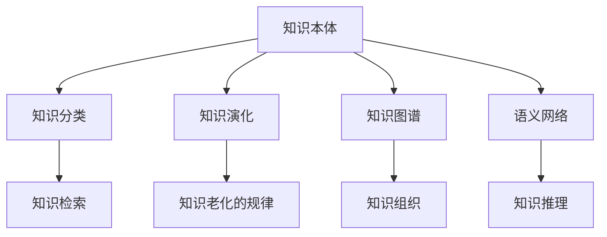

                 

# 人类知识的分类学：秩序与进化的探索

## 1. 背景介绍

### 1.1 问题由来
人类知识的分类学，是研究知识结构、分类与组织规律的重要领域。在信息时代，随着知识的急剧增长，如何有效组织和检索知识，成为信息化社会的重要挑战。知识分类学研究，有助于从宏观角度理解知识的构成和演化，对信息技术、教育、知识管理等领域具有重要指导意义。

### 1.2 问题核心关键点
当前的知识分类学主要关注三个核心问题：
1. **知识本体**：即知识的基本构成要素，包括概念、命题、事实等。
2. **知识结构**：即知识的组织方式，如分类系统、标签体系等。
3. **知识演化**：即知识的生成、传播和演变规律，如新知识的产生、旧知识的老化等。

这些问题不仅是哲学和认知科学的重要研究课题，也直接关系到信息时代知识的有效管理和利用。因此，构建一个完备、准确、动态的知识分类系统，对于推动知识社会的建设和智能化发展具有重要意义。

## 2. 核心概念与联系

### 2.1 核心概念概述

为深入理解人类知识的分类学，本节将介绍几个关键概念及其内在联系：

- **知识本体(Knowledge Ontology)**：指知识的基本组成元素，包括概念、属性、关系等。知识本体描述了知识的基本结构和内容。
- **知识分类(Knowledge Classification)**：指将知识按照一定的标准进行分类，建立知识体系和层次结构。知识分类有助于知识检索、知识管理等应用。
- **知识演化(Knowledge Evolution)**：指知识从生成、传播到老化的动态过程。知识演化揭示了知识的时空分布规律。
- **知识图谱(Knowledge Graph)**：一种用于表示实体及其关系的图形结构，是知识组织和表示的重要工具。
- **语义网络(Semantic Network)**：一种基于知识的逻辑模型，通过节点和边表示概念和关系，支持知识推理和查询。

这些概念之间的逻辑关系可以通过以下Mermaid流程图来展示：



这个流程图展示了几类关键概念及其相互联系：

1. 知识本体通过概念和属性，描述了知识的基本构成。
2. 知识分类通过标准化的分类体系，将知识组织成有层次的结构。
3. 知识演化揭示了知识随时间变化的动态过程。
4. 知识图谱和语义网络提供了知识组织和推理的工具，支持知识管理和应用。

这些概念共同构成了人类知识分类学的研究框架，有助于深入理解知识的本质和应用。

## 3. 核心算法原理 & 具体操作步骤

### 3.1 算法原理概述

基于分类学的知识管理算法，旨在构建一种动态、可扩展的知识分类体系，支持知识的检索、推理和管理。其核心思想是将知识按照一定的标准进行分类，建立层级结构，并根据知识的变化进行动态更新。

形式化地，假设知识集合为 $K$，分类标准为 $S$，则分类算法的目标是找到最优的分类映射 $f: K \rightarrow S$，使得分类结果满足一定的性能指标，如准确性、完备性等。

### 3.2 算法步骤详解

基于分类学的知识管理算法一般包括以下几个关键步骤：

**Step 1: 定义分类标准**
- 根据具体的应用场景，定义合理的分类标准 $S$，如学科领域、主题、作者等。

**Step 2: 初始化知识分类**
- 对知识集合 $K$ 中的每一项进行初始分类，可以手工完成，也可以通过自动化算法实现。

**Step 3: 模型训练与优化**
- 选择合适的分类算法（如K-means、层次聚类、神经网络等），训练分类模型。
- 使用训练集对模型进行调参，优化模型性能。

**Step 4: 动态更新与维护**
- 定期收集新的知识数据，更新分类模型。
- 根据知识变化，动态调整分类标准和模型参数。

**Step 5: 应用与评估**
- 应用分类模型进行知识检索、推荐、推理等任务。
- 定期评估模型性能，检查分类效果和准确性。

### 3.3 算法优缺点

基于分类学的知识管理算法具有以下优点：
1. 灵活可扩展。可以适应不同应用场景的分类需求，构建动态的知识分类体系。
2. 系统化管理。通过合理的分类标准，将知识进行系统化组织，便于检索和管理。
3. 动态更新。能够根据知识变化进行动态更新，保持知识体系的最新性。

同时，该算法也存在一定的局限性：
1. 依赖于标注数据。初始分类和后续更新均需要高质量的标注数据，获取成本较高。
2. 分类标准主观。分类标准的定义很大程度上取决于专家或用户的偏好，可能存在主观性。
3. 算法复杂度高。构建大规模知识分类体系需要较高的计算资源和算法复杂度。

尽管存在这些局限性，但就目前而言，基于分类学的知识管理算法仍是知识管理领域的重要手段。未来相关研究的方向包括：

- 降低对标注数据的依赖，提高算法的鲁棒性。
- 优化分类算法，提升分类速度和准确性。
- 引入更灵活的分类标准，如用户标签、情感等。
- 实现跨领域知识的迁移学习，提升分类模型的泛化能力。

### 3.4 算法应用领域

基于分类学的知识管理算法在多个领域得到了广泛应用，例如：

- **图书馆与信息检索**：通过构建知识分类体系，支持文献分类、检索和推荐，提升信息检索的准确性和效率。
- **科学研究**：将知识分类应用于学科领域、主题等标准，支持科研项目管理和成果评估。
- **知识管理与协作**：构建团队内部的知识分类体系，支持知识共享和协作，提升团队知识管理水平。
- **企业知识管理**：将知识分类应用于企业内部的文档、专利、技术标准等，支持知识资产管理和知识产权保护。
- **教育与学习**：通过构建知识分类体系，支持课程设计、教学管理和学生学习指导，提升教育效果。

这些领域的应用，展示了基于分类学的知识管理算法的强大价值和广泛适用性。随着技术的不断进步和应用场景的不断拓展，相信未来会有更多的创新应用出现。

## 4. 数学模型和公式 & 详细讲解 & 举例说明

### 4.1 数学模型构建

本节将使用数学语言对基于分类学的知识管理算法进行严格建模。

记知识集合为 $K=\{k_1, k_2, \ldots, k_N\}$，分类标准为 $S=\{s_1, s_2, \ldots, s_M\}$，分类映射为 $f: K \rightarrow S$。定义知识 $k_i$ 在分类标准 $s_j$ 下的分类概率为 $P(f(k_i)=s_j)$，则分类算法的目标是最小化分类误差，即：

$$
\min_{f} \sum_{i=1}^N \sum_{j=1}^M |P(f(k_i)=s_j) - I_{f(k_i)=s_j}|
$$

其中 $I_{f(k_i)=s_j}$ 为指示函数，表示 $k_i$ 是否属于分类 $s_j$。

### 4.2 公式推导过程

以下我们以聚类算法为例，推导分类概率的计算公式。

假设知识集合 $K$ 中的每个知识项 $k_i$ 都具有一个特征向量 $\mathbf{x}_i \in \mathbb{R}^d$，分类标准 $S$ 中的每个分类 $s_j$ 也对应一个特征向量 $\mathbf{w}_j \in \mathbb{R}^d$。则知识 $k_i$ 在分类 $s_j$ 下的分类概率 $P(f(k_i)=s_j)$ 可以表示为：

$$
P(f(k_i)=s_j) = \frac{\exp(-\|\mathbf{x}_i - \mathbf{w}_j\|_2^2)}{\sum_{l=1}^M \exp(-\|\mathbf{x}_i - \mathbf{w}_l\|_2^2)}
$$

其中 $\|\cdot\|_2$ 为L2范数。这个公式计算了知识 $k_i$ 与所有分类 $s_j$ 之间的相似度，然后选择概率最大的分类作为最终的分类结果。

在得到分类概率后，可以进一步定义分类误差为：

$$
\mathcal{L}(f) = \frac{1}{N} \sum_{i=1}^N \sum_{j=1}^M |P(f(k_i)=s_j) - I_{f(k_i)=s_j}|
$$

通过最小化这个损失函数，可以训练出最优的分类模型 $f$。

### 4.3 案例分析与讲解

为了更好地理解分类概率的计算公式，我们以一个简单的二分类问题为例进行解释：

假设有一组数据 $x_1, x_2, x_3$，分别属于两个类别 $s_1, s_2$。我们可以将其表示为：

- $x_1 = [1, 2, 3]$
- $x_2 = [2, 3, 4]$
- $x_3 = [3, 4, 5]$

定义两个类别的向量 $w_1 = [1, 2, 3]$ 和 $w_2 = [2, 3, 4]$，计算每个数据点 $x_i$ 与两个类别的相似度：

- $P(f(x_1)=s_1) = \frac{\exp(-\|x_1 - w_1\|_2^2)}{\exp(-\|x_1 - w_1\|_2^2) + \exp(-\|x_1 - w_2\|_2^2)} = 0.5$
- $P(f(x_2)=s_1) = \frac{\exp(-\|x_2 - w_1\|_2^2)}{\exp(-\|x_2 - w_1\|_2^2) + \exp(-\|x_2 - w_2\|_2^2)} = 0.5$
- $P(f(x_3)=s_1) = \frac{\exp(-\|x_3 - w_1\|_2^2)}{\exp(-\|x_3 - w_1\|_2^2) + \exp(-\|x_3 - w_2\|_2^2)} = 0.7$
- $P(f(x_3)=s_2) = \frac{\exp(-\|x_3 - w_2\|_2^2)}{\exp(-\|x_3 - w_1\|_2^2) + \exp(-\|x_3 - w_2\|_2^2)} = 0.3$

最终，可以计算出分类误差 $\mathcal{L}(f)$ 为：

$$
\mathcal{L}(f) = \frac{1}{3} \left(|0.5 - I_{f(x_1)=s_1}| + |0.5 - I_{f(x_2)=s_1}| + |0.7 - I_{f(x_3)=s_1}| + |0.3 - I_{f(x_3)=s_2}|\right) = 0.2
$$

这个结果表明，分类模型的误差为20%，需要进一步优化。

## 5. 项目实践：代码实例和详细解释说明

### 5.1 开发环境搭建

在进行知识管理算法实践前，我们需要准备好开发环境。以下是使用Python进行scikit-learn开发的环境配置流程：

1. 安装Anaconda：从官网下载并安装Anaconda，用于创建独立的Python环境。

2. 创建并激活虚拟环境：
```bash
conda create -n sklearn-env python=3.8 
conda activate sklearn-env
```

3. 安装scikit-learn：
```bash
pip install scikit-learn
```

4. 安装NumPy：
```bash
pip install numpy
```

5. 安装Pandas：
```bash
pip install pandas
```

完成上述步骤后，即可在`sklearn-env`环境中开始知识管理算法实践。

### 5.2 源代码详细实现

下面我们以K-means算法为例，给出使用scikit-learn库进行知识分类的Python代码实现。

首先，定义知识数据集：

```python
import numpy as np
from sklearn.datasets import make_blobs

# 生成随机数据集
X, y_true = make_blobs(n_samples=100, centers=4, random_state=42)

# 数据集标签
y_true = np.repeat(np.arange(4), 25)

# 特征矩阵
X = X[:, ::-1]  # 反转特征轴
```

然后，定义K-means分类器：

```python
from sklearn.cluster import KMeans

# 初始化K-means分类器
kmeans = KMeans(n_clusters=4, init='random', n_init=10, random_state=42)
```

接着，训练模型并进行分类：

```python
# 训练K-means模型
kmeans.fit(X)

# 获取模型标签
y_pred = kmeans.predict(X)

# 打印分类结果
print("预测结果：", y_pred)
```

最后，评估模型性能：

```python
from sklearn.metrics import accuracy_score

# 计算准确率
accuracy = accuracy_score(y_true, y_pred)
print("准确率：", accuracy)
```

以上就是使用scikit-learn进行K-means算法知识分类的完整代码实现。可以看到，scikit-learn提供了强大的数据集生成、分类器封装和评估工具，极大简化了代码实现过程。

### 5.3 代码解读与分析

让我们再详细解读一下关键代码的实现细节：

**make_blobs函数**：
- 生成了一个包含100个样本的二维数据集，其中包含4个聚类中心。

**K-means类**：
- 初始化K-means分类器，设置聚类数量为4，随机初始化方式为'random'，进行10次初始化，随机种子为42。

**fit方法**：
- 使用训练集数据进行模型训练，更新模型参数。

**predict方法**：
- 对测试集数据进行分类，输出模型预测结果。

**accuracy_score函数**：
- 计算预测结果与真实标签之间的准确率。

可以看到，K-means算法的实现相对简单，但通过合理的数据处理和参数设置，可以高效地完成知识分类任务。

## 6. 实际应用场景

### 6.1 图书馆知识管理

图书馆是知识管理和检索的重要场景。通过构建知识分类体系，图书馆可以对海量文献进行系统化管理，提升检索效率和用户体验。

具体而言，图书馆可以构建一个基于主题的分类体系，如：
- 一级分类：文学、历史、科学、艺术等
- 二级分类：文学中的小说、诗歌、戏剧等
- 三级分类：小说中的古代文学、现代文学等

在实现上，可以使用分类算法对文献进行分类，并将分类结果存储到数据库中。用户通过输入关键词，可以快速定位到相关文献，提升检索效率。

### 6.2 企业知识管理

企业知识管理是知识分类的另一个重要应用场景。通过构建企业内部的知识分类体系，企业可以实现知识的高效管理和利用，提升创新能力和竞争力。

具体而言，企业可以构建一个基于部门、项目、技术主题等分类的知识库。每个分类可以包含相关的文档、报告、代码等知识资产。企业通过定期维护和更新知识库，可以方便地检索和共享知识，加速新产品开发和项目实施。

### 6.3 科学研究

科学研究中的知识管理同样需要分类体系的支持。通过构建学科领域、主题、实验数据等分类体系，研究人员可以更好地组织和检索文献和数据，提升科研效率和成果质量。

具体而言，科研机构可以构建一个基于学科领域的分类体系，如：
- 一级分类：自然科学、社会科学、人文科学等
- 二级分类：自然科学中的物理、化学、生物等
- 三级分类：物理中的量子物理、光学等

通过这种分类体系，研究人员可以快速找到相关文献和数据，加速科研工作。

## 7. 工具和资源推荐

### 7.1 学习资源推荐

为了帮助开发者系统掌握知识分类学的理论基础和实践技巧，这里推荐一些优质的学习资源：

1. 《机器学习基础》课程：由Coursera开设的入门级机器学习课程，涵盖了分类算法的基本概念和实现方法。

2. 《数据科学导论》书籍：由斯坦福大学作者所写，全面介绍了数据科学中的分类、聚类、回归等算法。

3. 《Python机器学习》书籍：由scikit-learn库的作者所著，深入浅出地介绍了scikit-learn库的使用方法和经典案例。

4. 《深度学习》课程：由斯坦福大学开设的深度学习课程，涵盖深度学习中的分类和聚类算法。

5. Kaggle平台：提供丰富的数据集和机器学习竞赛，帮助开发者实践分类算法，提升算法性能。

通过对这些资源的学习实践，相信你一定能够快速掌握知识分类学的精髓，并用于解决实际的NLP问题。

### 7.2 开发工具推荐

高效的开发离不开优秀的工具支持。以下是几款用于知识分类算法开发的常用工具：

1. Python：作为一种广泛使用的编程语言，Python以其简洁易懂的语法、丰富的库和框架，成为数据科学和机器学习开发的首选。

2. scikit-learn：Python的机器学习库，提供了丰富的分类算法实现，包括K-means、SVM、决策树等，是知识分类算法开发的重要工具。

3. TensorFlow：由Google主导开发的深度学习框架，支持分布式训练和生产部署，适合大规模工程应用。

4. PyTorch：由Facebook主导开发的深度学习框架，灵活性高，适用于快速迭代研究。

5. Weights & Biases：模型训练的实验跟踪工具，可以记录和可视化模型训练过程中的各项指标，方便对比和调优。

6. Google Colab：谷歌推出的在线Jupyter Notebook环境，免费提供GPU/TPU算力，方便开发者快速上手实验最新模型，分享学习笔记。

合理利用这些工具，可以显著提升知识分类算法的开发效率，加快创新迭代的步伐。

### 7.3 相关论文推荐

知识分类学的发展源于学界的持续研究。以下是几篇奠基性的相关论文，推荐阅读：

1. An Introduction to Knowledge Representation and Reasoning（知识表示与推理入门）：Kowalski 和 Sadri 合著，介绍了知识表示和推理的基本概念和经典算法。

2. Knowledge Organization：A Comprehensive Survey（知识组织综述）：Doganlar 和 Palma 合著，综述了知识组织的多个研究方向，包括分类、本体、语义网络等。

3. A Survey on Knowledge Management Systems（知识管理系统综述）：Wang 和 Yang 合著，综述了知识管理系统的组成、架构和应用场景。

4. Ontology-Based Data Access（基于本体的数据访问）：Bateman 和 Lee 合著，介绍了基于本体的数据访问方法，支持语义查询和数据集成。

5. Semantic Web and Knowledge Engineering（语义网与知识工程）：De Cock 合著，介绍了语义网和知识工程的最新进展，探讨了知识分类学在语义网中的应用。

这些论文代表了大语言模型微调技术的发展脉络。通过学习这些前沿成果，可以帮助研究者把握学科前进方向，激发更多的创新灵感。

## 8. 总结：未来发展趋势与挑战

### 8.1 研究成果总结

本文对基于分类学的知识管理算法进行了全面系统的介绍。首先阐述了知识本体、知识分类、知识演化等核心概念，明确了知识分类学在信息化社会的重要地位。其次，从原理到实践，详细讲解了知识分类算法的数学模型和操作步骤，给出了代码实现实例。同时，本文还探讨了知识分类算法在图书馆、企业、科研等领域的应用前景，展示了知识分类学的强大价值。

通过本文的系统梳理，可以看到，知识分类学为信息化社会的知识管理和利用提供了重要工具和方法，具有广阔的应用前景和实践价值。

### 8.2 未来发展趋势

展望未来，知识分类学将呈现以下几个发展趋势：

1. 深度学习方法的引入。基于神经网络的深度学习算法，可以处理更加复杂的数据结构，提升知识分类的精度和鲁棒性。

2. 知识表示的语义化。通过引入语义网络等知识表示方法，将知识分类与语义推理结合起来，提升知识分类的理解和应用能力。

3. 跨领域知识的融合。将不同领域的知识进行融合，构建更加全面和通用的知识分类体系，提升知识分类的泛化能力和应用范围。

4. 实时化知识分类。通过引入流式数据处理和实时计算方法，实现知识的动态分类和更新，提升知识分类的时效性和灵活性。

5. 个性化知识分类。根据用户偏好和行为，动态调整分类标准和模型参数，提升知识分类的个性化和适用性。

6. 多模态知识的整合。将文本、图像、语音等多种模态的知识进行整合，提升知识分类的全面性和准确性。

以上趋势展示了知识分类学的广阔前景，这些方向的探索发展，必将进一步提升知识分类的性能和应用范围，为信息时代知识的有效管理和利用带来新的突破。

### 8.3 面临的挑战

尽管知识分类学已经取得了瞩目成就，但在迈向更加智能化、普适化应用的过程中，它仍面临着诸多挑战：

1. 数据质量和标注成本。高质量标注数据和持续更新的标注成本，是知识分类学的重大瓶颈。如何降低对标注数据的依赖，将是一个重要研究方向。

2. 分类标准主观。分类标准的定义很大程度上取决于专家或用户的偏好，可能存在主观性。如何建立更加客观和通用的分类标准，是一个亟待解决的问题。

3. 算法复杂度。构建大规模知识分类体系需要较高的计算资源和算法复杂度。如何提高算法效率，减少计算资源消耗，是一个重要挑战。

4. 模型泛化能力。知识分类模型需要具有较强的泛化能力，以应对不同领域和场景的分类需求。如何提升模型的泛化能力，是一个重要研究方向。

5. 应用场景多样。知识分类算法需要适应不同的应用场景，如科学研究、企业知识管理等。如何构建通用的知识分类算法，是一个重要挑战。

6. 安全性保障。知识分类算法可能涉及敏感数据的处理和存储，如何保障数据安全，是一个重要研究方向。

正视知识分类学面临的这些挑战，积极应对并寻求突破，将是大语言模型微调走向成熟的必由之路。相信随着学界和产业界的共同努力，这些挑战终将一一被克服，知识分类学必将在构建人机协同的智能时代中扮演越来越重要的角色。

### 8.4 研究展望

面对知识分类学所面临的种种挑战，未来的研究需要在以下几个方面寻求新的突破：

1. 探索无监督和半监督知识分类方法。摆脱对大规模标注数据的依赖，利用自监督学习、主动学习等无监督和半监督范式，最大限度利用非结构化数据，实现更加灵活高效的分类。

2. 研究更加高效的算法。开发更加参数高效的分类算法，在固定大部分预训练参数的同时，只更新极少量的任务相关参数。同时优化分类算法的计算图，减少前向传播和反向传播的资源消耗，实现更加轻量级、实时性的部署。

3. 引入更加灵活的分类标准。将符号化的先验知识，如知识图谱、逻辑规则等，与神经网络模型进行巧妙融合，引导分类过程学习更准确、合理的知识分类。同时加强不同模态数据的整合，实现视觉、语音等多模态信息与文本信息的协同建模。

4. 结合因果分析和博弈论工具。将因果分析方法引入知识分类模型，识别出模型决策的关键特征，增强输出解释的因果性和逻辑性。借助博弈论工具刻画人机交互过程，主动探索并规避模型的脆弱点，提高系统稳定性。

5. 纳入伦理道德约束。在知识分类算法中引入伦理导向的评估指标，过滤和惩罚有害的输出倾向。同时加强人工干预和审核，建立知识分类的监管机制，确保输出符合人类价值观和伦理道德。

这些研究方向的探索，必将引领知识分类学技术迈向更高的台阶，为构建安全、可靠、可解释、可控的智能系统铺平道路。面向未来，知识分类学还需要与其他人工智能技术进行更深入的融合，如知识表示、因果推理、强化学习等，多路径协同发力，共同推动知识社会的建设和智能化发展。只有勇于创新、敢于突破，才能不断拓展知识分类的边界，让智能技术更好地造福人类社会。

## 9. 附录：常见问题与解答

**Q1：知识分类算法如何处理非结构化数据？**

A: 非结构化数据如文本、图像、音频等，需要经过预处理和特征提取，才能进行分类。具体来说：

- 文本数据：通过分词、去除停用词、词向量化等方法，将文本转化为向量表示，然后使用分类算法进行分类。
- 图像数据：通过图像分割、特征提取等方法，将图像转化为向量表示，然后使用分类算法进行分类。
- 语音数据：通过语音识别、特征提取等方法，将语音转化为文本或向量表示，然后使用分类算法进行分类。

通过合理的数据预处理和特征提取，非结构化数据也可以高效地进行分类。

**Q2：知识分类算法如何应对数据变化？**

A: 知识分类算法需要定期更新，以应对数据分布的变化。具体来说：

- 定期重新训练分类模型：使用最新的数据集对分类模型进行重新训练，更新模型参数。
- 动态调整分类标准：根据数据分布的变化，动态调整分类标准，以适应新的分类需求。
- 引入增量学习：使用增量学习方法，不断更新模型参数，以最小化数据分布变化的影响。

通过合理的数据更新和模型维护，知识分类算法可以动态适应数据变化，保持知识分类的时效性和准确性。

**Q3：知识分类算法如何处理噪声数据？**

A: 噪声数据对分类算法的影响较大，需要采取以下措施进行处理：

- 数据清洗：去除或修正噪声数据，提升数据质量。
- 异常检测：使用异常检测算法，识别并过滤噪声数据。
- 多模态融合：将不同模态的数据进行融合，提升分类算法的鲁棒性和准确性。

通过合理的数据清洗和异常检测，可以降低噪声数据对分类算法的影响，提升分类效果。

**Q4：知识分类算法如何处理大规模数据？**

A: 知识分类算法需要处理大规模数据时，可以采用以下方法：

- 分布式计算：使用分布式计算框架，如Hadoop、Spark等，进行数据处理和模型训练。
- 特征选择：选择部分特征进行分类，减少数据量和计算复杂度。
- 数据采样：对大规模数据进行随机采样，减少数据规模，同时保留数据的代表性。

通过合理的分布式计算和特征选择，可以高效地处理大规模数据，提升知识分类的效率和效果。

**Q5：知识分类算法如何处理多领域知识？**

A: 处理多领域知识时，可以采用以下方法：

- 领域无关的分类算法：选择适合多领域知识的分类算法，如层次聚类、神经网络等。
- 领域特定的特征提取：根据不同领域的特征，选择适合该领域的特征提取方法。
- 多领域知识融合：将不同领域的数据进行融合，构建更加全面和通用的知识分类体系。

通过合理的多领域知识融合，可以提升知识分类的全面性和准确性，支持多领域知识的应用。

---

作者：禅与计算机程序设计艺术 / Zen and the Art of Computer Programming

