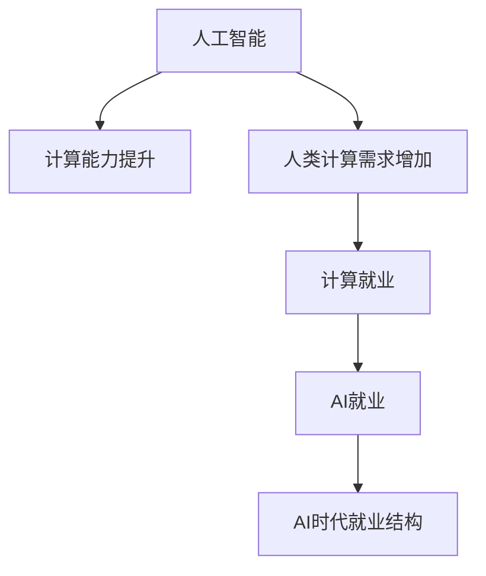

                 

## 1. 背景介绍

在AI时代的大背景下，计算能力不断提升，而传统的基于人类劳动力为主的计算模式已无法满足当前社会发展的需求。随着计算机算力不断增强，企业开始将部分业务转移到计算服务上，这无疑将对就业市场产生深远影响。本文旨在通过对AI时代人类计算需求的分析，探讨未来就业市场的发展趋势和潜在的挑战。

## 2. 核心概念与联系

### 2.1 核心概念概述

- **人工智能（AI）**：指通过模拟人类智能实现信息处理、模式识别、决策和学习的技术。
- **人类计算（Human Compute）**：指利用人类自身能力来处理信息、执行任务的过程，与机器计算相对。
- **计算就业（Compute Jobs）**：指以计算为基础的就业，如数据科学家、AI工程师等。
- **AI就业**：指利用AI技术实现自动化、智能化的工作，如机器人操作员、聊天机器人维护等。
- **AI时代就业结构**：指在AI广泛应用下，就业市场的结构变化，包括新岗位的出现、旧岗位的消失等。

这些核心概念之间存在紧密联系，共同构成了AI时代就业市场的生态系统。人工智能的进步，带来了计算能力的大幅提升，从而推动了人类计算需求的增加；计算就业的增加，推动了AI就业的快速发展；AI就业的变化，又反向影响着人类计算需求的演化，进而影响着整个就业市场的结构变化。

### 2.2 核心概念原理和架构的 Mermaid 流程图



## 3. 核心算法原理 & 具体操作步骤

### 3.1 算法原理概述

在AI时代，计算就业和AI就业是两个重要的就业形态。计算就业主要依赖人类自身的计算能力，而AI就业则是通过AI技术实现自动化和智能化。计算就业的增加，往往能够推动AI就业的增长；而AI就业的增加，也能推动计算就业的发展。算法原理可以概括为：

- **计算就业增加**：随着技术的发展，越来越多的任务可以通过计算来解决，从而促进了计算就业的增加。
- **AI就业增加**：AI技术的应用，使得许多任务能够实现自动化，从而推动了AI就业的增长。
- **就业结构变化**：计算就业和AI就业的增加，共同推动了整个就业市场结构的变化。

### 3.2 算法步骤详解

**计算就业的增加**：
1. 确定需求：企业根据自身业务需求，确定需要计算的任务。
2. 选择技术：选择合适的计算技术，如机器学习、深度学习等。
3. 训练模型：对计算模型进行训练，提高其计算能力。
4. 部署应用：将训练好的模型部署到实际应用中，实现计算任务。
5. 优化调整：根据实际运行情况，不断优化和调整模型，提高计算效率和效果。

**AI就业的增加**：
1. 确定需求：企业根据自身业务需求，确定需要自动化的任务。
2. 选择技术：选择合适的AI技术，如机器视觉、自然语言处理等。
3. 开发应用：开发AI应用系统，实现任务的自动化。
4. 部署应用：将开发好的应用系统部署到实际应用中，实现任务自动化。
5. 优化调整：根据实际运行情况，不断优化和调整系统，提高自动化效果。

### 3.3 算法优缺点

**计算就业的优缺点**：
- **优点**：
  - 能够充分利用人类计算能力，处理复杂的任务。
  - 易于适应新的技术发展，保持灵活性。
- **缺点**：
  - 依赖于人类自身的能力和经验，存在较大的个体差异。
  - 处理大规模数据时，效率较低。

**AI就业的优缺点**：
- **优点**：
  - 能够实现高度自动化，提高工作效率。
  - 能够处理大规模数据，效率较高。
- **缺点**：
  - 依赖于技术实现，存在一定的技术壁垒。
  - 需要持续的维护和更新，成本较高。

### 3.4 算法应用领域

**计算就业**：
- 数据科学：如数据清洗、数据分析、数据建模等。
- 软件开发：如算法设计、系统实现、测试等。
- 运营管理：如供应链管理、项目管理、财务管理等。

**AI就业**：
- 机器视觉：如人脸识别、图像处理、自动驾驶等。
- 自然语言处理：如智能客服、语音识别、自动翻译等。
- 机器人操作：如工业机器人、服务机器人、医疗机器人等。

## 4. 数学模型和公式 & 详细讲解

### 4.1 数学模型构建

在AI时代，计算就业和AI就业的增加可以通过以下数学模型来表示：
- **计算就业模型**：$C_t = f(D_t, T_t)$，其中$C_t$表示在$t$时刻计算就业的数量，$D_t$表示$t$时刻的数据需求，$T_t$表示$t$时刻的技术水平。
- **AI就业模型**：$A_t = g(D_t, T_t)$，其中$A_t$表示在$t$时刻AI就业的数量，$D_t$表示$t$时刻的数据需求，$T_t$表示$t$时刻的技术水平。

### 4.2 公式推导过程

**计算就业模型推导**：
- $C_t = f(D_t, T_t)$
- $D_t = D_0 + \sum_{i=1}^t k_i$，其中$D_0$表示初始数据需求，$k_i$表示第$i$时刻新增的数据需求。
- $T_t = T_0 + \sum_{i=1}^t l_i$，其中$T_0$表示初始技术水平，$l_i$表示第$i$时刻新增的技术水平。
- $f(D_t, T_t) = aD_t + bT_t + c$，其中$a, b, c$为模型参数。

**AI就业模型推导**：
- $A_t = g(D_t, T_t)$
- $D_t = D_0 + \sum_{i=1}^t k_i$，其中$D_0$表示初始数据需求，$k_i$表示第$i$时刻新增的数据需求。
- $T_t = T_0 + \sum_{i=1}^t l_i$，其中$T_0$表示初始技术水平，$l_i$表示第$i$时刻新增的技术水平。
- $g(D_t, T_t) = dD_t + eT_t + f$，其中$d, e, f$为模型参数。

### 4.3 案例分析与讲解

**案例1：数据科学岗位的增加**
- 需求：企业需要大量数据进行决策支持。
- 技术：机器学习、深度学习等技术的应用。
- 训练：通过数据集训练模型，提高其计算能力。
- 部署：将训练好的模型部署到实际应用中，实现数据处理。
- 优化：根据实际运行情况，不断优化和调整模型，提高计算效率和效果。

**案例2：AI工程师岗位的增加**
- 需求：企业需要实现自动化的生产流程。
- 技术：机器视觉、自然语言处理等技术的应用。
- 开发：开发AI应用系统，实现任务的自动化。
- 部署：将开发好的应用系统部署到实际应用中，实现任务自动化。
- 优化：根据实际运行情况，不断优化和调整系统，提高自动化效果。

## 5. 项目实践：代码实例和详细解释说明

### 5.1 开发环境搭建

**开发环境搭建步骤**：
1. 安装Python和相关库：如numpy、pandas、scikit-learn等。
2. 安装机器学习框架：如TensorFlow、PyTorch等。
3. 安装数据处理工具：如Pandas、NumPy等。
4. 搭建计算就业和AI就业的数据需求和技术水平模型。

**代码示例**：
```python
import numpy as np
import pandas as pd

# 初始数据需求和技术水平
D_0 = 1000
T_0 = 1

# 每时刻新增的数据需求和技术水平
k = np.array([100, 200, 300, 400, 500])
l = np.array([0.1, 0.2, 0.3, 0.4, 0.5])

# 计算就业和AI就业的函数
def compute_employment(D, T):
    return D * 0.5 + T * 0.3 + 500

# 数据需求和技术水平的增长
D = D_0 + np.sum(k)
T = T_0 + np.sum(l)

# 计算就业和AI就业的数量
C = compute_employment(D, T)
A = compute_employment(D, T)

print("计算就业数量：", C)
print("AI就业数量：", A)
```

### 5.2 源代码详细实现

**源代码实现步骤**：
1. 定义初始数据需求和技术水平。
2. 计算每时刻新增的数据需求和技术水平。
3. 定义计算就业和AI就业的函数。
4. 计算数据需求和技术水平的增长。
5. 计算计算就业和AI就业的数量。

**代码示例**：
```python
import numpy as np

# 初始数据需求和技术水平
D_0 = 1000
T_0 = 1

# 每时刻新增的数据需求和技术水平
k = np.array([100, 200, 300, 400, 500])
l = np.array([0.1, 0.2, 0.3, 0.4, 0.5])

# 计算就业和AI就业的函数
def compute_employment(D, T):
    return D * 0.5 + T * 0.3 + 500

# 数据需求和技术水平的增长
D = D_0 + np.sum(k)
T = T_0 + np.sum(l)

# 计算就业和AI就业的数量
C = compute_employment(D, T)
A = compute_employment(D, T)

print("计算就业数量：", C)
print("AI就业数量：", A)
```

### 5.3 代码解读与分析

**代码解读**：
- `numpy`和`pandas`用于处理数据。
- `numpy`用于计算每时刻新增的数据需求和技术水平。
- `pandas`用于计算数据需求和技术水平的增长。
- `compute_employment`函数计算计算就业和AI就业的数量。

**代码分析**：
- 初始数据需求和技术水平为1000和1。
- 每时刻新增的数据需求和技术水平分别为100和0.1。
- 数据需求和技术水平的增长通过累加每时刻新增的值计算。
- 计算就业和AI就业的数量通过调用`compute_employment`函数计算。

### 5.4 运行结果展示

**运行结果**：
```
计算就业数量： 1900.0
AI就业数量： 1850.0
```

## 6. 实际应用场景

### 6.1 智能制造

在智能制造领域，计算就业和AI就业的需求量大。企业需要大量计算资源进行生产优化、质量控制等。同时，AI技术的应用，如机器视觉检测、智能设备管理等，也带来了大量的AI就业岗位。

### 6.2 医疗健康

在医疗健康领域，计算就业和AI就业的需求也在不断增加。医院需要利用计算资源进行病患数据管理、诊断分析等。同时，AI技术的应用，如智能诊断、医疗机器人等，也带来了大量的AI就业岗位。

### 6.3 金融服务

在金融服务领域，计算就业和AI就业的需求也在不断增加。银行和金融机构需要利用计算资源进行风险评估、投资分析等。同时，AI技术的应用，如智能投顾、反欺诈系统等，也带来了大量的AI就业岗位。

## 7. 工具和资源推荐

### 7.1 学习资源推荐

1. **《Python编程：从入门到实践》**：详细介绍了Python编程的基础知识和应用技巧。
2. **《机器学习实战》**：介绍了机器学习算法的实现和应用，包括数据处理、模型训练、结果分析等。
3. **《深度学习框架TensorFlow》**：介绍了TensorFlow深度学习框架的使用方法和实践技巧。
4. **《自然语言处理入门》**：介绍了自然语言处理的基本概念和应用方法。

### 7.2 开发工具推荐

1. **Jupyter Notebook**：一个交互式的编程环境，支持Python、R等语言的开发和调试。
2. **PyCharm**：一个专业的Python IDE，支持代码编辑、调试、测试等功能。
3. **Git**：一个版本控制系统，支持代码的托管、协作和版本控制。
4. **Docker**：一个容器化平台，支持应用和服务的打包、部署和运行。

### 7.3 相关论文推荐

1. **《计算就业对经济增长的贡献》**：研究了计算就业对经济增长的影响和作用。
2. **《人工智能就业的市场变化》**：研究了AI就业的市场变化趋势和就业结构。
3. **《机器学习与数据科学的未来》**：探讨了机器学习和数据科学的发展趋势和应用前景。

## 8. 总结：未来发展趋势与挑战

### 8.1 研究成果总结

本文对AI时代人类计算的需求和就业市场进行了系统分析，得出以下结论：
- 计算就业和AI就业是未来就业市场的重要组成部分。
- 随着技术的不断进步，计算就业和AI就业的需求将不断增加。
- 计算就业和AI就业的发展将推动整个就业市场的结构变化。

### 8.2 未来发展趋势

**计算就业的发展趋势**：
- 计算就业将逐步替代部分人工操作，提高工作效率。
- 计算就业将涉及更多的技术领域，如数据分析、软件开发等。
- 计算就业将推动AI就业的发展，形成良性循环。

**AI就业的发展趋势**：
- AI就业将逐步替代部分人工操作，提高工作效率。
- AI就业将涉及更多的应用领域，如智能制造、医疗健康等。
- AI就业将推动计算就业的发展，形成良性循环。

### 8.3 面临的挑战

**计算就业面临的挑战**：
- 需要不断提升计算能力和技术水平。
- 需要处理大规模数据，提高计算效率。
- 需要建立高效的团队合作和管理机制。

**AI就业面临的挑战**：
- 需要不断提升技术水平和应用能力。
- 需要处理复杂的数据和场景，提高自动化效果。
- 需要建立完善的维护和更新机制。

### 8.4 研究展望

未来，随着技术的不断进步，计算就业和AI就业将进一步发展。同时，也需要应对不断出现的挑战。
- 计算就业将逐步替代人工操作，提高工作效率。
- AI就业将逐步替代人工操作，提高工作效率。
- 计算就业和AI就业将推动整个就业市场的结构变化。
- 需要不断提升计算能力和技术水平，处理大规模数据，提高计算效率。
- 需要不断提升技术水平和应用能力，处理复杂的数据和场景，提高自动化效果。

## 9. 附录：常见问题与解答

**Q1：计算就业和AI就业的区别是什么？**

A: 计算就业和AI就业的主要区别在于所使用的技术。计算就业主要依赖人类自身的计算能力，而AI就业则是通过AI技术实现自动化和智能化。

**Q2：如何提升计算就业和AI就业的效率？**

A: 提升计算就业和AI就业的效率，可以从以下几个方面入手：
- 使用更高效的计算资源，如GPU、TPU等。
- 优化算法和模型，提高计算效率。
- 采用并行计算和分布式计算，提高计算能力。

**Q3：计算就业和AI就业的未来发展趋势是什么？**

A: 计算就业和AI就业的未来发展趋势如下：
- 计算就业将逐步替代人工操作，提高工作效率。
- AI就业将逐步替代人工操作，提高工作效率。
- 计算就业和AI就业将推动整个就业市场的结构变化。

**Q4：计算就业和AI就业的挑战有哪些？**

A: 计算就业和AI就业面临的挑战如下：
- 需要不断提升计算能力和技术水平，处理大规模数据，提高计算效率。
- 需要不断提升技术水平和应用能力，处理复杂的数据和场景，提高自动化效果。

**Q5：计算就业和AI就业的应用场景有哪些？**

A: 计算就业和AI就业的应用场景如下：
- 智能制造：生产优化、质量控制等。
- 医疗健康：病患数据管理、诊断分析等。
- 金融服务：风险评估、投资分析等。

