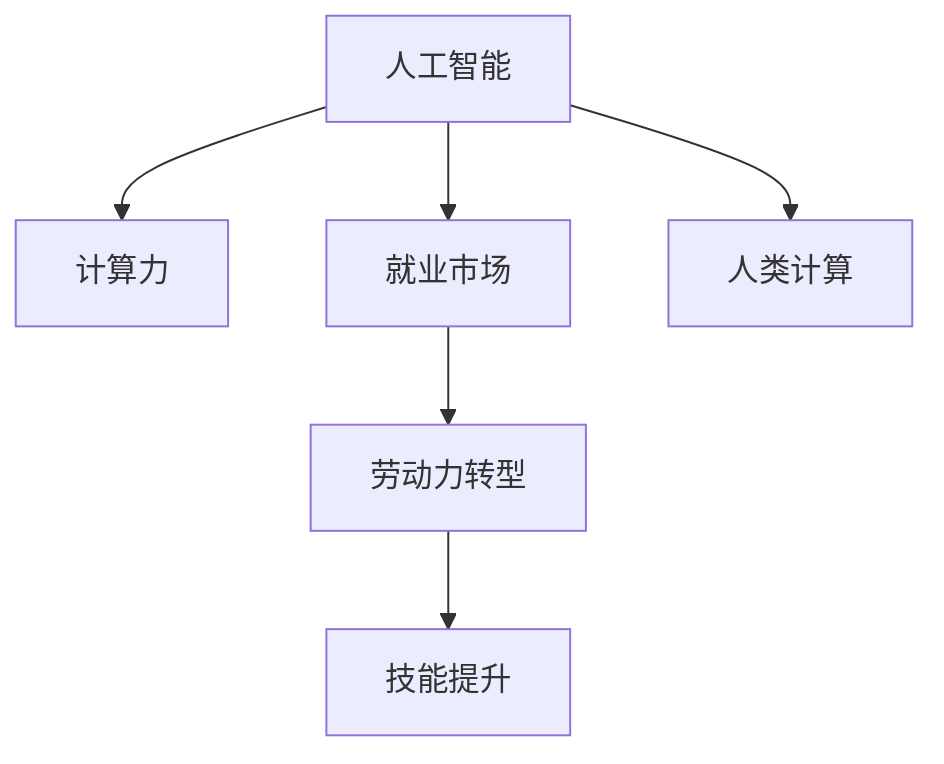

                 

# 人类计算：AI时代的未来就业市场趋势

> 关键词：人工智能,计算力,就业市场,劳动力转型,技能提升

## 1. 背景介绍

### 1.1 问题由来

随着人工智能技术的快速发展，AI正迅速渗透到各行各业，引领了一场新的工业革命。从自动驾驶汽车到智能客服，从个性化推荐到医疗诊断，AI技术的应用无处不在。这不仅极大地提升了生产效率，也引发了一系列深远的社会经济影响，尤其是对劳动力市场的影响。如何看待AI时代下人类就业市场的变化趋势，是当前社会各界普遍关注的焦点。

### 1.2 问题核心关键点

AI时代对就业市场的影响主要体现在以下几个方面：

- **就业结构变化**：AI技术的应用将改变一些传统行业的工作模式，部分岗位将被机器取代，同时也会催生新的就业岗位。
- **技能需求演变**：AI技术的普及需要新的技能组合，原有的技术技能可能变得过时，需要新的技术和软技能来适应。
- **劳动力迁移**：随着AI技术在不同行业的应用，劳动力将向数据驱动、技术密集型行业迁移，而一些传统行业可能面临失业风险。
- **就业质量提升**：AI技术的应用可以提升劳动效率，减轻劳动者负担，改善工作环境，提高就业质量。

### 1.3 问题研究意义

了解AI时代下就业市场的变化趋势，有助于：

- **政策制定**：政府可以根据预测结果制定相应的就业政策，如教育培训、劳动保障等，确保劳动力市场平稳过渡。
- **企业规划**：企业可以基于预测调整人力资源策略，提升员工技能，确保业务稳定运行。
- **个人发展**：劳动者可以提前了解市场变化，及时调整职业规划，避免因技能过时而失业。
- **社会稳定**：通过有效的政策和规划，减轻因技术变迁带来的就业冲击，维持社会稳定和谐。

## 2. 核心概念与联系

### 2.1 核心概念概述

为更好地理解AI时代下就业市场的发展趋势，本节将介绍几个关键概念：

- **人工智能(AI)**：通过算法和数据使机器具备人类智能的一种技术，涵盖了机器学习、深度学习、自然语言处理等众多领域。
- **计算力**：指计算机处理数据的能力，包括算力资源、数据处理速度、计算效率等。
- **就业市场**：反映劳动力供需关系的市场，受经济环境、政策法规、技术进步等因素影响。
- **劳动力转型**：指劳动者从传统岗位向新兴岗位的迁移过程，涉及技能学习、岗位转换、职业发展等。
- **技能提升**：指劳动者通过培训、学习等方式，获取新技能以满足AI时代下岗位需求的过程。

这些概念之间的联系可以通过以下Mermaid流程图来展示：



这个流程图展示了AI、计算力、就业市场、劳动力转型和技能提升之间的联系：

1. AI技术依赖计算力支撑，通过计算力提升，AI的性能和应用范围得以扩大。
2. AI技术对就业市场产生影响，引发就业结构的重大变化。
3. 就业市场变化导致劳动力转型，劳动者需要获取新的技能以适应新岗位。
4. 技能提升是劳动力转型的关键，通过培训和学习，劳动者能够适应新的工作要求。
5. 人类计算是人类利用AI技术进行计算的过程，是AI时代下劳动方式的重要形式。

## 3. 核心算法原理 & 具体操作步骤
### 3.1 算法原理概述

AI时代下就业市场变化的预测主要依赖于计算模型和算法，核心原理包括以下几个方面：

1. **数据驱动**：基于历史数据和当前趋势，预测未来就业市场变化。数据包括行业数据、就业数据、技术应用数据等。
2. **机器学习模型**：使用统计学习、深度学习等模型，对数据进行拟合，并预测未来趋势。常见的模型包括线性回归、决策树、随机森林、神经网络等。
3. **预测指标**：选择关键指标，如岗位需求、技能需求、行业增长率等，用于量化就业市场变化。
4. **假设检验**：在模型中设置假设，如技术进步对就业的影响、技能需求的变化等，并进行验证。

### 3.2 算法步骤详解

AI时代下就业市场变化预测的算法步骤如下：

1. **数据收集**：收集行业数据、就业数据、技术应用数据等，作为模型训练的输入。
2. **数据预处理**：清洗数据，处理缺失值、异常值，进行特征工程，提取关键特征。
3. **模型选择**：选择适合的机器学习模型，如线性回归、决策树、神经网络等，构建预测模型。
4. **模型训练**：使用历史数据训练模型，调整模型参数，确保模型能够准确预测未来就业市场变化。
5. **模型评估**：使用验证集对模型进行评估，选择表现最好的模型进行预测。
6. **结果解释**：分析预测结果，提供关键指标和趋势分析，帮助决策者理解市场变化。

### 3.3 算法优缺点

AI时代下就业市场变化的预测算法具有以下优点：

- **客观性**：基于数据驱动，避免主观偏见，预测结果更为客观。
- **可解释性**：通过模型解释，能够清晰地理解市场变化的原因。
- **动态性**：模型可以实时更新，动态跟踪市场变化。

同时，该算法也存在以下局限：

- **数据依赖性**：预测结果依赖于数据的质量和完整性，数据不足可能导致预测不准确。
- **模型复杂性**：复杂模型可能存在过拟合风险，导致预测结果不稳定。
- **假设限制**：预测假设可能与实际情况不符，导致模型失效。

### 3.4 算法应用领域

AI时代下就业市场变化的预测算法主要应用于以下领域：

- **政府决策**：为政府制定就业政策提供数据支持，如教育培训、劳动保障等。
- **企业规划**：帮助企业制定人力资源策略，如招聘、培训、岗位调整等。
- **学术研究**：为学术界提供数据和分析工具，研究AI对就业市场的影响。
- **职业指导**：为个人提供职业发展建议，帮助劳动者适应新岗位。

## 4. 数学模型和公式 & 详细讲解 & 举例说明

### 4.1 数学模型构建

预测AI时代下就业市场变化的核心数学模型包括线性回归、决策树、神经网络等。这里以线性回归为例，构建预测模型。

设 $y$ 为预测的就业需求，$x_1, x_2, ..., x_n$ 为影响就业需求的关键因素，模型可以表示为：

$$ y = \beta_0 + \beta_1x_1 + \beta_2x_2 + ... + \beta_nx_n + \epsilon $$

其中，$\beta_0$ 为截距，$\beta_i$ 为第 $i$ 个因素的系数，$\epsilon$ 为误差项。

### 4.2 公式推导过程

在线性回归模型中，最小化误差平方和：

$$ \sum_{i=1}^N (y_i - \hat{y}_i)^2 $$

其中 $\hat{y}_i$ 为第 $i$ 个样本的预测值。

通过求偏导数，可以得到系数 $\beta_i$ 的解：

$$ \beta_i = \frac{\sum_{i=1}^N (x_iy_i - \overline{x}_i\overline{y}_i)}{\sum_{i=1}^N (x_i^2 - \overline{x}_i^2)} $$

其中 $\overline{x}_i$ 和 $\overline{y}_i$ 分别为样本的均值。

### 4.3 案例分析与讲解

假设我们收集了某地区的就业数据，包含时间、技术应用、教育培训等因素。可以使用线性回归模型对就业需求进行预测。

以某地区教育培训投入为例，设定模型为：

$$ y = \beta_0 + \beta_1t + \beta_2x + \beta_3y + \epsilon $$

其中，$y$ 为预测的就业需求，$t$ 为时间，$x$ 为技术应用程度，$y$ 为教育培训投入。

利用历史数据，计算 $\beta_0, \beta_1, \beta_2, \beta_3$，得到模型参数。再使用该模型预测未来某一时间的就业需求。

## 5. 项目实践：代码实例和详细解释说明
### 5.1 开发环境搭建

在进行就业市场预测的实践前，我们需要准备好开发环境。以下是使用Python进行scikit-learn开发的环境配置流程：

1. 安装Anaconda：从官网下载并安装Anaconda，用于创建独立的Python环境。

2. 创建并激活虚拟环境：
```bash
conda create -n sklearn-env python=3.8 
conda activate sklearn-env
```

3. 安装scikit-learn：
```bash
conda install scikit-learn
```

4. 安装各类工具包：
```bash
pip install numpy pandas scikit-learn matplotlib tqdm jupyter notebook ipython
```

完成上述步骤后，即可在`sklearn-env`环境中开始就业市场预测的实践。

### 5.2 源代码详细实现

这里我们以预测某地区教育培训投入对就业需求的影响为例，给出使用scikit-learn进行线性回归的PyTorch代码实现。

首先，定义线性回归模型：

```python
from sklearn.linear_model import LinearRegression

model = LinearRegression()
```

然后，定义训练和评估函数：

```python
from sklearn.metrics import mean_squared_error

def train(model, X_train, y_train):
    model.fit(X_train, y_train)
    return model

def evaluate(model, X_test, y_test):
    y_pred = model.predict(X_test)
    mse = mean_squared_error(y_test, y_pred)
    return mse
```

接着，准备数据：

```python
import pandas as pd
from sklearn.model_selection import train_test_split

# 准备数据
data = pd.read_csv('employment_data.csv')

# 特征选择
X = data[['t', 'x', 'y']]

# 目标变量
y = data['y']

# 划分训练集和测试集
X_train, X_test, y_train, y_test = train_test_split(X, y, test_size=0.2, random_state=42)
```

最后，启动训练流程并在测试集上评估：

```python
# 训练模型
model = train(model, X_train, y_train)

# 在测试集上评估模型
mse = evaluate(model, X_test, y_test)
print(f"测试集均方误差: {mse:.3f}")
```

以上就是使用scikit-learn进行线性回归模型的就业市场预测的完整代码实现。可以看到，scikit-learn提供了简单易用的接口，可以快速搭建预测模型。

### 5.3 代码解读与分析

让我们再详细解读一下关键代码的实现细节：

**LinearRegression类**：
- `__init__`方法：初始化线性回归模型。

**train函数**：
- 使用训练集数据拟合模型，并返回模型。

**evaluate函数**：
- 在测试集上预测目标变量，计算均方误差。

**data准备**：
- 使用pandas库读取就业数据，并进行特征选择，构建训练集和测试集。

**模型评估**：
- 使用均方误差评估模型预测效果，输出测试集上的均方误差。

**训练流程**：
- 定义模型，准备数据，划分数据集，训练模型，评估模型。

可以看到，scikit-learn的线性回归模型提供了简单高效的接口，使得就业市场预测的代码实现变得简洁高效。开发者可以将更多精力放在数据处理、模型改进等高层逻辑上，而不必过多关注底层的实现细节。

当然，工业级的系统实现还需考虑更多因素，如模型的保存和部署、超参数的自动搜索、更灵活的任务适配层等。但核心的线性回归预测方法基本与此类似。

## 6. 实际应用场景
### 6.1 智能制造

AI技术在智能制造中的应用，极大地提升了生产效率和质量。通过自动化、智能化生产设备，企业能够快速响应市场变化，缩短产品上市时间，降低生产成本。但同时，传统制造行业也面临着劳动力转型和技能提升的挑战。

在技术实现上，可以收集企业的生产数据、设备数据、工人技能数据等，构建就业市场预测模型。模型可以预测不同技术应用对就业的影响，指导企业进行技术升级和员工培训。对于即将被淘汰的岗位，及时进行人员调整，减少失业风险。对于新兴岗位，提前进行人才培养，确保岗位需求。

### 6.2 金融服务

AI技术在金融领域的应用，如智能投顾、风险控制、反欺诈检测等，提升了金融服务的质量和效率。但同时，金融行业的就业结构也在发生变化。

在就业市场预测上，可以收集金融市场数据、技术应用数据、员工技能数据等，构建就业市场预测模型。模型可以预测不同技术应用对就业的影响，指导金融机构进行技术升级和员工培训。对于即将被淘汰的岗位，及时进行人员调整，减少失业风险。对于新兴岗位，提前进行人才培养，确保岗位需求。

### 6.3 医疗健康

AI技术在医疗领域的应用，如医学影像分析、病历管理、个性化治疗等，提升了医疗服务的质量和效率。但同时，医疗行业的就业结构也在发生变化。

在就业市场预测上，可以收集医疗数据、技术应用数据、员工技能数据等，构建就业市场预测模型。模型可以预测不同技术应用对就业的影响，指导医疗机构进行技术升级和员工培训。对于即将被淘汰的岗位，及时进行人员调整，减少失业风险。对于新兴岗位，提前进行人才培养，确保岗位需求。

### 6.4 未来应用展望

随着AI技术的不断发展，就业市场预测的应用场景将不断拓展，对劳动力市场的引导作用将更加显著。

在智慧城市治理中，就业市场预测可以为城市规划、人口管理、公共服务提供重要参考。通过预测城市就业市场变化，优化资源配置，提升城市管理效率。

在教育培训领域，就业市场预测可以为课程设置、培训计划、职业指导提供科学依据。通过预测未来就业市场需求，优化教育资源配置，提升教育质量。

在科技研发领域，就业市场预测可以为技术规划、项目评估、人才培养提供参考。通过预测未来技术发展趋势，指导技术研发方向，培养未来技术人才。

## 7. 工具和资源推荐
### 7.1 学习资源推荐

为了帮助开发者系统掌握AI时代下就业市场的预测方法，这里推荐一些优质的学习资源：

1. 《Python数据科学手册》系列博文：由大数据技术专家撰写，详细介绍了Python数据科学库的使用方法，包括就业市场预测的实现。

2. 《机器学习实战》书籍：斯坦福大学开设的机器学习课程，详细讲解了机器学习算法和实现方法，为就业市场预测提供了理论基础。

3. 《Hands-On Machine Learning with Scikit-Learn, Keras, and TensorFlow》书籍：HuggingFace的官方文档，介绍了scikit-learn、TensorFlow等机器学习库的使用方法，包括线性回归、神经网络等模型实现。

4. Kaggle：全球最大的数据科学竞赛平台，提供了丰富的就业市场预测数据集和竞赛任务，助力开发者提高实战技能。

5. Coursera《机器学习》课程：斯坦福大学开设的机器学习课程，详细讲解了机器学习算法和实现方法，为就业市场预测提供了理论基础。

通过对这些资源的学习实践，相信你一定能够快速掌握AI时代下就业市场预测的精髓，并用于解决实际的就业问题。
### 7.2 开发工具推荐

高效的开发离不开优秀的工具支持。以下是几款用于AI时代下就业市场预测开发的常用工具：

1. Python：基于Python的开源编程语言，拥有丰富的科学计算库和数据处理工具，适合数据驱动的预测任务。

2. Scikit-learn：Python的机器学习库，提供了包括线性回归、决策树、神经网络等在内的多种模型实现，易于使用。

3. TensorFlow：由Google主导开发的开源深度学习框架，适合大规模数据处理和模型训练，可以支持多种神经网络模型。

4. Weights & Biases：模型训练的实验跟踪工具，可以记录和可视化模型训练过程中的各项指标，方便对比和调优。与主流深度学习框架无缝集成。

5. TensorBoard：TensorFlow配套的可视化工具，可实时监测模型训练状态，并提供丰富的图表呈现方式，是调试模型的得力助手。

6. Jupyter Notebook：Python的交互式编程环境，支持代码编写、数据处理、结果展示等一站式服务，适合进行模型实验和数据分析。

合理利用这些工具，可以显著提升AI时代下就业市场预测的开发效率，加快创新迭代的步伐。

### 7.3 相关论文推荐

AI时代下就业市场预测的研究源于学界的持续研究。以下是几篇奠基性的相关论文，推荐阅读：

1. Predicting Job Market Trends using Machine Learning: A Survey（就业市场预测综述）：综述了机器学习在就业市场预测中的应用，提供了多种预测方法和案例分析。

2. The Impact of Artificial Intelligence on Employment: A Literature Review（AI对就业影响的文献综述）：综述了AI技术对就业市场的影响，分析了不同领域的应用和预测结果。

3. Artificial Intelligence and the Future of Work: Opportunities and Challenges（AI与未来就业：机遇与挑战）：探讨了AI技术对未来就业市场的深远影响，分析了就业市场的变化趋势和应对策略。

4. AI and the Changing Workforce: A Report from the White House（AI与劳动力市场的变革报告）：由白宫发布的官方报告，分析了AI技术对劳动力市场的影响，提出了相应的政策建议。

这些论文代表了大语言模型微调技术的发展脉络。通过学习这些前沿成果，可以帮助研究者把握学科前进方向，激发更多的创新灵感。

## 8. 总结：未来发展趋势与挑战
### 8.1 总结

本文对AI时代下就业市场预测方法进行了全面系统的介绍。首先阐述了AI技术的发展对就业市场的影响，明确了就业市场预测在劳动力市场转型中的重要意义。其次，从原理到实践，详细讲解了就业市场预测的数学原理和关键步骤，给出了就业市场预测任务开发的完整代码实例。同时，本文还广泛探讨了就业市场预测在智能制造、金融服务、医疗健康等多个行业领域的应用前景，展示了就业市场预测的广阔前景。此外，本文精选了就业市场预测的各类学习资源，力求为读者提供全方位的技术指引。

通过本文的系统梳理，可以看到，AI技术在就业市场预测中的应用前景广阔，能够为政府、企业、学术界、劳动者等多方提供科学依据，推动就业市场的平稳过渡。未来，伴随AI技术的持续演进和算法模型的不断优化，就业市场预测必将更加精准、高效，为社会经济的发展提供重要支持。

### 8.2 未来发展趋势

展望未来，AI时代下就业市场预测技术将呈现以下几个发展趋势：

1. **数据质量提升**：随着数据采集和处理技术的进步，数据质量将显著提升，预测模型的准确性将进一步提高。

2. **模型多样化**：除了线性回归，更多复杂的模型如神经网络、深度学习等将得到广泛应用，提升预测精度。

3. **实时预测**：随着数据处理技术的进步，实时预测将变得更加可行，能够及时响应市场变化，提供更及时的指导。

4. **跨领域融合**：就业市场预测将与更多领域结合，如健康、教育、公共服务等，提供更全面的预测和指导。

5. **政策支持**：政府将更加重视就业市场预测技术的应用，通过政策引导和资金支持，推动就业市场预测技术的普及和应用。

6. **技术开放**：更多的开源工具和数据集将推动就业市场预测技术的开放，降低技术门槛，促进技术共享和创新。

以上趋势凸显了AI时代下就业市场预测技术的广阔前景。这些方向的探索发展，必将进一步提升就业市场预测的准确性和实用性，为社会经济的发展提供重要支持。

### 8.3 面临的挑战

尽管AI时代下就业市场预测技术已经取得了瞩目成就，但在迈向更加智能化、普适化应用的过程中，它仍面临着诸多挑战：

1. **数据获取难度**：高质量的数据获取难度较大，不同领域的数据格式和质量参差不齐，影响预测模型的准确性。

2. **模型复杂性**：复杂的模型可能存在过拟合风险，需要更多的数据和更好的特征工程方法。

3. **实时性问题**：实时预测需要高效的数据处理和模型计算，硬件资源需求较大。

4. **跨领域适配**：不同领域的预测模型需要针对性地设计，增加了模型开发的复杂性。

5. **政策和技术衔接**：政府政策与技术应用之间的衔接还需要进一步优化，提升政策执行的效率和效果。

6. **技术普及性**：技术普及度仍需提高，部分企业和小微个体难以获取和应用先进技术。

正视这些挑战，积极应对并寻求突破，将是大语言模型微调技术迈向成熟的必由之路。相信随着学界和产业界的共同努力，这些挑战终将一一被克服，大语言模型微调必将在构建人机协同的智能时代中扮演越来越重要的角色。

### 8.4 研究展望

面对AI时代下就业市场预测所面临的种种挑战，未来的研究需要在以下几个方面寻求新的突破：

1. **数据质量优化**：优化数据采集和处理技术，提升数据质量，降低预测误差。

2. **模型高效化**：开发更加高效的预测模型，减少计算资源消耗，提升实时预测能力。

3. **跨领域融合**：研究不同领域之间的数据融合方法，提升预测模型的泛化能力。

4. **政策和技术对接**：研究政府政策与技术应用的衔接机制，提升政策执行效果。

5. **技术普及性**：研究技术普及方法，降低技术门槛，推动技术在更多领域的普及应用。

6. **模型可解释性**：提升模型的可解释性，增强预测结果的透明度和可信度。

这些研究方向的探索，必将引领AI时代下就业市场预测技术迈向更高的台阶，为社会经济的发展提供重要支持。面向未来，就业市场预测技术还需要与其他人工智能技术进行更深入的融合，如自然语言处理、图像识别等，多路径协同发力，共同推动就业市场预测技术的进步。只有勇于创新、敢于突破，才能不断拓展AI技术在就业市场预测中的应用，为社会经济的可持续发展提供重要支持。

## 9. 附录：常见问题与解答

**Q1：AI时代下就业市场预测是否适用于所有行业？**

A: AI时代下就业市场预测对大多数行业都有适用性，但需要根据不同行业的数据特征和需求进行模型设计和优化。如金融、医疗、制造等行业，数据类型和质量差异较大，需要针对性地设计和调整预测模型。

**Q2：AI技术对就业市场的影响如何？**

A: AI技术对就业市场的影响复杂多样。一方面，通过提升生产效率、降低成本、优化资源配置，AI技术能够创造新的就业机会；另一方面，部分岗位可能被机器取代，就业结构发生变化。总体来看，AI技术将推动劳动力市场的转型，提升就业质量，但短期内可能带来一定的就业冲击。

**Q3：AI时代下企业应该如何应对就业市场变化？**

A: AI时代下企业应该：

1. **技术升级**：提升技术水平，适应AI技术的发展趋势。
2. **员工培训**：对员工进行技能培训，提升员工适应新岗位的能力。
3. **岗位调整**：根据就业市场变化，及时调整岗位和人员配置。
4. **政策对接**：与政府政策对接，获取相应的支持和服务。

**Q4：个人应该如何应对AI时代下的就业变化？**

A: 个人应该：

1. **持续学习**：不断提升自己的技能，适应新的岗位需求。
2. **跨领域学习**：学习多领域知识，提升自己的综合素质。
3. **职业规划**：根据就业市场变化，调整职业规划，寻找新的发展机会。
4. **技术应用**：掌握最新的AI技术，提升自己在就业市场的竞争力。

**Q5：AI时代下政府应该如何应对就业市场变化？**

A: 政府应该：

1. **政策引导**：制定相应的政策，引导企业进行技术升级和人员培训。
2. **资金支持**：提供相应的资金支持，帮助企业和小微个体获取和应用先进技术。
3. **数据开放**：开放就业市场预测数据，提供数据支持和政策指导。
4. **公共服务**：提供公共服务，帮助劳动者适应新的就业环境。

这些问题的回答，能够帮助政府、企业、个人等多方理解AI时代下就业市场的变化趋势，制定相应的应对策略，推动就业市场的平稳过渡。总之，就业市场预测需要各方共同努力，才能实现技术的广泛应用和社会经济的可持续发展。

---

作者：禅与计算机程序设计艺术 / Zen and the Art of Computer Programming

