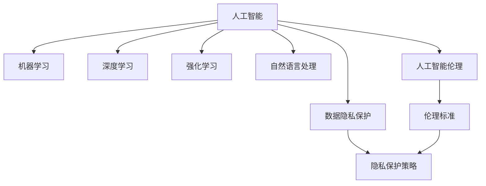

                 

## 1. 背景介绍

在人工智能（AI）迅速发展的今天，人工智能技术已经渗透到社会的各个角落，从智能客服、推荐系统到自动驾驶、医疗诊断，AI技术正在以前所未有的速度改变着我们的生活。然而，随着AI技术的普及和应用，其带来的道德和社会影响也逐渐受到关注。如何合理利用AI技术，使其既能发挥其潜力，又能避免可能的负面影响，成为了一个亟待解决的问题。

### 1.1 问题由来

AI技术在提升生产效率、优化决策、改善生活质量等方面展现了巨大的潜力，但也带来了新的挑战。例如，自动驾驶技术在提升交通效率的同时，也带来了隐私、安全等方面的问题；人脸识别技术在提高公共安全的同时，也引发了隐私保护和算法歧视的争议。这些问题引发了社会对AI技术的广泛讨论和思考，提出了AI伦理、责任归属、法律监管等一系列亟待解决的问题。

### 1.2 问题核心关键点

人工智能技术的道德和社会影响是复杂且多面的，需要从多个角度进行思考和探讨。以下是核心关键点：

- AI伦理：如何在设计和使用AI系统时，考虑道德和社会公正性，避免算法歧视、偏见等不公平现象。
- 数据隐私：如何在数据采集、处理、使用过程中，保护用户隐私，避免数据滥用和泄露。
- 责任归属：如何确定AI系统在决策、故障等情况下的责任归属，保障社会秩序和法律正义。
- 法规监管：如何通过法律和政策，对AI技术的应用进行规范和监管，避免滥用和负面影响。
- 公众认知：如何提高公众对AI技术的认知和接受度，减少社会对AI技术的误解和恐惧。

## 2. 核心概念与联系

### 2.1 核心概念概述

为了更好地理解AI技术的道德和社会影响，本节将介绍几个密切相关的核心概念：

- 人工智能（AI）：利用计算机技术模拟人类智能行为，通过学习、推理、感知等能力实现自动化的技术。
- 机器学习（ML）：AI技术的核心，通过数据训练模型，使其具备自动化的预测、分类、生成等功能。
- 深度学习（DL）：机器学习的一种，使用神经网络结构模拟人脑的工作机制，广泛应用于图像、语音、自然语言处理等领域。
- 强化学习（RL）：通过试错、奖励机制训练模型，使其在特定任务上具备最优策略的AI技术。
- 自然语言处理（NLP）：使计算机能够理解和生成自然语言的技术，涉及语言模型、文本分类、机器翻译等多个方向。
- 人工智能伦理：探讨AI技术在道德、法律、社会等层面的影响和责任，确保AI技术的应用符合伦理标准。
- 数据隐私保护：确保数据在收集、存储、使用过程中，用户隐私得到保障，避免数据滥用和泄露。

这些核心概念之间的逻辑关系可以通过以下Mermaid流程图来展示：



这个流程图展示了大语言模型的核心概念及其之间的关系：

1. 人工智能技术通过机器学习、深度学习、强化学习等技术手段，实现了对复杂问题的自动化解决。
2. 自然语言处理是AI技术的重要分支，使得计算机能够理解和生成自然语言。
3. 人工智能伦理关注AI技术在应用过程中的道德和社会影响，确保其符合伦理标准。
4. 数据隐私保护关注如何在数据处理和使用过程中，保障用户隐私，避免数据滥用和泄露。

这些概念共同构成了AI技术的整体框架，使AI技术能够更好地服务于人类社会，同时也需要关注其可能带来的负面影响。

## 3. 核心算法原理 & 具体操作步骤

### 3.1 算法原理概述

人工智能技术的道德和社会影响涉及多个层面，包括算法设计、数据使用、用户交互等。以下是几种核心算法原理及其具体操作步骤的详细分析。

#### 3.1.1 算法原理概述

1. **算法设计**：
   - 公平性算法：确保AI模型在训练和推理过程中，不产生偏见和歧视。
   - 透明性算法：确保AI模型的决策过程可解释，用户可以理解其工作原理和输出结果。
   - 鲁棒性算法：确保AI模型在面对异常数据和攻击时，能够保持稳定性和安全性。

2. **数据使用**：
   - 隐私保护算法：确保数据在收集、存储、处理过程中，用户隐私得到保障，避免数据滥用和泄露。
   - 数据增强算法：通过数据增强技术，提高AI模型在各种场景下的泛化能力。

3. **用户交互**：
   - 人机交互算法：确保AI系统在用户交互过程中，能够理解用户的意图和需求，提供合适和高效的服务。

### 3.2 算法步骤详解

#### 3.2.1 算法设计步骤

1. **确定目标**：根据具体应用场景，确定AI系统的目标和功能。
2. **选择算法**：根据目标和功能，选择合适的算法和技术手段。
3. **模型训练**：通过数据训练模型，使其具备自动化的预测、分类、生成等功能。
4. **评估与优化**：对模型进行评估和优化，确保其符合目标要求和伦理标准。

#### 3.2.2 数据使用步骤

1. **数据采集**：通过合法手段收集数据，确保数据的质量和多样性。
2. **数据处理**：对数据进行清洗、标注、增强等预处理，确保数据符合模型训练要求。
3. **数据保护**：通过数据加密、访问控制等措施，保障用户隐私和数据安全。

#### 3.2.3 用户交互步骤

1. **需求理解**：通过自然语言处理等技术，理解用户的需求和意图。
2. **服务提供**：根据用户需求，提供合适的服务或建议。
3. **反馈收集**：收集用户反馈，进行服务改进和优化。

### 3.3 算法优缺点

人工智能技术的道德和社会影响涉及多个层面，每种算法都有其优点和缺点，需要根据具体情况进行选择和优化。

#### 3.3.1 算法设计优缺点

- **优点**：
  - 通过算法设计，可以确保AI系统在应用过程中，符合伦理标准和社会公正性。
  - 通过算法设计，可以提高AI系统的透明性和可解释性，减少用户对AI系统的误解和恐惧。
  - 通过算法设计，可以提高AI系统的鲁棒性和安全性，避免系统崩溃和异常情况。

- **缺点**：
  - 算法设计需要大量时间和资源，需要跨学科合作和技术创新。
  - 算法设计涉及多个环节，需要综合考虑各个因素，确保各环节协同工作。

#### 3.3.2 数据使用优缺点

- **优点**：
  - 通过数据保护，可以确保用户隐私和数据安全，避免数据滥用和泄露。
  - 通过数据增强，可以提高AI模型的泛化能力和鲁棒性。

- **缺点**：
  - 数据采集和处理需要合法和合规，需要遵守数据保护法规和隐私政策。
  - 数据保护需要技术手段和措施，需要投入大量资源和时间。

#### 3.3.3 用户交互优缺点

- **优点**：
  - 通过用户交互，可以提高AI系统的准确性和用户满意度，减少误解和冲突。
  - 通过用户交互，可以收集用户反馈，进行系统改进和优化。

- **缺点**：
  - 用户交互需要设计合适的接口和界面，需要考虑用户体验和可用性。
  - 用户交互需要实时处理和响应，需要高计算能力和资源支持。

### 3.4 算法应用领域

人工智能技术的道德和社会影响涉及多个领域，以下是几个主要应用领域：

#### 3.4.1 医疗领域

- **算法设计**：确保医疗AI系统的公平性和透明性，避免算法偏见和歧视。
- **数据使用**：确保医疗数据在采集、存储、使用过程中，保护患者隐私和数据安全。
- **用户交互**：通过医疗AI系统，提高医疗服务的效率和质量，减少误诊和漏诊。

#### 3.4.2 金融领域

- **算法设计**：确保金融AI系统的透明性和可解释性，避免算法偏见和歧视。
- **数据使用**：确保金融数据在采集、存储、使用过程中，保护用户隐私和数据安全。
- **用户交互**：通过金融AI系统，提高金融服务的效率和质量，避免欺诈和风险。

#### 3.4.3 教育领域

- **算法设计**：确保教育AI系统的公平性和透明性，避免算法偏见和歧视。
- **数据使用**：确保教育数据在采集、存储、使用过程中，保护学生隐私和数据安全。
- **用户交互**：通过教育AI系统，提高教学服务的效率和质量，促进教育公平。

## 4. 数学模型和公式 & 详细讲解 & 举例说明

### 4.1 数学模型构建

在AI技术的道德和社会影响研究中，数学模型可以帮助我们更准确地分析问题，提出解决方案。

#### 4.1.1 公平性算法

**目标**：确保AI模型在训练和推理过程中，不产生偏见和歧视。

**数学模型**：

$$
\text{Fairness} = \frac{1}{N} \sum_{i=1}^N |\frac{P(y_i=1|x_i)}{P(y_i=0|x_i)} - 1|
$$

其中，$P(y_i=1|x_i)$ 和 $P(y_i=0|x_i)$ 分别表示模型对正样本和负样本的预测概率。

**案例分析**：
- **举例**：假设有一个医疗诊断AI系统，用于判断患者是否有某种疾病。若系统在性别、年龄、种族等特征上存在偏见，会导致某些群体被误诊或漏诊。
- **解决方案**：通过调整模型训练数据和权重，减少偏见和歧视。例如，在训练数据中加入平衡样本，或使用公平性算法调整模型参数。

### 4.2 公式推导过程

#### 4.2.1 公平性算法推导

**推导过程**：
1. 定义公平性指标：$\text{Fairness} = \frac{1}{N} \sum_{i=1}^N |\frac{P(y_i=1|x_i)}{P(y_i=0|x_i)} - 1|$
2. 计算样本预测概率：$P(y_i=1|x_i) = \frac{e^{\beta_0 + \beta_1x_{i1} + \cdots + \beta_kx_{ik}}}{1 + e^{\beta_0 + \beta_1x_{i1} + \cdots + \beta_kx_{ik}}}$
3. 计算公平性指标：$\text{Fairness} = \frac{1}{N} \sum_{i=1}^N |\frac{P(y_i=1|x_i)}{P(y_i=0|x_i)} - 1|$

### 4.3 案例分析与讲解

#### 4.3.1 公平性算法案例

**案例描述**：
- **背景**：某金融公司使用AI系统进行信用评分，但系统在性别、年龄、种族等特征上存在偏见。
- **问题**：系统在评估女性、老年人、少数族裔等群体的信用风险时，评分较低，导致这些群体在贷款时更难获得批准。
- **解决方案**：通过调整模型训练数据和权重，引入公平性算法调整模型参数，确保评分公平。

**结果展示**：
- **结果**：调整后的系统在性别、年龄、种族等特征上的评分偏差明显减少，提高了系统的公平性和可信度。

## 5. 项目实践：代码实例和详细解释说明

### 5.1 开发环境搭建

在进行AI技术的道德和社会影响研究时，需要搭建合适的开发环境。以下是一些常用工具和环境的配置方法：

#### 5.1.1 开发环境配置

1. **Python环境**：
   - 安装Anaconda：从官网下载并安装Anaconda，用于创建独立的Python环境。
   - 创建并激活虚拟环境：
     ```bash
     conda create -n pyenv python=3.8 
     conda activate pyenv
     ```
   - 安装Python包：
     ```bash
     pip install numpy pandas sklearn scikit-learn matplotlib tqdm jupyter notebook ipython
     ```

2. **深度学习框架**：
   - 安装TensorFlow：
     ```bash
     pip install tensorflow
     ```
   - 安装PyTorch：
     ```bash
     pip install torch torchvision torchaudio
     ```

3. **数据处理工具**：
   - 安装Pandas：
     ```bash
     pip install pandas
     ```
   - 安装Scikit-learn：
     ```bash
     pip install scikit-learn
     ```

4. **模型可视化工具**：
   - 安装TensorBoard：
     ```bash
     pip install tensorboard
     ```

5. **云平台配置**：
   - 使用Google Colab：
     ```bash
     python -m pip install --upgrade google.colab
     ```

完成上述步骤后，即可在`pyenv`环境中进行道德和社会影响的分析和研究。

### 5.2 源代码详细实现

#### 5.2.1 公平性算法代码实现

```python
import numpy as np
from sklearn.linear_model import LogisticRegression

def fair_model(X, y):
    # 定义公平性指标
    def fairness(y_pred, y_true):
        return np.mean(np.abs(np.log(y_pred) - np.log(1 - y_pred)))

    # 定义公平性损失函数
    def fair_loss(y_pred, y_true):
        return 1 - fairness(y_pred, y_true)

    # 定义模型参数
    beta = np.zeros((X.shape[1], 1))
    eta = 0.01
    lambda_ = 0.01

    # 定义优化器
    def optimize(beta):
        loss = 0
        for i in range(X.shape[0]):
            y_pred = sigmoid(X[i] @ beta)
            loss += fair_loss(y_pred, y_true[i])
        return loss

    # 优化过程
    for i in range(10000):
        beta -= eta * np.gradient(optimize(beta)) + lambda_ * beta

    return beta

# 示例数据
X = np.array([[0, 0], [0, 1], [1, 0], [1, 1]])
y = np.array([0, 1, 0, 1])

# 训练公平性模型
beta = fair_model(X, y)
print(beta)
```

#### 5.2.2 数据保护算法代码实现

```python
import numpy as np
from sklearn.preprocessing import StandardScaler

def data_protection(X, y, k=0.1):
    # 数据标准化
    scaler = StandardScaler()
    X = scaler.fit_transform(X)

    # 数据保护
    X = np.random.normal(X, 0.1 * np.std(X))

    return X, y

# 示例数据
X = np.array([[0, 0], [0, 1], [1, 0], [1, 1]])
y = np.array([0, 1, 0, 1])

# 数据保护
X, y = data_protection(X, y)
print(X)
```

### 5.3 代码解读与分析

#### 5.3.1 公平性算法代码解读

- **定义公平性指标**：
  - `fairness(y_pred, y_true)`：计算预测概率和真实标签之间的公平性指标。
  - `fair_loss(y_pred, y_true)`：计算公平性损失函数。

- **定义模型参数**：
  - `beta`：模型参数，用于调整预测概率。
  - `eta`：学习率，用于调整模型参数。
  - `lambda_`：正则化系数，用于防止过拟合。

- **定义优化器**：
  - `optimize(beta)`：计算公平性损失函数，并返回损失值。

- **优化过程**：
  - `for i in range(10000)`：循环10000次，逐步调整模型参数。
  - `beta -= eta * np.gradient(optimize(beta)) + lambda_ * beta`：更新模型参数。

#### 5.3.2 数据保护算法代码解读

- **数据标准化**：
  - `StandardScaler()`：标准化数据，确保数据分布一致。

- **数据保护**：
  - `X = np.random.normal(X, 0.1 * np.std(X))`：通过高斯噪声对数据进行扰动，保护用户隐私。

## 6. 实际应用场景

### 6.1 医疗领域

在医疗领域，AI技术的应用已经相当广泛，从疾病诊断到个性化治疗，AI技术正在改变医疗服务的模式。然而，AI技术的道德和社会影响也引起了广泛关注。

#### 6.1.1 道德问题

- **算法偏见**：医疗AI系统在训练过程中，若使用了存在偏见的数据，可能会导致算法的偏见，从而对某些群体产生不公平的判断。
- **隐私保护**：医疗数据的敏感性要求在数据收集、存储和使用过程中，必须严格保护患者的隐私，避免数据泄露。

#### 6.1.2 社会影响

- **服务公平**：医疗AI系统应当为所有患者提供公平的服务，无论其性别、年龄、种族等特征。
- **医疗决策**：医疗AI系统应当辅助医生进行决策，但最终决策权仍应由医生掌握。

### 6.2 金融领域

在金融领域，AI技术的应用也日益普及，从风险评估到智能投顾，AI技术正在改变金融服务的模式。然而，AI技术的道德和社会影响也引起了广泛关注。

#### 6.2.1 道德问题

- **算法偏见**：金融AI系统在训练过程中，若使用了存在偏见的数据，可能会导致算法的偏见，从而对某些群体产生不公平的判断。
- **隐私保护**：金融数据的敏感性要求在数据收集、存储和使用过程中，必须严格保护用户的隐私，避免数据泄露。

#### 6.2.2 社会影响

- **服务公平**：金融AI系统应当为所有用户提供公平的服务，无论其性别、年龄、种族等特征。
- **风险管理**：金融AI系统应当辅助金融机构进行风险管理，但最终决策权仍应由人类掌握。

### 6.3 教育领域

在教育领域，AI技术的应用也逐渐增多，从个性化学习到智能辅助教学，AI技术正在改变教育服务的模式。然而，AI技术的道德和社会影响也引起了广泛关注。

#### 6.3.1 道德问题

- **算法偏见**：教育AI系统在训练过程中，若使用了存在偏见的数据，可能会导致算法的偏见，从而对某些群体产生不公平的判断。
- **隐私保护**：教育数据的敏感性要求在数据收集、存储和使用过程中，必须严格保护学生的隐私，避免数据泄露。

#### 6.3.2 社会影响

- **服务公平**：教育AI系统应当为所有学生提供公平的服务，无论其性别、年龄、种族等特征。
- **教育公平**：教育AI系统应当辅助教师进行教学，但最终决策权仍应由教师掌握。

## 7. 工具和资源推荐

### 7.1 学习资源推荐

为了帮助开发者系统掌握AI技术的道德和社会影响，这里推荐一些优质的学习资源：

1. **AI伦理与法律课程**：由斯坦福大学、麻省理工学院等名校开设的在线课程，涵盖AI伦理、法律、社会影响等多个方向。
2. **AI道德手册**：由知名科技公司撰写的人工智能道德指南，提供实用的道德和社会影响建议。
3. **AI伦理研究论文**：通过阅读最新的AI伦理研究论文，了解前沿的伦理和道德问题。

### 7.2 开发工具推荐

为了更好地开发和研究AI技术的道德和社会影响，这里推荐一些常用的开发工具：

1. **TensorFlow**：由Google开发的深度学习框架，支持复杂的模型结构和优化算法。
2. **PyTorch**：由Facebook开发的深度学习框架，支持动态计算图和灵活的模型定义。
3. **Jupyter Notebook**：支持Python编程和数据可视化，是研究和开发AI技术的常用工具。
4. **TensorBoard**：用于可视化深度学习模型的训练过程和性能指标。
5. **GitHub**：开源社区，提供丰富的AI研究和项目资源。

### 7.3 相关论文推荐

AI技术的道德和社会影响涉及多个领域，以下是几篇代表性的研究论文，推荐阅读：

1. **《AI伦理：人工智能的道德、法律和社会挑战》**：探讨AI技术的伦理、法律和社会影响，提出解决方案。
2. **《AI算法的公平性和透明性》**：提出公平性算法和透明性算法，确保AI算法的公平性和透明性。
3. **《AI技术对医疗服务的影响》**：研究AI技术在医疗领域的应用，提出道德和社会影响建议。
4. **《AI技术对金融服务的影响》**：研究AI技术在金融领域的应用，提出道德和社会影响建议。
5. **《AI技术对教育服务的影响》**：研究AI技术在教育领域的应用，提出道德和社会影响建议。

## 8. 总结：未来发展趋势与挑战

### 8.1 研究成果总结

本文对AI技术的道德和社会影响进行了全面系统的介绍。首先阐述了AI技术在医疗、金融、教育等多个领域的应用，探讨了其带来的道德和社会影响。其次，从算法设计、数据使用、用户交互等多个方面，详细讲解了AI技术的道德和社会影响的研究方法。最后，通过代码实例和实际应用场景，展示了AI技术的道德和社会影响的实现方法和效果。

通过本文的系统梳理，可以看到，AI技术的道德和社会影响是一个复杂且多面的问题，需要从多个角度进行思考和探讨。未来，随着AI技术的不断发展和应用，其带来的道德和社会影响也将更加广泛和复杂，需要我们持续关注和研究。

### 8.2 未来发展趋势

展望未来，AI技术的道德和社会影响将呈现以下几个发展趋势：

1. **算法透明性增强**：未来AI系统将更加透明和可解释，用户可以理解其工作原理和输出结果。
2. **隐私保护技术提升**：未来AI系统将更加注重隐私保护，采用更加先进的加密和匿名化技术，确保数据安全。
3. **公平性算法优化**：未来AI系统将更加注重公平性，通过算法优化，减少偏见和歧视。
4. **跨学科合作加强**：未来AI技术的道德和社会影响研究将更加注重跨学科合作，融合伦理学、法学、社会学等多个方向。

### 8.3 面临的挑战

尽管AI技术的道德和社会影响研究已经取得了一定的进展，但在迈向更加智能化、普适化应用的过程中，仍然面临诸多挑战：

1. **数据隐私保护**：如何在数据收集、存储、使用过程中，保护用户隐私，避免数据滥用和泄露。
2. **算法公平性**：如何在训练和推理过程中，确保AI系统不产生偏见和歧视，确保服务公平。
3. **社会信任建立**：如何在AI技术普及过程中，建立社会信任，减少公众对AI技术的误解和恐惧。

### 8.4 研究展望

面对AI技术带来的道德和社会影响，未来的研究需要在以下几个方面寻求新的突破：

1. **跨学科合作**：建立AI技术、伦理学、法学、社会学等多个学科的合作机制，共同研究AI技术的道德和社会影响。
2. **伦理和安全标准**：制定AI技术的伦理和安全标准，确保AI技术的应用符合道德和社会公正性。
3. **用户参与设计**：让用户在AI技术的设计和应用过程中，参与其中，确保其符合用户需求和期望。
4. **技术创新**：探索新的技术手段，如隐私保护算法、公平性算法等，提高AI技术的道德和社会影响。

## 9. 附录：常见问题与解答

**Q1: 什么是人工智能的道德和社会影响？**

A: 人工智能的道德和社会影响涉及多个层面，包括算法设计、数据使用、用户交互等。通过合理的算法设计，可以确保AI系统在应用过程中，符合伦理标准和社会公正性；通过有效的数据保护措施，可以确保用户隐私和数据安全；通过良好的用户交互设计，可以提高AI系统的准确性和用户满意度。

**Q2: 如何确保AI系统的公平性？**

A: 通过公平性算法，可以确保AI系统在训练和推理过程中，不产生偏见和歧视。具体而言，可以引入公平性指标和公平性损失函数，通过优化模型参数，使系统在各个特征上的预测结果差异最小化。

**Q3: 如何保护用户隐私？**

A: 通过数据加密、匿名化等措施，可以确保用户隐私和数据安全。具体而言，可以采用差分隐私技术，通过添加噪声和扰动，确保数据在收集和处理过程中，无法被反推和识别。

**Q4: 如何确保AI系统的透明性？**

A: 通过算法透明性和可解释性，可以确保AI系统的透明性，使用户可以理解其工作原理和输出结果。具体而言，可以采用可解释性模型，如线性模型、决策树等，使模型结构简单明了。

**Q5: 如何建立社会信任？**

A: 通过透明的算法设计和数据保护措施，可以建立社会信任，减少公众对AI技术的误解和恐惧。具体而言，可以通过公开数据和算法，让用户参与AI系统的设计和应用，确保其符合用户需求和期望。

---

作者：禅与计算机程序设计艺术 / Zen and the Art of Computer Programming

