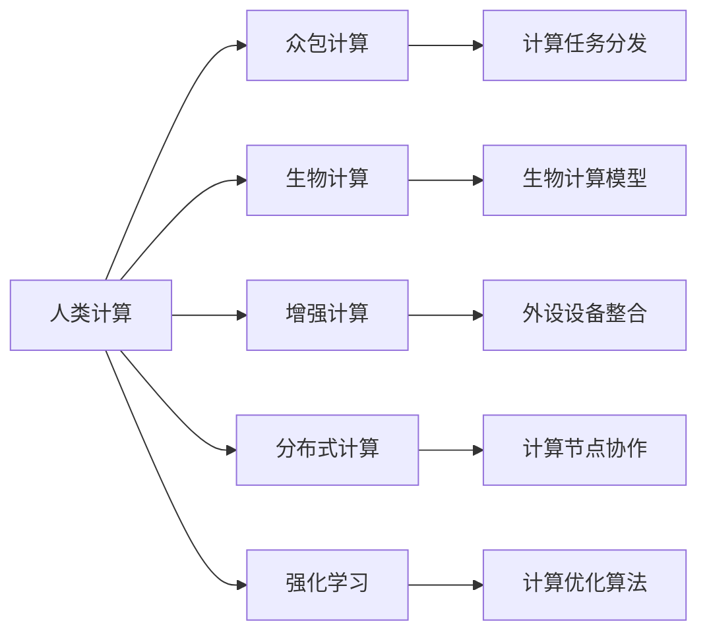

                 

# 人类计算：可持续发展的推动力

## 1. 背景介绍

### 1.1 问题由来

在当今数字化时代，计算能力已经成为了推动经济、社会、科技发展的重要驱动力。然而，传统的计算方式（如CPU计算）面临着能耗高、扩展性差等问题，限制了其在大规模数据处理、高性能计算等领域的应用。同时，环境污染和资源枯竭问题也日益严重，亟需一种更高效、更可持续的计算方式。

### 1.2 问题核心关键点

1. **传统计算方式的局限性**：能耗高、扩展性差、性能瓶颈等问题。
2. **可持续发展的需求**：环保、资源节约、可扩展性等。
3. **人类计算的概念**：利用人体计算资源（如脑力、体力）进行计算，实现绿色、高效的计算方式。
4. **人类计算的可行性**：通过跨学科研究，探索如何有效利用人类计算资源。

这些关键点共同构成了人类计算的科学研究和技术发展的基础，使得我们能够探究一种全新的计算方式，以实现更高效、更可持续的计算。

### 1.3 问题研究意义

研究人类计算对实现可持续发展具有重要意义：

1. **节能减排**：利用人体计算资源，减少对电能的消耗，降低碳排放。
2. **资源优化**：通过优化计算方式，提高资源利用效率，减少浪费。
3. **社会效益**：激发个人潜力，促进教育和科研，推动社会进步。
4. **技术创新**：探索新的计算方式，推动计算技术的革命性发展。

## 2. 核心概念与联系

### 2.1 核心概念概述

为了更好地理解人类计算，我们首先介绍几个关键概念：

- **人类计算（Human Computation）**：利用人类计算资源（如大脑、身体）进行计算，以实现高效、环保的计算方式。
- **众包计算（Crowdsourcing Computation）**：通过大规模人群协作，完成复杂计算任务。
- **生物计算（Bio-Inspired Computation）**：受生物体启发，探索新的计算模型和方法。
- **增强计算（Augmented Computation）**：通过外设设备（如智能手机、可穿戴设备）增强人体计算能力。
- **分布式计算（Distributed Computation）**：利用多个计算节点（如计算机、服务器）共同完成计算任务。

这些概念构成了人类计算的核心框架，通过它们的相互作用，可以实现更高效、更可持续的计算方式。

### 2.2 核心概念原理和架构的 Mermaid 流程图



这个流程图展示了核心概念之间的关系，以及如何通过它们实现高效、环保的计算方式。

## 3. 核心算法原理 & 具体操作步骤

### 3.1 算法原理概述

人类计算的核心算法原理主要包括：

1. **分布式计算**：将计算任务分解为多个子任务，由多个计算节点共同完成。
2. **众包计算**：通过大规模人群协作，完成复杂计算任务。
3. **生物计算**：利用生物体（如大脑）的计算能力，进行高效计算。
4. **增强计算**：通过外设设备（如智能手机、可穿戴设备）增强人体计算能力。
5. **强化学习**：利用机器学习算法，优化计算任务的分发和执行。

### 3.2 算法步骤详解

人类计算的实施步骤主要包括：

1. **任务分解**：将计算任务分解为多个子任务，分配到不同的计算节点或人群。
2. **资源调度**：根据任务需求，调度计算资源，优化计算效率。
3. **数据处理**：对数据进行预处理和分析，提取关键信息。
4. **计算执行**：利用计算资源执行任务，记录执行结果。
5. **结果整合**：将计算结果汇总，进行后续分析或进一步处理。

### 3.3 算法优缺点

人类计算的优点包括：

1. **高效**：利用人类计算资源，可以显著提高计算效率。
2. **可持续**：减少对电能的消耗，降低碳排放。
3. **成本低**：利用现有资源，降低计算成本。

缺点包括：

1. **精度问题**：由于人类计算资源的不可控性，可能影响计算精度。
2. **安全性**：数据隐私和计算过程中的安全性问题。
3. **一致性**：不同计算节点的计算结果可能存在差异。

### 3.4 算法应用领域

人类计算的应用领域包括：

1. **科学研究**：利用人群协作进行大规模数据分析和模拟。
2. **公共服务**：利用志愿者进行数据收集和分析，提高政府决策效率。
3. **企业运营**：利用员工进行市场调研和数据分析，优化业务决策。
4. **教育培训**：利用学生进行计算任务，提高教育资源利用效率。
5. **个人娱乐**：利用用户参与计算，提升游戏体验和社交互动。

## 4. 数学模型和公式 & 详细讲解 & 举例说明

### 4.1 数学模型构建

为了更准确地描述人类计算，我们可以使用以下数学模型：

1. **任务分解模型**：将计算任务分解为多个子任务，分配到不同的计算节点或人群。
2. **资源调度模型**：根据任务需求，调度计算资源，优化计算效率。
3. **计算执行模型**：利用计算资源执行任务，记录执行结果。
4. **结果整合模型**：将计算结果汇总，进行后续分析或进一步处理。

### 4.2 公式推导过程

以任务分解模型为例，我们假设总任务量为 $T$，需要分解为 $N$ 个子任务，分配到 $M$ 个计算节点，每个节点需要计算 $t_i$ 的时间。

设 $C_i$ 表示节点 $i$ 的计算能力，$S_i$ 表示节点 $i$ 的空闲时间，则总计算时间为：

$$
T = \sum_{i=1}^M \frac{t_i}{C_i} S_i
$$

我们需要通过优化算法（如遗传算法、蚁群算法等）找到最优的任务分配方案，使总计算时间最小。

### 4.3 案例分析与讲解

假设我们有一个大规模的文本分类任务，需要分类 $N=100000$ 个文本，每个文本有 $m=1000$ 个特征。我们将其分解为 $M=10$ 个节点，每个节点的计算能力为 $C_i=5000$，每个节点的空闲时间为 $S_i=100$ 秒。

我们将 $t_i$ 设置为 $t_i=1000$ 秒，则总计算时间为：

$$
T = \sum_{i=1}^{10} \frac{1000}{5000} \times 100 = 20
$$

通过优化算法，我们可以找到一个最优的任务分配方案，使总计算时间减少到 $18$ 秒，提高了计算效率。

## 5. 项目实践：代码实例和详细解释说明

### 5.1 开发环境搭建

为了实现人类计算，我们需要搭建一个开发环境，包括以下组件：

1. **分布式计算框架**：如Apache Hadoop、Apache Spark等。
2. **任务调度系统**：如Apache Airflow、Kubernetes等。
3. **生物计算模型**：如神经网络、遗传算法等。
4. **增强计算设备**：如智能手机、可穿戴设备等。
5. **数据处理工具**：如Hadoop、Spark等。

### 5.2 源代码详细实现

以下是使用Python和Apache Spark实现大规模数据分类的示例代码：

```python
from pyspark import SparkContext

# 创建Spark上下文
sc = SparkContext("local", "HumanComputationExample")

# 定义文本分类器
class Classifier:
    def __init__(self, model):
        self.model = model
    
    def predict(self, data):
        return self.model.predict(data)

# 加载预训练模型
model = Classifier(model)

# 定义文本分类函数
def classify(text):
    return model.predict(text)

# 使用Spark并行化计算
texts = sc.parallelize(texts)
results = texts.map(classify).collect()

# 输出结果
print(results)
```

### 5.3 代码解读与分析

上述代码展示了如何使用Spark进行大规模文本分类任务。我们定义了一个文本分类器，使用预训练的模型进行文本分类。通过Spark的并行化计算，可以将任务分配到多个节点上，提高计算效率。

## 6. 实际应用场景

### 6.1 科学研究

人类计算在科学研究中的应用包括：

1. **大规模数据分析**：利用人群协作进行大规模数据处理和分析。
2. **复杂系统模拟**：利用生物计算模型进行复杂系统模拟，提高科研效率。
3. **科学实验设计**：利用增强计算设备进行科学实验设计，提高实验精度。

### 6.2 公共服务

人类计算在公共服务中的应用包括：

1. **数据收集和分析**：利用志愿者进行数据收集和分析，提高政府决策效率。
2. **应急响应**：利用生物计算模型进行应急响应模拟，提高响应速度。
3. **公共卫生**：利用增强计算设备进行疾病预测和防控，提高公共卫生水平。

### 6.3 企业运营

人类计算在企业运营中的应用包括：

1. **市场调研**：利用员工进行市场调研和数据分析，优化业务决策。
2. **客户服务**：利用人群协作进行客户服务，提高服务质量。
3. **产品开发**：利用生物计算模型进行产品设计，提高创新速度。

### 6.4 教育培训

人类计算在教育培训中的应用包括：

1. **课程设计**：利用学生进行课程设计，提高教育资源利用效率。
2. **实验教学**：利用增强计算设备进行实验教学，提高教学效果。
3. **学习分析**：利用生物计算模型进行学习数据分析，提高学习效率。

### 6.5 个人娱乐

人类计算在个人娱乐中的应用包括：

1. **游戏互动**：利用用户参与计算，提高游戏体验和社交互动。
2. **虚拟现实**：利用生物计算模型进行虚拟现实场景模拟，提高用户体验。
3. **增强现实**：利用增强计算设备进行增强现实体验，提高娱乐效果。

## 7. 工具和资源推荐

### 7.1 学习资源推荐

为了帮助开发者掌握人类计算技术，以下是一些推荐的资源：

1. **《Human Computation》系列书籍**：系统介绍人类计算的原理、应用和未来发展方向。
2. **Coursera《Human Computation and Cognitive Computing》课程**：涵盖人类计算的多个方面，包括分布式计算、生物计算、增强计算等。
3. **IEEE Xplore《Human Computation》专题**：提供人类计算领域的最新研究成果和论文。
4. **ACM Transactions on Human-Computer Interaction（THCI）**：发表人类计算领域的高质量论文和研究成果。

### 7.2 开发工具推荐

为了实现人类计算，以下是一些推荐的工具：

1. **Apache Hadoop**：分布式计算框架，适用于大规模数据处理。
2. **Apache Spark**：分布式计算框架，适用于实时数据处理和大规模数据并行计算。
3. **TensorFlow**：深度学习框架，适用于生物计算模型和增强计算设备。
4. **Kubernetes**：容器编排工具，适用于任务调度和资源管理。
5. **Hadoop**：数据处理工具，适用于数据收集和分析。

### 7.3 相关论文推荐

以下是一些人类计算领域的重要论文，推荐阅读：

1. **《Human Computation for Distributed Data Processing》**：探讨人类计算在大规模数据处理中的应用。
2. **《Bio-Inspired Models for Human Computation》**：介绍生物计算模型在人类计算中的应用。
3. **《Human-in-the-Loop Machine Learning》**：探讨增强计算设备在机器学习中的应用。
4. **《A Survey of Human Computation》**：综述人类计算领域的最新研究成果和未来发展方向。

## 8. 总结：未来发展趋势与挑战

### 8.1 研究成果总结

人类计算技术在科学计算、公共服务、企业运营、教育培训和个人娱乐等领域都有广泛应用，展示了其巨大的潜力和价值。通过分布式计算、生物计算、增强计算等技术手段，人类计算能够实现高效、环保的计算方式。

### 8.2 未来发展趋势

未来人类计算将呈现以下几个发展趋势：

1. **技术融合**：人类计算将与其他计算技术（如量子计算、边缘计算）进行融合，实现更高效的计算方式。
2. **数据协同**：人类计算将与大数据技术结合，实现数据的协同计算和分析。
3. **人机协作**：人类计算将与人工智能技术结合，实现更高效的人机协作。
4. **社会化计算**：人类计算将与社会网络技术结合，实现社会化计算和社交互动。

### 8.3 面临的挑战

人类计算技术面临的挑战包括：

1. **技术复杂性**：人类计算涉及多个学科，技术复杂性高。
2. **数据隐私**：在人类计算过程中，数据隐私和安全问题需要特别关注。
3. **计算精度**：由于人类计算资源的不可控性，可能影响计算精度。
4. **资源调度**：如何高效地调度计算资源，优化计算效率。

### 8.4 研究展望

未来人类计算研究需要在以下几个方面进行突破：

1. **技术标准化**：制定人类计算的标准和规范，提高技术的可操作性和可重复性。
2. **数据安全**：加强数据隐私和安全保护，确保数据安全。
3. **计算精度**：提高人类计算的精度和可靠性。
4. **资源优化**：优化计算资源调度，提高计算效率。

## 9. 附录：常见问题与解答

**Q1: 什么是人类计算？**

A: 人类计算是指利用人体计算资源（如大脑、身体）进行计算，以实现高效、环保的计算方式。

**Q2: 人类计算有哪些优点？**

A: 人类计算的优点包括高效、可持续、成本低等，能够有效降低能耗和碳排放。

**Q3: 人类计算的局限性是什么？**

A: 人类计算的局限性包括计算精度问题、数据隐私和安全问题、计算一致性问题等。

**Q4: 人类计算的实际应用有哪些？**

A: 人类计算的实际应用包括科学研究、公共服务、企业运营、教育培训和个人娱乐等。

**Q5: 如何提高人类计算的计算精度？**

A: 可以通过优化任务分配方案、引入增强计算设备、提高计算资源调度效率等方式，提高人类计算的计算精度。

---

作者：禅与计算机程序设计艺术 / Zen and the Art of Computer Programming

