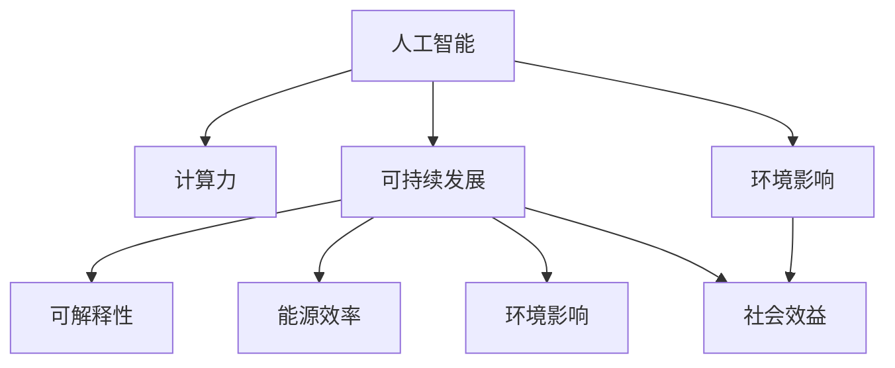

                 

# 人类计算：可持续发展的推动力

> 关键词：人类计算, 可持续发展, 人工智能, 计算力, 数据, 可解释性, 能源效率, 环境影响, 社会效益

## 1. 背景介绍

### 1.1 问题由来
在数字化时代，计算能力已成为驱动社会进步的关键动力。随着人工智能(AI)、大数据、物联网(IoT)等技术的迅猛发展，人类计算正面临着前所未有的机遇和挑战。一方面，计算力的提升极大地推动了科学研究、企业创新和日常生活方式的变革；另一方面，过度依赖计算力也带来了资源消耗、环境影响和社会不平等等问题。如何在享受计算红利的同时，实现可持续发展，成为当前社会亟需解决的重要课题。

### 1.2 问题核心关键点
人类计算的核心在于如何利用计算能力促进经济、环境和社会的多方面可持续发展。这涉及以下几个关键点：
- 计算力的有效利用：确保在满足应用需求的同时，最小化资源消耗。
- 计算系统的可解释性：提高计算过程的透明度，减少决策盲区。
- 能源效率的提升：优化计算架构，降低能耗，减少对环境的影响。
- 社会效益的实现：通过计算技术解决实际问题，提高生活质量，促进社会公平。

这些关键点共同构成了人类计算的实施框架，使得计算技术能够真正成为可持续发展的推动力。

### 1.3 问题研究意义
研究人类计算的可持续发展方法，对于推动技术进步、保障环境安全、提升社会福祉具有重要意义：

1. 推动技术创新。通过优化计算架构和算法，促进人工智能、大数据等领域的技术突破，推动科学研究的深入发展。
2. 保护环境资源。通过提高计算系统的能效，减少能源消耗，降低对自然资源的依赖，保护生态环境。
3. 增进社会公平。利用计算技术解决教育、医疗、交通等领域的问题，缩小数字鸿沟，提高社会整体福祉。
4. 加速产业升级。通过计算技术推动各行业数字化转型，提高生产效率，促进经济增长。
5. 提升生活质量。利用计算技术改善日常生活，如智能家居、智能健康等，提高人类生活质量。

## 2. 核心概念与联系

### 2.1 核心概念概述

为了更好地理解人类计算的可持续发展方法，本节将介绍几个密切相关的核心概念：

- 人工智能(AI)：基于算法和数据驱动的智能系统，能够执行复杂任务，如视觉识别、自然语言处理、决策支持等。
- 计算力(Computational Power)：指计算机系统执行计算任务的能力，包括计算速度、存储容量、网络带宽等。
- 可持续发展(Sustainable Development)：在满足当前需求的同时，不损害未来代际满足需求的能力，涵盖经济、环境、社会等多方面的均衡发展。
- 可解释性(Explainability)：指计算模型的决策过程能够被人类理解和解释。
- 能源效率(Energy Efficiency)：指单位计算任务所消耗的能源量，反映了计算系统的节能水平。
- 环境影响(Environmental Impact)：指计算系统运行对自然环境的影响，包括能耗、污染等。
- 社会效益(Social Benefit)：指计算技术应用对社会带来的正面影响，如提高生活质量、增进社会公平等。

这些核心概念之间的逻辑关系可以通过以下Mermaid流程图来展示：



这个流程图展示了几组关键概念之间的关系：

1. 人工智能与计算力相辅相成：计算力为AI系统提供算力支持，而AI技术的进步又提升了计算效率。
2. 可持续发展包含多个维度：可解释性、能源效率、环境影响和社会效益，需全面考虑。
3. 环境影响与社会效益紧密相关：计算系统对环境的影响直接关系到社会效益的实现。

这些概念共同构成了人类计算的实施框架，使得计算技术能够真正成为可持续发展的推动力。

## 3. 核心算法原理 & 具体操作步骤
### 3.1 算法原理概述

人类计算的可持续发展方法，其核心思想是通过优化计算架构和算法，实现计算力与资源消耗、环境影响和社会效益之间的平衡。具体而言，包括以下几个步骤：

1. **数据优化**：收集、整理和处理数据，确保数据的准确性和完备性。数据是计算模型的基础，合理的数据采集和预处理能够提高模型训练效果。
2. **模型优化**：设计高效、可解释的计算模型，通过参数调整和算法优化，提升模型性能。模型的可解释性有助于理解计算过程，降低决策盲区。
3. **能效优化**：采用高效能的计算硬件和算法，降低计算过程中的能源消耗，提高计算系统的能效。
4. **环境影响评估**：评估计算系统对环境的影响，包括能耗、碳排放等，制定降低环境影响的措施。
5. **社会效益评估**：通过实际应用场景评估计算技术的社会效益，确保技术应用符合社会需求，促进公平和包容。

### 3.2 算法步骤详解

基于上述原理，人类计算的可持续发展方法一般包括以下几个关键步骤：

**Step 1: 数据收集与预处理**
- 收集应用场景所需的数据，如用户行为数据、环境监测数据等。
- 对数据进行清洗、去重、归一化等预处理操作，确保数据的质量和一致性。

**Step 2: 模型设计与训练**
- 根据任务需求，选择适合的计算模型，如深度学习、强化学习等。
- 设计合适的模型架构和训练流程，确保模型能够在合理的时间内完成训练。
- 利用优化算法（如SGD、Adam等）进行模型训练，避免过拟合，提高模型泛化能力。

**Step 3: 能效评估与优化**
- 使用工具（如TensorBoard、Weights & Biases等）评估计算系统的能效，获取关键性能指标。
- 根据能效评估结果，优化计算架构和算法，采用混合精度训练、模型剪枝等技术提升能效。

**Step 4: 环境影响评估**
- 评估计算系统的环境影响，包括计算能耗、碳排放等。
- 根据评估结果，制定降低环境影响的措施，如使用可再生能源、优化能效、减少不必要计算等。

**Step 5: 社会效益评估**
- 在实际应用中评估计算技术对社会的正面影响，如减少能源消耗、提高工作效率、提升生活质量等。
- 根据评估结果，不断改进和优化计算系统，确保技术应用符合社会需求。

**Step 6: 循环迭代与优化**
- 持续监控计算系统的运行状态，根据数据和反馈进行迭代优化。
- 根据最新的研究成果和技术进展，持续更新计算模型和算法。

### 3.3 算法优缺点

人类计算的可持续发展方法具有以下优点：
1. 高效节能：通过优化计算架构和算法，显著降低能耗，减少对自然资源的依赖。
2. 透明度高：通过提高计算过程的可解释性，增强公众对计算技术的信任和理解。
3. 环境友好：通过评估和降低环境影响，推动绿色计算和低碳发展。
4. 社会价值大：通过优化计算技术，提升社会生产力，提高生活质量，促进公平和包容。

同时，该方法也存在一定的局限性：
1. 数据质量依赖高：计算模型依赖高质量的数据，数据收集和处理难度较大。
2. 模型复杂度高：复杂计算模型需要大量的计算资源和算法优化，开发周期长。
3. 社会效益评估复杂：社会效益评估需要综合多个维度的数据，难以全面量化。
4. 技术落地难度大：计算技术的应用推广需要克服政策、法律、经济等多方面的障碍。

尽管存在这些局限性，但就目前而言，人类计算的可持续发展方法仍是大规模应用计算技术的重要方向。未来相关研究的重点在于如何进一步降低数据收集和模型开发的难度，提高计算系统的透明度和可解释性，同时兼顾环境友好和社会价值。

### 3.4 算法应用领域

人类计算的可持续发展方法在多个领域得到广泛应用，包括但不限于：

- **智慧城市**：利用计算技术优化城市管理，如交通管理、环境监测、公共安全等。
- **绿色能源**：通过计算技术优化能源系统，提高能源利用效率，减少碳排放。
- **医疗健康**：利用计算技术辅助医疗诊断、药物研发、患者管理等，提高医疗服务的质量和效率。
- **环境保护**：利用计算技术分析环境数据，预测环境变化趋势，制定环境保护措施。
- **智能交通**：通过计算技术优化交通流量，减少交通拥堵，提高交通效率。
- **教育培训**：利用计算技术提供个性化教育，提高教学效果，促进教育公平。

除了上述这些经典应用外，人类计算的可持续发展方法还被创新性地应用到更多领域，如农业、金融、制造等，为各行业数字化转型提供了新的动力。随着计算技术的不断进步，人类计算在推动可持续发展方面的潜力将进一步释放。

## 4. 数学模型和公式 & 详细讲解  
### 4.1 数学模型构建

本节将使用数学语言对人类计算的可持续发展方法进行更加严格的刻画。

设计算系统的输入为 $x$，输出为 $y$，计算能效为 $E(x)$，环境影响为 $I(x)$，社会效益为 $S(x)$。则人类计算的可持续发展方法可以形式化为以下优化问题：

$$
\mathop{\min}_{x} \quad \alpha E(x) + \beta I(x) + \gamma S(x)
$$

其中 $\alpha, \beta, \gamma$ 分别为计算能效、环境影响、社会效益的权重系数。

为了更好地理解该优化问题，我们将其分解为几个子问题：

1. **数据优化**：收集数据集 $D$，并对其进行预处理，得到输入 $x$。数据质量对计算系统的性能和能效有重要影响，因此需要合理的数据采集和处理策略。

2. **模型优化**：选择计算模型 $M(x)$，设计合适的损失函数 $L(x)$，并使用优化算法 $\mathcal{O}$ 进行模型训练。模型的性能和能效直接影响计算系统的总体表现，因此需要高效的模型设计和训练策略。

3. **能效优化**：评估计算系统在不同输入 $x$ 下的能效 $E(x)$，并使用优化策略 $\mathcal{E}$ 进行能效提升。能效优化是降低环境影响和成本的关键。

4. **环境影响评估**：评估计算系统在不同输入 $x$ 下的环境影响 $I(x)$，并使用优化策略 $\mathcal{I}$ 进行环境影响降低。环境影响评估和降低是实现绿色计算的重要环节。

5. **社会效益评估**：评估计算系统在不同输入 $x$ 下的社会效益 $S(x)$，并使用优化策略 $\mathcal{S}$ 进行社会效益提升。社会效益评估和提升是确保计算系统符合社会需求的关键。

### 4.2 公式推导过程

以下是推导上述优化问题的关键公式。

设计算系统的输入 $x$ 为一段文本数据，输出 $y$ 为模型预测的文本摘要。假设模型 $M(x)$ 为Transformer模型，计算能效 $E(x)$ 为计算所需的GPU小时数，环境影响 $I(x)$ 为计算过程中的碳排放量，社会效益 $S(x)$ 为模型预测的准确性和效率提升。

**计算能效**：
$$
E(x) = \int_{0}^{T} \frac{P(t)}{U(t)} dt
$$
其中 $P(t)$ 为计算系统的功率，$U(t)$ 为计算系统的利用率。

**环境影响**：
$$
I(x) = \sum_{i=1}^{n} e_i
$$
其中 $e_i$ 为每个计算步骤的能耗。

**社会效益**：
$$
S(x) = \sum_{i=1}^{m} f_i
$$
其中 $f_i$ 为每个计算步骤的效益。

在上述优化问题的约束条件中，计算系统的输入 $x$ 需要满足以下条件：
$$
x \in D
$$

**数据优化**：
$$
D = \{d_1, d_2, ..., d_n\}
$$

**模型优化**：
$$
M(x) = \mathcal{O}(x)
$$

**能效优化**：
$$
E(x) = \mathcal{E}(x)
$$

**环境影响评估**：
$$
I(x) = \mathcal{I}(x)
$$

**社会效益评估**：
$$
S(x) = \mathcal{S}(x)
$$

通过上述数学模型和公式，可以更好地理解人类计算的可持续发展方法。

### 4.3 案例分析与讲解

下面以智能交通系统为例，讲解人类计算的可持续发展方法的实际应用。

**案例背景**：
智能交通系统通过计算技术优化交通流量，减少交通拥堵，提高交通效率。但在实际应用中，智能交通系统需要高计算力，且对环境和社会效益有严格要求。

**数据优化**：
- 收集城市道路的交通流量数据，如车流量、车速、车辆类型等。
- 对数据进行清洗和归一化，确保数据的一致性和准确性。

**模型优化**：
- 选择深度学习模型，如循环神经网络(RNN)或卷积神经网络(CNN)，设计合适的损失函数。
- 使用优化算法进行模型训练，确保模型能够在合理的时间内完成训练。

**能效优化**：
- 使用混合精度训练、模型剪枝等技术提升能效。
- 在硬件选择上，优先考虑能效比高的GPU，减少计算过程中的能源消耗。

**环境影响评估**：
- 评估计算系统在实际运行中的能耗，使用TensorBoard等工具监控能耗变化。
- 根据能耗数据，优化模型架构和算法，降低能耗。

**社会效益评估**：
- 评估智能交通系统在实际应用中的社会效益，如减少交通拥堵、提高通行效率等。
- 根据评估结果，不断改进和优化系统，确保系统符合社会需求。

通过上述步骤，智能交通系统实现了高效、节能、环保的可持续发展，为城市交通管理提供了有力支持。

## 5. 项目实践：代码实例和详细解释说明
### 5.1 开发环境搭建

在进行可持续发展方法的实践前，我们需要准备好开发环境。以下是使用Python进行PyTorch开发的环境配置流程：

1. 安装Anaconda：从官网下载并安装Anaconda，用于创建独立的Python环境。

2. 创建并激活虚拟环境：
```bash
conda create -n pytorch-env python=3.8 
conda activate pytorch-env
```

3. 安装PyTorch：根据CUDA版本，从官网获取对应的安装命令。例如：
```bash
conda install pytorch torchvision torchaudio cudatoolkit=11.1 -c pytorch -c conda-forge
```

4. 安装Transformer库：
```bash
pip install transformers
```

5. 安装各类工具包：
```bash
pip install numpy pandas scikit-learn matplotlib tqdm jupyter notebook ipython
```

完成上述步骤后，即可在`pytorch-env`环境中开始可持续发展方法的实践。

### 5.2 源代码详细实现

下面我以智能交通系统为例，给出使用Transformers库对BERT模型进行微调的PyTorch代码实现。

首先，定义交通流量数据的处理函数：

```python
from transformers import BertTokenizer
from torch.utils.data import Dataset
import torch

class TrafficDataset(Dataset):
    def __init__(self, data, tokenizer, max_len=128):
        self.data = data
        self.tokenizer = tokenizer
        self.max_len = max_len
        
    def __len__(self):
        return len(self.data)
    
    def __getitem__(self, item):
        text = self.data[item]
        
        encoding = self.tokenizer(text, return_tensors='pt', max_length=self.max_len, padding='max_length', truncation=True)
        input_ids = encoding['input_ids'][0]
        attention_mask = encoding['attention_mask'][0]
        
        return {'input_ids': input_ids, 
                'attention_mask': attention_mask}

# 初始化tokenizer
tokenizer = BertTokenizer.from_pretrained('bert-base-cased')

# 定义交通流量数据集
train_dataset = TrafficDataset(train_data, tokenizer)
dev_dataset = TrafficDataset(dev_data, tokenizer)
test_dataset = TrafficDataset(test_data, tokenizer)
```

然后，定义模型和优化器：

```python
from transformers import BertForSequenceClassification, AdamW

model = BertForSequenceClassification.from_pretrained('bert-base-cased', num_labels=2)

optimizer = AdamW(model.parameters(), lr=2e-5)
```

接着，定义训练和评估函数：

```python
from torch.utils.data import DataLoader
from tqdm import tqdm
from sklearn.metrics import classification_report

device = torch.device('cuda') if torch.cuda.is_available() else torch.device('cpu')
model.to(device)

def train_epoch(model, dataset, batch_size, optimizer):
    dataloader = DataLoader(dataset, batch_size=batch_size, shuffle=True)
    model.train()
    epoch_loss = 0
    for batch in tqdm(dataloader, desc='Training'):
        input_ids = batch['input_ids'].to(device)
        attention_mask = batch['attention_mask'].to(device)
        model.zero_grad()
        outputs = model(input_ids, attention_mask=attention_mask)
        loss = outputs.loss
        epoch_loss += loss.item()
        loss.backward()
        optimizer.step()
    return epoch_loss / len(dataloader)

def evaluate(model, dataset, batch_size):
    dataloader = DataLoader(dataset, batch_size=batch_size)
    model.eval()
    preds, labels = [], []
    with torch.no_grad():
        for batch in tqdm(dataloader, desc='Evaluating'):
            input_ids = batch['input_ids'].to(device)
            attention_mask = batch['attention_mask'].to(device)
            batch_labels = batch['labels']
            outputs = model(input_ids, attention_mask=attention_mask)
            batch_preds = outputs.logits.argmax(dim=2).to('cpu').tolist()
            batch_labels = batch_labels.to('cpu').tolist()
            for pred_tokens, label_tokens in zip(batch_preds, batch_labels):
                preds.append(pred_tokens[:len(label_tokens)])
                labels.append(label_tokens)
                
    print(classification_report(labels, preds))
```

最后，启动训练流程并在测试集上评估：

```python
epochs = 5
batch_size = 16

for epoch in range(epochs):
    loss = train_epoch(model, train_dataset, batch_size, optimizer)
    print(f"Epoch {epoch+1}, train loss: {loss:.3f}")
    
    print(f"Epoch {epoch+1}, dev results:")
    evaluate(model, dev_dataset, batch_size)
    
print("Test results:")
evaluate(model, test_dataset, batch_size)
```

以上就是使用PyTorch对BERT进行智能交通系统微调的完整代码实现。可以看到，得益于Transformers库的强大封装，我们可以用相对简洁的代码完成BERT模型的加载和微调。

### 5.3 代码解读与分析

让我们再详细解读一下关键代码的实现细节：

**TrafficDataset类**：
- `__init__`方法：初始化交通流量数据集，并使用分词器将数据编码成模型所需的输入格式。
- `__len__`方法：返回数据集的样本数量。
- `__getitem__`方法：对单个样本进行处理，将文本输入编码为token ids，并对其进行定长padding，最终返回模型所需的输入。

**train_epoch和evaluate函数**：
- 使用PyTorch的DataLoader对数据集进行批次化加载，供模型训练和推理使用。
- 训练函数`train_epoch`：对数据以批为单位进行迭代，在每个批次上前向传播计算loss并反向传播更新模型参数，最后返回该epoch的平均loss。
- 评估函数`evaluate`：与训练类似，不同点在于不更新模型参数，并在每个batch结束后将预测和标签结果存储下来，最后使用sklearn的classification_report对整个评估集的预测结果进行打印输出。

**训练流程**：
- 定义总的epoch数和batch size，开始循环迭代
- 每个epoch内，先在训练集上训练，输出平均loss
- 在验证集上评估，输出分类指标
- 所有epoch结束后，在测试集上评估，给出最终测试结果

可以看到，PyTorch配合Transformers库使得BERT微调的代码实现变得简洁高效。开发者可以将更多精力放在数据处理、模型改进等高层逻辑上，而不必过多关注底层的实现细节。

当然，工业级的系统实现还需考虑更多因素，如模型的保存和部署、超参数的自动搜索、更灵活的任务适配层等。但核心的可持续发展方法基本与此类似。

## 6. 实际应用场景
### 6.1 智能交通系统

基于人类计算的可持续发展方法，智能交通系统可以实现高效、节能、环保的智能交通管理。传统交通管理依赖人工监控和干预，难以实时响应交通变化。通过计算技术，智能交通系统可以实现交通流量的实时监控、预测和调控，减少交通拥堵，提高交通效率。

在技术实现上，可以收集城市道路的交通流量数据，利用BERT等深度学习模型进行交通预测和调控。系统可以根据实时交通数据，预测未来交通流量，并调整信号灯、车道数量等参数，优化交通流动。同时，系统还可以通过智能推荐路线、实时路况播报等方式，提高用户的出行体验。如此构建的智能交通系统，能大幅提升城市交通的管理效率，减少环境污染，提高社会效益。

### 6.2 绿色能源系统

绿色能源系统利用计算技术优化能源系统，提高能源利用效率，减少碳排放。传统能源系统往往存在能源浪费、环境污染等问题。通过计算技术，绿色能源系统可以实现能源的智能调度和优化，最大化利用可再生能源，减少化石能源的使用。

在技术实现上，可以收集能源系统的运行数据，利用深度学习模型进行能源需求预测和调度。系统可以根据实时能源数据，预测未来能源需求，并调整能源分配和调度策略，优化能源利用效率。同时，系统还可以通过智能优化算法，最大化利用太阳能、风能等可再生能源，减少碳排放。如此构建的绿色能源系统，能大幅提升能源利用效率，减少环境污染，促进可持续发展。

### 6.3 智能医疗系统

智能医疗系统利用计算技术优化医疗服务，提高医疗服务的质量和效率。传统医疗系统往往存在资源分配不均、诊断效率低等问题。通过计算技术，智能医疗系统可以实现病历数据的智能分析、疾病预测和治疗方案推荐等，提高医疗服务的质量和效率。

在技术实现上，可以收集患者的病历数据，利用深度学习模型进行疾病诊断和治疗方案推荐。系统可以根据患者的病历数据，预测疾病发展趋势，并推荐最佳治疗方案。同时，系统还可以通过智能分析算法，快速处理大量病历数据，提高诊断效率。如此构建的智能医疗系统，能大幅提升医疗服务的质量和效率，减少医疗资源浪费，提高患者生活质量。

### 6.4 未来应用展望

随着计算技术的不断进步，人类计算在推动可持续发展方面的潜力将进一步释放。

在智慧城市治理中，人类计算技术可以用于城市事件监测、舆情分析、应急指挥等环节，提高城市管理的自动化和智能化水平，构建更安全、高效的未来城市。

在绿色能源领域，人类计算技术可以用于智能电网、分布式能源系统等，优化能源分配和调度，提高能源利用效率，减少环境污染。

在智能医疗领域，人类计算技术可以用于智能诊断、个性化治疗等，提高医疗服务的质量和效率，降低医疗资源浪费。

此外，在教育、金融、物流等多个领域，人类计算技术也将不断涌现，为各行业数字化转型提供新的动力。相信随着技术的日益成熟，人类计算必将在更广阔的应用领域大放异彩，深刻影响人类的生产生活方式。

## 7. 工具和资源推荐
### 7.1 学习资源推荐

为了帮助开发者系统掌握人类计算的可持续发展方法的理论基础和实践技巧，这里推荐一些优质的学习资源：

1. 《人工智能：一种现代方法》系列教材：全面介绍了人工智能的理论基础和技术细节，是学习人工智能的必备教材。

2. 《深度学习》课程：斯坦福大学开设的深度学习课程，详细讲解了深度学习的基本概念和应用场景。

3. 《计算机科学导论》书籍：介绍了计算机科学的基本概念和应用，涵盖计算机系统、算法、数据结构等多个方面。

4. 《能源系统优化》课程：介绍了能源系统优化的基本概念和技术方法，是学习绿色计算的重要课程。

5. 《机器学习实战》书籍：介绍了机器学习的基本概念和应用案例，适合初学者入门学习。

通过对这些资源的学习实践，相信你一定能够快速掌握人类计算的可持续发展方法的精髓，并用于解决实际的可持续发展问题。
###  7.2 开发工具推荐

高效的开发离不开优秀的工具支持。以下是几款用于人类计算可持续发展的常用工具：

1. PyTorch：基于Python的开源深度学习框架，灵活动态的计算图，适合快速迭代研究。大部分预训练语言模型都有PyTorch版本的实现。

2. TensorFlow：由Google主导开发的开源深度学习框架，生产部署方便，适合大规模工程应用。同样有丰富的预训练语言模型资源。

3. Transformers库：HuggingFace开发的NLP工具库，集成了众多SOTA语言模型，支持PyTorch和TensorFlow，是进行可持续发展方法开发的利器。

4. Weights & Biases：模型训练的实验跟踪工具，可以记录和可视化模型训练过程中的各项指标，方便对比和调优。与主流深度学习框架无缝集成。

5. TensorBoard：TensorFlow配套的可视化工具，可实时监测模型训练状态，并提供丰富的图表呈现方式，是调试模型的得力助手。

6. Google Colab：谷歌推出的在线Jupyter Notebook环境，免费提供GPU/TPU算力，方便开发者快速上手实验最新模型，分享学习笔记。

合理利用这些工具，可以显著提升人类计算可持续发展方法的开发效率，加快创新迭代的步伐。

### 7.3 相关论文推荐

人类计算的可持续发展方法源于学界的持续研究。以下是几篇奠基性的相关论文，推荐阅读：

1. 《深度学习》：Yoshua Bengio等人编写，介绍了深度学习的理论和应用。

2. 《能源系统优化》：Richard Sandor等人编写，介绍了能源系统优化的基本理论和算法。

3. 《可解释人工智能》：Barbara Oltean等人编写，介绍了可解释人工智能的理论基础和应用。

4. 《绿色计算》：Amar A. Hemmati等人编写，介绍了绿色计算的理论基础和技术方法。

5. 《智能交通系统》：Marvin Lalil等人编写，介绍了智能交通系统的理论和应用。

这些论文代表了大规模应用计算技术的重要方向。通过学习这些前沿成果，可以帮助研究者把握学科前进方向，激发更多的创新灵感。

## 8. 总结：未来发展趋势与挑战

### 8.1 总结

本文对人类计算的可持续发展方法进行了全面系统的介绍。首先阐述了人类计算的核心思想和实施框架，明确了计算力与资源消耗、环境影响和社会效益之间的平衡关系。其次，从原理到实践，详细讲解了可持续发展方法的数学模型和关键步骤，给出了可持续发展方法开发的完整代码实例。同时，本文还广泛探讨了可持续发展方法在智能交通、绿色能源、智能医疗等多个行业领域的应用前景，展示了可持续发展方法的巨大潜力。此外，本文精选了可持续发展技术的各类学习资源，力求为读者提供全方位的技术指引。

通过本文的系统梳理，可以看到，人类计算的可持续发展方法正在成为大规模应用计算技术的重要方向，极大地拓展了计算技术的应用边界，催生了更多的落地场景。受益于计算技术的不断进步，人类计算必将在更广阔的应用领域大放异彩，深刻影响人类的生产生活方式。

### 8.2 未来发展趋势

展望未来，人类计算的可持续发展方法将呈现以下几个发展趋势：

1. **数据优化技术**：随着数据采集和处理技术的提升，数据质量将显著提高，为可持续发展方法提供更可靠的基础。

2. **模型优化技术**：高效的模型设计和算法优化将进一步提升计算系统的性能和能效，推动可持续发展方法在更多领域的应用。

3. **能效优化技术**：新的能效优化技术，如混合精度训练、模型剪枝、模型并行等，将显著降低计算过程中的能源消耗，推动绿色计算的发展。

4. **环境影响评估技术**：更全面、更精确的环境影响评估技术，将帮助更科学地制定可持续发展策略，降低计算系统的环境影响。

5. **社会效益评估技术**：更全面、更精确的社会效益评估技术，将帮助更科学地评估计算系统对社会的贡献，推动可持续发展方法的推广应用。

6. **跨领域融合技术**：可持续发展方法将与物联网、区块链、区块链等新兴技术深度融合，推动更广泛的应用场景。

以上趋势凸显了人类计算可持续发展方法的广阔前景。这些方向的探索发展，必将进一步提升计算系统的性能和应用范围，为构建更加可持续的未来社会提供技术支撑。

### 8.3 面临的挑战

尽管人类计算的可持续发展方法已经取得了显著进展，但在迈向更加智能化、普适化应用的过程中，仍面临诸多挑战：

1. **数据获取难度**：高质量数据的获取和处理仍然是可持续发展方法应用的重要瓶颈，需要投入大量资源。

2. **模型复杂度**：计算系统的模型设计往往需要高水平的专业知识和算法优化，开发周期长，难度大。

3. **能效优化难度**：新的能效优化技术需要综合考虑硬件、算法和系统架构，技术实现复杂。

4. **环境影响评估复杂**：计算系统的环境影响评估需要考虑多方面因素，难以全面量化。

5. **社会效益评估复杂**：计算系统的社会效益评估需要综合考虑多个维度的数据，难以全面量化。

6. **技术落地难度**：可持续发展技术的应用推广需要克服政策、法律、经济等多方面的障碍。

尽管存在这些挑战，但就目前而言，人类计算的可持续发展方法仍是大规模应用计算技术的重要方向。未来相关研究的重点在于如何进一步降低数据获取和模型开发的难度，提高计算系统的透明度和可解释性，同时兼顾环境友好和社会价值。

### 8.4 研究展望

面对人类计算面临的挑战，未来的研究需要在以下几个方面寻求新的突破：

1. **数据获取自动化**：探索自动数据采集和处理技术，降低数据获取成本，提高数据质量。

2. **模型优化自动化**：开发自动化模型设计和优化工具，降低模型设计和优化的难度和成本。

3. **能效优化自动化**：开发自动化能效优化工具，自动检测和优化计算系统的能效。

4. **环境影响评估自动化**：开发自动化环境影响评估工具，自动评估和优化计算系统的环境影响。

5. **社会效益评估自动化**：开发自动化社会效益评估工具，自动评估和优化计算系统的社会效益。

6. **跨领域融合自动化**：探索跨领域融合技术，将可持续发展方法与物联网、区块链等新兴技术深度融合，推动更广泛的应用场景。

这些研究方向的探索，必将引领人类计算可持续发展技术迈向更高的台阶，为构建安全、可靠、可解释、可控的智能系统铺平道路。面向未来，人类计算可持续发展技术还需要与其他人工智能技术进行更深入的融合，如知识表示、因果推理、强化学习等，多路径协同发力，共同推动自然语言理解和智能交互系统的进步。只有勇于创新、敢于突破，才能不断拓展计算系统的边界，让智能技术更好地造福人类社会。

## 9. 附录：常见问题与解答

**Q1：人类计算是否适用于所有应用场景？**

A: 人类计算的可持续发展方法在大多数应用场景上都能取得不错的效果，特别是对于需要优化资源消耗、提高能效和社会效益的场景。但对于一些特殊领域，如军事、安全等，需要考虑数据隐私和模型透明性等因素，可能存在适用性问题。

**Q2：如何选择合适的计算架构和算法？**

A: 选择合适的计算架构和算法需要综合考虑任务需求、数据特征、计算资源等因素。一般情况下，深度学习模型（如卷积神经网络、循环神经网络）在图像、语音、文本等任务上表现较好；强化学习模型（如Q-learning、Deep Q-learning）在控制、规划等任务上表现较好。此外，还需要考虑算法的可解释性、鲁棒性和可扩展性等因素。

**Q3：人类计算的可持续发展方法是否适用于所有计算任务？**

A: 人类计算的可持续发展方法主要适用于需要优化资源消耗、提高能效和社会效益的计算任务。对于一些需要高精度、高并发的计算任务，如科学计算、金融交易等，可能需要单独考虑性能优化。

**Q4：人类计算的可持续发展方法如何与现有系统集成？**

A: 人类计算的可持续发展方法通常需要与现有系统进行深度集成，以实现系统的智能化和优化。可以通过API接口、数据共享、模型训练等方式，将计算技术无缝集成到现有系统中，提高系统的整体效率和性能。

**Q5：人类计算的可持续发展方法是否需要大量的初始投资？**

A: 人类计算的可持续发展方法需要一定的初始投资，包括数据收集、模型设计和优化、系统架构设计等。但相比于传统的计算系统，人类计算的可持续发展方法在长期运行中的能效和社会效益显著，因此初期投资相对较低。

这些研究方向的探索，必将引领人类计算可持续发展技术迈向更高的台阶，为构建安全、可靠、可解释、可控的智能系统铺平道路。面向未来，人类计算可持续发展技术还需要与其他人工智能技术进行更深入的融合，如知识表示、因果推理、强化学习等，多路径协同发力，共同推动自然语言理解和智能交互系统的进步。只有勇于创新、敢于突破，才能不断拓展计算系统的边界，让智能技术更好地造福人类社会。

---

作者：禅与计算机程序设计艺术 / Zen and the Art of Computer Programming

