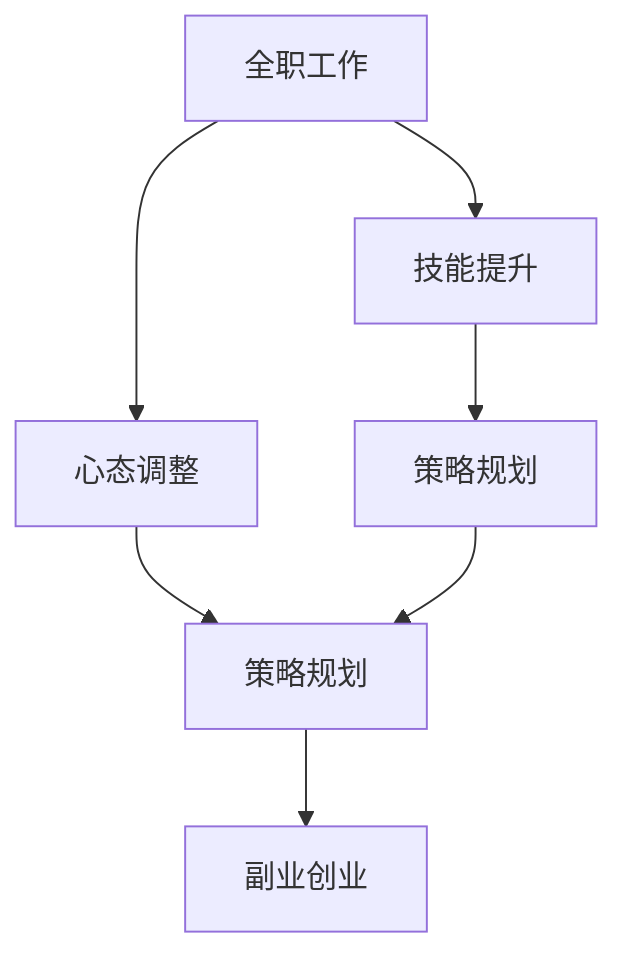

                 

# 从全职工作到副业创业的过渡

> 关键词：职业转型, 副业, 创业, 技能提升, 心态调整, 策略规划

## 1. 背景介绍

在当前这个快速变化的时代，越来越多的人开始考虑从全职工作转向副业创业。这不仅是因为副业提供了更大的财务自由和自我实现的机会，还因为随着互联网和数字技术的普及，创业门槛逐渐降低，让更多的人能够通过在线平台和数字工具来实现自己的创业梦想。然而，从全职工作到副业创业的过渡并不容易，需要充分的准备和规划。本文将从职业转型、技能提升、心态调整和策略规划四个方面，为你提供详细的指导。

## 2. 核心概念与联系

### 2.1 核心概念概述

为了更好地理解从全职工作到副业创业的过渡，我们需要先了解几个关键概念：

- **全职工作与副业创业**：全职工作通常指固定的职位和稳定的收入来源，而副业创业则是指在主业之外，利用业余时间或额外资源进行的创业活动。
- **技能提升**：从全职工作到副业创业，需要掌握或提升各种技能，包括但不限于技术、市场、财务、管理等。
- **心态调整**：创业需要面对不确定性和风险，因此需要有足够的心理准备和调整，包括对失败的接受和对成功的期待。
- **策略规划**：创业需要明确的计划和策略，包括市场分析、产品定位、运营规划等，以确保项目的可行性和可持续发展。

这些概念之间的联系可以通过以下Mermaid流程图来展示：



这个流程图展示了一个从全职工作到副业创业的过程，其中技能提升和心态调整是基础，策略规划是关键。通过不断提升自身技能和调整心态，结合科学的策略规划，才能顺利过渡到副业创业。

## 3. 核心算法原理 & 具体操作步骤

### 3.1 算法原理概述

从全职工作到副业创业的过渡，本质上是一个从已知到未知的过程，涉及多个方面的变化和调整。其核心算法原理可以概括为以下几个步骤：

1. **技能评估与提升**：评估当前具备的技能，识别出需要提升的领域，并通过学习和实践来提升这些技能。
2. **市场分析与定位**：进行市场调研，识别出有潜力的创业机会，并根据自己的兴趣和能力进行市场定位。
3. **策略制定与执行**：制定详细的创业策略，包括产品开发、市场推广、团队组建等，并执行这些策略。
4. **心态调整与应对**：面对创业中的不确定性和挑战，及时调整心态，保持积极和灵活的态度，不断学习和适应。

### 3.2 算法步骤详解

#### 步骤1：技能评估与提升

1. **自我评估**：列出当前拥有的技能，包括技术技能、市场技能、管理技能等，评估每个技能的程度和实用性。
2. **市场需求分析**：调研当前市场上对哪些技能有高需求，包括技术趋势、市场需求、行业动态等。
3. **技能提升计划**：根据市场需求和个人评估，制定具体的学习计划，包括选择在线课程、参加培训、自学等。
4. **实践应用**：通过实际操作和项目实践，验证和提升所学技能。

#### 步骤2：市场分析与定位

1. **市场调研**：收集和分析目标市场的信息，包括市场规模、竞争状况、用户需求等。
2. **机会识别**：识别出市场中的未被满足的需求或潜在机会，评估这些机会的可行性和盈利潜力。
3. **市场定位**：确定自己的市场定位和目标用户，明确产品或服务的核心价值和独特卖点。

#### 步骤3：策略制定与执行

1. **商业计划制定**：根据市场分析和定位，制定详细的商业计划，包括市场策略、产品策略、财务计划等。
2. **产品开发与迭代**：根据商业计划，开发和迭代产品或服务，不断优化和改进以满足市场需求。
3. **市场推广与营销**：制定和执行市场推广和营销策略，提高产品或服务的知名度和吸引力。
4. **团队组建与管理**：组建和培养创业团队，确保团队协作和高效运转。

#### 步骤4：心态调整与应对

1. **风险认知**：正确认识创业中的不确定性和风险，准备好面对可能的失败。
2. **心态调整**：保持积极的心态，接受失败，从失败中学习和成长。
3. **灵活应对**：面对市场变化和挑战，及时调整策略和计划，保持灵活性。

### 3.3 算法优缺点

从全职工作到副业创业的过渡，有以下优点：

- **灵活性和自由度**：副业提供了更多的灵活性和自由度，可以根据自己的兴趣和时间安排进行创业。
- **经济安全感**：副业创业可以提供额外的收入来源，增强财务安全感。
- **学习与成长**：创业过程中，可以不断学习和成长，提升自身技能和经验。

但同时也存在一些缺点：

- **时间和精力投入**：副业创业需要投入大量的时间和精力，可能会影响到全职工作。
- **不确定性和风险**：创业充满了不确定性和风险，可能会面临市场变化、资金短缺等挑战。
- **心理压力**：创业过程中的压力和挑战可能会对心理造成影响，需要较强的心理承受能力。

### 3.4 算法应用领域

副业创业可以应用于多个领域，包括但不限于：

- **技术创业**：利用技术优势，开发软件、应用程序、在线平台等。
- **服务创业**：提供咨询、培训、设计、内容创作等专业服务。
- **电商创业**：开设网店、在线商店，销售产品或提供服务。
- **内容创业**：通过写博客、视频、音频等内容形式，吸引流量和收益。
- **教育创业**：开设在线课程、教育平台，提供教育和培训服务。

## 4. 数学模型和公式 & 详细讲解 & 举例说明

### 4.1 数学模型构建

从全职工作到副业创业的过渡，可以构建一个多阶段的数学模型，每个阶段都有其特定的目标和输入输出。例如：

- **输入**：当前技能、市场分析、商业计划等。
- **输出**：提升的技能、市场机会、执行策略等。

### 4.2 公式推导过程

以技能提升为例，可以构建以下数学模型：

$$
\text{新技能水平} = f(\text{现有技能水平}, \text{学习时间}, \text{学习方法}, \text{实践经验})
$$

其中，$f$表示技能提升函数，具体形式需要根据实际情况进行推导和验证。

### 4.3 案例分析与讲解

假设某人当前在软件开发领域全职工作，但希望转型为技术创业者。我们可以构建以下步骤：

1. **自我评估**：现有技能包括编程、项目管理、产品设计等，但缺乏市场推广和管理技能。
2. **市场需求分析**：当前市场上对人工智能、区块链等新技术有高需求。
3. **技能提升计划**：参加人工智能相关的在线课程和项目实践，提升技术技能；学习市场推广和管理的知识和技巧。
4. **实践应用**：开发和测试一个基于人工智能的创业项目，不断迭代和优化。

## 5. 项目实践：代码实例和详细解释说明

### 5.1 开发环境搭建

为了实现从全职工作到副业创业的过渡，需要搭建一个适合学习和实践的环境。以下是一些推荐：

1. **编程语言**：Python、JavaScript、Java等主流编程语言。
2. **开发工具**：Visual Studio Code、Atom、Sublime Text等高效编码工具。
3. **在线学习平台**：Coursera、edX、Udacity等提供丰富的在线课程。
4. **项目管理工具**：Trello、Jira、Asana等帮助管理项目和任务。
5. **财务软件**：QuickBooks、Xero等帮助管理财务和预算。

### 5.2 源代码详细实现

以下是一个简单的Python代码示例，用于从全职工作到副业创业的过渡规划：

```python
class CareerTransitionPlanner:
    def __init__(self, initial_skills, target_market):
        self.initial_skills = initial_skills
        self.target_market = target_market
        self.learning_plan = {}
        self.market_analysis = {}
        self.strategy_plan = {}

    def skill_assessment(self):
        self.learning_plan = self.calculate_skill_upgrade(self.initial_skills)

    def market_analysis(self):
        self.market_analysis = self.perform_market_research(self.target_market)

    def strategy_planning(self):
        self.strategy_plan = self.develop_business_strategy(self.market_analysis)

    def execute_plan(self):
        self.implement_learning_plan()
        self.execute_strategy_plan()

    def implement_learning_plan(self):
        for skill, plan in self.learning_plan.items():
            # Implement learning plan for each skill

    def execute_strategy_plan(self):
        for strategy, plan in self.strategy_plan.items():
            # Execute strategy plan for each strategy

    def calculate_skill_upgrade(self, initial_skills):
        # Calculate skill upgrade plan based on initial skills
        pass

    def perform_market_research(self, target_market):
        # Perform market research to identify opportunities
        pass

    def develop_business_strategy(self, market_analysis):
        # Develop business strategy based on market analysis
        pass
```

### 5.3 代码解读与分析

上述代码示例展示了从全职工作到副业创业的过渡规划。每个步骤都有其具体的实现函数，用于评估技能、进行市场分析、制定战略规划和执行计划。这些函数可以根据实际需求进行扩展和优化。

### 5.4 运行结果展示

运行上述代码，可以得到一个详细的过渡规划，包括需要提升的技能、市场机会和执行策略。这个规划可以作为创业初期的指导，帮助创业者和团队明确方向和目标。

## 6. 实际应用场景

### 6.1 技术创业者

一名在人工智能领域全职工作的人，可以利用业余时间学习机器学习、深度学习等技能，开发一款智能推荐系统或自然语言处理应用，从而转型为技术创业者。

### 6.2 内容创作者

一名自由撰稿人，可以通过学习视频制作、音频编辑等技能，转型为内容创作者，开设自己的YouTube频道或播客节目，提供专业知识和娱乐内容。

### 6.3 电商创业者

一名电商行业从业者，可以利用业余时间学习市场营销、用户体验设计等技能，开设自己的网店或在线商店，销售手工艺品、创意产品等。

### 6.4 教育创业者

一名教育工作者，可以通过学习在线教育平台的技术和市场运营，转型为教育创业者，开设自己的在线课程或教育平台，提供高质量的教育资源。

## 7. 工具和资源推荐

### 7.1 学习资源推荐

1. **在线课程**：Coursera、edX、Udacity等平台提供丰富的技术、商业、管理等在线课程。
2. **书籍**：《精益创业》、《从零到一》、《创新者的窘境》等经典创业书籍。
3. **博客和论坛**：Medium、Hacker News、GitHub等平台提供创业和学习资源。

### 7.2 开发工具推荐

1. **编程语言**：Python、JavaScript、Java等主流编程语言。
2. **开发工具**：Visual Studio Code、Atom、Sublime Text等高效编码工具。
3. **项目管理工具**：Trello、Jira、Asana等帮助管理项目和任务。
4. **财务软件**：QuickBooks、Xero等帮助管理财务和预算。

### 7.3 相关论文推荐

1. **《精益创业》**：Eric Ries著，介绍了精益创业的基本原则和方法。
2. **《从零到一》**：Peter Thiel著，探讨了创业公司的关键成功因素。
3. **《创新者的窘境》**：Clayton Christensen著，分析了技术创新和市场竞争的复杂关系。

## 8. 总结：未来发展趋势与挑战

### 8.1 研究成果总结

本文从职业技能提升、市场分析与定位、策略制定与执行、心态调整与应对四个方面，详细介绍了从全职工作到副业创业的过渡过程。通过科学的方法和工具，可以最大程度地降低创业风险，提高创业成功率。

### 8.2 未来发展趋势

未来，从全职工作到副业创业的过渡将更加灵活和多元化。随着数字技术的普及，在线学习和远程协作将成为创业的重要工具。同时，创业的领域和形式也将更加多样化，涵盖更多新兴领域和技术。

### 8.3 面临的挑战

尽管创业具有很多机会和好处，但也面临诸多挑战，包括时间管理、资金短缺、市场竞争等。创业者的心理素质和韧性也是关键因素，需要不断学习和适应。

### 8.4 研究展望

未来，随着人工智能和机器学习技术的进步，创业工具和平台将更加智能化和自动化，创业门槛将进一步降低。同时，创业领域的知识和技能将不断更新，创业者需要持续学习和提升。

## 9. 附录：常见问题与解答

**Q1：从全职工作到副业创业需要多少时间？**

A: 这个问题没有固定答案，取决于个人的技能、资源、市场需求等诸多因素。有些人可能在几个月内就能顺利转型，而另一些人可能需要几年的时间。关键在于制定明确的目标和计划，并不断调整和优化。

**Q2：创业需要哪些关键技能？**

A: 创业需要多种关键技能，包括但不限于：
- 技术技能：软件开发、数据分析、产品设计等。
- 市场技能：市场调研、市场营销、用户分析等。
- 管理技能：团队管理、财务管理、项目管理等。
- 创新能力：快速学习和适应新技术、新市场的能力。

**Q3：如何平衡全职工作和副业创业？**

A: 平衡全职工作和副业创业的关键在于有效的时间管理和优先级排序。可以设定明确的工作时间和休息时间，利用碎片时间进行副业活动，并尽量利用周末和假期进行深度投入。同时，可以考虑兼职工作或远程工作，以减轻全职工作的压力。

**Q4：如何应对创业中的不确定性和风险？**

A: 应对创业中的不确定性和风险，需要保持灵活性和适应性。建立应对机制，如风险评估、应急预案、持续监控等，可以帮助应对市场变化和潜在风险。同时，保持积极的心态，接受失败，从失败中学习和成长，也是重要的应对策略。

**Q5：如何找到适合自己的副业创业领域？**

A: 找到适合自己的副业创业领域，需要进行广泛的市场调研和自我评估。可以关注当前市场趋势，识别出有潜力的领域，并结合自己的兴趣和能力进行选择。同时，可以借助职业咨询、创业导师等资源，获取更多的建议和指导。

---

作者：禅与计算机程序设计艺术 / Zen and the Art of Computer Programming

