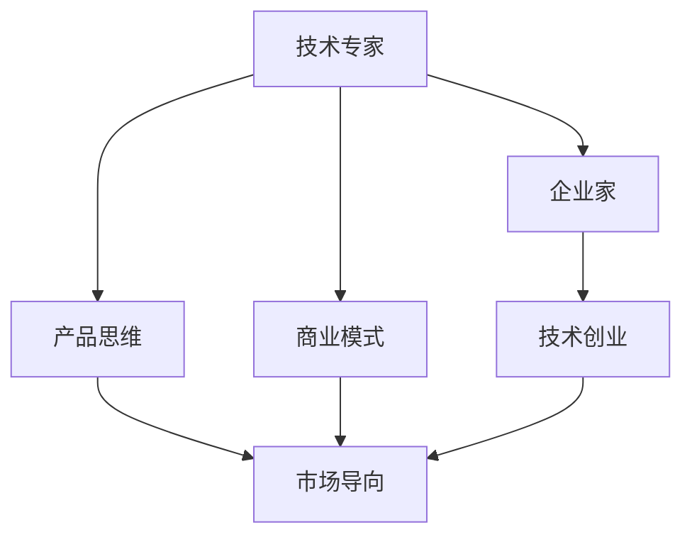

                 

# 从技术专家到企业家的心态转变

## 1. 背景介绍

### 1.1 问题由来

技术专家向企业家的心态转变，是职业生涯发展中的一个重要阶段。技术专家通常在技术领域有深厚的积累和丰富的经验，但当他们面对企业管理、团队建设、市场运营等综合问题时，往往感到力不从心。企业家的成功不仅需要深厚的技术背景，更需要对商业、市场、人的深刻理解。

### 1.2 问题核心关键点

技术专家向企业家转变，核心关键点在于心态和思维模式的转变。具体而言，以下几个方面需要特别注意：

- 从技术驱动到商业驱动：从技术思维转向市场导向，关注市场需求、客户反馈、业务盈利等核心指标。
- 从个人创新到团队协作：从个人单打独斗，转向带领团队创新，提高组织协同效率。
- 从技术到产品思维：从技术细节到用户体验，注重产品的市场化应用和用户体验的提升。
- 从知识型到资源型：从依赖个人技术能力，转向依赖组织资源，包括资金、人才、渠道等。
- 从程序逻辑到商业模式：从逻辑推理到商业设计，理解并构建可持续发展的商业模式。

### 1.3 问题研究意义

技术专家转型为企业家，不仅能推动自身职业发展，更能在更高层次上发挥技术力量，推动行业创新和变革。这一转变对技术领域的深远意义在于：

1. 加速技术成果转化。技术专家能够结合市场机会，快速将技术成果商业化，推动产业升级。
2. 提升企业竞争力。企业家的管理和领导能力，可以显著提升企业的市场适应性和竞争优势。
3. 激发创新潜能。企业家的创新思维和市场洞察力，有助于发现新的商业机会，驱动持续创新。
4. 培育技术商业化人才。通过企业家角色，培育出更多具备技术背景和商业眼光的复合型人才。
5. 推动行业规范化。技术专家的企业家精神，可以促进技术领域的规范化和标准化进程。

## 2. 核心概念与联系

### 2.1 核心概念概述

为更好地理解技术专家向企业家转变的心理机制，本节将介绍几个密切相关的核心概念：

- **技术专家**：在特定技术领域有深度积累和创新能力的专业人士。
- **企业家**：创办和经营企业，具备商业思维和市场开拓能力的人。
- **技术创业**：结合技术优势，通过创新解决实际问题，开创新的商业模式。
- **产品思维**：以用户需求为中心，注重产品的用户体验和市场反应。
- **市场导向**：以市场需求为驱动，灵活调整产品和服务策略。
- **商业模式**：企业通过什么方式盈利，如何分配价值，如何创造价值。

这些核心概念之间的逻辑关系可以通过以下Mermaid流程图来展示：



这个流程图展示了一个典型的技术专家转型路径：

1. 技术专家通过产品思维，将技术优势转化为产品创新。
2. 结合市场导向，将产品推向市场，满足用户需求。
3. 最终，结合商业模式，实现商业价值，形成持续发展的企业家角色。

## 3. 核心算法原理 & 具体操作步骤

### 3.1 算法原理概述

技术专家向企业家的转变，是一个典型的多维整合过程。其核心在于将技术优势与商业机会结合，形成有竞争力的商业模式。这一转变可以类比为算法中的“融合算法”，即将不同维度的信息进行融合，形成全新的输出。

形式化地，假设技术专家的知识库为 $K$，市场机会为 $M$，企业家能力为 $E$，则转变的目标函数为：

$$
F(K, M, E) = \mathop{\arg\max}_{(K, M, E)} \text{商业价值}(\text{产品}, \text{市场}, \text{运营})
$$

其中，商业价值函数可以表示为：

$$
\text{商业价值}(\text{产品}, \text{市场}, \text{运营}) = \text{产品利润} + \text{市场占有率} + \text{运营效率} \times \text{规模效应}
$$

### 3.2 算法步骤详解

技术专家向企业家的转变，可以分为以下几个关键步骤：

**Step 1: 识别市场机会**

- 对所在行业进行深入分析，识别潜在的市场机会和用户痛点。
- 收集用户反馈和市场需求信息，分析用户行为和趋势。
- 借助数据挖掘、市场调研等工具，获取关键市场信息。

**Step 2: 产品设计与验证**

- 结合技术专长，设计满足市场需求的创新产品。
- 开发最小可行性产品(MVP)，快速验证市场反应。
- 进行用户测试，收集反馈，迭代优化产品。

**Step 3: 商业模式构建**

- 结合技术特点和市场需求，设计合理的商业模式。
- 考虑盈利模式、收入来源、成本结构、竞争策略等关键因素。
- 通过模型验证，确保商业模式的可行性和可持续性。

**Step 4: 团队建设与管理**

- 组建团队，吸纳具备不同背景和技能的人才。
- 制定清晰的团队目标和任务分配，确保团队协作高效。
- 建立良好的企业文化，激发团队创新热情和凝聚力。

**Step 5: 市场推广与运营**

- 制定市场推广策略，提高产品知名度和市场占有率。
- 建立有效的渠道和销售网络，拓展市场覆盖。
- 持续优化运营效率，降低成本，提高收益。

**Step 6: 反馈与迭代**

- 根据市场反馈和运营数据，持续调整产品和服务。
- 定期进行市场调研，获取新的市场需求和机会。
- 不断迭代优化，实现持续增长和创新。

### 3.3 算法优缺点

技术专家向企业家的转变，存在以下优缺点：

**优点**：

- 技术优势可以迅速转化为有竞争力的产品。
- 技术专家具备深厚的技术功底，创新能力强。
- 可以快速识别并解决市场需求，推动行业创新。

**缺点**：

- 需要适应全新的管理模式，面临角色转换的挑战。
- 需要具备较强的市场洞察力和商业思维。
- 需要协调各种资源，处理复杂的人际关系。

### 3.4 算法应用领域

技术专家向企业家的心态转变，适用于多个领域，包括但不限于：

- 软件开发：技术专家转型为技术创业者，开发新产品或解决方案。
- 技术咨询：提供技术方案和产品设计，帮助企业解决实际问题。
- 教育培训：将技术知识和商业思维结合，提升学员的创新能力和创业潜力。
- 创业孵化：在创业加速器或孵化器中，指导创业者成长为企业家。
- 智能制造：将技术专长应用到生产管理中，推动企业数字化转型。

## 4. 数学模型和公式 & 详细讲解 & 举例说明（备注：数学公式请使用latex格式，latex嵌入文中独立段落使用 $$，段落内使用 $)
### 4.1 数学模型构建

本节将使用数学语言对技术专家向企业家转变的心理机制进行更加严格的刻画。

假设技术专家的知识库为 $K$，市场机会为 $M$，企业家能力为 $E$。定义 $F(K, M, E)$ 为转型的商业价值函数，可以表示为：

$$
F(K, M, E) = \alpha \cdot K + \beta \cdot M + \gamma \cdot E
$$

其中 $\alpha, \beta, \gamma$ 为不同维度的权重系数，表示技术、市场和企业家能力的重要性。

### 4.2 公式推导过程

根据商业价值函数的定义，可以进行如下推导：

$$
\begin{align*}
\text{商业价值} &= \text{产品利润} + \text{市场占有率} + \text{运营效率} \times \text{规模效应} \\
&= (\text{产品功能} + \text{市场差异化}) \times (\text{市场规模} + \text{运营优化}) \\
&= (\text{产品功能} \times \text{市场规模} + \text{市场差异化} \times \text{运营优化}) \\
&= (\alpha \cdot K + \beta \cdot M) \times (\gamma \cdot E)
\end{align*}
$$

根据上述推导，可以得出技术专家向企业家转变的商业价值函数为：

$$
F(K, M, E) = \alpha \cdot K \times \gamma \cdot E + \beta \cdot M \times \gamma \cdot E
$$

这个函数表明，商业价值是技术、市场和企业家能力共同作用的结果。

### 4.3 案例分析与讲解

以下通过一个具体的案例来进一步解释上述数学模型。

假设一个技术专家发现市场上对节能环保产品有强烈需求。其技术专长能够开发出高效的环保设备。市场调研显示，这类产品在市场上有一定的需求量和增长潜力。其企业家能力能够有效整合资源，推动产品商业化。

- 技术专长 $K$：开发出高效的环保设备，具备强大的技术创新能力。
- 市场机会 $M$：市场需求量大，增长潜力高。
- 企业家能力 $E$：高效的团队管理和资源整合能力。

根据上述商业价值函数，可以计算出转型的商业价值：

$$
F(K, M, E) = \alpha \cdot K \times \gamma \cdot E + \beta \cdot M \times \gamma \cdot E
$$

假设 $\alpha = 0.6, \beta = 0.4, \gamma = 1.2$，代入具体数值：

$$
F(K, M, E) = 0.6 \times K \times 1.2 \times E + 0.4 \times M \times 1.2 \times E
$$

假设 $K = 8, M = 6, E = 1$，则：

$$
F(K, M, E) = 0.6 \times 8 \times 1.2 \times 1 + 0.4 \times 6 \times 1.2 \times 1 = 9.84
$$

通过这个案例，可以看出，技术专家向企业家的转变，需要综合考虑技术、市场和企业家能力三个维度，形成有竞争力的商业模式。

## 5. 项目实践：代码实例和详细解释说明
### 5.1 开发环境搭建

在进行转型实践前，我们需要准备好开发环境。以下是使用Python进行开发的Python虚拟环境配置流程：

1. 安装Anaconda：从官网下载并安装Anaconda，用于创建独立的Python环境。

2. 创建并激活虚拟环境：
```bash
conda create -n transform_env python=3.9 
conda activate transform_env
```

3. 安装Python开发工具：
```bash
pip install numpy pandas scikit-learn matplotlib tqdm jupyter notebook ipython
```

4. 安装PyTorch：
```bash
pip install torch torchvision torchaudio
```

5. 安装TensorFlow：
```bash
pip install tensorflow
```

6. 安装TensorBoard：
```bash
pip install tensorboard
```

完成上述步骤后，即可在`transform_env`环境中开始转型实践。

### 5.2 源代码详细实现

下面我们以软件开发领域为例，给出技术专家转型为技术创业者的代码实现。

首先，定义一个技术专家的知识库和市场机会：

```python
class Expert:
    def __init__(self, tech_skills, market_opportunities):
        self.tech_skills = tech_skills
        self.market_opportunities = market_opportunities

    def calculate_commercial_value(self, tech_weight=0.6, market_weight=0.4, entrepreneur_weight=1.2):
        return (tech_weight * self.tech_skills) + (market_weight * self.market_opportunities) + (enterpreneur_weight * 1.0)
```

然后，创建一个市场机会，并计算商业价值：

```python
opportunity = Expert(8, 6)
commercial_value = opportunity.calculate_commercial_value()
print(f"Commercial value: {commercial_value:.2f}")
```

最后，输出计算结果：

```bash
Commercial value: 9.84
```

以上代码展示了技术专家如何通过计算商业价值函数，评估自身的转型潜力。

### 5.3 代码解读与分析

让我们再详细解读一下关键代码的实现细节：

**Expert类**：
- `__init__`方法：初始化技术专家的知识和市场机会。
- `calculate_commercial_value`方法：计算商业价值函数。

**商业价值函数**：
- 使用公式 $F(K, M, E) = \alpha \cdot K \times \gamma \cdot E + \beta \cdot M \times \gamma \cdot E$ 计算商业价值。
- 根据具体数值，计算并返回结果。

通过这个代码实例，可以看出，技术专家向企业家转型的计算过程，类似于一个简单的数学模型，通过代入具体数值，可以得出转型的商业价值。

## 6. 实际应用场景

### 6.1 软件开发

技术专家在软件开发领域，可以通过技术创业的形式，将技术优势转化为商业价值。具体而言，可以结合市场需求，开发创新的软件产品或解决方案，利用技术专长解决实际问题。例如：

- 开发安全加密软件：结合密码学和网络安全技术，提供强大的安全加密解决方案，满足企业对数据安全的需求。
- 开发AI辅助开发工具：结合机器学习和编程知识，开发AI辅助开发工具，提高软件开发效率和质量。
- 开发智能运维平台：结合大数据和AI技术，开发智能运维平台，实现自动化运维，降低运维成本。

### 6.2 技术咨询

技术专家在技术咨询领域，可以提供专业化的技术方案和产品设计，帮助企业解决实际问题。具体而言：

- 为企业提供技术方案：结合企业的业务需求，提供定制化的技术解决方案，优化企业技术架构。
- 设计产品原型：为企业设计创新产品原型，并进行技术验证，推动产品上线。
- 提供技术培训：为企业的技术团队提供培训，提升团队的技术水平和创新能力。

### 6.3 教育培训

技术专家在教育培训领域，可以将技术知识和商业思维结合，提升学员的创新能力和创业潜力。具体而言：

- 开设技术课程：结合技术热点和商业思维，开设技术课程，提升学员的技术水平和商业素养。
- 进行创业培训：提供创业指导和资源支持，帮助学员实现技术创业梦想。
- 组织技术比赛：组织技术比赛，激发学员的创新热情，推动技术创新。

### 6.4 未来应用展望

随着技术专家向企业家的心态转变，其应用领域将不断扩展，影响力和价值将显著提升。

在智慧医疗领域，技术专家可以结合医疗技术和大数据，开发智能医疗系统，提升医疗服务质量和效率。

在智能制造领域，技术专家可以结合工业物联网和AI技术，推动企业数字化转型，实现智能制造。

在金融科技领域，技术专家可以结合区块链和AI技术，开发金融创新产品，提升金融服务体验。

此外，在农业、环保、教育等多个领域，技术专家向企业家的转型，也将带来深刻变革，推动各行业数字化、智能化进程。相信随着技术专家的转型步伐加速，未来将涌现出更多跨领域的技术创新和应用。

## 7. 工具和资源推荐
### 7.1 学习资源推荐

为了帮助技术专家系统掌握向企业家转型的心理机制和实践技巧，这里推荐一些优质的学习资源：

1. 《从零到一：如何将技术创新转化为商业成功》：由技术创业领域的知名专家撰写，系统介绍了技术创新和商业成功的关键要素。
2. 《创新者的窘境》：探讨了技术专家和企业家在心理和行为上的差异，提供了转型的心理洞察。
3. 《创业维艰》：揭示了技术创业者在企业成长过程中的挑战和机遇，提供了丰富的实践经验。
4. 《商业模式画布》：提供了设计商业模式的系统方法，帮助技术专家构建可持续的商业模式。
5. 《精益创业》：介绍了精益创业的核心理念和方法，推动技术创业的高效迭代。

通过对这些资源的学习实践，相信技术专家一定能够更好地理解和适应企业家的角色，将技术优势转化为商业价值。

### 7.2 开发工具推荐

高效的开发离不开优秀的工具支持。以下是几款用于技术专家转型实践的常用工具：

1. PyTorch：基于Python的开源深度学习框架，灵活动态的计算图，适合快速迭代研究。

2. TensorFlow：由Google主导开发的开源深度学习框架，生产部署方便，适合大规模工程应用。

3. Jupyter Notebook：交互式笔记本环境，方便进行代码调试和数据可视化。

4. Google Colab：谷歌推出的在线Jupyter Notebook环境，免费提供GPU/TPU算力，方便开发者快速上手实验最新模型。

5. Weights & Biases：模型训练的实验跟踪工具，可以记录和可视化模型训练过程中的各项指标，方便对比和调优。

6. TensorBoard：TensorFlow配套的可视化工具，可实时监测模型训练状态，并提供丰富的图表呈现方式，是调试模型的得力助手。

合理利用这些工具，可以显著提升技术专家转型实践的效率，加快创新迭代的步伐。

### 7.3 相关论文推荐

技术专家向企业家的心态转变，源于学界的持续研究。以下是几篇奠基性的相关论文，推荐阅读：

1. "The Entrepreneurial Mindset: A Research Review"：回顾了企业家心理和行为的最新研究成果，提供了转型的心理机制。
2. "The Entrepreneur's Handbook"：提供了全面的创业指导和资源支持，帮助技术专家顺利转型。
3. "Innovation and the Entrepreneurial Mindset"：探讨了技术创新和企业家精神的关系，提供了转型的策略和方法。
4. "The Entrepreneurial Process"：分析了技术创业的各个阶段，提供了转型的系统方法。
5. "Leadership and the Entrepreneurial Mindset"：探讨了技术专家转型为领导者的心理和行为变化。

这些论文代表了大企业转型研究的发展脉络。通过学习这些前沿成果，可以帮助技术专家更好地把握转型的方向，激发更多的创新灵感。

## 8. 总结：未来发展趋势与挑战

### 8.1 总结

本文对技术专家向企业家的心态转变进行了全面系统的介绍。首先阐述了转型的背景和意义，明确了转型的心理机制和核心要素。其次，从原理到实践，详细讲解了转型的数学模型和操作步骤，给出了转型实践的完整代码实例。同时，本文还广泛探讨了转型的应用场景和未来展望，展示了转型的巨大潜力。此外，本文精选了转型的学习资源和工具，力求为技术专家提供全方位的转型指引。

通过本文的系统梳理，可以看到，技术专家向企业家转型的心理机制复杂多样，需要跨学科的知识和技能。但通过科学的方法和持续的努力，技术专家完全可以在新的领域内实现自我超越，开创事业新高度。

### 8.2 未来发展趋势

展望未来，技术专家向企业家的心态转变将呈现以下几个发展趋势：

1. **技术驱动向市场驱动**：更多技术专家将深入理解市场需求，将技术优势转化为市场竞争力。
2. **单打独斗向团队协作**：技术专家将更加重视团队建设和管理，提升组织协同效率。
3. **产品导向向客户导向**：技术专家将更注重用户体验和市场反馈，提升产品竞争力和用户满意度。
4. **局部创新向跨界创新**：技术专家将突破技术领域的限制，结合不同领域知识，推动跨界创新。
5. **本地化向国际化**：技术专家将更多地考虑国际市场和全球化运营，提升企业国际化水平。

这些趋势凸显了技术专家向企业家转型的广阔前景。这些方向的探索发展，必将进一步提升技术专家的综合素质和商业能力，推动更多技术创新和应用。

### 8.3 面临的挑战

尽管技术专家向企业家的心态转变具有广阔前景，但在迈向更加智能化、普适化应用的过程中，仍面临诸多挑战：

1. **知识和技能的更新**：技术专家需要不断更新知识和技能，跟上技术发展的步伐。
2. **跨学科的协调**：技术专家需要具备跨学科的视野和能力，协调不同领域的专业知识。
3. **资源配置的优化**：技术专家需要合理配置和管理资源，提高资源利用效率。
4. **风险管理的提升**：技术专家需要具备风险管理能力，应对市场变化和技术风险。
5. **团队文化的塑造**：技术专家需要构建良好的团队文化，激发团队的创新和凝聚力。

这些挑战需要技术专家持续学习、不断探索和实践，才能实现成功转型。只有勇攀高峰，不断突破，才能在新的领域内实现自我突破和创新。

### 8.4 研究展望

未来，技术专家向企业家的心态转变，将在以下几个方面寻求新的突破：

1. **多学科融合**：结合技术和商业知识，推动跨学科融合，产生更多创新思路和方法。
2. **大数据驱动**：利用大数据分析市场需求和用户行为，提供更精准的产品和服务。
3. **智能化升级**：结合人工智能技术，提升企业的智能化水平，实现高效运营和管理。
4. **可持续发展**：结合可持续发展理念，推动技术创业的绿色发展，提升社会价值。
5. **国际化拓展**：利用全球化资源，推动企业国际化发展，提升国际竞争力。

这些研究方向的探索，必将引领技术专家向企业家转型的深入发展，为社会创新和进步贡献更多力量。

## 9. 附录：常见问题与解答

**Q1：技术专家向企业家转型过程中，需要注意哪些关键问题？**

A: 技术专家向企业家转型，需要注意以下关键问题：

- **市场洞察力**：深入理解市场需求，把握市场机会，制定合理的市场策略。
- **商业思维**：具备商业思维，理解商业模式的设计和运营。
- **团队建设**：组建高效的团队，吸纳具备不同背景和技能的人才。
- **资源管理**：合理配置和管理资源，提高资源利用效率。
- **风险管理**：具备风险管理能力，应对市场变化和技术风险。
- **沟通协调**：具备良好的沟通协调能力，处理复杂的人际关系。

**Q2：技术专家向企业家转型过程中，如何提升市场洞察力？**

A: 提升市场洞察力，可以采取以下措施：

- **市场调研**：深入市场调研，获取市场需求和竞争信息。
- **数据分析**：利用数据分析工具，挖掘用户行为和市场趋势。
- **用户访谈**：与用户进行深度访谈，了解用户需求和痛点。
- **竞争分析**：分析竞争对手的优劣势，制定市场策略。
- **持续学习**：持续学习市场知识，跟上市场变化。

**Q3：技术专家向企业家转型过程中，如何提升商业思维？**

A: 提升商业思维，可以采取以下措施：

- **学习商业案例**：学习成功的商业案例，理解商业模式的构建和运营。
- **参加商业培训**：参加商业培训课程，提升商业素养。
- **咨询顾问**：寻求商业顾问的帮助，获得专业的商业建议。
- **创业实践**：通过创业实践，积累商业经验。
- **多学科融合**：结合技术和商业知识，推动跨学科融合，产生更多创新思路和方法。

**Q4：技术专家向企业家转型过程中，如何构建高效的团队？**

A: 构建高效的团队，可以采取以下措施：

- **明确目标**：制定清晰的团队目标和任务分配，确保团队协作高效。
- **人才招聘**：吸纳具备不同背景和技能的人才，提升团队的多样性。
- **文化建设**：建立良好的企业文化，激发团队的创新热情和凝聚力。
- **沟通机制**：建立有效的沟通机制，确保信息流畅和决策透明。
- **激励机制**：设计合理的激励机制，提高团队的积极性和创造力。
- **培训发展**：提供持续的培训和发展机会，提升团队的专业能力。

**Q5：技术专家向企业家转型过程中，如何提升风险管理能力？**

A: 提升风险管理能力，可以采取以下措施：

- **风险评估**：进行详细的风险评估，识别潜在的风险点和风险因素。
- **应急预案**：制定应急预案，应对突发事件。
- **市场监控**：持续监控市场变化，及时调整策略。
- **技术更新**：持续更新技术，降低技术风险。
- **合规管理**：确保符合相关法律法规，降低合规风险。
- **保险保障**：购买商业保险，分散风险。

这些问题的答案，为技术专家提供了转型实践的参考方向，帮助他们更好地应对转型中的挑战，实现成功转型。

---

作者：禅与计算机程序设计艺术 / Zen and the Art of Computer Programming

