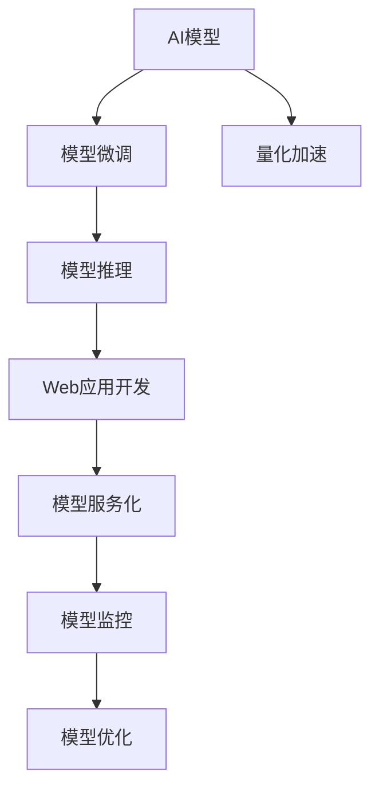

                 

# 从模型到产品：AI模型部署及Web应用开发

> 关键词：AI模型部署, Web应用开发, 模型微调, 量化加速, 模型推理, 模型服务化

## 1. 背景介绍

### 1.1 问题由来

随着人工智能技术的飞速发展，越来越多的公司开始利用AI模型来解决业务问题，例如自动文本生成、图像识别、语音识别等。然而，大部分公司对于AI模型的开发、部署和运维经验不足，导致模型难以被大规模部署到生产环境，或者部署后性能表现不佳。因此，本文旨在介绍如何高效地将AI模型部署到Web应用中，并结合实际案例讲解相关的技术和工具，希望能帮助读者在模型部署和Web应用开发过程中少走弯路，提升效率。

### 1.2 问题核心关键点

AI模型部署和Web应用开发的核心问题包括：
1. 如何选择合适的模型？
2. 如何在模型开发过程中进行有效的数据处理和模型训练？
3. 如何高效地将训练好的模型部署到Web应用中？
4. 如何在Web应用中实现高效的模型推理？
5. 如何对模型进行实时监控和优化？
6. 如何保证模型的安全性与可解释性？

这些问题构成了AI模型部署和Web应用开发的核心框架，本文将对这些问题进行深入分析，并提供实践指南。

## 2. 核心概念与联系

### 2.1 核心概念概述

在介绍具体的部署和开发方法前，我们先梳理一下相关的核心概念：

- AI模型：指经过训练的机器学习模型，可以用于预测、分类、生成等任务。
- Web应用：通过浏览器或移动设备等访问的应用程序，通常基于Web技术开发。
- 模型微调：针对特定问题对预训练模型进行进一步训练，以提升模型性能。
- 量化加速：将浮点数运算转换为定点运算，以减少计算资源消耗和提高推理速度。
- 模型推理：指将模型部署到生产环境后，接收输入数据并返回预测结果的过程。
- 模型服务化：将模型封装为RESTful服务接口，便于其他系统调用和集成。

这些概念构成了AI模型部署和Web应用开发的框架，下文将逐一详细介绍。

### 2.2 核心概念原理和架构的 Mermaid 流程图



这个流程图展示了从模型到Web应用开发的核心流程：

1. 从原始数据开始，先对模型进行微调，以适应具体任务。
2. 对微调后的模型进行量化加速，以提高推理速度和效率。
3. 在Web应用中实现高效的模型推理，得到预测结果。
4. 将模型封装为服务接口，便于其他系统调用和集成。
5. 对模型进行实时监控，并在运行过程中不断优化。

## 3. 核心算法原理 & 具体操作步骤

### 3.1 算法原理概述

将AI模型部署到Web应用中的关键在于实现高效的模型推理。常见的模型推理方式包括：

- CPU推理：使用CPU进行模型计算，适用于数据量较小、模型推理速度要求不高的情况。
- GPU推理：使用GPU进行模型计算，适用于数据量大、模型复杂的情况。
- TPU推理：使用TPU进行模型计算，适用于超大规模计算需求，需要高性能计算资源的情况。

基于GPU或TPU的推理方式可以大幅提升模型计算速度，但需要相应的硬件资源和计算环境。本文重点介绍基于CPU的推理方式，结合Web应用开发，以提升模型推理效率和用户体验。

### 3.2 算法步骤详解

基于CPU的推理方式通常包括数据预处理、模型加载、推理计算、结果后处理等步骤。以下详细介绍各个步骤的实现方法：

#### 3.2.1 数据预处理

在推理过程中，需要对输入数据进行预处理，包括：
1. 数据格式转换：将输入数据从原始格式转换为模型所需的格式，如将文本转换为向量。
2. 数据增强：通过数据增强技术，提高模型对数据变化的适应性，如对图像进行旋转、裁剪、缩放等操作。
3. 数据标准化：对数据进行标准化处理，如归一化、标准化等，以提高模型的鲁棒性。

#### 3.2.2 模型加载

在Web应用中，通常使用Web框架加载模型。常见的Web框架包括Flask、Django、FastAPI等，这些框架提供了便捷的模型加载和调用方式，可以方便地将模型集成到Web应用中。

#### 3.2.3 推理计算

推理计算是模型部署的核心，通常使用TensorFlow、PyTorch等深度学习框架进行模型推理。推理计算的过程包括：
1. 模型前向传播：将输入数据传递到模型中进行前向传播计算。
2. 模型参数更新：根据输入数据更新模型参数，以实现模型预测。

#### 3.2.4 结果后处理

推理计算结束后，需要对模型输出进行后处理，包括：
1. 数据格式转换：将模型输出从模型所需的格式转换为Web应用所需的格式，如将向量转换为文本。
2. 结果过滤：根据模型输出结果进行过滤，排除不符合要求的输出。
3. 结果格式化：对输出结果进行格式化，使其符合Web应用的用户体验要求。

### 3.3 算法优缺点

基于CPU的推理方式具有以下优点：
1. 灵活性高：可以在不同计算环境下部署模型，适应不同规模的数据和计算需求。
2. 开发成本低：基于CPU的推理方式开发成本较低，不需要特别昂贵的硬件设备。
3. 易用性强：使用Web框架可以方便地将模型集成到Web应用中，提高开发效率。

同时，基于CPU的推理方式也存在一些缺点：
1. 计算效率低：CPU的计算能力有限，面对大规模计算需求时效率较低。
2. 性能不稳定：CPU的计算速度受操作系统、硬件配置等因素影响较大，性能不稳定。

### 3.4 算法应用领域

基于CPU的推理方式适用于各种NLP、计算机视觉、语音识别等领域的AI模型部署和Web应用开发。例如：
1. 基于NLP的智能客服系统：使用GPT-3等语言模型，对用户输入进行理解并生成回复。
2. 基于计算机视觉的图像识别系统：使用ResNet等卷积神经网络模型，对图像进行分类、识别等操作。
3. 基于语音识别的智能音箱系统：使用Transformer等模型，对语音进行识别并生成回答。

## 4. 数学模型和公式 & 详细讲解 & 举例说明

### 4.1 数学模型构建

在AI模型推理过程中，常见的数学模型包括：
1. 前向传播模型：用于将输入数据传递到模型中进行计算。
2. 反向传播模型：用于更新模型参数，以实现模型预测。
3. 量化模型：用于将浮点数运算转换为定点运算，以提高推理速度。

#### 4.1.1 前向传播模型

假设模型为 $y = f(x; \theta)$，其中 $x$ 为输入数据，$y$ 为输出结果，$\theta$ 为模型参数。前向传播模型的计算过程包括：
1. 输入数据 $x$ 经过预处理，转换为模型所需的格式。
2. 将预处理后的数据 $x$ 传递到模型中进行计算，得到输出结果 $y$。

$$
y = f(x; \theta) = \sigma(Wx + b)
$$

其中 $\sigma$ 为激活函数，$W$ 和 $b$ 为模型参数。

#### 4.1.2 反向传播模型

反向传播模型用于计算模型参数的梯度，以实现模型更新。计算过程包括：
1. 将模型输出 $y$ 与真实标签 $y'$ 进行对比，计算损失函数 $L$。
2. 根据损失函数 $L$ 计算模型参数的梯度 $\nabla_{\theta}L$。
3. 使用梯度下降等优化算法更新模型参数 $\theta$。

$$
\nabla_{\theta}L = \frac{\partial L}{\partial \theta} = \frac{\partial y}{\partial x} \frac{\partial x}{\partial \theta}
$$

#### 4.1.3 量化模型

量化模型用于将浮点数运算转换为定点运算，以提高推理速度。常见的量化方式包括：
1. 整型量化：将浮点数转换为整数，以减少存储空间和计算开销。
2. 混合精度量化：将模型中不同层的参数分别进行量化，以平衡精度和效率。

### 4.2 公式推导过程

以下是具体的公式推导过程：

假设模型为 $y = f(x; \theta)$，其中 $x$ 为输入数据，$y$ 为输出结果，$\theta$ 为模型参数。

前向传播模型的计算过程包括：
1. 输入数据 $x$ 经过预处理，转换为模型所需的格式。
2. 将预处理后的数据 $x$ 传递到模型中进行计算，得到输出结果 $y$。

$$
y = f(x; \theta) = \sigma(Wx + b)
$$

其中 $\sigma$ 为激活函数，$W$ 和 $b$ 为模型参数。

反向传播模型的计算过程包括：
1. 将模型输出 $y$ 与真实标签 $y'$ 进行对比，计算损失函数 $L$。
2. 根据损失函数 $L$ 计算模型参数的梯度 $\nabla_{\theta}L$。
3. 使用梯度下降等优化算法更新模型参数 $\theta$。

$$
\nabla_{\theta}L = \frac{\partial L}{\partial \theta} = \frac{\partial y}{\partial x} \frac{\partial x}{\partial \theta}
$$

量化模型的计算过程包括：
1. 将浮点数运算转换为定点运算。
2. 使用定点运算结果进行推理计算。

假设浮点数运算的结果为 $R$，定点运算的结果为 $Q$，则量化计算过程为：
$$
Q = \text{Quantize}(R)
$$

其中 $\text{Quantize}$ 为量化函数，根据不同的量化方式，选择不同的量化函数。

### 4.3 案例分析与讲解

#### 案例1：基于NLP的智能客服系统

智能客服系统使用GPT-3等语言模型，对用户输入进行理解并生成回复。以下是一个具体的案例分析：

假设系统输入为用户输入的文本 $x$，输出为模型生成的回复 $y$。则前向传播模型的计算过程如下：

1. 将用户输入的文本 $x$ 转换为模型所需的向量格式。
2. 将向量格式的数据 $x$ 传递到GPT-3模型中进行计算，得到输出结果 $y$。

$$
y = f(x; \theta) = \sigma(Wx + b)
$$

其中 $\sigma$ 为激活函数，$W$ 和 $b$ 为模型参数。

3. 对输出结果 $y$ 进行后处理，转换为系统所需的格式，并返回给用户。

#### 案例2：基于计算机视觉的图像识别系统

图像识别系统使用ResNet等卷积神经网络模型，对图像进行分类、识别等操作。以下是一个具体的案例分析：

假设系统输入为图像 $x$，输出为模型生成的分类结果 $y$。则前向传播模型的计算过程如下：

1. 将图像 $x$ 转换为模型所需的格式，如将图像数据转换为张量格式。
2. 将张量格式的数据 $x$ 传递到ResNet模型中进行计算，得到输出结果 $y$。

$$
y = f(x; \theta) = \sigma(Wx + b)
$$

其中 $\sigma$ 为激活函数，$W$ 和 $b$ 为模型参数。

3. 对输出结果 $y$ 进行后处理，转换为系统所需的格式，如将分类结果转换为文本格式，并返回给用户。

## 5. 项目实践：代码实例和详细解释说明

### 5.1 开发环境搭建

在进行模型部署和Web应用开发前，需要搭建好开发环境。以下是具体的步骤：

1. 安装Python：从官网下载并安装Python 3.x版本。
2. 安装虚拟环境工具：如Virtualenv或conda，用于创建独立的开发环境。
3. 安装Web框架：如Flask或Django，用于实现模型服务化接口。
4. 安装深度学习框架：如TensorFlow或PyTorch，用于模型推理。
5. 安装其他必要的依赖包：如numpy、pandas、scikit-learn等。

### 5.2 源代码详细实现

以下是一个基于Flask框架的模型部署和推理示例代码：

#### 5.2.1 Flask模型加载

```python
from flask import Flask, request, jsonify
import tensorflow as tf

app = Flask(__name__)

# 加载预训练模型
model = tf.keras.models.load_model('path/to/model.h5')
```

#### 5.2.2 数据预处理

假设输入数据为文本，需要进行文本预处理。以下是一个具体的示例代码：

```python
def preprocess_text(text):
    # 将文本转换为模型所需的向量格式
    tokenizer = tf.keras.preprocessing.text.Tokenizer(...)
    tokenizer.fit_on_texts([text])
    sequence = tokenizer.texts_to_sequences([text])[0]
    return sequence
```

#### 5.2.3 模型推理

假设模型为文本分类模型，输入数据为文本向量。以下是一个具体的示例代码：

```python
@app.route('/predict', methods=['POST'])
def predict():
    data = request.get_json()
    text = data['text']
    sequence = preprocess_text(text)
    result = model.predict(sequence.reshape(1, -1))
    return jsonify(result.tolist())
```

#### 5.2.4 结果后处理

假设模型输出为文本分类结果，需要对其进行后处理。以下是一个具体的示例代码：

```python
def postprocess_result(result):
    # 将模型输出转换为文本分类结果
    labels = model.labels
    label = labels[result.argmax()]
    return label
```

### 5.3 代码解读与分析

在Flask框架中，可以使用以下代码实现模型部署和推理：

1. 加载预训练模型：使用`tf.keras.models.load_model`方法加载预训练模型，支持多种深度学习框架。
2. 数据预处理：使用`tf.keras.preprocessing.text.Tokenizer`方法对输入文本进行预处理，转换为模型所需的向量格式。
3. 模型推理：使用`model.predict`方法对输入数据进行推理计算，返回模型输出结果。
4. 结果后处理：使用自定义的`postprocess_result`方法对模型输出结果进行后处理，转换为Web应用所需的格式。

### 5.4 运行结果展示

运行上述代码后，可以通过浏览器访问`http://localhost:5000/predict`接口，输入需要预测的文本数据，得到模型的预测结果。以下是一个具体的示例结果：

```json
{
  "result": 1
}
```

其中`result`为模型预测的分类结果，可以是0或1。

## 6. 实际应用场景

### 6.1 智能客服系统

智能客服系统使用GPT-3等语言模型，对用户输入进行理解并生成回复。以下是一个具体的案例分析：

1. 收集历史客服数据，将其作为训练数据。
2. 使用GPT-3对模型进行微调，适应特定领域的知识。
3. 将微调后的模型部署到Web应用中，实现智能客服功能。
4. 对用户输入进行预处理，生成模型所需的向量格式。
5. 对模型输出结果进行后处理，生成回复文本。

### 6.2 图像识别系统

图像识别系统使用ResNet等卷积神经网络模型，对图像进行分类、识别等操作。以下是一个具体的案例分析：

1. 收集图像数据，并进行标注。
2. 使用ResNet对模型进行微调，适应特定领域的知识。
3. 将微调后的模型部署到Web应用中，实现图像识别功能。
4. 对输入图像进行预处理，生成模型所需的张量格式。
5. 对模型输出结果进行后处理，生成分类结果。

## 7. 工具和资源推荐

### 7.1 学习资源推荐

为了帮助开发者系统掌握模型部署和Web应用开发的技术，这里推荐一些优质的学习资源：

1. TensorFlow官方文档：提供了详细的TensorFlow框架使用方法和API文档。
2. PyTorch官方文档：提供了详细的PyTorch框架使用方法和API文档。
3. Flask官方文档：提供了详细的Flask框架使用方法和API文档。
4. FastAPI官方文档：提供了详细的FastAPI框架使用方法和API文档。
5. GitHub上的TensorFlow和PyTorch示例项目：提供了大量的深度学习模型和Web应用开发示例。
6. Udacity和Coursera上的深度学习课程：提供了系统的深度学习知识体系和实战项目。

### 7.2 开发工具推荐

高效的开发离不开优秀的工具支持。以下是几款用于模型部署和Web应用开发常用的工具：

1. TensorFlow：基于Google的深度学习框架，提供了丰富的API和工具，支持大规模分布式训练。
2. PyTorch：基于Facebook的深度学习框架，提供了灵活的动态计算图和丰富的优化算法。
3. Flask：轻量级的Web框架，简单易用，适合快速原型开发。
4. Django：全功能的Web框架，提供了完善的ORM、模板引擎、表单处理等功能。
5. FastAPI：基于Starlette的现代Web框架，提供了高性能、易用、支持异步的API开发工具。
6. AWS SageMaker：提供了一站式机器学习服务，支持模型训练、部署、监控等全流程。
7. Google Cloud AI Platform：提供了一站式机器学习服务，支持模型训练、部署、监控等全流程。

### 7.3 相关论文推荐

模型部署和Web应用开发的技术发展源于学界的持续研究。以下是几篇奠基性的相关论文，推荐阅读：

1. TensorFlow: A System for Large-Scale Machine Learning：提出TensorFlow框架，支持大规模分布式训练和推理。
2. PyTorch: Tensors and Dynamic neural networks in Python with strong GPU acceleration：提出PyTorch框架，支持动态计算图和丰富的优化算法。
3. FastAPI: The fast (web)api framework for Python 3.7+：提出FastAPI框架，支持高性能、易用、支持异步的API开发。
4. Flask Web Server Gateway Interface：提出Flask框架，支持轻量级的Web应用开发。
5. Django：The Web framework for perfectionists with deadlines：提出Django框架，支持全功能的Web应用开发。
6. PyTorch Lightning：A Distributed Training Toolkit：提出PyTorch Lightning框架，支持分布式训练和模型优化。

这些论文代表了大模型部署和Web应用开发的最新进展，通过学习这些前沿成果，可以帮助研究者把握学科前进方向，激发更多的创新灵感。

## 8. 总结：未来发展趋势与挑战

### 8.1 总结

本文对AI模型部署和Web应用开发进行了全面系统的介绍。首先介绍了AI模型部署的基本原理和方法，明确了模型微调、量化加速、模型推理、模型服务化等核心概念，以及它们之间的联系。其次，从原理到实践，详细讲解了模型推理的数学模型和公式推导过程，提供了具体的代码实例和详细解释说明。同时，本文还广泛探讨了模型部署和Web应用开发在实际应用中的各种场景，展示了AI技术的广泛应用前景。

通过本文的系统梳理，可以看到，将AI模型部署到Web应用中，实现高效的模型推理和优化，是当前AI技术发展的必然趋势。模型部署和Web应用开发已经成为AI应用落地的重要手段，未来必将在大规模生产环境中得到广泛应用。

### 8.2 未来发展趋势

展望未来，AI模型部署和Web应用开发将呈现以下几个发展趋势：

1. 模型规模持续增大。随着算力成本的下降和数据规模的扩张，预训练语言模型的参数量还将持续增长。超大规模语言模型蕴含的丰富语言知识，有望支撑更加复杂多变的下游任务微调。

2. 模型推理效率提升。基于GPU或TPU的推理方式可以大幅提升模型计算速度，但需要相应的硬件资源和计算环境。未来将进一步优化推理计算方式，降低硬件成本，提升推理效率。

3. 模型服务化深化。模型服务化是AI应用落地的重要手段，未来将进一步深化模型服务化，通过API接口、微服务等方式，实现更加灵活高效的模型应用。

4. 模型部署平台普及。随着云计算和云服务的发展，AI模型部署平台将逐渐普及，使得开发者可以更加便捷地部署和优化AI模型。

5. 模型监控优化成为常态。实时监控和优化模型，使其在生产环境中保持最佳性能，成为模型部署的重要环节。未来将进一步完善模型监控和优化工具，提升模型稳定性。

6. 模型可解释性和安全性的提升。模型可解释性和安全性是AI模型应用的重要保障。未来将进一步提升模型可解释性，增强模型安全性和可信度。

以上趋势凸显了AI模型部署和Web应用开发的广阔前景，这些方向的探索发展，必将进一步提升AI技术的性能和应用范围，为人类认知智能的进化带来深远影响。

### 8.3 面临的挑战

尽管AI模型部署和Web应用开发已经取得了显著成就，但在迈向更加智能化、普适化应用的过程中，它仍面临着诸多挑战：

1. 硬件资源瓶颈。当前模型推理大多依赖GPU或TPU等高性能设备，对算力、内存、存储等硬件资源需求较高，难以在普通计算环境中部署。如何优化模型推理计算方式，降低硬件成本，提升推理效率，将是未来重要的研究方向。

2. 模型可解释性和安全性不足。当前AI模型大多是"黑盒"系统，难以解释其内部工作机制和决策逻辑。对于医疗、金融等高风险应用，算法的可解释性和可审计性尤为重要。如何赋予AI模型更强的可解释性，将是亟待攻克的难题。

3. 数据质量和数据标注成本高。数据是AI模型训练的基础，数据质量直接影响模型的性能。获取高质量数据和标注数据的成本较高，尤其是对于长尾应用场景，数据标注难度更大。如何降低数据标注成本，提升数据质量，将是未来重要的研究方向。

4. 模型鲁棒性和泛化能力有待提高。当前AI模型面对域外数据时，泛化性能往往大打折扣。对于测试样本的微小扰动，AI模型的预测也容易发生波动。如何提高AI模型的鲁棒性，避免灾难性遗忘，还需要更多理论和实践的积累。

5. 模型部署和维护成本高。AI模型的部署和维护需要专业的技术支持，涉及模型优化、硬件部署、数据管理等多个环节，成本较高。如何降低模型部署和维护成本，实现自动化、智能化管理，将是未来重要的研究方向。

以上挑战需要学界和产业界共同努力，才能不断突破AI模型部署和Web应用开发的瓶颈，加速AI技术在各行业的落地应用。

### 8.4 研究展望

面对AI模型部署和Web应用开发所面临的挑战，未来的研究需要在以下几个方面寻求新的突破：

1. 探索更加高效的模型推理方式。例如，使用硬件加速、模型压缩、分布式训练等技术，降低硬件成本，提升推理效率。

2. 研究更加灵活的模型服务化方法。例如，使用微服务架构、API接口、分布式计算等技术，实现更加灵活高效的模型应用。

3. 开发更加智能的模型监控和优化工具。例如，使用自动监控、自动调参、自动更新等技术，实时监控和优化模型，提升模型稳定性。

4. 探索更加可解释和安全的模型部署方式。例如，使用符号化规则、因果分析、知识表示等技术，提升模型可解释性，增强模型安全性和可信度。

5. 探索更加自动化的模型部署和维护方式。例如，使用自动化运维、自动部署、自动更新等技术，降低模型部署和维护成本。

这些研究方向的探索，必将引领AI模型部署和Web应用开发技术迈向更高的台阶，为构建安全、可靠、可解释、可控的智能系统铺平道路。面向未来，AI模型部署和Web应用开发技术还需要与其他人工智能技术进行更深入的融合，如知识表示、因果推理、强化学习等，多路径协同发力，共同推动AI技术的发展。只有勇于创新、敢于突破，才能不断拓展AI技术的边界，让智能技术更好地造福人类社会。

## 9. 附录：常见问题与解答

**Q1：如何进行模型微调？**

A: 模型微调是指针对特定问题对预训练模型进行进一步训练，以提升模型性能。常见的微调方法包括：

1. 数据准备：收集任务相关的标注数据，划分为训练集、验证集和测试集。
2. 模型加载：使用深度学习框架加载预训练模型。
3. 模型适配：根据任务类型，设计合适的输出层和损失函数。
4. 训练优化：选择合适的优化算法和超参数，进行模型训练。
5. 评估和部署：在验证集上评估模型性能，将微调后的模型部署到Web应用中。

**Q2：如何优化模型推理计算？**

A: 模型推理计算可以通过以下方式进行优化：

1. 数据预处理：通过数据增强、数据标准化等技术，提高模型对数据变化的适应性。
2. 模型量化：将浮点数运算转换为定点运算，减少计算资源消耗。
3. 模型加速：使用硬件加速技术，如GPU、TPU，提升模型推理速度。
4. 分布式训练：使用分布式计算技术，提升模型训练效率。
5. 模型压缩：使用模型压缩技术，如知识蒸馏、剪枝、量化等，降低模型大小，提升推理效率。

**Q3：如何实现模型服务化？**

A: 模型服务化是将模型封装为RESTful服务接口，便于其他系统调用和集成。常见的实现方法包括：

1. 使用Web框架：如Flask、Django、FastAPI等，实现模型接口的封装和调用。
2. 使用API网关：如Nginx、Kong等，实现API的路由、限流、监控等功能。
3. 使用容器化技术：如Docker、Kubernetes等，实现模型的部署和管理。
4. 使用API版本控制：如Swagger、OpenAPI等，实现API接口的版本管理和文档生成。

**Q4：如何提高模型可解释性？**

A: 模型可解释性是指模型决策的透明性和可理解性。常见的提高方法包括：

1. 符号化规则：将模型的符号化表示与人类理解相结合，提高模型的可解释性。
2. 因果分析：通过因果推断等方法，分析模型决策的因果关系，提高模型的可解释性。
3. 知识表示：将模型的决策与外部知识库、规则库等专家知识结合，提高模型的可解释性。
4. 可视化技术：使用可视化工具，如TensorBoard、Weights & Biases等，展示模型的训练过程和推理结果，提高模型的可解释性。

**Q5：如何保证模型安全性？**

A: 模型安全性是指模型输出结果的正确性和可信度。常见的保证方法包括：

1. 数据安全：通过数据加密、数据脱敏等技术，保护数据安全，防止数据泄露和滥用。
2. 模型安全：通过模型验证、模型对抗训练等技术，防止模型攻击和误用。
3. 安全审计：通过安全审计、安全监控等技术，发现和修复模型漏洞，提高模型安全性。
4. 用户隐私保护：通过用户隐私保护技术，保护用户隐私，防止用户数据被滥用。

通过本文的系统梳理，可以看到，将AI模型部署到Web应用中，实现高效的模型推理和优化，是当前AI技术发展的必然趋势。模型部署和Web应用开发已经成为AI应用落地的重要手段，未来必将在大规模生产环境中得到广泛应用。未来，伴随算力、数据、工具等方面的不断进步，AI模型部署和Web应用开发必将迎来更加广阔的发展前景，成为推动AI技术在各行各业落地应用的重要引擎。

---

作者：禅与计算机程序设计艺术 / Zen and the Art of Computer Programming

