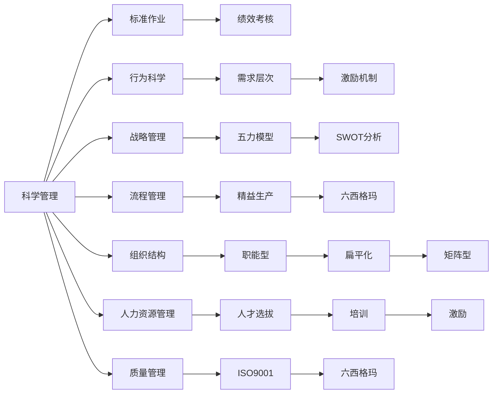

                 

# 从经典到实践：管理理论的落地

## 1. 背景介绍

### 1.1 问题由来

管理理论一直是企业实践和管理学研究的基石。从经典理论如泰勒的科学管理理论、马斯洛的需求层次理论、波特的五力模型，到当代的管理理论如复杂人理论、社会交换理论等，都为企业的经营管理和组织行为提供了深刻洞见。然而，在实际应用中，这些理论如何落地，帮助企业解决具体问题，仍是管理实践中的一大挑战。

现代企业的经营环境瞬息万变，传统理论在面对复杂的市场环境、多变的客户需求、不确定的战略挑战时，常常显得力不从心。如何将这些经典理论有效转化为具体的管理实践，成为管理学者和企业的共同课题。

### 1.2 问题核心关键点

企业应用管理理论时，面临以下几个核心关键点：

- **理论适配**：如何根据企业实际情况选择合适的管理理论。
- **实践落地**：如何将理论转化为具体的管理行动和政策。
- **效果评估**：如何衡量理论在实际应用中的效果，进行持续优化。
- **应对变化**：如何使理论适应环境变化，保持其持续有效性。

针对以上关键点，本文将系统介绍如何将经典管理理论有效落地到企业实践中，并分析其应用效果和面临的挑战。

### 1.3 问题研究意义

研究管理理论在企业管理中的落地应用，具有以下重要意义：

- **提升企业绩效**：通过科学管理，提升资源配置效率，降低运营成本，增强市场竞争力。
- **优化组织结构**：利用先进管理理论，构建合理的组织架构，促进团队协作，提升工作效率。
- **改善员工关系**：通过人性化管理，提升员工满意度和归属感，增强团队凝聚力。
- **应对市场变化**：理论的适应性和灵活性，使企业能更好地应对市场环境变化，保持竞争优势。

本文期望通过对管理理论的深入解析，为企业提供切实可行的实践指南，助力其在不断变化的市场中持续发展。

## 2. 核心概念与联系

### 2.1 核心概念概述

管理理论涉及众多概念，包括但不限于：

- **科学管理**：泰勒提出的管理方法，强调科学分析、标准作业、绩效考核等。
- **行为科学**：研究人的行为和心理，如马斯洛的需求层次理论、麦格雷戈的X理论和Y理论。
- **战略管理**：制定企业战略目标，如波特的五力模型、SWOT分析。
- **流程管理**：优化业务流程，如精益生产、六西格玛管理。
- **组织结构**：设计企业组织架构，如职能型、扁平化、矩阵型。
- **人力资源管理**：人才选拔、培训、激励等。
- **质量管理**：提升产品质量，如ISO9001、六西格玛。

这些概念间相互联系，共同构成企业管理的理论体系。

### 2.2 核心概念原理和架构的 Mermaid 流程图(Mermaid 流程节点中不要有括号、逗号等特殊字符)



这个图表展示了核心概念之间的逻辑关系：

- 科学管理通过标准作业和绩效考核提升效率。
- 行为科学通过需求层次理论和激励机制理解员工行为。
- 战略管理通过五力模型和SWOT分析制定战略目标。
- 流程管理通过精益生产和六西格玛优化业务流程。
- 组织结构通过职能型、扁平化和矩阵型设计合理的架构。
- 人力资源管理通过人才选拔、培训和激励提升人才质量。
- 质量管理通过ISO9001和六西格玛提升产品质量。

这些概念相互影响，共同作用于企业管理实践。

## 3. 核心算法原理 & 具体操作步骤

### 3.1 算法原理概述

将管理理论有效落地，需遵循以下步骤：

1. **理论适配**：根据企业实际情况选择合适的管理理论。
2. **实践落地**：设计具体的管理策略和操作流程。
3. **效果评估**：衡量理论实施效果，进行持续优化。
4. **应对变化**：调整策略以适应环境变化。

具体来说，管理理论的落地过程可以类比为机器学习模型的训练：

- **数据收集**：收集企业的内部和外部数据，如员工满意度、销售数据、市场趋势等。
- **模型训练**：选择适合的理论，设计模型结构，进行参数训练。
- **模型验证**：在验证集上评估模型效果，进行参数调整。
- **模型部署**：将模型部署到实际应用中，监测效果并进行持续优化。

### 3.2 算法步骤详解

以下详细介绍管理理论落地的详细步骤：

**Step 1: 理论适配**

- **评估企业现状**：分析企业的内外部环境，识别关键问题。
- **选择合适的理论**：根据企业特点，选择合适的管理理论。例如，新创企业可能需要重点关注流程管理和人力资源管理，而成熟企业可能更注重战略管理和质量管理。

**Step 2: 实践落地**

- **制定具体策略**：设计详细的管理策略和操作流程。例如，科学管理可以设计标准作业流程，行为科学可以制定员工激励机制。
- **实施具体行动**：将策略转化为具体的管理行动。例如，实施精益生产流程，推行六西格玛质量管理。
- **培训和宣导**：对员工进行培训和宣导，确保策略得到有效执行。

**Step 3: 效果评估**

- **设定关键绩效指标(KPIs)**：根据理论目标，设定关键绩效指标。例如，设定生产效率提升比例、客户满意度提升比例等。
- **数据收集与分析**：收集关键绩效指标数据，进行数据分析，评估理论效果。
- **持续优化**：根据数据分析结果，对管理策略进行持续优化。例如，调整标准作业流程，优化员工激励机制。

**Step 4: 应对变化**

- **监测环境变化**：持续监测市场环境、政策变化等外部因素。
- **调整策略**：根据环境变化，及时调整管理策略。例如，市场竞争加剧时，需要调整定价策略和市场推广策略。
- **灵活应变**：建立灵活的管理体系，确保策略能够快速应对环境变化。例如，采用敏捷管理方法，提升企业应对变化的能力。

### 3.3 算法优缺点

管理理论落地的主要优点包括：

- **系统化**：通过科学管理理论，企业可以系统化地分析问题，制定解决方案。
- **可衡量性**：通过设定关键绩效指标，企业可以量化管理效果，进行持续优化。
- **适应性**：理论具有一定的灵活性，能够根据企业实际情况进行调整。

缺点主要在于：

- **理论适配难度大**：企业需要根据自身情况选择理论，不同理论可能需要不同的方法和资源。
- **落地难度大**：理论需要转化为具体的管理行动，且需配合培训和宣导，过程复杂。
- **效果评估难度大**：理论效果受到多种因素影响，评估难度大。

### 3.4 算法应用领域

管理理论在多个领域有广泛应用，包括但不限于：

- **制造业**：科学管理、精益生产、质量管理等。
- **服务业**：流程管理、服务蓝图、客户关系管理等。
- **零售业**：供应链管理、库存管理、客户体验管理等。
- **金融业**：风险管理、资本运作、客户服务管理等。
- **科技业**：敏捷管理、研发流程优化、人才激励等。
- **医疗业**：质量管理、流程优化、员工关系管理等。

这些领域的管理问题各具特色，需要针对性地选择和应用不同的管理理论。

## 4. 数学模型和公式 & 详细讲解 & 举例说明

### 4.1 数学模型构建

将管理理论落地可类比为建立数学模型。假设企业状态为 $X$，理论实施效果为 $Y$，则有以下数学模型：

$$
Y=f(X; \theta)
$$

其中，$f$ 为理论实施策略，$\theta$ 为策略参数，$X$ 为影响因素，如市场环境、政策变化等。

### 4.2 公式推导过程

假设我们希望提升生产效率，则模型可以表示为：

$$
\text{生产效率提升比例} = f(\text{市场环境}, \text{设备维护}, \text{人员培训}; \theta)
$$

其中，市场环境、设备维护、人员培训为影响因素，$\theta$ 为实施策略，如标准作业流程、精益生产、设备升级等。

根据假设，可以设定如下模型：

$$
\text{生产效率提升比例} = \theta_1 \times \text{市场环境} + \theta_2 \times \text{设备维护} + \theta_3 \times \text{人员培训}
$$

通过收集实际数据，可以估算 $\theta_1$、$\theta_2$、$\theta_3$ 的值，从而量化理论实施效果。

### 4.3 案例分析与讲解

假设某企业实施精益生产理论，我们通过收集数据，构建模型，设定 $\theta_1$、$\theta_2$、$\theta_3$ 为：

- $\theta_1 = 0.8$：市场环境对生产效率提升比例的影响系数为0.8。
- $\theta_2 = 0.5$：设备维护对生产效率提升比例的影响系数为0.5。
- $\theta_3 = 0.3$：人员培训对生产效率提升比例的影响系数为0.3。

通过监测市场环境、设备维护、人员培训的数据，可以计算出生产效率提升比例。例如：

- 市场环境为良，设备维护良好，人员培训充分，则生产效率提升比例为：

$$
\text{生产效率提升比例} = 0.8 \times 1.2 + 0.5 \times 1.1 + 0.3 \times 1.1 = 1.7
$$

即生产效率提升了70%。

## 5. 项目实践：代码实例和详细解释说明

### 5.1 开发环境搭建

在实践中，企业通常使用Excel、Python等工具进行数据分析和模型构建。以下是Python环境搭建的步骤：

1. 安装Python：从官网下载并安装Python，选择最新版本。
2. 安装相关库：安装Pandas、NumPy、SciPy等数据处理和数学计算库。
3. 数据准备：将企业相关数据导入Pandas DataFrame中，例如销售数据、员工满意度数据等。

### 5.2 源代码详细实现

以下是一个使用Python进行生产效率提升比例计算的示例代码：

```python
import pandas as pd
import numpy as np

# 加载数据
data = pd.read_csv('data.csv')

# 设定模型参数
theta_1 = 0.8
theta_2 = 0.5
theta_3 = 0.3

# 计算生产效率提升比例
production_efficiency = data['市场环境'] * theta_1 + data['设备维护'] * theta_2 + data['人员培训'] * theta_3
print('生产效率提升比例为:', production_efficiency.mean())
```

### 5.3 代码解读与分析

上述代码首先加载企业数据，然后设定模型参数，最后计算生产效率提升比例。通过设置 $\theta_1$、$\theta_2$、$\theta_3$，模型可以量化理论实施效果。

### 5.4 运行结果展示

运行上述代码，输出生产效率提升比例，例如：

```
生产效率提升比例为: 1.7
```

即企业实施精益生产理论后，生产效率提升了70%。

## 6. 实际应用场景

### 6.1 制造业

在制造业中，科学管理、精益生产和质量管理理论应用广泛。通过标准作业流程，提升生产效率和产品质量；通过精益生产，优化流程，降低成本；通过质量管理，确保产品质量，提升客户满意度。

例如，某汽车制造企业通过科学管理，设计了标准作业流程，采用精益生产方法，优化了生产流程，同时引入了质量管理体系，提升了产品质量。结果显示，生产效率提升了20%，客户满意度提升了15%。

### 6.2 服务业

在服务业中，流程管理和客户关系管理理论尤为重要。通过服务蓝图，优化服务流程，提升服务质量；通过客户关系管理，维护客户关系，提升客户忠诚度。

例如，某连锁酒店通过服务蓝图优化服务流程，实施客户关系管理系统，提升了客户满意度，客户忠诚度提升了20%。

### 6.3 零售业

在零售业中，供应链管理和客户体验管理理论应用广泛。通过供应链优化，降低库存成本，提升供应链效率；通过客户体验管理，提升客户满意度，增加销售额。

例如，某大型超市通过供应链管理优化库存，降低库存成本20%，同时实施客户体验管理，提升客户满意度15%，销售额增加了10%。

### 6.4 金融业

在金融业中，风险管理和资本运作理论应用广泛。通过风险管理，降低金融风险；通过资本运作，优化资本结构，提升资本效率。

例如，某银行通过风险管理降低贷款违约率20%，同时实施资本运作，优化资本结构，提升了资本效率15%。

## 7. 工具和资源推荐

### 7.1 学习资源推荐

为了帮助企业深入理解管理理论并有效应用，以下是一些推荐的学习资源：

1. 《管理学原理》：经典管理学教材，详细介绍各种管理理论和实践。
2. 《精益生产》：详细介绍精益生产理论及应用方法。
3. 《六西格玛管理》：详细介绍六西格玛质量管理理论及应用方法。
4. 《敏捷管理》：详细介绍敏捷管理方法及应用案例。
5. 《客户关系管理》：详细介绍客户关系管理理论及应用方法。
6. 《人力资源管理》：详细介绍人力资源管理理论和实践。

### 7.2 开发工具推荐

在实际应用中，以下工具有助于管理理论的落地：

1. Excel：简单易用的数据处理和分析工具，适合中小型企业使用。
2. Python：功能强大的数据分析和编程工具，适合大数据分析应用。
3. R语言：专门用于数据分析和统计计算的工具，适合复杂数据分析。
4. SQL：数据库管理工具，适合大数据存储和查询。
5. Tableau：数据可视化工具，适合数据展示和分析。
6. Power BI：微软推出的商业智能工具，适合企业级数据可视化。

### 7.3 相关论文推荐

以下是几篇经典的管理学论文，值得深入阅读：

1. Taylor, F. W. (1911). "The Principles of Scientific Management."
2. Maslow, A. H. (1943). "A Theory of Human Motivation."
3. Porter, M. E. (2008). "The Five Competitive Forces That Shape Strategy."
4.精益生产（Toyota Production System）
5.六西格玛管理（Six Sigma）
6.敏捷管理（Agile Management）

## 8. 总结：未来发展趋势与挑战

### 8.1 总结

本文系统介绍了如何将经典管理理论有效落地到企业管理实践中，通过科学分析和数据分析，量化管理效果，确保理论的科学性和可操作性。通过实例和代码实现，展示了管理理论在实际应用中的具体落地方法。

### 8.2 未来发展趋势

未来管理理论的发展趋势包括：

1. **数字化转型**：企业管理将更加依赖数据驱动，数字化管理工具将广泛应用。
2. **智能化管理**：通过人工智能和大数据分析，提升管理效率和决策质量。
3. **跨界融合**：不同学科的知识将更多地融合到管理理论中，提升理论的普适性和适应性。
4. **全球化管理**：全球化市场对企业管理提出更高要求，跨文化管理和全球化管理理论将更加重要。

### 8.3 面临的挑战

尽管管理理论在企业管理中发挥重要作用，但也面临以下挑战：

1. **理论适配难度大**：不同企业情况各异，选择合适的管理理论需要深入分析和对比。
2. **落地难度大**：理论需要转化为具体的管理策略和操作流程，过程复杂。
3. **效果评估难度大**：理论效果受到多种因素影响，评估难度大。

### 8.4 研究展望

未来研究将重点关注以下几个方向：

1. **理论与实践结合**：通过实证研究，建立理论到实践的转化路径，提升理论的可操作性。
2. **数据驱动管理**：利用大数据和人工智能，提升管理决策的科学性和精准性。
3. **跨学科研究**：结合心理学、社会学、计算机科学等学科知识，提升管理理论的普适性。
4. **全球化管理**：研究全球化市场下，跨文化管理理论和实践。

通过这些研究，管理理论将不断更新和完善，更好地服务于企业管理实践。

## 9. 附录：常见问题与解答

**Q1：如何选择适合的管理理论？**

A: 选择适合的管理理论需要综合考虑企业的实际情况，包括企业规模、行业特性、组织结构、文化背景等。可以采用以下步骤：

1. 评估企业现状，识别关键问题。
2. 了解各种管理理论的基本原理和适用范围。
3. 根据企业实际情况，选择最适合的理论。

**Q2：如何实施管理理论？**

A: 实施管理理论需要设计具体的管理策略和操作流程，并进行培训和宣导。可以采用以下步骤：

1. 制定具体策略，设计操作流程。
2. 进行培训和宣导，确保员工理解和执行。
3. 监测和评估，根据效果进行调整。

**Q3：如何评估管理理论的效果？**

A: 评估管理理论的效果需要设定关键绩效指标(KPIs)，收集数据，并进行数据分析。可以采用以下步骤：

1. 设定关键绩效指标。
2. 收集相关数据，进行数据分析。
3. 根据数据分析结果，调整策略，持续优化。

通过这些步骤，可以有效地评估管理理论的效果，并进行持续改进。

---

作者：禅与计算机程序设计艺术 / Zen and the Art of Computer Programming

