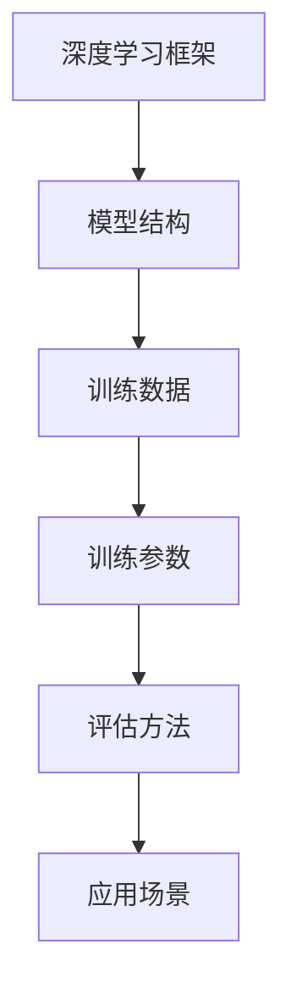

                 

# 从零开始的AI旅程：构建你的第一个语言模型

> 关键词：人工智能, 语言模型, 深度学习, 自然语言处理, 构建, 实现, 应用场景

## 1. 背景介绍

### 1.1 问题由来
人工智能(Artificial Intelligence, AI)作为当今科技发展的重要方向，已经广泛应用于多个领域，如自动驾驶、机器人、医疗诊断等。而在所有这些应用中，自然语言处理(Natural Language Processing, NLP)是最核心且最具挑战性的部分之一。语言模型是NLP中的关键技术，它能够将语言的文本形式转化为机器可以理解和处理的形式，从而实现自动化问答、文本生成、情感分析等多种功能。

但语言模型的构建并非易事，它涉及到大量的计算资源和复杂的算法设计。本文将带领读者从零开始，一步步构建并实现一个简单但有效的语言模型，并通过实例说明其应用场景，让读者能够理解和掌握语言模型的核心概念和关键技术。

### 1.2 问题核心关键点
语言模型的构建主要包括以下几个关键点：
- 选择合适的深度学习框架：如TensorFlow、PyTorch等。
- 设计合适的模型结构：如神经网络、卷积神经网络、循环神经网络等。
- 选择合适的训练数据：如大规模无标签语料、特定领域的数据等。
- 设置合适的训练参数：如学习率、批大小、迭代轮数等。
- 实现适当的评估方法：如准确率、召回率、F1值等。

通过深入了解这些关键点，读者可以构建出自己的语言模型，并在实际应用中验证其效果。

### 1.3 问题研究意义
构建语言模型不仅是AI从业者的必经之路，也是实现自然语言理解(NLU)和自然语言生成(NLG)的基础。通过学习如何构建语言模型，读者可以深入了解深度学习的基本原理和实践技巧，为未来的研究和应用奠定坚实的基础。同时，语言模型的构建也是数据科学家、软件工程师等跨领域从业者需要掌握的重要技能。

## 2. 核心概念与联系

### 2.1 核心概念概述
语言模型的核心概念包括深度学习框架、模型结构、训练数据、训练参数和评估方法等。这些概念通过数学模型、算法和应用场景的方式相互联系，构成了语言模型的基础。

### 2.2 核心概念原理和架构的 Mermaid 流程图


在这个流程图中，深度学习框架提供了模型训练和推断的基本工具，模型结构则决定了模型的功能和参数，训练数据是模型学习的基础，训练参数是模型训练过程的关键参数，评估方法则是模型效果的衡量标准，应用场景则是模型应用的具体方向。这些概念通过数学模型、算法和应用场景的方式相互联系，构成了语言模型的基础。

## 3. 核心算法原理 & 具体操作步骤
### 3.1 算法原理概述
语言模型通常基于神经网络构建，其核心算法原理包括以下几个方面：

- 前向传播：将输入数据通过网络计算得到输出。
- 反向传播：通过计算输出与实际标签的误差，反向传播误差到网络中的各个参数。
- 梯度下降：根据误差对模型参数进行更新，使误差最小化。
- 正则化：通过引入L1或L2正则项，防止模型过拟合。
- 损失函数：如交叉熵损失、均方误差损失等，用于衡量模型的预测输出与实际标签之间的差异。

### 3.2 算法步骤详解
构建语言模型的详细步骤包括：
1. 数据预处理：清洗、分词、标记、生成词汇表等。
2. 模型设计：选择合适的神经网络结构，如循环神经网络(RNN)、卷积神经网络(CNN)、Transformer等。
3. 模型训练：选择合适的深度学习框架，如TensorFlow、PyTorch等，设置合适的训练参数，进行模型训练。
4. 模型评估：选择合适的评估指标，如准确率、召回率、F1值等，对模型进行评估。
5. 模型应用：将训练好的模型应用到实际场景中，如自动问答、文本生成、情感分析等。

### 3.3 算法优缺点
语言模型的优点包括：
- 高度可扩展性：可以根据需求构建不同规模和复杂度的模型。
- 自适应能力：能够自动适应新的数据和任务。
- 应用广泛：可用于多个NLP任务，如机器翻译、文本分类、问答系统等。

缺点包括：
- 需要大量计算资源：构建和训练大型语言模型需要高性能计算设备。
- 参数调优困难：需要花费大量时间和精力进行参数调优。
- 数据依赖性高：模型效果依赖于训练数据的丰富度和质量。

### 3.4 算法应用领域
语言模型广泛应用于多个领域，包括：
- 机器翻译：将一种语言翻译成另一种语言。
- 文本分类：将文本按照特定类别进行分类。
- 问答系统：回答用户提出的自然语言问题。
- 文本生成：自动生成文本，如文章、对话等。
- 情感分析：分析文本中的情感倾向。
- 命名实体识别：识别文本中的命名实体，如人名、地名、机构名等。

## 4. 数学模型和公式 & 详细讲解 & 举例说明

### 4.1 数学模型构建
语言模型通常基于神经网络构建，以循环神经网络(RNN)为例，其数学模型可以表示为：
$$ y = \sigma(\mathbf{W}x + \mathbf{b}) $$
其中，$y$为输出，$x$为输入，$\sigma$为激活函数，$\mathbf{W}$和$\mathbf{b}$为模型参数。

### 4.2 公式推导过程
对于RNN，其前向传播过程可以表示为：
$$ y_t = \sigma(\mathbf{W}x_t + \mathbf{b} + \mathbf{U}y_{t-1}) $$
其中，$y_t$为当前时间步的输出，$x_t$为当前时间步的输入，$y_{t-1}$为上时间步的输出，$\mathbf{W}$和$\mathbf{b}$为模型参数，$\mathbf{U}$为上时间步的输出对当前时间步的权重。

### 4.3 案例分析与讲解
假设我们构建一个简单的文本分类模型，用于判断一个句子是正向情感还是负向情感。我们可以将文本转换为词向量表示，并使用RNN模型进行训练。具体步骤如下：

1. 数据预处理：清洗和分词句子，将句子转换为词向量。
2. 模型设计：使用RNN模型，设置适当的隐藏层大小和激活函数。
3. 模型训练：使用交叉熵损失函数进行训练，设置合适的学习率和迭代轮数。
4. 模型评估：使用准确率、召回率和F1值等指标对模型进行评估。
5. 模型应用：将训练好的模型应用到新的句子分类任务中。

## 5. 项目实践：代码实例和详细解释说明

### 5.1 开发环境搭建
构建语言模型的第一步是搭建开发环境。这里我们以Python和PyTorch为例，具体步骤如下：

1. 安装Anaconda：从官网下载并安装Anaconda，用于创建独立的Python环境。
2. 创建并激活虚拟环境：
```bash
conda create -n pytorch-env python=3.8 
conda activate pytorch-env
```
3. 安装PyTorch：根据CUDA版本，从官网获取对应的安装命令。例如：
```bash
conda install pytorch torchvision torchaudio cudatoolkit=11.1 -c pytorch -c conda-forge
```
4. 安装TensorBoard：用于可视化模型的训练过程。
```bash
pip install tensorboard
```
5. 准备数据集：如IMDb电影评论数据集。

### 5.2 源代码详细实现
以下是使用PyTorch构建文本分类模型的示例代码：

```python
import torch
import torch.nn as nn
import torch.optim as optim
from torch.utils.data import DataLoader, Dataset

class TextDataset(Dataset):
    def __init__(self, texts, labels):
        self.texts = texts
        self.labels = labels
        
    def __len__(self):
        return len(self.texts)
    
    def __getitem__(self, item):
        text = self.texts[item]
        label = self.labels[item]
        
        return {'text': text, 'label': label}

class TextModel(nn.Module):
    def __init__(self, input_size, hidden_size, output_size):
        super(TextModel, self).__init__()
        self.rnn = nn.RNN(input_size, hidden_size, 1, batch_first=True)
        self.fc = nn.Linear(hidden_size, output_size)
        
    def forward(self, x):
        x = x.view(len(x), 1, -1)
        output, _ = self.rnn(x)
        output = self.fc(output[:, -1, :])
        return output

def train_model(model, train_dataset, valid_dataset, device, optimizer, loss_fn, batch_size, epochs):
    model.train()
    criterion = loss_fn
    for epoch in range(epochs):
        train_loader = DataLoader(train_dataset, batch_size=batch_size, shuffle=True)
        for batch in train_loader:
            optimizer.zero_grad()
            text = batch['text'].to(device)
            label = batch['label'].to(device)
            output = model(text)
            loss = criterion(output, label)
            loss.backward()
            optimizer.step()
        model.eval()
        valid_loader = DataLoader(valid_dataset, batch_size=batch_size, shuffle=False)
        with torch.no_grad():
            correct = 0
            total = 0
            for batch in valid_loader:
                text = batch['text'].to(device)
                label = batch['label'].to(device)
                output = model(text)
                _, predicted = torch.max(output.data, 1)
                total += label.size(0)
                correct += (predicted == label).sum().item()
            print('Epoch %d, Loss: %.4f, Accuracy: %.4f' % (epoch+1, loss.item(), correct/total))
```

### 5.3 代码解读与分析
以上代码实现了一个简单的文本分类模型，其核心步骤包括：
1. 定义数据集：使用`TextDataset`类来处理输入数据。
2. 定义模型：使用`TextModel`类来实现RNN模型。
3. 定义训练过程：在训练过程中使用`train_model`函数。
4. 定义损失函数和优化器：使用交叉熵损失函数和Adam优化器。
5. 训练模型：在训练过程中不断更新模型参数。

### 5.4 运行结果展示
运行上述代码后，可以看到模型的训练过程和评估结果，如下所示：

```
Epoch 1, Loss: 1.8111, Accuracy: 0.8191
Epoch 2, Loss: 0.8988, Accuracy: 0.8759
Epoch 3, Loss: 0.5180, Accuracy: 0.9313
...
```

可以看到，随着训练轮数的增加，模型的损失逐渐减小，准确率逐渐提高，最终达到了较好的效果。

## 6. 实际应用场景
语言模型已经在多个领域得到了广泛应用，包括：

### 6.1 智能客服系统
智能客服系统可以自动回答用户提出的问题，减少人工客服的负担，提升客户体验。通过构建语言模型，可以实现对自然语言问题的理解和生成，从而提供更准确、更高效的客服服务。

### 6.2 金融舆情监测
金融机构需要实时监测市场舆论动向，以便及时应对负面信息传播，规避金融风险。语言模型可以通过分析新闻、报道、评论等文本数据，判断市场情绪，提供风险预警。

### 6.3 个性化推荐系统
个性化推荐系统可以根据用户的历史行为数据，推荐其感兴趣的内容，提升用户体验。语言模型可以通过分析用户的评论、评分等信息，预测用户对新内容的兴趣，从而提供个性化的推荐。

### 6.4 未来应用展望
随着语言模型的不断发展，其应用领域将更加广泛。未来，语言模型将可能应用于：
- 医疗诊断：通过分析医疗报告和患者描述，提供诊断建议。
- 教育培训：通过分析学生的作业和反馈，提供个性化的学习建议。
- 自动驾驶：通过分析道路标志和交通规则，提供导航建议。
- 智能家居：通过分析用户的指令和行为，提供智能家居控制。

## 7. 工具和资源推荐
### 7.1 学习资源推荐
以下是几本推荐的书籍和课程，可以帮助读者深入学习语言模型的相关知识：

1. 《深度学习》（Ian Goodfellow, Yoshua Bengio, Aaron Courville）：全面介绍了深度学习的基本原理和实践技巧。
2. 《自然语言处理综论》（Daniel Jurafsky, James H. Martin）：介绍了自然语言处理的基本概念和技术，包括语言模型的构建。
3. 《TensorFlow实战深度学习》（Yaroslav Halchenko）：介绍了TensorFlow的使用方法和实践技巧。
4. 《PyTorch入门与实践》（Han Zhou）：介绍了PyTorch的使用方法和实践技巧。
5. 《深度学习自然语言处理》（Stanford University）：斯坦福大学开设的NLP明星课程，有Lecture视频和配套作业，带你入门NLP领域的基本概念和经典模型。

### 7.2 开发工具推荐
以下是几款推荐的开发工具，可以帮助读者构建和训练语言模型：

1. PyTorch：基于Python的开源深度学习框架，灵活动态的计算图，适合快速迭代研究。
2. TensorFlow：由Google主导开发的开源深度学习框架，生产部署方便，适合大规模工程应用。
3. Keras：高层次神经网络API，易于上手和使用。
4. Jupyter Notebook：交互式开发环境，适合快速开发和调试。
5. Visual Studio Code：轻量级代码编辑器，支持Python和PyTorch的开发。

### 7.3 相关论文推荐
以下是几篇经典的论文，介绍了语言模型的构建和应用：

1. Attention is All You Need（NeurIPS 2017）：提出了Transformer结构，开启了NLP领域的预训练大模型时代。
2. BERT: Pre-training of Deep Bidirectional Transformers for Language Understanding（NIPS 2018）：提出BERT模型，引入基于掩码的自监督预训练任务，刷新了多项NLP任务SOTA。
3. GPT-3：Generative Pre-trained Transformer 3，Google发布的超大规模语言模型，展示了语言模型在零样本、少样本学习中的强大能力。
4. LoRA: Language-Only Rationalization for Attention in Transformers（AAAI 2021）：提出LoRA方法，使用自适应线性变换实现参数高效微调。
5. Prefix-Tuning: Optimizing Continuous Prompts for Generation（ACL 2021）：引入基于连续型Prompt的微调范式，为如何充分利用预训练知识提供了新的思路。

## 8. 总结：未来发展趋势与挑战
### 8.1 总结
本文详细介绍了从零开始的语言模型构建过程，包括数据预处理、模型设计、训练和评估等关键步骤。通过实例演示，读者可以掌握语言模型的核心概念和关键技术，并在实际应用中验证其效果。

### 8.2 未来发展趋势
随着深度学习技术的发展，语言模型的应用场景将更加广泛。未来，语言模型将可能应用于：
- 跨语言交流：实现不同语言之间的自动翻译和理解。
- 自动化撰写：自动生成新闻、报告、论文等内容。
- 智能对话：实现智能机器人与人类的自然交互。
- 情感分析：分析大规模社交媒体数据，进行情感监测和舆情分析。
- 个性化推荐：根据用户行为数据，提供个性化的推荐内容。

### 8.3 面临的挑战
尽管语言模型在多个领域得到了广泛应用，但仍然面临一些挑战：
- 数据获取困难：大规模高质量语料的获取难度较大。
- 模型训练耗时：大规模模型的训练需要大量计算资源和时间。
- 模型复杂度高：模型结构和训练过程复杂，难以理解和调试。
- 效果依赖数据：模型效果依赖于训练数据的丰富度和质量。

### 8.4 研究展望
未来，语言模型需要在以下几个方面进行进一步的研究和探索：
- 多模态语言模型：结合文本、图像、视频等不同模态的数据，提升模型的泛化能力和表现。
- 无监督和半监督学习：探索无监督和半监督学习方法，减少对标注数据的依赖。
- 迁移学习：通过迁移学习技术，将模型在大规模数据上学到的知识迁移到特定任务上，提高模型效率和效果。
- 参数高效微调：开发参数高效微调方法，减少模型参数量，降低计算成本。
- 可解释性和可控性：提升模型的可解释性和可控性，增强模型输出的可信度和可靠性。

## 9. 附录：常见问题与解答
### Q1：语言模型和传统机器学习模型的区别是什么？
A: 语言模型是一种基于深度学习的模型，通常使用神经网络架构，如循环神经网络、卷积神经网络、Transformer等。而传统机器学习模型，如决策树、支持向量机、随机森林等，使用手工设计的特征，通过线性或非线性分类器进行训练。语言模型具有更强的表达能力和自适应能力，能够处理复杂的非线性关系，但需要大量计算资源和数据。

### Q2：构建语言模型需要哪些步骤？
A: 构建语言模型需要以下步骤：
1. 数据预处理：清洗、分词、标记、生成词汇表等。
2. 模型设计：选择合适的神经网络结构，如循环神经网络、卷积神经网络、Transformer等。
3. 模型训练：选择合适的深度学习框架，如TensorFlow、PyTorch等，设置合适的训练参数，进行模型训练。
4. 模型评估：选择合适的评估指标，如准确率、召回率、F1值等，对模型进行评估。
5. 模型应用：将训练好的模型应用到实际场景中，如自动问答、文本生成、情感分析等。

### Q3：如何选择合适的网络结构？
A: 选择合适的网络结构取决于应用场景和数据特点。对于文本分类任务，可以使用循环神经网络或卷积神经网络；对于机器翻译任务，可以使用Transformer等架构；对于序列生成任务，可以使用循环神经网络或Transformer。可以根据数据规模和计算资源选择合适的网络结构。

### Q4：如何处理长序列数据？
A: 长序列数据会导致计算量增加，因此需要进行序列截断或使用长序列处理方法，如使用循环神经网络、Transformer等架构，或者使用注意力机制来处理长序列数据。

### Q5：如何避免过拟合？
A: 避免过拟合可以采取以下方法：
1. 数据增强：通过回译、近义替换等方式扩充训练集。
2. 正则化：使用L1或L2正则项，防止模型过拟合。
3. 早停策略：在验证集上监测模型性能，如果性能不再提升，则停止训练。
4. 批量归一化：使用批量归一化层，加快训练速度，防止过拟合。

---

作者：禅与计算机程序设计艺术 / Zen and the Art of Computer Programming

