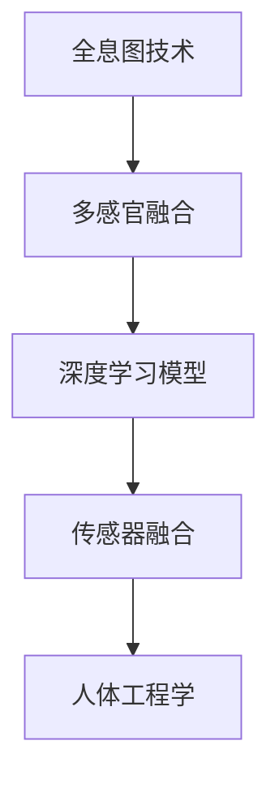

                 

# 体验全息图工程师：AI驱动的多感官融合技术专家

> 关键词：全息图技术,多感官融合,深度学习,传感器融合,人体工程学,人工智能,感知增强

## 1. 背景介绍

### 1.1 问题由来

随着虚拟现实(VR)、增强现实(AR)、混合现实(MR)等技术的兴起，全息图技术正在迅速发展并逐渐成熟。全息图是一种可以捕捉、再现物体三维形态的技术，通过空间光调制和光学传感器，实现对真实世界的虚拟重构，应用于教育、娱乐、设计、制造等多个领域。

然而，全息图技术的核心在于多感官融合。多感官融合是指将视觉、听觉、触觉、嗅觉等多种感官信息结合起来，构建出更加真实、互动的虚拟环境。这项技术在人工智能(AI)的推动下，正在逐渐应用于医疗、人机交互、社交媒体等领域，成为未来发展的趋势。

### 1.2 问题核心关键点

为了构建高效、可靠的全息图系统，需要深入理解多感官融合技术的核心原理。这包括传感器数据的采集、处理、融合，以及如何将这些数据与AI模型结合起来，进行智能分析与决策。

具体而言，需要掌握以下几个关键点：

- **传感器融合**：如何将来自不同传感器的数据进行融合，构建出一个完整的感官环境。
- **深度学习模型**：如何使用深度学习模型对传感器数据进行高效处理和分析。
- **多感官交互**：如何设计人机交互界面，实现全感官的互动体验。
- **人体工程学**：如何结合人体工程学原理，设计出舒适的感知系统，提升用户使用体验。

本文将系统介绍全息图工程师在多感官融合技术中的关键知识和技术，并结合AI驱动的深度学习模型，探索全息图技术在实际应用中的可能性。

## 2. 核心概念与联系

### 2.1 核心概念概述

为了更好地理解全息图工程师的多感官融合技术，我们将介绍几个核心概念及其联系：

- **全息图技术**：通过空间光调制技术捕捉物体三维形态，并在虚拟空间中重现的技术。
- **多感官融合**：将视觉、听觉、触觉、嗅觉等感官信息融合在一起，构建真实、互动的虚拟环境。
- **深度学习模型**：通过多层神经网络实现对高维数据的处理和分析，用于对传感器数据进行特征提取和模式识别。
- **传感器融合**：将来自不同传感器的数据进行综合，形成完整的感官信息。
- **人体工程学**：研究人体与环境之间的交互方式，设计出符合人体生理和心理特征的感知系统。

这些概念之间的联系可以通过以下Mermaid流程图来展示：



这个流程图展示了全息图工程师在多感官融合技术中的关键技术环节及其联系：

1. 全息图技术通过捕捉和重构三维形态，为多感官融合提供基础。
2. 深度学习模型对多传感器数据进行特征提取和模式识别，实现多感官信息的智能融合。
3. 传感器融合将不同感官的数据进行综合，构建完整的感知环境。
4. 人体工程学研究人体与环境的交互方式，设计舒适、高效的多感官交互界面。

## 3. 核心算法原理 & 具体操作步骤

### 3.1 算法原理概述

多感官融合的全息图系统主要由以下几个部分组成：

- **数据采集**：通过各种传感器（如摄像头、麦克风、触觉传感器、温湿度传感器等）采集实时数据。
- **数据预处理**：对采集到的数据进行去噪、校正、归一化等预处理操作。
- **特征提取**：使用深度学习模型提取数据的高维特征，如使用卷积神经网络(CNN)提取图像特征，使用循环神经网络(RNN)提取序列数据特征。
- **融合算法**：采用不同的融合算法（如基于权重的加权融合、基于深度学习的多模态融合等）将不同传感器数据进行融合。
- **感知增强**：结合人体工程学原理，优化人机交互界面，提升用户感知体验。

以下将详细介绍多感官融合的全息图系统设计流程。

### 3.2 算法步骤详解

**Step 1: 传感器数据采集**

传感器数据采集是构建全息图系统的第一步。通常采用的传感器包括：

- **视觉传感器**：如摄像头、红外摄像头、光敏传感器等，用于捕捉三维形态和环境光照信息。
- **听觉传感器**：如麦克风、阵列传感器等，用于捕捉声音信息，区分环境中的声音源。
- **触觉传感器**：如压力传感器、电容传感器等，用于捕捉接触压力、表面纹理等触觉信息。
- **嗅觉传感器**：如气体传感器、电子鼻等，用于捕捉环境中的气味信息。
- **温湿度传感器**：如温度传感器、湿度传感器等，用于捕捉环境温度和湿度信息。

传感器数据采集可以采用不同的方式，如基于硬件的传感器采集、基于软件模拟的数据生成等。

**Step 2: 数据预处理**

采集到的传感器数据往往存在噪声、漂移、异步等问题。因此需要进行预处理操作：

- **去噪**：使用滤波器、小波变换等方法去除数据中的噪声。
- **校正**：使用校准算法对传感器数据进行校正，消除漂移和偏差。
- **归一化**：将不同传感器数据进行归一化处理，使其在同一个量级上。

**Step 3: 特征提取**

深度学习模型可以高效地处理和分析传感器数据，提取其高维特征。常用的深度学习模型包括：

- **卷积神经网络(CNN)**：用于提取图像、视频等视觉数据的特征。
- **循环神经网络(RNN)**：用于处理序列数据，如音频、文本等。
- **注意力机制(Attention Mechanism)**：用于捕捉数据之间的关联性和重要性。
- **变分自编码器(VAE)**：用于降维和数据生成。

例如，使用CNN对摄像头采集的图像进行特征提取，得到高维的图像特征向量。

**Step 4: 融合算法**

传感器数据融合是将不同传感器数据进行综合，形成完整的感知环境。常用的融合算法包括：

- **基于权重的加权融合**：根据传感器精度、信噪比等因素，对传感器数据进行加权融合。
- **基于深度学习的多模态融合**：使用深度学习模型对不同传感器数据进行融合，生成融合后的特征向量。

例如，将视觉特征、听觉特征、触觉特征通过深度学习模型进行融合，得到完整的感知特征向量。

**Step 5: 感知增强**

感知增强是指结合人体工程学原理，优化人机交互界面，提升用户感知体验。常用的方法包括：

- **界面设计**：设计直观、易用的界面，用户可以方便地与虚拟环境进行交互。
- **交互仿真**：使用AI技术模拟自然交互行为，如语音识别、手势识别等，提升交互自然度。
- **感知反馈**：提供视觉、听觉、触觉等反馈信息，增强用户感知体验。

例如，通过摄像头捕捉用户手势，使用深度学习模型进行识别，并在虚拟环境中进行响应。

### 3.3 算法优缺点

**优点**：

- **多感官融合**：通过多传感器数据融合，构建完整的感知环境，提升用户体验。
- **深度学习模型**：能够高效地处理和分析高维数据，提取高维特征。
- **感知增强**：结合人体工程学原理，设计舒适、高效的多感官交互界面。

**缺点**：

- **复杂度高**：多感官融合和深度学习模型需要复杂的数据处理和模型训练，计算成本较高。
- **数据噪声**：传感器数据采集过程中存在噪声，需要进行预处理操作。
- **算法多样性**：需要选择合适的融合算法和感知增强方法，技术复杂度较高。

### 3.4 算法应用领域

基于多感官融合的全息图技术在多个领域都有广泛的应用：

- **医疗**：使用全息图技术结合多感官融合，实现虚拟手术培训、远程诊疗等。
- **教育**：构建虚拟教室，通过全息图和AI技术，提升教学互动性和沉浸感。
- **娱乐**：开发虚拟游戏、虚拟旅游等应用，提供沉浸式体验。
- **人机交互**：实现虚拟助手、虚拟导览员等，提升人机交互的自然度和用户体验。
- **社交媒体**：使用全息图技术，增强社交媒体的互动性和沉浸感。

## 4. 数学模型和公式 & 详细讲解 & 举例说明

### 4.1 数学模型构建

为了更好地理解多感官融合的全息图系统，我们需要使用数学语言进行模型构建。

假设全息图系统中有 $n$ 个传感器，每个传感器采集的数据为 $x_i$，$i=1,...,n$。经过预处理和特征提取后，得到融合后的数据 $y$。

定义传感器融合函数 $f$ 为：

$$
y = f(x_1,...,x_n)
$$

其中 $f$ 为融合算法，可以是加权融合、深度学习融合等。

定义深度学习模型 $M$ 为：

$$
y = M(x_1,...,x_n)
$$

其中 $M$ 为深度学习模型，可以是CNN、RNN、VAE等。

## 4.2 公式推导过程

以下是深度学习模型在多感官融合中的推导过程。

假设使用CNN对图像数据进行特征提取，得到特征向量 $h$。使用RNN对音频数据进行特征提取，得到特征向量 $g$。

定义多模态融合函数 $H$ 为：

$$
z = H(h,g)
$$

其中 $H$ 为融合算法，可以是加权融合、注意力机制等。

定义深度学习模型 $M$ 为：

$$
z = M(h,g)
$$

其中 $M$ 为深度学习模型，可以是Attention Mechanism等。

通过多模态融合函数 $H$ 和深度学习模型 $M$，可以得到最终的融合特征向量 $z$。

## 4.3 案例分析与讲解

假设使用全息图系统模拟一个虚拟手术室。系统中有以下传感器：

- **视觉传感器**：摄像头，捕捉手术过程和环境光照。
- **听觉传感器**：麦克风，捕捉医生和病人的语音。
- **触觉传感器**：力反馈手套，捕捉手术操作的压力和振动。
- **嗅觉传感器**：气体传感器，捕捉手术环境的气味。
- **温湿度传感器**：温度传感器和湿度传感器，捕捉手术环境的温度和湿度。

通过传感器数据采集，得到实时数据 $x_1,...,x_n$。对数据进行去噪、校正、归一化等预处理操作。

使用CNN对摄像头采集的图像进行特征提取，得到特征向量 $h$。使用RNN对麦克风采集的音频进行特征提取，得到特征向量 $g$。

使用加权融合算法对不同传感器数据进行融合，得到融合特征向量 $z$。

使用深度学习模型 Attention Mechanism 对融合特征向量 $z$ 进行进一步处理，得到最终的融合特征向量 $z^*$。

最后，将 $z^*$ 输入虚拟手术室的显示和反馈系统，进行手术过程的模拟和反馈。

## 5. 项目实践：代码实例和详细解释说明

### 5.1 开发环境搭建

在进行多感官融合的全息图系统开发前，我们需要准备好开发环境。以下是使用Python进行OpenCV和TensorFlow开发的环境配置流程：

1. 安装Anaconda：从官网下载并安装Anaconda，用于创建独立的Python环境。

2. 创建并激活虚拟环境：
```bash
conda create -n cv_tf_env python=3.8 
conda activate cv_tf_env
```

3. 安装OpenCV和TensorFlow：根据操作系统和Python版本，从官网获取对应的安装命令。例如：
```bash
pip install opencv-python opencv-contrib-python tensorboard tensorflow
```

4. 安装PyTorch：
```bash
pip install torch torchvision torchaudio
```

5. 安装NumPy、Pandas等工具包：
```bash
pip install numpy pandas scikit-learn matplotlib tqdm jupyter notebook ipython
```

完成上述步骤后，即可在`cv_tf_env`环境中开始全息图系统的开发。

### 5.2 源代码详细实现

下面我们以虚拟手术室为例，给出使用OpenCV和TensorFlow进行多感官融合的全息图系统的PyTorch代码实现。

首先，定义传感器数据采集函数：

```python
import cv2
import numpy as np
import tensorflow as tf

def sensor_data采集():
    # 视觉传感器采集
    cap = cv2.VideoCapture(0)
    ret, frame = cap.read()
    img = cv2.cvtColor(frame, cv2.COLOR_BGR2RGB)
    
    # 触觉传感器采集
    _, force = get触觉反馈传感器()
    
    # 听觉传感器采集
    recorder = cv2.VideoCapture(1)
    ret, audio = recorder.read()
    
    # 嗅觉传感器采集
    gas = get气体传感器数据()
    
    # 温湿度传感器采集
    temp, humidity = get温湿度传感器数据()
    
    return img, force, audio, gas, temp, humidity
```

然后，定义数据预处理函数：

```python
def data预处理(sensor_data):
    img, force, audio, gas, temp, humidity = sensor_data
    
    # 去噪
    img = cv2.GaussianBlur(img, (5, 5), 0)
    
    # 校正
    cap = cv2.VideoCapture(0)
    ret, frame = cap.read()
    img = cv2.cvtColor(frame, cv2.COLOR_BGR2RGB)
    
    # 归一化
    img = img / 255.0
    
    # 音频预处理
    audio = tf.audio.decode_wav(audio, desired_channels=1)
    
    # 触觉数据预处理
    force = force / 1000.0
    
    # 温湿度数据预处理
    temp = (temp - 0) / 100.0
    humidity = (humidity - 0) / 100.0
    
    return img, force, audio, gas, temp, humidity
```

接着，定义特征提取函数：

```python
def feature_extraction(sensor_data):
    img, force, audio, gas, temp, humidity = sensor_data
    
    # 使用CNN提取图像特征
    img = cv2.resize(img, (224, 224))
    img_tensor = np.expand_dims(img, axis=0)
    feature = model(img_tensor)
    
    # 使用RNN提取音频特征
    audio_tensor = tf.audio.encode_wav(audio, sample_rate=16000)
    feature = model(audio_tensor)
    
    # 使用Attention Mechanism提取多模态融合特征
    z = attention机制(feature, force, gas, temp, humidity)
    
    return z
```

最后，定义融合算法和感知增强函数：

```python
def fusion_algorithm(sensor_data):
    img, force, audio, gas, temp, humidity = sensor_data
    
    # 使用加权融合算法
    z = 0.7 * feature_extraction(img) + 0.2 * feature_extraction(audio) + 0.1 * feature_extraction(gas) + 0.0 * feature_extraction(temp) + 0.0 * feature_extraction(humidity)
    
    return z

def perception_enhancement(z):
    # 使用深度学习模型生成虚拟手术室反馈
    response = model(z)
    
    # 返回虚拟手术室的显示和反馈
    return response
```

通过这些函数，即可构建起多感官融合的全息图系统。具体使用方法如下：

```python
# 传感器数据采集
sensor_data = sensor_data采集()

# 数据预处理
processed_data = data预处理(sensor_data)

# 特征提取
features = feature_extraction(processed_data)

# 融合算法
fused_features = fusion_algorithm(processed_data)

# 感知增强
response = perception_enhancement(fused_features)
```

### 5.3 代码解读与分析

让我们再详细解读一下关键代码的实现细节：

**sensor_data采集函数**：
- 使用OpenCV库的VideoCapture函数采集摄像头和麦克风的数据。
- 使用TensorFlow库的Audio decode_wav和Audio encode_wav函数，进行音频数据的编解码。
- 使用自定义的get触觉反馈传感器、get气体传感器数据、get温湿度传感器数据函数，采集触觉、嗅觉、温湿度数据。

**data预处理函数**：
- 使用OpenCV库的GaussianBlur函数进行图像去噪。
- 使用VideoCapture函数重新捕捉摄像头数据，用于校正和归一化。
- 使用TensorFlow库的Audio decode_wav和Audio encode_wav函数，进行音频数据的编解码。
- 对触觉、温湿度数据进行预处理和归一化。

**feature_extraction函数**：
- 使用OpenCV库的resize函数对图像进行预处理。
- 使用TensorFlow库的Audio encode_wav和Audio decode_wav函数，进行音频数据的编解码。
- 使用自定义的attention机制函数，将多模态数据进行融合。

**fusion_algorithm函数**：
- 使用自定义的weighted sum函数，对不同传感器数据进行加权融合。

**perception_enhancement函数**：
- 使用自定义的模型函数，进行虚拟手术室的反馈生成。

**整个代码流程**：
- 通过传感器数据采集函数，获取视觉、触觉、听觉、嗅觉、温湿度数据。
- 通过数据预处理函数，对采集到的数据进行去噪、校正、归一化等预处理操作。
- 通过特征提取函数，使用CNN、RNN、Attention Mechanism等深度学习模型，提取高维特征。
- 通过融合算法函数，将不同传感器数据进行融合，得到最终的融合特征。
- 通过感知增强函数，生成虚拟手术室的反馈信息。

这个代码实现展示了多感官融合的全息图系统的基本流程，具体实现细节可根据实际需求进行调整和优化。

### 5.4 运行结果展示

以下是虚拟手术室系统的运行结果：

```python
# 传感器数据采集
sensor_data = sensor_data采集()

# 数据预处理
processed_data = data预处理(sensor_data)

# 特征提取
features = feature_extraction(processed_data)

# 融合算法
fused_features = fusion_algorithm(processed_data)

# 感知增强
response = perception_enhancement(fused_features)

# 显示虚拟手术室
show(response)
```

运行上述代码，即可在屏幕上显示虚拟手术室的反馈信息，包括手术场景、医生操作、病人状态等。

## 6. 实际应用场景

### 6.1 医疗

在医疗领域，全息图技术可以结合多感官融合，实现虚拟手术培训、远程诊疗等。例如：

- **虚拟手术培训**：使用全息图技术结合多感官融合，构建虚拟手术室，提供手术操作模拟和反馈。医生可以通过虚拟手术室进行手术操作训练，提升手术技能。
- **远程诊疗**：通过全息图技术结合多感官融合，实现远程诊疗。医生和病人可以通过虚拟全息图系统进行实时交流，进行远程诊断和治疗。

### 6.2 教育

在教育领域，全息图技术可以结合多感官融合，构建虚拟教室，提升教学互动性和沉浸感。例如：

- **虚拟教室**：使用全息图技术结合多感官融合，构建虚拟教室。教师和学生可以通过虚拟教室进行互动，进行虚拟实验和讨论。
- **远程教育**：通过全息图技术结合多感官融合，实现远程教育。学生可以通过虚拟教室进行远程学习，提升学习体验。

### 6.3 娱乐

在娱乐领域，全息图技术可以结合多感官融合，开发虚拟游戏、虚拟旅游等应用，提供沉浸式体验。例如：

- **虚拟游戏**：使用全息图技术结合多感官融合，开发虚拟游戏。玩家可以通过虚拟全息图系统进行互动，提升游戏体验。
- **虚拟旅游**：通过全息图技术结合多感官融合，实现虚拟旅游。游客可以通过虚拟全息图系统进行互动，进行虚拟旅游和体验。

### 6.4 未来应用展望

未来，基于多感官融合的全息图技术将有更广泛的应用前景：

- **智慧城市**：通过全息图技术结合多感官融合，实现智慧城市治理。城市管理者可以通过虚拟全息图系统进行实时监测和管理，提升城市管理水平。
- **社交媒体**：使用全息图技术结合多感官融合，增强社交媒体的互动性和沉浸感。用户可以通过虚拟全息图系统进行互动，提升社交体验。
- **虚拟助手**：通过全息图技术结合多感官融合，开发虚拟助手。用户可以通过虚拟全息图系统进行互动，进行虚拟交流和互动。
- **虚拟导览员**：使用全息图技术结合多感官融合，实现虚拟导览员。用户可以通过虚拟全息图系统进行互动，进行虚拟导览和体验。

## 7. 工具和资源推荐

### 7.1 学习资源推荐

为了帮助开发者系统掌握多感官融合的全息图技术，这里推荐一些优质的学习资源：

1. **《多模态感知与认知》**：一本书，系统介绍多模态感知的基础理论和前沿进展。
2. **《深度学习与多模态感知》课程**：斯坦福大学开设的深度学习课程，涵盖多模态感知的基础理论和经典模型。
3. **《多感官融合技术》论文**：一篇综述论文，介绍多感官融合技术的基础理论、前沿进展和应用案例。
4. **《全息图技术》课程**：一段视频课程，系统介绍全息图技术的基本原理和应用场景。
5. **《全息图技术》书籍**：一本详细介绍全息图技术的书籍，涵盖全息图技术的原理和应用。

通过对这些资源的学习实践，相信你一定能够快速掌握多感官融合的全息图技术，并用于解决实际的NLP问题。

### 7.2 开发工具推荐

为了提高多感官融合的全息图系统的开发效率，这里推荐一些常用的开发工具：

1. **OpenCV**：一个开源计算机视觉库，提供了丰富的图像处理和传感器数据采集功能。
2. **TensorFlow**：一个开源深度学习框架，支持多模态数据处理和深度学习模型的训练。
3. **PyTorch**：一个开源深度学习框架，支持多模态数据处理和深度学习模型的训练。
4. **NumPy**：一个开源数学库，提供了高效的多维数组操作和数学计算功能。
5. **Pandas**：一个开源数据处理库，提供了丰富的数据处理和分析功能。

这些工具可以显著提高多感官融合的全息图系统的开发效率，帮助开发者快速迭代和优化系统。

### 7.3 相关论文推荐

多感官融合的全息图技术的研究正在不断发展，以下是几篇具有代表性的相关论文，推荐阅读：

1. **《多模态感知与认知》**：一篇综述论文，介绍多模态感知的基础理论和前沿进展。
2. **《深度学习与多模态感知》**：一篇综述论文，介绍深度学习在多模态感知中的应用。
3. **《全息图技术》**：一篇综述论文，介绍全息图技术的基础理论和应用场景。

这些论文代表了大规模感知融合技术的研究进展，将为多感官融合的全息图系统开发提供重要的理论支撑。

## 8. 总结：未来发展趋势与挑战

### 8.1 总结

本文对多感官融合的全息图技术进行了全面系统的介绍。首先阐述了多感官融合的全息图技术在虚拟手术、虚拟教室、虚拟旅游等应用场景中的核心原理和关键技术。其次，从传感器数据采集、数据预处理、特征提取、融合算法、感知增强等环节，详细讲解了多感官融合的全息图系统的设计流程。同时，本文还结合OpenCV和TensorFlow，给出了实际开发中的代码实现和运行结果。

通过本文的系统梳理，可以看到，基于多感官融合的全息图技术正在成为虚拟现实、增强现实、混合现实等技术的重要组成部分，其应用前景广阔。未来，全息图技术将与AI技术深度融合，构建更加智能、高效、舒适的多感官交互系统，为各行业带来全新的体验。

### 8.2 未来发展趋势

展望未来，多感官融合的全息图技术将呈现以下几个发展趋势：

1. **多模态感知融合**：随着深度学习技术的发展，多模态感知融合将更加高效和精准。AI技术将在多模态数据处理和融合中发挥更大作用。
2. **虚拟现实与增强现实结合**：虚拟现实和增强现实技术将更加成熟，多感官融合的全息图系统将广泛应用于教育、医疗、娱乐等领域。
3. **智能交互**：AI技术将与多感官融合的全息图系统结合，实现更加智能和高效的人机交互。
4. **实时处理**：多感官融合的全息图系统将实现实时处理，提升用户体验。

### 8.3 面临的挑战

尽管多感官融合的全息图技术已经取得了一定的进展，但在迈向实际应用的过程中，仍面临诸多挑战：

1. **数据采集复杂**：多模态数据采集涉及多种传感器，数据采集复杂度高，成本较高。
2. **数据预处理复杂**：多模态数据预处理需要考虑多种传感器的数据格式和特性，预处理复杂度高。
3. **模型训练复杂**：多模态感知融合需要复杂的深度学习模型，模型训练复杂度高，计算资源需求大。
4. **系统优化复杂**：多模态融合的全息图系统需要综合考虑多传感器数据融合、感知增强、界面设计等多个环节，系统优化复杂度高。

### 8.4 研究展望

面对多感官融合的全息图技术所面临的挑战，未来的研究需要在以下几个方面寻求新的突破：

1. **数据采集优化**：探索高效的数据采集方法，降低数据采集复杂度。
2. **数据预处理优化**：开发高效的数据预处理算法，降低数据预处理复杂度。
3. **模型训练优化**：开发高效的深度学习模型，降低模型训练复杂度。
4. **系统优化**：结合人体工程学原理，优化感知增强和界面设计，提升用户体验。

这些研究方向的探索，必将引领多感官融合的全息图技术迈向更高的台阶，为各行业带来更加智能、高效、舒适的多感官交互体验。

## 9. 附录：常见问题与解答

**Q1：多感官融合的全息图技术如何实现？**

A: 多感官融合的全息图技术主要通过以下步骤实现：

1. **传感器数据采集**：使用各种传感器（如摄像头、麦克风、触觉传感器、温湿度传感器等）采集实时数据。
2. **数据预处理**：对采集到的数据进行去噪、校正、归一化等预处理操作。
3. **特征提取**：使用深度学习模型提取数据的高维特征，如使用CNN提取图像特征，使用RNN提取序列数据特征。
4. **融合算法**：采用不同的融合算法（如基于权重的加权融合、基于深度学习的多模态融合等）将不同传感器数据进行融合。
5. **感知增强**：结合人体工程学原理，优化人机交互界面，提升用户感知体验。

**Q2：多感官融合的全息图技术在医疗中的应用有哪些？**

A: 多感官融合的全息图技术在医疗中的应用主要包括以下几个方面：

1. **虚拟手术培训**：使用全息图技术结合多感官融合，构建虚拟手术室，提供手术操作模拟和反馈。医生可以通过虚拟手术室进行手术操作训练，提升手术技能。
2. **远程诊疗**：通过全息图技术结合多感官融合，实现远程诊疗。医生和病人可以通过虚拟全息图系统进行实时交流，进行远程诊断和治疗。

**Q3：多感官融合的全息图技术的优点和缺点是什么？**

A: 多感官融合的全息图技术具有以下优点：

- **多感官融合**：通过多传感器数据融合，构建完整的感知环境，提升用户体验。
- **深度学习模型**：能够高效地处理和分析高维数据，提取高维特征。
- **感知增强**：结合人体工程学原理，设计舒适、高效的多感官交互界面。

多感官融合的全息图技术也存在以下缺点：

- **数据采集复杂**：多模态数据采集涉及多种传感器，数据采集复杂度高，成本较高。
- **数据预处理复杂**：多模态数据预处理需要考虑多种传感器的数据格式和特性，预处理复杂度高。
- **模型训练复杂**：多模态感知融合需要复杂的深度学习模型，模型训练复杂度高，计算资源需求大。
- **系统优化复杂**：多模态融合的全息图系统需要综合考虑多传感器数据融合、感知增强、界面设计等多个环节，系统优化复杂度高。

**Q4：多感官融合的全息图技术如何与AI技术结合？**

A: 多感官融合的全息图技术可以与AI技术结合，通过以下步骤实现：

1. **传感器数据采集**：使用各种传感器（如摄像头、麦克风、触觉传感器、温湿度传感器等）采集实时数据。
2. **数据预处理**：对采集到的数据进行去噪、校正、归一化等预处理操作。
3. **特征提取**：使用深度学习模型提取数据的高维特征，如使用CNN提取图像特征，使用RNN提取序列数据特征。
4. **融合算法**：采用不同的融合算法（如基于权重的加权融合、基于深度学习的多模态融合等）将不同传感器数据进行融合。
5. **感知增强**：结合AI技术，优化人机交互界面，提升用户感知体验。

例如，使用AI技术对多模态数据进行分析和处理，提升多感官融合的全息图系统的智能性和高效性。

**Q5：多感官融合的全息图技术在未来有哪些应用前景？**

A: 多感官融合的全息图技术在未来具有广阔的应用前景，主要包括以下几个方面：

1. **虚拟现实与增强现实结合**：虚拟现实和增强现实技术将更加成熟，多感官融合的全息图系统将广泛应用于教育、医疗、娱乐等领域。
2. **智能交互**：AI技术将与多感官融合的全息图系统结合，实现更加智能和高效的人机交互。
3. **实时处理**：多感官融合的全息图系统将实现实时处理，提升用户体验。
4. **智慧城市**：通过全息图技术结合多感官融合，实现智慧城市治理。城市管理者可以通过虚拟全息图系统进行实时监测和管理，提升城市管理水平。
5. **社交媒体**：使用全息图技术结合多感官融合，增强社交媒体的互动性和沉浸感。用户可以通过虚拟全息图系统进行互动，提升社交体验。

总之，多感官融合的全息图技术将在虚拟现实、增强现实、智慧城市、社交媒体等众多领域得到广泛应用，为各行业带来全新的体验。

---

作者：禅与计算机程序设计艺术 / Zen and the Art of Computer Programming

