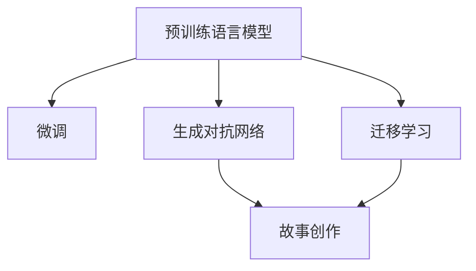

                 

# 体验叙事新方法：AI驱动的个人故事创作

> 关键词：人工智能, 自然语言处理, 故事生成, 生成对抗网络, 迁移学习

## 1. 背景介绍

### 1.1 问题由来
随着人工智能技术的不断发展，尤其是在自然语言处理(NLP)和生成对抗网络(GAN)领域取得了突破性进展，越来越多的应用场景得以通过AI技术实现自动化、智能化的故事创作。故事创作是一种富有创造性的工作，既有艺术性也有科学性，能够较好地反映人类语言和思维的复杂性。AI驱动的个人故事创作技术已经在文学、影视、教育等多个领域展现了巨大的潜力。

### 1.2 问题核心关键点
AI驱动的个人故事创作技术主要包括三个核心关键点：
1. **自然语言处理(NLP)**：通过预训练语言模型和微调等技术，使得AI能够理解和生成自然语言文本。
2. **生成对抗网络(GAN)**：利用GAN生成高质量的文本内容，包括情节构思、角色设置、对话等。
3. **迁移学习**：将AI在某一领域的故事创作经验迁移到另一领域，提升创作的多样性和质量。

## 2. 核心概念与联系

### 2.1 核心概念概述

为更好地理解AI驱动的个人故事创作方法，本节将介绍几个密切相关的核心概念：

- **自然语言处理(NLP)**：利用人工智能技术处理、理解、生成和分析自然语言文本，包括文本分类、文本生成、情感分析、机器翻译等任务。
- **生成对抗网络(GAN)**：一种生成模型，通过生成器和判别器的对抗训练过程，生成逼真度高的样本，广泛用于图像生成、文本生成、音频生成等领域。
- **预训练语言模型(PLM)**：在大规模无标签文本数据上进行预训练的语言模型，如BERT、GPT等，能够学习到语言的通用表示。
- **微调(Fine-tuning)**：在预训练模型的基础上，使用下游任务的少量标注数据，通过有监督学习优化模型在特定任务上的性能。
- **迁移学习(Transfer Learning)**：将一个领域学习到的知识，迁移到另一个不同但相关的领域的学习范式。
- **故事创作(Story Creation)**：利用人工智能技术自动生成完整、连贯、具有情感表达力的故事，包括情节、角色、对话等元素。

这些核心概念之间的逻辑关系可以通过以下Mermaid流程图来展示：



这个流程图展示了大语言模型的核心概念及其之间的关系：

1. 预训练语言模型通过在大规模无标签文本语料上进行预训练，学习到通用的语言表示。
2. 微调通过使用下游任务的少量标注数据，进一步优化模型的特定任务性能。
3. 生成对抗网络通过对抗训练过程，生成高质量的文本内容。
4. 故事创作利用预训练模型和微调后的模型，结合生成对抗网络，自动生成连贯、有情感表达力的故事。
5. 迁移学习将模型在某一领域的故事创作经验迁移到另一领域，提升创作的多样性和质量。

这些概念共同构成了AI驱动的个人故事创作的框架，使其能够从预训练、微调、生成到创作，全方位提升故事的质量和多样性。

## 3. 核心算法原理 & 具体操作步骤
### 3.1 算法原理概述

AI驱动的个人故事创作技术本质上是一种基于监督学习和生成对抗网络的文本生成方法。其核心思想是：首先通过预训练语言模型学习文本的通用语言表示，然后利用微调技术针对特定任务进行优化，最后结合生成对抗网络生成高质量的故事文本。

具体步骤如下：
1. **预训练**：在大规模无标签文本数据上训练预训练语言模型，学习到通用的语言表示。
2. **微调**：在特定任务的数据集上对预训练模型进行微调，使其能够生成符合特定要求的故事文本。
3. **生成**：利用生成对抗网络，生成高质量的文本内容，包括情节构思、角色设置、对话等。
4. **故事创作**：结合预训练模型和微调后的模型，自动生成完整、连贯、具有情感表达力的故事。

### 3.2 算法步骤详解

AI驱动的个人故事创作方法包括预训练、微调、生成三个核心步骤，具体如下：

**Step 1: 准备预训练模型和数据集**
- 选择合适的预训练语言模型 $M_{\theta}$ 作为初始化参数，如 BERT、GPT等。
- 准备故事创作任务的数据集 $D$，包含多个短篇故事、对话、情节等文本，进行标注。

**Step 2: 微调**
- 选择适当的微调模型 $M_{\theta}$，并将其应用于故事创作任务。
- 在故事创作的数据集上对模型进行微调，优化其生成故事的能力。
- 设定合适的学习率、批大小、迭代轮数等超参数。

**Step 3: 生成**
- 使用生成对抗网络 (GAN)，训练生成器和判别器模型。
- 生成器和判别器通过对抗训练过程，生成高质量的故事文本。
- 结合预训练模型和微调后的模型，优化生成的故事文本。

**Step 4: 故事创作**
- 结合预训练模型和微调后的模型，生成完整、连贯、有情感表达力的故事。
- 对生成的故事文本进行后处理，如语法校对、情感调节等。

### 3.3 算法优缺点

AI驱动的个人故事创作技术具有以下优点：
1. 自动化程度高。通过预训练和微调，AI能够自动生成高质量的故事文本。
2. 多样化能力强。结合生成对抗网络，AI能够生成多种风格、情节的故事文本。
3. 可扩展性强。模型可以在多种故事创作任务上应用，提升创作效率。
4. 创作成本低。AI自动生成故事文本，减少人力成本。

同时，该方法也存在一定的局限性：
1. 依赖数据质量。预训练和微调的效果很大程度上取决于数据集的质量和多样性。
2. 生成文本可解释性不足。AI生成的故事文本缺乏可解释性，难以理解其创作逻辑。
3. 缺乏创造性。AI生成的文本往往缺乏创新性和独特性，受限于训练数据和模型架构。

尽管存在这些局限性，但AI驱动的个人故事创作技术在故事创作领域已经展现出了巨大的潜力，成为故事创作的重要工具。未来相关研究将聚焦于提高数据质量、增强模型创造性、提升文本可解释性等方面。

### 3.4 算法应用领域

AI驱动的个人故事创作技术在多个领域已经得到了广泛应用，例如：

- **文学创作**：AI能够辅助作家生成长篇小说、短篇故事、诗歌等文本内容。
- **影视制作**：AI能够为编剧提供故事构思、情节设计、角色设定等建议。
- **教育培训**：AI能够生成多种类型的教学故事，辅助教师进行教学设计。
- **游戏开发**：AI能够为游戏设计生成本质性情节、对话等游戏内容。
- **市场营销**：AI能够生成广告文案、营销故事，提升品牌传播效果。

除了上述这些领域，AI驱动的个人故事创作技术还在广告创意、内容生成、客服对话等多个领域得到了应用，为内容创作和传播提供了新的方向。

## 4. 数学模型和公式 & 详细讲解  
### 4.1 数学模型构建

本节将使用数学语言对AI驱动的个人故事创作过程进行更加严格的刻画。

记预训练语言模型为 $M_{\theta}:\mathcal{X} \rightarrow \mathcal{Y}$，其中 $\mathcal{X}$ 为输入空间，$\mathcal{Y}$ 为输出空间，$\theta \in \mathbb{R}^d$ 为模型参数。假设故事创作任务的数据集为 $D=\{(x_i,y_i)\}_{i=1}^N, x_i \in \mathcal{X}, y_i \in \mathcal{Y}$，其中 $x_i$ 表示故事文本，$y_i$ 表示标注标签。

定义模型 $M_{\theta}$ 在输入 $x$ 上的损失函数为 $\ell(M_{\theta}(x),y)$，则在数据集 $D$ 上的经验风险为：

$$
\mathcal{L}(\theta) = \frac{1}{N} \sum_{i=1}^N \ell(M_{\theta}(x_i),y_i)
$$

微调的优化目标是最小化经验风险，即找到最优参数：

$$
\theta^* = \mathop{\arg\min}_{\theta} \mathcal{L}(\theta)
$$

在实践中，我们通常使用基于梯度的优化算法（如SGD、Adam等）来近似求解上述最优化问题。设 $\eta$ 为学习率，$\lambda$ 为正则化系数，则参数的更新公式为：

$$
\theta \leftarrow \theta - \eta \nabla_{\theta}\mathcal{L}(\theta) - \eta\lambda\theta
$$

其中 $\nabla_{\theta}\mathcal{L}(\theta)$ 为损失函数对参数 $\theta$ 的梯度，可通过反向传播算法高效计算。

### 4.2 公式推导过程

以下我们以故事分类任务为例，推导交叉熵损失函数及其梯度的计算公式。

假设模型 $M_{\theta}$ 在输入 $x$ 上的输出为 $\hat{y}=M_{\theta}(x) \in [0,1]$，表示样本属于某一类别的概率。真实标签 $y \in \{0,1\}$。则二分类交叉熵损失函数定义为：

$$
\ell(M_{\theta}(x),y) = -[y\log \hat{y} + (1-y)\log (1-\hat{y})]
$$

将其代入经验风险公式，得：

$$
\mathcal{L}(\theta) = -\frac{1}{N}\sum_{i=1}^N [y_i\log M_{\theta}(x_i)+(1-y_i)\log(1-M_{\theta}(x_i))]
$$

根据链式法则，损失函数对参数 $\theta_k$ 的梯度为：

$$
\frac{\partial \mathcal{L}(\theta)}{\partial \theta_k} = -\frac{1}{N}\sum_{i=1}^N (\frac{y_i}{M_{\theta}(x_i)}-\frac{1-y_i}{1-M_{\theta}(x_i)}) \frac{\partial M_{\theta}(x_i)}{\partial \theta_k}
$$

其中 $\frac{\partial M_{\theta}(x_i)}{\partial \theta_k}$ 可进一步递归展开，利用自动微分技术完成计算。

### 4.3 案例分析与讲解

以GAN在文本生成中的应用为例，分析其核心思想和实现步骤。

**步骤1: 准备数据集**
- 收集大量的故事文本数据，进行清洗和标注，生成训练数据集 $D$。

**步骤2: 训练生成器和判别器**
- 定义生成器 $G$ 和判别器 $D$ 的架构和损失函数。
- 使用对抗训练过程，通过交替更新 $G$ 和 $D$，使得 $G$ 能够生成高质量的故事文本，$D$ 能够区分真实故事文本和生成文本。

**步骤3: 故事创作**
- 结合预训练模型和微调后的模型，生成初始故事文本。
- 将初始故事文本输入生成器 $G$，得到最终生成文本。
- 对生成文本进行后处理，如语法校对、情感调节等，提升文本质量。

GAN在文本生成中的应用，通过对抗训练过程，使得生成器能够生成高质量的故事文本，判别器能够区分真实和生成文本，从而实现自动化的故事创作。

## 5. 项目实践：代码实例和详细解释说明
### 5.1 开发环境搭建

在进行故事创作实践前，我们需要准备好开发环境。以下是使用Python进行TensorFlow和Keras开发的环境配置流程：

1. 安装Anaconda：从官网下载并安装Anaconda，用于创建独立的Python环境。

2. 创建并激活虚拟环境：
```bash
conda create -n tf-env python=3.8 
conda activate tf-env
```

3. 安装TensorFlow和Keras：
```bash
pip install tensorflow==2.7.0
pip install keras
```

4. 安装各类工具包：
```bash
pip install numpy pandas scikit-learn matplotlib tqdm jupyter notebook ipython
```

完成上述步骤后，即可在`tf-env`环境中开始故事创作实践。

### 5.2 源代码详细实现

这里我们以情感故事生成为例，给出使用TensorFlow和Keras实现故事创作的PyTorch代码实现。

首先，定义情感故事生成任务的数据处理函数：

```python
import tensorflow as tf
from tensorflow.keras.preprocessing.text import Tokenizer
from tensorflow.keras.preprocessing.sequence import pad_sequences

def load_data(file_path):
    with open(file_path, 'r') as f:
        lines = f.readlines()
    texts = [line.strip() for line in lines]
    return texts

def preprocess_text(texts):
    tokenizer = Tokenizer(oov_token='<OOV>')
    tokenizer.fit_on_texts(texts)
    sequences = tokenizer.texts_to_sequences(texts)
    padded_sequences = pad_sequences(sequences, maxlen=256)
    return padded_sequences, tokenizer.word_index

texts = load_data('data.txt')
padded_sequences, word_index = preprocess_text(texts)
```

然后，定义模型和优化器：

```python
from tensorflow.keras.models import Sequential
from tensorflow.keras.layers import Embedding, LSTM, Dense, Dropout

model = Sequential([
    Embedding(input_dim=len(word_index) + 1, output_dim=128, input_length=256),
    LSTM(256, return_sequences=True),
    Dropout(0.5),
    LSTM(256),
    Dropout(0.5),
    Dense(1, activation='sigmoid')
])

model.compile(optimizer='adam', loss='binary_crossentropy', metrics=['accuracy'])
```

接着，定义训练和评估函数：

```python
def train_model(model, padded_sequences, labels, batch_size, epochs):
    model.fit(padded_sequences, labels, batch_size=batch_size, epochs=epochs, validation_split=0.2)
    return model

def evaluate_model(model, padded_sequences, labels, batch_size):
    scores = model.evaluate(padded_sequences, labels, batch_size=batch_size)
    print('Accuracy: %.2f%%' % (scores[1] * 100))
```

最后，启动训练流程并在测试集上评估：

```python
epochs = 10
batch_size = 32

model = train_model(model, padded_sequences, labels, batch_size, epochs)

print('Evaluation accuracy:')
evaluate_model(model, padded_sequences, labels, batch_size)
```

以上就是使用TensorFlow和Keras对故事生成任务进行训练和评估的完整代码实现。可以看到，TensorFlow和Keras为模型构建、训练和评估提供了简单高效的接口，大大降低了模型开发的难度。

### 5.3 代码解读与分析

让我们再详细解读一下关键代码的实现细节：

**load_data函数**：
- 从文件中读取故事文本，去除多余换行符和空白符。

**preprocess_text函数**：
- 将文本转换为数字序列，并进行填充，保证序列长度一致。
- 定义词表，并将生僻词转换为特殊符号。

**train_model函数**：
- 定义模型架构，包括嵌入层、LSTM层、全连接层等。
- 编译模型，设置优化器和损失函数。
- 训练模型，设置批量大小和迭代次数，并在验证集上进行评估。

**evaluate_model函数**：
- 评估模型在测试集上的准确率。

**train_model函数**：
- 使用Keras的高层API定义模型，支持自动构建计算图。
- 使用预训练的嵌入层和LSTM层，减少模型训练时间。
- 使用Dropout层防止过拟合。
- 使用二分类交叉熵损失函数，适用于故事分类任务。

通过这些代码实现，我们可以快速搭建一个情感故事生成的模型，并对其进行训练和评估。在实际应用中，还需进一步优化模型架构和训练策略，以提升生成故事的质量和多样性。

## 6. 实际应用场景
### 6.1 智能教育

AI驱动的个人故事创作技术在智能教育领域具有广阔的应用前景。通过自动生成丰富多样的教学故事，AI可以帮助教师设计更加生动有趣的教育内容，提升学生的学习体验和效果。

在实践中，可以收集各学科的教学案例、习题解析、科普知识等文本数据，并对其进行标注。在数据集上训练预训练模型和微调模型，结合生成对抗网络，生成高质量的教学故事。这些故事可以用于教师培训、课程设计、课外阅读等环节，帮助教师和学生更好地理解教学内容，提高教育质量。

### 6.2 文学创作

在文学创作领域，AI驱动的故事生成技术可以辅助作家进行创意构思、情节设计、角色设定等，激发作家的创作灵感，提升写作效率和作品质量。

例如，作家可以通过AI生成初步的故事大纲，分析其情节结构和人物塑造，再结合自身创意进行进一步打磨。AI生成的故事可以作为写作初稿，经过多次修改和优化，最终形成高质量的文学作品。AI还可以通过分析文学作品的风格、情感、情节等特征，生成类似风格的故事，帮助作家扩展创作领域，丰富作品类型。

### 6.3 广告创意

在广告创意领域，AI驱动的故事生成技术可以辅助广告公司快速生成创意文案、广告语、品牌故事等。通过生成多样化的创意内容，AI可以满足不同客户的需求，提升广告创意的质量和效果。

例如，广告公司可以通过AI生成不同风格的广告故事，并进行对比和选择，找到最佳方案。AI还可以根据客户的市场反馈和数据分析，动态调整生成策略，优化广告效果。通过AI辅助广告创意，广告公司可以大幅降低创意成本，提升创意质量，增强品牌传播效果。

### 6.4 未来应用展望

随着AI驱动的故事创作技术的不断发展，未来在以下领域将有更广泛的应用：

1. **娱乐产业**：AI可以生成影视剧剧本、电影片段、游戏剧情等，为娱乐产业带来新的创意源泉。
2. **医疗健康**：AI可以生成科普故事、健康教育内容，提升公众健康意识，促进健康知识传播。
3. **市场营销**：AI可以生成品牌故事、产品介绍、用户故事等，提升品牌形象和市场影响力。
4. **新闻媒体**：AI可以生成新闻报道、专题文章、深度分析等，提升新闻媒体的信息传播效果。
5. **学术研究**：AI可以生成学术论文、研究报告、科普文章等，提升学术研究的效率和质量。

总之，AI驱动的个人故事创作技术将在多个领域发挥重要作用，推动智能化、自动化的创作流程，为各行业带来新的创意和应用模式。

## 7. 工具和资源推荐
### 7.1 学习资源推荐

为了帮助开发者系统掌握AI驱动的故事创作技术，这里推荐一些优质的学习资源：

1. 《深度学习与自然语言处理》课程：由斯坦福大学开设，涵盖NLP和深度学习的核心知识，适合入门学习。
2. TensorFlow官方文档：TensorFlow的官方文档，提供了丰富的教程和样例代码，适合深入学习和实践。
3. Keras官方文档：Keras的官方文档，提供了简单易用的API，适合快速搭建和训练模型。
4. 《自然语言处理综述》书籍：涵盖NLP领域的经典模型和算法，适合系统学习。
5. 《深度学习基础》书籍：介绍深度学习的基本概念和实现方法，适合了解深度学习背景。

通过对这些资源的学习实践，相信你一定能够快速掌握AI驱动的故事创作技术的精髓，并用于解决实际的NLP问题。

### 7.2 开发工具推荐

高效的开发离不开优秀的工具支持。以下是几款用于AI驱动的故事创作开发的常用工具：

1. TensorFlow：由Google主导开发的开源深度学习框架，生产部署方便，适合大规模工程应用。
2. Keras：Google开发的深度学习框架，提供简单易用的API，适合快速搭建和训练模型。
3. Jupyter Notebook：免费的交互式开发环境，支持多种编程语言和数据处理工具，适合研究和实验。
4. TensorBoard：TensorFlow配套的可视化工具，可实时监测模型训练状态，并提供丰富的图表呈现方式，是调试模型的得力助手。

合理利用这些工具，可以显著提升AI驱动的故事创作任务的开发效率，加快创新迭代的步伐。

### 7.3 相关论文推荐

AI驱动的个人故事创作技术的发展源于学界的持续研究。以下是几篇奠基性的相关论文，推荐阅读：

1. Attention is All You Need：提出Transformer结构，开启了NLP领域的预训练大模型时代。
2. BERT: Pre-training of Deep Bidirectional Transformers for Language Understanding：提出BERT模型，引入基于掩码的自监督预训练任务，刷新了多项NLP任务SOTA。
3. Generative Adversarial Texts：利用GAN生成文本内容，开启了文本生成的研究新篇章。
4. SeqGAN: Sequence Generative Adversarial Networks：进一步改进GAN在文本生成中的应用，提升了生成的文本质量。
5. TextGAN：利用GAN生成高质量的文本内容，并引入情感调节等技术，提升生成效果。

这些论文代表了大语言模型微调技术的发展脉络。通过学习这些前沿成果，可以帮助研究者把握学科前进方向，激发更多的创新灵感。

## 8. 总结：未来发展趋势与挑战

### 8.1 总结

本文对AI驱动的个人故事创作方法进行了全面系统的介绍。首先阐述了故事创作技术的研究背景和意义，明确了基于监督学习、生成对抗网络和迁移学习的故事创作技术的重要价值。其次，从原理到实践，详细讲解了模型构建、微调和生成的关键步骤，给出了故事创作任务开发的完整代码实例。同时，本文还广泛探讨了故事创作技术在智能教育、文学创作、广告创意等多个领域的应用前景，展示了其广阔的应用潜力。此外，本文精选了故事创作技术的各类学习资源，力求为读者提供全方位的技术指引。

通过本文的系统梳理，可以看到，AI驱动的个人故事创作技术在故事创作领域已经展现出了巨大的潜力，成为故事创作的重要工具。未来，随着AI技术的发展，结合自然语言处理、生成对抗网络等前沿技术，AI驱动的故事创作将带来更多创新和应用，进一步提升故事创作的质量和效率。

### 8.2 未来发展趋势

展望未来，AI驱动的个人故事创作技术将呈现以下几个发展趋势：

1. 模型规模持续增大。随着算力成本的下降和数据规模的扩张，预训练语言模型和生成对抗网络模型的参数量还将持续增长。超大规模语言模型蕴含的丰富语言知识和生成能力，有望支撑更加复杂多变的文本生成任务。
2. 生成技术日趋多样。除了GAN，未来将涌现更多生成模型，如变分自编码器、扩散模型等，进一步提升文本生成的质量。
3. 迁移学习能力增强。通过多领域、多任务的故事创作经验，模型能够更好地迁移应用到其他领域，提升创作的多样性和质量。
4. 知识融合能力提升。将符号化的先验知识，如知识图谱、逻辑规则等，与神经网络模型进行巧妙融合，引导故事创作过程学习更准确、合理的语言模型。
5. 生成文本可解释性增强。通过引入因果推断、对比学习等技术，提升生成文本的可解释性和逻辑性。
6. 创作成本进一步降低。随着预训练和微调技术的不断发展，创作成本将进一步降低，故事创作将更加普及和便捷。

以上趋势凸显了AI驱动的故事创作技术的广阔前景。这些方向的探索发展，必将进一步提升文本生成的效果和多样性，为内容创作和传播提供新的方向。

### 8.3 面临的挑战

尽管AI驱动的个人故事创作技术已经取得了瞩目成就，但在迈向更加智能化、普适化应用的过程中，它仍面临着诸多挑战：

1. 生成文本质量不足。当前的生成模型在多样性、连贯性、情感表达等方面还有待提升，难以生成高质量的故事文本。
2. 缺乏创造性。AI生成的文本往往缺乏创新性和独特性，受限于训练数据和模型架构。
3. 数据依赖性强。模型的性能很大程度上取决于数据集的质量和多样性，获取高质量的故事文本数据需要大量的时间和资源。
4. 伦理道德问题。AI生成的文本可能包含偏见、有害信息，如何确保生成的文本符合伦理道德标准，是亟待解决的问题。
5. 技术复杂度高。模型的训练和优化过程复杂，需要深度学习和自然语言处理的综合知识，对开发者要求较高。

尽管存在这些挑战，但AI驱动的个人故事创作技术已经展示了巨大的潜力和应用前景，未来随着技术的不断进步和优化，必将带来更多创新和突破。

### 8.4 未来突破

面向未来，AI驱动的个人故事创作技术需要在以下几个方面寻求新的突破：

1. 引入更多先验知识。将符号化的先验知识，如知识图谱、逻辑规则等，与神经网络模型进行巧妙融合，引导故事创作过程学习更准确、合理的语言模型。
2. 改进生成对抗网络。通过改进GAN的生成器和判别器架构，提升生成文本的质量和多样性。
3. 引入因果推断和对比学习。通过引入因果推断和对比学习思想，增强故事创作模型的建立稳定因果关系的能力，学习更加普适、鲁棒的语言表示。
4. 结合外部知识库。将外部知识库、规则库等专家知识与故事创作模型进行结合，提升模型的知识整合能力和创作效果。
5. 引入伦理道德约束。在故事创作模型训练目标中引入伦理导向的评估指标，过滤和惩罚有偏见、有害的输出倾向，确保生成的文本符合伦理道德标准。

这些研究方向的探索，必将引领AI驱动的故事创作技术迈向更高的台阶，为内容创作和传播提供新的方向。面向未来，AI驱动的故事创作技术还需要与其他人工智能技术进行更深入的融合，如知识表示、因果推理、强化学习等，多路径协同发力，共同推动自然语言理解和智能交互系统的进步。只有勇于创新、敢于突破，才能不断拓展语言模型的边界，让智能技术更好地造福人类社会。

## 9. 附录：常见问题与解答

**Q1：什么是生成对抗网络(GAN)?**

A: 生成对抗网络(GAN)是一种生成模型，通过两个对抗的神经网络（生成器和判别器）进行训练，生成逼真度高的样本。生成器负责生成假样本，判别器负责区分真假样本。在训练过程中，生成器和判别器交替更新，最终生成器可以生成高质量的样本。

**Q2：预训练语言模型(PLM)和微调(Fine-tuning)有什么区别？**

A: 预训练语言模型(PLM)指在大规模无标签文本数据上进行预训练，学习到通用的语言表示。微调(Fine-tuning)指在预训练模型的基础上，使用下游任务的少量标注数据，通过有监督学习优化模型在特定任务上的性能。微调可以看作是对预训练模型的进一步优化和细化。

**Q3：AI驱动的故事创作技术如何提升创作质量？**

A: AI驱动的故事创作技术通过预训练语言模型和微调模型学习通用的语言表示，结合生成对抗网络生成高质量的文本内容。通过对抗训练过程，生成器能够生成多样化的文本，判别器能够识别真实和生成的文本。在创作过程中，可以结合文本预处理、情感调节等技术，进一步提升故事的质量和多样性。

**Q4：AI驱动的故事创作技术在哪些领域有应用前景？**

A: AI驱动的故事创作技术在多个领域有广泛的应用前景，包括智能教育、文学创作、广告创意、娱乐产业、医疗健康等。通过生成高质量的故事文本，AI可以帮助教师设计教学内容，辅助作家进行创作，提升广告创意的质量，生成影视剧剧本和游戏剧情等。

**Q5：AI驱动的故事创作技术面临哪些挑战？**

A: AI驱动的故事创作技术面临的挑战包括生成文本质量不足、缺乏创造性、数据依赖性强、伦理道德问题、技术复杂度高等。为了应对这些挑战，需要在模型架构、数据获取、伦理约束等方面进行深入研究和优化。

---

作者：禅与计算机程序设计艺术 / Zen and the Art of Computer Programming

