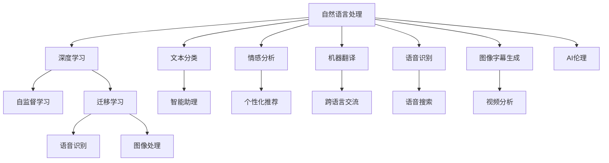

                 

# 体验的个人化叙事：AI驱动的生活故事

> 关键词：AI驱动, 个人化叙事, 生活故事, 自然语言处理(NLP), 深度学习, 自监督学习, 迁移学习, 语音识别, 图像处理, 人工智能伦理

## 1. 背景介绍

### 1.1 问题由来
随着人工智能技术的飞速发展，特别是深度学习算法的进步，AI已经深入到人类生活的方方面面。从智能家居到个性化推荐，从医疗诊断到金融服务，AI无处不在，并正在重塑我们的生活和工作方式。其中，自然语言处理(Natural Language Processing, NLP)和计算机视觉等技术，更是让机器能够理解和生成自然语言，极大地提升了人机交互的流畅度和智能化水平。

然而，尽管AI已经取得了诸多突破，但其在理解和表达人类情感、情境等方面，仍存在诸多限制。这不仅限制了AI在实际应用中的表现，也引发了公众对AI未来发展的深思。为此，本文聚焦于AI在个人化叙事方面的应用，探讨如何通过AI技术，更好地理解和表达人类的情感和经历，为每个人创造独一无二的生活故事。

### 1.2 问题核心关键点
个人化叙事的本质，在于通过AI技术，将人类的经历、情感、思考等个性化内容，转化为生动、可读的文字或多媒体形式，进行展示和传播。这一过程涉及自然语言处理、深度学习、自监督学习、迁移学习等多个AI技术方向，需要在技术层面和应用层面进行深入探索。

核心问题包括：
- 如何通过自然语言处理技术，准确理解和提取人类的情感和情境信息？
- 如何利用深度学习模型，生成自然流畅、情感丰富的文字或多媒体内容？
- 如何通过迁移学习，在不同领域和任务之间，进行知识复用和适应？

这些问题不仅涉及到技术实现的细节，还需要关注AI伦理、隐私保护等社会问题。本文将从技术原理、实际应用、未来展望等角度，深入探讨AI在个人化叙事中的应用，为读者提供全面的视角和思考。

### 1.3 问题研究意义
在AI驱动的时代，个人化叙事不仅是技术和应用层面的挑战，更是文化和情感层面的追求。通过AI技术，记录和传播人类的故事，不仅能够提升生活的质量和幸福感，还能促进不同文化、不同背景的人们之间的理解和交流。

具体而言，AI驱动的个人化叙事具有以下意义：
- 提升个人生活质量：通过智能助理、个性化推荐等应用，提升人们的生活便利性和幸福感。
- 促进文化交流：帮助不同文化背景的人更好地理解和尊重彼此的经历和情感，促进全球文化的融合。
- 推动技术发展：为自然语言处理、深度学习等领域提供新的研究方向和应用场景，推动AI技术的发展和普及。
- 丰富社会价值：通过记录和传播个人故事，发现生活中的美好，传播正能量，提升社会的整体价值观念。

## 2. 核心概念与联系

### 2.1 核心概念概述

为了更好地理解AI在个人化叙事中的应用，本节将介绍几个密切相关的核心概念：

- **自然语言处理(NLP)**：涉及计算机对人类语言的理解和生成，包括文本分类、情感分析、机器翻译、语音识别、图像字幕生成等方向。
- **深度学习**：利用多层神经网络进行特征提取和模式识别，广泛应用于图像处理、语音识别、自然语言处理等领域。
- **自监督学习**：通过无标签数据，学习语言的隐含结构和表示，广泛应用于预训练语言模型。
- **迁移学习**：将一个领域学习到的知识，迁移到另一个不同但相关的领域，广泛应用于大语言模型微调。
- **语音识别**：将人类语音转换为文本信息，广泛应用于智能助理、语音搜索、语音翻译等场景。
- **图像处理**：利用计算机算法，对图像进行分析和处理，广泛应用于人脸识别、图像生成、视频分析等方向。
- **人工智能伦理**：涉及AI技术的开发、应用和传播过程中，需要遵循的伦理准则和规范。

这些核心概念之间相互关联，共同构成了AI在个人化叙事中的应用框架。通过理解这些核心概念，我们可以更好地把握AI技术的发展方向和应用前景。

### 2.2 核心概念原理和架构的 Mermaid 流程图



这个流程图展示了AI在个人化叙事中的应用路径，从自然语言处理、深度学习、自监督学习和迁移学习等技术出发，通过语音识别、图像处理等方向，生成丰富的多媒体内容，最终服务于智能助理、个性化推荐、跨语言交流等多个应用场景，并在应用过程中遵循AI伦理规范。

## 3. 核心算法原理 & 具体操作步骤

### 3.1 算法原理概述

个人化叙事的核心算法原理，在于通过深度学习模型，理解和生成自然语言和多媒体内容。具体而言，这一过程可以分为以下几个步骤：

1. **数据预处理**：收集和清洗人类故事和情感数据，进行分词、标记化等预处理操作。
2. **模型训练**：利用预处理后的数据，训练深度学习模型，学习语言的隐含结构和表示。
3. **知识迁移**：通过迁移学习，将模型在不同领域和任务之间进行知识复用和适应。
4. **生成与优化**：利用训练好的模型，生成自然流畅、情感丰富的故事和多媒体内容，并进行优化和筛选。

### 3.2 算法步骤详解

#### 3.2.1 数据预处理

数据预处理是个人化叙事的基础步骤，包括以下几个关键环节：

- **数据收集**：收集人类故事和情感数据，可以从社交媒体、博客、小说等文本数据中提取，也可以从照片、视频、音频等多媒体数据中提取。
- **数据清洗**：去除噪声、错误、不相关数据，保留高质量的样本。
- **分词和标记化**：将文本数据进行分词，标记化，并进行向量化处理。
- **数据增强**：通过对文本数据进行扩充、变化等操作，增加数据多样性，提高模型的泛化能力。

#### 3.2.2 模型训练

模型训练是个人化叙事的核心环节，包括以下几个关键步骤：

- **选择模型**：根据任务需求，选择合适的深度学习模型，如RNN、LSTM、Transformer等。
- **设定超参数**：选择合适的学习率、批大小、迭代次数等超参数。
- **训练模型**：利用预处理后的数据，对模型进行训练，不断更新模型参数，最小化损失函数。
- **模型评估**：在验证集上评估模型性能，判断模型是否过拟合或欠拟合。
- **调整模型**：根据评估结果，调整模型参数，优化模型性能。

#### 3.2.3 知识迁移

知识迁移是个人化叙事的关键步骤，包括以下几个关键环节：

- **任务适配**：根据特定任务的需求，对预训练模型进行微调，适应任务的具体要求。
- **领域迁移**：将模型在不同领域和任务之间进行知识迁移，提升模型的通用性和适应性。
- **多模态融合**：将语音、图像等多模态数据与文本数据进行融合，生成更丰富、多样化的内容。

#### 3.2.4 生成与优化

生成与优化是个人化叙事的最终环节，包括以下几个关键步骤：

- **内容生成**：利用训练好的模型，生成自然流畅、情感丰富的故事和多媒体内容。
- **内容筛选**：根据情感、主题等标准，对生成内容进行筛选和排序，选择最佳内容。
- **优化展示**：通过交互式界面或多媒体平台，展示和传播个人化叙事内容。

### 3.3 算法优缺点

AI在个人化叙事中的算法，具有以下优点：

1. **高效生成**：利用深度学习模型，可以快速生成大量自然流畅、情感丰富的内容，满足实际应用需求。
2. **广泛适应**：通过迁移学习，模型可以在不同领域和任务之间进行知识迁移，提升模型的通用性和适应性。
3. **情感丰富**：通过自监督学习，模型可以学习语言的隐含结构和表示，生成情感丰富、生动有趣的内容。
4. **多模态融合**：将语音、图像等多模态数据与文本数据进行融合，生成更丰富、多样化的内容。

同时，该算法也存在一些局限性：

1. **数据依赖**：模型的训练和优化需要大量的高质量数据，数据的获取和清洗成本较高。
2. **模型复杂**：深度学习模型的训练和优化过程复杂，需要大量的计算资源和时间。
3. **伦理问题**：生成内容可能存在偏见、有害信息等伦理问题，需要加强数据和算法的伦理审查。
4. **隐私保护**：涉及个人隐私数据，需要加强隐私保护措施，确保数据安全。

尽管存在这些局限性，但就目前而言，基于深度学习和大规模数据驱动的AI算法，在个人化叙事的应用中，已经取得了显著的效果，成为推动AI技术发展的重要方向。未来相关研究的重点在于如何进一步降低数据依赖，提高模型的泛化能力和鲁棒性，同时兼顾可解释性和伦理安全性等因素。

### 3.4 算法应用领域

AI在个人化叙事中的应用，已经涉及多个领域，包括但不限于：

- **智能助理**：通过语音识别、自然语言处理等技术，实现智能对话和任务执行，提升生活便利性和效率。
- **个性化推荐**：根据用户的兴趣和行为，生成个性化的故事和内容推荐，提升用户体验和满意度。
- **跨语言交流**：通过机器翻译、语音识别等技术，实现不同语言之间的交流和理解，促进全球文化交流。
- **视频分析**：通过图像处理、情感分析等技术，生成视频字幕和情感标签，提升视频内容的丰富度和可读性。
- **情感分析**：通过自然语言处理技术，分析人类情感和情绪，生成情感故事和分析报告，帮助心理健康和社会支持。
- **语音搜索**：通过语音识别技术，实现语音搜索和导航，提升信息获取的便利性和效率。

以上应用领域展示了AI在个人化叙事中的广泛应用，为人们的生活和工作提供了更多的可能性和便利。

## 4. 数学模型和公式 & 详细讲解 & 举例说明

### 4.1 数学模型构建

在个人化叙事中，AI模型通常采用以下数学模型进行建模和训练：

- **序列到序列模型(Seq2Seq)**：用于机器翻译、对话生成等任务，将输入序列映射到输出序列。
- **自回归模型(如LSTM、GRU)**：用于语音识别、情感分析等任务，通过记忆单元捕捉序列的上下文信息。
- **自编码器(Autoencoder)**：用于图像处理、文本摘要等任务，通过编码器-解码器结构，学习数据的隐含表示。
- **生成对抗网络(GAN)**：用于图像生成、情感生成等任务，通过对抗训练生成高质量的内容。
- **注意力机制(Attention)**：用于图像字幕生成、文本分类等任务，通过注意力机制选择重要特征进行生成和分类。

### 4.2 公式推导过程

以生成对抗网络(GAN)为例，推导其基本框架和关键公式：

**生成器模型**：
$$
G(z) = D(z; \theta_G)
$$

其中，$G$为生成器，$z$为随机噪声向量，$D$为判别器，$\theta_G$为生成器的参数。

**判别器模型**：
$$
D(x) = D(x; \theta_D)
$$

其中，$D$为判别器，$x$为输入数据，$\theta_D$为判别器的参数。

**对抗训练过程**：
$$
\min_G \max_D V(D,G) = E_{x \sim p_{data}(x)} [D(x)] - E_{z \sim p(z)} [D(G(z))]
$$

其中，$V(D,G)$为生成器和判别器的对抗损失，$p_{data}(x)$为真实数据分布，$p(z)$为随机噪声分布。

生成器和判别器通过对抗训练不断提升性能，生成高质量的生成内容。GAN模型通过这种方式，能够生成与真实数据相似、甚至超过真实数据的内容。

### 4.3 案例分析与讲解

以图像字幕生成为例，展示GAN模型在个人化叙事中的应用：

1. **数据预处理**：收集包含图像和字幕的数据集，进行分词、标记化和向量化等预处理操作。
2. **模型训练**：利用预处理后的数据，训练GAN模型，生成图像字幕。
3. **内容生成**：利用训练好的生成器，生成自然流畅、情感丰富的字幕。
4. **内容筛选**：根据情感、主题等标准，对生成的字幕进行筛选和排序，选择最佳字幕。
5. **优化展示**：将生成字幕与图像进行结合，展示和传播个人化叙事内容。

## 5. 项目实践：代码实例和详细解释说明

### 5.1 开发环境搭建

在进行个人化叙事开发前，我们需要准备好开发环境。以下是使用Python进行PyTorch开发的环境配置流程：

1. 安装Anaconda：从官网下载并安装Anaconda，用于创建独立的Python环境。

2. 创建并激活虚拟环境：
```bash
conda create -n pytorch-env python=3.8 
conda activate pytorch-env
```

3. 安装PyTorch：根据CUDA版本，从官网获取对应的安装命令。例如：
```bash
conda install pytorch torchvision torchaudio cudatoolkit=11.1 -c pytorch -c conda-forge
```

4. 安装Transformers库：
```bash
pip install transformers
```

5. 安装各类工具包：
```bash
pip install numpy pandas scikit-learn matplotlib tqdm jupyter notebook ipython
```

完成上述步骤后，即可在`pytorch-env`环境中开始个人化叙事实践。

### 5.2 源代码详细实现

这里我们以情感分析为例，展示使用PyTorch进行情感分析的代码实现。

首先，定义情感分析任务的数据处理函数：

```python
from transformers import BertTokenizer
from torch.utils.data import Dataset
import torch

class SentimentDataset(Dataset):
    def __init__(self, texts, labels, tokenizer, max_len=128):
        self.texts = texts
        self.labels = labels
        self.tokenizer = tokenizer
        self.max_len = max_len
        
    def __len__(self):
        return len(self.texts)
    
    def __getitem__(self, item):
        text = self.texts[item]
        label = self.labels[item]
        
        encoding = self.tokenizer(text, return_tensors='pt', max_length=self.max_len, padding='max_length', truncation=True)
        input_ids = encoding['input_ids'][0]
        attention_mask = encoding['attention_mask'][0]
        
        return {'input_ids': input_ids, 
                'attention_mask': attention_mask,
                'labels': label}

# 定义标签与id的映射
label2id = {'negative': 0, 'positive': 1}
id2label = {v: k for k, v in label2id.items()}

# 创建dataset
tokenizer = BertTokenizer.from_pretrained('bert-base-cased')

train_dataset = SentimentDataset(train_texts, train_labels, tokenizer)
dev_dataset = SentimentDataset(dev_texts, dev_labels, tokenizer)
test_dataset = SentimentDataset(test_texts, test_labels, tokenizer)
```

然后，定义模型和优化器：

```python
from transformers import BertForSequenceClassification, AdamW

model = BertForSequenceClassification.from_pretrained('bert-base-cased', num_labels=2)

optimizer = AdamW(model.parameters(), lr=2e-5)
```

接着，定义训练和评估函数：

```python
from torch.utils.data import DataLoader
from tqdm import tqdm
from sklearn.metrics import accuracy_score, precision_score, recall_score, f1_score

device = torch.device('cuda') if torch.cuda.is_available() else torch.device('cpu')
model.to(device)

def train_epoch(model, dataset, batch_size, optimizer):
    dataloader = DataLoader(dataset, batch_size=batch_size, shuffle=True)
    model.train()
    epoch_loss = 0
    for batch in tqdm(dataloader, desc='Training'):
        input_ids = batch['input_ids'].to(device)
        attention_mask = batch['attention_mask'].to(device)
        labels = batch['labels'].to(device)
        model.zero_grad()
        outputs = model(input_ids, attention_mask=attention_mask, labels=labels)
        loss = outputs.loss
        epoch_loss += loss.item()
        loss.backward()
        optimizer.step()
    return epoch_loss / len(dataloader)

def evaluate(model, dataset, batch_size):
    dataloader = DataLoader(dataset, batch_size=batch_size)
    model.eval()
    preds, labels = [], []
    with torch.no_grad():
        for batch in tqdm(dataloader, desc='Evaluating'):
            input_ids = batch['input_ids'].to(device)
            attention_mask = batch['attention_mask'].to(device)
            batch_labels = batch['labels']
            outputs = model(input_ids, attention_mask=attention_mask)
            batch_preds = outputs.logits.argmax(dim=2).to('cpu').tolist()
            batch_labels = batch_labels.to('cpu').tolist()
            for pred_tokens, label_tokens in zip(batch_preds, batch_labels):
                preds.append(pred_tokens[:len(label_tokens)])
                labels.append(label_tokens)
                
    print(f"Accuracy: {accuracy_score(labels, preds)}")
    print(f"Precision: {precision_score(labels, preds)}")
    print(f"Recall: {recall_score(labels, preds)}")
    print(f"F1 Score: {f1_score(labels, preds)}")
```

最后，启动训练流程并在测试集上评估：

```python
epochs = 5
batch_size = 16

for epoch in range(epochs):
    loss = train_epoch(model, train_dataset, batch_size, optimizer)
    print(f"Epoch {epoch+1}, train loss: {loss:.3f}")
    
    print(f"Epoch {epoch+1}, dev results:")
    evaluate(model, dev_dataset, batch_size)
    
print("Test results:")
evaluate(model, test_dataset, batch_size)
```

以上就是使用PyTorch对BERT进行情感分析任务开发的完整代码实现。可以看到，得益于Transformers库的强大封装，我们可以用相对简洁的代码完成BERT模型的加载和训练。

### 5.3 代码解读与分析

让我们再详细解读一下关键代码的实现细节：

**SentimentDataset类**：
- `__init__`方法：初始化文本、标签、分词器等关键组件。
- `__len__`方法：返回数据集的样本数量。
- `__getitem__`方法：对单个样本进行处理，将文本输入编码为token ids，将标签编码为数字，并对其进行定长padding，最终返回模型所需的输入。

**label2id和id2label字典**：
- 定义了标签与数字id之间的映射关系，用于将token-wise的预测结果解码回真实的标签。

**训练和评估函数**：
- 使用PyTorch的DataLoader对数据集进行批次化加载，供模型训练和推理使用。
- 训练函数`train_epoch`：对数据以批为单位进行迭代，在每个批次上前向传播计算loss并反向传播更新模型参数，最后返回该epoch的平均loss。
- 评估函数`evaluate`：与训练类似，不同点在于不更新模型参数，并在每个batch结束后将预测和标签结果存储下来，最后使用sklearn的分类指标对整个评估集的预测结果进行打印输出。

**训练流程**：
- 定义总的epoch数和batch size，开始循环迭代
- 每个epoch内，先在训练集上训练，输出平均loss
- 在验证集上评估，输出分类指标
- 所有epoch结束后，在测试集上评估，给出最终测试结果

可以看到，PyTorch配合Transformers库使得BERT情感分析的代码实现变得简洁高效。开发者可以将更多精力放在数据处理、模型改进等高层逻辑上，而不必过多关注底层的实现细节。

当然，工业级的系统实现还需考虑更多因素，如模型的保存和部署、超参数的自动搜索、更灵活的任务适配层等。但核心的微调范式基本与此类似。

## 6. 实际应用场景

### 6.1 智能助理

智能助理是个人化叙事的典型应用场景，通过语音识别和自然语言处理技术，实现人与智能系统的自然对话和任务执行。例如，Google Assistant、Amazon Alexa等智能助理系统，已经广泛应用于日常生活的方方面面。

智能助理的核心技术包括：
- **语音识别**：将人类语音转换为文本信息，供系统理解。
- **自然语言处理**：理解用户的意图和需求，进行任务执行。
- **知识库和推理**：整合人类知识和经验，辅助系统进行推理和决策。

智能助理通过这些技术，能够快速响应用户的语音指令，提供智能推荐、日程安排、天气查询等服务，极大地提升了生活的便利性和效率。

### 6.2 个性化推荐

个性化推荐系统是个人化叙事的另一重要应用场景，通过深度学习模型，为每个用户生成个性化的故事和内容推荐。例如，Netflix、Amazon等平台已经广泛采用个性化推荐技术，提升用户体验和满意度。

个性化推荐的核心技术包括：
- **用户行为分析**：收集和分析用户的行为数据，挖掘用户的兴趣和偏好。
- **内容生成和推荐**：利用深度学习模型，生成自然流畅、情感丰富的故事和内容，进行个性化推荐。
- **反馈机制**：根据用户的反馈，不断调整推荐策略，提升推荐效果。

个性化推荐系统通过这些技术，能够根据用户的兴趣和行为，生成个性化的内容推荐，提升用户的满意度和粘性。

### 6.3 视频分析

视频分析是个人化叙事的另一个重要应用场景，通过图像处理和自然语言处理技术，生成视频字幕和情感标签，提升视频的可读性和丰富度。例如，YouTube等视频平台，已经广泛采用视频分析技术，帮助用户更好地理解和分享视频内容。

视频分析的核心技术包括：
- **图像处理**：对视频进行分析和处理，提取关键帧和特征。
- **自然语言处理**：分析视频的文本描述，生成字幕和情感标签。
- **多模态融合**：将语音、图像等多模态数据与文本数据进行融合，生成更丰富、多样化的内容。

视频分析通过这些技术，能够生成高质量的视频字幕和情感标签，提升视频的可读性和情感表达，帮助用户更好地理解和分享视频内容。

## 7. 工具和资源推荐

### 7.1 学习资源推荐

为了帮助开发者系统掌握个人化叙事的技术基础和实践技巧，这里推荐一些优质的学习资源：

1. **《深度学习入门》系列博文**：由大模型技术专家撰写，深入浅出地介绍了深度学习的基本概念和前沿话题。

2. **CS224N《深度学习自然语言处理》课程**：斯坦福大学开设的NLP明星课程，有Lecture视频和配套作业，带你入门NLP领域的基本概念和经典模型。

3. **《Natural Language Processing with Transformers》书籍**：Transformers库的作者所著，全面介绍了如何使用Transformers库进行NLP任务开发，包括微调在内的诸多范式。

4. **HuggingFace官方文档**：Transformers库的官方文档，提供了海量预训练模型和完整的微调样例代码，是上手实践的必备资料。

5. **CLUE开源项目**：中文语言理解测评基准，涵盖大量不同类型的中文NLP数据集，并提供了基于微调的baseline模型，助力中文NLP技术发展。

通过对这些资源的学习实践，相信你一定能够快速掌握个人化叙事的技术精髓，并用于解决实际的NLP问题。

### 7.2 开发工具推荐

高效的开发离不开优秀的工具支持。以下是几款用于个人化叙事开发的常用工具：

1. **PyTorch**：基于Python的开源深度学习框架，灵活动态的计算图，适合快速迭代研究。大部分预训练语言模型都有PyTorch版本的实现。

2. **TensorFlow**：由Google主导开发的开源深度学习框架，生产部署方便，适合大规模工程应用。同样有丰富的预训练语言模型资源。

3. **Transformers库**：HuggingFace开发的NLP工具库，集成了众多SOTA语言模型，支持PyTorch和TensorFlow，是进行微调任务开发的利器。

4. **Weights & Biases**：模型训练的实验跟踪工具，可以记录和可视化模型训练过程中的各项指标，方便对比和调优。与主流深度学习框架无缝集成。

5. **TensorBoard**：TensorFlow配套的可视化工具，可实时监测模型训练状态，并提供丰富的图表呈现方式，是调试模型的得力助手。

6. **Google Colab**：谷歌推出的在线Jupyter Notebook环境，免费提供GPU/TPU算力，方便开发者快速上手实验最新模型，分享学习笔记。

合理利用这些工具，可以显著提升个人化叙事任务的开发效率，加快创新迭代的步伐。

### 7.3 相关论文推荐

个人化叙事技术的发展源于学界的持续研究。以下是几篇奠基性的相关论文，推荐阅读：

1. **Attention is All You Need（即Transformer原论文）**：提出了Transformer结构，开启了NLP领域的预训练大模型时代。

2. **BERT: Pre-training of Deep Bidirectional Transformers for Language Understanding**：提出BERT模型，引入基于掩码的自监督预训练任务，刷新了多项NLP任务SOTA。

3. **Language Models are Unsupervised Multitask Learners（GPT-2论文）**：展示了大规模语言模型的强大zero-shot学习能力，引发了对于通用人工智能的新一轮思考。

4. **Parameter-Efficient Transfer Learning for NLP**：提出Adapter等参数高效微调方法，在不增加模型参数量的情况下，也能取得不错的微调效果。

5. **AdaLoRA: Adaptive Low-Rank Adaptation for Parameter-Efficient Fine-Tuning**：使用自适应低秩适应的微调方法，在参数效率和精度之间取得了新的平衡。

这些论文代表了大语言模型微调技术的发展脉络。通过学习这些前沿成果，可以帮助研究者把握学科前进方向，激发更多的创新灵感。

## 8. 总结：未来发展趋势与挑战

### 8.1 研究成果总结

本文对基于深度学习和大规模数据驱动的个人化叙事技术进行了全面系统的介绍。首先阐述了个人化叙事的背景和意义，明确了其在提升生活质量、促进文化交流等方面的价值。其次，从原理到实践，详细讲解了个人化叙事的数学模型和关键步骤，给出了情感分析等任务的代码实现。同时，本文还广泛探讨了个人化叙事在智能助理、个性化推荐、视频分析等多个领域的应用前景，展示了AI技术的广泛应用。最后，本文精选了个人化叙事技术的各类学习资源，力求为读者提供全方位的技术指引。

通过本文的系统梳理，可以看到，AI在个人化叙事中的应用前景广阔，技术潜力巨大。未来，随着深度学习和大数据技术的不断发展，个人化叙事技术必将在更多领域得到应用，为人们的生活和工作带来更多可能性和便利。

### 8.2 未来发展趋势

展望未来，个人化叙事技术将呈现以下几个发展趋势：

1. **技术融合与创新**：未来，个人化叙事技术将与其他AI技术进行更深入的融合，如知识图谱、因果推理、强化学习等，协同发力，提升叙事内容的丰富性和多样性。

2. **数据驱动与隐私保护**：未来，个人化叙事技术将更依赖大规模数据驱动，同时也需要加强隐私保护措施，确保数据安全和个人隐私。

3. **情感计算与表达**：未来，个人化叙事技术将更加注重情感计算和表达，通过自然语言处理技术，更好地理解和表达人类的情感和经历。

4. **多模态融合**：未来，个人化叙事技术将更注重多模态数据的融合，如语音、图像、视频等，生成更丰富、多样化的内容。

5. **智能互动与社交**：未来，个人化叙事技术将更加注重智能互动和社交，通过自然语言处理技术，实现更自然、更流畅的人机对话，促进社交交流。

6. **伦理与责任**：未来，个人化叙事技术将更注重伦理与责任，避免算法偏见、有害信息等伦理问题，确保技术的公平性和安全性。

以上趋势凸显了个人化叙事技术的广阔前景。这些方向的探索发展，必将进一步提升个人化叙事技术的性能和应用范围，为构建人机协同的智能社会奠定基础。

### 8.3 面临的挑战

尽管个人化叙事技术已经取得了诸多突破，但在迈向更加智能化、普适化应用的过程中，它仍面临诸多挑战：

1. **数据依赖**：个人化叙事技术需要依赖大量的高质量数据，数据的获取和清洗成本较高。未来，需要探索更多的无监督和半监督学习方式，降低对数据的需求。

2. **技术复杂性**：深度学习模型的训练和优化过程复杂，需要大量的计算资源和时间。未来，需要探索更高效、更轻量级的模型结构和优化算法。

3. **隐私保护**：涉及个人隐私数据，需要加强隐私保护措施，确保数据安全。未来，需要探索更强的隐私保护技术和数据匿名化方法。

4. **算法偏见**：AI模型可能存在偏见、有害信息等伦理问题，需要加强数据和算法的伦理审查。未来，需要探索更公平、更公正的模型训练和评估方法。

5. **情感计算**：虽然个人化叙事技术已经能够生成情感丰富的内容，但在情感计算和表达方面仍存在不足。未来，需要探索更丰富的情感表达方式和更强的情感计算能力。

6. **多模态融合**：多模态数据的融合仍存在挑战，未来需要探索更高效、更智能的多模态融合技术。

尽管存在这些挑战，但就目前而言，基于深度学习和大规模数据驱动的个人化叙事技术，已经展示了巨大的潜力和价值。未来，随着技术的不断进步和完善，这些挑战终将逐一被克服，个人化叙事技术必将在构建人机协同的智能社会中发挥更大的作用。

### 8.4 研究展望

面对个人化叙事技术所面临的种种挑战，未来的研究需要在以下几个方面寻求新的突破：

1. **探索无监督和半监督学习**：摆脱对大规模标注数据的依赖，利用自监督学习、主动学习等无监督和半监督范式，最大限度利用非结构化数据，实现更加灵活高效的叙事技术。

2. **研究参数高效和计算高效的模型**：开发更加参数高效的模型，在固定大部分预训练参数的同时，只更新极少量的任务相关参数。同时优化模型的计算图，减少前向传播和反向传播的资源消耗，实现更加轻量级、实时性的部署。

3. **引入因果推断和对比学习范式**：通过引入因果推断和对比学习思想，增强叙事内容的稳定性和因果性，学习更普适、鲁棒的语言表征，从而提升模型泛化能力和鲁棒性。

4. **加强多模态融合**：将语音、图像等多模态数据与文本数据进行更高效的融合，生成更丰富、多样化的内容，提升叙事的真实性和沉浸感。

5. **纳入伦理道德约束**：在模型训练目标中引入伦理导向的评估指标，过滤和惩罚有偏见、有害的输出倾向，确保叙事的公平性和安全性。

这些研究方向的探索，必将引领个人化叙事技术迈向更高的台阶，为构建更加丰富、多元、安全、可控的智能社会奠定基础。面向未来，个人化叙事技术还需要与其他AI技术进行更深入的融合，如知识表示、因果推理、强化学习等，多路径协同发力，共同推动智能叙事技术的进步。只有勇于创新、敢于突破，才能不断拓展AI技术的应用边界，让智能叙事技术更好地造福人类社会。

## 9. 附录：常见问题与解答

**Q1: 个人化叙事技术在实际应用中有哪些优势？**

A: 个人化叙事技术在实际应用中具有以下优势：

1. **提升生活质量**：通过智能助理、个性化推荐等应用，提升人们的生活便利性和幸福感。
2. **促进文化交流**：帮助不同文化背景的人更好地理解和尊重彼此的经历和情感，促进全球文化交流。
3. **推动技术发展**：为自然语言处理、深度学习等领域提供新的研究方向和应用场景，推动AI技术的发展和普及。
4. **丰富社会价值**：通过记录和传播个人故事，发现生活中的美好，传播正能量，提升社会的整体价值观念。

这些优势展示了个人化叙事技术在实际应用中的巨大潜力，为人类社会的智能化发展提供了新的方向和思路。

**Q2: 个人化叙事技术面临的主要挑战有哪些？**

A: 个人化叙事技术面临的主要挑战包括：

1. **数据依赖**：模型的训练和优化需要大量的高质量数据，数据的获取和清洗成本较高。
2. **技术复杂性**：深度学习模型的训练和优化过程复杂，需要大量的计算资源和时间。
3. **隐私保护**：涉及个人隐私数据，需要加强隐私保护措施，确保数据安全。
4. **算法偏见**：AI模型可能存在偏见、有害信息等伦理问题，需要加强数据和算法的伦理审查。
5. **情感计算**：虽然个人化叙事技术已经能够生成情感丰富的内容，但在情感计算和表达方面仍存在不足。
6. **多模态融合**：多模态数据的融合仍存在挑战，未来需要探索更高效、更智能的多模态融合技术。

这些挑战需要研究者不断探索和改进，才能更好地推动个人化叙事技术的发展和应用。

**Q3: 个人化叙事技术在未来的发展方向有哪些？**

A: 个人化叙事技术在未来的发展方向包括：

1. **技术融合与创新**：未来，个人化叙事技术将与其他AI技术进行更深入的融合，如知识图谱、因果推理、强化学习等，协同发力，提升叙事内容的丰富性和多样性。
2. **数据驱动与隐私保护**：未来，个人化叙事技术将更依赖大规模数据驱动，同时也需要加强隐私保护措施，确保数据安全。
3. **情感计算与表达**：未来，个人化叙事技术将更加注重情感计算和表达，通过自然语言处理技术，更好地理解和表达人类的情感和经历。
4. **多模态融合**：未来，个人化叙事技术将更注重多模态数据的融合，如语音、图像、视频等，生成更丰富、多样化的内容。
5. **智能互动与社交**：未来，个人化叙事技术将更加注重智能互动和社交，通过自然语言处理技术，实现更自然、更流畅的人机对话，促进社交交流。
6. **伦理与责任**：未来，个人化叙事技术将更注重伦理与责任，避免算法偏见、有害信息等伦理问题，确保技术的公平性和安全性。

这些发展方向将推动个人化叙事技术的不断进步和应用，为构建人机协同的智能社会奠定基础。

**Q4: 个人化叙事技术在应用中如何确保数据隐私保护？**

A: 在个人化叙事技术的应用中，确保数据隐私保护非常重要。以下是一些关键措施：

1. **数据匿名化**：对用户数据进行匿名化处理，去除可能识别个人身份的信息。
2. **数据加密**：对传输和存储的数据进行加密，确保数据在传输和存储过程中不被窃取或篡改。
3. **访问控制**：对数据访问进行严格控制，确保只有授权人员能够访问和使用数据。
4. **隐私保护算法**：采用差分隐私、联邦学习等隐私保护算法，在不泄露个人隐私的前提下，利用数据进行模型训练和优化。
5. **隐私保护协议**：制定隐私保护协议，明确数据使用的范围和限制，确保数据使用符合法律法规和伦理规范。

这些措施可以确保个人化叙事技术在应用中保护用户隐私，增强用户信任，推动技术的健康发展。

---

作者：禅与计算机程序设计艺术 / Zen and the Art of Computer Programming

