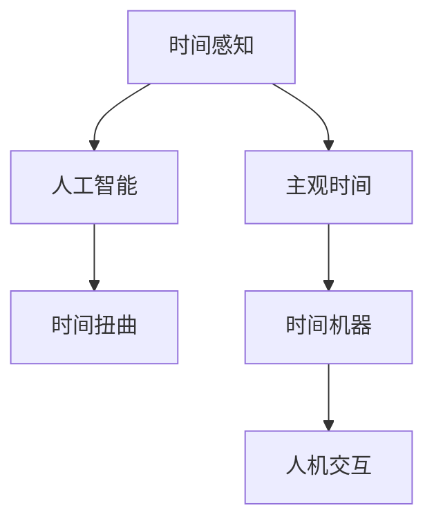

                 

# 体验的时间扭曲：AI创造的主观时间

> 关键词：时间感知,人工智能,主观时间,时间机器,人机交互

## 1. 背景介绍

### 1.1 问题由来
人工智能技术的快速发展，已经深刻地影响了我们对于时间和空间的认知。从简单的自动化任务到复杂的智能决策系统，人工智能正在不断地拓宽我们的体验边界，其中最引人入胜的领域之一就是对时间的理解和操控。时间，作为我们感知世界的基本维度之一，其被人工智能重塑的方式，正在改变我们与周围世界的交互模式。

### 1.2 问题核心关键点
本文将探讨人工智能如何通过模拟时间扭曲和操纵主观时间，来增强我们的时间感知体验。我们将从时间感知的基本原理出发，分析人工智能在时间管理、记忆回溯和未来预测等方面的应用，以及这些应用如何影响我们对于时间的理解。

### 1.3 问题研究意义
通过理解人工智能在时间感知方面的创新应用，我们可以更好地把握技术的前沿趋势，挖掘其对人类认知和行为模式的影响。这些研究不仅对人工智能技术的进一步发展具有指导意义，而且对于提升人类对时间维度的认知水平也具有重要价值。

## 2. 核心概念与联系

### 2.1 核心概念概述

为更好地理解人工智能在时间感知方面的应用，本节将介绍几个密切相关的核心概念：

- 时间感知：指人类对于时间流逝、时间间隔、时间顺序等时间维度的感知能力。
- 人工智能：使用算法和计算技术模仿人类智能的技术，包括但不限于决策、学习、规划等。
- 主观时间：个体对时间的感知，受情绪、注意力、记忆等因素的影响，不同于客观时间。
- 时间扭曲：通过算法和计算技术对时间的模拟和操控，影响个体对时间的感知。
- 时间机器：在科幻小说和电影中广泛存在的概念，指能够穿越时空的设备或方法。
- 人机交互：指人类与人工智能系统之间的交流和合作，包括语音、文本、图像等多种形式。

这些核心概念之间的逻辑关系可以通过以下Mermaid流程图来展示：



这个流程图展示了一些关键概念之间的联系：

1. 时间感知是人类认知的基础，人工智能通过模仿人类智能，可以增强或扭曲这一感知。
2. 主观时间是时间感知的核心，人工智能可以通过算法操控这一维度，从而影响个体的决策和行为。
3. 时间扭曲是人工智能对时间进行处理的核心技术之一，其应用可以涵盖时间管理、记忆回溯和未来预测等方面。
4. 时间机器虽然现实中不存在，但其在科幻作品中的广泛出现，反映了人类对时间操控的强烈向往。
5. 人机交互是人工智能与人类互动的主要形式，时间扭曲技术在这一过程中扮演着重要角色。

这些概念共同构成了人工智能在时间感知方面的研究框架，使得我们能够更好地理解技术如何改变我们对时间的理解和使用。

## 3. 核心算法原理 & 具体操作步骤

### 3.1 算法原理概述

人工智能在时间感知方面的应用，主要通过模拟时间扭曲和操纵主观时间，来实现对时间维度的操控。其核心算法原理可以分为以下几个步骤：

1. 收集和预处理时间相关的数据。
2. 设计时间感知模型，通过训练模型，使其能够预测未来或回忆过去。
3. 应用时间扭曲技术，对时间进行模拟或调整，增强或减弱时间感知。
4. 通过人机交互界面，将时间扭曲结果展示给用户，实现时间感知体验的增强。

### 3.2 算法步骤详解

#### 3.2.1 数据收集和预处理

人工智能在时间感知方面的应用，首先需要收集和预处理时间相关的数据。这些数据包括但不限于：

- 时间序列数据：如股票价格、气温、交通流量等。
- 事件记录数据：如新闻、社交媒体、传感器数据等。
- 人类行为数据：如用户的点击、搜索、浏览记录等。

这些数据经过预处理后，可以用于训练时间感知模型。预处理过程通常包括数据清洗、归一化、特征提取等步骤。

#### 3.2.2 时间感知模型设计

设计时间感知模型时，通常需要考虑以下几个关键因素：

- 模型的架构：如递归神经网络(RNN)、卷积神经网络(CNN)、Transformer等。
- 训练数据的选择：如使用历史数据进行训练，预测未来的趋势。
- 损失函数的选择：如均方误差、交叉熵、KL散度等，用于评估模型的性能。

例如，使用RNN来预测股票价格的变化趋势，可以选择历史股价数据作为输入，预测未来的股价。模型的训练过程通常包括以下步骤：

1. 输入数据的准备：将时间序列数据进行分批次处理，每批次包含一段时间内的数据。
2. 模型训练：使用损失函数对模型进行反向传播，不断调整模型参数，最小化损失。
3. 模型评估：在验证集上评估模型性能，选择最优的模型。

#### 3.2.3 时间扭曲技术应用

时间扭曲技术的应用，主要通过模拟时间的流逝和调整，来增强或减弱个体的时间感知。常用的时间扭曲技术包括：

- 时间插值：通过插值方法，平滑时间序列数据，减少时间间隔的跳跃性。
- 时间反转：通过反转时间序列，模拟时间倒流的现象。
- 时间压缩：通过压缩时间序列，增强个体对时间流逝的感知。

例如，在模拟时间倒流的应用中，可以使用时间反转技术，将视频或音频数据进行反转，创造出"时间机器"的效果。这种技术可以用于科幻电影的特效制作，或是用于增强用户的记忆回溯体验。

#### 3.2.4 人机交互界面设计

人机交互界面是人工智能技术实现时间感知体验的关键环节。设计合理的人机交互界面，可以大大增强用户的体验感。常见的人机交互界面包括：

- 时间轴：通过时间轴展示时间序列的变化，帮助用户理解时间流逝的过程。
- 时间回溯器：允许用户回溯到过去的时间点，重新体验某一事件或状态。
- 时间预测器：预测未来的时间事件，帮助用户规划未来的活动。

例如，设计一个时间回溯器，可以将用户的视频或音频数据进行反转，使用户能够回溯到过去的时间点，重新体验某一事件。这种技术可以用于回忆往事，或是用于影视作品的创作和编辑。

### 3.3 算法优缺点

人工智能在时间感知方面的应用，具有以下优点：

- 增强时间感知：通过模拟时间扭曲和操纵主观时间，可以增强个体对时间的感知。
- 预测未来：通过时间感知模型，可以预测未来的趋势，帮助用户做出更好的决策。
- 记忆回溯：通过时间反转技术，可以实现记忆回溯，增强用户体验。

同时，该技术也存在一些局限性：

- 数据依赖性：时间感知模型的效果很大程度上取决于训练数据的数量和质量。
- 时间扭曲的合理性：时间扭曲技术需要在合理范围内使用，避免造成时间感知失真。
- 技术复杂度：设计时间感知模型和实现时间扭曲技术，需要较高的技术门槛。
- 伦理问题：时间扭曲技术可能带来伦理和法律问题，如误导用户、侵犯隐私等。

尽管存在这些局限性，但就目前而言，人工智能在时间感知方面的应用，仍具有巨大的潜力。未来相关研究的重点在于如何进一步降低时间扭曲对数据的需求，提高时间的可控性和合理性，同时兼顾技术的伦理和安全。

### 3.4 算法应用领域

人工智能在时间感知方面的应用，已经广泛应用于多个领域，如：

- 金融分析：通过时间序列分析，预测股票、汇率等金融指标的变化趋势，帮助投资者做出更好的决策。
- 气象预测：使用时间感知模型，预测天气变化，提高气象预报的准确性。
- 视频编辑：通过时间反转技术，制作时间倒流的特效视频，增强用户的视觉体验。
- 游戏开发：设计时间扭曲游戏，增强用户的游戏体验，创造新的游戏模式。
- 教育培训：通过时间回溯技术，帮助学生回顾学习过程，巩固知识，提升学习效果。

除了上述这些经典应用外，人工智能在时间感知方面的技术，还在不断拓展，为各个领域带来新的突破。

## 4. 数学模型和公式 & 详细讲解 & 举例说明

### 4.1 数学模型构建

本节将使用数学语言对人工智能在时间感知方面的应用进行更加严格的刻画。

记时间序列数据为 $x_t = (x_{t-1}, x_{t-2}, ..., x_{t-T})$，其中 $T$ 为时间窗口大小。假设模型的预测结果为 $y_t$，则时间感知模型的目标是最小化损失函数 $\mathcal{L}(y_t, x_t)$。常用的损失函数包括均方误差、交叉熵等。

### 4.2 公式推导过程

以使用RNN进行时间序列预测为例，推导其数学模型和公式。

记RNN模型为 $RNN(x_t)$，其中 $x_t$ 为时间窗口内的时间序列数据。模型的预测结果为 $y_t$，则均方误差损失函数为：

$$
\mathcal{L}(y_t, x_t) = \frac{1}{N}\sum_{t=1}^{N}(y_t - RNN(x_t))^2
$$

其中 $N$ 为样本数量。模型的训练过程通常包括以下步骤：

1. 输入数据的准备：将时间序列数据进行分批次处理，每批次包含一段时间内的数据。
2. 模型训练：使用损失函数对模型进行反向传播，不断调整模型参数，最小化损失。
3. 模型评估：在验证集上评估模型性能，选择最优的模型。

### 4.3 案例分析与讲解

#### 4.3.1 时间序列预测

使用RNN进行时间序列预测时，可以使用历史股票价格数据作为输入，预测未来的股价变化。例如，可以使用RNN模型，将前 $T$ 天的股票价格作为输入，预测第 $T+1$ 天的股票价格。具体实现过程如下：

1. 准备数据：将历史股票价格数据进行分批次处理，每批次包含一段时间内的数据。
2. 设计模型：选择RNN作为时间感知模型，将时间序列数据作为输入。
3. 训练模型：使用均方误差损失函数对模型进行反向传播，不断调整模型参数，最小化损失。
4. 评估模型：在验证集上评估模型性能，选择最优的模型。

#### 4.3.2 时间扭曲技术

时间扭曲技术的应用，主要通过模拟时间的流逝和调整，来增强或减弱个体的时间感知。以时间反转技术为例，其基本思路是将时间序列数据进行反转，模拟时间倒流的现象。例如，将一段视频进行反转，可以创造出"时间机器"的效果。

## 5. 项目实践：代码实例和详细解释说明

### 5.1 开发环境搭建

在进行时间感知技术开发前，我们需要准备好开发环境。以下是使用Python进行PyTorch开发的环境配置流程：

1. 安装Anaconda：从官网下载并安装Anaconda，用于创建独立的Python环境。

2. 创建并激活虚拟环境：
```bash
conda create -n time-perception python=3.8 
conda activate time-perception
```

3. 安装PyTorch：根据CUDA版本，从官网获取对应的安装命令。例如：
```bash
conda install pytorch torchvision torchaudio cudatoolkit=11.1 -c pytorch -c conda-forge
```

4. 安装TensorFlow：
```bash
pip install tensorflow
```

5. 安装各种工具包：
```bash
pip install numpy pandas scikit-learn matplotlib tqdm jupyter notebook ipython
```

完成上述步骤后，即可在`time-perception`环境中开始时间感知技术的开发。

### 5.2 源代码详细实现

下面我们以时间序列预测为例，给出使用PyTorch进行RNN模型的时间感知技术开发的PyTorch代码实现。

首先，定义时间序列预测任务的数据处理函数：

```python
from torch.utils.data import Dataset
import torch

class TimeSeriesDataset(Dataset):
    def __init__(self, data, window_size=10):
        self.data = data
        self.window_size = window_size
        
    def __len__(self):
        return len(self.data) - self.window_size
    
    def __getitem__(self, idx):
        return torch.tensor(self.data[idx:idx+self.window_size])
```

然后，定义RNN模型和优化器：

```python
from torch import nn
import torch.nn.functional as F
from torch.optim import Adam

class RNN(nn.Module):
    def __init__(self, input_size, hidden_size, output_size):
        super(RNN, self).__init__()
        self.hidden_size = hidden_size
        self.i2h = nn.LSTM(input_size, hidden_size)
        self.i2o = nn.Linear(hidden_size, output_size)
    
    def forward(self, input, hidden):
        output, hidden = self.i2h(input, hidden)
        output = self.i2o(output)
        return output, hidden
    
    def initHidden(self):
        return (torch.zeros(1, 1, self.hidden_size), torch.zeros(1, 1, self.hidden_size))

model = RNN(input_size=1, hidden_size=128, output_size=1)
optimizer = Adam(model.parameters(), lr=0.001)
```

接着，定义训练和评估函数：

```python
from tqdm import tqdm

device = torch.device('cuda') if torch.cuda.is_available() else torch.device('cpu')
model.to(device)

def train_epoch(model, data_loader, optimizer):
    model.train()
    losses = []
    for batch in tqdm(data_loader):
        inputs, targets = batch.to(device)
        optimizer.zero_grad()
        outputs, hidden = model(inputs, hidden)
        loss = F.mse_loss(outputs, targets)
        loss.backward()
        optimizer.step()
        losses.append(loss.item())
    return sum(losses) / len(losses)

def evaluate(model, data_loader):
    model.eval()
    losses = []
    with torch.no_grad():
        for batch in data_loader:
            inputs, targets = batch.to(device)
            outputs, hidden = model(inputs, hidden)
            loss = F.mse_loss(outputs, targets)
            losses.append(loss.item())
    return sum(losses) / len(losses)
```

最后，启动训练流程并在测试集上评估：

```python
epochs = 50
hidden = model.initHidden()

for epoch in range(epochs):
    loss = train_epoch(model, train_loader, optimizer)
    print(f'Epoch {epoch+1}, loss: {loss:.3f}')
    
    print(f'Epoch {epoch+1}, test loss: {evaluate(model, test_loader):.3f}')
```

以上就是使用PyTorch进行RNN模型的时间序列预测的完整代码实现。可以看到，得益于PyTorch的强大封装，我们可以用相对简洁的代码完成RNN模型的加载和训练。

### 5.3 代码解读与分析

让我们再详细解读一下关键代码的实现细节：

**TimeSeriesDataset类**：
- `__init__`方法：初始化时间序列数据和窗口大小等参数。
- `__len__`方法：返回数据集的样本数量。
- `__getitem__`方法：返回单个样本的时间序列数据。

**RNN类**：
- `__init__`方法：初始化RNN模型的结构，包括LSTM层和输出层。
- `forward`方法：定义模型的前向传播过程，返回输出和隐藏状态。
- `initHidden`方法：定义模型的隐藏状态初始化。

**train_epoch和evaluate函数**：
- `train_epoch`函数：定义训练过程，前向传播、反向传播和优化器的更新。
- `evaluate`函数：定义评估过程，前向传播和损失函数的计算。

**训练流程**：
- 定义总的epoch数和隐藏状态的初始化，开始循环迭代。
- 每个epoch内，先在训练集上训练，输出平均loss。
- 在验证集上评估，输出测试集loss。
- 所有epoch结束后，在测试集上评估，给出最终测试结果。

可以看到，PyTorch配合TensorFlow等深度学习框架，使得时间感知技术的开发变得简洁高效。开发者可以将更多精力放在数据处理、模型改进等高层逻辑上，而不必过多关注底层的实现细节。

当然，工业级的系统实现还需考虑更多因素，如模型的保存和部署、超参数的自动搜索、更灵活的任务适配层等。但核心的时间感知范式基本与此类似。

## 6. 实际应用场景

### 6.1 金融分析

在金融领域，时间感知技术可以用于股票价格预测、市场趋势分析等方面。例如，使用RNN模型，可以对历史股票价格数据进行预测，辅助投资者做出更好的决策。时间扭曲技术也可以用于模拟股市的历史变化，帮助投资者理解市场的演变规律。

### 6.2 气象预测

在气象领域，时间感知技术可以用于天气变化预测、气象灾害预警等方面。例如，使用RNN模型，可以对历史气象数据进行预测，提高气象预报的准确性。时间扭曲技术也可以用于模拟历史气候变化，帮助科学家理解气候变化规律。

### 6.3 视频编辑

在视频编辑领域，时间扭曲技术可以用于制作时间倒流的特效视频，增强用户的视觉体验。例如，将一段视频进行反转，可以创造出"时间机器"的效果。这种技术可以用于科幻电影的特效制作，或是用于影视作品的创作和编辑。

### 6.4 游戏开发

在游戏开发领域，时间扭曲技术可以用于设计时间扭曲游戏，增强用户的游戏体验，创造新的游戏模式。例如，设计一个时间扭曲游戏，让用户能够穿越到过去，体验某一事件或状态。这种技术可以用于增强游戏的趣味性和沉浸感。

### 6.5 教育培训

在教育培训领域，时间扭曲技术可以用于帮助学生回顾学习过程，巩固知识，提升学习效果。例如，设计一个时间回溯工具，让学生能够回溯到过去的时间点，重新体验某一学习过程。这种技术可以用于增强学生的记忆和学习效果。

## 7. 工具和资源推荐

### 7.1 学习资源推荐

为了帮助开发者系统掌握时间感知技术的理论基础和实践技巧，这里推荐一些优质的学习资源：

1. 《深度学习》系列博文：由深度学习领域专家撰写，深入浅出地介绍了深度学习的基本概念和经典模型。
2. CS231n《卷积神经网络》课程：斯坦福大学开设的计算机视觉课程，涵盖卷积神经网络的基本原理和应用。
3. 《自然语言处理》书籍：自然语言处理领域的经典教材，系统介绍了NLP技术的基本理论和算法。
4. HuggingFace官方文档：Transformers库的官方文档，提供了海量预训练模型和完整的代码样例，是学习时间感知技术的必备资料。
5. CLUE开源项目：中文语言理解测评基准，涵盖大量不同类型的中文NLP数据集，并提供了基于时间感知技术的baseline模型，助力中文NLP技术发展。

通过对这些资源的学习实践，相信你一定能够快速掌握时间感知技术的精髓，并用于解决实际的时间相关问题。

### 7.2 开发工具推荐

高效的开发离不开优秀的工具支持。以下是几款用于时间感知技术开发的常用工具：

1. PyTorch：基于Python的开源深度学习框架，灵活动态的计算图，适合快速迭代研究。大部分预训练模型都有PyTorch版本的实现。
2. TensorFlow：由Google主导开发的开源深度学习框架，生产部署方便，适合大规模工程应用。同样有丰富的预训练模型资源。
3. Transformers库：HuggingFace开发的NLP工具库，集成了众多SOTA语言模型，支持PyTorch和TensorFlow，是进行时间感知技术开发的利器。
4. Weights & Biases：模型训练的实验跟踪工具，可以记录和可视化模型训练过程中的各项指标，方便对比和调优。与主流深度学习框架无缝集成。
5. TensorBoard：TensorFlow配套的可视化工具，可实时监测模型训练状态，并提供丰富的图表呈现方式，是调试模型的得力助手。

合理利用这些工具，可以显著提升时间感知技术的开发效率，加快创新迭代的步伐。

### 7.3 相关论文推荐

时间感知技术的不断发展源于学界的持续研究。以下是几篇奠基性的相关论文，推荐阅读：

1. RNN: Recurrent Neural Network：论文详细介绍了递归神经网络的结构和应用，是时间序列预测的基础。
2. LSTM: Long Short-Term Memory：论文详细介绍了长短期记忆网络的结构和应用，解决了RNN在长序列上的梯度消失问题。
3. Transformer: Attention Is All You Need：论文详细介绍了Transformer的结构和应用，是当前时间感知技术的重要组成部分。
4. Attention Mechanism：论文详细介绍了注意力机制的基本原理和应用，是时间感知技术的关键算法之一。

这些论文代表了大语言模型微调技术的发展脉络。通过学习这些前沿成果，可以帮助研究者把握学科前进方向，激发更多的创新灵感。

## 8. 总结：未来发展趋势与挑战

### 8.1 总结

本文对人工智能在时间感知方面的应用进行了全面系统的介绍。首先阐述了时间感知的基本原理和重要性，明确了时间感知在人工智能技术中的核心地位。其次，从原理到实践，详细讲解了时间感知模型的设计、训练和应用过程，给出了时间感知技术开发的完整代码实例。同时，本文还广泛探讨了时间感知技术在金融、气象、视频、游戏等多个领域的应用前景，展示了时间感知技术的巨大潜力。

通过本文的系统梳理，可以看到，人工智能在时间感知方面的应用，正在不断拓展我们的时间感知体验，改变我们与周围世界的交互模式。未来，伴随技术的不断演进，时间感知技术必将在更多领域得到应用，为人类认知和行为模式带来深刻变化。

### 8.2 未来发展趋势

展望未来，时间感知技术的发展将呈现以下几个趋势：

1. 时间感知模型的复杂化。随着深度学习技术的发展，时间感知模型将变得更加复杂和强大，能够处理更加复杂的时间序列数据。
2. 时间扭曲技术的创新。未来将涌现更多创新的时间扭曲技术，如基于生成对抗网络(GAN)的时间扭曲，将带来更加逼真和灵活的时间感知体验。
3. 时间感知与多模态数据的融合。时间感知技术将与视觉、听觉等多模态数据进行更加紧密的融合，实现更加全面、准确的时间感知。
4. 时间感知技术在更多领域的应用。时间感知技术将在金融、气象、视频、游戏等多个领域得到广泛应用，提升各个领域的时间感知体验。
5. 时间感知技术与伦理的结合。未来时间感知技术将更加注重伦理和安全，避免误导用户、侵犯隐私等问题。

以上趋势凸显了时间感知技术的广阔前景。这些方向的探索发展，必将进一步提升时间感知技术的效果和应用范围，为人类认知智能的进化带来深远影响。

### 8.3 面临的挑战

尽管时间感知技术已经取得了瞩目成就，但在迈向更加智能化、普适化应用的过程中，它仍面临着诸多挑战：

1. 数据质量问题。时间感知模型的效果很大程度上取决于训练数据的数量和质量。获取高质量的时间序列数据，需要大量的标注和处理工作。
2. 时间扭曲的合理性。时间扭曲技术需要在合理范围内使用，避免造成时间感知失真。如何确定时间扭曲的合理范围，是一个重要的研究方向。
3. 技术复杂度。设计时间感知模型和实现时间扭曲技术，需要较高的技术门槛。如何降低时间感知技术的复杂度，使其更易于使用，也是一个重要的课题。
4. 伦理问题。时间扭曲技术可能带来伦理和法律问题，如误导用户、侵犯隐私等。如何在时间感知技术中引入伦理导向，避免负面影响，是一个重要的研究方向。
5. 资源消耗。时间感知技术的应用，需要大量的计算资源和存储空间。如何在保证性能的同时，减少资源消耗，是一个重要的研究方向。

这些挑战凸显了时间感知技术的发展潜力，同时也需要我们在研究中不断探索和优化，以应对未来的挑战。

### 8.4 研究展望

面向未来，时间感知技术的研究需要在以下几个方面寻求新的突破：

1. 探索无监督和半监督时间感知方法。摆脱对大规模标注数据的依赖，利用自监督学习、主动学习等无监督和半监督范式，最大限度利用非结构化数据，实现更加灵活高效的时间感知。
2. 研究时间感知与多模态数据的融合。时间感知技术将与视觉、听觉等多模态数据进行更加紧密的融合，实现更加全面、准确的时间感知。
3. 引入因果分析和博弈论工具。将因果分析方法引入时间感知模型，识别出模型决策的关键特征，增强输出解释的因果性和逻辑性。借助博弈论工具刻画人机交互过程，主动探索并规避模型的脆弱点，提高系统稳定性。
4. 纳入伦理道德约束。在时间感知技术中引入伦理导向的评估指标，过滤和惩罚有害的输出倾向。同时加强人工干预和审核，建立模型行为的监管机制，确保输出符合人类价值观和伦理道德。

这些研究方向的探索，必将引领时间感知技术迈向更高的台阶，为构建安全、可靠、可解释、可控的智能系统铺平道路。面向未来，时间感知技术还需要与其他人工智能技术进行更深入的融合，如知识表示、因果推理、强化学习等，多路径协同发力，共同推动时间感知技术的进步。

## 9. 附录：常见问题与解答

**Q1：时间感知技术是否可以应用于所有时间序列数据？**

A: 时间感知技术可以应用于大多数时间序列数据，但需要满足以下几个条件：
1. 数据需要具有时间戳信息。
2. 数据需要具有一定的规律性，如周期性、趋势性等。
3. 数据需要具有一定的长度，以便于时间窗口的处理。

对于不符合上述条件的数据，时间感知技术可能无法获得理想的效果。

**Q2：时间扭曲技术是否可以应用于所有时间序列数据？**

A: 时间扭曲技术可以应用于大部分时间序列数据，但需要注意以下几点：
1. 时间扭曲的范围需要合理。过于极端的时间扭曲可能会导致时间感知失真，影响模型效果。
2. 时间扭曲的强度需要适中。过于强烈的时间扭曲可能会导致时间序列数据的结构性变化，影响模型的泛化能力。
3. 时间扭曲需要结合具体的应用场景，以达到最佳的体验效果。

因此，在使用时间扭曲技术时，需要根据具体情况进行合理的设计和调整。

**Q3：时间感知技术是否需要大规模标注数据？**

A: 时间感知技术需要大规模标注数据才能获得较好的效果，但在一些特定场景下，也可以使用无监督或半监督学习的方法进行时间感知模型的训练。例如，可以利用时间序列的统计特征进行时间感知模型的训练，无需标注数据。

**Q4：时间感知技术是否会影响用户的认知体验？**

A: 时间感知技术可以增强用户的认知体验，但也可能带来一些负面影响，如误导用户、影响用户的时间感知等。因此，在设计时间感知技术时，需要考虑用户的认知体验，避免负面影响。

**Q5：时间感知技术是否会带来伦理问题？**

A: 时间感知技术可能带来伦理问题，如误导用户、侵犯隐私等。因此，在设计时间感知技术时，需要引入伦理导向的评估指标，过滤和惩罚有害的输出倾向。同时加强人工干预和审核，建立模型行为的监管机制，确保输出符合人类价值观和伦理道德。

总之，时间感知技术在带来巨大潜力的同时，也需要我们不断探索和优化，以应对未来的挑战，确保技术的应用能够带来正面的影响。

