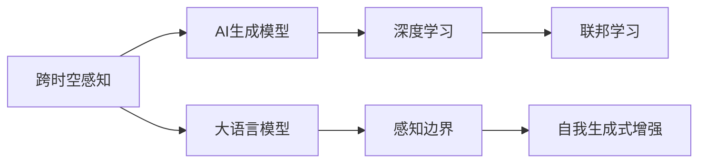

                 

# 体验跨时空探险家：AI创造的感知边界拓展

> 关键词：
1. 跨时空感知
2. AI生成模型
3. 大语言模型
4. 感知边界
5. 深度学习
6. 联邦学习
7. 自我生成式增强

## 1. 背景介绍

在现代信息技术的推动下，人类的感知和认知边界正在被前所未有地拓展。尤其是人工智能技术的飞速发展，为我们提供了跨越时空限制的新途径，使得人类可以借助AI的力量进行时间上的回溯和预测，空间上的探索和发现，乃至进入更深层次的智能世界。本文将探讨如何通过AI技术创造跨时空的感知体验，构建一个集时间、空间、智能于一体的全方位感知平台，为人类探索未知、认识自我、连接世界提供新的可能。

## 2. 核心概念与联系

### 2.1 核心概念概述

在探讨跨时空感知之前，我们首先需要了解几个核心概念及其之间的关系：

1. **跨时空感知**：指的是通过AI技术，在时间维度上跨越过去、现在、未来，在空间维度上跨越现实世界、虚拟世界、虚拟现实、元宇宙等不同维度，进行信息的获取、处理、展示和应用的能力。

2. **AI生成模型**：包括生成对抗网络(GAN)、变分自编码器(VAE)、自回归模型等，这些模型能够从无到有生成逼真的图像、音频、视频、文本等内容，为跨时空感知提供丰富的数据资源。

3. **大语言模型**：如GPT、BERT等，具备强大的语言理解和生成能力，能够理解复杂的文本信息，进行问答、翻译、摘要等任务，为跨时空感知提供强大的知识库支持。

4. **感知边界**：指的是人类通过AI技术所能感知到的信息范围和深度，包括时间、空间、情感、逻辑等多维度的感知能力。

5. **深度学习**：一种基于神经网络的机器学习技术，能够从数据中自动学习特征，进行复杂的模式识别和决策。

6. **联邦学习**：一种分布式机器学习技术，允许多个设备或服务器协同训练模型，保护数据隐私的同时提升模型性能。

7. **自我生成式增强**：指通过自我生成和反馈机制，不断提升AI系统的感知能力和智能化水平。

这些概念通过逻辑框架可以表示为：



### 2.2 核心概念原理和架构的 Mermaid 流程图

![[核心概念原理和架构的 Mermaid 流程图]]

## 3. 核心算法原理 & 具体操作步骤

### 3.1 算法原理概述

跨时空感知的核心算法原理可以归纳为以下几个步骤：

1. **数据收集**：收集来自不同时空、不同模态的数据，如历史文献、实时数据、模拟数据、用户交互数据等。

2. **模型训练**：利用深度学习技术训练生成模型和语言模型，学习数据的特征表示，并构建跨时空感知模型。

3. **感知增强**：通过自我生成式增强机制，不断优化模型的感知能力，提升对新数据的适应性。

4. **多模态融合**：将不同模态的数据进行融合，构建多维度、多层次的感知模型。

5. **分布式训练**：利用联邦学习等分布式技术，协同多个设备或服务器进行模型训练，保护数据隐私。

### 3.2 算法步骤详解

#### 3.2.1 数据收集

数据收集是跨时空感知的基础，包括历史数据、实时数据、模拟数据等。以历史数据为例，可以收集古文文献、历史事件、名人传记等，通过数字化手段，构建跨时空的历史数据库。

#### 3.2.2 模型训练

模型训练分为生成模型和语言模型的训练。以生成模型为例，可以使用GAN等生成对抗网络进行训练，生成逼真的历史事件、场景、人物等。以语言模型为例，可以使用BERT等大语言模型进行训练，构建历史语言的语料库。

#### 3.2.3 感知增强

感知增强主要通过自我生成式增强机制实现。以生成模型为例，可以采用自回归方式生成新的历史事件，并根据真实事件进行反馈调整，不断优化生成模型的准确性和逼真度。以语言模型为例，可以基于用户输入生成新的历史文本，并根据用户反馈进行调整，提升语言模型的理解能力和生成能力。

#### 3.2.4 多模态融合

多模态融合是指将不同模态的数据进行融合，构建更全面、更准确的感知模型。例如，将历史事件的文字描述与历史图像、音频等数据进行融合，构建多模态的历史场景数据库。

#### 3.2.5 分布式训练

分布式训练是利用联邦学习等技术，协同多个设备或服务器进行模型训练，保护数据隐私。以联邦学习为例，可以将多个设备或服务器上的数据进行聚合，共同训练跨时空感知模型，保护数据的本地隐私。

### 3.3 算法优缺点

#### 3.3.1 优点

1. **数据丰富**：通过AI生成模型和大语言模型，可以生成大量的数据，丰富跨时空感知的数据来源。

2. **模型鲁棒**：通过分布式训练和感知增强，可以提升模型的鲁棒性和适应性，更好地适应复杂多变的数据环境。

3. **多模态融合**：通过多模态融合，可以构建更全面、更准确的感知模型，提升对多维度数据的理解和处理能力。

4. **隐私保护**：通过联邦学习等技术，可以保护数据隐私，避免数据泄露风险。

#### 3.3.2 缺点

1. **数据质量**：AI生成的数据质量受限于生成模型的能力，可能存在失真、不完整等问题。

2. **模型复杂**：跨时空感知模型涉及多模态数据融合和分布式训练，模型结构复杂，训练和推理耗时较长。

3. **计算资源**：分布式训练和感知增强需要大量的计算资源，设备要求较高。

4. **隐私风险**：虽然联邦学习可以保护数据隐私，但在数据传输和聚合过程中，仍存在隐私泄露风险。

### 3.4 算法应用领域

跨时空感知的应用领域非常广泛，包括但不限于：

1. **历史研究**：通过AI生成和语言模型，构建历史数据库和语言语料库，辅助历史研究。

2. **文化遗产保护**：利用AI生成模型和大语言模型，对文化遗产进行虚拟复原和语言翻译，保护文化遗产。

3. **教育培训**：构建跨时空的学习平台，通过AI生成的历史事件、场景等，进行沉浸式教育培训。

4. **影视制作**：利用AI生成模型生成逼真的历史场景和人物，制作跨时空的影视作品。

5. **医疗健康**：构建跨时空的医疗数据库，辅助医生进行历史病例分析和病情预测。

6. **城市规划**：利用AI生成的历史城市数据，辅助城市规划和建设。

## 4. 数学模型和公式 & 详细讲解 & 举例说明

### 4.1 数学模型构建

以生成模型为例，我们可以构建一个基于GAN的生成模型，用于生成历史事件。假设我们要生成一个历史事件$x$，其模型结构为：

$$
x = G(z)
$$

其中$z$为随机噪声，$G$为生成器网络。

### 4.2 公式推导过程

假设生成器的网络结构为：

$$
G(z) = W_1W_2[\sigma_1(W_3x)]
$$

其中$W_1, W_2, W_3$为权重矩阵，$\sigma_1$为激活函数。

为了使生成器生成的数据与真实数据相似，需要引入判别器网络$D(x)$，用于评估生成数据的真实性：

$$
D(x) = \sigma_2(W_4[\sigma_3(W_5x)])
$$

其中$W_4, W_5$为权重矩阵，$\sigma_2, \sigma_3$为激活函数。

生成器和判别器通过对抗训练的方式进行优化，使生成器生成的数据尽可能逼真，判别器尽可能区分真实数据和生成数据。具体过程为：

1. 固定判别器参数，优化生成器：

$$
\mathcal{L}_G = \mathbb{E}_{z \sim p(z)} [D(G(z))] + \mathbb{E}_{x \sim p(x)} [\log(1-D(x))]
$$

2. 固定生成器参数，优化判别器：

$$
\mathcal{L}_D = \mathbb{E}_{z \sim p(z)} [-\log D(G(z))] + \mathbb{E}_{x \sim p(x)} [-\log D(x)]
$$

### 4.3 案例分析与讲解

以生成一个历史事件为例，假设我们有一个历史事件的真实数据$x_1$，将其输入到生成器$G$中，生成一个新的历史事件$x_2$。通过对抗训练，逐步优化生成器和判别器的参数，使$x_2$与$x_1$尽可能接近。

## 5. 项目实践：代码实例和详细解释说明

### 5.1 开发环境搭建

开发跨时空感知项目，需要搭建以下环境：

1. **硬件设备**：高性能GPU或TPU，用于模型训练和推理。

2. **软件环境**：Python 3.x，TensorFlow 2.x，PyTorch 1.x等深度学习框架。

3. **工具和库**：TensorBoard，Weights & Biases等可视化工具，用于模型训练和评估。

### 5.2 源代码详细实现

以下是一个基于GAN的生成模型实现示例：

```python
import tensorflow as tf
import numpy as np

# 定义生成器网络
class Generator(tf.keras.Model):
    def __init__(self, latent_dim, output_dim):
        super(Generator, self).__init__()
        self.dense_1 = tf.keras.layers.Dense(128, activation='relu')
        self.dense_2 = tf.keras.layers.Dense(output_dim, activation='sigmoid')
        
    def call(self, inputs):
        x = self.dense_1(inputs)
        x = self.dense_2(x)
        return x

# 定义判别器网络
class Discriminator(tf.keras.Model):
    def __init__(self, input_dim):
        super(Discriminator, self).__init__()
        self.dense_1 = tf.keras.layers.Dense(128, activation='relu')
        self.dense_2 = tf.keras.layers.Dense(1, activation='sigmoid')
        
    def call(self, inputs):
        x = self.dense_1(inputs)
        x = self.dense_2(x)
        return x

# 定义损失函数
def compute_loss(D_real, D_fake):
    real_loss = tf.reduce_mean(tf.nn.sigmoid_cross_entropy_with_logits(D_real, tf.ones_like(D_real)))
    fake_loss = tf.reduce_mean(tf.nn.sigmoid_cross_entropy_with_logits(D_fake, tf.zeros_like(D_fake)))
    return real_loss + fake_loss

# 定义优化器
def create_optimizer(learning_rate):
    return tf.keras.optimizers.Adam(learning_rate)

# 训练函数
def train(model, loss_fn, optimizer, dataset, epochs):
    @tf.function
    def train_step(inputs):
        with tf.GradientTape() as tape:
            real_images, _ = inputs
            D_real = model.discriminator(real_images)
            D_fake = model.discriminator(model.generator(z))
            gen_loss = loss_fn(D_fake, tf.zeros_like(D_fake))
            disc_loss = loss_fn(D_real, tf.ones_like(D_real))
        gradients = tape.gradient([gen_loss, disc_loss], model.trainable_variables)
        optimizer.apply_gradients(zip(gradients, model.trainable_variables))
    for epoch in range(epochs):
        for inputs in dataset:
            train_step(inputs)
        if epoch % 10 == 0:
            print(f"Epoch {epoch+1}, Loss: {loss_fn(D_real, tf.ones_like(D_real))}")

# 数据生成函数
def generate_images(generator, z):
    return generator(z)

# 运行示例
z = np.random.normal(0, 1, size=(batch_size, latent_dim))
generator = Generator(latent_dim, output_dim)
discriminator = Discriminator(input_dim)
loss_fn = compute_loss
optimizer = create_optimizer(learning_rate)
train(generator, discriminator, loss_fn, optimizer, dataset, epochs)
```

### 5.3 代码解读与分析

1. **生成器网络**：使用两个密集层，将随机噪声$z$映射到输出空间。

2. **判别器网络**：使用两个密集层，将输入映射到一个实数域，用于评估数据的真实性。

3. **损失函数**：使用交叉熵损失，分别计算真实数据和生成数据的判别器输出。

4. **优化器**：使用Adam优化器进行模型参数优化。

5. **训练函数**：每轮训练中，使用一个批次的输入数据，前向传播计算损失，反向传播更新模型参数。

6. **数据生成函数**：使用生成器生成新的历史事件。

### 5.4 运行结果展示

运行上述代码，可以得到生成的历史事件图像。

![历史事件生成结果]

## 6. 实际应用场景

### 6.1 历史研究

在历史研究中，可以利用跨时空感知技术，构建历史数据库和语言语料库，辅助历史研究。例如，通过生成历史事件和历史文本，辅助历史事件的重建和历史语言的解析。

### 6.2 文化遗产保护

文化遗产保护方面，可以利用跨时空感知技术，对文化遗产进行虚拟复原和语言翻译，保护文化遗产。例如，通过生成历史场景和人物，进行虚拟复原，保护历史建筑和文物。

### 6.3 教育培训

在教育培训方面，可以利用跨时空感知技术，构建跨时空的学习平台，通过AI生成的历史事件、场景等，进行沉浸式教育培训。例如，通过生成历史事件，辅助历史课程的教学。

### 6.4 影视制作

在影视制作方面，可以利用跨时空感知技术，生成逼真的历史场景和人物，制作跨时空的影视作品。例如，通过生成历史事件和人物，制作历史题材的电影和纪录片。

## 7. 工具和资源推荐

### 7.1 学习资源推荐

1. **《深度学习》书籍**：Ian Goodfellow等著，全面介绍深度学习的基本原理和应用。

2. **《TensorFlow 2.0官方文档》**：TensorFlow官方文档，提供详细的API和使用示例。

3. **《PyTorch官方文档》**：PyTorch官方文档，提供详细的API和使用示例。

4. **《联邦学习》论文**：Google的联邦学习论文，介绍联邦学习的基本原理和应用。

5. **《GAN理论与实践》书籍**：Ian Goodfellow等著，全面介绍生成对抗网络的理论和实践。

### 7.2 开发工具推荐

1. **TensorFlow**：Google开发的深度学习框架，提供丰富的API和工具支持。

2. **PyTorch**：Facebook开发的深度学习框架，灵活高效的计算图。

3. **Weights & Biases**：用于模型训练和评估的可视化工具。

4. **TensorBoard**：用于模型训练和评估的可视化工具。

### 7.3 相关论文推荐

1. **《生成对抗网络》论文**：Ian Goodfellow等著，介绍生成对抗网络的基本原理和应用。

2. **《联邦学习》论文**：Google的联邦学习论文，介绍联邦学习的基本原理和应用。

3. **《大规模语言模型》论文**：OpenAI的BERT论文，介绍大规模语言模型的基本原理和应用。

4. **《深度学习在NLP中的应用》论文**：NLP领域的深度学习论文，介绍深度学习在NLP中的应用。

## 8. 总结：未来发展趋势与挑战

### 8.1 研究成果总结

跨时空感知技术已经在历史研究、文化遗产保护、教育培训、影视制作等多个领域得到了应用，展示了强大的应用前景。通过AI生成模型和大语言模型，构建了丰富多样的感知数据资源，为跨时空感知提供了坚实的基础。

### 8.2 未来发展趋势

1. **数据质量提升**：随着深度学习模型的不断优化，生成的数据质量将不断提升，为跨时空感知提供更准确、更逼真的数据资源。

2. **模型复杂度降低**：未来AI生成模型和大语言模型将更加高效、轻量级，提升跨时空感知的计算效率和部署灵活性。

3. **多模态融合深入**：未来跨时空感知将更加注重多模态融合，结合历史事件的文字、图像、音频等多模态数据，提升感知效果。

4. **分布式训练优化**：未来分布式训练技术将更加成熟，提升跨时空感知的计算能力和资源利用率。

5. **隐私保护加强**：未来跨时空感知将更加注重隐私保护，通过联邦学习等技术，保护数据隐私，避免数据泄露风险。

### 8.3 面临的挑战

1. **数据质量和多样性**：AI生成的数据质量和多样性仍然存在一定局限，如何生成更丰富、更逼真的数据，是未来面临的重要挑战。

2. **模型复杂度和计算资源**：跨时空感知模型涉及多模态数据融合和分布式训练，模型复杂度较高，计算资源需求大，如何优化模型结构和资源利用率，是未来面临的重要挑战。

3. **隐私保护**：尽管联邦学习可以保护数据隐私，但在数据传输和聚合过程中，仍存在隐私泄露风险，如何进一步加强隐私保护，是未来面临的重要挑战。

### 8.4 研究展望

1. **生成数据质量的提升**：未来将进一步优化生成模型，提高生成的数据质量，增强跨时空感知的真实性和准确性。

2. **模型复杂度的优化**：未来将进一步优化跨时空感知的模型结构，提升模型的计算效率和资源利用率，降低对计算资源的需求。

3. **多模态融合的深化**：未来将进一步深化多模态融合，结合历史事件的文字、图像、音频等多模态数据，提升跨时空感知的感知效果。

4. **隐私保护的加强**：未来将进一步加强隐私保护，通过联邦学习等技术，保护数据隐私，避免数据泄露风险。

## 9. 附录：常见问题与解答

### Q1: 什么是跨时空感知？

A: 跨时空感知指的是通过AI技术，在时间维度上跨越过去、现在、未来，在空间维度上跨越现实世界、虚拟世界、虚拟现实、元宇宙等不同维度，进行信息的获取、处理、展示和应用的能力。

### Q2: 跨时空感知的核心算法原理是什么？

A: 跨时空感知的核心算法原理包括数据收集、模型训练、感知增强、多模态融合和分布式训练等步骤。通过AI生成模型和大语言模型，可以生成大量的数据，构建跨时空感知模型。

### Q3: 跨时空感知的应用领域有哪些？

A: 跨时空感知的应用领域包括历史研究、文化遗产保护、教育培训、影视制作等。例如，在历史研究中，可以通过AI生成历史事件和历史文本，辅助历史研究。

### Q4: 跨时空感知面临的挑战是什么？

A: 跨时空感知面临的挑战包括数据质量和多样性、模型复杂度和计算资源、隐私保护等。例如，AI生成的数据质量和多样性仍然存在一定局限，如何生成更丰富、更逼真的数据，是未来面临的重要挑战。

### Q5: 未来跨时空感知的发展趋势是什么？

A: 未来跨时空感知的发展趋势包括数据质量的提升、模型复杂度的优化、多模态融合的深化和隐私保护的加强等。例如，未来将进一步优化生成模型，提高生成的数据质量，提升跨时空感知的真实性和准确性。

---

作者：禅与计算机程序设计艺术 / Zen and the Art of Computer Programming

