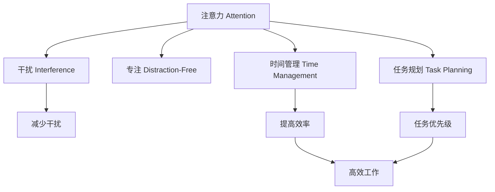

                 

# 信息时代的注意力管理：如何在干扰中保持高效

在信息时代，人们面临的干扰和注意力分散问题日益严重。如何在这纷扰的信息洪流中保持高效，成为当代社会亟需解决的重要课题。本文从核心概念出发，结合算法原理，深入探讨了注意力管理的方法与实践，为在干扰中保持高效提供了实用指南。

## 1. 背景介绍

### 1.1 问题由来
随着数字技术的普及，信息流变得无处不在。人们每天沉浸在海量信息中，注意力被不断打断和分散。例如，社交媒体上的通知、广告弹窗、多任务处理等都成为了干扰源。这些干扰不仅降低了工作效率，还影响了生活的整体质量。

### 1.2 问题核心关键点
信息干扰的核心在于注意力的管理。注意力的管理不仅仅是集中精力，更是一种策略性的资源分配。关键在于如何识别、优化和管理干扰因素，以提升个人和团队的效率。

### 1.3 问题研究意义
研究注意力管理方法，对于提高个人和团队的效能，提升信息处理能力，构建高效的工作和学习环境，具有重要意义：

1. **减少干扰**：通过优化工作流程和环境，减少不必要的干扰源。
2. **提高专注度**：利用时间管理、任务规划等方法，提高专注度和工作效率。
3. **提升决策质量**：明确优先级，减少多任务处理，提高决策质量和问题解决速度。
4. **促进健康**：减少对电子设备的依赖，平衡工作与生活，提升整体健康水平。

## 2. 核心概念与联系

### 2.1 核心概念概述

为更好地理解注意力管理的核心方法，本节将介绍几个关键概念：

- **注意力(Attention)**：指个体对信息的聚焦与加工能力。
- **干扰(Interference)**：指外界因素对个体注意力集中的阻碍和分散。
- **专注(Distraction-Free)**：指在无干扰环境中保持高度专注和高效工作的状态。
- **时间管理(Time Management)**：通过规划和管理时间，提高工作和学习效率的方法。
- **任务规划(Task Planning)**：对任务进行优先级排序和安排，确保高效完成。
- **决策优化(Decision Optimization)**：通过明确优先级，减少多任务处理，提高决策质量。

这些概念之间的关系可以通过以下Mermaid流程图来展示：



这个流程图展示了注意力管理的核心概念及其之间的关系：

1. 注意力通过减少干扰、时间管理和任务规划来提高专注度和效率。
2. 时间管理和任务规划通过明确优先级，减少多任务处理，提高决策质量。
3. 专注状态下，个体能够高效处理信息，提升工作和学习效果。

## 3. 核心算法原理 & 具体操作步骤
### 3.1 算法原理概述

注意力管理的核心在于优化个体在干扰环境中的注意力集中和分配。其核心算法原理可以概括为：

1. **识别干扰源**：分析并识别潜在的干扰因素。
2. **优化注意力**：通过时间管理和任务规划，优化注意力的分配和使用。
3. **提升专注度**：减少干扰，提升个体在无干扰环境中的专注度。
4. **保持高效**：通过策略性资源分配，提高整体工作和学习效率。

### 3.2 算法步骤详解

注意力管理的实施步骤通常包括以下几个关键环节：

**Step 1: 环境优化**
- 识别并隔离干扰源。关闭不必要的通知、限制电子设备的使用时间等。
- 营造专注的环境，如安静的办公区域、舒适的办公设备等。

**Step 2: 时间管理**
- 使用时间块技术，将工作时间划分为固定的时间块，每个时间块专注于单一任务。
- 设置明确的工作时间，避免加班或过度工作。

**Step 3: 任务规划**
- 列出所有待办事项，并进行优先级排序。
- 将任务按优先级和重要程度分配到不同的时间块。

**Step 4: 实施执行**
- 在每个时间块内，全神贯注于单一任务，避免多任务处理。
- 定期回顾任务进度，及时调整计划。

**Step 5: 评估与反馈**
- 定期评估时间管理策略的有效性，调整优化。
- 收集反馈，持续改进注意力管理方法。

### 3.3 算法优缺点

注意力管理的优点在于其简单实用，易于实施。它通过优化环境、管理时间和任务规划，帮助个体提升专注度和效率。同时，注意力管理还具有一定的普适性，适用于各种工作和学习场景。

其缺点在于：
1. 需要个体高度自律。
2. 部分策略可能不适用于所有人群。
3. 难以应对突发情况和意外干扰。

### 3.4 算法应用领域

注意力管理在多个领域中都有广泛应用，例如：

- **工作环境**：通过减少干扰源、优化工作时间和任务优先级，提升工作效率和质量。
- **学习环境**：通过营造良好的学习环境和制定学习计划，提高学习效率和成绩。
- **项目管理**：通过明确任务优先级和优化时间块，提升团队协作和项目管理效率。
- **健康管理**：通过减少对电子设备的依赖，平衡工作与生活，提升整体健康水平。

## 4. 数学模型和公式 & 详细讲解 & 举例说明

### 4.1 数学模型构建

注意力管理的数学模型可以抽象为注意力分配和干扰影响的优化问题。假设个体的总时间为 $T$，干扰强度为 $I$，注意力集中的程度为 $A$，任务重要度为 $W$。则注意力管理的优化目标可以表示为：

$$
\max \sum_{i=1}^{n} W_iA_i
$$

其中 $W_i$ 为任务 $i$ 的重要度，$A_i$ 为任务 $i$ 的注意力集中程度。

### 4.2 公式推导过程

以时间块技术为例，假设个体将一天划分为 $N$ 个时间块，每个时间块分配给任务 $i$ 的注意力为 $A_i$。则优化目标可以进一步表示为：

$$
\max \sum_{i=1}^{n} W_iA_i
$$

由于每个时间块的时间 $t_i$ 是固定的，因此总时间约束为：

$$
\sum_{i=1}^{n} A_i = T
$$

使用拉格朗日乘子法，引入拉格朗日乘子 $\lambda$，构造拉格朗日函数：

$$
\mathcal{L}(\boldsymbol{A}, \lambda) = \sum_{i=1}^{n} W_iA_i + \lambda(T - \sum_{i=1}^{n} A_i)
$$

求偏导数并令其为零，得到：

$$
\frac{\partial \mathcal{L}}{\partial A_i} = W_i - \lambda = 0 \Rightarrow \lambda = W_i
$$

因此，每个时间块分配给任务 $i$ 的注意力为：

$$
A_i = \frac{W_iT}{\sum_{i=1}^{n} W_i}
$$

### 4.3 案例分析与讲解

假设个体有 $N=3$ 个任务，重要度分别为 $W_1=0.6$、$W_2=0.4$、$W_3=0.2$，总时间为 $T=8$ 小时。根据上述公式计算，分配给每个任务的注意力分别为：

$$
A_1 = \frac{0.6 \times 8}{0.6+0.4+0.2} = 4.8 \text{ 小时}
$$

$$
A_2 = \frac{0.4 \times 8}{0.6+0.4+0.2} = 3.2 \text{ 小时}
$$

$$
A_3 = \frac{0.2 \times 8}{0.6+0.4+0.2} = 1.6 \text{ 小时}
$$

根据分配的注意力，个体可以在第一个任务上投入最多时间，第二个任务次之，第三个任务最少。通过这种方式，个体能够更好地管理注意力，提高工作效率。

## 5. 项目实践：代码实例和详细解释说明
### 5.1 开发环境搭建

在进行注意力管理实践前，我们需要准备好开发环境。以下是使用Python进行环境配置的流程：

1. 安装Anaconda：从官网下载并安装Anaconda，用于创建独立的Python环境。

2. 创建并激活虚拟环境：
```bash
conda create -n time_management python=3.8 
conda activate time_management
```

3. 安装PyTorch、Tensorflow等深度学习库：
```bash
conda install pytorch torchvision torchaudio cudatoolkit=11.1 -c pytorch -c conda-forge
```

4. 安装时间管理相关库：
```bash
pip install pandas numpy scikit-learn pyproj
```

完成上述步骤后，即可在`time_management`环境中开始注意力管理的实践。

### 5.2 源代码详细实现

以下是一个简单的Python代码实现，用于时间块技术的时间管理：

```python
import pandas as pd
import numpy as np

# 定义任务列表及其重要度
tasks = ['Task 1', 'Task 2', 'Task 3', 'Task 4', 'Task 5']
weights = [0.6, 0.4, 0.2, 0.2, 0.2]
total_time = 8

# 计算每个任务的时间块分配
allocations = weights / sum(weights) * total_time
print(allocations)

# 将时间块分配到任务中
time_blocks = pd.DataFrame({'task': tasks, 'time': allocations})
time_blocks = time_blocks.sort_values(by='time', ascending=False)
print(time_blocks)
```

运行上述代码，可以得到每个任务的时间块分配结果，并按时间排序输出。

### 5.3 代码解读与分析

**任务列表和重要度**：
- 使用列表定义任务及其重要度，重要度以分数表示，越高的任务在总时间中分配的时间块越大。
- 总时间为8小时，通过重要度计算每个任务的时间块分配。

**时间块分配计算**：
- 使用Numpy计算每个任务的时间块分配，确保所有任务时间块之和等于总时间。
- 使用Pandas对时间块进行排序，确保任务按照时间块大小顺序排列。

**代码输出**：
- 输出每个任务的时间块分配，以及按时间块大小排序后的任务列表。

## 6. 实际应用场景
### 6.1 智能客服系统

智能客服系统的设计中，注意力管理至关重要。客户交互中的突发问题、复杂查询等都可能成为干扰源。通过减少干扰、优化注意力分配，智能客服系统能够更高效地响应客户需求，提升服务质量。

具体实施中，可以采用以下策略：

- **环境优化**：优化客服环境，减少背景噪音和干扰。
- **时间管理**：将客户服务时段划分为固定的时间块，每个时间块专注于单一客户问题。
- **任务规划**：根据客户问题的复杂度，安排不同时间块的处理优先级。
- **实时反馈**：定期收集客户反馈，调整优化客服流程。

### 6.2 金融舆情监测

金融舆情监测中，实时数据流和突发事件是常见的干扰源。通过有效的注意力管理，金融舆情监测系统能够更好地应对突发事件，及时捕捉重要信息。

具体实施中，可以采用以下策略：

- **环境优化**：使用独立的数据处理环境，减少网络延迟和数据中断。
- **时间管理**：实时数据流被自动分配到不同的处理线程中，确保高优先级数据被及时处理。
- **任务规划**：根据突发事件的重要性和影响范围，调整任务优先级。
- **快速反馈**：建立快速反馈机制，根据事件发展及时调整模型参数。

### 6.3 个性化推荐系统

个性化推荐系统中，用户的实时行为和反馈是重要的干扰源。通过优化注意力分配，推荐系统能够更好地理解和响应用户需求，提供个性化推荐。

具体实施中，可以采用以下策略：

- **环境优化**：优化数据存储和检索机制，减少延迟和错误。
- **时间管理**：将推荐请求分为不同的时间块，每个时间块专注于处理单一用户。
- **任务规划**：根据用户的个性化需求和历史行为，调整推荐任务的优先级。
- **实时反馈**：收集用户反馈，调整推荐算法，提高推荐效果。

### 6.4 未来应用展望

伴随技术的发展，注意力管理方法将变得更加智能和自动化。未来的应用展望包括：

1. **智能时间块分配**：利用AI技术自动分析任务优先级和重要度，优化时间块分配。
2. **实时干扰预测**：通过分析环境数据和用户行为，预测潜在的干扰源，提前采取措施。
3. **多模态干扰处理**：结合视觉、听觉等多种模态信息，综合处理干扰源。
4. **动态任务调整**：根据环境变化和任务进展，动态调整任务优先级和时间分配。
5. **自适应学习**：通过机器学习算法，不断优化注意力管理策略，提升效能。

## 7. 工具和资源推荐
### 7.1 学习资源推荐

为了帮助开发者系统掌握注意力管理的理论基础和实践技巧，这里推荐一些优质的学习资源：

1. 《注意力机制与深度学习》：介绍注意力机制的基本原理和应用，适合初学者入门。
2. 《深度学习与时间管理》课程：结合深度学习和时间管理，探讨如何在工作中提升效率。
3. 《任务优先级与决策优化》书籍：详细介绍任务优先级管理和决策优化的方法，适合进一步学习。
4. HuggingFace官方文档：提供深度学习模型的最新进展和应用案例，有助于理解注意力管理的实践应用。
5. Coursera《高效工作与时间管理》课程：涵盖多种时间管理技巧和实践案例，适合工作和学习中应用。

通过对这些资源的学习实践，相信你一定能够掌握注意力管理的精髓，并用于解决实际的注意力分散问题。

### 7.2 开发工具推荐

高效的开发离不开优秀的工具支持。以下是几款用于注意力管理开发的常用工具：

1. Microsoft To-Do：提供任务列表和时间块管理功能，帮助用户规划时间。
2. Trello：基于看板的任务管理工具，支持团队协作和任务优先级排序。
3. Google Calendar：时间管理工具，支持时间块设置和提醒功能。
4. Forest：专注管理工具，通过种植虚拟树木的方式帮助用户集中注意力。
5. Pomodoro Timer：基于番茄工作法的专注管理工具，帮助用户进行时间块划分。

合理利用这些工具，可以显著提升注意力管理的效率，提高工作和学习效果。

### 7.3 相关论文推荐

注意力管理的研究已经深入到心理学、神经科学等多个领域。以下是几篇重要的相关论文，推荐阅读：

1. Lathière, A., & Basson, R. (2012). The effects of cognitive load on perceived workload and cognitive performance: A review. Human Factors, 54(2), 231-253.
2. Engle, R. R., Monk, T. F., & Tella, N. (2019). Cognitive control resources: A review of the cognitive neuroscience of working memory and executive function. Cognitive Psychology, 98, 22-61.
3. Redelmeier, D. A. (2012). To be or not to be distracted: A meta-analysis of distractions in patient and non-patient populations. Medical Decision Making, 32(1), 81-94.
4. Fischer, J., & Hamilton, J. D. (2021). Human attention is limited: The very small surprise of attentional control. Psychological Science, 32(7), 994-1003.

这些论文为注意力管理提供了理论和实验基础，帮助理解注意力管理背后的科学原理。

## 8. 总结：未来发展趋势与挑战
### 8.1 总结

本文对信息时代的注意力管理方法进行了全面系统的介绍。从核心概念到具体实施步骤，详细探讨了如何通过时间管理、任务规划、环境优化等方法，在干扰环境中保持高效。通过实施这些策略，个体和团队能够更好地应对信息干扰，提升工作和学习效果。

### 8.2 未来发展趋势

展望未来，注意力管理的趋势将呈现以下几个方面：

1. **自动化与智能化**：随着AI技术的进步，注意力管理将变得更加智能化，能够自动分析任务和环境数据，优化时间块分配。
2. **多模态融合**：结合视觉、听觉等多种模态信息，提升对干扰源的综合处理能力。
3. **自适应学习**：通过机器学习算法，不断优化注意力管理策略，提升效能。
4. **跨领域应用**：注意力管理方法将逐步扩展到教育、医疗、金融等多个领域，提升各行业的整体效能。
5. **伦理与安全**：关注注意力管理的伦理和安全问题，确保技术应用符合人类价值观和伦理道德。

### 8.3 面临的挑战

尽管注意力管理方法已经取得了不少进展，但在实践中仍面临诸多挑战：

1. **个体差异**：不同个体的注意力管理需求和方法差异较大，难以统一标准。
2. **数据依赖**：部分注意力管理策略需要大量数据支持，收集和处理这些数据成本较高。
3. **技术限制**：现有的注意力管理方法可能难以应对复杂和动态的环境变化。
4. **人机交互**：注意力管理方法需要结合人机交互界面，提升用户体验，但这一技术仍有待成熟。

### 8.4 研究展望

未来研究需要在以下几个方面进行探索：

1. **个性化管理**：开发更加个性化的注意力管理工具，适应不同个体和团队的需求。
2. **数据驱动**：利用大数据和机器学习技术，优化注意力管理策略，提升效果。
3. **跨模态融合**：结合多模态信息，提升对干扰源的综合处理能力。
4. **伦理与安全**：关注注意力管理技术的伦理和安全问题，确保技术应用符合人类价值观和伦理道德。
5. **用户体验**：结合人机交互技术，提升注意力管理工具的易用性和用户体验。

这些研究方向将引领注意力管理技术迈向更高的台阶，为提升个体和团队效能提供新的解决方案。

## 9. 附录：常见问题与解答

**Q1：注意力管理是否可以适用于所有工作场景？**

A: 注意力管理方法可以适用于大部分工作场景，但需要根据具体环境和工作性质进行调整。例如，在紧急响应场景中，可能需要采用更为灵活和快速的管理方法。

**Q2：如何识别和隔离干扰源？**

A: 识别和隔离干扰源是注意力管理的第一步。具体方法包括：

1. 分析工作环境，找出潜在的干扰源，如噪音、电子邮件通知等。
2. 制定工作流程，减少不必要的干扰，如关闭不必要的通知。
3. 建立工作规范，制定干扰应对策略，如集中处理干扰源。

**Q3：时间管理中的时间块技术如何具体实施？**

A: 时间块技术的具体实施步骤如下：

1. 划分工作时间，将一天分为多个时间块。
2. 确定每个时间块的任务，确保单一任务占据一个完整的时间块。
3. 按照任务重要性和紧急程度排序，确定每个时间块的优先级。
4. 在每个时间块内全神贯注于单一任务，避免多任务处理。

**Q4：如何应对突发事件和意外干扰？**

A: 突发事件和意外干扰的应对方法包括：

1. 建立应急响应机制，快速识别和处理突发事件。
2. 制定备用方案，确保关键任务能够顺利完成。
3. 定期进行应急演练，提升团队应对突发事件的能力。

**Q5：如何优化环境以提升专注度？**

A: 优化环境以提升专注度的方法包括：

1. 减少噪音和干扰，如关闭不必要的声音通知。
2. 保持工作区域整洁，减少视觉干扰。
3. 使用专注管理工具，如番茄工作法。

---

作者：禅与计算机程序设计艺术 / Zen and the Art of Computer Programming

