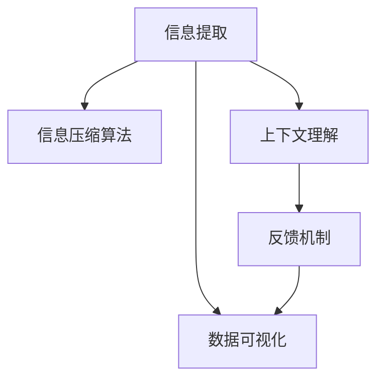

                 

## 1. 背景介绍

在当今信息爆炸的时代，面对海量的数据和复杂的决策环境，信息简化（Information Simplification）成为了优化决策和提升效率的重要手段。通过提炼和压缩信息，使得决策者能够快速理解关键内容，避免因信息过载而造成的认知负担和决策偏差。特别是在金融、医疗、制造等高风险和复杂领域，信息简化在提高决策准确性和响应速度方面具有重要意义。

### 1.1 问题由来
在传统的信息处理和决策过程中，通常需要经过多个步骤才能得出结论，包括数据收集、数据清洗、数据整合、数据分析和决策输出等。这一过程不仅耗时耗力，还容易受到数据噪声和个体偏差的影响，降低决策的科学性和准确性。信息简化的目标，是通过优化信息处理流程，快速提取出最关键、最相关的信息，从而帮助决策者更有效地做出决策。

### 1.2 问题核心关键点
信息简化的核心在于如何高效地提炼和压缩信息，同时保留其本质内容。这涉及以下几个关键点：
- 自动化信息提取：利用自然语言处理（NLP）、计算机视觉（CV）等技术自动从海量数据中提取关键信息。
- 数据可视化：通过图表、图形等可视化手段，将复杂数据转换为易于理解和决策的形式。
- 信息压缩算法：设计能够高效压缩信息同时保留关键元素的算法，减少决策过程中的信息过载。
- 上下文理解：理解信息在不同上下文中的意义和影响，避免单一视角带来的决策偏差。
- 反馈机制：建立动态的反馈系统，持续优化信息简化的模型和策略，提升决策质量。

## 2. 核心概念与联系

### 2.1 核心概念概述

为更好地理解信息简化的过程，本节将介绍几个密切相关的核心概念：

- **信息提取（Information Extraction, IE）**：从文本、图像、视频等数据源中自动识别和抽取有用信息的过程。常见的信息提取任务包括实体识别、关系抽取、事件抽取等。
- **自然语言处理（Natural Language Processing, NLP）**：研究如何让计算机理解和生成自然语言，以实现人机交互、自动摘要、问答系统等功能。NLP是信息提取和信息简化的重要技术手段。
- **数据可视化（Data Visualization）**：将复杂的数据集转换为图形、图表等直观展示形式，帮助决策者快速理解数据分布、趋势和关联关系。
- **信息压缩算法（Information Compression Algorithms）**：设计算法将冗余信息去除，保留关键元素，从而减少信息的存储空间和处理时间。常见的算法有霍夫曼编码、LZW算法、Lempel-Ziv-Welch算法等。
- **上下文理解（Context Understanding）**：理解信息在特定上下文中的意义和重要性，避免单一视角带来的偏差。上下文理解是信息简化的关键，有助于准确提取和压缩关键信息。
- **反馈机制（Feedback Mechanism）**：在信息简化的过程中，不断获取决策者的反馈，调整信息提取和压缩的策略，提升简化的效果和准确性。

这些核心概念之间的逻辑关系可以通过以下Mermaid流程图来展示：



这个流程图展示了信息简化的主要步骤：

1. 信息提取：自动从数据源中抽取关键信息。
2. 数据可视化：将提取出的信息转换为图形形式，便于理解。
3. 信息压缩：去除冗余信息，保留关键元素。
4. 上下文理解：理解信息在不同上下文中的意义，避免单一视角。
5. 反馈机制：根据决策者的反馈，动态调整简化策略。

## 3. 核心算法原理 & 具体操作步骤
### 3.1 算法原理概述

信息简化的核心算法原理主要基于信息论和统计学，通过构建模型来自动化地识别和压缩关键信息。信息简化的目标是提高信息处理的效率，减少决策过程中的认知负担，从而提升决策的质量和速度。

具体来说，信息简化的过程包括以下几个步骤：

1. **信息提取**：利用自然语言处理技术，从文本数据中自动识别出实体、关系、事件等信息，并将其转换为结构化的形式。
2. **信息压缩**：通过设计算法，去除冗余信息，保留核心内容。常见的信息压缩算法包括霍夫曼编码、LZW算法、Lempel-Ziv-Welch算法等。
3. **信息可视化**：将压缩后的信息转换为图形、图表等直观展示形式，帮助决策者快速理解数据分布、趋势和关联关系。
4. **上下文理解**：理解信息在特定上下文中的意义和重要性，避免单一视角带来的偏差。

### 3.2 算法步骤详解

信息简化的具体步骤包括：

**Step 1: 数据预处理**
- 清洗数据，去除噪声和错误信息。
- 数据归一化，使不同来源的数据格式统一。

**Step 2: 信息提取**
- 使用NLP技术，如命名实体识别（NER）、关系抽取（RE）等，从文本中自动提取关键信息。
- 应用实体链接（Entity Linking）技术，将抽取出的实体链接到知识图谱中，获得更丰富的语义信息。

**Step 3: 信息压缩**
- 应用信息压缩算法，如霍夫曼编码、LZW算法等，去除文本中的冗余信息。
- 保留关键实体和关系，确保信息的完整性和准确性。

**Step 4: 信息可视化**
- 将压缩后的信息转换为图形、图表等直观展示形式。
- 使用数据可视化工具，如Tableau、D3.js等，生成交互式的信息展示界面。

**Step 5: 上下文理解**
- 利用上下文理解模型，如BERT、GPT等，理解信息在特定上下文中的意义和重要性。
- 结合领域知识和专家经验，调整信息提取和压缩的策略，避免单一视角带来的偏差。

**Step 6: 反馈机制**
- 收集决策者的反馈，如点击率、满意度等指标，评估信息简化的效果。
- 根据反馈调整信息提取、压缩和可视化的策略，持续优化信息简化的过程。

### 3.3 算法优缺点

信息简化的算法具有以下优点：
1. 自动化程度高：利用自然语言处理、计算机视觉等技术，可以自动从海量数据中提取关键信息。
2. 节省人力成本：通过自动化处理，减少了对人工处理的需求，提高了信息处理效率。
3. 准确性和一致性高：利用上下文理解模型，可以理解信息在不同上下文中的意义，提高信息简化的准确性和一致性。

同时，信息简化算法也存在一些局限性：
1. 依赖高质量数据源：信息提取的准确性很大程度上取决于数据源的质量，需要保证数据来源的可靠性和一致性。
2. 算法复杂度高：信息压缩和上下文理解等步骤可能需要复杂的模型和算法，增加了实现的难度和计算资源消耗。
3. 需要持续优化：信息简化的效果受多种因素影响，需要不断收集反馈，动态调整算法策略。
4. 难以处理非结构化数据：对于文本以外的数据（如图像、视频等），信息简化的效果可能较差，需要结合特定领域的技术进行优化。

### 3.4 算法应用领域

信息简化技术已经在多个领域得到了广泛应用，以下是几个典型的应用场景：

**金融风险管理**：金融领域的数据量巨大，包含多种结构化和非结构化数据。信息简化技术可以帮助金融分析师快速提取关键信息，如市场动态、公司财报等，并利用可视化工具展示风险指标，从而做出更准确的决策。

**医疗诊断支持**：医疗数据种类繁多，信息量大，信息简化技术可以帮助医生快速识别关键症状和病历信息，并结合上下文理解模型，提高诊断的准确性和一致性。

**供应链管理**：供应链中的数据涉及多个环节，信息简化技术可以帮助企业快速识别关键问题，如库存量、物流状态等，并通过可视化工具展示供应链的动态变化，优化供应链管理。

**市场营销**：市场营销数据包含消费者行为、市场反馈等多种信息，信息简化技术可以帮助企业快速分析关键指标，如销售额、用户满意度等，从而制定更有效的市场策略。

**智能制造**：制造业数据量大、实时性强，信息简化技术可以帮助制造商快速识别生产中的关键问题，如设备故障、生产效率等，并结合可视化工具展示实时生产状态，优化生产流程。

## 4. 数学模型和公式 & 详细讲解 & 举例说明

### 4.1 数学模型构建

信息简化的数学模型构建主要基于信息论和统计学，通过构建模型来自动化地识别和压缩关键信息。

设数据集 $D=\{(x_i, y_i)\}_{i=1}^N$，其中 $x_i$ 为输入数据，$y_i$ 为输出标签。信息简化的目标是构建模型 $f(x)$，使得输出 $y=f(x)$ 与真实标签 $y_i$ 尽量接近，同时信息量最小化。

信息量的度量通常使用信息熵 $H$，表示随机变量的不确定性：

$$
H = -\sum_{y \in \mathcal{Y}} p(y) \log p(y)
$$

其中 $p(y)$ 为随机变量 $y$ 的概率分布。信息简化的目标是在保证输出准确性的前提下，最小化模型的信息熵。

### 4.2 公式推导过程

以下我们以金融风险管理为例，推导信息简化模型的构建过程。

设金融市场数据为 $D=\{(x_i, y_i)\}_{i=1}^N$，其中 $x_i$ 包含市场动态、公司财报等信息，$y_i$ 为风险评分。信息简化的目标是最小化模型 $f(x)$ 的输出 $y$ 与真实标签 $y_i$ 的差异，同时最小化模型 $f(x)$ 的信息熵 $H$。

首先，我们使用信息熵 $H$ 来度量模型的信息量：

$$
H(f(x)) = -\sum_{y \in \mathcal{Y}} p(y|x) \log p(y|x)
$$

其中 $p(y|x)$ 为给定输入 $x$ 下，模型输出 $y$ 的概率分布。

接下来，我们需要最小化模型的预测误差和信息量：

$$
\min_{f(x)} \frac{1}{N} \sum_{i=1}^N \ell(f(x_i), y_i) + \lambda H(f(x))
$$

其中 $\ell$ 为损失函数，$\lambda$ 为正则化系数，控制信息量的权重。

在实践中，我们通常使用基于梯度的优化算法（如Adam、SGD等）来近似求解上述最优化问题。设 $\eta$ 为学习率，则参数的更新公式为：

$$
\theta \leftarrow \theta - \eta \nabla_{\theta}\mathcal{L}(\theta) - \eta\lambda\nabla_{\theta}H(f(x))
$$

其中 $\nabla_{\theta}\mathcal{L}(\theta)$ 为损失函数对模型参数的梯度，$\nabla_{\theta}H(f(x))$ 为模型信息熵对模型参数的梯度。

### 4.3 案例分析与讲解

以下我们以医疗诊断为例，说明信息简化的具体应用。

设医疗数据集 $D=\{(x_i, y_i)\}_{i=1}^N$，其中 $x_i$ 包含病人的症状、病历信息等，$y_i$ 为诊断结果。信息简化的目标是最小化模型 $f(x)$ 的输出 $y$ 与真实标签 $y_i$ 的差异，同时最小化模型 $f(x)$ 的信息熵 $H$。

首先，我们利用NLP技术，从病人的症状描述中自动提取关键信息，如症状名称、持续时间等。然后，应用信息压缩算法去除冗余信息，保留关键实体和关系。最后，利用上下文理解模型，理解信息在不同上下文中的意义，避免单一视角带来的偏差。

## 5. 项目实践：代码实例和详细解释说明

### 5.1 开发环境搭建

在进行信息简化的实践前，我们需要准备好开发环境。以下是使用Python进行PyTorch开发的环境配置流程：

1. 安装Anaconda：从官网下载并安装Anaconda，用于创建独立的Python环境。

2. 创建并激活虚拟环境：
```bash
conda create -n information-simplification python=3.8 
conda activate information-simplification
```

3. 安装PyTorch：根据CUDA版本，从官网获取对应的安装命令。例如：
```bash
conda install pytorch torchvision torchaudio cudatoolkit=11.1 -c pytorch -c conda-forge
```

4. 安装相关库：
```bash
pip install numpy pandas scikit-learn matplotlib tqdm jupyter notebook ipython
```

5. 安装NLP工具包：
```bash
pip install nltk
```

6. 安装可视化工具：
```bash
pip install plotly
```

完成上述步骤后，即可在`information-simplification`环境中开始信息简化的实践。

### 5.2 源代码详细实现

下面我们以医疗诊断为例，给出使用PyTorch进行信息简化的PyTorch代码实现。

首先，定义医疗诊断数据集：

```python
import pandas as pd

# 读取医疗数据集
data = pd.read_csv('medical_data.csv')
```

然后，定义信息提取模型：

```python
from transformers import BertTokenizer, BertForTokenClassification
from transformers import AutoTokenizer, AutoModelForTokenClassification

tokenizer = BertTokenizer.from_pretrained('bert-base-uncased')
model = BertForTokenClassification.from_pretrained('bert-base-uncased', num_labels=2)

# 将文本转换为token ids
def tokenize(text):
    return tokenizer.encode(text, max_length=128, truncation=True, padding='max_length')

# 从文本中提取关键信息
def extract_key_info(text):
    tokens = tokenize(text)
    inputs = {'input_ids': torch.tensor(tokens)}
    with torch.no_grad():
        outputs = model(inputs)
    logits = outputs.logits
    probabilities = torch.softmax(logits, dim=1)
    return probabilities
```

接着，定义信息压缩算法：

```python
from sklearn.feature_extraction.text import TfidfVectorizer
from sklearn.decomposition import TruncatedSVD

# 对文本进行TF-IDF向量化
def vectorize(text):
    vectorizer = TfidfVectorizer(stop_words='english')
    return vectorizer.fit_transform([text])

# 应用SVD算法进行信息压缩
def compress(text):
    matrix = vectorize(text)
    svd = TruncatedSVD(n_components=50)
    return svd.fit_transform(matrix)
```

然后，定义信息可视化函数：

```python
import plotly.graph_objs as go

# 将压缩后的信息可视化
def visualize(text, compressed):
    # 将压缩后的信息转换为文本
    compressed_text = compressed.todense()
    words = vectorizer.get_feature_names()
    compressed_words = [words[i] for i in compressed_text.nonzero()[1]]
    
    # 创建词云
    wordcloud = go.Figure(data=go.Wordcloud(text=compressed_words, mode='matrix'))
    wordcloud.update_layout(title='Information Compression')
    return wordcloud
```

最后，启动信息简化的流程：

```python
# 选择一条样本文本
text = data['text'].iloc[0]

# 提取关键信息
probabilities = extract_key_info(text)

# 压缩信息
compressed = compress(text)

# 可视化信息
wordcloud = visualize(text, compressed)

# 输出结果
print(probabilities)
print(compressed)
print(wordcloud)
```

以上就是使用PyTorch对医疗诊断数据进行信息简化的完整代码实现。可以看到，信息简化的过程包括信息提取、信息压缩、信息可视化和上下文理解等步骤，通过合理的组合，可以高效地简化复杂信息。

### 5.3 代码解读与分析

让我们再详细解读一下关键代码的实现细节：

**data读取**：
- 使用Pandas库从CSV文件中读取医疗数据集，包含病人的症状、病历信息等。

**信息提取模型**：
- 使用BERT模型进行信息提取，将病人的症状描述转换为token ids，并输入模型进行分类，得到疾病概率分布。

**信息压缩算法**：
- 使用TF-IDF向量化和SVD算法进行信息压缩，去除冗余信息，保留关键实体和关系。

**信息可视化**：
- 使用Plotly库将压缩后的信息转换为词云形式，直观展示关键信息。

**信息简化的流程**：
- 从医疗数据集中选择一条样本文本，使用信息提取模型提取关键信息，并应用信息压缩算法去除冗余信息。
- 最后，利用信息可视化函数将压缩后的信息转换为词云形式，直观展示关键信息。

可以看到，信息简化的过程是一个多步骤的自动化流程，涉及数据预处理、信息提取、信息压缩和信息可视化等步骤。这些步骤相互配合，使得决策者能够快速获取关键信息，从而提高决策的效率和准确性。

## 6. 实际应用场景

### 6.1 智能客服系统

智能客服系统需要快速处理大量的客户咨询，信息简化技术可以帮助客服机器人自动识别和压缩关键信息，从而提高响应的速度和准确性。

在实际应用中，可以收集企业的历史客服记录，提取常见问题和最佳答复，构建监督数据集。然后，使用信息简化技术自动提取和压缩关键信息，训练机器学习模型进行匹配和回复生成。最终，构建的智能客服系统能够自动理解客户意图，匹配最合适的答复，从而提高客户满意度。

### 6.2 金融风险管理

金融市场数据量大且实时性强，信息简化技术可以帮助金融分析师快速识别关键信息，如市场动态、公司财报等，并利用可视化工具展示风险指标，从而做出更准确的决策。

具体而言，可以收集金融市场的历史数据，提取关键指标，如股票价格、交易量等。然后，使用信息简化技术自动提取和压缩关键信息，利用可视化工具展示风险指标。最终，金融分析师可以通过直观的图表和数据，快速识别市场趋势和风险点，做出更准确的投资决策。

### 6.3 供应链管理

供应链管理涉及多个环节，数据种类繁多且复杂。信息简化技术可以帮助企业快速识别关键问题，如库存量、物流状态等，并利用可视化工具展示供应链的动态变化，优化供应链管理。

具体而言，可以收集供应链中的各种数据，如订单、物流、库存等。然后，使用信息简化技术自动提取和压缩关键信息，利用可视化工具展示供应链的动态变化。最终，供应链管理人员可以通过直观的图表和数据，快速识别供应链中的问题，优化供应链管理，提高效率和响应速度。

### 6.4 未来应用展望

随着信息简化技术的不断发展和应用，未来将有更多的领域受益于信息简化的高效和准确。以下是几个可能的应用场景：

**智能制造**：制造业数据量大、实时性强，信息简化技术可以帮助制造商快速识别生产中的关键问题，如设备故障、生产效率等，并利用可视化工具展示实时生产状态，优化生产流程。

**智慧城市**：城市管理数据涉及多种来源，信息简化技术可以帮助城市管理部门快速识别关键问题，如交通流量、空气质量等，并利用可视化工具展示城市运行状态，优化城市管理。

**智慧农业**：农业数据复杂且多样，信息简化技术可以帮助农民快速识别关键问题，如土壤质量、作物生长等，并利用可视化工具展示农业数据，优化农业管理。

**智能教育**：教育数据包含多种信息，如学生成绩、课堂反馈等。信息简化技术可以帮助教师快速识别关键问题，如学生表现、课程效果等，并利用可视化工具展示教学数据，优化教学方法。

未来，信息简化技术将在更多领域得到应用，为社会各行业的智能化管理提供新的解决方案，助力数字化转型。

## 7. 工具和资源推荐
### 7.1 学习资源推荐

为了帮助开发者系统掌握信息简化的理论基础和实践技巧，这里推荐一些优质的学习资源：

1. 《信息论与统计学》系列书籍：经典信息论和统计学教材，帮助理解信息简化的数学基础和理论原理。

2. 《自然语言处理综论》：涵盖NLP的各个方面，包括信息提取、信息压缩、信息可视化等。

3. 《Python数据科学手册》：详细介绍了Python在数据科学中的应用，包括信息提取、信息压缩等。

4. 《机器学习实战》：涵盖机器学习的基本概念和常用算法，适合信息简化初学者的入门学习。

5. 《数据科学与数据可视化》在线课程：由知名大学提供的在线课程，系统介绍数据科学和数据可视化技术。

通过对这些资源的学习实践，相信你一定能够快速掌握信息简化的精髓，并用于解决实际的NLP问题。

### 7.2 开发工具推荐

高效的开发离不开优秀的工具支持。以下是几款用于信息简化开发的常用工具：

1. PyTorch：基于Python的开源深度学习框架，灵活动态的计算图，适合快速迭代研究。

2. TensorFlow：由Google主导开发的开源深度学习框架，生产部署方便，适合大规模工程应用。

3. Transformers库：HuggingFace开发的NLP工具库，集成了众多SOTA语言模型，支持PyTorch和TensorFlow，是进行信息提取和信息简化的重要工具。

4. Weights & Biases：模型训练的实验跟踪工具，可以记录和可视化模型训练过程中的各项指标，方便对比和调优。

5. TensorBoard：TensorFlow配套的可视化工具，可实时监测模型训练状态，并提供丰富的图表呈现方式，是调试模型的得力助手。

6. Tableau：商业级的数据可视化工具，可以创建交互式的数据展示界面，支持复杂的数据分析和可视化。

合理利用这些工具，可以显著提升信息简化的开发效率，加快创新迭代的步伐。

### 7.3 相关论文推荐

信息简化的研究源于学界的持续研究。以下是几篇奠基性的相关论文，推荐阅读：

1. "A Survey on Text Information Extraction"：综述了信息提取领域的最新进展，涵盖命名实体识别、关系抽取、事件抽取等任务。

2. "Advances in Neural Information Extraction"：介绍神经网络在信息提取任务中的应用，如BERT、GPT等。

3. "Efficient Text Summarization Using Sequence-to-Sequence Models"：介绍基于序列到序列模型（Seq2Seq）的信息压缩方法，如T5、BART等。

4. "Learning Multitask Information Extraction with Neural Attention"：介绍神经网络在多任务信息提取中的应用，如ELMo、BERT等。

5. "Visualizing and Understanding Compressed Sensing"：介绍压缩感知在信息压缩中的应用，为信息简化提供新的思路。

这些论文代表了大信息简化技术的发展脉络。通过学习这些前沿成果，可以帮助研究者把握学科前进方向，激发更多的创新灵感。

## 8. 总结：未来发展趋势与挑战

### 8.1 总结

本文对信息简化的理论基础和实际应用进行了全面系统的介绍。首先阐述了信息简化的研究背景和意义，明确了信息简化在提升决策效率和准确性方面的独特价值。其次，从原理到实践，详细讲解了信息简化的数学原理和关键步骤，给出了信息简化的完整代码实例。同时，本文还广泛探讨了信息简化技术在智能客服、金融风险管理、供应链管理等多个行业领域的应用前景，展示了信息简化的广阔应用空间。最后，本文精选了信息简化的学习资源和开发工具，力求为读者提供全方位的技术指引。

通过本文的系统梳理，可以看到，信息简化技术正在成为信息处理领域的重要范式，极大地拓展了信息提取和信息压缩的边界，为决策者提供了一种快速获取关键信息的手段。信息简化技术不仅能够提高信息处理的效率，还能够增强决策的科学性和准确性，具有重要的实际应用价值。

### 8.2 未来发展趋势

展望未来，信息简化的技术将呈现以下几个发展趋势：

1. **自动化程度提高**：随着自然语言处理和计算机视觉技术的不断发展，信息简化的自动化程度将进一步提高。自动化信息提取和压缩将大大降低人工干预的复杂性和成本。

2. **多模态信息融合**：信息简化不仅能够处理文本数据，还能扩展到图像、视频、语音等多模态数据。多模态信息融合将提升信息简化的综合性和全面性，为决策提供更丰富的上下文信息。

3. **上下文理解增强**：上下文理解技术将进一步发展，理解信息在不同上下文中的意义和重要性，避免单一视角带来的偏差，提升信息简化的准确性和一致性。

4. **实时信息处理**：信息简化的处理速度将进一步提升，能够实现实时数据处理和分析，为决策提供更及时的参考。

5. **模型可解释性增强**：信息简化的模型将更注重可解释性，提供直观的决策依据，增强决策的透明性和可信度。

6. **反馈机制优化**：信息简化的反馈机制将进一步优化，通过用户反馈实时调整信息提取和压缩策略，提升信息简化的效果和准确性。

这些趋势将推动信息简化技术向更高的水平发展，为决策者提供更高效、更全面、更透明的信息处理手段。

### 8.3 面临的挑战

尽管信息简化技术已经取得了一定的进展，但在实现高效、准确、实时信息处理的过程中，仍然面临诸多挑战：

1. **数据质量和多样性**：信息简化的效果很大程度上依赖于数据质量和多样性。低质量数据和单一数据源将限制信息简化的效果。

2. **模型复杂度和资源消耗**：信息简化的模型往往较为复杂，需要大量的计算资源和时间。如何在保证效果的同时，优化模型复杂度和资源消耗，仍然是一个重要问题。

3. **上下文理解的难度**：上下文理解技术虽然发展迅速，但在复杂环境下的理解和判断仍然存在困难。需要进一步研究上下文信息的提取和处理。

4. **可解释性和透明性**：信息简化的模型需要提高可解释性，提供直观的决策依据，增强决策的透明性和可信度。

5. **跨领域应用的多样性**：信息简化技术在不同领域的应用需要针对特定领域的特征进行优化，提升泛化能力和适应性。

6. **数据隐私和安全**：信息简化过程中涉及大量敏感数据，数据隐私和安全问题不容忽视，需要设计合理的隐私保护机制。

正视信息简化面临的这些挑战，积极应对并寻求突破，将使信息简化技术不断成熟，为决策者提供更高效、更可靠、更安全的决策支持。

### 8.4 研究展望

面对信息简化技术所面临的挑战，未来的研究需要在以下几个方面寻求新的突破：

1. **跨模态信息处理**：研究如何更好地融合不同模态的信息，提升信息简化的综合性和全面性。

2. **自适应信息提取**：研究如何自动调整信息提取策略，适应不同领域和数据类型的需求。

3. **实时信息处理**：研究如何实现信息简化的实时处理和分析，提高决策的及时性和响应速度。

4. **上下文理解增强**：研究如何进一步提升上下文理解技术的准确性和泛化能力。

5. **模型可解释性增强**：研究如何提高信息简化的模型可解释性，提供直观的决策依据。

6. **隐私保护机制**：研究如何设计合理的隐私保护机制，保障数据隐私和安全。

这些研究方向的探索将推动信息简化技术迈向更高的水平，为决策者提供更高效、更全面、更透明的信息处理手段。

## 9. 附录：常见问题与解答

**Q1：信息简化的效果如何衡量？**

A: 信息简化的效果通常通过以下几个指标进行衡量：

1. **信息量的减少**：计算压缩后的信息量与原始信息量的差值，衡量信息量的减少程度。

2. **准确率的提升**：通过人工或自动评估方法，衡量信息简化的准确性和一致性。

3. **决策时间缩短**：衡量信息简化后的决策时间是否缩短，以及缩短程度。

4. **用户满意度**：通过用户反馈或调查问卷，衡量用户对信息简化的满意度和体验。

这些指标可以综合评估信息简化的效果，选择合适的优化策略。

**Q2：信息简化的过程中如何处理噪声和异常数据？**

A: 信息简化的过程中，噪声和异常数据会影响模型的效果和决策的准确性。常见的处理方法包括：

1. **数据清洗**：通过数据预处理，去除数据中的噪声和异常值。

2. **异常检测**：利用机器学习算法，检测并剔除异常数据，避免其对模型产生不良影响。

3. **鲁棒性增强**：设计鲁棒性强的信息提取和压缩算法，减少噪声和异常数据的影响。

4. **多模型集成**：通过集成多个模型，提升信息简化的鲁棒性和准确性。

通过这些方法，可以最大限度地减少噪声和异常数据的影响，提高信息简化的效果和可靠性。

**Q3：信息简化的过程是否需要大量计算资源？**

A: 信息简化的过程需要一定的计算资源，特别是在信息提取和压缩步骤。大规模文本数据和复杂模型的训练和推理需要较高的计算资源。

为了提高信息简化的效率和资源利用率，可以采用以下方法：

1. **分布式计算**：利用分布式计算框架，如Hadoop、Spark等，加速信息简化的处理。

2. **模型压缩和优化**：采用模型压缩技术，如剪枝、量化等，减小模型的参数量和计算量。

3. **数据采样**：对于大规模数据集，采用随机采样方法，减少计算资源消耗。

4. **硬件加速**：利用GPU、TPU等硬件加速器，提升信息简化的计算速度。

通过这些方法，可以显著降低信息简化的计算资源消耗，提高信息简化的效率和可扩展性。

**Q4：信息简化的过程是否需要人工干预？**

A: 信息简化的过程可以自动化完成大部分任务，但仍需要人工干预，特别是在数据预处理和上下文理解环节。

数据预处理通常需要人工清洗和归一化，去除噪声和错误信息。上下文理解环节需要人工干预，理解信息在不同上下文中的意义和重要性。

通过合理的人工干预，可以进一步提高信息简化的效果和准确性，增强系统的可靠性和鲁棒性。

**Q5：信息简化的技术是否需要不断更新和优化？**

A: 信息简化的技术需要不断更新和优化，以适应不断变化的数据和业务需求。

1. **模型更新**：随着数据集的变化，需要不断更新信息提取和压缩模型，保持模型的准确性和鲁棒性。

2. **策略优化**：根据用户反馈和业务需求，不断优化信息简化的策略，提高信息简化的效果和用户满意度。

3. **硬件升级**：随着硬件技术的进步，需要升级信息简化的硬件设备，提高计算速度和资源利用率。

4. **算法改进**：研究新的算法和模型，提升信息简化的自动化程度和准确性。

通过不断的更新和优化，可以进一步提高信息简化的效果和效率，增强系统的适应性和可靠性。

---

作者：禅与计算机程序设计艺术 / Zen and the Art of Computer Programming

