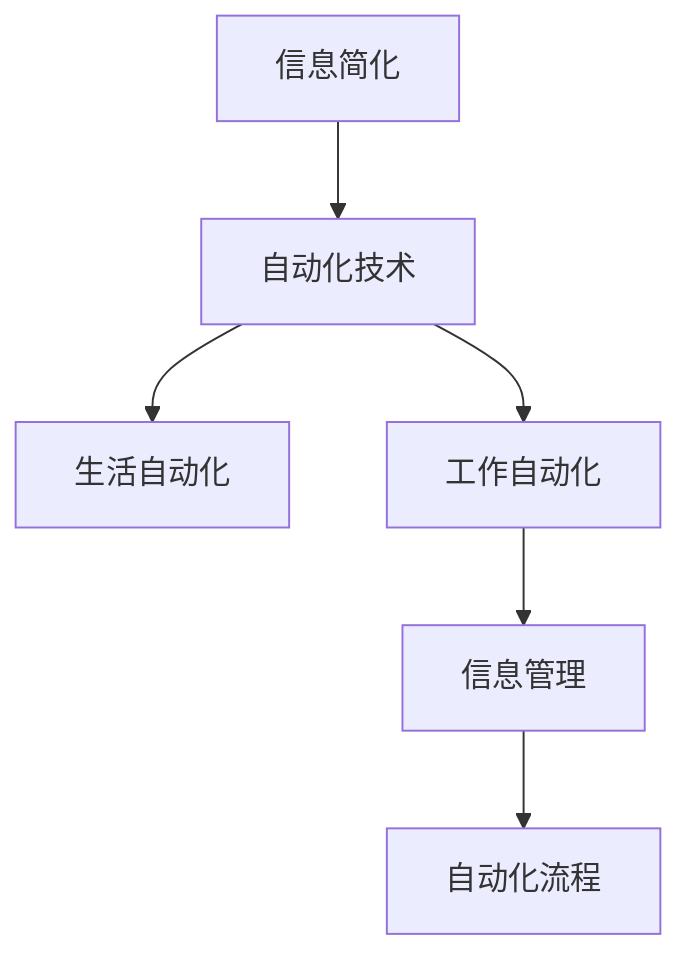

                 

# 信息简化的工具和自动化技术：利用技术简化你的生活和工作

> 关键词：信息简化, 自动化技术, 生活自动化, 工作自动化, 信息管理, 自动化流程, 智能家居, 企业自动化, 技术简化

## 1. 背景介绍

在信息爆炸的时代，无论是个人生活还是企业运营，都面临着海量信息的处理和管理的挑战。如何高效管理信息，自动化日常任务，成为了现代人的迫切需求。信息简化和自动化技术，正是在这样的背景下应运而生，旨在通过技术手段，降低信息处理的复杂性，提升生活和工作效率，让人们从繁重的信息管理中解脱出来。

### 1.1 信息爆炸的挑战

随着互联网的普及和技术的进步，人们可以随时随地获取到海量的信息。这虽然带来了便利，但也导致了信息过载的问题。个人生活中，我们需要处理和筛选来自社交媒体、邮件、新闻网站等渠道的信息，消耗大量时间和精力。企业运营中，数据量大、结构复杂，对决策和运营的支持提出了更高的要求。在这样的背景下，信息简化和自动化技术应运而生，旨在通过技术手段，降低信息处理的复杂性，提升生活和工作效率。

### 1.2 信息简化的意义

信息简化技术的核心在于通过智能算法和机器学习，自动处理和筛选信息，提取关键内容，减少噪音干扰，帮助用户快速获得有用信息。这不仅能够提升个人的生活质量，还能为企业运营提供更有价值的数据支持，推动决策科学化和效率提升。

## 2. 核心概念与联系

### 2.1 核心概念概述

本节将介绍几个与信息简化和自动化技术密切相关的核心概念：

- **信息简化**：通过自动化和智能算法，对海量信息进行筛选、分类和总结，提取关键内容，减少噪音干扰，帮助用户快速获得有用信息。
- **自动化技术**：利用软件和硬件技术，自动执行重复性高、规则明确的日常任务，减轻人力负担，提升效率。
- **生活自动化**：通过智能化家居、智能穿戴设备等，实现家庭日常任务的自动化，提升生活品质。
- **工作自动化**：利用机器人和自动化流程，实现企业运营和生产任务的自动化，提高运营效率和质量。
- **信息管理**：对各类信息资源进行收集、存储、管理和利用，为决策提供数据支持。
- **自动化流程**：将业务流程自动化，减少人工干预，提升业务流程的效率和质量。

这些核心概念之间的逻辑关系可以通过以下Mermaid流程图来展示：



这个流程图展示了大规模信息处理和自动化技术的关系：

1. 信息简化是对信息进行自动化的关键前提。
2. 自动化技术在生活和工作中的应用，能够提升效率和质量。
3. 信息管理为自动化流程提供数据支持，自动化流程又进一步提升了信息管理的效率和质量。

## 3. 核心算法原理 & 具体操作步骤

### 3.1 算法原理概述

信息简化和自动化技术的核心算法包括自然语言处理(NLP)、计算机视觉(CV)、机器学习、深度学习等。这些算法通过学习和理解用户需求和数据特性，自动化地完成信息筛选、分类、分析和决策。

以信息简化的核心算法之一——自然语言处理为例，其基本流程包括：

1. **文本预处理**：去除停用词、分词、词性标注等。
2. **特征提取**：通过TF-IDF、词嵌入等方法，将文本转换为向量形式。
3. **文本分类**：使用分类算法如朴素贝叶斯、支持向量机等，对文本进行分类。
4. **情感分析**：通过情感词典、情感分类器等，分析文本的情感倾向。
5. **信息摘要**：使用文本摘要算法如TextRank、LSTM等，提取文本的关键信息。

自动化技术则包括机器人流程自动化(RPA)、智能家居、智能穿戴设备等，通过软件和硬件的协同工作，实现任务的自动化执行。

### 3.2 算法步骤详解

以信息简化中的文本分类为例，其操作步骤如下：

**Step 1: 数据收集**
- 从不同的数据源（如新闻网站、社交媒体等）收集文本数据。

**Step 2: 数据预处理**
- 对收集到的文本数据进行预处理，包括去除噪音、分词、词性标注等。

**Step 3: 特征提取**
- 使用TF-IDF、词嵌入等方法，将文本转换为向量形式。

**Step 4: 模型训练**
- 选择适合的分类算法，如朴素贝叶斯、支持向量机等，训练模型。
- 使用交叉验证等技术评估模型性能，调整参数。

**Step 5: 模型应用**
- 将训练好的模型应用于新的文本数据，进行分类。

**Step 6: 结果分析**
- 分析分类结果，提取关键信息，生成报告或摘要。

### 3.3 算法优缺点

信息简化和自动化技术具有以下优点：
1. 提升效率。自动化技术能够快速处理大量重复性高、规则明确的日常任务，提升效率和质量。
2. 降低成本。通过减少人工干预，降低人力成本和错误率。
3. 提高准确性。利用智能算法进行信息处理和分析，提高信息的准确性和可靠性。

同时，这些技术也存在一定的局限性：
1. 依赖数据质量。自动化和信息简化的效果很大程度上取决于数据的质量和标注。
2. 技术门槛高。需要具备一定的技术背景和知识储备，才能有效使用和维护这些技术。
3. 技术复杂度。复杂算法和模型的训练和调优，需要耗费大量时间和资源。
4. 安全性问题。自动化和信息简化的过程可能涉及敏感数据，存在隐私和安全风险。

尽管存在这些局限性，但就目前而言，信息简化和自动化技术仍然是大势所趋，具有广泛的应用前景。

### 3.4 算法应用领域

信息简化和自动化技术已经在诸多领域得到了广泛应用：

- **个人生活**：智能家居、智能穿戴设备、智能助理等，通过自动化技术提升生活便利性。
- **企业管理**：企业资源管理(ERP)、客户关系管理(CRM)、自动化流程管理等，通过自动化技术提升运营效率。
- **医疗健康**：电子病历管理、智能诊断、远程医疗等，通过信息简化技术提升医疗服务质量。
- **金融服务**：智能投顾、自动化交易、客户服务自动化等，通过自动化技术提升金融服务效率。
- **教育培训**：在线学习平台、智能评估系统等，通过信息简化技术提升教学效果。

除了上述这些经典领域外，信息简化和自动化技术还在物流、交通、能源管理等诸多领域展现出广阔的应用前景，为各行各业带来了全新的变革。

## 4. 数学模型和公式 & 详细讲解 & 举例说明

### 4.1 数学模型构建

本节将使用数学语言对信息简化的核心算法进行更加严格的刻画。

以文本分类为例，假设我们有一组训练数据集 $\{(x_i, y_i)\}_{i=1}^N$，其中 $x_i$ 为文本样本， $y_i$ 为文本对应的类别标签。我们希望训练一个分类器 $f(x)$，将新文本样本 $x$ 分类到正确的类别 $y$。

设文本分类器的损失函数为 $\mathcal{L}(f)$，其中 $\mathcal{L}(f)$ 为分类器在测试集上的平均损失。常用的损失函数包括交叉熵损失、均方误差损失等。

定义分类器的参数为 $\theta$，训练的目标是最小化损失函数，即找到最优参数：

$$
\theta^* = \mathop{\arg\min}_{\theta} \mathcal{L}(f_\theta)
$$

在实践中，我们通常使用基于梯度的优化算法（如SGD、Adam等）来近似求解上述最优化问题。设 $\eta$ 为学习率，则参数的更新公式为：

$$
\theta \leftarrow \theta - \eta \nabla_{\theta}\mathcal{L}(f_\theta)
$$

其中 $\nabla_{\theta}\mathcal{L}(f_\theta)$ 为损失函数对参数 $\theta$ 的梯度，可通过反向传播算法高效计算。

### 4.2 公式推导过程

以下我们以朴素贝叶斯分类器为例，推导其文本分类的公式及其梯度的计算。

朴素贝叶斯分类器假设文本中每个词的分布是独立的，即：

$$
P(x_i|y_i) = \prod_{j=1}^n P(x_{ij}|y_i)
$$

其中 $n$ 为词的个数，$x_{ij}$ 表示文本 $x_i$ 中第 $j$ 个词。

根据贝叶斯定理，文本分类器的概率公式为：

$$
P(y_i|x_i) = \frac{P(x_i|y_i)P(y_i)}{P(x_i)}
$$

其中 $P(y_i)$ 为先验概率，$P(x_i)$ 为文本的概率，可通过经验频率得到。

假设我们有以下参数：
- $P(y_i)$：先验概率
- $P(x_{ij}|y_i)$：在类别 $y_i$ 下，词 $j$ 的条件概率

则朴素贝叶斯分类器的输出为：

$$
f(x_i) = \arg\max_{y_i} P(y_i|x_i)
$$

在得到分类器的输出后，可通过交叉熵损失函数计算损失：

$$
\mathcal{L}(f_\theta) = -\frac{1}{N}\sum_{i=1}^N \sum_{y_i} y_i\log f(x_i)
$$

将 $f(x_i)$ 带入损失函数，得到：

$$
\mathcal{L}(f_\theta) = -\frac{1}{N}\sum_{i=1}^N \sum_{y_i} y_i\log \frac{P(x_i|y_i)P(y_i)}{P(x_i)}
$$

根据链式法则，损失函数对参数 $\theta$ 的梯度为：

$$
\frac{\partial \mathcal{L}(f_\theta)}{\partial \theta} = \frac{1}{N}\sum_{i=1}^N \sum_{y_i} (y_i - P(y_i|x_i)) \nabla_{\theta} P(y_i|x_i)
$$

其中 $\nabla_{\theta} P(y_i|x_i)$ 为条件概率 $P(y_i|x_i)$ 对参数 $\theta$ 的梯度。

在得到损失函数的梯度后，即可带入参数更新公式，完成模型的迭代优化。重复上述过程直至收敛，最终得到适应文本分类任务的最优模型参数 $\theta^*$。

### 4.3 案例分析与讲解

以智能家居为例，分析信息简化和自动化技术的应用。

假设我们要实现智能家居的自动化控制。首先，我们需要收集各种传感器数据，包括温度、湿度、门窗状态等。然后，通过信息简化技术，对数据进行预处理和分析，提取关键信息。例如，通过时间序列分析，预测未来的天气变化，从而调整空调和窗户的开闭。最后，将分析结果输入到自动化控制系统，自动调整家中的温度和湿度，确保舒适性。

在实践中，我们可以使用机器学习算法对传感器数据进行建模，预测未来天气变化。例如，使用线性回归、决策树、随机森林等算法，训练模型预测温度和湿度变化。同时，我们可以使用智能家居系统，根据预测结果自动调整空调和窗户的开闭，实现智能家居的自动化控制。

## 5. 项目实践：代码实例和详细解释说明

### 5.1 开发环境搭建

在进行信息简化和自动化技术实践前，我们需要准备好开发环境。以下是使用Python进行PyTorch开发的环境配置流程：

1. 安装Anaconda：从官网下载并安装Anaconda，用于创建独立的Python环境。

2. 创建并激活虚拟环境：
```bash
conda create -n pytorch-env python=3.8 
conda activate pytorch-env
```

3. 安装PyTorch：根据CUDA版本，从官网获取对应的安装命令。例如：
```bash
conda install pytorch torchvision torchaudio cudatoolkit=11.1 -c pytorch -c conda-forge
```

4. 安装TensorFlow：
```bash
pip install tensorflow
```

5. 安装各类工具包：
```bash
pip install numpy pandas scikit-learn matplotlib tqdm jupyter notebook ipython
```

完成上述步骤后，即可在`pytorch-env`环境中开始信息简化和自动化技术的实践。

### 5.2 源代码详细实现

这里我们以文本分类为例，给出使用PyTorch进行朴素贝叶斯分类的PyTorch代码实现。

首先，定义文本分类的数据处理函数：

```python
from sklearn.feature_extraction.text import CountVectorizer
from sklearn.model_selection import train_test_split
import numpy as np
import torch
from torch import nn, optim

def prepare_data(texts, labels, max_words=1000):
    # 将文本转化为词向量
    vectorizer = CountVectorizer(max_features=max_words)
    X = vectorizer.fit_transform(texts)
    
    # 将标签转化为one-hot编码
    Y = np.zeros((len(texts), len(set(labels)))
    for i, label in enumerate(labels):
        Y[i][label] = 1
    
    # 划分训练集和测试集
    X_train, X_test, y_train, y_test = train_test_split(X.toarray(), Y, test_size=0.2, random_state=42)
    
    # 转换为PyTorch张量
    X_train = torch.from_numpy(X_train).float()
    X_test = torch.from_numpy(X_test).float()
    y_train = torch.from_numpy(y_train).long()
    y_test = torch.from_numpy(y_test).long()
    
    return X_train, X_test, y_train, y_test
```

然后，定义朴素贝叶斯分类器模型：

```python
class NaiveBayes(nn.Module):
    def __init__(self, vocab_size, output_size):
        super(NaiveBayes, self).__init__()
        self.vocab_size = vocab_size
        self.output_size = output_size
        self.fc = nn.Linear(vocab_size, output_size)
        
    def forward(self, x):
        logits = self.fc(x)
        return logits
```

接着，定义训练和评估函数：

```python
def train(model, optimizer, loss_fn, X_train, y_train, X_test, y_test, num_epochs=10, batch_size=32):
    device = torch.device('cuda' if torch.cuda.is_available() else 'cpu')
    model.to(device)
    
    for epoch in range(num_epochs):
        model.train()
        running_loss = 0.0
        for i, (X, y) in enumerate(zip(X_train, y_train), 0):
            X = X.to(device)
            y = y.to(device)
            
            optimizer.zero_grad()
            output = model(X)
            loss = loss_fn(output, y)
            loss.backward()
            optimizer.step()
            
            running_loss += loss.item()
            
            if i % 200 == 199:
                print(f'Epoch {epoch+1}, Step {i+1}, Loss: {running_loss/200:.4f}')
                running_loss = 0.0
    
    print(f'Epoch {num_epochs}, Loss: {running_loss/200:.4f}')
    
    print(f'Test Accuracy: {accuracy(model, X_test, y_test):.4f}')
    
def evaluate(model, X_test, y_test):
    model.eval()
    correct = 0
    with torch.no_grad():
        for X, y in zip(X_test, y_test):
            X = X.to(device)
            y = y.to(device)
            output = model(X)
            _, predicted = torch.max(output, 1)
            correct += (predicted == y).sum().item()
    
    total = y_test.size(0)
    accuracy = correct / total
    print(f'Accuracy: {accuracy:.4f}')
    
def accuracy(model, X, y):
    model.eval()
    correct = 0
    with torch.no_grad():
        for X, y in zip(X, y):
            X = X.to(device)
            y = y.to(device)
            output = model(X)
            _, predicted = torch.max(output, 1)
            correct += (predicted == y).sum().item()
    
    total = y.size(0)
    accuracy = correct / total
    return accuracy
```

最后，启动训练流程并在测试集上评估：

```python
X_train, X_test, y_train, y_test = prepare_data(train_texts, train_labels, max_words=1000)

model = NaiveBayes(vocab_size=1000, output_size=len(set(train_labels)))
optimizer = optim.SGD(model.parameters(), lr=0.01)
loss_fn = nn.CrossEntropyLoss()

train(model, optimizer, loss_fn, X_train, y_train, X_test, y_test)

evaluate(model, X_test, y_test)
```

以上就是使用PyTorch进行朴素贝叶斯文本分类的完整代码实现。可以看到，得益于PyTorch的强大封装，我们可以用相对简洁的代码完成朴素贝叶斯分类器的训练和评估。

### 5.3 代码解读与分析

让我们再详细解读一下关键代码的实现细节：

**prepare_data函数**：
- 将文本转化为词向量。
- 将标签转化为one-hot编码。
- 划分训练集和测试集。
- 将数据转化为PyTorch张量。

**NaiveBayes模型**：
- 定义朴素贝叶斯分类器的输入和输出。
- 定义线性层。

**train函数**：
- 在训练过程中，每次迭代计算损失，更新模型参数。
- 定期输出训练损失。

**evaluate函数**：
- 在测试集上评估模型性能，计算准确率。

**accuracy函数**：
- 计算模型在测试集上的准确率。

**训练流程**：
- 定义训练轮数和批量大小。
- 在训练集上训练模型。
- 在测试集上评估模型性能。

可以看到，PyTorch配合sklearn等工具，使得朴素贝叶斯分类的代码实现变得简洁高效。开发者可以将更多精力放在模型改进和应用场景的优化上，而不必过多关注底层的实现细节。

当然，工业级的系统实现还需考虑更多因素，如模型的保存和部署、超参数的自动搜索、更灵活的任务适配层等。但核心的信息简化和自动化技术的范式基本与此类似。

## 6. 实际应用场景

### 6.1 智能家居

智能家居系统通过自动化技术，实现了家庭日常任务的自动化，极大地提升了生活便利性。例如，通过传感器数据监测，智能家居系统可以自动调节家中的温度和湿度，确保舒适性。智能窗帘和智能灯泡可以根据用户的生活习惯自动开关，节能环保。智能家电还可以通过语音助手实现语音控制，提供更加便捷的用户体验。

### 6.2 企业管理

企业资源管理(ERP)系统通过自动化流程，实现了企业运营的全面管理。ERP系统可以自动处理订单、库存、财务等业务，提升运营效率。客户关系管理(CRM)系统通过自动化客户管理，提升了客户满意度和忠诚度。自动化流程管理系统则通过优化业务流程，减少了人工干预，提高了流程效率和质量。

### 6.3 医疗健康

电子病历管理通过信息简化技术，提升了医疗服务的效率和质量。智能诊断系统通过自动化分析，快速诊断疾病，提高医疗服务水平。远程医疗系统通过信息传输和分析，为偏远地区的患者提供医疗服务，缩小了医疗资源的不均衡。

### 6.4 金融服务

智能投顾通过自动化投资建议，提升了投资决策的效率和质量。自动化交易系统通过算法交易，提高了交易的精准性和响应速度。客户服务自动化系统通过自然语言处理，自动回答客户咨询，提升了客户满意度。

### 6.5 教育培训

在线学习平台通过信息简化技术，提升了教学效果。智能评估系统通过自动化评估，快速反馈学习成果，指导学生学习。智能推荐系统通过分析学生的学习行为，个性化推荐学习资源，提高学习效果。

除了上述这些经典领域外，信息简化和自动化技术还在物流、交通、能源管理等诸多领域展现出广阔的应用前景，为各行各业带来了全新的变革。

## 7. 工具和资源推荐

### 7.1 学习资源推荐

为了帮助开发者系统掌握信息简化和自动化技术的基础知识和实践技巧，这里推荐一些优质的学习资源：

1. 《Python数据科学手册》系列书籍：全面介绍了Python在数据科学中的应用，包括数据预处理、特征工程、模型训练等。

2. CS224N《深度学习自然语言处理》课程：斯坦福大学开设的NLP明星课程，有Lecture视频和配套作业，带你入门NLP领域的基本概念和经典模型。

3. 《TensorFlow实战Google深度学习框架》书籍：详细介绍了TensorFlow的使用，包括张量、变量、优化器等核心概念。

4. Udacity《Python for Data Science》课程：从Python基础到数据科学实战，适合初学者入门。

5. Coursera《机器学习》课程：由斯坦福大学教授Andrew Ng主讲，系统介绍了机器学习的基础知识和算法。

通过对这些资源的学习实践，相信你一定能够快速掌握信息简化和自动化技术的精髓，并用于解决实际的NLP问题。

### 7.2 开发工具推荐

高效的开发离不开优秀的工具支持。以下是几款用于信息简化和自动化技术开发的常用工具：

1. PyTorch：基于Python的开源深度学习框架，灵活动态的计算图，适合快速迭代研究。

2. TensorFlow：由Google主导开发的开源深度学习框架，生产部署方便，适合大规模工程应用。

3. Transformers库：HuggingFace开发的NLP工具库，集成了众多SOTA语言模型，支持PyTorch和TensorFlow，是进行信息简化和自动化技术开发的利器。

4. Weights & Biases：模型训练的实验跟踪工具，可以记录和可视化模型训练过程中的各项指标，方便对比和调优。与主流深度学习框架无缝集成。

5. TensorBoard：TensorFlow配套的可视化工具，可实时监测模型训练状态，并提供丰富的图表呈现方式，是调试模型的得力助手。

6. Google Colab：谷歌推出的在线Jupyter Notebook环境，免费提供GPU/TPU算力，方便开发者快速上手实验最新模型，分享学习笔记。

合理利用这些工具，可以显著提升信息简化和自动化技术的开发效率，加快创新迭代的步伐。

### 7.3 相关论文推荐

信息简化和自动化技术的发展源于学界的持续研究。以下是几篇奠基性的相关论文，推荐阅读：

1. "A Survey of Automated Information Retrieval and Information Extraction Systems"：对自动化信息处理系统进行了全面的综述。

2. "TextRank: Bringing Order into Texts"：提出了TextRank算法，用于文本摘要和信息提取。

3. "Introduction to Statistical Natural Language Processing"：介绍了统计自然语言处理的基础知识和常用算法。

4. "Reinforcement Learning for Resource Allocation in Robot Manipulation"：介绍了强化学习在机器人操作中的应用。

5. "Speech Processing with Deep Learning"：介绍了深度学习在语音处理中的应用。

6. "Deep Learning for Healthcare"：介绍了深度学习在医疗健康中的应用。

这些论文代表了大规模信息处理和自动化技术的发展脉络。通过学习这些前沿成果，可以帮助研究者把握学科前进方向，激发更多的创新灵感。

## 8. 总结：未来发展趋势与挑战

### 8.1 总结

本文对信息简化和自动化技术的核心算法和操作步骤进行了全面系统的介绍。首先阐述了信息简化和自动化技术的研究背景和意义，明确了信息简化和自动化技术的核心思想和实现方式。其次，从原理到实践，详细讲解了信息简化和自动化技术的数学模型和关键算法，给出了信息简化和自动化技术的完整代码实例。同时，本文还广泛探讨了信息简化和自动化技术在智能家居、企业管理、医疗健康、金融服务、教育培训等众多领域的应用前景，展示了信息简化和自动化技术的巨大潜力。

通过本文的系统梳理，可以看到，信息简化和自动化技术正在成为各行各业的重要工具，极大地提升了信息处理的效率和质量。得益于大数据、深度学习等前沿技术的推动，信息简化和自动化技术将持续演进，不断拓展应用边界，带来更广泛的社会和经济价值。

### 8.2 未来发展趋势

展望未来，信息简化和自动化技术将呈现以下几个发展趋势：

1. **技术融合**：未来信息简化和自动化技术将与其他前沿技术（如区块链、量子计算等）进行更深入的融合，推动多技术领域的协同创新。

2. **多模态融合**：未来的信息处理和自动化将更加注重多模态融合，整合视觉、听觉、触觉等多类信息，提升系统的感知和决策能力。

3. **实时化处理**：未来的信息处理和自动化将更加注重实时化处理，通过实时监测和分析，快速响应环境变化，提升系统的响应速度和决策质量。

4. **智能化决策**：未来的信息处理和自动化将更加注重智能化决策，通过机器学习和深度学习技术，提升系统的决策智能化水平，降低人为干预，提高决策效率和质量。

5. **个性化定制**：未来的信息处理和自动化将更加注重个性化定制，通过大数据分析和深度学习技术，为每个用户提供个性化的服务和体验。

6. **跨领域应用**：未来的信息处理和自动化技术将在更多领域得到应用，为传统行业带来深刻的变革。

### 8.3 面临的挑战

尽管信息简化和自动化技术已经取得了显著成就，但在迈向更加智能化、普适化应用的过程中，它仍面临诸多挑战：

1. **数据隐私和安全**：信息处理和自动化技术的广泛应用涉及到大量敏感数据的收集和处理，数据隐私和安全问题亟需解决。

2. **技术复杂性**：信息处理和自动化技术的应用需要较高的技术门槛，需要跨领域的知识和技能，难以普及。

3. **算法透明性和可解释性**：信息处理和自动化系统通常被视为"黑盒"，缺乏透明性和可解释性，影响用户的信任和接受度。

4. **算力资源消耗**：大规模信息处理和自动化技术需要大量的算力资源，资源消耗大，成本高。

5. **跨领域整合**：信息处理和自动化技术在不同领域的应用需要整合，存在技术和应用标准不统一的问题。

6. **伦理和法律问题**：信息处理和自动化技术的广泛应用涉及伦理和法律问题，需要规范和引导。

### 8.4 研究展望

面对信息简化和自动化技术所面临的种种挑战，未来的研究需要在以下几个方面寻求新的突破：

1. **隐私保护技术**：开发更加高效、安全的隐私保护算法，保护用户数据隐私。

2. **用户友好界面**：设计更加友好、易于使用的信息处理和自动化系统，降低技术门槛，普及应用。

3. **可解释性增强**：通过透明性增强和可解释性算法，提升信息处理和自动化系统的透明性和可解释性。

4. **跨领域标准化**：推动跨领域信息处理和自动化技术标准的制定，促进技术整合和应用普及。

5. **可持续资源利用**：开发更加节能、环保的信息处理和自动化技术，降低资源消耗和环境影响。

6. **伦理和法律规范**：制定信息处理和自动化技术的伦理和法律规范，引导技术健康发展，保障用户权益。

这些研究方向的探索，必将引领信息简化和自动化技术迈向更高的台阶，为构建智能、安全、可持续的社会提供技术支持。

## 9. 附录：常见问题与解答

**Q1：信息简化和自动化技术是否适用于所有领域？**

A: 信息简化和自动化技术适用于大多数领域，但不同领域的应用需求和数据特性差异较大。例如，金融领域需要高实时性、高安全性的系统，而教育领域则更注重个性化和交互性。因此，在具体应用时，需要根据领域特点进行优化和定制。

**Q2：信息简化和自动化技术需要哪些技术支持？**

A: 信息简化和自动化技术需要以下几个技术支持：

1. 数据收集和处理技术：对各种数据源进行数据收集、清洗和处理，提取有用的信息。

2. 自然语言处理技术：对文本数据进行语义理解和信息提取。

3. 计算机视觉技术：对图像和视频数据进行分析和处理。

4. 机器学习和深度学习技术：对数据进行建模和预测，提升信息处理和自动化的精度和效率。

5. 机器人技术和自动化流程：实现自动化任务的执行和流程管理。

6. 多模态数据融合技术：整合视觉、听觉、触觉等多类信息，提升系统的感知和决策能力。

**Q3：信息简化和自动化技术的应用场景有哪些？**

A: 信息简化和自动化技术的应用场景非常广泛，包括：

1. 智能家居：实现家庭日常任务的自动化，提升生活便利性。

2. 企业管理：实现企业运营和管理的自动化，提高运营效率和质量。

3. 医疗健康：实现医疗服务的自动化和智能化，提升医疗服务水平。

4. 金融服务：实现金融服务的自动化和智能化，提升服务效率和质量。

5. 教育培训：实现教育资源的自动化和个性化，提升教学效果。

6. 物流和交通：实现物流和交通管理的自动化，提升效率和安全性。

7. 能源管理：实现能源管理的自动化和智能化，提升能源利用效率。

8. 智能推荐：实现个性化推荐服务，提升用户体验。

9. 智能客服：实现智能客服系统的自动化，提升客户满意度。

10. 工业自动化：实现工业生产和管理任务自动化，提高生产效率和质量。

总之，信息简化和自动化技术在各行各业都有广泛的应用前景，能够提升效率、降低成本、提高质量。

---

作者：禅与计算机程序设计艺术 / Zen and the Art of Computer Programming

