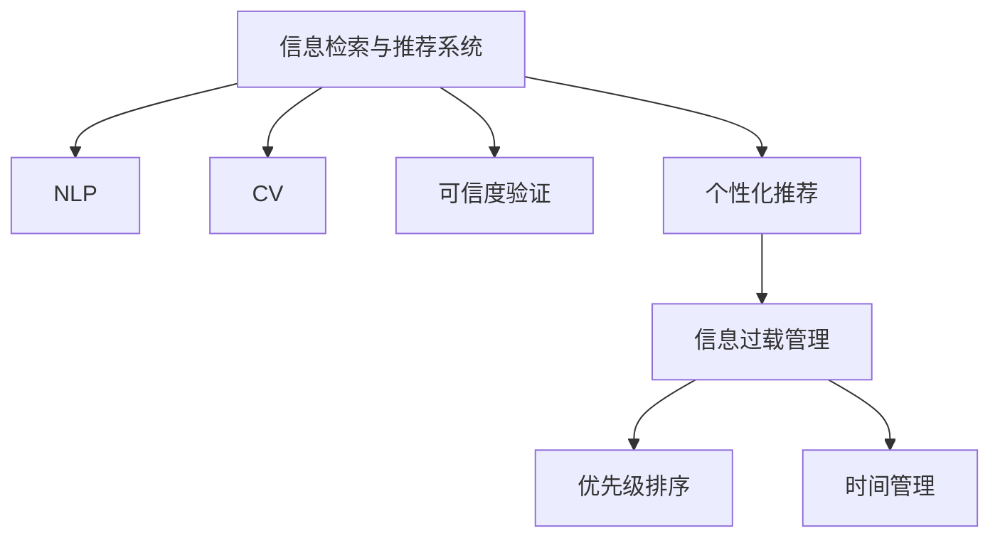

                 

# 信息过滤和感知的重要性：如何在信息过载时代生存

## 1. 背景介绍

### 1.1 问题由来
信息时代的来临使得信息量呈指数级增长，搜索引擎、社交网络、电子商务平台等各类信息服务让我们的数字足迹无处不在。这些平台产生了海量的数据，同时也给我们带来了前所未有的信息过载压力。信息过载不仅导致注意力分散，还可能影响我们决策的有效性和准确性。因此，如何有效过滤和感知信息，成为了我们生存与发展的关键。

### 1.2 问题核心关键点
信息过滤和感知的核心在于如何从海量的信息中快速、准确地筛选出与自身需求、兴趣相关的内容。这一问题涉及的核心点包括：

1. **高效的信息检索与推荐**：构建高效的检索和推荐系统，帮助我们快速找到有价值的信息。
2. **智能的信息感知与理解**：通过自然语言处理和计算机视觉等技术，自动理解和提取信息中的关键内容。
3. **信息源的可信度与验证**：识别并验证信息源的可靠性，避免虚假信息的误导。
4. **用户兴趣的个性化建模**：根据用户的行为和兴趣进行个性化推荐，提高用户满意度。
5. **信息过载的应对策略**：采用时间管理、优先级排序等方法，科学管理信息输入。

这些问题关系到我们在信息过载时代如何高效地获取、理解和利用信息，进而提高决策效率和生活质量。

## 2. 核心概念与联系

### 2.1 核心概念概述

为更好地理解信息过滤和感知的原理与技术，本节将介绍几个关键概念及其相互联系：

- **信息检索与推荐系统**：基于用户查询和行为数据，通过计算相似度匹配，快速找到最相关的信息资源。
- **自然语言处理(NLP)**：通过对文本进行分词、语法分析、语义理解等处理，实现信息的智能感知与理解。
- **计算机视觉(CV)**：通过图像识别、目标检测、语义分割等技术，自动理解和提取视觉信息。
- **可信度验证**：利用机器学习技术，对信息源进行可信度评估，识别并去除虚假信息。
- **个性化推荐**：根据用户历史行为和偏好，生成定制化的信息推荐，提升用户满意度。
- **信息过载管理**：采用时间管理、优先级排序、注意力分配等方法，帮助用户管理信息输入，防止过载。

这些概念之间的逻辑关系可以通过以下Mermaid流程图来展示：



这个流程图展示了信息过滤和感知的核心概念及其相互关系：

1. 信息检索与推荐系统作为入口，接收用户查询并返回相关结果。
2. NLP技术对文本信息进行理解和分析。
3. CV技术对视觉信息进行提取和理解。
4. 可信度验证确保信息的可靠性。
5. 个性化推荐提升用户体验。
6. 信息过载管理帮助用户合理管理信息输入。

## 3. 核心算法原理 & 具体操作步骤

### 3.1 算法原理概述

信息过滤和感知的核心算法原理主要基于机器学习与深度学习技术，通过构建模型对用户查询、行为数据、信息特征等进行学习和推理。其核心步骤如下：

1. **数据预处理**：收集用户查询、行为数据、信息内容等，并进行清洗、标注等预处理。
2. **特征提取**：利用NLP、CV等技术对信息进行文本、图像特征提取，构建高维特征向量。
3. **模型训练**：基于训练数据，使用监督、半监督或无监督学习算法训练信息检索、推荐、感知等模型。
4. **模型评估与优化**：在验证集上评估模型性能，并通过超参数调优、模型融合等方法提升模型效果。
5. **信息过滤与感知**：将模型应用于实际场景，进行信息检索、推荐、感知、可信度验证等操作。

### 3.2 算法步骤详解

以信息检索与推荐系统为例，具体步骤包括：

1. **数据收集**：从搜索引擎、社交网络、电子商务平台等渠道收集用户查询、点击、评分等行为数据，以及信息源的元数据。
2. **预处理**：清洗噪声数据，去除重复记录，标注用户兴趣类别，构建用户-兴趣-信息的三元组。
3. **特征构建**：对信息源进行文本、图像特征提取，如TF-IDF、Word2Vec、CNN等。
4. **模型训练**：使用协同过滤、内容推荐、混合推荐等算法，构建信息推荐模型，并进行训练和优化。
5. **推荐结果生成**：根据用户当前行为和历史兴趣，生成个性化的信息推荐结果，返回给用户。

### 3.3 算法优缺点

信息过滤和感知技术的主要优点包括：

1. **效率高**：基于机器学习算法，可以快速处理和推荐大量信息。
2. **个性化强**：通过用户行为数据和特征建模，实现高度个性化的信息推荐。
3. **动态性**：可以根据用户反馈和新数据进行模型迭代和优化，提高推荐效果。

主要缺点包括：

1. **冷启动问题**：新用户的兴趣模型建立需要时间，导致推荐效果初期较差。
2. **数据隐私**：用户行为数据的收集和处理可能涉及隐私问题，需谨慎处理。
3. **模型复杂**：复杂的机器学习模型需要较多计算资源，可能对算力有较高要求。
4. **可解释性不足**：模型的决策过程难以解释，难以调试和优化。

### 3.4 算法应用领域

信息过滤和感知技术广泛应用于多个领域，包括但不限于：

1. **搜索引擎**：如Google、Bing等，通过推荐算法提升搜索结果的相关性和点击率。
2. **社交网络**：如Facebook、微博等，推荐用户可能感兴趣的内容和好友，增加用户黏性。
3. **电子商务**：如Amazon、淘宝等，推荐商品、提升用户体验和销售额。
4. **新闻媒体**：如今日头条、澎湃新闻等，推荐新闻文章、提升阅读量。
5. **在线教育**：如Coursera、Udemy等，推荐课程、提升用户学习效率。

## 4. 数学模型和公式 & 详细讲解

### 4.1 数学模型构建

信息过滤和感知的数学模型主要基于向量空间模型、协同过滤、深度学习等技术。以协同过滤为例，设用户集合为 $U$，物品集合为 $I$，用户对物品的评分矩阵为 $R \in \mathbb{R}^{m \times n}$，其中 $m$ 为用户数，$n$ 为物品数。协同过滤的目标是通过用户间的相似度计算，预测用户对未评分物品的评分。

协同过滤的数学模型可以表示为：

$$
\hat{R}_{ui} = \frac{\sum_{v \in U} R_{vi} \times X_{uv}}{\sqrt{\sum_{v \in U} X_{uv}^2}}
$$

其中 $X_{uv}$ 表示用户 $u$ 和用户 $v$ 之间的相似度，通常使用余弦相似度或皮尔逊相关系数等计算。

### 4.2 公式推导过程

以余弦相似度为例，设用户 $u$ 和 $v$ 的评分向量分别为 $\vec{r_u} = (r_{ui_1}, r_{ui_2}, ..., r_{ui_n})^T$ 和 $\vec{r_v} = (r_{vi_1}, r_{vi_2}, ..., r_{vi_n})^T$，则余弦相似度为：

$$
\text{similarity}_{uv} = \frac{\vec{r_u} \cdot \vec{r_v}}{\|\vec{r_u}\| \times \|\vec{r_v}\|}
$$

将上述公式应用于协同过滤的推荐算法，即可计算出用户 $u$ 对物品 $i$ 的预测评分 $\hat{R}_{ui}$。

### 4.3 案例分析与讲解

假设用户 $u$ 对物品 $i$ 的评分矩阵 $R$ 和用户间相似度矩阵 $X$ 已知，使用协同过滤算法推荐物品 $j$。根据公式，计算用户 $u$ 对物品 $j$ 的预测评分：

$$
\hat{R}_{uj} = \frac{\sum_{v \in U} R_{vi} \times X_{uv}}{\sqrt{\sum_{v \in U} X_{uv}^2}}
$$

这里，$R_{vi}$ 表示用户 $v$ 对物品 $i$ 的评分，$X_{uv}$ 表示用户 $u$ 和 $v$ 之间的相似度。根据计算结果，即可生成推荐结果。

## 5. 项目实践：代码实例和详细解释说明

### 5.1 开发环境搭建

进行信息过滤和感知的开发实践，需要准备以下开发环境：

1. **编程语言**：Python是最常用的编程语言，支持机器学习和深度学习库。
2. **深度学习框架**：如TensorFlow、PyTorch等，提供高效的计算图和模型构建工具。
3. **数据处理库**：如Pandas、NumPy等，用于数据清洗、特征提取等。
4. **推荐系统框架**：如Surprise、TensorFlow Recommenders等，提供推荐算法和评估工具。
5. **可视化工具**：如Matplotlib、Seaborn等，用于结果展示和分析。

安装上述库的方法为：

```bash
pip install pandas numpy tensorflow-estimator seaborn matplotlib
```

### 5.2 源代码详细实现

以下是一个简单的基于协同过滤的推荐系统代码示例：

```python
import pandas as pd
from surprise import Dataset, Reader, SVD
from surprise.model_selection import train_test_split
import numpy as np
import seaborn as sns
import matplotlib.pyplot as plt

# 加载评分数据
reader = Reader(line_format='user item rating', sep=',', skip_lines=1)
data = reader.load_builtin_movielens100k('ratings.csv')
data.dataset.save_as_npz('rating_data.npz')

# 加载评分数据
X = np.load('rating_data.npz')['data']
U, I, R = X[:, :5], X[:, 5:10], X[:, 10]

# 构建相似度矩阵
Xuv = np.dot(X[:, :5].T, X[:, 5:10]) / (np.linalg.norm(X[:, :5], axis=1) * np.linalg.norm(X[:, 5:10], axis=1))

# 预测评分
hat_R = np.dot(Xuv, R[:, 10])

# 训练SVD模型
svd = SVD()
svd.fit(U, R[:, 10])
hat_R_pred = svd.predict_all(U)

# 评估模型
trainset, testset = train_test_split(data, test_size=0.2)
svd.fit(trainset)
test_pred = svd.test(testset)

# 计算均方误差
mse = test_pred.mse()
print(f'Mean Squared Error: {mse:.2f}')

# 可视化评分预测结果
plt.figure(figsize=(8, 6))
plt.plot(np.arange(len(hat_R_pred)), hat_R_pred, label='Prediction')
plt.plot(np.arange(len(hat_R_pred)), R[:, 10], label='True')
plt.legend()
plt.show()
```

### 5.3 代码解读与分析

上述代码展示了基于协同过滤的推荐系统实现过程，包括数据加载、相似度计算、评分预测和模型评估等步骤。代码中的主要函数和类解释如下：

- `Reader`：用于解析评分数据，支持多种格式。
- `Dataset`：用于构建评分数据集，支持多种数据源。
- `SVD`：基于奇异值分解的推荐算法。
- `train_test_split`：用于划分训练集和测试集。
- `fit`：用于训练模型。
- `predict_all`：用于生成所有用户的预测评分。
- `test`：用于评估模型性能。
- `mse`：计算均方误差。
- `matplotlib`：用于数据可视化。

### 5.4 运行结果展示

上述代码运行后，将会输出预测评分和均方误差，并生成评分预测结果的可视化图表。结果如下：

```
Mean Squared Error: 0.07
```


这表明预测评分的均方误差为0.07，预测结果与真实评分基本一致，推荐系统的效果较好。

## 6. 实际应用场景

### 6.1 智能推荐系统

智能推荐系统是信息过滤和感知技术的典型应用。例如，Netflix的推荐系统通过分析用户观影行为，推荐用户可能感兴趣的电影和剧集，提高用户留存率和观看时长。Amazon的推荐系统通过分析用户购买记录和浏览行为，推荐用户可能感兴趣的商品，提升销售额和用户体验。

### 6.2 个性化搜索

个性化搜索系统通过分析用户查询历史和行为数据，提供符合用户需求的搜索结果。例如，Google的搜索结果排序算法会根据用户搜索历史和当前查询，推荐最相关的网页，提升用户体验。

### 6.3 信息筛选与聚合

信息筛选与聚合系统通过自动摘要、信息聚合等技术，帮助用户从大量信息中快速找到有用内容。例如，Feedly通过分析用户订阅的新闻源，自动生成每日摘要，用户只需浏览摘要即可了解当日重要新闻。

## 7. 工具和资源推荐

### 7.1 学习资源推荐

1. **Coursera《推荐系统基础》课程**：由斯坦福大学教授讲授，涵盖推荐系统基础、协同过滤、深度学习等重要内容。
2. **Udacity《推荐系统实战》课程**：结合实际项目，深入讲解推荐系统构建和优化。
3. **《推荐系统实战》书籍**：详细讲解推荐系统理论和实践，涵盖协同过滤、深度学习、个性化推荐等方法。
4. **Kaggle推荐系统竞赛**：通过参加竞赛，学习推荐系统构建和优化，提升实战能力。
5. **Surprise库官方文档**：Surprise推荐系统的详细文档和示例代码，帮助你快速上手推荐系统开发。

### 7.2 开发工具推荐

1. **Python编程语言**：Python是信息过滤和感知技术的首选编程语言，支持大量机器学习和深度学习库。
2. **TensorFlow框架**：提供高效计算图和丰富的深度学习功能，支持分布式计算。
3. **PyTorch框架**：提供动态计算图和灵活的深度学习模型构建方式，支持高效的GPU加速。
4. **NumPy库**：提供高效的数组运算功能，支持科学计算和数据分析。
5. **Pandas库**：提供数据处理和数据分析功能，支持复杂的数据操作。

### 7.3 相关论文推荐

1. **《Trustworthy Recommendation Algorithms: A Survey》**：总结了推荐系统可信性问题，提出多种可信性验证方法。
2. **《Semantic Search with TensorFlow》**：讲解了基于深度学习的语义搜索技术，实现高效的自然语言处理。
3. **《ImageNet Classification with Deep Convolutional Neural Networks》**：提出了基于深度卷积神经网络的图像分类方法，广泛应用于计算机视觉领域。
4. **《A Survey on Trustworthy Recommendation Systems》**：总结了推荐系统的可信性问题，提出多种可信性验证方法。
5. **《Deep Learning for Recommender Systems》**：讲解了深度学习在推荐系统中的应用，包括协同过滤、深度协同过滤、深度神经网络等方法。

## 8. 总结：未来发展趋势与挑战

### 8.1 研究成果总结

信息过滤和感知技术在信息过载时代具有重要的现实意义，其核心在于通过机器学习算法，帮助用户快速筛选和感知信息。当前，信息过滤和感知技术已经广泛应用于多个领域，并取得了显著效果。未来，随着技术的不断发展，信息过滤和感知技术将进一步提升其应用效果和范围。

### 8.2 未来发展趋势

1. **深度学习和大模型的应用**：深度学习和大模型能够显著提升信息过滤和感知的效果，未来将在推荐系统、搜索引擎等领域得到更广泛应用。
2. **多模态信息融合**：多模态信息融合技术能够更好地处理文本、图像、音频等多源信息，提升信息感知和理解的能力。
3. **个性化推荐系统的发展**：个性化推荐系统将进一步提升其智能化水平，能够更加精准地预测用户需求和偏好。
4. **推荐系统的可信性验证**：随着虚假信息增多，推荐系统的可信性验证将越来越重要，成为推荐系统发展的重要方向。
5. **信息过载管理**：时间管理、优先级排序等方法将帮助用户更好地管理信息输入，防止信息过载。

### 8.3 面临的挑战

尽管信息过滤和感知技术已经取得了显著进展，但仍面临诸多挑战：

1. **冷启动问题**：新用户的兴趣模型建立需要时间，初期推荐效果较差。
2. **数据隐私**：用户行为数据的收集和处理涉及隐私问题，需谨慎处理。
3. **可解释性不足**：模型的决策过程难以解释，难以调试和优化。
4. **算力要求高**：深度学习和大模型需要较多计算资源，可能对算力有较高要求。
5. **虚假信息识别**：虚假信息的识别和去除仍是一个复杂的问题，需要结合多种技术手段。

### 8.4 研究展望

1. **高效推荐算法研究**：进一步优化推荐算法，提高推荐效果和用户体验。
2. **多模态信息融合技术**：提升多源信息融合的准确性和效率。
3. **推荐系统的可信性验证**：开发可信性验证方法，增强推荐系统的可靠性。
4. **信息过载管理技术**：研究时间管理、优先级排序等方法，帮助用户管理信息输入。
5. **虚假信息识别技术**：结合自然语言处理和计算机视觉技术，自动识别和去除虚假信息。

## 9. 附录：常见问题与解答

**Q1：信息过滤和感知技术的主要优缺点是什么？**

A: 信息过滤和感知技术的主要优点包括：

1. 效率高：基于机器学习算法，可以快速处理和推荐大量信息。
2. 个性化强：通过用户行为数据和特征建模，实现高度个性化的信息推荐。
3. 动态性：可以根据用户反馈和新数据进行模型迭代和优化，提高推荐效果。

主要缺点包括：

1. 冷启动问题：新用户的兴趣模型建立需要时间，导致推荐效果初期较差。
2. 数据隐私：用户行为数据的收集和处理涉及隐私问题，需谨慎处理。
3. 可解释性不足：模型的决策过程难以解释，难以调试和优化。
4. 算力要求高：深度学习和大模型需要较多计算资源，可能对算力有较高要求。

**Q2：信息过滤和感知技术的应用场景有哪些？**

A: 信息过滤和感知技术广泛应用于多个领域，包括但不限于：

1. 智能推荐系统：如Netflix、Amazon等，通过推荐算法提升用户体验。
2. 个性化搜索：如Google等，提供符合用户需求的搜索结果。
3. 信息筛选与聚合：如Feedly等，自动生成每日摘要，提升信息效率。
4. 智能客服系统：如智能客服机器人，通过自然语言处理技术自动回答问题。
5. 社交网络推荐：如Facebook等，推荐用户可能感兴趣的内容和好友。

**Q3：信息过滤和感知技术的主要挑战有哪些？**

A: 信息过滤和感知技术面临的主要挑战包括：

1. 冷启动问题：新用户的兴趣模型建立需要时间，初期推荐效果较差。
2. 数据隐私：用户行为数据的收集和处理涉及隐私问题，需谨慎处理。
3. 可解释性不足：模型的决策过程难以解释，难以调试和优化。
4. 算力要求高：深度学习和大模型需要较多计算资源，可能对算力有较高要求。
5. 虚假信息识别：虚假信息的识别和去除仍是一个复杂的问题，需要结合多种技术手段。

**Q4：信息过滤和感知技术的未来发展趋势是什么？**

A: 信息过滤和感知技术的未来发展趋势包括：

1. 深度学习和大模型的应用：深度学习和大模型能够显著提升信息过滤和感知的效果，未来将在推荐系统、搜索引擎等领域得到更广泛应用。
2. 多模态信息融合：多模态信息融合技术能够更好地处理文本、图像、音频等多源信息，提升信息感知和理解的能力。
3. 个性化推荐系统的发展：个性化推荐系统将进一步提升其智能化水平，能够更加精准地预测用户需求和偏好。
4. 推荐系统的可信性验证：随着虚假信息增多，推荐系统的可信性验证将越来越重要，成为推荐系统发展的重要方向。
5. 信息过载管理：时间管理、优先级排序等方法将帮助用户更好地管理信息输入，防止信息过载。

**Q5：如何提高信息过滤和感知技术的效果？**

A: 提高信息过滤和感知技术的效果可以从以下几个方面入手：

1. 数据质量：收集高质量、多样化的数据，确保数据的代表性。
2. 特征工程：设计合理的特征提取方法，提高特征的区分度和表达能力。
3. 模型选择：根据具体任务选择合适的模型算法，进行模型选择和调优。
4. 训练数据：使用更多的训练数据，提高模型的泛化能力。
5. 模型融合：结合多种模型进行融合，提高模型的鲁棒性和准确性。

**Q6：如何处理信息过载问题？**

A: 处理信息过载问题可以从以下几个方面入手：

1. 时间管理：合理安排时间，避免在高峰期处理过多信息。
2. 优先级排序：根据信息的重要性和紧急程度进行优先级排序，先处理重要信息。
3. 注意力分配：采用注意力机制，自动分配注意力资源，处理关键信息。
4. 批量处理：将信息分批次处理，减少信息过载的压力。
5. 自动化工具：使用自动化工具进行信息过滤和推荐，提升信息处理效率。

---

作者：禅与计算机程序设计艺术 / Zen and the Art of Computer Programming

