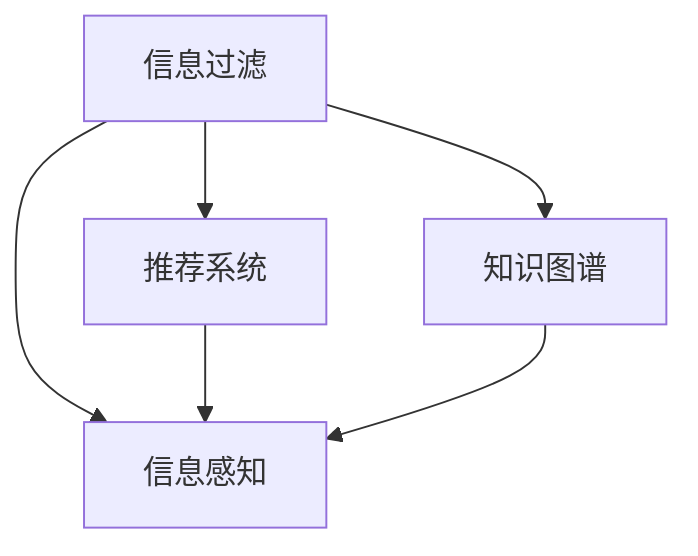

                 

# 信息过滤和感知的重要性：如何在信息过载时代生存

在信息过载的时代，面对海量的信息流，如何在繁杂的信息海洋中筛选出对我们有价值的内容，是每个人都需要面对的挑战。本文将深入探讨信息过滤和感知的重要性，介绍如何利用先进的技术手段提升信息处理能力，并展望未来的发展趋势。

## 1. 背景介绍

### 1.1 信息过载问题凸显
随着互联网的普及和社交媒体的兴起，我们每天接收到的信息量呈爆炸式增长。据统计，每个人每天平均接收到100TB以上的信息，但真正有价值的信息往往只占很小一部分。信息过载不仅降低了我们的工作效率，还可能引发信息焦虑和认知负荷。

### 1.2 信息过滤与感知的必要性
信息过载的问题催生了信息过滤和感知的需求，即在大量无关信息中筛选出对用户有用的信息，并理解这些信息的含义和价值。信息过滤和感知不仅是提升个人和组织信息获取效率的关键，更是构建智能信息系统的基础。

## 2. 核心概念与联系

### 2.1 核心概念概述

为更好地理解信息过滤和感知的原理，本节将介绍几个核心概念：

- **信息过滤（Information Filtering）**：指通过一定的算法和规则，从大量数据中筛选出对用户有价值的信息。常见的信息过滤方法包括基于关键词、基于兴趣、基于协同过滤等。
- **信息感知（Information Perception）**：指在信息过滤的基础上，进一步理解信息的上下文、情感、语义等深层含义。信息感知技术能够帮助用户更全面、深入地理解信息内容。
- **推荐系统（Recommender System）**：一种能够根据用户历史行为和偏好，推荐可能感兴趣的内容的技术。推荐系统是信息过滤和感知的重要应用之一。
- **知识图谱（Knowledge Graph）**：一种以图结构形式存储实体及其关系的知识库，通过图计算和推理，提供更准确的信息理解和知识关联。

这些核心概念之间的逻辑关系可以通过以下Mermaid流程图来展示：



这个流程图展示了一系列与信息过滤和感知相关的核心概念及其相互关系：

1. 信息过滤是信息感知的基础，从海量信息中筛选出有价值的内容。
2. 推荐系统和知识图谱进一步提升信息感知能力，帮助用户理解信息的内涵和关联。
3. 信息感知在推荐系统和知识图谱的辅助下，能够提供更全面、精准的信息理解。

### 2.2 核心概念原理和架构的 Mermaid 流程图


这个流程图展示了信息过滤和感知的核心架构：

1. 信息源（如新闻网站、社交媒体、邮件）：提供原始信息。
2. 信息收集：通过爬虫、API等方式获取信息。
3. 信息预处理：清洗、格式化信息，准备过滤和感知。
4. 信息过滤：基于用户兴趣、关键词、时间等条件筛选信息。
5. 信息感知：利用自然语言处理、语义分析等技术，理解信息含义。
6. 信息展示：将过滤和感知后的信息以推荐列表、摘要等形式展示给用户。

## 3. 核心算法原理 & 具体操作步骤

### 3.1 算法原理概述

信息过滤和感知的核心算法包括：

- **基于内容的过滤**：通过关键词匹配、文本相似度计算等方法，筛选出与用户兴趣相关的内容。
- **基于协同过滤**：根据用户历史行为和偏好，推荐可能感兴趣的内容。
- **基于模型的过滤**：使用机器学习模型预测用户对内容的评分，筛选出高评分的内容。
- **基于知识图谱的感知**：通过图结构化信息，利用图计算和推理技术，增强信息理解深度。

### 3.2 算法步骤详解

以基于协同过滤的信息推荐系统为例，介绍其主要步骤：

**Step 1: 数据准备**
- 收集用户的历史行为数据，如浏览记录、评分、点击行为等。
- 收集物品的属性特征，如标题、作者、标签等。

**Step 2: 特征提取**
- 对用户行为和物品属性进行特征工程，如TF-IDF、词袋模型等。
- 构建用户-物品评分矩阵，计算用户对每个物品的评分。

**Step 3: 协同过滤建模**
- 使用协同过滤算法，如基于用户的模型、基于物品的模型、矩阵分解等，构建用户-物品评分矩阵的预测模型。
- 计算用户对物品的评分预测值，并排序推荐。

**Step 4: 结果展示**
- 将推荐结果以列表、摘要等形式展示给用户。
- 根据用户反馈调整推荐策略，优化推荐效果。

### 3.3 算法优缺点

基于协同过滤的信息推荐系统具有以下优点：

- **个性化强**：能够根据用户历史行为和偏好，提供个性化推荐。
- **扩展性好**：随着数据量的增加，推荐效果持续提升。
- **实时性好**：可以实时更新推荐结果，及时满足用户需求。

同时，该系统也存在一些局限性：

- **数据稀疏性问题**：用户历史行为数据有限，推荐效果受限于数据量。
- **冷启动问题**：新用户或物品缺乏历史数据，难以进行准确推荐。
- **算法复杂性**：需要复杂的计算和数据处理，对硬件要求较高。

### 3.4 算法应用领域

基于协同过滤的推荐系统在电商、音乐、视频等多个领域广泛应用，为用户个性化推荐商品、音乐、视频等，提升用户体验和满意度。

## 4. 数学模型和公式 & 详细讲解 & 举例说明

### 4.1 数学模型构建

设用户集为 $U$，物品集为 $I$，用户对物品的评分矩阵为 $R_{ui}$。协同过滤的目标是最小化预测评分与真实评分的误差，即：

$$
\min_{\theta} \sum_{u \in U} \sum_{i \in I} (r_{ui} - \hat{r}_{ui})^2
$$

其中 $\hat{r}_{ui}$ 为模型预测的评分。

### 4.2 公式推导过程

以基于用户的协同过滤算法为例，推导预测评分的计算公式：

设用户 $u$ 对物品 $i$ 的真实评分为 $r_{ui}$，预测评分为 $\hat{r}_{ui}$，预测模型的参数为 $\theta$，则有：

$$
\hat{r}_{ui} = \sum_{j \in N_u} a_{uj}r_{ji} + b_u
$$

其中 $N_u$ 为用户 $u$ 的邻居集，$a_{uj}$ 和 $b_u$ 为模型参数。

### 4.3 案例分析与讲解

考虑一个电商网站，收集了用户对商品的浏览记录和评分数据。假设某用户 $u$ 对商品 $i$ 的真实评分为 $r_{ui} = 4$，模型预测评分为 $\hat{r}_{ui} = 4.2$，用户 $u$ 的邻居集为 $N_u = \{j_1, j_2, j_3\}$，对应的邻居评分分别为 $r_{j_1i} = 3.8, r_{j_2i} = 4.0, r_{j_3i} = 4.5$。则有：

$$
\hat{r}_{ui} = a_{uj_1}r_{j_1i} + a_{uj_2}r_{j_2i} + a_{uj_3}r_{j_3i} + b_u
$$

通过求解模型参数，可以预测用户对新商品的评分，并进行推荐。

## 5. 项目实践：代码实例和详细解释说明

### 5.1 开发环境搭建

在进行信息过滤和感知项目实践前，需要先搭建好开发环境。以下是使用Python进行开发的环境配置流程：

1. 安装Anaconda：从官网下载并安装Anaconda，用于创建独立的Python环境。

2. 创建并激活虚拟环境：
```bash
conda create -n infofilter-env python=3.8 
conda activate infofilter-env
```

3. 安装相关库：
```bash
conda install scikit-learn pandas numpy
pip install pymongo
```

4. 安装机器学习库：
```bash
pip install scikit-learn
```

完成上述步骤后，即可在`infofilter-env`环境中开始项目开发。

### 5.2 源代码详细实现

以下是一个基于协同过滤的推荐系统示例代码：

```python
import pandas as pd
from sklearn.neighbors import NearestNeighbors

# 数据准备
data = pd.read_csv('data/user_item_ratings.csv')

# 特征工程
user_ids = data['user_id'].unique()
item_ids = data['item_id'].unique()

# 计算用户-物品评分矩阵
user_item_ratings = data.pivot_table(index='user_id', columns='item_id', values='rating')

# 用户行为特征提取
user_features = user_item_ratings.T.mean()

# 物品特征提取
item_features = user_item_ratings.T.mean()

# 协同过滤模型
nbrs = NearestNeighbors(metric='cosine', n_neighbors=10)
nbrs.fit(user_features)

# 推荐
def recommend(user_id):
    user_feature = user_features[user_id]
    user_neighbors = nbrs.kneighbors(user_feature.reshape(1, -1))[1]
    item_neighbors = item_features[user_neighbors]
    return user_neighbors, item_neighbors

# 测试推荐结果
user_id = 123
user_neighbors, item_neighbors = recommend(user_id)
print(user_neighbors, item_neighbors)
```

以上代码展示了从数据准备到推荐系统的完整实现过程：

1. 数据准备：读取用户-物品评分数据，提取用户和物品的ID。
2. 特征工程：计算用户和物品的平均评分，作为特征。
3. 协同过滤模型：使用KNN算法，计算用户邻居和物品邻居。
4. 推荐系统：根据用户邻居和物品邻居，推荐可能感兴趣的商品。

### 5.3 代码解读与分析

让我们再详细解读一下关键代码的实现细节：

**数据准备**：
- 读取数据集 `user_item_ratings.csv`，提取用户ID和物品ID。
- 使用 `pivot_table` 方法，将评分矩阵转换为用户-物品评分矩阵。

**特征工程**：
- 计算用户和物品的平均评分，作为特征。
- 将用户特征和物品特征存储到 `user_features` 和 `item_features` 变量中。

**协同过滤模型**：
- 使用 `NearestNeighbors` 类，初始化KNN模型。
- 通过 `fit` 方法，计算用户邻居和物品邻居。

**推荐系统**：
- `recommend` 函数：接收用户ID，计算用户邻居和物品邻居。
- 在测试推荐结果时，调用 `recommend` 函数，输出推荐结果。

可以看到，通过这段代码，我们可以快速实现一个基于协同过滤的推荐系统。需要注意的是，在实际应用中，还需要对算法进行调参和优化，以提高推荐效果。

## 6. 实际应用场景

### 6.1 电商平台推荐系统

电商平台可以通过推荐系统向用户推荐商品，提升用户体验和销售额。例如，亚马逊、京东等电商巨头都广泛应用了推荐系统，通过用户的历史行为和评分数据，推荐用户可能感兴趣的商品。

在技术实现上，可以收集用户的历史浏览记录、评分数据和购买记录，使用协同过滤算法，对商品进行个性化推荐。用户可以在页面上查看系统推荐的产品，提高购买转化率。

### 6.2 视频平台推荐系统

视频平台（如Netflix、YouTube）也通过推荐系统向用户推荐视频内容，提升用户粘性和平台使用率。视频平台收集用户观看历史和评分数据，使用协同过滤算法，推荐用户可能感兴趣的视频内容。

在技术实现上，可以收集用户的历史观看记录、评分数据和搜索记录，使用协同过滤算法，对视频进行个性化推荐。用户可以在平台上观看推荐的视频内容，提高平台使用率和用户满意度。

### 6.3 新闻阅读推荐系统

新闻阅读平台（如Google News）通过推荐系统向用户推荐新闻文章，提升用户阅读体验和平台活跃度。新闻平台收集用户的历史浏览记录和阅读偏好，使用协同过滤算法，推荐用户可能感兴趣的新闻文章。

在技术实现上，可以收集用户的历史浏览记录和阅读偏好，使用协同过滤算法，对新闻文章进行个性化推荐。用户可以在平台上阅读推荐的新闻文章，提高平台使用率和用户满意度。

### 6.4 未来应用展望

随着协同过滤算法的不断演进，未来推荐系统的应用将更加广泛和深入。除了传统的电商、视频、新闻等领域，推荐系统还将被应用于金融、医疗、教育等多个行业，提升信息获取效率和用户满意度。

未来，推荐系统将进一步融合深度学习、知识图谱、因果推理等前沿技术，提升推荐效果和用户体验。例如，通过引入深度学习技术，推荐系统可以更准确地理解用户偏好和行为特征，提高推荐精度。通过融合知识图谱，推荐系统可以更好地理解复杂实体之间的关系，提供更全面、深入的信息推荐。通过引入因果推理，推荐系统可以更好地预测用户行为，提升推荐效果和稳定性。

## 7. 工具和资源推荐

### 7.1 学习资源推荐

为了帮助开发者系统掌握信息过滤和感知的理论基础和实践技巧，这里推荐一些优质的学习资源：

1. **《推荐系统实战》**：一本详细介绍推荐系统理论和实践的书籍，适合初学者和进阶开发者。
2. **Coursera《推荐系统》课程**：由斯坦福大学开设的推荐系统课程，涵盖推荐算法、模型评估等核心内容，提供丰富的实践案例。
3. **Kaggle推荐系统竞赛**：通过实际竞赛项目，实践推荐系统算法和模型，提升实战经验。
4. **arXiv.org**：推荐系统领域的顶级会议和期刊，获取最新研究成果和趋势。
5. **《信息检索与推荐系统》**：一本全面介绍信息检索和推荐系统理论的书籍，适合深入学习和研究。

通过对这些资源的学习实践，相信你一定能够快速掌握信息过滤和感知的精髓，并用于解决实际的推荐问题。

### 7.2 开发工具推荐

高效的开发离不开优秀的工具支持。以下是几款用于信息过滤和感知开发的常用工具：

1. **Pandas**：Python数据分析库，适用于数据处理和特征工程。
2. **Scikit-learn**：Python机器学习库，提供多种推荐算法和模型。
3. **TensorFlow**：深度学习框架，支持多种推荐模型和神经网络。
4. **PyTorch**：深度学习框架，提供灵活的计算图和自动微分功能。
5. **Spark**：大数据处理框架，适用于大规模数据集的处理和分析。

合理利用这些工具，可以显著提升信息过滤和感知任务的开发效率，加快创新迭代的步伐。

### 7.3 相关论文推荐

信息过滤和感知领域的研究一直在不断进展，以下是几篇奠基性的相关论文，推荐阅读：

1. **《推荐系统中的协同过滤》**：详细介绍了协同过滤算法的原理和实现方法。
2. **《深度学习在推荐系统中的应用》**：介绍深度学习技术在推荐系统中的应用，包括神经网络、自编码器等。
3. **《知识图谱在推荐系统中的应用》**：探讨知识图谱与推荐系统的融合，提升推荐效果和用户满意度。
4. **《因果推断在推荐系统中的应用》**：引入因果推断思想，增强推荐系统的稳定性和鲁棒性。
5. **《信息过滤与感知的多模态方法》**：讨论多模态信息融合在信息过滤和感知中的应用，提升信息理解和推荐精度。

这些论文代表了大信息过滤和感知技术的发展脉络。通过学习这些前沿成果，可以帮助研究者把握学科前进方向，激发更多的创新灵感。

## 8. 总结：未来发展趋势与挑战

### 8.1 总结

本文对信息过滤和感知的理论基础和实践方法进行了全面系统的介绍。首先阐述了信息过载问题及其重要性，明确了信息过滤和感知的必要性。其次，从算法原理和操作步骤，详细讲解了基于协同过滤的推荐系统。最后，讨论了未来推荐系统的应用前景和挑战。

通过本文的系统梳理，可以看到，信息过滤和感知技术正在成为信息获取的重要手段，极大地提升了信息处理能力，优化了用户体验。未来，随着技术的不断进步，信息过滤和感知技术将更加普及和深入，为各行各业带来新的变革。

### 8.2 未来发展趋势

展望未来，信息过滤和感知技术将呈现以下几个发展趋势：

1. **深度学习与协同过滤的融合**：通过引入深度学习技术，信息过滤和感知系统可以更准确地理解用户行为和偏好，提升推荐效果。
2. **知识图谱的应用**：将知识图谱与信息过滤和感知技术结合，增强系统的信息理解和知识关联能力，提供更全面、深入的信息推荐。
3. **因果推理与因果分析**：引入因果推断和因果分析方法，增强系统的稳定性和鲁棒性，减少用户行为预测的偏差。
4. **多模态融合**：融合视觉、语音、文本等多种模态信息，提升信息理解和推荐精度，构建更智能的信息过滤和感知系统。
5. **实时性和可扩展性**：通过分布式计算和实时流处理技术，提升系统的实时性和可扩展性，满足大规模数据处理的需求。

以上趋势凸显了信息过滤和感知技术的广阔前景。这些方向的探索发展，必将进一步提升信息处理能力和用户体验，为各行各业带来新的变革。

### 8.3 面临的挑战

尽管信息过滤和感知技术已经取得了瞩目成就，但在迈向更加智能化、普适化应用的过程中，它仍面临着诸多挑战：

1. **数据质量与多样性**：信息过滤和感知系统的性能很大程度上依赖于数据质量。数据缺失、噪声和不平衡等问题，可能导致系统性能下降。
2. **冷启动问题**：对于新用户或物品，缺乏历史数据，难以进行准确推荐，需要引入更多外部的数据和信息。
3. **算法的复杂性**：复杂的算法和模型需要大量的计算资源，对硬件和软件环境要求较高。
4. **隐私和安全**：信息过滤和感知系统需要处理大量敏感数据，如何保障数据隐私和安全，避免数据泄露和滥用，是重要的技术挑战。
5. **模型的可解释性**：信息过滤和感知系统通常是"黑盒"模型，难以解释其内部工作机制和决策逻辑，需要引入更多的可解释性和透明性。

这些挑战需要研究者和技术开发者共同努力，寻找新的解决方案，推动信息过滤和感知技术的进步。

### 8.4 研究展望

面对信息过滤和感知技术面临的挑战，未来的研究需要在以下几个方面寻求新的突破：

1. **增强数据质量和多样性**：通过数据采集和清洗技术，提升数据质量和多样性，降低数据噪声和偏差。
2. **解决冷启动问题**：引入更多外部的数据和信息，如知识图谱、社交网络等，帮助新用户和新物品进行推荐。
3. **简化算法和模型**：通过模型压缩和优化技术，简化算法和模型，降低计算资源消耗，提升系统的实时性和可扩展性。
4. **保障数据隐私和安全**：通过数据匿名化、加密和访问控制等技术，保障数据隐私和安全，避免数据滥用和泄露。
5. **提升模型可解释性**：引入可解释性和透明性技术，如注意力机制、因果分析等，提高模型的可解释性和可信度。

这些研究方向的探索，必将引领信息过滤和感知技术迈向更高的台阶，为构建更加智能和可信的信息系统铺平道路。面向未来，信息过滤和感知技术还需要与其他人工智能技术进行更深入的融合，如知识表示、因果推理、强化学习等，多路径协同发力，共同推动信息处理系统的进步。只有勇于创新、敢于突破，才能不断拓展信息过滤和感知技术的边界，让信息获取更加高效和智能。

## 9. 附录：常见问题与解答

**Q1：信息过滤和感知技术是否适用于所有场景？**

A: 信息过滤和感知技术在许多场景下都有应用潜力，但并不适用于所有场景。例如，对于低频和独特性的内容，用户可能没有足够的历史数据，导致推荐效果不佳。此外，对于一些需要高频更新的内容，如新闻、股票等，推荐系统需要实时更新数据，对系统实时性和可扩展性要求较高。

**Q2：如何缓解信息过载问题？**

A: 缓解信息过载问题的方法有很多，例如：

- **分阶段推荐**：根据用户行为和偏好，分阶段推荐不同层次的内容，从浅层次推荐逐渐过渡到深层次推荐。
- **多模态融合**：融合多种信息源和模态信息，如文本、图像、视频等，提升信息理解和推荐精度。
- **主动学习和推荐**：通过主动学习和推荐技术，主动收集用户反馈，优化推荐策略。

**Q3：如何提升信息感知能力？**

A: 提升信息感知能力的方法包括：

- **深度学习技术**：引入深度学习模型，提升信息理解的深度和广度。
- **知识图谱融合**：将知识图谱与信息过滤和感知技术结合，增强系统的信息理解和知识关联能力。
- **因果推理技术**：引入因果推断方法，增强系统的稳定性和鲁棒性。

**Q4：推荐系统如何应对新用户的冷启动问题？**

A: 推荐系统应对新用户冷启动问题的方法包括：

- **数据扩展**：收集更多的数据和信息，如社交网络、知识图谱等，帮助新用户进行推荐。
- **用户兴趣引导**：通过用户行为分析，引导用户探索感兴趣的内容，逐步构建用户的兴趣模型。
- **主动学习和推荐**：通过主动学习和推荐技术，主动收集用户反馈，优化推荐策略。

这些方法可以结合使用，提高推荐系统对新用户的覆盖率和推荐效果。

**Q5：推荐系统如何保障数据隐私和安全？**

A: 推荐系统保障数据隐私和安全的方法包括：

- **数据匿名化**：对用户数据进行匿名化处理，避免数据泄露。
- **访问控制**：通过访问控制技术，限制数据访问权限，保障数据安全。
- **加密技术**：对敏感数据进行加密处理，防止数据泄露。

通过这些方法，可以提升推荐系统的数据隐私和安全保障，避免数据滥用和泄露。

---

作者：禅与计算机程序设计艺术 / Zen and the Art of Computer Programming

