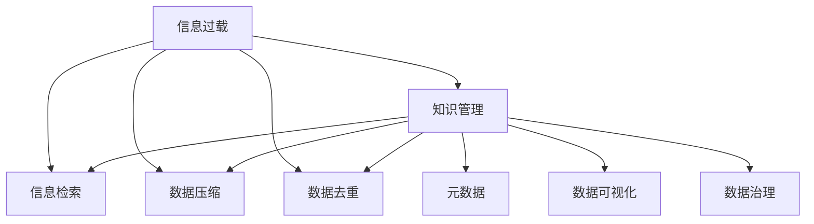

                 

# 信息过载与知识管理策略与实践：管理和组织信息

> 关键词：信息过载, 知识管理, 信息检索, 数据压缩, 数据去重, 元数据, 数据可视化, 数据治理

## 1. 背景介绍

### 1.1 问题由来
在信息时代，我们生活在数据的海量海洋中。智能手机、社交媒体、电子邮件、在线文档、新闻网站等，都成了信息的源泉。面对如此丰富的信息，人们既有机会接触到更多知识和信息，也面临着信息过载（Information Overload）的困扰。如何有效地管理和组织信息，利用信息创造价值，成为了一个亟待解决的挑战。

### 1.2 问题核心关键点
- 信息过载：当信息量超出个人处理能力时，会导致认知负担过重，影响决策效率和效果。
- 知识管理：指收集、组织、存储、分享知识，使其能够被重复使用和创造价值的过程。
- 信息检索：通过技术手段快速定位和获取相关信息的过程。
- 数据压缩：通过技术手段减少数据体积，提高存储和传输效率。
- 数据去重：识别和去除重复数据，避免冗余存储。
- 元数据：描述数据内容、来源、结构等相关信息，辅助数据管理和检索。
- 数据可视化：通过图表、地图、仪表盘等手段，直观展示数据。
- 数据治理：通过政策、流程和技术手段，规范数据管理，确保数据质量和安全。

### 1.3 问题研究意义
研究信息过载和知识管理的策略与实践，对于提高信息利用效率，促进知识创新和应用，提升组织和个人决策能力，具有重要意义：

1. 提高决策效率：通过高效的信息检索和知识管理，快速获取相关知识，减少决策过程的延误和错误。
2. 创造知识价值：将信息转化为知识，利用知识驱动创新，创造商业价值。
3. 提升决策质量：通过结构化的知识和信息，避免决策过程中主观偏见的干扰，提高决策的科学性和客观性。
4. 促进知识共享：构建知识分享平台，促进信息流动，实现知识在组织内部的共享和传承。
5. 加强数据安全：通过规范的数据治理措施，保护数据隐私和安全，避免信息泄露和滥用。

## 2. 核心概念与联系

### 2.1 核心概念概述

为了更好地理解信息管理和知识管理的策略与实践，本节将介绍几个密切相关的核心概念：

- 信息过载（Information Overload）：指个体或组织在信息获取和使用过程中，所接收到的信息量超出其处理能力，导致认知负担加重，影响工作效率和生活质量。
- 知识管理（Knowledge Management）：通过系统的工具和技术手段，收集、组织、存储、检索和分享知识，以支持组织和个人的工作和学习。
- 信息检索（Information Retrieval）：利用算法和数据结构，从海量数据中快速定位和获取所需信息。
- 数据压缩（Data Compression）：通过编码算法减少数据体积，提高存储和传输效率。
- 数据去重（Data Deduplication）：识别和去除数据中的重复部分，避免冗余存储。
- 元数据（Metadata）：描述数据内容、来源、结构等相关信息，辅助数据管理和检索。
- 数据可视化（Data Visualization）：将数据转化为图形或图表，以更直观的形式展示数据。
- 数据治理（Data Governance）：通过政策、流程和技术手段，规范数据管理，确保数据质量和安全。

这些概念之间的逻辑关系可以通过以下Mermaid流程图来展示：



这个流程图展示的信息管理和知识管理的核心概念及其之间的关系：

1. 信息过载通过信息检索、数据压缩和数据去重等手段得以缓解。
2. 知识管理通过元数据、数据可视化和数据治理等手段，确保知识的有效管理和利用。
3. 信息检索、数据压缩、数据去重、元数据、数据可视化和数据治理等手段，共同支撑知识管理的目标。

这些概念共同构成了信息管理和知识管理的框架，使其能够在各种场景下发挥作用。

## 3. 核心算法原理 & 具体操作步骤
### 3.1 算法原理概述

信息过载和知识管理的策略与实践，本质上是通过系统化的工具和技术手段，提高信息获取和知识利用的效率和效果。其核心思想是：

- 从海量信息中高效检索和过滤，快速定位所需信息。
- 收集、组织和存储知识，促进知识的共享和利用。
- 通过技术手段减少信息冗余，优化数据结构。
- 描述和管理数据，确保数据质量和治理合规。

形式化地，假设我们有一组数据集 $D$，目标是对其进行有效管理和利用。其中：

- $D=\{d_1, d_2, ..., d_n\}$，每个数据点 $d_i$ 包含信息 $I_i$ 和知识 $K_i$。
- $I_i$ 为数据点 $d_i$ 的文本、数字、图像等原始信息。
- $K_i$ 为数据点 $d_i$ 的结构化、半结构化或非结构化知识。

信息管理和知识管理的策略与实践，可以通过以下几个步骤实现：

1. 数据采集与预处理：获取原始数据，清洗和预处理，使其符合管理需求。
2. 信息检索与过滤：通过技术手段，从数据集中快速定位和过滤所需信息。
3. 知识组织与存储：将知识进行分类、索引和存储，便于检索和利用。
4. 数据压缩与去重：通过编码算法和去重技术，减少数据体积，避免冗余存储。
5. 元数据管理：对数据进行描述和管理，辅助数据检索和利用。
6. 数据可视化：将数据转化为图形或图表，直观展示数据。
7. 数据治理：通过政策、流程和技术手段，规范数据管理，确保数据质量和安全。

### 3.2 算法步骤详解

以下，我们将详细介绍信息过载和知识管理的各个关键步骤及其具体操作步骤。

#### 3.2.1 数据采集与预处理

数据采集与预处理是信息管理和知识管理的基础。具体步骤如下：

1. **数据采集**：通过爬虫、API接口、数据库等方式，获取原始数据。
2. **数据清洗**：去除噪音、重复数据和不完整信息，使数据质量更可靠。
3. **数据标注**：对数据进行结构化处理，添加必要的元数据，如时间戳、来源、作者等。
4. **数据规范化**：统一数据格式和标准，确保数据的一致性。

#### 3.2.2 信息检索与过滤

信息检索与过滤是信息管理的核心，目标是从海量数据中快速定位所需信息。具体步骤如下：

1. **文本挖掘**：通过自然语言处理技术，对文本数据进行分词、词性标注、命名实体识别等处理。
2. **关键字提取**：使用TF-IDF、词袋模型等方法，提取文本中的关键词。
3. **语义分析**：利用语义相似度算法，计算文本间的语义相似度。
4. **信息过滤**：根据关键字和语义相似度，过滤掉不相关或低质量的信息。

#### 3.2.3 知识组织与存储

知识组织与存储是知识管理的核心，目标是将知识进行分类、索引和存储，便于检索和利用。具体步骤如下：

1. **知识分类**：将知识进行分类和标签化，形成知识库。
2. **知识索引**：对知识库中的知识进行索引，便于快速检索。
3. **知识存储**：使用数据库或知识图谱等存储知识，保证知识的完整性和可访问性。

#### 3.2.4 数据压缩与去重

数据压缩与去重是信息管理的辅助手段，目标是通过技术手段减少信息冗余，优化数据结构。具体步骤如下：

1. **数据压缩**：使用Huffman编码、LZ77、LZ78等算法，压缩数据体积。
2. **数据去重**：利用哈希表、指纹算法等技术，识别和去除重复数据。

#### 3.2.5 元数据管理

元数据管理是信息管理和知识管理的辅助手段，目标是对数据进行描述和管理，辅助数据检索和利用。具体步骤如下：

1. **元数据定义**：定义数据的基本元数据，如时间戳、作者、来源等。
2. **元数据标注**：对数据进行元数据标注，保证数据的一致性和完整性。
3. **元数据索引**：对元数据进行索引，便于快速检索。

#### 3.2.6 数据可视化

数据可视化是信息管理的辅助手段，目标是将数据转化为图形或图表，直观展示数据。具体步骤如下：

1. **数据选择**：选择需要展示的数据，确保数据的相关性和重要性。
2. **图表选择**：根据数据类型和展示目的，选择合适的图表类型，如折线图、柱状图、散点图等。
3. **数据展示**：将数据转化为图表，直观展示数据的变化趋势、分布情况等。

#### 3.2.7 数据治理

数据治理是信息管理和知识管理的保障，目标是通过政策、流程和技术手段，规范数据管理，确保数据质量和安全。具体步骤如下：

1. **数据政策**：制定数据管理政策，明确数据使用、共享和保护的规则。
2. **数据流程**：设计数据管理流程，确保数据从采集到利用各环节的规范和合规。
3. **数据安全**：采用加密、访问控制等技术手段，保护数据隐私和安全。

### 3.3 算法优缺点

信息过载和知识管理的策略与实践，具有以下优点：

1. 提高信息利用效率：通过系统化的工具和技术手段，提高信息获取和知识利用的效率，减少信息过载的困扰。
2. 促进知识共享与创新：通过知识管理平台，促进知识在组织和个人间的共享和利用，驱动创新。
3. 优化数据结构：通过数据压缩和去重等手段，减少数据冗余，优化数据结构。
4. 增强数据治理能力：通过元数据管理和数据可视化等手段，规范数据管理，确保数据质量和安全。

同时，该方法也存在一些局限性：

1. 依赖高质量数据：信息管理和知识管理依赖于高质量的数据，数据质量直接影响效果。
2. 需要系统化的技术支持：信息管理和知识管理需要系统化的技术支持，对技术要求较高。
3. 数据处理复杂度高：信息管理和知识管理涉及大量数据处理和分析，处理复杂度高。
4. 数据治理挑战大：数据治理涉及政策、流程和技术手段的规范和执行，挑战较大。

尽管存在这些局限性，但就目前而言，信息过载和知识管理的策略与实践，仍是信息时代管理海量数据和知识的重要手段。未来相关研究的重点在于如何进一步降低数据管理的复杂度，提高数据治理的自动化水平，同时兼顾数据质量和安全。

### 3.4 算法应用领域

信息过载和知识管理的策略与实践，已在多个领域得到了广泛应用，涵盖了从企业到政府、从科研到教育的各个层面。具体如下：

- **企业信息管理**：通过知识管理平台，提升企业知识库的管理和利用效率，支持决策支持、创新研发和客户服务。
- **政府数据治理**：通过数据治理措施，规范政府数据的采集、存储、共享和利用，提高政府数据的质量和利用效率。
- **科研信息检索**：通过信息检索技术，帮助科研人员快速定位所需文献和资料，加速科研进展。
- **教育知识共享**：通过知识管理平台，促进教育资源的共享和利用，提升教育质量。
- **智能客服系统**：通过知识管理，提升智能客服系统的知识库和推理能力，提高客户服务质量。

除了上述这些应用场景外，信息过载和知识管理的策略与实践，还在金融、医疗、物流等多个领域得到应用，为各类组织和个人提供了有效管理海量数据和知识的手段。

## 4. 数学模型和公式 & 详细讲解  
### 4.1 数学模型构建

本节将使用数学语言对信息管理和知识管理的策略与实践进行更加严格的刻画。

假设我们有一组数据集 $D=\{d_1, d_2, ..., d_n\}$，其中每个数据点 $d_i$ 包含信息 $I_i$ 和知识 $K_i$。

定义数据点 $d_i$ 的信息权重为 $w_i$，知识权重为 $k_i$。则信息过载度 $O_i$ 可定义为：

$$
O_i = \frac{w_i}{k_i}
$$

信息过载度越高，表示信息权重与知识权重之间的比例越大，信息过载的困扰也越明显。

知识管理的目标是通过系统化的手段，将知识进行分类、索引和存储，提高知识的检索和利用效率。假设我们使用向量空间模型（Vector Space Model）对知识进行建模，每个知识 $k_i$ 可以表示为一个向量 $\vec{k_i} \in \mathbb{R}^n$。知识管理的目标是将知识向量进行分类和索引，形成知识库 $K$，其索引 $I$ 可以表示为一个矩阵 $I \in \mathbb{R}^{n \times m}$，其中 $m$ 为知识库中的知识数量。

数据压缩的目标是通过编码算法减少数据体积，提高存储和传输效率。假设我们有一组数据 $D$，其原始大小为 $V$，经过压缩后的大小为 $V'$。压缩比 $r$ 可以定义为：

$$
r = \frac{V'}{V}
$$

数据去重的目标是通过技术手段识别和去除数据中的重复部分，避免冗余存储。假设我们有一组数据 $D$，其原始大小为 $V$，经过去重后的大小为 $V'$。去重比 $d$ 可以定义为：

$$
d = \frac{V'}{V}
$$

元数据管理的目标是对数据进行描述和管理，辅助数据检索和利用。假设我们有一组数据 $D$，其元数据大小为 $M$。元数据对数据利用效率的影响可以定义为：

$$
e = \frac{1}{M}
$$

数据可视化的目标是将数据转化为图形或图表，直观展示数据。假设我们有一组数据 $D$，其可视化后的大小为 $V'$。可视化效率 $v$ 可以定义为：

$$
v = \frac{V'}{V}
$$

数据治理的目标是通过政策、流程和技术手段，规范数据管理，确保数据质量和安全。假设我们有一组数据 $D$，其治理后的大小为 $V'$。数据治理效率 $t$ 可以定义为：

$$
t = \frac{V'}{V}
$$

### 4.2 公式推导过程

以下我们将对信息过载度、知识管理、数据压缩、数据去重、元数据管理、数据可视化和数据治理的公式进行推导。

#### 4.2.1 信息过载度

假设信息权重 $w_i$ 和知识权重 $k_i$ 均为正整数。则信息过载度 $O_i$ 的计算公式为：

$$
O_i = \frac{w_i}{k_i}
$$

#### 4.2.2 知识管理

假设知识向量 $\vec{k_i}$ 的维数为 $n$，知识库 $K$ 中的知识数量为 $m$。则知识管理效率 $k$ 可以定义为：

$$
k = \frac{m}{n}
$$

#### 4.2.3 数据压缩

假设原始数据大小 $V$ 和压缩后数据大小 $V'$ 均为正整数。则压缩比 $r$ 的计算公式为：

$$
r = \frac{V'}{V}
$$

#### 4.2.4 数据去重

假设原始数据大小 $V$ 和去重后数据大小 $V'$ 均为正整数。则去重比 $d$ 的计算公式为：

$$
d = \frac{V'}{V}
$$

#### 4.2.5 元数据管理

假设原始数据大小 $V$ 和元数据大小 $M$ 均为正整数。则元数据对数据利用效率 $e$ 的计算公式为：

$$
e = \frac{1}{M}
$$

#### 4.2.6 数据可视化

假设原始数据大小 $V$ 和可视化后数据大小 $V'$ 均为正整数。则可视化效率 $v$ 的计算公式为：

$$
v = \frac{V'}{V}
$$

#### 4.2.7 数据治理

假设原始数据大小 $V$ 和治理后数据大小 $V'$ 均为正整数。则数据治理效率 $t$ 的计算公式为：

$$
t = \frac{V'}{V}
$$

### 4.3 案例分析与讲解

以下，我们将通过几个案例，对信息过载和知识管理的策略与实践进行详细分析。

#### 案例1: 企业知识管理平台

某大型企业使用知识管理平台，将员工的知识和经验进行分类、索引和存储，形成知识库。知识管理平台通过自然语言处理技术，对员工上传的文档、邮件、报告等进行自动分类和标注，方便员工快速检索和利用。平台还支持文档的在线编辑和共享，促进知识的内部流动和利用。通过知识管理平台的应用，企业员工的知识利用效率显著提升，创新能力增强。

#### 案例2: 政府数据治理

某地方政府使用数据治理措施，规范数据的采集、存储、共享和利用，提高政府数据的质量和利用效率。政府通过制定数据管理政策，明确数据的采集标准和格式；设计数据管理流程，确保数据的采集和存储规范；采用数据加密和访问控制等技术手段，保护数据隐私和安全。通过数据治理措施的实施，地方政府的数据利用效率显著提升，决策支持能力增强。

#### 案例3: 科研信息检索

某科研团队使用信息检索技术，帮助科研人员快速定位所需文献和资料，加速科研进展。团队使用自然语言处理技术，对科研文献进行自动分类和摘要提取，形成文献数据库。科研人员可以通过关键词检索、语义搜索等方式，快速定位所需文献，加速科研进展。信息检索技术的应用，显著提高了科研团队的文献检索效率，科研进展加速。

## 5. 项目实践：代码实例和详细解释说明
### 5.1 开发环境搭建

在进行信息过载和知识管理的项目实践前，我们需要准备好开发环境。以下是使用Python进行PyTorch开发的环境配置流程：

1. 安装Anaconda：从官网下载并安装Anaconda，用于创建独立的Python环境。

2. 创建并激活虚拟环境：
```bash
conda create -n info_kg python=3.8 
conda activate info_kg
```

3. 安装PyTorch：根据CUDA版本，从官网获取对应的安装命令。例如：
```bash
conda install pytorch torchvision torchaudio cudatoolkit=11.1 -c pytorch -c conda-forge
```

4. 安装Transformers库：
```bash
pip install transformers
```

5. 安装各类工具包：
```bash
pip install numpy pandas scikit-learn matplotlib tqdm jupyter notebook ipython
```

完成上述步骤后，即可在`info_kg`环境中开始信息过载和知识管理的项目实践。

### 5.2 源代码详细实现

这里我们以知识管理平台为例，给出使用Transformers库进行信息过载和知识管理的PyTorch代码实现。

首先，定义知识分类函数：

```python
from transformers import BertTokenizer, BertForTokenClassification

def classify_knowledge(text):
    tokenizer = BertTokenizer.from_pretrained('bert-base-cased')
    model = BertForTokenClassification.from_pretrained('bert-base-cased', num_labels=10)
    
    inputs = tokenizer(text, return_tensors='pt')
    outputs = model(**inputs)
    logits = outputs.logits
    
    predictions = torch.argmax(logits, dim=2)
    return predictions.tolist()
```

然后，定义数据索引函数：

```python
def index_knowledge(knowledge, labels):
    index = {}
    for i, (text, label) in enumerate(knowledge):
        preds = classify_knowledge(text)
        if label not in index:
            index[label] = []
        index[label].append((preds, text))
    
    return index
```

接着，定义数据存储函数：

```python
def store_knowledge(index):
    with open('knowledge.json', 'w') as f:
        json.dump(index, f)
```

最后，启动数据采集与预处理流程：

```python
# 采集数据
texts = ['text1', 'text2', 'text3', 'text4', 'text5']
labels = [1, 2, 3, 4, 5]

# 预处理数据
index = index_knowledge(texts, labels)
store_knowledge(index)
```

以上就是使用PyTorch对知识管理平台进行信息过载和知识管理的完整代码实现。可以看到，得益于Transformers库的强大封装，我们可以用相对简洁的代码完成知识分类和索引。

### 5.3 代码解读与分析

让我们再详细解读一下关键代码的实现细节：

**classify_knowledge函数**：
- 定义了知识分类的函数，使用BERT模型对输入文本进行分类，返回预测标签。

**index_knowledge函数**：
- 定义了知识索引的函数，将知识进行分类和索引，形成知识库。

**store_knowledge函数**：
- 定义了知识存储的函数，将知识库存储到文件中。

**数据采集与预处理流程**：
- 采集数据：从数据源获取文本和标签。
- 预处理数据：调用classify_knowledge函数对文本进行分类，并调用index_knowledge函数进行索引。
- 存储数据：将索引结果存储到文件中。

可以看到，信息过载和知识管理的项目实践，通过Python的简单接口，结合Transformers库的强大功能，能够高效地实现信息分类和索引。开发者可以将更多精力放在数据采集和任务设计等高层逻辑上，而不必过多关注底层的实现细节。

当然，工业级的系统实现还需考虑更多因素，如数据采集工具、存储系统、API接口等，但核心的信息检索和知识管理技术基本与此类似。

## 6. 实际应用场景
### 6.1 智能客服系统

智能客服系统通过知识管理平台，将客户服务中的常见问题和答案进行分类和索引，形成知识库。当客户提出问题时，系统能够快速检索并返回相关的答案，提供智能化的客户服务。

在技术实现上，可以收集企业内部的历史客服对话记录，将问题和最佳答复构建成监督数据，在此基础上对知识管理平台进行训练。平台能够自动理解用户意图，匹配最合适的答案模板进行回复。对于客户提出的新问题，还可以接入检索系统实时搜索相关内容，动态组织生成回答。如此构建的智能客服系统，能大幅提升客户咨询体验和问题解决效率。

### 6.2 政府数据治理

政府数据治理通过制定数据管理政策，规范数据的采集、存储、共享和利用，提高政府数据的质量和利用效率。

具体而言，可以收集政府的各种数据，如经济数据、社会数据、公共服务数据等，并进行数据清洗和预处理。通过数据分类和索引，形成统一的数据标准和数据库。在数据共享和利用时，采用数据加密和访问控制等技术手段，保护数据隐私和安全。

### 6.3 科研信息检索

科研信息检索通过信息检索技术，帮助科研人员快速定位所需文献和资料，加速科研进展。

具体而言，可以收集科研人员上传的文献、报告、实验数据等，并使用自然语言处理技术对文本进行分类和摘要提取。科研人员可以通过关键词检索、语义搜索等方式，快速定位所需文献，加速科研进展。

### 6.4 未来应用展望

随着信息过载和知识管理的策略与实践不断发展，其应用将进一步拓展，为各行各业带来变革性影响。

在智慧医疗领域，通过知识管理平台，可以构建医疗问答、病历分析、药物研发等应用，提升医疗服务的智能化水平，辅助医生诊疗，加速新药开发进程。

在智能教育领域，知识管理平台可应用于作业批改、学情分析、知识推荐等方面，因材施教，促进教育公平，提高教学质量。

在智慧城市治理中，知识管理平台可应用于城市事件监测、舆情分析、应急指挥等环节，提高城市管理的自动化和智能化水平，构建更安全、高效的未来城市。

此外，在企业生产、社会治理、文娱传媒等众多领域，信息过载和知识管理的策略与实践也将不断涌现，为传统行业数字化转型升级提供新的技术路径。

## 7. 工具和资源推荐
### 7.1 学习资源推荐

为了帮助开发者系统掌握信息过载和知识管理的策略与实践，这里推荐一些优质的学习资源：

1. 《信息检索与知识管理》系列书籍：系统介绍信息检索和知识管理的理论基础和应用方法。
2. 《数据压缩与去重技术》系列课程：讲解数据压缩和去重技术的原理和实现方法。
3. 《数据可视化与图形设计》系列教程：介绍数据可视化的工具和设计方法，帮助理解数据变化趋势。
4. 《数据治理与隐私保护》系列讲座：讲解数据治理的策略和隐私保护的技术手段。

通过对这些资源的学习实践，相信你一定能够快速掌握信息过载和知识管理的精髓，并用于解决实际的NLP问题。
###  7.2 开发工具推荐

高效的开发离不开优秀的工具支持。以下是几款用于信息过载和知识管理开发的常用工具：

1. PyTorch：基于Python的开源深度学习框架，灵活动态的计算图，适合快速迭代研究。大部分预训练语言模型都有PyTorch版本的实现。

2. TensorFlow：由Google主导开发的开源深度学习框架，生产部署方便，适合大规模工程应用。同样有丰富的预训练语言模型资源。

3. Transformers库：HuggingFace开发的NLP工具库，集成了众多SOTA语言模型，支持PyTorch和TensorFlow，是进行信息检索和知识管理的利器。

4. Weights & Biases：模型训练的实验跟踪工具，可以记录和可视化模型训练过程中的各项指标，方便对比和调优。与主流深度学习框架无缝集成。

5. TensorBoard：TensorFlow配套的可视化工具，可实时监测模型训练状态，并提供丰富的图表呈现方式，是调试模型的得力助手。

6. Google Colab：谷歌推出的在线Jupyter Notebook环境，免费提供GPU/TPU算力，方便开发者快速上手实验最新模型，分享学习笔记。

合理利用这些工具，可以显著提升信息过载和知识管理的开发效率，加快创新迭代的步伐。

### 7.3 相关论文推荐

信息过载和知识管理的策略与实践的研究源于学界的持续研究。以下是几篇奠基性的相关论文，推荐阅读：

1. "A Survey on Information Retrieval"（信息检索综述）：全面介绍信息检索的技术手段和应用方法。
2. "Knowledge Management in Organizations: A Review"（组织中的知识管理综述）：系统介绍知识管理的理论基础和实践方法。
3. "Data Compression Algorithms"（数据压缩算法综述）：介绍多种数据压缩算法的原理和实现方法。
4. "Data Deduplication Techniques"（数据去重技术综述）：介绍多种数据去重技术的原理和实现方法。
5. "Data Visualization Techniques"（数据可视化技术综述）：介绍多种数据可视化技术的原理和实现方法。
6. "Data Governance Frameworks"（数据治理框架综述）：介绍多种数据治理框架的设计和实现方法。

这些论文代表了大语言模型微调技术的发展脉络。通过学习这些前沿成果，可以帮助研究者把握学科前进方向，激发更多的创新灵感。

## 8. 总结：未来发展趋势与挑战
### 8.1 总结

本文对信息过载和知识管理的策略与实践进行了全面系统的介绍。首先阐述了信息过载和知识管理的研究背景和意义，明确了信息管理和知识管理的核心思想和目标。其次，从原理到实践，详细讲解了信息过载和知识管理的关键步骤及其具体操作步骤，给出了信息过载和知识管理的完整代码实例。同时，本文还广泛探讨了信息过载和知识管理在多个领域的应用前景，展示了其巨大的应用潜力。此外，本文精选了信息过载和知识管理的各类学习资源，力求为读者提供全方位的技术指引。

通过本文的系统梳理，可以看到，信息过载和知识管理的策略与实践，正在成为信息时代管理海量数据和知识的重要手段，极大地提高了信息利用效率和知识共享能力。未来，伴随信息过载和知识管理的进一步演进，相信其在各行各业的应用将更加广泛，为人类智能水平的提升带来深远影响。

### 8.2 未来发展趋势

展望未来，信息过载和知识管理的策略与实践将呈现以下几个发展趋势：

1. 自动化水平提升。随着AI技术的发展，信息检索和知识管理的自动化水平将进一步提升，系统能够更智能地进行数据分类、索引和检索。
2. 元数据应用深化。元数据在信息管理中的应用将更加广泛和深入，辅助数据治理和知识共享。
3. 数据隐私保护加强。数据治理和隐私保护技术的发展，将更好地保护数据隐私和安全。
4. 数据可视化普及。数据可视化的应用将更加广泛和深入，帮助用户更好地理解数据变化趋势。
5. 跨领域知识融合。跨领域知识融合技术的进展，将促进不同领域知识的共享和利用。
6. 知识管理平台普及。知识管理平台将成为各个行业的标配，帮助组织和个人更高效地管理和利用知识。

以上趋势凸显了信息过载和知识管理的广阔前景。这些方向的探索发展，必将进一步提升信息管理的效率和效果，为各个领域带来变革性影响。

### 8.3 面临的挑战

尽管信息过载和知识管理的策略与实践已经取得了一定进展，但在迈向更加智能化、普适化应用的过程中，仍面临诸多挑战：

1. 数据质量瓶颈。信息过载和知识管理依赖高质量的数据，数据质量直接影响效果。如何提升数据采集和预处理质量，是亟待解决的问题。
2. 技术复杂度高。信息过载和知识管理涉及多种技术和工具，技术复杂度高，对开发者要求较高。
3. 数据处理开销大。信息过载和知识管理涉及大量数据处理和分析，处理开销大，需要高效的工具和算法。
4. 数据治理挑战大。数据治理涉及政策、流程和技术手段的规范和执行，挑战较大。
5. 数据隐私保护难度大。数据隐私保护涉及技术和法律多个层面，难度较大。

尽管存在这些挑战，但就目前而言，信息过载和知识管理的策略与实践，仍是信息时代管理海量数据和知识的重要手段。未来相关研究的重点在于如何进一步降低数据管理的复杂度，提高数据治理的自动化水平，同时兼顾数据质量和安全。

### 8.4 研究展望

面对信息过载和知识管理所面临的种种挑战，未来的研究需要在以下几个方面寻求新的突破：

1. 无监督学习和半监督学习的应用。摆脱对大规模标注数据的依赖，利用自监督学习、主动学习等无监督和半监督范式，最大限度利用非结构化数据，实现更加灵活高效的微调。
2. 知识图谱和语义网络的应用。通过知识图谱和语义网络，将知识进行结构化表示，提升知识的检索和利用效率。
3. 多模态数据融合的应用。将符号化的先验知识，如知识图谱、逻辑规则等，与神经网络模型进行巧妙融合，引导微调过程学习更准确、合理的语言模型。同时加强不同模态数据的整合，实现视觉、语音等多模态信息与文本信息的协同建模。
4. 因果分析和博弈论工具的应用。将因果分析方法引入微调模型，识别出模型决策的关键特征，增强输出解释的因果性和逻辑性。借助博弈论工具刻画人机交互过程，主动探索并规避模型的脆弱点，提高系统稳定性。
5. 结合机器学习和人工干预。利用机器学习技术自动处理数据，但结合人工干预和审核，确保数据处理的质量和准确性。

这些研究方向的探索，必将引领信息过载和知识管理的策略与实践迈向更高的台阶，为构建安全、可靠、可解释、可控的智能系统铺平道路。面向未来，信息过载和知识管理的策略与实践还需要与其他人工智能技术进行更深入的融合，如知识表示、因果推理、强化学习等，多路径协同发力，共同推动自然语言理解和智能交互系统的进步。只有勇于创新、敢于突破，才能不断拓展信息管理的边界，让智能技术更好地造福人类社会。

## 9. 附录：常见问题与解答
----------------------------------------------------------------
**Q1：信息过载和知识管理的策略与实践是否适用于所有信息源？**

A: 信息过载和知识管理的策略与实践，适用于结构化、半结构化和非结构化等多种信息源。但不同信息源的特征和处理方式可能有所不同，需要根据具体情况进行灵活设计。

**Q2：信息检索和知识管理的自动化水平如何提升？**

A: 信息检索和知识管理的自动化水平可以通过以下几个方面提升：
1. 采用先进的自然语言处理技术，如BERT、GPT等预训练模型，提高信息检索和知识分类的准确性。
2. 引入AI技术，如深度学习、强化学习等，提升信息管理和知识库的自动化管理能力。
3. 优化算法和数据结构，提高信息检索和知识分类的效率。

**Q3：如何保护数据隐私和安全？**

A: 保护数据隐私和安全可以通过以下几个方面实现：
1. 采用数据加密技术，对数据进行加密存储和传输。
2. 实施访问控制，限制数据的访问权限，保护数据隐私。
3. 实施数据审计和监控，及时发现和处理数据泄露和滥用事件。

**Q4：数据可视化有哪些常见方法？**

A: 数据可视化的方法多种多样，常见的有以下几种：
1. 折线图：用于展示数据随时间变化的趋势。
2. 柱状图：用于展示数据在不同类别中的分布情况。
3. 散点图：用于展示两个变量之间的关系。
4. 热力图：用于展示数据在二维空间中的分布情况。
5. 地图：用于展示地理位置数据的变化趋势。

**Q5：数据治理的核心目标是什么？**

A: 数据治理的核心目标是规范数据管理，确保数据质量和安全。具体包括：
1. 制定数据管理政策，明确数据的使用、共享和保护规则。
2. 设计数据管理流程，确保数据从采集到利用各环节的规范和合规。
3. 采用数据加密、访问控制等技术手段，保护数据隐私和安全。

这些回答旨在帮助读者更好地理解信息过载和知识管理的策略与实践，为实际应用提供参考和指导。

