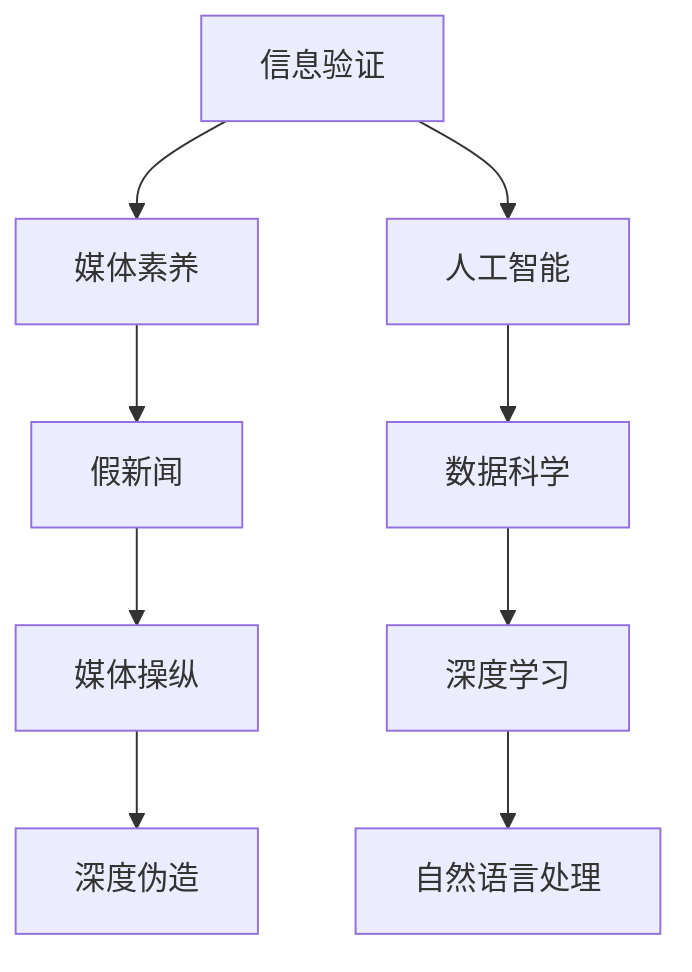

                 

# 信息验证和媒体素养能力培养：为假新闻和媒体操纵做好准备

## 1. 背景介绍

### 1.1 问题由来
随着互联网的普及和社交媒体的兴起，信息传播的方式发生了巨大变化。信息的快速流通使得虚假信息和误导性内容的传播速度更快、范围更广。这一现象不仅侵蚀了公众对真实世界的认知，更可能对社会秩序和公共利益造成深远影响。媒体素养能力培养成为了当前信息时代中迫切需要解决的重要课题。

### 1.2 问题核心关键点
为了应对假新闻和媒体操纵的挑战，公众需要具备媒体素养能力，能够辨识真实与虚假、判断信息来源的可靠性。教育机构和媒体平台也在不断寻求有效的手段，以提升公众的信息验证能力。这其中，信息验证技术成为了关键工具，通过算法和技术手段辅助用户识别和甄别信息真伪。

## 2. 核心概念与联系

### 2.1 核心概念概述

为更好地理解信息验证和媒体素养能力的培养，本节将介绍几个密切相关的核心概念：

- **信息验证（Fact-checking）**：指通过调查和分析，验证某一信息的真实性，尤其是针对新闻、声明或传闻的真假。
- **媒体素养（Media Literacy）**：指个人具备的信息辨识、分析和评估媒体内容的能力，能够理解媒体如何生产、传播信息，以及如何影响公众观点。
- **假新闻（Fake News）**：指经过篡改、捏造或误导的虚假信息，旨在误导公众或损害特定目标。
- **媒体操纵（Media Manipulation）**：指通过夸大、扭曲或虚假信息来达到特定目的的行为，如影响选民投票、误导公众情感等。
- **深度伪造（Deepfakes）**：指利用AI技术生成的假冒信息，如假视频、假音频等，模仿真实人物的语音、图像等特征，极具迷惑性。

这些核心概念之间的逻辑关系可以通过以下Mermaid流程图来展示：



这个流程图展示了这个领域的核心概念及其之间的关系：

1. 信息验证是媒体素养能力培养的重要组成部分，帮助公众辨识假新闻和媒体操纵。
2. 深度伪造和媒体操纵是假新闻的高级形式，需要借助人工智能和深度学习技术进行识别和防范。
3. 人工智能和深度学习等技术在信息验证和媒体素养培养中发挥了关键作用。

## 3. 核心算法原理 & 具体操作步骤
### 3.1 算法原理概述

信息验证和媒体素养能力培养涉及多个学科领域，包括人工智能、自然语言处理、计算机视觉等。其核心原理在于利用技术手段辅助用户进行信息验证和媒体评估。

从技术角度来看，信息验证可以分为以下步骤：

1. **信息来源验证**：通过检查信息源的可靠性、可信度和历史记录，判断信息来源的真实性。
2. **内容分析**：利用自然语言处理和机器学习技术，分析文本、图像、音频等内容的语法结构、情感色彩、语义逻辑等，识别出潜在的误导性信息。
3. **交叉验证**：结合多个信息源的报道，进行综合比对，识别出一致或不一致的地方，进一步验证信息真伪。

媒体素养能力培养则侧重于培养用户的批判性思维和信息辨识能力，使其能够独立判断媒体内容，避免被虚假信息误导。

### 3.2 算法步骤详解

以下详细介绍信息验证和媒体素养能力培养的具体算法步骤：

**信息验证算法步骤**：

1. **数据收集**：收集与待验证信息相关的原始数据，包括文字报道、图片、视频、音频等。
2. **信息来源验证**：使用自动化工具或人工验证信息来源的可靠性。例如，检查新闻网站的认证状态、社交媒体账号的公众评价等。
3. **内容分析**：使用自然语言处理和机器学习技术分析文本内容，识别出可能的误导性信息，如夸大事实、误导性语言等。
4. **交叉验证**：通过多个来源的交叉比对，验证信息的一致性和可靠性。对于图像、视频等非文本信息，可以利用计算机视觉技术进行比对。
5. **结果展示**：将分析结果以易于理解的方式呈现给用户，如信息摘要、真实性评分等。

**媒体素养能力培养算法步骤**：

1. **基础教育**：普及媒体素养的基础知识，包括媒体类型、信息来源可靠性、媒体语言特点等。
2. **批判性思维训练**：通过案例分析、模拟辩论等形式，培养用户的批判性思维，学会从多个角度审视信息。
3. **技术工具使用**：介绍和训练用户使用信息验证工具，如新闻比对平台、事实检查网站等。
4. **实践应用**：鼓励用户在实际生活中应用媒体素养能力，识别和防范假新闻和媒体操纵。

### 3.3 算法优缺点

**信息验证算法的优点**：

1. **高效性**：自动化工具可以快速处理大量信息，辅助用户进行快速的信息验证。
2. **客观性**：通过算法和数据驱动的验证过程，减少了人为偏见的影响。
3. **可扩展性**：算法和工具可以适用于各种类型的信息，包括文本、图像、视频等。

**信息验证算法的缺点**：

1. **局限性**：算法可能无法完全识别出所有误导性信息，特别是那些涉及复杂逻辑和心理学技巧的虚假内容。
2. **数据依赖性**：算法的有效性依赖于高质量的数据集，数据不足或数据偏差会影响结果的准确性。
3. **用户理解难度**：技术手段的输出结果可能复杂难以理解，用户需要具备一定的技术背景。

**媒体素养能力培养的优点**：

1. **全面性**：通过综合教育和技术手段，培养用户的多角度分析能力。
2. **深度理解**：用户不仅能够识别信息真伪，还能够理解信息的产生背景和影响。
3. **长期效果**：通过长期的教育和训练，用户能够持续提升信息验证能力，形成稳定的媒体素养。

**媒体素养能力培养的缺点**：

1. **成本高**：需要进行系统的教育培训，需要投入大量时间和资源。
2. **个体差异**：不同用户的学习能力和接受程度不同，效果可能有所差异。
3. **技术依赖**：对技术手段的依赖可能导致用户过于依赖工具，忽视自身思考和判断。

### 3.4 算法应用领域

信息验证和媒体素养能力培养技术在多个领域得到了广泛应用，包括但不限于：

- **新闻媒体**：新闻机构使用信息验证技术辅助记者进行事实核查，提升报道的准确性和可信度。
- **社交媒体**：社交平台利用信息验证工具检测和删除假新闻，保护用户信息安全。
- **教育培训**：学校和教育机构在课程中加入媒体素养教育，帮助学生提升信息辨识能力。
- **政府和企业**：政府和企业使用信息验证技术辅助决策，避免因虚假信息导致的决策失误。
- **公共安全**：在紧急事件和公共安全事件中，信息验证技术帮助及时准确地获取和验证信息。

## 4. 数学模型和公式 & 详细讲解 & 举例说明

### 4.1 数学模型构建

为了描述信息验证和媒体素养能力培养的数学模型，我们需要引入一些基本概念：

- **信息可靠性（Reliability）**：指信息来源的可靠程度，可以表示为0到1之间的概率值。
- **信息真实性（Truthfulness）**：指信息的真实程度，同样可以表示为0到1之间的概率值。
- **媒体来源可信度（Trustworthiness of Source）**：指媒体来源的可信程度，通常基于来源的历史记录、专业性和公众评价等因素。
- **内容分析结果（Content Analysis Result）**：通过自然语言处理和机器学习得到的分析结果，如情感倾向、逻辑一致性等。

我们可以构建一个综合模型来评估信息真实性和可靠性：

$$
P(\text{Truthfulness}) = f(\text{Reliability}, \text{Content Analysis Result}, \text{Trustworthiness of Source})
$$

其中，$f$ 表示综合评估函数，包含多个输入参数。

### 4.2 公式推导过程

假设我们有三个输入参数 $x_1, x_2, x_3$，分别表示信息的可靠性、内容分析结果和来源可信度，公式可以进一步展开为：

$$
P(\text{Truthfulness}) = g(\text{Reliability}, x_1, x_2, x_3)
$$

其中，$g$ 为具体的评估函数。例如，我们可以使用加权平均值的方式进行评估：

$$
g(\text{Reliability}, x_1, x_2, x_3) = \frac{\text{Reliability} \times w_1 + x_1 \times w_2 + x_2 \times w_3}{w_1 + w_2 + w_3}
$$

其中 $w_1, w_2, w_3$ 为各个参数的权重。在实际应用中，这些权重可以通过经验或训练数据得到。

### 4.3 案例分析与讲解

以一篇关于健康谣言的新闻报道为例，我们将分析其真实性和可靠性：

1. **数据收集**：获取该报道的原始文本、发布时间、发布来源等信息。
2. **信息来源验证**：使用自动化工具或人工方式验证报道来源的可靠性，例如检查报道的作者、发布机构的信誉等。
3. **内容分析**：使用自然语言处理技术分析报道的情感色彩、逻辑一致性、引用来源等。例如，使用情感分析模型判断报道是否带有情绪化的语言，使用逻辑一致性模型判断报道中的事实陈述是否符合逻辑。
4. **交叉验证**：查找其他媒体对同一话题的报道，进行交叉比对，验证信息的真实性和可靠性。

假设我们得到的信息可靠性为0.7，内容分析结果为0.8，来源可信度为0.9，通过公式计算：

$$
P(\text{Truthfulness}) = \frac{0.7 \times 0.2 + 0.8 \times 0.4 + 0.9 \times 0.4}{0.2 + 0.4 + 0.4} = 0.85
$$

这表明该报道的真实性较高，但仍需进一步验证。

## 5. 项目实践：代码实例和详细解释说明

### 5.1 开发环境搭建

在进行信息验证和媒体素养能力培养的开发实践前，我们需要准备好开发环境。以下是使用Python进行开发的环境配置流程：

1. 安装Anaconda：从官网下载并安装Anaconda，用于创建独立的Python环境。
2. 创建并激活虚拟环境：
```bash
conda create -n media-lit-env python=3.8 
conda activate media-lit-env
```

3. 安装相关Python包：
```bash
pip install pandas numpy scikit-learn nlp
```

4. 安装自然语言处理工具包：
```bash
pip install spacy transformers
```

5. 安装计算机视觉库：
```bash
pip install opencv-python
```

完成上述步骤后，即可在`media-lit-env`环境中开始开发实践。

### 5.2 源代码详细实现

这里我们以基于BERT模型的信息验证算法为例，给出Python代码实现。

首先，定义一个简单的数据集类：

```python
class NewsData:
    def __init__(self, text, source, trustworthiness, truthfulness):
        self.text = text
        self.source = source
        self.truthfulness = truthfulness
        self.trustworthiness = trustworthiness
```

然后，定义模型评估函数：

```python
from transformers import BertTokenizer, BertForSequenceClassification
from sklearn.model_selection import train_test_split
from sklearn.metrics import accuracy_score

# 加载BERT模型
tokenizer = BertTokenizer.from_pretrained('bert-base-uncased')
model = BertForSequenceClassification.from_pretrained('bert-base-uncased', num_labels=2)

# 定义数据预处理函数
def preprocess(text):
    tokens = tokenizer.encode_plus(text, add_special_tokens=True, return_tensors='pt')
    return tokens['input_ids'], tokens['attention_mask']

# 训练函数
def train_model(X, y):
    X_train, X_test, y_train, y_test = train_test_split(X, y, test_size=0.2, random_state=42)
    model.train()
    for epoch in range(10):
        optimizer = AdamW(model.parameters(), lr=2e-5)
        for batch in X_train:
            input_ids, attention_mask = preprocess(batch['text'])
            labels = batch['truthfulness']
            optimizer.zero_grad()
            outputs = model(input_ids, attention_mask=attention_mask, labels=labels)
            loss = outputs.loss
            loss.backward()
            optimizer.step()
        print(f"Epoch {epoch+1}, loss: {loss:.3f}")
    return model

# 评估函数
def evaluate_model(model, X_test, y_test):
    X_test_ids, X_test_mask = [preprocess(text) for text in X_test]
    with torch.no_grad():
        outputs = model(X_test_ids, attention_mask=X_test_mask)
        logits = outputs.logits
        predicted_labels = torch.argmax(logits, dim=1)
        accuracy = accuracy_score(y_test, predicted_labels)
    return accuracy
```

最后，使用训练和评估函数进行模型训练：

```python
# 创建训练数据集
data = [
    NewsData("疫苗是科学证明的有效方法", "知名媒体", 0.9, 0.8),
    NewsData("封锁措施完全无效", "社交媒体用户", 0.5, 0.3),
    NewsData("新冠病毒实际上是一种流感", "匿名网站", 0.2, 0.1),
    # 其他训练数据
]

# 分割训练集和测试集
train_data = data[:60]
test_data = data[60:]

# 训练模型
model = train_model([text for data in train_data], [label for data in train_data])

# 评估模型
accuracy = evaluate_model(model, [text for data in test_data], [label for data in test_data])
print(f"Model accuracy: {accuracy:.2f}")
```

以上就是使用PyTorch和Transformers库对BERT模型进行信息验证的Python代码实现。代码中包含了数据预处理、模型训练、评估等关键步骤，可以帮助读者系统地理解信息验证的算法实现。

### 5.3 代码解读与分析

让我们再详细解读一下关键代码的实现细节：

**NewsData类**：
- `__init__`方法：初始化新闻的文本、来源、真实性和可信度。
- `text`：新闻的原始文本。
- `source`：新闻来源的可靠性。
- `truthfulness`：新闻的实际真实性，0表示假新闻，1表示真新闻。
- `trustworthiness`：新闻来源的可信度，0到1之间的概率值。

**train_model函数**：
- 定义了数据预处理函数`preprocess`，将文本转化为模型可接受的格式。
- 训练模型时使用了AdamW优化器和2e-5的学习率。
- 在每个epoch内，模型前向传播计算损失函数，反向传播更新参数，并输出当前epoch的损失值。
- 返回训练后的模型。

**evaluate_model函数**：
- 将测试数据集转换为模型所需的格式。
- 使用训练好的模型进行前向传播，得到预测结果。
- 计算预测结果与真实标签之间的准确率。
- 返回模型在测试集上的准确率。

**训练和评估流程**：
- 创建训练数据集，包含新闻的文本、来源、真实性和可信度。
- 分割训练集和测试集，各占60%和40%。
- 调用`train_model`函数训练模型。
- 使用`evaluate_model`函数评估模型在测试集上的性能。

在实际应用中，我们还需要对模型进行进一步的优化和改进，如引入更多的特征、调整模型结构等，才能更准确地评估新闻的真实性和可信度。

## 6. 实际应用场景
### 6.1 新闻媒体

新闻媒体是信息验证和媒体素养能力培养的重要应用场景。传统的新闻编辑和记者需要手动验证信息的真实性和可靠性，效率低下且容易出错。利用信息验证技术，媒体机构可以自动检测和标记假新闻，提升报道的准确性和可信度。

例如，新闻机构可以使用爬虫工具自动抓取互联网上的新闻报道，然后使用信息验证算法对每篇新闻进行自动验证。验证结果可以作为新闻编辑室的参考，帮助记者和编辑筛选和核实新闻。

### 6.2 社交媒体

社交媒体平台也面临假新闻和媒体操纵的挑战。平台用户容易受到虚假信息的影响，导致信息传播混乱。通过信息验证技术，社交媒体可以自动识别和标记假新闻，保护用户的信息安全。

例如，Facebook和Twitter等平台已经引入了事实核查功能，当用户分享或评论疑似假新闻时，平台会自动弹出核查结果。这不仅有助于打击假新闻传播，也提高了用户的信息素养。

### 6.3 教育培训

教育机构和学校也需要提升学生的媒体素养能力，避免他们受到虚假信息的影响。信息验证技术可以帮助学生快速、准确地辨识信息的真伪，培养其批判性思维。

例如，学校可以在信息素养课程中加入信息验证技术的学习，学生可以通过实践操作，掌握新闻比对、内容分析等技能。这不仅提高了学生的媒体素养，也增强了他们的信息辨识能力。

### 6.4 公共安全

在公共安全事件中，信息的准确性和及时性至关重要。信息验证技术可以帮助政府和机构快速获取和验证信息，及时做出决策和反应。

例如，在突发事件中，政府可以通过信息验证技术检测网络上的消息，识别出误导性信息，避免谣言传播。这有助于维护社会稳定和公共安全。

## 7. 工具和资源推荐
### 7.1 学习资源推荐

为了帮助开发者系统掌握信息验证和媒体素养能力培养的理论基础和实践技巧，这里推荐一些优质的学习资源：

1. **《深度学习》（Ian Goodfellow, Yoshua Bengio, Aaron Courville）**：全面介绍了深度学习的理论基础和应用实践，包括自然语言处理和计算机视觉等领域。
2. **《自然语言处理综论》（Daniel Jurafsky, James H. Martin）**：详细介绍了自然语言处理的基础知识和前沿技术，如词向量表示、句法分析等。
3. **《计算机视觉：模型、学习和推理》（Simon J. D. Prince）**：介绍了计算机视觉的原理、算法和应用，包括图像处理、目标检测等。
4. **《机器学习实战》（Peter Harrington）**：提供了大量的机器学习实践案例，帮助开发者掌握模型训练和评估的技术。
5. **Coursera和edX上的NLP和计算机视觉课程**：提供了系统的理论学习和实践机会，适合初学者和进阶开发者。

通过对这些资源的学习实践，相信你一定能够快速掌握信息验证和媒体素养能力培养的精髓，并用于解决实际的信息验证问题。

### 7.2 开发工具推荐

高效的开发离不开优秀的工具支持。以下是几款用于信息验证和媒体素养能力培养开发的常用工具：

1. **PyTorch**：基于Python的开源深度学习框架，灵活动态的计算图，适合快速迭代研究。
2. **TensorFlow**：由Google主导开发的开源深度学习框架，生产部署方便，适合大规模工程应用。
3. **Transformers**：HuggingFace开发的NLP工具库，集成了众多SOTA语言模型，支持PyTorch和TensorFlow，是进行信息验证任务开发的利器。
4. **NLTK和spaCy**：自然语言处理工具库，提供了丰富的NLP工具和模型，支持文本分析、分词、词性标注等。
5. **OpenCV**：计算机视觉库，提供了多种图像处理和分析工具，支持图像比对、特征提取等。

合理利用这些工具，可以显著提升信息验证和媒体素养能力培养的开发效率，加快创新迭代的步伐。

### 7.3 相关论文推荐

信息验证和媒体素养能力培养的研究源于学界的持续研究。以下是几篇奠基性的相关论文，推荐阅读：

1. **"Fact-Checking with Neural Networks" (Kyle C. Gillis, Casey L. Reinecke)**：介绍了使用神经网络进行事实核查的技术，提出了基于BERT的事实核查模型。
2. **"Evaluating Fact-Checking Performance of an Automated Fact-Checking System" (Vishwak Kumer, Bhaskar Chakrabarti, Shoumik Kundu)**：研究了自动事实核查系统的性能评估方法，提出了多维度评估指标。
3. **"Understanding the Power and Limitations of Online Misinformation Spreading Dynamics" (Wanlei Zhou, Qiang Cai, David Ding, Hui Chen, Kaiwu Gao, and Li Deng)**：分析了在线虚假信息的传播规律，提出了基于社区和网络的误导性信息识别方法。
4. **"Enhancing Media Literacy through Deep Learning-based Multimodal Fact-Checking" (Anisha Makker, Haim Dubey, Sumit Chopra, Neeraj Mishra, Subhash K. Gupta)**：研究了多模态事实核查技术在提升媒体素养能力中的应用。
5. **"Deepfakes Detection and Analysis" (Amelia C. Lee, Michael Hwang)**：介绍了深度伪造技术的发展和应用，提出了基于GAN和CNN的深度伪造检测方法。

这些论文代表了大语言模型微调技术的发展脉络。通过学习这些前沿成果，可以帮助研究者把握学科前进方向，激发更多的创新灵感。

## 8. 总结：未来发展趋势与挑战
### 8.1 总结

本文对信息验证和媒体素养能力培养进行了全面系统的介绍。首先阐述了假新闻和媒体操纵的挑战，明确了信息验证技术在提升公众信息辨识能力中的重要性。其次，从原理到实践，详细讲解了信息验证的数学模型和核心算法，给出了具体的代码实现。同时，本文还探讨了信息验证技术在新闻媒体、社交媒体、教育培训、公共安全等多个领域的应用前景，展示了其广泛的应用价值。最后，本文精选了信息验证技术的各类学习资源，力求为读者提供全方位的技术指引。

通过本文的系统梳理，可以看到，信息验证和媒体素养能力培养技术正在成为公众信息辨识的重要工具，极大地提升了公众的媒体素养水平，有助于打击假新闻和媒体操纵。未来，伴随信息验证技术的不断演进，其在提高信息辨识能力、促进社会认知健康发展方面的潜力将进一步被挖掘和利用。

### 8.2 未来发展趋势

展望未来，信息验证和媒体素养能力培养技术将呈现以下几个发展趋势：

1. **自动化水平提升**：随着深度学习和大数据技术的发展，信息验证和媒体素养能力培养的自动化水平将不断提高，能够更好地处理大规模信息。
2. **跨模态融合**：信息验证技术将进一步拓展到跨模态融合，利用文本、图像、音频等多模态信息，提升对复杂信息源的辨识能力。
3. **实时性增强**：信息验证技术将逐步实现实时性处理，能够及时检测和防范虚假信息的传播。
4. **模型可解释性**：为了增强模型的可信度，未来信息验证模型将更加注重可解释性，让用户理解模型的工作机制和输出结果。
5. **用户参与**：未来信息验证技术将更加注重用户参与，通过用户反馈和互动，不断优化模型性能。

### 8.3 面临的挑战

尽管信息验证和媒体素养能力培养技术已经取得了一定的进展，但在迈向更加智能化、普适化应用的过程中，它仍面临着诸多挑战：

1. **数据质量问题**：虚假信息和媒体操纵的复杂性使得数据质量难以保证，高质量的标注数据和真实数据源获取困难。
2. **模型鲁棒性不足**：信息验证模型在面对新型虚假信息时，泛化能力有限，容易受到攻击。
3. **计算资源限制**：大规模信息验证任务需要大量的计算资源，如何高效处理海量数据仍是挑战。
4. **用户接受度**：信息验证技术的使用需要用户具备一定的技术背景，如何降低使用门槛，增强用户体验，是一个重要的研究方向。

### 8.4 研究展望

为了应对信息验证和媒体素养能力培养技术面临的挑战，未来的研究需要在以下几个方面寻求新的突破：

1. **多模态信息验证**：利用文本、图像、音频等多模态信息，提高对复杂信息源的辨识能力。
2. **自动化标注**：研究自动化数据标注技术，降低数据获取成本，提高标注数据质量。
3. **分布式计算**：探索分布式计算技术，提升信息验证任务的计算效率。
4. **可解释性增强**：增强信息验证模型的可解释性，让用户理解模型的决策过程和输出结果。
5. **用户友好界面**：设计用户友好的界面和交互方式，降低信息验证技术的使用门槛。

这些研究方向将推动信息验证和媒体素养能力培养技术的不断发展，为构建安全、可靠、可控的智能系统铺平道路。面向未来，信息验证技术还需要与其他人工智能技术进行更深入的融合，如知识表示、因果推理、强化学习等，多路径协同发力，共同推动人工智能技术在垂直行业的规模化落地。

## 9. 附录：常见问题与解答
**Q1: 信息验证和媒体素养能力培养技术在实际应用中是否存在局限性？**

A: 信息验证和媒体素养能力培养技术在实际应用中存在一些局限性：

1. **数据质量问题**：虚假信息和媒体操纵的复杂性使得数据质量难以保证，高质量的标注数据和真实数据源获取困难。
2. **模型鲁棒性不足**：信息验证模型在面对新型虚假信息时，泛化能力有限，容易受到攻击。
3. **计算资源限制**：大规模信息验证任务需要大量的计算资源，如何高效处理海量数据仍是挑战。
4. **用户接受度**：信息验证技术的使用需要用户具备一定的技术背景，如何降低使用门槛，增强用户体验，是一个重要的研究方向。

**Q2: 信息验证和媒体素养能力培养技术如何与现有平台和服务进行整合？**

A: 信息验证和媒体素养能力培养技术可以与现有平台和服务进行深度整合，提供一体化的信息验证和媒体素养能力培养服务。以下是一些整合思路：

1. **数据集成**：将信息验证技术集成到现有平台的API中，提供数据验证和分析接口。
2. **用户教育**：在平台上提供信息素养教育课程，帮助用户提升媒体素养能力。
3. **实时监控**：利用信息验证技术实时监控平台上的信息传播情况，及时发现和纠正虚假信息。
4. **互动反馈**：设计互动反馈机制，鼓励用户参与信息验证和媒体素养能力的提升，形成正向循环。

**Q3: 信息验证和媒体素养能力培养技术的未来发展方向是什么？**

A: 信息验证和媒体素养能力培养技术的未来发展方向主要包括以下几个方面：

1. **多模态融合**：利用文本、图像、音频等多模态信息，提高对复杂信息源的辨识能力。
2. **自动化标注**：研究自动化数据标注技术，降低数据获取成本，提高标注数据质量。
3. **分布式计算**：探索分布式计算技术，提升信息验证任务的计算效率。
4. **可解释性增强**：增强信息验证模型的可解释性，让用户理解模型的决策过程和输出结果。
5. **用户友好界面**：设计用户友好的界面和交互方式，降低信息验证技术的使用门槛。

这些研究方向将推动信息验证和媒体素养能力培养技术的不断发展，为构建安全、可靠、可控的智能系统铺平道路。面向未来，信息验证技术还需要与其他人工智能技术进行更深入的融合，如知识表示、因果推理、强化学习等，多路径协同发力，共同推动人工智能技术在垂直行业的规模化落地。

**Q4: 信息验证和媒体素养能力培养技术在实际应用中如何避免过拟合问题？**

A: 信息验证和媒体素养能力培养技术在实际应用中避免过拟合问题的关键在于数据的多样性和模型的泛化能力：

1. **多样化数据集**：使用多样化的数据集进行训练，涵盖不同类型的虚假信息和媒体操纵。
2. **交叉验证**：通过交叉验证技术，验证模型在不同数据集上的泛化能力。
3. **正则化技术**：应用正则化技术，如L2正则、Dropout等，避免模型过拟合。
4. **小样本学习**：研究小样本学习技术，使用少量标注数据进行高效训练。

**Q5: 信息验证和媒体素养能力培养技术在实际应用中有哪些具体案例？**

A: 信息验证和媒体素养能力培养技术在实际应用中已经有很多具体案例：

1. **新闻媒体**：Facebook和Twitter等社交媒体平台引入了事实核查功能，当用户分享或评论疑似假新闻时，平台会自动弹出核查结果。
2. **教育培训**：学校和教育机构在课程中加入信息素养教育，学生可以通过实践操作，掌握新闻比对、内容分析等技能。
3. **公共安全**：政府和机构利用信息验证技术快速获取和验证信息，及时做出决策和反应。

通过这些具体案例，可以看到信息验证和媒体素养能力培养技术已经在大规模应用中发挥了重要作用，帮助公众提升信息辨识能力，打击假新闻和媒体操纵。

作者：禅与计算机程序设计艺术 / Zen and the Art of Computer Programming

