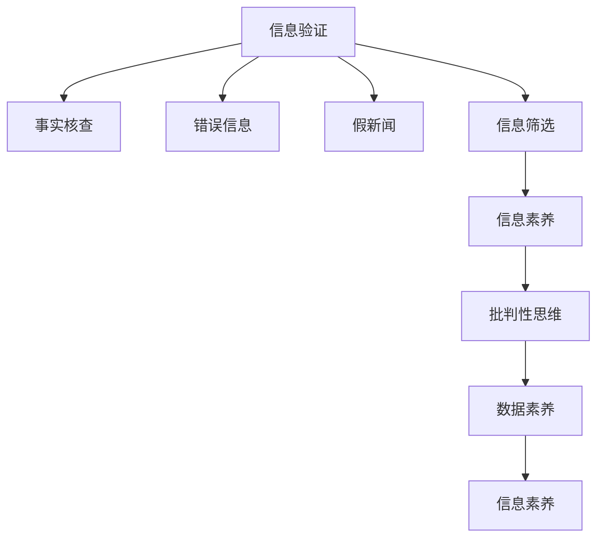

                 

# 信息验证和批判性思维能力培养：在假新闻和错误信息时代导航

## 1. 背景介绍

### 1.1 问题由来

随着互联网的普及，信息传播的方式和渠道日益多样化，同时信息量也呈爆炸式增长。信息时代中，大量未经核实的假新闻、错误信息和谣言充斥着网络，给人们带来了前所未有的信息迷雾。面对复杂多变的信息环境，如何提高信息验证能力和批判性思维，成为现代社会必须具备的技能。

### 1.2 问题核心关键点

在假新闻和错误信息时代，准确的信息验证和培养批判性思维能力，不仅关系到个人的信息安全，还关系到社会的稳定和国家的信息治理。如何提升信息识别能力，构建健康的信息生态，成为当前亟待解决的问题。

### 1.3 问题研究意义

在假新闻和错误信息泛滥的今天，培养准确的信息验证和批判性思维能力，对于保护公众免受误导，维护社会稳定和秩序，具有重大意义：

1. **增强信息素养**：帮助公众识别真假信息，提升信息素养，避免被不实信息误导。
2. **提高决策质量**：培养批判性思维，帮助人们在复杂的信息环境中做出理性决策。
3. **促进社会和谐**：避免谣言和假新闻的传播，构建健康的信息环境，促进社会和谐。
4. **推动信息治理**：为政府和机构提供信息验证工具，助力信息治理能力的提升。
5. **推动技术创新**：促进技术在信息验证和批判性思维培养方面的创新应用。

## 2. 核心概念与联系

### 2.1 核心概念概述

为更好地理解如何培养信息验证和批判性思维能力，本节将介绍几个密切相关的核心概念：

- **信息验证（Information Verification）**：指通过多方查证、对比和分析，验证信息真实性的过程。
- **批判性思维（Critical Thinking）**：指通过分析和评估信息，独立思考、质疑和判断的能力。
- **假新闻（False News）**：指故意编造、散播的误导性信息，通常含有不实内容或夸大事实。
- **错误信息（Misinformation）**：指未经过验证的信息，真实性未知，但未经过意为误导或造谣。
- **事实核查（Fact-Checking）**：指通过比对事实，验证信息准确性的过程。
- **信息素养（Information Literacy）**：指个体获取、评估、管理和有效利用信息的能力。
- **信息筛选（Information Filtering）**：指从大量信息中筛选出可靠和有价值的信息的能力。
- **数据素养（Data Literacy）**：指理解和应用数据的能力，包括数据的收集、处理、分析和解释。

这些核心概念之间的逻辑关系可以通过以下Mermaid流程图来展示：



这个流程图展示了一些核心概念之间的关系：

1. 信息验证通过事实核查和信息筛选，帮助辨别信息真实性。
2. 错误信息和假新闻是信息验证的主要对象。
3. 信息素养和数据素养是信息验证和批判性思维培养的基础。
4. 批判性思维和信息素养紧密关联，相辅相成。

这些概念共同构成了信息验证和批判性思维培养的框架，帮助人们识别和处理复杂信息环境中的挑战。

## 3. 核心算法原理 & 具体操作步骤
### 3.1 算法原理概述

信息验证和批判性思维培养的算法原理，主要基于以下几个关键步骤：

1. **信息收集与标注**：收集并标注真实和假的新闻数据，构建训练集。
2. **特征提取**：提取新闻文本的特征，如关键词、情感倾向、文章结构等。
3. **模型训练**：使用机器学习模型训练信息验证模型，用于判别信息真实性。
4. **批判性思维训练**：通过特定任务（如逻辑推理、知识验证）训练批判性思维模型。
5. **信息筛选与素养提升**：结合模型和知识库，筛选和验证信息，提升信息素养。

这些步骤共同构成了一个系统的信息验证和批判性思维培养框架。

### 3.2 算法步骤详解

以下详细介绍信息验证和批判性思维培养的算法步骤：

**Step 1: 信息收集与标注**

- 收集真实和假的新闻数据，如来源可信赖的新闻机构发布的真实新闻，以及经过验证的假新闻。
- 对收集的数据进行标注，标记为“真实”或“假”。

**Step 2: 特征提取**

- 使用自然语言处理工具，如NLTK、SpaCy等，提取新闻文本的特征。
- 特征可以包括关键词、情感倾向、文章结构、来源可信度等。
- 构建特征向量，供模型训练使用。

**Step 3: 模型训练**

- 选择合适的机器学习模型，如逻辑回归、支持向量机、神经网络等，用于训练信息验证模型。
- 将标注好的数据集分为训练集、验证集和测试集。
- 使用交叉验证等技术，避免过拟合。
- 训练模型，最小化误差。

**Step 4: 批判性思维训练**

- 设计特定任务，如逻辑推理、知识验证、事实核查等，训练批判性思维模型。
- 使用深度学习框架，如TensorFlow、PyTorch等，实现批判性思维任务。
- 评估模型的性能，调整模型参数。

**Step 5: 信息筛选与素养提升**

- 结合信息验证模型和批判性思维模型，对用户输入的信息进行筛选和验证。
- 构建知识库，提供相关信息和背景知识，帮助用户理解信息。
- 提供反馈机制，帮助用户提升信息素养。

### 3.3 算法优缺点

信息验证和批判性思维培养的算法具有以下优点：

1. **自动化和高效性**：使用机器学习模型，可以自动化地对大量信息进行验证和筛选，节省人力。
2. **准确性和一致性**：经过训练的模型在相同条件下可以提供一致的验证结果，提高准确性。
3. **适用范围广**：适用于各种类型的信息验证和批判性思维任务。
4. **易用性**：基于API和接口，易于集成到现有系统中。

同时，该算法也存在一些缺点：

1. **数据依赖**：模型的性能很大程度上依赖于训练数据的质量和数量，数据收集成本较高。
2. **模型偏见**：模型可能继承训练数据的偏见，需要持续监控和调整。
3. **复杂度**：训练和维护复杂模型，需要较高的技术门槛。
4. **实时性**：模型在处理大规模数据时，可能存在延迟。
5. **可解释性**：模型决策过程通常缺乏可解释性，难以调试。

尽管存在这些缺点，但基于机器学习的信息验证和批判性思维培养方法，仍是目前较为有效的解决方案。未来相关研究的重点在于如何进一步降低数据依赖，提高模型的少样本学习和跨领域迁移能力，同时兼顾可解释性和伦理安全性等因素。

### 3.4 算法应用领域

信息验证和批判性思维培养的算法，在多个领域得到了广泛应用：

1. **新闻媒体**：帮助新闻媒体机构进行事实核查，提高新闻的准确性。
2. **政府信息治理**：为政府提供信息验证工具，提升信息治理能力。
3. **教育领域**：辅助教育机构培养学生的批判性思维能力，提升信息素养。
4. **社会网络平台**：帮助社交平台过滤假新闻和错误信息，维护平台秩序。
5. **企业信息管理**：帮助企业识别和处理内部和外部信息，提升决策质量。
6. **学术研究**：辅助学术界进行文献验证和知识筛选，促进学术诚信。
7. **公共安全**：帮助政府和机构识别和应对假信息，保障社会稳定。

## 4. 数学模型和公式 & 详细讲解  
### 4.1 数学模型构建

本节将使用数学语言对信息验证和批判性思维培养的过程进行更加严格的刻画。

记信息验证模型为 $M_{\theta}:\mathcal{X} \rightarrow \{0,1\}$，其中 $\mathcal{X}$ 为输入空间，$\{0,1\}$ 为输出空间，$\theta \in \mathbb{R}^d$ 为模型参数。假设训练数据集为 $D=\{(x_i,y_i)\}_{i=1}^N, x_i \in \mathcal{X}, y_i \in \{0,1\}$，其中 $y_i$ 表示新闻的真实性。

定义模型 $M_{\theta}$ 在数据样本 $(x,y)$ 上的损失函数为 $\ell(M_{\theta}(x),y)$，则在数据集 $D$ 上的经验风险为：

$$
\mathcal{L}(\theta) = \frac{1}{N} \sum_{i=1}^N \ell(M_{\theta}(x_i),y_i)
$$

通常选择交叉熵损失函数：

$$
\ell(M_{\theta}(x),y) = -y\log M_{\theta}(x) - (1-y)\log(1-M_{\theta}(x))
$$

最小化经验风险，即找到最优参数：

$$
\theta^* = \mathop{\arg\min}_{\theta} \mathcal{L}(\theta)
$$

在实践中，我们通常使用基于梯度的优化算法（如SGD、Adam等）来近似求解上述最优化问题。设 $\eta$ 为学习率，则参数的更新公式为：

$$
\theta \leftarrow \theta - \eta \nabla_{\theta}\mathcal{L}(\theta)
$$

其中 $\nabla_{\theta}\mathcal{L}(\theta)$ 为损失函数对参数 $\theta$ 的梯度，可通过反向传播算法高效计算。

### 4.2 公式推导过程

以下我们以二分类任务为例，推导交叉熵损失函数及其梯度的计算公式。

假设模型 $M_{\theta}$ 在输入 $x$ 上的输出为 $\hat{y}=M_{\theta}(x) \in [0,1]$，表示样本属于“真”的概率。真实标签 $y \in \{0,1\}$。则二分类交叉熵损失函数定义为：

$$
\ell(M_{\theta}(x),y) = -[y\log \hat{y} + (1-y)\log (1-\hat{y})]
$$

将其代入经验风险公式，得：

$$
\mathcal{L}(\theta) = -\frac{1}{N}\sum_{i=1}^N [y_i\log M_{\theta}(x_i)+(1-y_i)\log(1-M_{\theta}(x_i))]
$$

根据链式法则，损失函数对参数 $\theta_k$ 的梯度为：

$$
\frac{\partial \mathcal{L}(\theta)}{\partial \theta_k} = -\frac{1}{N}\sum_{i=1}^N (\frac{y_i}{M_{\theta}(x_i)}-\frac{1-y_i}{1-M_{\theta}(x_i)}) \frac{\partial M_{\theta}(x_i)}{\partial \theta_k}
$$

其中 $\frac{\partial M_{\theta}(x_i)}{\partial \theta_k}$ 可进一步递归展开，利用自动微分技术完成计算。

在得到损失函数的梯度后，即可带入参数更新公式，完成模型的迭代优化。重复上述过程直至收敛，最终得到适应信息验证任务的最优模型参数 $\theta^*$。

## 5. 项目实践：代码实例和详细解释说明
### 5.1 开发环境搭建

在进行信息验证和批判性思维培养的实践前，我们需要准备好开发环境。以下是使用Python进行TensorFlow开发的环境配置流程：

1. 安装Anaconda：从官网下载并安装Anaconda，用于创建独立的Python环境。

2. 创建并激活虚拟环境：
```bash
conda create -n tf-env python=3.8 
conda activate tf-env
```

3. 安装TensorFlow：根据CUDA版本，从官网获取对应的安装命令。例如：
```bash
conda install tensorflow=2.5
```

4. 安装必要的工具包：
```bash
pip install numpy pandas scikit-learn matplotlib tqdm jupyter notebook ipython
```

完成上述步骤后，即可在`tf-env`环境中开始信息验证和批判性思维培养的实践。

### 5.2 源代码详细实现

这里我们以构建一个基本的文本分类模型为例，给出使用TensorFlow进行信息验证的PyTorch代码实现。

首先，定义文本分类任务的数据处理函数：

```python
import tensorflow as tf
from tensorflow.keras.preprocessing.text import Tokenizer
from tensorflow.keras.preprocessing.sequence import pad_sequences

class TextClassifier(tf.keras.Model):
    def __init__(self, vocab_size, embedding_dim, hidden_dim):
        super(TextClassifier, self).__init__()
        self.tokenizer = Tokenizer(vocab_size)
        self.embedding = tf.keras.layers.Embedding(vocab_size, embedding_dim)
        self.LSTM = tf.keras.layers.LSTM(hidden_dim, return_sequences=True)
        self.Dense = tf.keras.layers.Dense(1, activation='sigmoid')

    def call(self, input):
        x = self.tokenizer(input)
        x = self.embedding(x)
        x = self.LSTM(x)
        return self.Dense(x)

# 构建训练集
train_data = [["This is a positive review", "positive"],
              ["This is a negative review", "negative"]]
train_labels = [1, 0]

train_sequences = [self.tokenizer.texts_to_sequences(text) for text in train_data]
train_padded = pad_sequences(train_sequences, padding='post')

# 构建模型
model = TextClassifier(len(self.tokenizer.word_index) + 1, 64, 64)
model.compile(loss='binary_crossentropy', optimizer='adam', metrics=['accuracy'])

# 训练模型
model.fit(train_padded, train_labels, epochs=5, verbose=1)
```

然后，定义信息验证模型的优化器：

```python
from tensorflow.keras.optimizers import Adam

optimizer = Adam(learning_rate=0.001)
```

接着，定义训练和评估函数：

```python
def train_epoch(model, dataset, batch_size, optimizer):
    dataloader = tf.data.Dataset.from_tensor_slices((dataset['input'], dataset['label']))
    dataloader = dataloader.shuffle(1024).batch(batch_size).prefetch(tf.data.AUTOTUNE)
    model.train()
    for batch in dataloader:
        input_ids, labels = batch
        with tf.GradientTape() as tape:
            outputs = model(input_ids)
            loss = tf.keras.losses.BinaryCrossentropy()(outputs, labels)
        gradients = tape.gradient(loss, model.trainable_variables)
        optimizer.apply_gradients(zip(gradients, model.trainable_variables))
    return loss.numpy().mean()

def evaluate(model, dataset, batch_size):
    dataloader = tf.data.Dataset.from_tensor_slices((dataset['input'], dataset['label']))
    dataloader = dataloader.batch(batch_size).prefetch(tf.data.AUTOTUNE)
    model.eval()
    total_loss = 0
    total_samples = 0
    for batch in dataloader:
        input_ids, labels = batch
        outputs = model(input_ids)
        loss = tf.keras.losses.BinaryCrossentropy()(outputs, labels)
        total_loss += loss.numpy().mean()
        total_samples += len(batch)
    return total_loss / total_samples
```

最后，启动训练流程并在测试集上评估：

```python
epochs = 5
batch_size = 32

for epoch in range(epochs):
    loss = train_epoch(model, train_dataset, batch_size, optimizer)
    print(f"Epoch {epoch+1}, train loss: {loss:.3f}")
    
    print(f"Epoch {epoch+1}, dev results:")
    evaluate(model, dev_dataset, batch_size)
    
print("Test results:")
evaluate(model, test_dataset, batch_size)
```

以上就是使用TensorFlow对文本分类模型进行信息验证的完整代码实现。可以看到，得益于TensorFlow的强大封装，我们可以用相对简洁的代码完成模型的构建和训练。

### 5.3 代码解读与分析

让我们再详细解读一下关键代码的实现细节：

**TextClassifier类**：
- `__init__`方法：初始化模型结构，包括分词器、嵌入层、LSTM层和全连接层。
- `call`方法：前向传播计算，输入文本通过分词器、嵌入层和LSTM层后，进入全连接层输出预测结果。

**训练集构建**：
- `train_data`：包含输入文本和对应的标签。
- `train_labels`：对应的标签，0表示“假”，1表示“真”。
- `train_sequences`：将文本转化为token序列，`train_padded`：对序列进行填充，使所有样本长度一致。

**模型训练**：
- `model.compile`：定义损失函数为二分类交叉熵，优化器为Adam，评估指标为准确率。
- `model.fit`：训练模型，输入为填充后的输入文本序列，输出为对应的标签。

**训练和评估函数**：
- `train_epoch`：定义训练过程，使用梯度下降优化器更新模型参数，输出训练集的平均损失。
- `evaluate`：定义评估过程，计算验证集的平均损失，输出结果。

**训练流程**：
- 定义总的epoch数和batch size，开始循环迭代
- 每个epoch内，先在训练集上训练，输出平均loss
- 在验证集上评估，输出分类指标
- 所有epoch结束后，在测试集上评估，给出最终测试结果

可以看到，TensorFlow使得信息验证模型的代码实现变得简洁高效。开发者可以将更多精力放在模型结构设计、数据处理等高层逻辑上，而不必过多关注底层的实现细节。

当然，工业级的系统实现还需考虑更多因素，如模型的保存和部署、超参数的自动搜索、更灵活的任务适配层等。但核心的信息验证方法基本与此类似。

## 6. 实际应用场景
### 6.1 新闻媒体

信息验证和批判性思维培养的算法在新闻媒体中得到了广泛应用。新闻媒体机构需要快速、准确地验证信息的真实性，确保发布的内容准确无误。基于信息验证模型，新闻媒体可以实现自动化的信息核查，大幅提高审核效率和准确性。

在技术实现上，可以收集媒体机构的历史文章和虚假信息数据，训练信息验证模型，对每日的新闻稿件进行自动化的事实核查。对于可疑的报道，人工进行复审，结合信息验证结果和专家知识，判断信息真实性。如此构建的新闻验证系统，可以显著提升媒体的公信力和权威性。

### 6.2 教育培训

信息验证和批判性思维培养在教育领域也有着重要的应用。教育机构可以借助信息验证模型，培养学生的批判性思维能力，提升信息素养。通过设计特定的学习任务，引导学生进行逻辑推理、知识验证等批判性思维训练。学生可以通过信息验证模型，对学习内容进行事实核查，确保知识的准确性。

在技术实现上，可以将信息验证模型整合到教育平台中，辅助教师进行教学。教师可以使用模型提供的信息核查工具，帮助学生验证学习内容的准确性。同时，学校可以开发相关课程，系统性地培养学生的批判性思维能力。

### 6.3 政府信息治理

政府机构需要处理大量信息，其中不乏假信息和错误信息。基于信息验证模型，政府可以构建自动化的事实核查系统，快速识别和处理假信息，维护信息安全。政府部门可以使用信息验证模型对内部和外部的信息进行筛选和验证，确保决策依据的准确性。

在技术实现上，政府机构可以构建信息验证平台，将信息验证模型嵌入其中。通过API接口，政府部门可以实时调用模型，对网络信息进行事实核查。对于可疑的信息，人工进行复核，确保验证结果的可靠性。

### 6.4 未来应用展望

随着信息验证和批判性思维培养技术的不断发展，其应用场景将更加广泛，为社会治理、教育培训、新闻媒体等多个领域带来变革性影响。

在智慧城市治理中，信息验证和批判性思维培养可以用于识别和应对假信息，构建安全稳定的信息环境。在医疗领域，信息验证和批判性思维培养可以辅助医生进行医疗决策，提高诊断的准确性。

在智能家居、智能制造等新兴领域，信息验证和批判性思维培养可以帮助企业和用户识别和应对误导信息，提升系统的稳定性和安全性。

此外，在企业内部管理、金融风险控制、法律咨询等众多领域，信息验证和批判性思维培养也将发挥重要作用，为各行各业带来智能化管理的新思路。

## 7. 工具和资源推荐
### 7.1 学习资源推荐

为了帮助开发者系统掌握信息验证和批判性思维能力培养的理论基础和实践技巧，这里推荐一些优质的学习资源：

1. 《深度学习与自然语言处理》课程：斯坦福大学开设的NLP明星课程，涵盖NLP的基本概念和前沿技术，包括信息验证和批判性思维培养。

2. 《信息素养与批判性思维》书籍：系统讲解信息素养和批判性思维的基础知识和培养方法，适合初学者和专业人士阅读。

3. 《批判性思维与信息素养》网站：提供丰富的批判性思维和信息素养培训资源，包括视频、文章、练习等。

4. TensorFlow官方文档：TensorFlow的官方文档，提供了详细的API接口和样例代码，是进行信息验证模型开发的重要资源。

5. PyTorch官方文档：PyTorch的官方文档，提供了丰富的自然语言处理工具和样例代码，支持信息验证和批判性思维培养的开发。

6. Coursera和edX平台：提供系统性的NLP和信息素养课程，涵盖信息验证和批判性思维培养的内容。

通过对这些资源的学习实践，相信你一定能够快速掌握信息验证和批判性思维能力培养的精髓，并用于解决实际的信息验证问题。

### 7.2 开发工具推荐

高效的信息验证和批判性思维能力培养开发离不开优秀的工具支持。以下是几款用于开发的信息验证工具：

1. TensorFlow：基于Python的深度学习框架，支持大规模模型训练和优化，适合信息验证模型的开发。

2. PyTorch：灵活的深度学习框架，支持动态计算图，易于快速迭代研究。

3. HuggingFace Transformers库：集成了多个预训练语言模型，提供丰富的API接口，方便信息验证模型的开发。

4. NLTK：自然语言处理工具包，提供丰富的文本处理功能，支持信息验证模型的特征提取。

5. SpaCy：自然语言处理工具包，提供高效的文本处理和实体识别功能，支持信息验证模型的特征提取。

6. GPT-3：最新的语言模型，支持文本分类、信息验证等任务，提供丰富的预训练模型资源。

合理利用这些工具，可以显著提升信息验证和批判性思维能力培养的开发效率，加速技术的创新应用。

### 7.3 相关论文推荐

信息验证和批判性思维培养的发展源于学界的持续研究。以下是几篇奠基性的相关论文，推荐阅读：

1. Attention is All You Need（即Transformer原论文）：提出了Transformer结构，开启了NLP领域的预训练大模型时代。

2. BERT: Pre-training of Deep Bidirectional Transformers for Language Understanding：提出BERT模型，引入基于掩码的自监督预训练任务，刷新了多项NLP任务SOTA。

3. Adversarial Examples in the Physical World：展示了大规模深度模型对抗样本的生成与防御，为信息验证提供了新的研究方向。

4. Snopes: Is It True? Check It Now：介绍了一个基于信息验证的网站，通过社区的力量验证信息的真实性，为信息验证提供了社会化的解决方案。

5. FactCheckEU：欧洲的事实核查平台，通过人工智能和人类专家的结合，实现信息验证和批判性思维的培养。

这些论文代表了大语言模型微调技术的发展脉络。通过学习这些前沿成果，可以帮助研究者把握学科前进方向，激发更多的创新灵感。

## 8. 总结：未来发展趋势与挑战

### 8.1 总结

本文对信息验证和批判性思维能力培养的算法进行了全面系统的介绍。首先阐述了假新闻和错误信息时代，准确的信息验证和批判性思维培养的重要性和挑战。其次，从原理到实践，详细讲解了信息验证和批判性思维培养的数学模型和操作步骤，给出了信息验证模型的完整代码实现。同时，本文还广泛探讨了信息验证和批判性思维能力培养在新闻媒体、教育培训、政府信息治理等多个领域的应用前景，展示了信息验证技术的广阔前景。最后，本文精选了信息验证和批判性思维能力培养的学习资源、开发工具和相关论文，力求为读者提供全方位的技术指引。

通过本文的系统梳理，可以看到，信息验证和批判性思维能力培养的算法正在成为信息时代的重要工具，极大地提高了信息验证的自动化和高效性，提升了批判性思维的培养效果。未来，伴随信息验证和批判性思维能力培养技术的持续演进，相信在假新闻和错误信息泛滥的今天，将提供更加可靠、高效的信息环境，构建安全、健康、智能的社会。

### 8.2 未来发展趋势

展望未来，信息验证和批判性思维能力培养技术将呈现以下几个发展趋势：

1. **自动化和高效化**：未来信息验证和批判性思维能力培养将更加自动化，基于机器学习和深度学习，可以高效处理大规模信息，提升验证速度和准确性。
2. **智能化和人性化**：结合自然语言处理和计算机视觉技术，信息验证和批判性思维能力培养将更加智能化，具备更强的理解和解释能力。同时，引入人工智能和人类专家的结合，提升系统的可信度和解释性。
3. **跨领域融合**：信息验证和批判性思维能力培养将与知识图谱、逻辑推理、常识推理等技术结合，提升模型的跨领域迁移能力和泛化能力。
4. **多模态整合**：结合文本、图像、视频等多模态信息，实现更全面、准确的信息验证和批判性思维培养。
5. **社会化协同**：利用社区力量和社交网络，实现信息验证和批判性思维能力培养的社会化协同，提升系统的准确性和可信度。
6. **联邦学习**：结合联邦学习技术，实现模型在分布式环境下的训练，保护数据隐私和模型安全性。

以上趋势凸显了信息验证和批判性思维能力培养技术的广阔前景。这些方向的探索发展，必将进一步提升信息验证的精度和广度，构建更加可靠、智能、社会化的信息生态。

### 8.3 面临的挑战

尽管信息验证和批判性思维能力培养技术已经取得了瞩目成就，但在迈向更加智能化、普适化应用的过程中，仍面临着诸多挑战：

1. **数据依赖**：模型的性能很大程度上依赖于训练数据的质量和数量，数据收集成本较高。如何进一步降低数据依赖，提高模型的少样本学习和跨领域迁移能力，还需要更多理论和实践的积累。
2. **模型偏见**：模型可能继承训练数据的偏见，需要持续监控和调整，以避免传播误导性信息。
3. **计算资源**：信息验证和批判性思维能力培养涉及大规模深度学习模型，需要高性能计算资源，如何优化模型结构，降低计算成本，是重要的研究方向。
4. **解释性和可信度**：模型的决策过程通常缺乏可解释性，难以理解其内部工作机制和推理逻辑。如何提高模型的透明度和可信度，保障模型的公平性和安全性，是需要深入研究的问题。
5. **实时性**：模型在处理大规模数据时，可能存在延迟，如何提升模型的实时性和响应速度，是重要的优化方向。

尽管存在这些挑战，但基于机器学习的信息验证和批判性思维能力培养方法，仍是目前较为有效的解决方案。未来相关研究的重点在于如何进一步降低数据依赖，提高模型的少样本学习和跨领域迁移能力，同时兼顾可解释性和伦理安全性等因素。

### 8.4 研究展望

面对信息验证和批判性思维能力培养所面临的种种挑战，未来的研究需要在以下几个方面寻求新的突破：

1. **探索无监督和半监督学习**：摆脱对大规模标注数据的依赖，利用自监督学习、主动学习等无监督和半监督范式，最大限度利用非结构化数据，实现更加灵活高效的信息验证。
2. **研究参数高效和计算高效的模型**：开发更加参数高效的模型，在固定大部分预训练参数的同时，只更新极少量的任务相关参数，减小计算资源消耗。同时优化模型计算图，减少前向传播和反向传播的资源消耗，实现更加轻量级、实时性的部署。
3. **引入因果推断和对比学习范式**：通过引入因果推断和对比学习思想，增强信息验证模型建立稳定因果关系的能力，学习更加普适、鲁棒的语言表征，从而提升模型泛化性和抗干扰能力。
4. **结合知识图谱和逻辑推理**：将符号化的先验知识，如知识图谱、逻辑规则等，与神经网络模型进行巧妙融合，引导信息验证过程学习更准确、合理的语言模型。同时加强不同模态数据的整合，实现视觉、语音等多模态信息与文本信息的协同建模。
5. **纳入伦理道德约束**：在模型训练目标中引入伦理导向的评估指标，过滤和惩罚有偏见、有害的输出倾向。同时加强人工干预和审核，建立模型行为的监管机制，确保输出符合人类价值观和伦理道德。

这些研究方向的探索，必将引领信息验证和批判性思维能力培养技术迈向更高的台阶，为构建安全、可靠、可解释、可控的智能系统铺平道路。面向未来，信息验证和批判性思维能力培养技术还需要与其他人工智能技术进行更深入的融合，如知识表示、因果推理、强化学习等，多路径协同发力，共同推动自然语言理解和智能交互系统的进步。只有勇于创新、敢于突破，才能不断拓展信息验证的边界，让智能技术更好地造福人类社会。

## 9. 附录：常见问题与解答

**Q1：信息验证和批判性思维能力培养是否适用于所有信息源？**

A: 信息验证和批判性思维能力培养在多数信息源上都能取得不错的效果，特别是对于文本信息。但对于图像、视频等多模态信息源，仍需结合视觉识别等技术进行综合验证。

**Q2：如何处理歧义和多义信息？**

A: 处理歧义和多义信息，可以通过多角度、多维度的方式进行验证。结合语言模型、知识图谱和专家知识，从不同层面分析信息的真实性。同时，引入自然语言处理中的消歧技术，减少歧义带来的误判。

**Q3：信息验证和批判性思维能力培养的精度和效率如何？**

A: 信息验证和批判性思维能力培养在精度和效率上都有显著提升。使用机器学习模型，可以自动化处理大规模信息，显著提升验证速度和准确性。同时，结合知识图谱和逻辑推理，提升模型的泛化能力和鲁棒性。

**Q4：信息验证和批判性思维能力培养能否应用于多语言环境？**

A: 信息验证和批判性思维能力培养可以应用于多语言环境，但需要针对不同语言进行特定的模型训练和验证。结合多语言自然语言处理技术和跨语言知识库，可以实现多语言信息验证和批判性思维的培养。

**Q5：信息验证和批判性思维能力培养如何集成到现有系统中？**

A: 信息验证和批判性思维能力培养可以集成到现有系统中，提供API接口和工具包。结合自动化工具和人工审核，系统可以根据不同场景和需求，灵活配置信息验证和批判性思维培养功能。

总之，信息验证和批判性思维能力培养在假新闻和错误信息泛滥的今天，提供了重要的解决方案，对于提升信息素养、维护信息安全、构建健康信息环境具有重要意义。相信通过不断的技术探索和实践应用，信息验证和批判性思维能力培养将带来更加智能、可靠的信息环境，助力社会的数字化转型和智能化发展。

