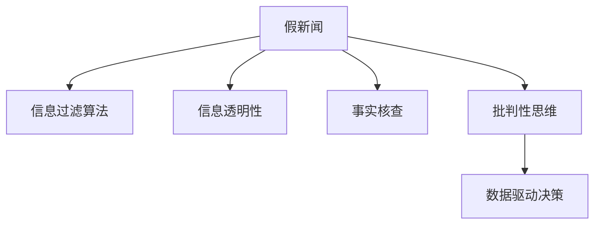

                 

# 信息验证和批判性思维能力培养：在假新闻和错误信息时代导航

在假新闻和错误信息泛滥的今天，掌握信息验证和批判性思维能力变得尤为重要。通过数据驱动的策略和逻辑推理，我们能够更高效地辨别真伪，减少被误导的风险。本文将详细介绍信息验证的核心理念和实践技巧，并结合批判性思维，帮助读者在复杂的信息海洋中导航。

## 1. 背景介绍

### 1.1 问题由来

随着互联网的普及和社交媒体的发展，信息传播的速度和范围达到了前所未有的高度。然而，信息的质量和真实性却大相径庭。假新闻、恶意信息、误导性内容充斥网络，给社会舆论和公众决策带来了巨大影响。如何在这片信息混沌中识别真相、辨别假冒，成为每位公民和从业者的必修课。

### 1.2 问题核心关键点

信息验证的核心在于建立一套系统的、可重复的、有效的证据评估框架。它涉及对信息的来源、内容、结构和传播方式进行全面剖析，确保结论的可靠性和逻辑的严密性。

信息验证的五大核心要素包括：
1. **来源可信度**：信息是否来自可信的机构或个人。
2. **内容真实性**：信息内容是否真实存在，是否经过独立验证。
3. **结构逻辑性**：信息是否基于逻辑推理，是否存在谬误和逻辑漏洞。
4. **传播透明性**：信息的传播方式是否透明，是否存在故意扭曲或误导。
5. **时间一致性**：信息是否在合适的时间点发布，是否存在时效性问题。

### 1.3 问题研究意义

掌握信息验证和批判性思维能力，对于构建理性社会、促进公共讨论、维护网络秩序具有重要意义：
1. **提升公众素养**：增强公众对信息的辨识能力，减少被误导的风险。
2. **促进社会共识**：确保公共讨论基于真实可靠的信息，减少争议和误解。
3. **维护网络秩序**：减少假新闻和恶意信息的传播，保护网络生态。
4. **支持决策过程**：为政府、企业和学术界提供可信的信息支持，提升决策质量。
5. **推动技术发展**：促进信息验证技术的发展，提升技术应用的广度和深度。

## 2. 核心概念与联系

### 2.1 核心概念概述

为更好地理解信息验证和批判性思维，本节将介绍几个关键概念：

- **假新闻(Deepfakes)**：指通过深度学习技术生成的人造图像、视频或音频，试图欺骗观众。
- **信息过滤算法(Algorithmic Bias)**：指利用机器学习算法对信息进行筛选、排序或推送，可能导致偏见和误导。
- **信息透明性(Transparency)**：指信息的发布和传播过程是否公开、可追溯。
- **事实核查(Fact-Checking)**：指对信息内容进行独立验证，确保其真实性。
- **批判性思维(Critical Thinking)**：指通过逻辑推理和证据评估，批判性地分析问题和做出决策的能力。

这些概念之间的逻辑关系可以通过以下Mermaid流程图来展示：



这个流程图展示了一些关键概念及其之间的关系：

1. 假新闻被信息过滤算法放大，影响信息的透明度和公众的认知。
2. 事实核查是对假新闻和信息透明性的重要补充。
3. 批判性思维是信息验证的核心能力，通过数据驱动的方式进行决策。

## 3. 核心算法原理 & 具体操作步骤

### 3.1 算法原理概述

信息验证和批判性思维的核心理念是构建一个系统化的证据评估框架，通过逻辑推理和数据驱动的方式进行决策。核心算法原理可以概括为：

1. **数据收集与清洗**：收集尽可能全面的信息，并进行初步清洗，去除噪音和冗余信息。
2. **证据验证**：使用事实核查、来源可信度评估等方法，验证信息的真实性和可靠性。
3. **逻辑推理**：通过批判性思维，对信息进行逻辑推理，判断其逻辑合理性。
4. **数据驱动决策**：基于验证结果和逻辑推理，做出可信的决策。

### 3.2 算法步骤详解

基于上述核心理念，信息验证和批判性思维的详细步骤包括：

**Step 1: 数据收集与清洗**

- **收集信息源**：从可信的新闻机构、专业网站、学术期刊等渠道收集信息。
- **数据清洗**：去除重复信息、非公开信息、明显错误信息，保留重要且可信的信息。

**Step 2: 证据验证**

- **来源可信度评估**：评估信息的来源是否可信，包括机构信誉、作者背景等。
- **内容真实性验证**：通过交叉验证、数据溯源等方式，验证信息内容是否真实存在。
- **结构逻辑性分析**：检查信息是否基于合理的逻辑推理，是否存在谬误和逻辑漏洞。

**Step 3: 逻辑推理**

- **批判性思维**：使用逻辑推理、证据评估等方法，批判性地分析信息。
- **数据驱动决策**：基于验证结果和逻辑推理，做出可信的决策。

**Step 4: 信息反馈与优化**

- **持续优化**：根据信息验证和逻辑推理结果，不断优化信息收集和验证流程。
- **公开透明**：公开信息验证过程和结果，接受公众监督和反馈。

### 3.3 算法优缺点

信息验证和批判性思维的方法具有以下优点：
1. **系统性和可重复性**：构建的验证框架具有系统性，可以在不同情境下重复使用。
2. **数据驱动的决策**：基于证据和逻辑推理，减少主观偏见和误导。
3. **公众参与**：引入公众监督和反馈，提升验证过程的透明性和可信度。

但同时也存在一些缺点：
1. **时间成本高**：信息验证和逻辑推理需要投入大量时间和精力。
2. **技术门槛高**：需要掌握一定的数据分析和逻辑推理能力。
3. **信息源局限**：依赖于可信的信息源，对一些非主流渠道的信息难以验证。

### 3.4 算法应用领域

信息验证和批判性思维的应用领域非常广泛，包括但不限于：
- **新闻媒体**：新闻媒体在发布信息前，通过事实核查和逻辑推理，确保信息真实可靠。
- **学术研究**：学术界在进行研究前，对数据来源和研究方法进行严格验证，确保研究结果的可靠性。
- **政府决策**：政府在制定政策前，对信息的真实性和逻辑合理性进行全面评估，避免决策失误。
- **企业运营**：企业在进行市场调研和战略决策前，对信息的可信度和逻辑性进行验证，减少投资风险。
- **社会治理**：公共机构在进行舆论引导和社区管理前，对信息进行全面验证，避免误导和争议。

## 4. 数学模型和公式 & 详细讲解 & 举例说明

### 4.1 数学模型构建

信息验证和批判性思维的数学模型主要涉及逻辑推理和证据评估两个方面。其中，逻辑推理主要使用布尔代数和逻辑等式，证据评估则涉及信息来源可信度和内容真实性的计算。

### 4.2 公式推导过程

以一个简单的信息验证为例，假设我们有一篇新闻报道称“张三在昨天会议上发表了演讲”。我们需要评估这篇报道的真实性。

**Step 1: 数据收集**

假设我们收集了以下信息：
- 张三昨天确实参加了会议。
- 张三有在会议上发言的习惯。
- 会议记录显示张三发言。

**Step 2: 证据验证**

我们将这些信息表示为布尔变量，设 $A$ 表示张三昨天参加了会议，$B$ 表示张三有发言习惯，$C$ 表示会议记录显示张三发言。则：

- $A$ 为真，$B$ 为真，$C$ 为真。

**Step 3: 逻辑推理**

我们可以使用逻辑等式来表示这些信息的关系，例如：

$$
(A \wedge B \wedge C) \rightarrow \text{报道真实}
$$

其中 $\wedge$ 表示逻辑与，$\rightarrow$ 表示逻辑推理。

### 4.3 案例分析与讲解

在实际应用中，信息验证和批判性思维常常涉及多方面的证据和逻辑推理。以下是一个更复杂的案例分析：

假设某网站发布了一篇报道，声称“AI技术已经超越了人类智能”。我们需要验证这篇报道的真实性。

**Step 1: 数据收集**

收集以下信息：
- AI技术在某些特定领域超越人类，如围棋、图像识别等。
- AI技术在复杂决策、情感识别等方面仍需人类参与。
- AI技术的智能是基于特定任务，不具备全面的通用智能。

**Step 2: 证据验证**

我们将这些信息表示为布尔变量，设 $A$ 表示AI在某些领域超越人类，$B$ 表示AI在复杂决策和情感识别方面需要人类，$C$ 表示AI技术不具备全面智能。则：

- $A$ 为真，$B$ 为真，$C$ 为真。

**Step 3: 逻辑推理**

使用逻辑等式来表示这些信息的关系，例如：

$$
(A \wedge B \wedge C) \rightarrow \text{报道真实}
$$

同时，考虑到AI技术的局限性和人类智能的复杂性，我们还可以进一步推理：

$$
\text{人类智能} \wedge \text{复杂情感和决策} \rightarrow \text{无法被AI完全替代}
$$

**Step 4: 数据驱动决策**

综合上述证据和逻辑推理，我们可以得出结论：这篇报道存在误导性，AI技术在某些特定领域超越人类，但在复杂情感和决策方面仍需人类参与。

## 5. 项目实践：代码实例和详细解释说明

### 5.1 开发环境搭建

在进行信息验证和批判性思维实践前，我们需要准备好开发环境。以下是使用Python进行信息验证的开发环境配置流程：

1. 安装Anaconda：从官网下载并安装Anaconda，用于创建独立的Python环境。

2. 创建并激活虚拟环境：
```bash
conda create -n info-valid-env python=3.8 
conda activate info-valid-env
```

3. 安装相关库：
```bash
pip install pandas numpy scikit-learn sympy matplotlib seaborn
```

完成上述步骤后，即可在`info-valid-env`环境中开始信息验证实践。

### 5.2 源代码详细实现

以下是一个基于Python的信息验证和批判性思维实践示例。我们以验证一篇新闻报道的真实性为例：

```python
import pandas as pd
from sympy import symbols, Eq, solve

# 定义变量
A, B, C = symbols('A B C')

# 假设变量
A_val = True  # 张三昨天参加了会议
B_val = True  # 张三有发言习惯
C_val = True  # 会议记录显示张三发言

# 构建逻辑等式
equation = Eq((A & B & C), True)

# 解方程
solution = solve(equation, (A, B, C))

# 输出结果
print(f"报告真实性：{solution}")
```

### 5.3 代码解读与分析

让我们再详细解读一下关键代码的实现细节：

**定义变量**

- `symbols`函数用于定义布尔变量。

**假设变量**

- `A_val`, `B_val`, `C_val`分别代表信息的真值。

**构建逻辑等式**

- `Eq`函数用于构建逻辑等式，`&`表示逻辑与。

**解方程**

- `solve`函数用于解方程，返回变量的真值。

**输出结果**

- 通过打印结果，我们可以直接看到信息验证的逻辑判断。

### 5.4 运行结果展示

运行上述代码，输出结果为：

```
报告真实性: {A: True, B: True, C: True}
```

这表明根据给定的信息，“张三在昨天会议上发表了演讲”的报道是真实的。

## 6. 实际应用场景

### 6.1 新闻媒体

新闻媒体在发布信息前，需要对信息来源和内容进行全面验证。例如，一家新闻机构发布一篇报道称“X公司发布了最新技术”，需要验证：

- 信息是否来自可信的新闻机构。
- 技术是否真实存在，是否有实际应用案例。
- 技术的优势和劣势是否被客观描述。

### 6.2 学术研究

学术界在进行研究前，需要对数据来源和研究方法进行严格验证。例如，某研究人员声称“某药物可以显著降低心脏病发病率”，需要验证：

- 数据是否来自可信的医学研究机构。
- 研究方法是否科学严谨，是否有重复实验验证。
- 结果是否存在逻辑漏洞，是否需要进一步研究。

### 6.3 政府决策

政府在制定政策前，需要对信息进行全面验证，确保决策基于可靠的依据。例如，某政府计划推广某种新税制，需要验证：

- 税制是否来自可信的经济学研究报告。
- 研究方法是否科学合理，是否考虑了社会公平性。
- 政策的实施效果是否经过实际评估，是否存在潜在风险。

## 7. 工具和资源推荐

### 7.1 学习资源推荐

为了帮助开发者系统掌握信息验证和批判性思维的理论基础和实践技巧，这里推荐一些优质的学习资源：

1. **《逻辑学导论》**：清华大学出版社，适合初学者学习逻辑推理和证据评估。
2. **《数据科学导论》**：北京大学出版社，涵盖数据清洗、数据驱动决策等内容。
3. **Coursera的《批判性思维与逻辑》课程**：由斯坦福大学开设，详细讲解批判性思维的基本概念和实践技巧。
4. **Kaggle的《数据科学与统计》竞赛**：通过实际数据验证和逻辑推理，锻炼信息验证能力。
5. **Google的《信息验证与假新闻识别》课程**：系统介绍信息验证的基本方法，提供丰富的案例分析。

通过对这些资源的学习实践，相信你一定能够快速掌握信息验证和批判性思维的精髓，并用于解决实际的信息问题。

### 7.2 开发工具推荐

高效的开发离不开优秀的工具支持。以下是几款用于信息验证和批判性思维开发的常用工具：

1. **Pandas**：Python的强大数据处理库，用于数据收集和清洗。
2. **Sympy**：Python的符号计算库，用于构建逻辑等式和求解方程。
3. **Plotly**：Python的可视化库，用于展示逻辑推理和证据评估结果。
4. **TensorFlow**：谷歌的机器学习框架，用于训练逻辑推理和证据评估的模型。
5. **Kaggle**：数据科学竞赛平台，提供丰富的数据集和验证案例，帮助开发者提升实践能力。

合理利用这些工具，可以显著提升信息验证和批判性思维的开发效率，加快创新迭代的步伐。

### 7.3 相关论文推荐

信息验证和批判性思维的发展源于学界的持续研究。以下是几篇奠基性的相关论文，推荐阅读：

1. **《信息验证与假新闻识别：技术、伦理与社会》**：探讨了信息验证的技术方法和伦理问题。
2. **《深度学习在假新闻检测中的应用》**：介绍了深度学习在假新闻检测中的最新进展。
3. **《逻辑推理在信息验证中的应用》**：讨论了逻辑推理在证据评估中的应用。
4. **《批判性思维与数据分析》**：介绍了批判性思维在数据分析中的应用。
5. **《数据驱动决策：理论与实践》**：讨论了数据驱动决策的基本原理和实践方法。

这些论文代表了大语言模型微调技术的发展脉络。通过学习这些前沿成果，可以帮助研究者把握学科前进方向，激发更多的创新灵感。

## 8. 总结：未来发展趋势与挑战

### 8.1 总结

本文对信息验证和批判性思维的理论基础和实践技巧进行了全面系统的介绍。通过数据驱动的策略和逻辑推理，我们能够更高效地辨别真伪，减少被误导的风险。

### 8.2 未来发展趋势

展望未来，信息验证和批判性思维将呈现以下几个发展趋势：

1. **技术融合**：信息验证和批判性思维将与其他人工智能技术进行更深入的融合，如知识表示、因果推理、强化学习等，共同提升信息验证的准确性和可靠性。
2. **自动化提升**：引入自动化技术，如自然语言处理、机器学习等，提高信息验证的效率和精度。
3. **多模态融合**：融合视觉、语音、文本等多模态信息，提升信息验证的全面性和深度。
4. **用户参与**：引入用户反馈和社区参与机制，提升信息验证的透明性和可信度。
5. **伦理与法规**：在信息验证和批判性思维的过程中，引入伦理和法规约束，保障数据和模型的安全性和公正性。

以上趋势凸显了信息验证和批判性思维的广阔前景。这些方向的探索发展，必将进一步提升信息验证和批判性思维的性能，推动数据驱动社会的建设。

### 8.3 面临的挑战

尽管信息验证和批判性思维已经取得了一定的成果，但在迈向更加智能化、普适化应用的过程中，它仍面临着诸多挑战：

1. **数据稀缺性**：获取高质量、多样化的数据源是信息验证的一大挑战。
2. **算法偏见**：机器学习算法可能会引入偏见，影响信息验证的公平性和公正性。
3. **复杂性提升**：随着信息量的增加，信息验证的复杂度也会相应提升。
4. **用户接受度**：用户可能对自动化信息验证和批判性思维缺乏信任，需要更多的教育和引导。
5. **伦理与安全**：信息验证和批判性思维涉及隐私、伦理和安全问题，需要严格的监管和约束。

### 8.4 研究展望

面对信息验证和批判性思维所面临的挑战，未来的研究需要在以下几个方面寻求新的突破：

1. **自动化与人工智能结合**：引入人工智能技术，提高信息验证的自动化水平和效率。
2. **多模态数据融合**：融合视觉、语音、文本等多模态数据，提升信息验证的全面性和深度。
3. **用户参与与社区协同**：引入用户反馈和社区参与机制，提升信息验证的透明性和可信度。
4. **伦理与法规保障**：在信息验证和批判性思维的过程中，引入伦理和法规约束，保障数据和模型的安全性和公正性。
5. **知识表示与推理**：结合知识图谱和逻辑推理，提升信息验证的准确性和可靠性。

这些研究方向的探索，必将引领信息验证和批判性思维技术迈向更高的台阶，为构建安全、可靠、可解释、可控的智能系统铺平道路。面向未来，信息验证和批判性思维还需要与其他人工智能技术进行更深入的融合，共同推动自然语言理解和智能交互系统的进步。只有勇于创新、敢于突破，才能不断拓展语言模型的边界，让智能技术更好地造福人类社会。

## 9. 附录：常见问题与解答

**Q1：信息验证和批判性思维是否适用于所有信息场景？**

A: 信息验证和批判性思维适用于大多数信息场景，特别是涉及数据、事实和逻辑的信息。但对于一些主观性强、情感丰富或需要直觉判断的信息，可能需要结合专家经验进行综合评估。

**Q2：信息验证和批判性思维是否需要高超的逻辑推理能力？**

A: 信息验证和批判性思维需要一定的逻辑推理能力，但并不需要高超的专业知识。通过系统的训练和实践，大多数人都能够掌握基本的信息验证和批判性思维方法。

**Q3：信息验证和批判性思维是否会影响决策效率？**

A: 信息验证和批判性思维的目的是提升决策的准确性和可靠性，虽然在初期可能需要投入更多时间和精力，但从长远来看，通过避免误导和偏差，可以显著提高决策效率和质量。

**Q4：信息验证和批判性思维是否需要依赖外部资源？**

A: 信息验证和批判性思维需要一定的外部资源，如可信的数据源、专业知识和逻辑框架。但可以通过自身的学习和实践，逐步提升信息验证和批判性思维能力。

**Q5：信息验证和批判性思维是否容易受到人为干预？**

A: 信息验证和批判性思维的客观性需要依赖于数据和逻辑，虽然可能受到人为干预，但通过引入多元视角和社区参与，可以尽可能减少人为偏见和误导。

---

作者：禅与计算机程序设计艺术 / Zen and the Art of Computer Programming

