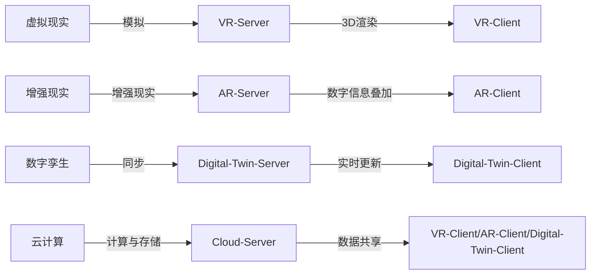
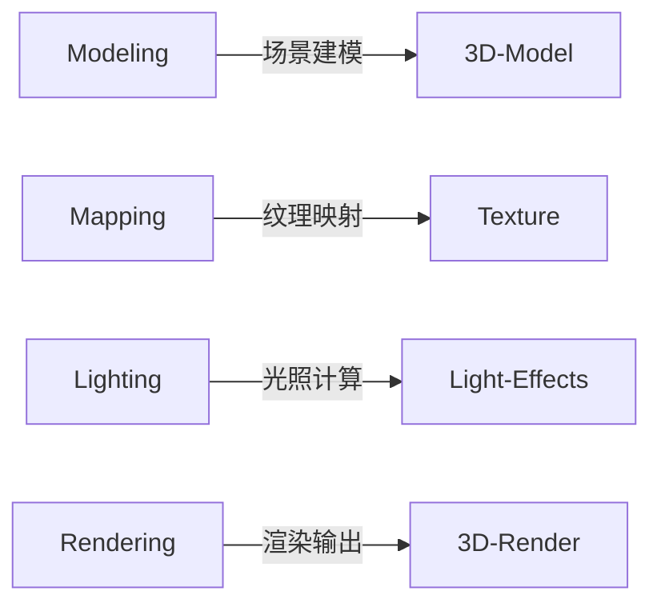
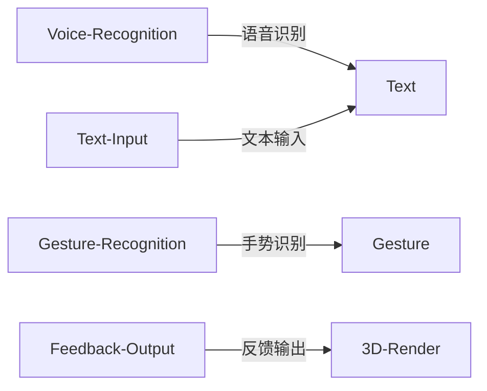
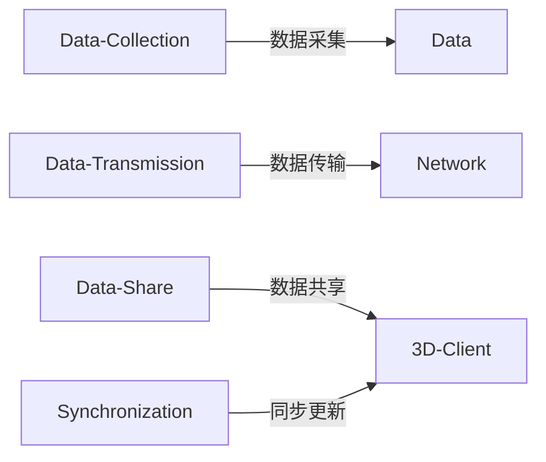

                 

# 元宇宙工作空间:远程协作的革命性变革

## 1. 背景介绍

### 1.1 问题由来
随着数字化和全球化的加速，远程协作成为越来越重要的工作模式。然而，传统的远程协作模式存在诸多限制，如沟通效率低、团队协作困难、文化隔阂等。为此，人们亟需一种全新的远程协作工具，既能保持高效的沟通与协作，又能打破物理距离的限制，实现“在任何时间、任何地点与任何人协作”的理想。

### 1.2 问题核心关键点
元宇宙(也被称为Web3.0或Virtual Reality)，提供了一种基于3D虚拟空间与数字孪生的新型协作方式。通过构建沉浸式的虚拟工作空间，元宇宙工作空间旨在实现更自然、更高效的远程协作。其核心关键点包括：

- 高沉浸感体验：通过VR/AR技术，构建逼真的3D虚拟环境，使远程协作如同面对面交流。
- 实时互动：支持多种交互方式，如语音、手势、文本等，实现即时的信息交换和反馈。
- 可扩展性与灵活性：支持多人同时协作，实现跨地域、跨文化的团队合作。
- 数据共享：在虚拟空间中进行数据共享与协作，提升团队工作效率。

### 1.3 问题研究意义
元宇宙工作空间作为远程协作的新范式，具有重大的研究意义：

- 提升协作效率：通过沉浸式体验，提升团队沟通效率，减少误解与偏差。
- 打破物理界限：实现跨地域、跨文化的协作，打破传统协作模式的地理限制。
- 推动企业创新：为公司提供更灵活、高效的协作工具，推动企业数字化转型。
- 创造新商业机会：催生新型商业模式，如虚拟展览、虚拟会议、虚拟办公等。

## 2. 核心概念与联系

### 2.1 核心概念概述

元宇宙工作空间是一种基于3D虚拟环境的远程协作工具，通过模拟真实工作场景，实现高效的团队沟通与协作。其核心概念包括：

- 虚拟现实(Virtual Reality, VR)：一种通过计算机生成并模拟真实世界环境的技术，使用户能够沉浸在虚拟环境中。
- 增强现实(Augmented Reality, AR)：一种在用户现实环境中叠加数字信息的技术，增强用户在现实世界中的感官体验。
- 数字孪生(Digital Twin)：通过数字技术，将物理世界映射到数字世界中，实现虚拟与现实的同步更新。
- 云计算(Cloud Computing)：通过互联网提供计算资源和数据存储，支持元宇宙工作空间的实时渲染与数据共享。

这些核心概念通过以下Mermaid流程图进行了联系展示：

### 2.2 核心概念原理和架构

#### 2.2.1 虚拟现实(VR)

虚拟现实是一种通过计算机技术生成逼真3D环境的技术。其原理主要包括：

- **头戴式显示器(Head-mounted Display, HMD)**：用于显示虚拟环境，用户通过HMD看到虚拟世界的全景图像。
- **空间追踪器(Spatial Tracker)**：记录用户的位置和动作，将现实空间映射到虚拟空间中。
- **交互设备(如手柄、动作捕捉设备)**：使用户能够与虚拟环境进行互动。

##### VR系统架构

#### 2.2.2 增强现实(AR)

增强现实通过在用户现实环境中叠加数字信息，增强用户感官体验。其原理主要包括：

- **摄像头(Camera)**：捕捉现实世界的图像信息。
- **实时渲染引擎**：对数字信息进行渲染，并叠加到用户视野中。
- **手势识别**：使用户能够通过手势与数字信息进行交互。

##### AR系统架构

#### 2.2.3 数字孪生(Digital Twin)

数字孪生通过将物理世界的实体映射到数字世界中，实现虚拟与现实的同步更新。其原理主要包括：

- **传感器(Sensor)**：采集物理世界的各项数据。
- **数字模型(Digital Model)**：将传感器数据映射到数字模型中，形成虚拟实体。
- **实时更新**：物理世界的数据变化实时更新到数字世界中，保持虚拟实体的同步性。

##### Digital Twin系统架构

#### 2.2.4 云计算(Cloud Computing)

云计算通过互联网提供计算资源和数据存储，支持大规模实时计算和数据共享。其原理主要包括：

- **云服务器(Cloud Server)**：提供计算、存储、网络等基础设施。
- **虚拟化技术(Virtualization)**：将物理资源抽象为虚拟资源，支持多租户环境。
- **弹性计算(PaaS、SaaS)**：根据需求动态扩展计算资源，实现灵活计算。

##### Cloud Computing系统架构

## 3. 核心算法原理 & 具体操作步骤

### 3.1 算法原理概述

元宇宙工作空间的算法原理主要围绕3D渲染、实时交互与数据同步展开。其核心算法包括：

- **3D渲染算法**：将虚拟空间中的场景和对象渲染为用户可观察的3D图像。
- **实时交互算法**：支持用户通过多种交互方式，如语音、手势、文本等，与虚拟环境进行实时互动。
- **数据同步算法**：在虚拟空间中进行数据共享与协作，保持团队成员的同步状态。

### 3.2 算法步骤详解

#### 3.2.1 3D渲染算法步骤
1. **场景建模**：使用3D建模软件创建虚拟场景和对象，包括建筑、设备、用户等。
2. **纹理映射**：将3D模型映射到纹理，添加真实世界的视觉细节。
3. **光照计算**：根据光源位置和强度，计算场景中各个物体的光照效果。
4. **渲染输出**：使用图形处理器(GPU)对虚拟场景进行渲染，输出到用户的HMD/AR设备。

##### 3D渲染算法流程图

#### 3.2.2 实时交互算法步骤
1. **语音识别**：使用语音识别技术将用户的语音转换为文本。
2. **手势识别**：使用手势识别技术捕捉用户的手势动作。
3. **文本输入**：使用文本输入技术接收用户的文本信息。
4. **反馈输出**：根据用户输入，实时更新虚拟环境，并输出到用户的HMD/AR设备。

##### 实时交互算法流程图

#### 3.2.3 数据同步算法步骤
1. **数据采集**：采集虚拟空间中的各项数据，如用户位置、设备状态、环境参数等。
2. **数据传输**：将数据通过网络传输到所有参与者。
3. **数据共享**：在虚拟空间中，将数据共享给所有成员。
4. **同步更新**：保持所有成员的数据同步，确保团队协作的实时性。

##### 数据同步算法流程图

### 3.3 算法优缺点

#### 3.3.1 优点
1. **沉浸感高**：通过VR/AR技术，用户能够在虚拟空间中实现沉浸式体验，提升沟通效率。
2. **交互性强**：支持多种交互方式，如语音、手势、文本等，实现即时的信息交换和反馈。
3. **灵活性强**：支持多人同时协作，实现跨地域、跨文化的团队合作。
4. **数据共享便捷**：在虚拟空间中进行数据共享与协作，提升团队工作效率。

#### 3.3.2 缺点
1. **硬件成本高**：需要高配置的VR/AR设备、高性能的图形处理器和云计算资源，成本较高。
2. **技术门槛高**：需要专业的3D建模、渲染、交互等技术，开发和维护复杂。
3. **隐私和安全性问题**：用户在虚拟空间中的数据和行为可能被监控，存在隐私和安全性风险。
4. **依赖网络环境**：实时渲染和数据同步对网络环境要求高，可能受网络波动影响。

### 3.4 算法应用领域

元宇宙工作空间的算法应用广泛，主要包括以下几个领域：

- **远程会议**：在虚拟空间中进行远程会议，提升会议效率和互动性。
- **虚拟办公**：在虚拟空间中进行日常办公，实现远程协作。
- **远程培训**：在虚拟空间中进行远程培训，提高培训效果和互动性。
- **虚拟展览**：在虚拟空间中进行虚拟展览，展示产品和服务。
- **虚拟旅行**：在虚拟空间中进行虚拟旅行，探索不同的世界和场景。

## 4. 数学模型和公式 & 详细讲解 & 举例说明

### 4.1 数学模型构建

本节将使用数学语言对元宇宙工作空间的渲染算法、交互算法和数据同步算法进行更加严格的刻画。

记虚拟空间中的场景为 $S$，用户数量为 $N$，每个用户的3D位置为 $(x_i, y_i, z_i)$，光源位置为 $(x_L, y_L, z_L)$，用户与光源的距离为 $d_i$，光源的强度为 $I$，光照强度在虚拟空间中传递的衰减系数为 $\gamma$，光照强度在虚拟空间中传递的衰减距离为 $R$。

定义场景中每个物体的表面材质为 $m_k$，光照强度在物体表面的反射比例为 $r_k$。

则3D渲染的数学模型为：

$$
I_k(x_i, y_i, z_i) = I \cdot r_k \cdot \prod_{i=1}^N \frac{1}{d_i^2} \cdot \exp(-\gamma \cdot d_i / R)
$$

实时交互的数学模型为：

$$
R_i(t) = \sum_{k=1}^K R_k(t_k)
$$

其中 $R_k(t_k)$ 为第 $k$ 个用户在第 $t_k$ 时刻的反馈信息，可以是语音、手势、文本等。

数据同步的数学模型为：

$$
D(t) = \frac{1}{N} \sum_{i=1}^N D_i(t_i)
$$

其中 $D_i(t_i)$ 为第 $i$ 个用户在第 $t_i$ 时刻的数据信息。

### 4.2 公式推导过程

#### 4.2.1 3D渲染公式推导
以光源为光源，在虚拟空间中进行渲染。设光源强度为 $I$，光源与物体的距离为 $d_i$，光源的衰减系数为 $\gamma$，衰减距离为 $R$，物体材质反射比例为 $r_k$。则光照强度在物体上的传递衰减公式为：

$$
I_k(x_i, y_i, z_i) = I \cdot r_k \cdot \frac{1}{d_i^2} \cdot \exp(-\gamma \cdot d_i / R)
$$

对于场景中的多个物体，渲染公式可以扩展为：

$$
I_k(x_i, y_i, z_i) = \sum_{k=1}^K I_k(x_i, y_i, z_i) = I \cdot \sum_{k=1}^K r_k \cdot \frac{1}{d_i^2} \cdot \exp(-\gamma \cdot d_i / R)
$$

其中 $I_k(x_i, y_i, z_i)$ 为场景中第 $k$ 个物体在位置 $(x_i, y_i, z_i)$ 的光照强度。

#### 4.2.2 实时交互公式推导
设第 $k$ 个用户在第 $t_k$ 时刻的反馈信息为 $R_k(t_k)$，可以是语音、手势、文本等。则实时交互的数学模型为：

$$
R_i(t) = \sum_{k=1}^K R_k(t_k)
$$

其中 $R_k(t_k)$ 为第 $k$ 个用户在第 $t_k$ 时刻的反馈信息，可以是语音、手势、文本等。

#### 4.2.3 数据同步公式推导
设第 $i$ 个用户在第 $t_i$ 时刻的数据信息为 $D_i(t_i)$，则在虚拟空间中进行数据同步的数学模型为：

$$
D(t) = \frac{1}{N} \sum_{i=1}^N D_i(t_i)
$$

其中 $D_i(t_i)$ 为第 $i$ 个用户在第 $t_i$ 时刻的数据信息。

### 4.3 案例分析与讲解

#### 4.3.1 3D渲染案例
以建筑场景的渲染为例。在虚拟空间中，每个建筑物的3D模型都需要进行光照渲染。设建筑物材质反射比例为 $r_k$，光源与建筑物距离为 $d_i$，光源强度为 $I$，光源衰减系数为 $\gamma$，衰减距离为 $R$。

则建筑物 $k$ 在位置 $(x_i, y_i, z_i)$ 的光照强度为：

$$
I_k(x_i, y_i, z_i) = I \cdot r_k \cdot \frac{1}{d_i^2} \cdot \exp(-\gamma \cdot d_i / R)
$$

对于场景中的多个建筑物，渲染公式可以扩展为：

$$
I_k(x_i, y_i, z_i) = \sum_{k=1}^K I_k(x_i, y_i, z_i) = I \cdot \sum_{k=1}^K r_k \cdot \frac{1}{d_i^2} \cdot \exp(-\gamma \cdot d_i / R)
$$

其中 $I_k(x_i, y_i, z_i)$ 为场景中第 $k$ 个建筑物在位置 $(x_i, y_i, z_i)$ 的光照强度。

#### 4.3.2 实时交互案例
以虚拟会议为例。在虚拟会议中，每个参与者都可以通过语音、手势、文本等方式进行实时互动。设第 $k$ 个用户在第 $t_k$ 时刻的反馈信息为 $R_k(t_k)$，可以是语音、手势、文本等。

则参与者 $i$ 在虚拟会议中的反馈信息 $R_i(t)$ 为：

$$
R_i(t) = \sum_{k=1}^K R_k(t_k)
$$

其中 $R_k(t_k)$ 为第 $k$ 个用户在第 $t_k$ 时刻的反馈信息，可以是语音、手势、文本等。

#### 4.3.3 数据同步案例
以虚拟办公室为例。在虚拟办公室中，每个员工都可以通过网络进行数据同步。设第 $i$ 个员工在第 $t_i$ 时刻的数据信息为 $D_i(t_i)$，则在虚拟办公室中进行数据同步的公式为：

$$
D(t) = \frac{1}{N} \sum_{i=1}^N D_i(t_i)
$$

其中 $D_i(t_i)$ 为第 $i$ 个员工在第 $t_i$ 时刻的数据信息。

## 5. 项目实践：代码实例和详细解释说明

### 5.1 开发环境搭建

在进行元宇宙工作空间开发前，我们需要准备好开发环境。以下是使用Unity3D进行开发的环

