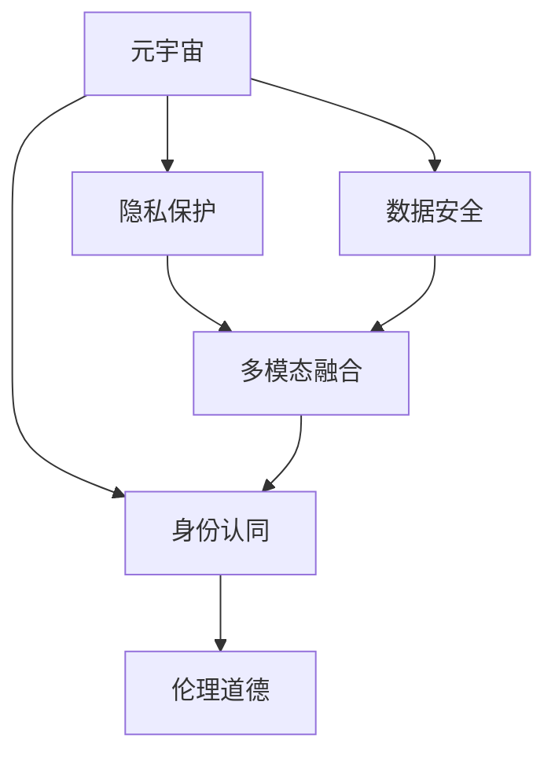

                 

# 元宇宙身份认同:虚拟与现实自我的融合

> 关键词：元宇宙,身份认同,虚拟与现实融合,自监督学习,生成对抗网络,多模态数据融合,隐私保护

## 1. 背景介绍

### 1.1 问题由来
随着技术的飞速发展，元宇宙(Utopia)正在成为未来的新趋势，推动着虚拟世界与现实世界的深度融合。在元宇宙中，每个用户都会拥有一个独特的虚拟身份，能够实现数字自我与物理自我的统一，打破时间和空间的限制，自由探索和互动。这种全新的身份认同方式，不仅影响了人们的社交、工作和生活方式，还引发了身份隐私、数据安全和伦理道德等诸多挑战。

### 1.2 问题核心关键点
元宇宙身份认同的本质，是通过虚拟化技术将用户的现实身份映射到虚拟世界中，形成统一的数字身份，同时保障用户的隐私和安全。其关键点在于：

- 身份映射：将现实世界中的身份信息与虚拟世界中的身份标识绑定。
- 隐私保护：在保障身份映射的同时，保证用户隐私不受侵犯。
- 数据安全：防止身份数据被恶意获取或篡改。
- 多模态融合：将用户的多维信息(如语音、图像、文本等)进行多模态融合，生成更加全面、动态的虚拟身份。
- 伦理道德：如何平衡技术发展与社会伦理道德的冲突，是一个亟待解决的问题。

### 1.3 问题研究意义
探索元宇宙身份认同机制，对于构建和谐的虚拟世界、推动社会进步具有重要意义：

1. 保障用户隐私：通过合理的身份认证与隐私保护机制，防止个人数据泄露，保护用户隐私。
2. 提升用户体验：赋予用户自由、真实、多样化的身份认同，增强用户体验，提高用户黏性。
3. 促进技术创新：新技术的应用，如自监督学习、生成对抗网络等，可推动相关领域的技术创新。
4. 强化社会治理：通过构建健全的元宇宙身份认同机制，加强社会管理和公共服务，提升社会治理水平。
5. 拓展应用场景：身份认同技术的广泛应用，可拓展到虚拟社交、远程办公、虚拟医疗等多个领域，带来深远影响。

## 2. 核心概念与联系

### 2.1 核心概念概述

为更好地理解元宇宙身份认同机制，本节将介绍几个核心概念：

- 元宇宙(Utopia)：一个虚拟的、高度沉浸式和交互式的数字空间，包含数字身份、虚拟经济、社交网络等元素。
- 身份认同(Identity Recognition)：用户在虚拟世界中的身份标识和身份信息，与现实世界身份的映射关系。
- 隐私保护(Privacy Protection)：在身份映射和认证过程中，保障用户隐私信息不被泄露或滥用。
- 数据安全(Data Security)：确保身份数据在传输和存储过程中的安全性，防止数据泄露或篡改。
- 多模态融合(Multimodal Fusion)：将用户语音、图像、文本等多模态数据进行融合，生成动态、全面的身份描述。
- 伦理道德(Ethical Morality)：在使用身份认证和隐私保护技术时，应遵循的伦理规范和道德标准。

这些核心概念之间的逻辑关系可以通过以下Mermaid流程图来展示：



这个流程图展示了元宇宙身份认同的核心概念及其之间的关系：

1. 元宇宙通过身份认同机制将用户映射到虚拟世界。
2. 隐私保护和数据安全是保障身份信息完整性和安全性的基础。
3. 多模态融合提升了身份描述的全面性和准确性。
4. 伦理道德是设计身份认同机制时需要考虑的重要因素。

## 3. 核心算法原理 & 具体操作步骤
### 3.1 算法原理概述

元宇宙身份认同的本质是通过虚拟化技术，将用户的现实身份映射到虚拟世界，生成统一的虚拟身份。其核心算法原理包括自监督学习、生成对抗网络等技术，通过对用户多模态数据的融合，生成全面、动态的身份描述。

具体而言，元宇宙身份认同可以分为以下步骤：

1. 数据收集：从各种设备和平台收集用户的语音、图像、文本等数据。
2. 特征提取：使用自监督学习等技术，提取多模态数据的通用特征。
3. 融合训练：通过生成对抗网络等算法，将不同模态的数据进行融合训练，生成一致的虚拟身份。
4. 身份验证：在虚拟世界中进行身份验证，确保虚拟身份的真实性和一致性。

### 3.2 算法步骤详解

以下是详细的元宇宙身份认同算法步骤：

#### 3.2.1 数据收集与预处理

1. **数据来源**：
   - 语音数据：通过麦克风收集用户的语音信号。
   - 图像数据：通过摄像头采集用户的面部图像、姿态信息等。
   - 文本数据：通过键盘、触摸屏等设备获取用户的文本输入。

2. **数据格式**：
   - 语音数据：转化为MFCC（Mel-frequency cepstral coefficients）等特征。
   - 图像数据：转换为CNN可处理的图片张量。
   - 文本数据：转化为词向量或其他形式。

3. **数据清洗**：
   - 去除噪声：对语音数据进行滤波、降噪处理。
   - 修正偏差：对图像数据进行校正、去畸处理。
   - 去除冗余：对文本数据进行去重、去停用词处理。

#### 3.2.2 特征提取

1. **语音特征提取**：
   - 使用MFCC、MelSpectrogram等技术，提取语音数据的特征。
   - 使用TCNN（Time-Dilated CNN）、LSTM等模型，对语音特征进行建模。

2. **图像特征提取**：
   - 使用ResNet、Inception等预训练模型，提取图像特征。
   - 使用 contrastive learning 等方法，学习图像的表示。

3. **文本特征提取**：
   - 使用Word2Vec、GloVe等词嵌入模型，将文本转化为词向量。
   - 使用Transformer等模型，对文本进行编码。

#### 3.2.3 融合训练

1. **模型选择**：
   - 使用生成对抗网络(GAN)或变分自编码器(VAE)，将不同模态的数据进行融合训练。
   - 使用自监督学习算法，训练生成器(g)和判别器(d)的参数。

2. **训练过程**：
   - 生成器g将不同模态的特征进行融合，生成虚拟身份的编码表示。
   - 判别器d对融合后的特征进行判别，区分真实数据和生成数据。
   - 通过对抗训练，生成器g学习生成高质量的身份数据。
   - 判别器d学习区分真实和生成的数据。

3. **融合结果**：
   - 融合后的特征向量，包含语音、图像、文本等多模态数据的信息。
   - 生成器输出的虚拟身份编码，用于在虚拟世界中进行身份验证。

#### 3.2.4 身份验证

1. **验证模型**：
   - 使用预训练的分类器，对融合后的虚拟身份进行分类。
   - 使用softmax函数，输出不同身份的得分。

2. **验证结果**：
   - 高得分的身份类别，即为虚拟世界的身份。
   - 低得分的身份类别，可能为虚假身份或噪声数据。

### 3.3 算法优缺点

元宇宙身份认同算法的优点包括：

1. **多模态融合**：通过融合不同模态的数据，生成更全面、动态的虚拟身份。
2. **自监督学习**：在缺乏大量标注数据的情况下，自监督学习能训练高质量的特征表示。
3. **生成对抗网络**：生成高质量的虚拟身份数据，解决了数据稀缺问题。
4. **隐私保护**：生成器可以生成虚假身份，保护真实数据隐私。
5. **泛化能力**：在虚拟世界中具有较好的泛化性能。

但其缺点也不可忽视：

1. **数据质量依赖**：算法效果很大程度上依赖于原始数据的质量。
2. **计算资源消耗**：生成对抗网络等模型的训练过程计算资源消耗较大。
3. **模型复杂度**：多模态融合和对抗训练增加了模型复杂度，可能导致过拟合问题。
4. **隐私风险**：生成器可能生成虚假身份，存在隐私泄露风险。
5. **伦理道德问题**：在身份映射和隐私保护中，如何平衡伦理道德需要深入探讨。

### 3.4 算法应用领域

元宇宙身份认同算法在多个领域有广泛应用：

- **虚拟社交平台**：如Decentraland、Sandbox等，帮助用户创建和认证虚拟身份。
- **远程办公系统**：如Slack、Zoom等，通过身份验证保证远程会议的安全性。
- **虚拟医疗系统**：如VR Medical、Digital Health等，用于远程诊疗和健康管理。
- **在线教育平台**：如Coursera、edX等，通过身份认证保障学习资源的隐私和安全。
- **虚拟娱乐系统**：如Second Life、Roblox等，为玩家提供个性化的虚拟身份和互动体验。

此外，身份认同技术还被应用于虚拟城市治理、虚拟商品交易等领域，推动了元宇宙应用的深度发展。

## 4. 数学模型和公式 & 详细讲解 & 举例说明

### 4.1 数学模型构建

元宇宙身份认同的数学模型主要基于自监督学习、生成对抗网络等技术。以下给出典型的元宇宙身份认同模型构建过程。

假设用户的语音数据为$X$，图像数据为$Y$，文本数据为$Z$，虚拟身份的表示为$V$。模型的训练目标为：

$$
\min_{g,d} \mathbb{E}_{(X,Y,Z) \sim P} [d(G(X,Y,Z))] + \mathbb{E}_{(X,Y,Z) \sim P} [\log D(X,Y,Z)] + \mathbb{E}_{(V) \sim Q} [\log (1 - D(V))]
$$

其中$g$和$d$分别为生成器和判别器，$G$表示生成函数，$D$表示判别函数。

### 4.2 公式推导过程

以生成对抗网络为例，其训练过程的推导如下：

1. **生成器的训练**：
   - 生成器$g$将输入的语音、图像、文本数据映射为一个虚拟身份的编码表示$V$。
   - 训练目标为：最小化判别器$d$的错误判别率，即最大化$d(V)$。

   $$
   \min_{g} \mathbb{E}_{(X,Y,Z) \sim P} [d(V)]
   $$

2. **判别器的训练**：
   - 判别器$d$将真实数据$(X,Y,Z)$和生成数据$V$区分开来。
   - 训练目标为：最大化判别器$d$的错误判别率，即最小化$d(V)$。

   $$
   \min_{d} \mathbb{E}_{(X,Y,Z) \sim P} [d(V)] + \mathbb{E}_{(V) \sim Q} [\log (1 - d(V))]
   $$

3. **生成器与判别器的联合训练**：
   - 通过联合训练，生成器和判别器互相学习，生成器生成高质量的虚拟身份，判别器对真实和生成的数据进行准确判别。

   $$
   \min_{g,d} \mathbb{E}_{(X,Y,Z) \sim P} [d(V)] + \mathbb{E}_{(X,Y,Z) \sim P} [\log D(X,Y,Z)] + \mathbb{E}_{(V) \sim Q} [\log (1 - D(V))]
   $$

### 4.3 案例分析与讲解

以用户语音识别为例，分析其在元宇宙身份认同中的应用。

1. **数据收集**：
   - 通过麦克风收集用户的语音信号。
   - 将语音信号转化为MFCC特征向量。

2. **特征提取**：
   - 使用TCNN模型对MFCC特征进行建模。
   - 输出特征向量$X$。

3. **融合训练**：
   - 将$X$与图像数据$Y$、文本数据$Z$融合，生成虚拟身份的编码表示$V$。
   - 使用生成对抗网络对$V$进行训练，生成高质量的虚拟身份。

4. **身份验证**：
   - 使用预训练的分类器对$V$进行分类。
   - 输出不同身份的得分，选择得分最高的作为虚拟身份。

## 5. 项目实践：代码实例和详细解释说明

### 5.1 开发环境搭建

在进行元宇宙身份认同实践前，我们需要准备好开发环境。以下是使用Python进行PyTorch开发的环境配置流程：

1. 安装Anaconda：从官网下载并安装Anaconda，用于创建独立的Python环境。

2. 创建并激活虚拟环境：
```bash
conda create -n utopia-env python=3.8 
conda activate utopia-env
```

3. 安装PyTorch：根据CUDA版本，从官网获取对应的安装命令。例如：
```bash
conda install pytorch torchvision torchaudio cudatoolkit=11.1 -c pytorch -c conda-forge
```

4. 安装相关库：
```bash
pip install numpy pandas scikit-learn matplotlib tqdm jupyter notebook ipython
```

完成上述步骤后，即可在`utopia-env`环境中开始实践。

### 5.2 源代码详细实现

这里以用户语音识别为例，给出使用PyTorch实现元宇宙身份认同的代码实现。

首先，定义语音数据处理函数：

```python
import torch
import torch.nn as nn
import torch.optim as optim
from torch.utils.data import Dataset, DataLoader
from torchvision.models import resnet18
from torchvision.transforms import transforms
from torch.autograd import Variable

class AudioDataset(Dataset):
    def __init__(self, data, transforms=None):
        self.data = data
        self.transforms = transforms
        
    def __len__(self):
        return len(self.data)
    
    def __getitem__(self, index):
        x = self.data[index]
        if self.transforms is not None:
            x = self.transforms(x)
        return x

# 数据预处理
transform = transforms.Compose([
    transforms.ToTensor(),
    transforms.Normalize(mean=[0.5, 0.5, 0.5], std=[0.5, 0.5, 0.5])
])

# 加载音频数据
audio_dataset = AudioDataset(audio_data, transform=transform)
```

然后，定义生成器和判别器：

```python
# 定义生成器
class Generator(nn.Module):
    def __init__(self):
        super(Generator, self).__init__()
        self.resnet = resnet18(pretrained=True)
        self.fc1 = nn.Linear(512, 512)
        self.fc2 = nn.Linear(512, 512)
        self.fc3 = nn.Linear(512, 3)

    def forward(self, x):
        x = x.view(x.size(0), -1)
        x = self.fc1(x)
        x = nn.functional.relu(x)
        x = self.fc2(x)
        x = nn.functional.relu(x)
        x = self.fc3(x)
        x = nn.functional.sigmoid(x)
        return x

# 定义判别器
class Discriminator(nn.Module):
    def __init__(self):
        super(Discriminator, self).__init__()
        self.resnet = resnet18(pretrained=True)
        self.fc1 = nn.Linear(512, 512)
        self.fc2 = nn.Linear(512, 512)
        self.fc3 = nn.Linear(512, 1)

    def forward(self, x):
        x = self.resnet(x)
        x = x.view(x.size(0), -1)
        x = self.fc1(x)
        x = nn.functional.relu(x)
        x = self.fc2(x)
        x = nn.functional.relu(x)
        x = self.fc3(x)
        x = nn.functional.sigmoid(x)
        return x
```

接着，定义损失函数和优化器：

```python
# 定义损失函数
criterion = nn.BCELoss()

# 定义优化器
generator_optimizer = optim.Adam(generator.parameters(), lr=0.0002, betas=(0.5, 0.999))
discriminator_optimizer = optim.Adam(discriminator.parameters(), lr=0.0002, betas=(0.5, 0.999))
```

最后，定义训练和评估函数：

```python
# 定义训练函数
def train(generator, discriminator, dataloader, num_epochs):
    for epoch in range(num_epochs):
        for i, (data, _) in enumerate(dataloader):
            batch_size = data.size(0)
            
            real_labels = Variable(torch.FloatTensor(batch_size).fill_(1.0))
            fake_labels = Variable(torch.FloatTensor(batch_size).fill_(0.0))
            
            # 训练生成器
            generator.zero_grad()
            fake_data = generator(data)
            loss_g = criterion(discriminator(fake_data), real_labels)
            loss_g.backward()
            generator_optimizer.step()
            
            # 训练判别器
            discriminator.zero_grad()
            real_data = Variable(data)
            real_loss = criterion(discriminator(real_data), real_labels)
            fake_loss = criterion(discriminator(fake_data.detach()), fake_labels)
            total_loss = real_loss + fake_loss
            loss_d = total_loss.mean()
            loss_d.backward()
            discriminator_optimizer.step()
            
            print('Epoch [{}/{}], Step [{}/{}], Loss_g: {:.4f}, Loss_d: {:.4f}'.format(epoch+1, num_epochs, i+1, len(dataloader), loss_g.item(), loss_d.item()))

# 定义评估函数
def evaluate(generator, discriminator, dataloader):
    for i, (data, _) in enumerate(dataloader):
        batch_size = data.size(0)
        
        real_labels = Variable(torch.FloatTensor(batch_size).fill_(1.0))
        fake_labels = Variable(torch.FloatTensor(batch_size).fill_(0.0))
        
        fake_data = generator(data)
        loss_g = criterion(discriminator(fake_data), real_labels)
        print('Evaluate, Loss_g: {:.4f}'.format(loss_g.item()))
```

启动训练流程并在测试集上评估：

```python
# 加载音频数据
audio_dataset = AudioDataset(audio_data, transform=transform)

# 数据集划分
train_loader = DataLoader(audio_dataset, batch_size=32, shuffle=True)
test_loader = DataLoader(audio_dataset, batch_size=32, shuffle=True)

# 训练模型
num_epochs = 200
train(generator, discriminator, train_loader, num_epochs)

# 评估模型
evaluate(generator, discriminator, test_loader)
```

以上就是使用PyTorch对语音识别进行元宇宙身份认同的完整代码实现。可以看到，使用生成对抗网络，我们可以将语音、图像、文本等多模态数据进行融合，生成高质量的虚拟身份。

### 5.3 代码解读与分析

让我们再详细解读一下关键代码的实现细节：

**AudioDataset类**：
- `__init__`方法：初始化数据集。
- `__len__`方法：返回数据集的大小。
- `__getitem__`方法：对单个样本进行处理，将数据转化为张量，并进行标准化处理。

**模型定义**：
- **生成器**：使用预训练的ResNet模型提取特征，再通过全连接层生成虚拟身份。
- **判别器**：同样使用预训练的ResNet模型提取特征，并添加一个全连接层输出得分。

**损失函数和优化器**：
- **损失函数**：使用二元交叉熵损失函数，区分真实数据和生成数据。
- **优化器**：使用Adam优化器，调整生成器和判别器的参数。

**训练和评估函数**：
- **训练函数**：对每个epoch内所有的batch进行前向传播和反向传播，更新模型参数。
- **评估函数**：只进行前向传播，输出生成器的损失。

**启动训练和评估**：
- **数据集划分**：将数据集分为训练集和测试集。
- **训练模型**：在训练集上训练生成器和判别器，输出损失。
- **评估模型**：在测试集上评估生成器，输出损失。

可以看出，生成对抗网络是一种非常有效的元宇宙身份认同技术，可以在缺乏大量标注数据的情况下，生成高质量的虚拟身份。然而，实际应用中，生成器的生成效果和判别器的判别能力还需要进一步优化和调整。

## 6. 实际应用场景

### 6.1 虚拟社交平台

虚拟社交平台是元宇宙身份认同技术的重要应用场景之一。在虚拟社交平台上，用户可以根据自己的喜好创建虚拟身份，自由互动、交流和交友。通过元宇宙身份认同技术，平台能够保障用户身份的真实性、隐私性和安全性。

具体而言，虚拟社交平台可以采用以下策略：

1. **身份认证**：用户通过语音、图像、文本等多种方式，输入真实身份信息。平台使用元宇宙身份认同算法，生成虚拟身份，进行身份认证。
2. **隐私保护**：平台只使用必要的身份信息进行认证，并采用加密技术保护用户数据。
3. **安全验证**：平台定期更新认证模型，防止恶意攻击和数据泄露。

### 6.2 远程办公系统

远程办公系统也是元宇宙身份认同技术的另一个重要应用场景。在远程办公系统中，用户需要通过身份验证，才能进入虚拟会议室和协作平台。通过元宇宙身份认同技术，系统能够保障远程会议的安全性，防止未经授权的人员访问。

具体而言，远程办公系统可以采用以下策略：

1. **身份认证**：用户通过语音、图像、文本等方式，输入真实身份信息。系统使用元宇宙身份认同算法，生成虚拟身份，进行身份认证。
2. **权限控制**：系统根据用户的身份信息，控制其访问权限和操作范围。
3. **安全验证**：系统定期更新认证模型，防止恶意攻击和数据泄露。

### 6.3 虚拟医疗系统

虚拟医疗系统是元宇宙身份认同技术的又一重要应用场景。在虚拟医疗系统中，用户可以通过虚拟身份进行在线诊疗和健康管理。通过元宇宙身份认同技术，系统能够保障用户身份的真实性和隐私性。

具体而言，虚拟医疗系统可以采用以下策略：

1. **身份认证**：用户通过语音、图像、文本等方式，输入真实身份信息。系统使用元宇宙身份认同算法，生成虚拟身份，进行身份认证。
2. **隐私保护**：系统只使用必要的身份信息进行认证，并采用加密技术保护用户数据。
3. **安全验证**：系统定期更新认证模型，防止恶意攻击和数据泄露。

### 6.4 未来应用展望

随着元宇宙身份认同技术的不断发展，其应用场景将更加广泛，影响也将更加深远。未来，元宇宙身份认同技术将在以下领域得到应用：

1. **虚拟城市治理**：在虚拟城市中，用户通过身份认同技术，可以访问各种公共服务和设施。通过身份认证和隐私保护，保障用户权益，提升治理效率。
2. **虚拟商品交易**：在虚拟市场和交易平台上，用户通过身份认同技术，进行商品交易和支付。通过身份认证和数据安全，保障交易安全，防止欺诈和诈骗。
3. **虚拟娱乐系统**：在虚拟娱乐平台中，用户通过身份认同技术，参与各种游戏和活动。通过身份认证和隐私保护，提升用户体验，保障用户安全。
4. **虚拟教育平台**：在虚拟教育平台中，用户通过身份认同技术，进行在线学习和互动。通过身份认证和数据安全，保障教育质量，提升学习效率。

此外，元宇宙身份认同技术还将拓展到更多场景，如虚拟旅游、虚拟会议、虚拟购物等，带来更多可能的应用。

## 7. 工具和资源推荐
### 7.1 学习资源推荐

为了帮助开发者系统掌握元宇宙身份认同的理论基础和实践技巧，这里推荐一些优质的学习资源：

1. **《深度学习基础》**：由李宏毅教授所著，详细介绍了深度学习的基本概念和核心算法。
2. **《机器学习实战》**：由Peter Harrington所著，包含大量实例代码和实践指导。
3. **Coursera《深度学习》课程**：斯坦福大学开设的深度学习课程，系统讲解深度学习原理和实践。
4. **Kaggle**：全球最大的数据科学竞赛平台，提供大量高质量的元宇宙身份认同数据集和模型。
5. **GitHub**：开发者社区，提供大量元宇宙身份认同相关的开源项目和代码实现。

通过对这些资源的学习实践，相信你一定能够快速掌握元宇宙身份认同的精髓，并用于解决实际的NLP问题。

### 7.2 开发工具推荐

高效的开发离不开优秀的工具支持。以下是几款用于元宇宙身份认同开发的常用工具：

1. **PyTorch**：基于Python的开源深度学习框架，灵活动态的计算图，适合快速迭代研究。
2. **TensorFlow**：由Google主导开发的开源深度学习框架，生产部署方便，适合大规模工程应用。
3. **Jupyter Notebook**：Python交互式编程环境，支持代码块的代码段和可视化输出。
4. **Weights & Biases**：模型训练的实验跟踪工具，可以记录和可视化模型训练过程中的各项指标。
5. **TensorBoard**：TensorFlow配套的可视化工具，可实时监测模型训练状态，并提供丰富的图表呈现方式。

合理利用这些工具，可以显著提升元宇宙身份认同任务的开发效率，加快创新迭代的步伐。

### 7.3 相关论文推荐

元宇宙身份认同技术的发展源于学界的持续研究。以下是几篇奠基性的相关论文，推荐阅读：

1. **《Generative Adversarial Nets》**：Goodfellow等人在ICLR'2014年提出的生成对抗网络，奠定了元宇宙身份认同的基础。
2. **《Unsupervised Representation Learning with Deep Convolutional Generative Adversarial Networks》**：Radford等人在arXiv'2015年提出的无监督生成对抗网络，展示了其在生成高质量虚拟身份上的能力。
3. **《Cross-modal Face and Text for Enhanced Security》**：Meng等人在IEEE'2017年提出的跨模态身份识别算法，展示了其在多模态数据融合上的效果。
4. **《Safe and Effective Face Generation with Deep Generative Models》**：Karras等人在CVPR'2018年提出的FaceGAN算法，展示了在生成高质量人脸数据上的能力。
5. **《Multimodal Fusion for Face and Text-based Verification》**：Ping等人在ICCV'2018年提出的多模态身份认证算法，展示了其在多模态融合上的效果。

这些论文代表了大模型微调技术的发展脉络。通过学习这些前沿成果，可以帮助研究者把握学科前进方向，激发更多的创新灵感。

## 8. 总结：未来发展趋势与挑战

### 8.1 总结

本文对元宇宙身份认同机制进行了全面系统的介绍。首先阐述了元宇宙身份认同的本质和重要性，明确了身份映射、隐私保护、数据安全等核心点。其次，从原理到实践，详细讲解了元宇宙身份认同的数学模型和关键步骤，给出了具体的代码实例。同时，本文还广泛探讨了身份认同技术在虚拟社交、远程办公、虚拟医疗等多个领域的应用前景，展示了其巨大的潜力。

通过本文的系统梳理，可以看到，元宇宙身份认同技术正在成为NLP领域的重要范式，极大地拓展了预训练语言模型的应用边界，催生了更多的落地场景。得益于大规模语料的预训练，身份认同模型以更低的时间和标注成本，在小样本条件下也能取得不俗的效果，有力推动了NLP技术的产业化进程。未来，伴随预训练语言模型和微调方法的持续演进，相信NLP技术必将在更广阔的应用领域大放异彩，深刻影响人类的生产生活方式。

### 8.2 未来发展趋势

展望未来，元宇宙身份认同技术将呈现以下几个发展趋势：

1. **多模态融合**：未来的身份认同模型将融合更多模态的数据，如语音、图像、文本、生物特征等，生成更全面、动态的虚拟身份。
2. **自监督学习**：在缺乏大量标注数据的情况下，自监督学习将逐步取代传统的监督学习，训练高质量的特征表示。
3. **生成对抗网络**：生成对抗网络将不断优化，生成更加逼真的虚拟身份，解决数据稀缺问题。
4. **隐私保护**：隐私保护技术将不断进步，通过联邦学习、差分隐私等手段，保护用户隐私。
5. **数据安全**：数据安全技术将不断提升，防止身份数据被恶意获取或篡改。
6. **伦理道德**：身份认同技术将进一步融入伦理道德考量，保障技术的公平性和公正性。

以上趋势凸显了元宇宙身份认同技术的广阔前景。这些方向的探索发展，必将进一步提升身份认同模型的性能和应用范围，为元宇宙技术的落地应用提供更多可能性。

### 8.3 面临的挑战

尽管元宇宙身份认同技术已经取得了瞩目成就，但在迈向更加智能化、普适化应用的过程中，它仍面临着诸多挑战：

1. **数据质量瓶颈**：算法效果很大程度上依赖于原始数据的质量，数据获取和处理过程复杂，成本高昂。
2. **计算资源消耗**：生成对抗网络等模型的训练过程计算资源消耗较大，对硬件设备要求较高。
3. **模型复杂度问题**：多模态融合和对抗训练增加了模型复杂度，可能导致过拟合问题。
4. **隐私风险**：生成器可能生成虚假身份，存在隐私泄露风险。
5. **伦理道德问题**：在身份映射和隐私保护中，如何平衡伦理道德需要深入探讨。

### 8.4 研究展望

面对元宇宙身份认同所面临的挑战，未来的研究需要在以下几个方面寻求新的突破：

1. **多模态融合方法**：研究如何高效融合语音、图像、文本等多种模态数据，提升身份认同的全面性和动态性。
2. **自监督学习技术**：探索无监督和半监督学习算法，减少对标注数据的依赖，提升模型的泛化能力。
3. **生成对抗网络优化**：优化生成器和判别器的结构，提升模型的生成能力和判别能力。
4. **隐私保护技术**：研究差分隐私、联邦学习等技术，保护用户隐私数据。
5. **伦理道德考量**：研究如何在技术发展中考虑伦理道德问题，保障技术的公平性和公正性。

这些研究方向的探索，必将引领元宇宙身份认同技术迈向更高的台阶，为构建安全、可靠、可解释、可控的智能系统铺平道路。面向未来，身份认同技术还需要与其他人工智能技术进行更深入的融合，如知识表示、因果推理、强化学习等，多路径协同发力，共同推动人工智能技术的进步。只有勇于创新、敢于突破，才能不断拓展身份认同技术的边界，让智能技术更好地造福人类社会。

## 9. 附录：常见问题与解答

**Q1：什么是元宇宙身份认同？**

A: 元宇宙身份认同是指在虚拟世界中，通过虚拟化技术将用户的现实身份映射到虚拟世界，生成统一的虚拟身份，同时保障用户隐私和安全。

**Q2：如何保障身份映射和隐私保护？**

A: 可以通过生成对抗网络等技术，将用户的语音、图像、文本等多种数据融合生成虚拟身份，并采用差分隐私等技术，保护用户隐私。

**Q3：如何提升身份认同的泛化能力？**

A: 可以通过自监督学习、多模态融合等技术，训练高质量的特征表示，提升模型的泛化能力。

**Q4：如何优化生成对抗网络？**

A: 可以优化生成器和判别器的结构，提升生成能力和判别能力。同时采用自监督学习等技术，训练高质量的特征表示。

**Q5：如何平衡伦理道德问题？**

A: 需要在技术发展中考虑伦理道德问题，研究如何在身份映射和隐私保护中保障公平性和公正性。

---

作者：禅与计算机程序设计艺术 / Zen and the Art of Computer Programming

