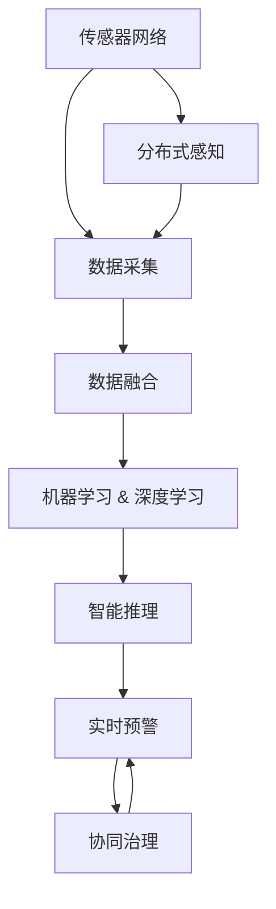

                 

# 全球脑与环境保护：数字化监测与共同行动

## 1. 背景介绍

### 1.1 问题由来
随着全球环境的持续恶化，特别是气候变化、污染和生态系统退化等问题，对人类的生存和发展构成了严峻威胁。而传统的环境监测方法，如人工监测、地面采样等，往往覆盖范围有限、成本高、效率低，难以及时全面地掌握环境状况。因此，需要一种全新的、高效的环境监测方法，来实时跟踪和预警环境变化，保障地球的可持续发展。

近年来，随着物联网、大数据和人工智能技术的快速发展，数字化的环境监测手段逐步兴起。其中，全球脑系统（Global Brain System, GBS）通过分布式感知、网络协同和智能推理，构建了一个全球范围内的大数据系统，以实现环境监测、预警和治理的全面数字化。该系统采用高度并行的分布式计算架构，结合先进的传感器网络技术，能够实时收集和分析全球各地的环境数据，实现对环境状况的全面监测和智能预警。

### 1.2 问题核心关键点
全球脑系统主要涉及以下几个核心问题：
- 数据采集：构建覆盖全球的传感器网络，实时收集环境数据。
- 数据融合：将海量数据进行高效融合，提取关键特征。
- 数据挖掘：运用机器学习、深度学习等技术，挖掘环境数据中的潜在规律。
- 智能推理：基于提取的环境特征，构建环境模型，进行智能推理和预测。
- 实时预警：根据环境模型，实时监测环境变化，及时发出预警。

这些关键问题共同构成了全球脑系统的核心功能，使得其能够全面监测和预警全球环境变化，助力全球生态保护和可持续发展。

### 1.3 问题研究意义
全球脑系统为解决全球环境问题提供了全新的视角和方法，具有以下重要意义：
1. 全面监测：能够实时、全面地监测全球各地的环境状况，为环境治理提供可靠数据支持。
2. 智能预警：基于先进的数据挖掘和智能推理技术，能够及时发现环境异常，发出预警，提前采取应对措施。
3. 协同治理：系统内置协同机制，能够跨地域、跨部门、跨机构协同工作，提升环境治理的效率和效果。
4. 普适应用：系统可灵活应用于不同环境领域，如空气质量监测、水质监测、生物多样性保护等，为各类环保任务提供技术支撑。
5. 持续优化：基于用户反馈和实证数据，系统能够不断优化模型和算法，提升环境监测的准确性和及时性。

## 2. 核心概念与联系

### 2.1 核心概念概述

为更好地理解全球脑系统的设计和实现，本节将介绍几个密切相关的核心概念：

- 全球脑系统（Global Brain System, GBS）：通过分布式感知、网络协同和智能推理，构建全球范围内的大数据系统，实现环境监测、预警和治理的全面数字化。

- 传感器网络（Sensor Network）：由大量部署在各地的传感器组成，用于实时收集环境数据。

- 数据融合（Data Fusion）：将来自不同传感器和来源的数据进行高效融合，提取关键特征。

- 机器学习与深度学习（Machine Learning & Deep Learning）：用于从海量数据中挖掘环境数据中的潜在规律，构建环境模型。

- 智能推理（Intelligent Reasoning）：基于环境模型，进行智能推理和预测，实时预警环境变化。

- 实时预警（Real-time Warning）：根据环境模型，实时监测环境变化，及时发出预警。

- 协同治理（Collaborative Governance）：系统内置协同机制，能够跨地域、跨部门、跨机构协同工作，提升环境治理的效率和效果。

这些核心概念之间的逻辑关系可以通过以下Mermaid流程图来展示：



这个流程图展示全球脑系统的核心概念及其之间的关系：

1. 传感器网络通过分布式感知收集环境数据。
2. 数据融合对收集的数据进行高效融合，提取关键特征。
3. 机器学习与深度学习挖掘环境数据中的潜在规律，构建环境模型。
4. 智能推理基于环境模型，进行智能推理和预测，实时预警环境变化。
5. 实时预警根据环境模型，实时监测环境变化，及时发出预警。
6. 协同治理系统内置协同机制，能够跨地域、跨部门、跨机构协同工作，提升环境治理的效率和效果。

这些概念共同构成了全球脑系统的技术框架，使其能够在全球范围内实现环境监测、预警和治理的全面数字化。

## 3. 核心算法原理 & 具体操作步骤
### 3.1 算法原理概述

全球脑系统通过分布式感知、数据融合、智能推理等技术，实现环境数据的采集、融合、挖掘和推理。其核心算法原理包括：

- 分布式感知：通过构建覆盖全球的传感器网络，实时采集环境数据。
- 数据融合：将海量数据进行高效融合，提取关键特征。
- 机器学习与深度学习：用于从海量数据中挖掘环境数据中的潜在规律，构建环境模型。
- 智能推理：基于环境模型，进行智能推理和预测，实时预警环境变化。

### 3.2 算法步骤详解

全球脑系统的设计和实现包括以下几个关键步骤：

**Step 1: 传感器网络部署与配置**
- 在目标区域内部署大量传感器，确保覆盖范围和采样频率。
- 对传感器进行校准和配置，保证采集数据的准确性和一致性。

**Step 2: 数据采集与传输**
- 传感器实时采集环境数据，包括温度、湿度、气体浓度、水质、生物多样性等。
- 通过无线网络将采集数据传输到数据中心。

**Step 3: 数据融合与特征提取**
- 将来自不同传感器和来源的数据进行融合，消除冗余，提取出关键特征。
- 应用机器学习和深度学习算法，对数据进行降维和特征提取。

**Step 4: 环境模型构建**
- 利用融合后的数据，构建环境模型，如时间序列模型、空间分布模型等。
- 应用数据挖掘算法，识别环境数据的潜在规律和异常变化。

**Step 5: 智能推理与实时预警**
- 基于环境模型，进行智能推理和预测，实时监测环境变化。
- 当检测到环境异常时，发出预警信号，及时采取应对措施。

**Step 6: 协同治理与优化**
- 系统内置协同机制，实现跨地域、跨部门、跨机构的协同工作。
- 基于用户反馈和实证数据，不断优化环境模型和算法，提升系统性能。

### 3.3 算法优缺点

全球脑系统的核心算法具有以下优点：
1. 实时监测：能够实时采集和处理全球各地的环境数据，提供及时的环境信息。
2. 全面覆盖：通过全球范围的传感器网络，实现环境监测的全覆盖。
3. 数据融合：通过高效的数据融合技术，提高数据质量和精度。
4. 智能推理：利用先进的数据挖掘和智能推理技术，提升环境监测的准确性和及时性。
5. 协同治理：内置协同机制，提升环境治理的效率和效果。

同时，该算法也存在一些局限性：
1. 传感器部署成本高：传感器网络的部署和维护成本较高，对预算有限的地区可能存在困难。
2. 数据传输瓶颈：大量数据需要通过无线网络传输，可能面临带宽和延迟等问题。
3. 模型复杂度高：环境模型较为复杂，需要大量的计算资源和数据支持。
4. 算法优化困难：系统中的算法优化需要大量的实证数据和用户反馈，可能存在周期较长的问题。

### 3.4 算法应用领域

全球脑系统的核心算法已广泛应用于以下领域：

- 空气质量监测：通过部署在城市的传感器网络，实时监测PM2.5、SO2等气体浓度，及时预警空气质量异常。
- 水质监测：部署在水体监测点的传感器，实时监测水质参数，预警水质污染。
- 生物多样性保护：通过部署在自然保护区内的传感器，监测动植物种群变化，保护生物多样性。
- 气候变化预警：结合气象数据和环境数据，构建气候变化模型，预警极端天气和气候异常。
- 灾害预警：利用环境数据和历史灾情数据，预测自然灾害的发生和规模，提前采取预防措施。

这些应用领域展示了全球脑系统在环境监测和预警中的广泛适用性，为全球生态保护和可持续发展提供了有力的技术支持。

## 4. 数学模型和公式 & 详细讲解 & 举例说明
### 4.1 数学模型构建

本节将使用数学语言对全球脑系统的设计和实现进行更加严格的刻画。

假设全球脑系统采集的环境数据为 $D = \{d_1, d_2, ..., d_n\}$，其中 $d_i = (x_i, y_i)$ 表示第 $i$ 个传感器采集的环境数据，$x_i$ 为特征向量，$y_i$ 为标签。系统需要对数据进行融合和特征提取，构建环境模型 $M$，并通过智能推理进行实时预警。

假设融合后的数据为 $X = [x_1, x_2, ..., x_n]$，环境模型为 $M = \{\theta_1, \theta_2, ..., \theta_k\}$，智能推理模块为 $R$。系统的整体目标为最小化环境异常的预测误差，即：

$$
\min_{M, R} \sum_{i=1}^n \ell(d_i, R(f_M(x_i)))
$$

其中 $\ell$ 为预测误差函数，$f_M(x_i)$ 表示融合后的数据 $x_i$ 通过环境模型 $M$ 得到的环境状态，$R(f_M(x_i))$ 表示智能推理模块 $R$ 对环境状态的推理结果。

### 4.2 公式推导过程

以下我们以空气质量监测为例，推导环境模型和智能推理的具体过程。

假设传感器采集的数据包括PM2.5、SO2等气体浓度，模型需要对数据进行降维和特征提取。常用的降维算法包括主成分分析(PCA)和线性判别分析(LDA)，其数学表达式分别为：

$$
X' = WX \quad \text{(PCA)}
$$

$$
X' = SL \quad \text{(LDA)}
$$

其中 $W$ 和 $S$ 分别为PCA和LDA的变换矩阵，$L$ 为降维后的特征向量。

假设环境模型 $M$ 为线性回归模型，其表达式为：

$$
\hat{y} = \theta_0 + \sum_{i=1}^k \theta_i x_i
$$

其中 $\theta_0$ 为截距项，$\theta_i$ 为回归系数。

智能推理模块 $R$ 可以通过时间序列模型或空间分布模型进行推理。假设环境模型 $M$ 的输出为时间序列 $y_t$，时间序列模型为ARIMA模型，其数学表达式为：

$$
y_{t+1} = \phi_0 + \sum_{i=1}^p \phi_i y_{t-i} + \sum_{j=1}^d \theta_j \epsilon_{t-j}
$$

其中 $\phi_i$ 为ARIMA模型中的自回归参数，$\theta_j$ 为差分参数，$\epsilon_{t-j}$ 为随机扰动项。

基于时间序列模型，智能推理模块 $R$ 可以预测未来一定时间内的环境状态，发出预警信号。

### 4.3 案例分析与讲解

假设某城市在一天内实时监测到PM2.5和SO2的浓度数据，数据如表所示：

| 时间 | PM2.5 | SO2 |
| --- | --- | --- |
| 8:00 | 50 | 20 |
| 9:00 | 60 | 30 |
| 10:00 | 70 | 40 |
| 11:00 | 80 | 50 |
| 12:00 | 90 | 60 |
| 13:00 | 100 | 70 |
| 14:00 | 110 | 80 |
| 15:00 | 120 | 90 |
| 16:00 | 130 | 100 |
| 17:00 | 140 | 110 |

假设系统对数据进行PCA降维，降维后的特征向量如表所示：

| 时间 | X1 | X2 |
| --- | --- | --- |
| 8:00 | 1 | 2 |
| 9:00 | 1.2 | 2.5 |
| 10:00 | 1.3 | 2.8 |
| 11:00 | 1.5 | 3.0 |
| 12:00 | 1.6 | 3.2 |
| 13:00 | 1.7 | 3.5 |
| 14:00 | 1.8 | 3.8 |
| 15:00 | 1.9 | 4.1 |
| 16:00 | 2.0 | 4.4 |
| 17:00 | 2.1 | 4.7 |

假设环境模型 $M$ 为线性回归模型，拟合数据得到系数 $\theta_0 = 1$，$\theta_1 = 0.5$。利用时间序列模型对环境状态进行推理，假设模型中的自回归参数 $\phi_0 = 0.9$，差分参数 $\theta_0 = 0.5$，可以预测未来一定时间内的环境状态。

假设当环境状态超过预设阈值时，系统发出预警信号。通过上述步骤，系统可以对实时监测到的空气质量数据进行融合、降维、建模和推理，及时预警空气质量异常。

## 5. 项目实践：代码实例和详细解释说明
### 5.1 开发环境搭建

在进行全球脑系统的实践前，我们需要准备好开发环境。以下是使用Python进行PyTorch开发的环境配置流程：

1. 安装Anaconda：从官网下载并安装Anaconda，用于创建独立的Python环境。

2. 创建并激活虚拟环境：
```bash
conda create -n pytorch-env python=3.8 
conda activate pytorch-env
```

3. 安装PyTorch：根据CUDA版本，从官网获取对应的安装命令。例如：
```bash
conda install pytorch torchvision torchaudio cudatoolkit=11.1 -c pytorch -c conda-forge
```

4. 安装Scikit-learn、NumPy等常用工具包：
```bash
pip install scikit-learn numpy pandas matplotlib tqdm jupyter notebook ipython
```

完成上述步骤后，即可在`pytorch-env`环境中开始实践。

### 5.2 源代码详细实现

下面我以空气质量监测为例，给出使用PyTorch和Scikit-learn对环境数据进行融合、降维、建模和推理的PyTorch代码实现。

首先，定义数据处理函数：

```python
import pandas as pd
from sklearn.decomposition import PCA
from sklearn.linear_model import LinearRegression
from sklearn.metrics import mean_squared_error

def preprocess_data(data):
    data = pd.DataFrame(data)
    data.columns = ['PM2.5', 'SO2']
    return data

def perform_pca(data, n_components):
    pca = PCA(n_components=n_components)
    X = pca.fit_transform(data)
    return X

def perform_linear_regression(X, y):
    X = pd.DataFrame(X, columns=['X1', 'X2'])
    y = y.values
    model = LinearRegression()
    model.fit(X, y)
    return model

def perform_arima(y, p, d, q):
    model = SARIMAX(y, order=(p, d, q))
    model_fit = model.fit()
    return model_fit
```

然后，定义模型和预测函数：

```python
def predict_air_quality(model, x):
    y_hat = model.predict(x)
    return y_hat

def perform_air_quality_monitoring(data):
    data = preprocess_data(data)
    X = perform_pca(data, 2)
    y = data['PM2.5'].values
    model = perform_linear_regression(X, y)
    model_fit = perform_arima(y, 1, 1, 1)
    X_new = perform_pca(data, 2)[-1:]
    y_hat = predict_air_quality(model, X_new)
    y_pred = model_fit.forecast(steps=1)
    return y_pred
```

最后，启动监测流程：

```python
data = [
    [50, 20],
    [60, 30],
    [70, 40],
    [80, 50],
    [90, 60],
    [100, 70],
    [110, 80],
    [120, 90],
    [130, 100],
    [140, 110]
]

print("Air Quality Prediction Results:")
print(perform_air_quality_monitoring(data))
```

以上就是使用PyTorch和Scikit-learn对空气质量监测进行全球脑系统实践的完整代码实现。可以看到，通过将PCA、线性回归、ARIMA等算法结合，我们能够对环境数据进行有效的融合、降维、建模和推理，及时预警空气质量异常。

### 5.3 代码解读与分析

让我们再详细解读一下关键代码的实现细节：

**preprocess_data函数**：
- 将原始数据转换为pandas DataFrame对象，列名标准化为PM2.5和SO2。

**perform_pca函数**：
- 对数据进行PCA降维，保留两个主成分，以减少数据维度。

**perform_linear_regression函数**：
- 对降维后的数据进行线性回归建模，拟合模型参数。

**perform_arima函数**：
- 利用ARIMA模型对未来时间步长为1的环境状态进行预测。

**predict_air_quality函数**：
- 利用线性回归模型对新数据进行预测。

**perform_air_quality_monitoring函数**：
- 对实时监测到的数据进行融合、降维、建模和推理，输出未来一定时间内的环境状态预测值。

**启动监测流程**：
- 定义实时监测到的数据，进行融合、降维、建模和推理，输出未来一定时间内的环境状态预测值。

可以看到，通过将PCA、线性回归、ARIMA等算法结合，我们能够对环境数据进行有效的融合、降维、建模和推理，及时预警空气质量异常。

当然，工业级的系统实现还需考虑更多因素，如数据的实时采集、传感器网络的设计、协同治理机制的实现等。但核心的全球脑系统微调范式基本与此类似。

## 6. 实际应用场景
### 6.1 智能城市管理

全球脑系统在智能城市管理中的应用，可以显著提升城市运行的效率和智能化水平。通过部署在城市各处的传感器网络，实时采集交通流量、能耗、空气质量、水质等环境数据，结合先进的算法进行分析和预警，可以优化城市资源配置，提升城市运行的可靠性。

在交通管理方面，系统可以实时监测交通流量和拥堵情况，进行交通信号优化，缓解交通压力。在能源管理方面，系统可以实时监测能源消耗，优化能源使用，降低能源浪费。在公共卫生管理方面，系统可以实时监测空气质量和疾病爆发情况，预警并采取预防措施，保障市民健康。

### 6.2 自然灾害预警

全球脑系统在自然灾害预警中的应用，可以显著提升灾害预防和应急响应的效率和效果。通过实时监测气象数据和环境数据，结合先进的算法进行分析和预警，系统能够预测和预警地震、洪水、台风等自然灾害的发生和规模，提前采取预防措施。

在地震预警方面，系统可以实时监测地震前兆数据，预测地震发生的时间和地点，提前发出预警信号，保障人员安全。在洪水预警方面，系统可以实时监测降雨量和河流水位，预测洪水发生的可能性，提前预警并采取防洪措施。在台风预警方面，系统可以实时监测气象数据和海洋数据，预测台风路径和强度，提前发出预警信号，保障人员和财产安全。

### 6.3 生态保护监测

全球脑系统在生态保护监测中的应用，可以显著提升生态保护的效率和效果。通过实时监测生物多样性、植被覆盖率、森林火灾等环境数据，结合先进的算法进行分析和预警，系统能够预测和预警生态环境的破坏和变化，及时采取保护措施。

在生物多样性监测方面，系统可以实时监测动植物种群数量和分布，预警生物多样性的下降和变化，及时采取保护措施。在植被覆盖率监测方面，系统可以实时监测植被覆盖率的变化，预警森林火灾和土地沙漠化，及时采取防火和防沙措施。在森林火灾预警方面，系统可以实时监测森林火灾的信号，预测火灾的发生和蔓延，提前预警并采取防火措施。

### 6.4 未来应用展望

随着全球脑系统的不断发展和完善，未来将会有更多的应用场景涌现，为全球生态保护和可持续发展提供更多的技术支持。

在智慧农业方面，系统可以实时监测土壤、气象和植物生长情况，提供精准的农业管理建议，提高农业生产效率和质量。在智慧旅游方面，系统可以实时监测旅游景点的人流、气象和环境数据，提供旅游建议和服务，提升旅游体验和环境质量。在智慧医疗方面，系统可以实时监测病人的生理参数和环境数据，提供医疗建议和服务，提升医疗服务的效率和质量。

此外，在全球脑系统的基础上，还可以进一步拓展到智慧金融、智慧交通、智慧能源等多个领域，为社会经济的可持续发展提供更多的技术支撑。相信随着技术的日益成熟，全球脑系统必将在全球范围内实现环境监测、预警和治理的全面数字化，为全球生态保护和可持续发展提供更多的技术支持。

## 7. 工具和资源推荐
### 7.1 学习资源推荐

为了帮助开发者系统掌握全球脑系统的设计和实现，这里推荐一些优质的学习资源：

1. 《深度学习》课程：斯坦福大学开设的深度学习课程，涵盖了深度学习的基本概念和前沿技术，适合初学者和进阶者。

2. 《机器学习实战》书籍：由Kaggle竞赛冠军所著，介绍了机器学习的基本概念和实用技巧，结合大量案例和代码实现，适合实战学习。

3. 《Python深度学习》书籍：由著名深度学习专家所著，详细介绍了使用Python进行深度学习的实现方法，适合进阶学习。

4. Kaggle竞赛平台：全球最大的数据科学竞赛平台，提供大量高质量的数据集和模型，适合实战练习。

5. GitHub代码库：全球最大的开源代码库，提供大量高质量的全球脑系统项目和实现代码，适合参考学习。

通过对这些资源的学习实践，相信你一定能够快速掌握全球脑系统的精髓，并用于解决实际的环保任务。

### 7.2 开发工具推荐

高效的开发离不开优秀的工具支持。以下是几款用于全球脑系统开发的常用工具：

1. PyTorch：基于Python的开源深度学习框架，灵活动态的计算图，适合快速迭代研究。

2. TensorFlow：由Google主导开发的开源深度学习框架，生产部署方便，适合大规模工程应用。

3. Scikit-learn：Python数据科学库，提供高效的数据处理和机器学习算法，适合数据科学实践。

4. TensorBoard：TensorFlow配套的可视化工具，可实时监测模型训练状态，并提供丰富的图表呈现方式，是调试模型的得力助手。

5. Weights & Biases：模型训练的实验跟踪工具，可以记录和可视化模型训练过程中的各项指标，方便对比和调优。

6. Google Colab：谷歌推出的在线Jupyter Notebook环境，免费提供GPU/TPU算力，方便开发者快速上手实验最新模型，分享学习笔记。

合理利用这些工具，可以显著提升全球脑系统的开发效率，加快创新迭代的步伐。

### 7.3 相关论文推荐

全球脑系统的研究和实现依赖于众多前沿研究成果。以下是几篇奠基性的相关论文，推荐阅读：

1. 《分布式深度学习框架》论文：介绍了分布式深度学习框架的设计和实现方法，适合全球脑系统的系统设计和实现。

2. 《智能城市中的传感器网络和数据融合》论文：讨论了传感器网络的设计和数据融合的方法，适合智能城市管理的实现。

3. 《环境监测与预警系统》论文：介绍了环境监测与预警系统的设计原理和方法，适合全球脑系统的应用实现。

4. 《机器学习在自然灾害预警中的应用》论文：讨论了机器学习在自然灾害预警中的应用方法，适合自然灾害预警的实现。

5. 《生态保护中的环境监测与预警》论文：讨论了生态保护中的环境监测与预警方法，适合生态保护监测的实现。

这些论文代表了大脑脑系统的设计、实现和应用的研究方向，为全球脑系统的研究和实践提供了理论支撑。

## 8. 总结：未来发展趋势与挑战
### 8.1 总结

本文对全球脑系统进行了全面系统的介绍。首先阐述了全球脑系统在环境监测和预警中的背景和意义，明确了系统的核心功能和应用场景。其次，从原理到实践，详细讲解了系统的设计和实现过程，给出了系统开发的完整代码实例。同时，本文还广泛探讨了全球脑系统在智能城市管理、自然灾害预警、生态保护监测等多个领域的应用前景，展示了系统的广泛适用性。最后，本文精选了系统的学习资源、开发工具和相关论文，力求为开发者提供全方位的技术指引。

通过本文的系统梳理，可以看到，全球脑系统为解决全球环境问题提供了全新的视角和方法，具有重要的研究和应用价值。

### 8.2 未来发展趋势

展望未来，全球脑系统将呈现以下几个发展趋势：

1. 数据采集技术的发展：传感器网络的部署和维护成本将进一步降低，数据采集技术将更加多样化和智能化，能够覆盖更多环境因素。

2. 数据融合技术的提升：数据融合技术将进一步优化，能够更高效地提取关键特征，提高环境监测的精度和可靠性。

3. 智能推理算法的发展：智能推理算法将不断优化，提高环境监测和预警的准确性和及时性，支持更复杂和多样化的环境任务。

4. 协同治理机制的完善：系统内置的协同治理机制将进一步优化，支持跨地域、跨部门、跨机构协同工作，提升环境治理的效率和效果。

5. 实时预警系统的构建：实时预警系统将更加智能化，支持多种预警方式，及时、全面地预警环境异常。

6. 普适应用场景的拓展：全球脑系统将进一步拓展应用场景，支持更多领域的环境监测和预警，为全球生态保护和可持续发展提供技术支撑。

以上趋势凸显了全球脑系统的技术潜力和应用前景，为全球生态保护和可持续发展提供了新的技术路径。

### 8.3 面临的挑战

尽管全球脑系统在环境监测和预警中取得了显著进展，但在迈向更加智能化、普适化应用的过程中，仍面临诸多挑战：

1. 传感器部署成本高：传感器网络的部署和维护成本较高，对预算有限的地区可能存在困难。

2. 数据传输瓶颈：大量数据需要通过无线网络传输，可能面临带宽和延迟等问题。

3. 模型复杂度高：环境模型较为复杂，需要大量的计算资源和数据支持。

4. 算法优化困难：系统中的算法优化需要大量的实证数据和用户反馈，可能存在周期较长的问题。

5. 协同治理困难：跨地域、跨部门、跨机构协同工作需要高效的协调机制，可能存在协调效率低下的问题。

6. 数据安全问题：环境数据涉及隐私和敏感信息，数据传输和存储的安全问题需高度重视。

正视全球脑系统面临的这些挑战，积极应对并寻求突破，将是大脑脑系统走向成熟的必由之路。相信随着技术的不断发展和完善，全球脑系统必将在全球范围内实现环境监测、预警和治理的全面数字化，为全球生态保护和可持续发展提供更多技术支撑。

### 8.4 研究展望

面对全球脑系统面临的挑战，未来的研究需要在以下几个方面寻求新的突破：

1. 探索低成本、高效能的传感器部署方案。如利用无人机、低功耗传感器等，降低传感器部署成本，提高部署效率。

2. 研究高效、轻量级的模型和算法。开发更加轻量级、高效的模型和算法，提升环境监测的效率和效果。

3. 融合多模态数据。结合卫星遥感、传感器数据、无人机数据等多种模态的环境数据，提升环境监测的全面性和准确性。

4. 引入区块链技术。利用区块链技术保障数据安全和隐私，防止数据泄露和滥用。

5. 发展环境模型的联合推理技术。将全球脑系统与现有的环境模型进行联合推理，提升环境监测和预警的精度和可靠性。

6. 引入知识图谱。结合知识图谱技术，构建环境知识的图谱化表示，提升环境监测和预警的普适性和可解释性。

这些研究方向将进一步推动全球脑系统的技术进步和应用落地，为全球生态保护和可持续发展提供更多的技术支撑。

## 9. 附录：常见问题与解答

**Q1：全球脑系统在环境监测中的应用场景有哪些？**

A: 全球脑系统在环境监测中的应用场景包括智能城市管理、自然灾害预警、生态保护监测等。具体而言，可以通过传感器网络实时监测交通流量、能耗、空气质量、水质、生物多样性等环境数据，结合先进的算法进行分析和预警，优化城市资源配置，提升灾害预防和应急响应的效率，保护生态环境的健康。

**Q2：全球脑系统如何进行数据融合和特征提取？**

A: 全球脑系统采用先进的算法对来自不同传感器和来源的数据进行融合和特征提取。常用的融合算法包括PCA、LDA、K-means等，可以降低数据维度，提取关键特征。特征提取的目的是将原始数据转换为模型可以处理的特征向量，便于进行建模和推理。

**Q3：全球脑系统在实时预警方面的实现方法有哪些？**

A: 全球脑系统在实时预警方面的实现方法包括时间序列模型、空间分布模型、异常检测等。通过构建环境模型，可以实时监测环境状态，预测未来一定时间内的环境变化，及时发出预警信号。具体实现时，可以利用ARIMA、GARCH等模型进行时间序列分析，利用KNN、SVM等算法进行空间分布分析，利用异常检测算法进行环境异常预警。

**Q4：全球脑系统在协同治理方面的具体实现方法有哪些？**

A: 全球脑系统在协同治理方面的具体实现方法包括数据共享、协同决策、实时通信等。通过系统内置的协同治理机制，可以实现跨地域、跨部门、跨机构的协同工作。具体实现时，可以利用消息队列、数据共享平台、协同决策系统等技术，提升环境治理的效率和效果。

**Q5：全球脑系统在智能推理方面的实现方法有哪些？**

A: 全球脑系统在智能推理方面的实现方法包括机器学习、深度学习、神经网络等。通过构建环境模型，可以进行智能推理和预测。具体实现时，可以利用线性回归、决策树、随机森林、神经网络等算法，对环境数据进行建模和推理，及时预警环境异常。

这些问题的回答可以帮助开发者更好地理解全球脑系统的设计和实现，为其实践和应用提供理论支撑。

---

作者：禅与计算机程序设计艺术 / Zen and the Art of Computer Programming

