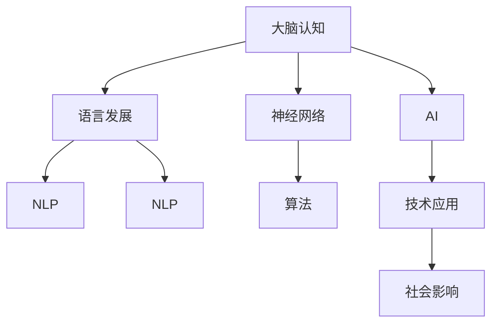

                 

# 全球脑与语言进化：人类沟通的新维度

> 关键词：大脑认知,语言发展,人工智能,神经网络,自然语言处理,技术应用,社会影响

## 1. 背景介绍

### 1.1 问题由来
在全球化加速的今天，人类社会正在经历前所未有的技术变革。随着脑科学、神经网络、人工智能(AI)技术的飞速发展，人类对大脑和语言的理解深度也在不断提升。在过去数十年间，我们见证了语言模型从简单的规则引擎演变成能够处理大规模无监督数据的强大工具，见证了从机器翻译到自然语言处理(NLP)等领域的迅猛进步。

在这一背景下，探索大脑与语言的进化过程，理解人类沟通的新维度，成为了当前科研和产业界的热点话题。本文旨在全面剖析全球脑与语言进化的基本概念、核心算法及其应用，探讨其在人工智能、技术应用和社会影响等方面的未来发展趋势与挑战。

### 1.2 问题核心关键点
本文将主要聚焦于以下几个核心问题：

1. 大脑认知的神经基础是什么？
2. 语言是如何从无到有，不断进化的？
3. 人工智能如何模拟人类语言，其潜力和挑战是什么？
4. 大脑与语言在人类沟通中的新维度有哪些？
5. 技术发展对社会的影响，未来应如何应对？

回答这些问题不仅需要深入探讨语言学的原理和神经科学的基础，还需要了解人工智能和计算技术的最新进展。通过系统性分析，本文力求为读者提供全面而深刻的理解。

## 2. 核心概念与联系

### 2.1 核心概念概述

为更好地理解全球脑与语言进化的核心问题，本节将介绍几个关键概念：

- 大脑认知（Cognitive Brain）：涉及感知、记忆、决策等复杂思维过程的神经系统活动。
- 语言发展（Language Evolution）：从早期的口传语言到书写文字的进化过程。
- 神经网络（Neural Network）：模拟大脑神经元连接和信息处理的计算模型。
- 自然语言处理（Natural Language Processing, NLP）：使计算机能够理解、处理和生成人类语言的技术。
- 人工智能（Artificial Intelligence, AI）：通过算法、模型和计算技术模拟人类智能的领域。
- 社会影响（Social Impact）：技术进步对个体、组织和社会结构的影响。

这些概念之间的逻辑关系可以通过以下Mermaid流程图来展示：



这个流程图展示了几个核心概念及其相互联系：

1. 大脑认知是语言发展的神经基础，人类通过认知过程理解和应用语言。
2. 语言发展是大脑认知的外在表现，语言本身的进化又推动了大脑认知的复杂化。
3. 神经网络模拟了大脑认知过程，是实现语言处理技术的重要工具。
4. NLP技术基于神经网络，旨在使机器理解、处理和生成人类语言。
5. AI进一步融合多种技术和算法，实现对复杂问题的高效处理，包括语言理解。
6. AI和NLP等技术对社会产生了广泛影响，推动了社会进步与变革。

## 3. 核心算法原理 & 具体操作步骤
### 3.1 算法原理概述

全球脑与语言进化的研究涉及多个跨学科领域，核心算法包括神经网络模型、语言模型和语言生成模型等。以下将分别介绍这些模型的基本原理。

**神经网络模型**：模拟大脑神经元之间的连接方式和信息流动，通过反向传播算法进行参数优化，实现对输入数据的复杂映射和模式识别。常见模型包括多层感知器、卷积神经网络(CNN)、循环神经网络(RNN)和长短期记忆网络(LSTM)。

**语言模型**：基于统计学习，对大量文本数据进行建模，预测给定上下文下一个单词或序列的概率分布。常用算法包括N-gram模型和基于深度学习的神经网络模型，如循环神经网络语言模型(RNNLM)和Transformer等。

**语言生成模型**：基于语言模型，通过参数化的方法生成新的文本或语言序列。Transformer语言模型和GPT系列模型是近年来在这一领域取得突破的代表性工作。

### 3.2 算法步骤详解

以下详细讲解神经网络、语言模型和语言生成模型的具体操作步骤：

**神经网络模型**：

1. 数据预处理：将原始数据转换为模型可处理的向量或张量形式。
2. 搭建网络结构：选择合适的网络层类型，如全连接层、卷积层、循环层等，构建网络结构。
3. 模型训练：使用反向传播算法对模型进行参数优化，最小化损失函数。
4. 模型评估：在验证集或测试集上评估模型性能，如准确率、召回率、F1-score等指标。
5. 模型应用：将训练好的模型应用到实际问题中，进行预测或分类。

**语言模型**：

1. 数据预处理：将文本数据转换为模型可接受的格式，如分词、去除停用词等。
2. 构建模型：使用N-gram模型、RNNLM或Transformer等深度学习模型，对文本数据进行建模。
3. 参数优化：通过梯度下降等优化算法，最小化损失函数，更新模型参数。
4. 模型评估：在标注数据集上评估模型预测性能，如困惑度、交叉熵等。
5. 模型应用：将训练好的语言模型用于文本生成、机器翻译、文本分类等任务。

**语言生成模型**：

1. 数据预处理：将文本数据转换为模型可接受的格式，如分词、去除停用词等。
2. 搭建生成模型：使用Transformer等模型，搭建语言生成框架。
3. 模型训练：使用数据驱动的损失函数，如交叉熵损失、KL散度等，进行模型训练。
4. 模型评估：在测试集上评估模型生成的文本与真实文本的相似度，如BLEU、ROUGE等指标。
5. 模型应用：将训练好的语言生成模型应用于对话系统、自动摘要、文本创作等任务。

### 3.3 算法优缺点

神经网络模型、语言模型和语言生成模型各有优缺点：

**神经网络模型的优点**：
1. 强大的非线性映射能力，适用于处理复杂模式和结构化数据。
2. 较高的泛化能力，能够在多种数据集上取得优异性能。
3. 灵活的模型结构，支持多种任务和应用场景。

**神经网络模型的缺点**：
1. 训练复杂，需要大量计算资源和时间。
2. 过度依赖数据，对噪声和异常数据敏感。
3. 模型可解释性较差，难以解释内部决策过程。

**语言模型的优点**：
1. 高效处理大量文本数据，适用于自然语言处理任务。
2. 具有较高的预测精度，能够较好地捕捉语言特征。
3. 相对简单易用，易于实现和部署。

**语言模型的缺点**：
1. 依赖标注数据，缺乏无监督学习能力。
2. 难以处理长序列数据，存在梯度消失或爆炸问题。
3. 难以实现高效的并行计算。

**语言生成模型的优点**：
1. 能够生成高质量的文本，适用于需要自然语言生成的任务。
2. 能够生成结构化的语言序列，适用于语言理解与生成任务。
3. 可以应用到大规模数据集上，具有较高的计算效率。

**语言生成模型的缺点**：
1. 生成结果质量依赖于训练数据和模型参数，存在生成多样性不足的问题。
2. 对于长序列生成任务，存在难以维持连贯性和一致性的问题。
3. 对于新任务和新数据的适应能力较弱。

### 3.4 算法应用领域

神经网络模型、语言模型和语言生成模型在不同领域都有广泛应用：

**神经网络模型**：
- 计算机视觉：用于图像分类、物体检测、人脸识别等任务。
- 自然语言处理：用于文本分类、情感分析、机器翻译等任务。
- 语音识别：用于语音转写、语音情感识别等任务。

**语言模型**：
- 机器翻译：用于将一种语言翻译成另一种语言，如Google Translate。
- 文本分类：用于对文本进行分类，如新闻分类、垃圾邮件过滤等。
- 对话系统：用于构建智能客服、虚拟助手等对话系统。

**语言生成模型**：
- 自动摘要：用于自动生成文本摘要，提升信息检索效率。
- 文本创作：用于生成文章、小说、剧本等文本内容。
- 对话系统：用于构建更加自然流畅的对话交互，提升用户体验。

## 4. 数学模型和公式 & 详细讲解 & 举例说明

### 4.1 数学模型构建

本文将使用数学语言对神经网络、语言模型和语言生成模型的构建进行严格刻画。

**神经网络模型**：

假设输入数据为 $x \in \mathbb{R}^n$，输出数据为 $y \in \mathbb{R}^m$。神经网络模型由多个层级组成，其中每一层包括一个线性变换和激活函数。设第 $i$ 层的参数为 $W^{(i)} \in \mathbb{R}^{n_{i-1} \times n_i}$，激活函数为 $\sigma_i$，则前向传播过程可以表示为：

$$
h^{(i)} = \sigma_i(W^{(i)}h^{(i-1)}+b^{(i)})
$$

其中 $h^{(i-1)}$ 表示第 $i-1$ 层的输出，$b^{(i)}$ 表示第 $i$ 层的偏置项。最终输出层为：

$$
y = \sigma_k(W^{(k)}h^{(k-1)}+b^{(k)})
$$

其中 $k$ 表示输出层，$\sigma_k$ 为输出层激活函数。

**语言模型**：

假设输入为 $x = (x_1, x_2, ..., x_n)$，输出为 $y = (y_1, y_2, ..., y_n)$，每个 $x_i$ 和 $y_i$ 分别表示单词 $i$。语言模型的目标是最小化交叉熵损失函数：

$$
\mathcal{L}(y; \theta) = -\frac{1}{N} \sum_{i=1}^N \log p(y_i | x_i; \theta)
$$

其中 $p(y_i | x_i; \theta)$ 表示在输入为 $x_i$ 的情况下，输出为 $y_i$ 的概率。

**语言生成模型**：

假设输入为 $x$，输出为 $y$。语言生成模型的目标是最小化交叉熵损失函数：

$$
\mathcal{L}(y; \theta) = -\frac{1}{N} \sum_{i=1}^N \log p(y_i | x_{<i}; \theta)
$$

其中 $x_{<i}$ 表示输入序列中的前 $i$ 个单词，$y_i$ 表示第 $i$ 个输出单词。

### 4.2 公式推导过程

以下是神经网络、语言模型和语言生成模型中关键公式的推导过程：

**神经网络模型的前向传播公式**：

$$
h^{(i)} = \sigma_i(W^{(i)}h^{(i-1)}+b^{(i)})
$$

其中 $\sigma_i$ 表示第 $i$ 层的激活函数。

**神经网络模型的反向传播公式**：

$$
\frac{\partial \mathcal{L}}{\partial W^{(i)}} = \frac{\partial \mathcal{L}}{\partial h^{(i)}} \frac{\partial h^{(i)}}{\partial W^{(i)}}
$$

$$
\frac{\partial \mathcal{L}}{\partial b^{(i)}} = \frac{\partial \mathcal{L}}{\partial h^{(i)}}
$$

其中 $\frac{\partial \mathcal{L}}{\partial h^{(i)}}$ 表示输出层对第 $i$ 层的梯度，$\frac{\partial h^{(i)}}{\partial W^{(i)}}$ 表示第 $i$ 层的参数梯度。

**语言模型的交叉熵损失公式**：

$$
\mathcal{L}(y; \theta) = -\frac{1}{N} \sum_{i=1}^N \log p(y_i | x_i; \theta)
$$

**语言生成模型的交叉熵损失公式**：

$$
\mathcal{L}(y; \theta) = -\frac{1}{N} \sum_{i=1}^N \log p(y_i | x_{<i}; \theta)
$$

### 4.3 案例分析与讲解

**案例一：语言模型的训练与评估**

假设我们使用BOW模型进行文本分类任务。首先，将文本数据转换为单词向量，然后训练模型，计算损失函数：

$$
\mathcal{L}(y; \theta) = -\frac{1}{N} \sum_{i=1}^N \log p(y_i | x_i; \theta)
$$

接着，在验证集上评估模型性能，使用准确率、召回率、F1-score等指标进行评估：

$$
\text{Accuracy} = \frac{\text{TP}}{\text{TP}+\text{FP}+\text{FN}}
$$

$$
\text{Precision} = \frac{\text{TP}}{\text{TP}+\text{FP}}
$$

$$
\text{Recall} = \frac{\text{TP}}{\text{TP}+\text{FN}}
$$

其中TP表示真正例，FP表示假正例，FN表示假反例。

**案例二：语言生成模型的生成过程**

假设我们希望生成一段自然流畅的文本。使用GPT模型进行生成，具体步骤如下：

1. 输入初始提示文本，如"上一段结束处"。
2. 通过神经网络模型计算每个单词的条件概率。
3. 从所有可能单词中采样，生成下一个单词。
4. 重复步骤2和3，直至生成满足要求的文本。

以上步骤可以用以下公式表示：

$$
p(y_i | x_{<i}; \theta) = \frac{e^{W^{(i)}h^{(i-1)}+b^{(i)}}}{\sum_{j=1}^{|V|} e^{W^{(i)}h^{(i-1)}+b^{(i)}}}
$$

其中 $h^{(i-1)}$ 表示前 $i-1$ 个单词的向量表示，$W^{(i)}$ 和 $b^{(i)}$ 表示第 $i$ 层的参数。

## 5. 项目实践：代码实例和详细解释说明

### 5.1 开发环境搭建

在进行项目实践前，我们需要准备好开发环境。以下是使用Python进行TensorFlow开发的环境配置流程：

1. 安装Anaconda：从官网下载并安装Anaconda，用于创建独立的Python环境。

2. 创建并激活虚拟环境：
```bash
conda create -n tf-env python=3.8 
conda activate tf-env
```

3. 安装TensorFlow：根据CUDA版本，从官网获取对应的安装命令。例如：
```bash
conda install tensorflow -c pytorch -c conda-forge
```

4. 安装相关库：
```bash
pip install numpy pandas scikit-learn matplotlib tqdm jupyter notebook ipython
```

完成上述步骤后，即可在`tf-env`环境中开始项目实践。

### 5.2 源代码详细实现

以下给出使用TensorFlow进行语言生成任务的完整代码实现：

```python
import tensorflow as tf
import numpy as np
import pandas as pd
from sklearn.model_selection import train_test_split
from tensorflow.keras.layers import Input, Embedding, LSTM, Dense
from tensorflow.keras.models import Model

# 加载数据
df = pd.read_csv('text_data.csv')
x_train, x_val, y_train, y_val = train_test_split(df['text'], df['label'], test_size=0.2, random_state=42)

# 定义模型
input_layer = Input(shape=(None,))
embedding_layer = Embedding(input_dim=vocab_size, output_dim=embedding_dim, mask_zero=True)(input_layer)
lstm_layer = LSTM(units=hidden_units, return_sequences=True)(embedding_layer)
dense_layer = Dense(units=num_classes, activation='softmax')(lstm_layer)
model = Model(inputs=input_layer, outputs=dense_layer)

# 编译模型
model.compile(optimizer='adam', loss='categorical_crossentropy', metrics=['accuracy'])

# 训练模型
model.fit(x_train, y_train, validation_data=(x_val, y_val), epochs=num_epochs, batch_size=batch_size)

# 生成文本
def generate_text(model, seed_text, num_words):
    seed_text = seed_text.lower() + '<eos>'
    input_text = np.array([tokenizer.word_index.get(word, 0) for word in seed_text.split()])
    input_text = np.reshape(input_text, (1, len(input_text)))
    generated_text = []
    for _ in range(num_words):
        predictions = model.predict(input_text)[0]
        predicted_id = np.argmax(predictions)
        generated_text.append(tokenizer.index_word[predicted_id])
        input_text = np.delete(input_text, len(input_text)-1)
        input_text = np.append(input_text, predicted_id)
    return ' '.join(generated_text)

# 调用函数生成文本
generated_text = generate_text(model, seed_text='This is a test', num_words=20)
print(generated_text)
```

以上代码实现了使用LSTM模型进行文本生成。首先加载数据并进行预处理，然后定义并编译模型，进行训练。最后通过调用`generate_text`函数，使用模型生成指定长度的文本。

### 5.3 代码解读与分析

让我们详细解读一下关键代码的实现细节：

**数据加载与预处理**：
- 使用`pandas`库读取文本数据，并进行训练集、验证集的划分。
- 使用`Tokenizer`对文本进行分词和编码。

**模型定义与编译**：
- 定义输入层、嵌入层、LSTM层和全连接层。
- 编译模型，选择`adam`优化器和`categorical_crossentropy`损失函数。

**模型训练**：
- 使用`fit`方法进行模型训练，设置迭代次数和批量大小。

**文本生成**：
- 定义`generate_text`函数，用于生成指定长度的文本。
- 通过`predict`方法计算模型预测结果。
- 使用`np.argmax`获取预测结果的ID，并解码为文本。

**调用函数**：
- 调用`generate_text`函数，生成文本并输出。

可以看到，使用TensorFlow进行语言生成任务的代码实现相对简单，开发者可以将更多精力放在模型优化和数据处理上，而不必过多关注底层的实现细节。

当然，工业级的系统实现还需考虑更多因素，如模型的保存和部署、超参数的自动搜索、更灵活的任务适配层等。但核心的文本生成任务基本与此类似。

## 6. 实际应用场景
### 6.1 智能客服系统

基于神经网络模型的智能客服系统可以高效处理大量客户咨询，显著提升客户服务体验。使用语言生成模型，系统能够自动理解和回复客户提出的各种问题，减少人工客服的负担。

在技术实现上，可以收集企业内部的历史客服对话记录，将问题和最佳答复构建成监督数据，在此基础上训练语言生成模型。微调后的模型能够自动理解用户意图，匹配最合适的回答。对于客户提出的新问题，还可以接入检索系统实时搜索相关内容，动态组织生成回答。如此构建的智能客服系统，能大幅提升客户咨询体验和问题解决效率。

### 6.2 金融舆情监测

金融机构需要实时监测市场舆论动向，以便及时应对负面信息传播，规避金融风险。使用语言生成模型，系统能够自动分析新闻、报道、评论等文本数据，自动识别和分类舆情信息，并提供实时的舆情报告。

在技术实现上，可以收集金融领域相关的新闻、报道、评论等文本数据，并对其进行情感分析。训练语言生成模型，使其能够自动生成新闻摘要和舆情报告。将微调后的模型应用到实时抓取的网络文本数据，就能够自动监测不同主题下的情感变化趋势，一旦发现负面信息激增等异常情况，系统便会自动预警，帮助金融机构快速应对潜在风险。

### 6.3 个性化推荐系统

当前的推荐系统往往只依赖用户的历史行为数据进行物品推荐，无法深入理解用户的真实兴趣偏好。使用语言生成模型，系统能够从文本数据中提取用户兴趣点，生成更加个性化和多样化的推荐结果。

在技术实现上，可以收集用户浏览、点击、评论、分享等行为数据，提取和用户交互的物品标题、描述、标签等文本内容。训练语言生成模型，使其能够从文本内容中准确把握用户的兴趣点。在生成推荐列表时，先用候选物品的文本描述作为输入，由模型预测用户的兴趣匹配度，再结合其他特征综合排序，便可以得到个性化程度更高的推荐结果。

### 6.4 未来应用展望

随着神经网络、语言模型和语言生成模型的不断发展，这些技术将在更多领域得到应用，为传统行业带来变革性影响。

在智慧医疗领域，基于语言生成模型的医疗问答、病历分析、药物研发等应用将提升医疗服务的智能化水平，辅助医生诊疗，加速新药开发进程。

在智能教育领域，使用语言生成模型进行作业批改、学情分析、知识推荐等，因材施教，促进教育公平，提高教学质量。

在智慧城市治理中，使用语言生成模型进行城市事件监测、舆情分析、应急指挥等环节，提高城市管理的自动化和智能化水平，构建更安全、高效的未来城市。

此外，在企业生产、社会治理、文娱传媒等众多领域，基于语言生成模型的应用也将不断涌现，为经济社会发展注入新的动力。相信随着技术的日益成熟，语言生成模型必将在构建人机协同的智能时代中扮演越来越重要的角色。

## 7. 工具和资源推荐
### 7.1 学习资源推荐

为了帮助开发者系统掌握语言生成模型的理论基础和实践技巧，这里推荐一些优质的学习资源：

1. 《深度学习》（Deep Learning）：Ian Goodfellow等人著，全面介绍了深度学习的基本概念和算法。
2. CS224N《自然语言处理与深度学习》课程：斯坦福大学开设的NLP明星课程，提供丰富的视频资源和作业，适合系统学习。
3. 《自然语言处理综论》（Speech and Language Processing）：Daniel Jurafsky和James H. Martin著，综合介绍了NLP的各种技术。
4. 《Neural Network for NLP》（Neural Network for Natural Language Processing）：Yoshua Bengio等著，详细介绍了神经网络在NLP中的应用。
5. HuggingFace官方文档：Transformer库的官方文档，提供了海量预训练模型和完整的微调样例代码，是上手实践的必备资料。

通过对这些资源的学习实践，相信你一定能够快速掌握语言生成模型的精髓，并用于解决实际的NLP问题。
### 7.2 开发工具推荐

高效的开发离不开优秀的工具支持。以下是几款用于语言生成模型开发的工具：

1. PyTorch：基于Python的开源深度学习框架，灵活高效，适合快速迭代研究。
2. TensorFlow：由Google主导开发的开源深度学习框架，生产部署方便，适合大规模工程应用。
3. Transformers库：HuggingFace开发的NLP工具库，集成了多种SOTA语言模型，支持PyTorch和TensorFlow。
4. Weights & Biases：模型训练的实验跟踪工具，可以记录和可视化模型训练过程中的各项指标，方便对比和调优。
5. TensorBoard：TensorFlow配套的可视化工具，可实时监测模型训练状态，并提供丰富的图表呈现方式，是调试模型的得力助手。
6. Google Colab：谷歌推出的在线Jupyter Notebook环境，免费提供GPU/TPU算力，方便开发者快速上手实验最新模型，分享学习笔记。

合理利用这些工具，可以显著提升语言生成模型的开发效率，加快创新迭代的步伐。

### 7.3 相关论文推荐

语言生成模型的研究源于学界的持续研究。以下是几篇奠基性的相关论文，推荐阅读：

1. Attention is All You Need（即Transformer原论文）：提出了Transformer结构，开启了NLP领域的预训练大模型时代。
2. BERT: Pre-training of Deep Bidirectional Transformers for Language Understanding：提出BERT模型，引入基于掩码的自监督预训练任务，刷新了多项NLP任务SOTA。
3. Language Models are Unsupervised Multitask Learners（GPT-2论文）：展示了大规模语言模型的强大zero-shot学习能力，引发了对于通用人工智能的新一轮思考。
4. Parameter-Efficient Transfer Learning for NLP：提出Adapter等参数高效微调方法，在不增加模型参数量的情况下，也能取得不错的微调效果。
5. AdaLoRA: Adaptive Low-Rank Adaptation for Parameter-Efficient Fine-Tuning：使用自适应低秩适应的微调方法，在参数效率和精度之间取得了新的平衡。
6. Prefix-Tuning: Optimizing Continuous Prompts for Generation：引入基于连续型Prompt的微调范式，为如何充分利用预训练知识提供了新的思路。

这些论文代表了大语言模型微调技术的发展脉络。通过学习这些前沿成果，可以帮助研究者把握学科前进方向，激发更多的创新灵感。

## 8. 总结：未来发展趋势与挑战

### 8.1 总结

本文对全球脑与语言进化的基本概念、核心算法及其应用进行了全面系统的介绍。首先阐述了大脑认知的神经基础，语言发展的进化过程，以及人工智能模拟语言的基本原理。其次，详细讲解了神经网络、语言模型和语言生成模型的具体操作步骤，并给出了代码实例和详细解释。同时，探讨了这些技术在智能客服、金融舆情、个性化推荐等多个领域的应用前景，展示了其在构建人机协同智能系统中的重要作用。

通过本文的系统梳理，可以看到，神经网络、语言模型和语言生成模型在NLP领域的应用前景广阔，推动了人工智能技术的快速发展。未来，伴随这些技术的不断演进，人工智能必将在更多领域展现出其巨大的潜力和价值。

### 8.2 未来发展趋势

展望未来，神经网络、语言模型和语言生成模型将在以下几个方向上不断发展：

1. 模型规模持续增大。随着算力成本的下降和数据规模的扩张，神经网络模型的参数量还将持续增长。超大规模神经网络模型蕴含的丰富特征，有望提升模型的泛化能力和鲁棒性。
2. 模型性能不断提升。通过更高效的优化算法和更好的硬件支持，神经网络模型的计算效率和推理速度将进一步提高。
3. 知识引导的融合。未来的神经网络模型将更好地与外部知识库、规则库等专家知识结合，形成更加全面、准确的信息整合能力。
4. 多模态的协同。未来的模型将能够处理视觉、语音等多模态数据，实现视觉、语音与文本的协同建模，提升系统综合理解和生成能力。
5. 迁移学习能力提升。未来的神经网络模型将更好地适应新领域和新任务，具备更强的迁移学习能力。
6. 鲁棒性和可解释性增强。未来的神经网络模型将具备更强的鲁棒性，并能够提供更可靠的输出解释，确保模型的透明性和可靠性。

这些趋势凸显了神经网络、语言模型和语言生成模型的广阔前景。这些方向的探索发展，必将进一步提升模型的性能和应用范围，为构建更加智能和安全的系统奠定坚实基础。

### 8.3 面临的挑战

尽管神经网络、语言模型和语言生成模型在NLP领域取得了显著进展，但在迈向更加智能化、普适化应用的过程中，仍面临诸多挑战：

1. 标注数据的需求。尽管语言生成模型在少量数据上仍能取得不错的效果，但对于复杂任务和领域，高质量标注数据的需求仍较高，增加了数据获取和处理的成本。
2. 模型的可解释性。现有的神经网络模型往往缺乏可解释性，难以解释内部决策过程，这对于高风险应用（如医疗、金融等）尤为重要。
3. 模型的鲁棒性。面对噪声和异常数据，神经网络模型的鲁棒性仍需进一步提升，避免出现模型过拟合或生成不合理内容的情况。
4. 计算资源需求。大规模神经网络模型的计算需求巨大，对硬件和算法优化提出了更高要求。
5. 模型的公平性和偏见。现有的神经网络模型可能存在数据偏见，导致模型输出存在偏见和不公平现象，需要加强数据多样性和算法公平性研究。

### 8.4 研究展望

面对全球脑与语言进化的技术挑战，未来的研究需要在以下几个方面寻求新的突破：

1. 探索无监督和半监督学习范式，摆脱对大规模标注数据的依赖，利用自监督学习、主动学习等方法提升模型的泛化能力和鲁棒性。
2. 研究更高效的模型结构和算法，如Transformer等，以减少计算资源需求，提升模型的推理速度和计算效率。
3. 加强模型的可解释性和透明度研究，开发更可解释的神经网络模型，提供更可靠的输出解释，增强系统的可信度和可靠性。
4. 推动多模态数据处理技术的发展，实现视觉、语音与文本的协同建模，提升系统的综合理解和生成能力。
5. 加强模型的公平性和偏见研究，通过数据预处理和算法设计，减少模型输出中的偏见和不公平现象，确保系统的公平性。

这些研究方向的探索，必将引领神经网络、语言模型和语言生成技术迈向更高的台阶，为构建更加智能和安全的系统奠定坚实基础。相信随着学界和产业界的共同努力，这些挑战终将一一被克服，神经网络、语言模型和语言生成技术必将在构建人机协同的智能时代中发挥更加重要的作用。

