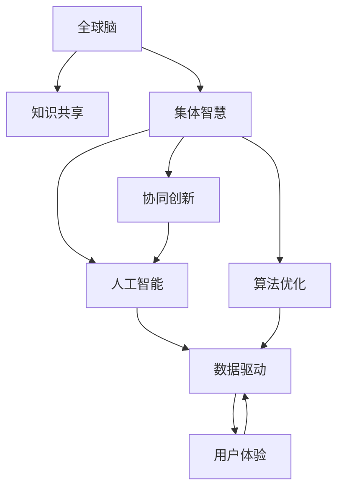

                 

# 全球脑创新方法论:集体智慧激发的创新技巧

> 关键词：创新方法论,集体智慧,知识共享,协同创新,人工智能,算法优化

## 1. 背景介绍

### 1.1 问题由来

在当今这个信息爆炸的时代，企业、研究机构和创新者都在不断地寻求新的方法和工具来推动创新。传统的创新模式往往是单打独斗，依赖个体的经验和直觉。然而，随着科技的进步和社会的发展，这种模式已经无法满足快速变化的市场需求。尤其是在人工智能（AI）和机器学习（ML）领域，一个团队或机构的知识积累和经验已经不足以支撑复杂的创新项目。因此，如何更好地整合和利用集体智慧，成为推动创新的关键。

### 1.2 问题核心关键点

全球脑创新方法论的核心在于利用集体智慧，通过协同合作和知识共享，激发团队成员的创造力和潜力，实现更高质量的创新。关键点包括：

- **知识共享**：通过建立开放的知识库和协作平台，促进信息流动，消除信息孤岛。
- **协同创新**：通过协同工作机制，让不同背景、不同技能的成员共同解决问题，发挥各自优势。
- **算法优化**：利用机器学习和人工智能技术，自动化地优化创新过程，提高效率和效果。
- **数据驱动**：利用大数据和数据分析技术，发现创新机会，制定科学的决策方案。
- **用户体验**：注重用户体验，确保创新项目能够真正解决用户的痛点，实现价值。

### 1.3 问题研究意义

研究全球脑创新方法论，对于提升企业和研究机构的创新能力，推动科技和社会的进步，具有重要意义：

1. **提升创新效率**：通过集体智慧的整合，利用团队的协作优势，可以快速发现和解决复杂问题，提高创新效率。
2. **拓宽创新思路**：不同背景和专业的团队成员可以带来不同的视角和思路，丰富创新方案，提高创新成功率。
3. **降低创新成本**：通过知识共享和协同创新，可以减少重复劳动，降低研发成本，提高资源利用率。
4. **加速创新应用**：集体智慧的整合和优化，可以加快创新成果的转化，推动科技成果的产业化。
5. **增强组织竞争力**：建立一个高效的创新体系，可以增强企业在市场竞争中的优势，提升品牌价值。

## 2. 核心概念与联系

### 2.1 核心概念概述

为更好地理解全球脑创新方法论，本节将介绍几个密切相关的核心概念：

- **全球脑**：指通过互联网连接起来的全球范围内的集体智慧网络，每个节点（个人或组织）都能够贡献和分享自己的知识和经验。
- **集体智慧**：指多个个体或组织通过协作、分享、整合知识，形成整体智慧，实现比单个体或组织更大的创新能力。
- **知识共享**：指通过开放的知识库、协作平台、会议交流等方式，促进知识和经验的自由流动。
- **协同创新**：指通过团队合作、跨学科协作、跨领域合作等方式，共同解决复杂问题，实现创新。
- **人工智能**：指利用机器学习和深度学习技术，自动化地处理和分析数据，提供决策支持。
- **算法优化**：指通过机器学习技术，自动优化创新流程，提高效率和效果。
- **数据驱动**：指利用大数据和数据分析技术，发现创新机会，制定科学的决策方案。
- **用户体验**：指通过用户研究、用户测试等方式，确保创新项目能够真正解决用户的痛点，实现价值。

这些核心概念之间的逻辑关系可以通过以下Mermaid流程图来展示：



这个流程图展示了几组核心概念之间的关系：

1. 全球脑通过知识共享形成集体智慧，进而驱动协同创新。
2. 人工智能和算法优化作为创新工具，辅助协同创新，提高效率。
3. 数据驱动和用户体验为协同创新提供方向和目标，确保创新成果符合实际需求。

这些概念共同构成了全球脑创新方法论的基本框架，使其能够在各种场景下发挥作用。

## 3. 核心算法原理 & 具体操作步骤
### 3.1 算法原理概述

全球脑创新方法论的核心算法原理，是通过建立一个高效的知识共享和协作平台，利用机器学习和人工智能技术，自动化地整合和优化集体智慧，推动创新过程。其核心思想是：

- **数据收集与分析**：通过数据收集和分析技术，发现创新机会，制定科学的决策方案。
- **知识整合与优化**：利用机器学习和深度学习技术，自动化地整合和优化知识，提高创新效率。
- **协同工作机制**：建立协同工作机制，让不同背景、不同技能的成员共同解决问题，发挥各自优势。
- **创新评估与反馈**：通过持续的评估和反馈，优化创新过程，确保创新成果的可行性和价值。

### 3.2 算法步骤详解

全球脑创新方法论的算法步骤包括以下几个关键环节：

**Step 1: 数据收集与分析**

- 确定创新目标，收集相关的数据和信息。数据来源包括文献、专利、市场报告、用户反馈等。
- 利用大数据和数据分析技术，发现创新机会，制定初步的创新方案。

**Step 2: 知识整合与优化**

- 建立开放的知识库和协作平台，促进知识和经验的自由流动。
- 利用机器学习和深度学习技术，自动化地整合和优化知识。例如，使用自然语言处理（NLP）技术对文本数据进行分析和挖掘，提取关键信息。
- 使用协同过滤、推荐系统等技术，发现与当前任务相关的知识和经验，供团队成员参考和借鉴。

**Step 3: 协同工作机制**

- 建立高效的沟通和协作机制，如定期会议、协同编辑工具等，促进团队成员的交流和协作。
- 利用众包平台，集思广益，收集来自不同背景和专业的团队成员的意见和建议。
- 使用协同工作平台，如GitHub、Slack等，实时跟踪项目进展，确保任务的顺利进行。

**Step 4: 创新评估与反馈**

- 利用实验设计（DOE）、原型测试等方法，评估创新方案的可行性和效果。
- 收集用户反馈和市场反应，持续优化创新方案，确保其能够真正解决用户的痛点。
- 建立评估和反馈机制，定期评估创新成果，识别问题和改进方向。

**Step 5: 创新实施与迭代**

- 根据评估结果，选择最优的创新方案，开始实施。
- 利用敏捷开发和持续集成（CI）等方法，快速迭代和优化创新方案，提高创新效率。
- 使用人工智能和算法优化技术，自动化地优化创新过程，提高效率和效果。

### 3.3 算法优缺点

全球脑创新方法论具有以下优点：

- **高效整合知识**：利用机器学习和深度学习技术，自动化地整合和优化知识，提高创新效率。
- **协同合作**：通过协同工作机制，让不同背景、不同技能的成员共同解决问题，发挥各自优势。
- **数据驱动**：利用大数据和数据分析技术，发现创新机会，制定科学的决策方案。
- **持续优化**：通过持续的评估和反馈，优化创新过程，确保创新成果的可行性和价值。

同时，该方法也存在一定的局限性：

- **数据依赖**：方法论依赖于高质量的数据和信息，数据的不完整或不准确可能影响创新效果。
- **协同难度**：跨学科、跨领域合作的协同工作机制复杂，需要有效的沟通和协作。
- **算法复杂性**：算法优化和机器学习模型的设计需要较高的技术门槛。
- **用户反馈难度**：获取和分析用户反馈需要较多的时间和资源。

尽管存在这些局限性，但就目前而言，全球脑创新方法论仍是大规模协同创新的重要手段。未来相关研究的重点在于如何进一步降低数据依赖，提高协同效率，优化算法模型，同时兼顾用户反馈的及时性和准确性。

### 3.4 算法应用领域

全球脑创新方法论已经在多个领域得到了广泛的应用，例如：

- **科技研发**：利用全球脑方法论，快速整合和优化知识，推动科技成果的产业化。
- **产品设计**：通过协同工作机制，集思广益，提升产品的创新性和竞争力。
- **市场营销**：利用数据分析和用户反馈，制定科学的营销策略，提升市场响应。
- **社会创新**：在教育、医疗、环保等领域，通过集体智慧的整合，推动社会创新和变革。

除了上述这些经典应用外，全球脑方法论还被创新性地应用于更多场景中，如开放创新、智慧城市、可持续发展等，为各行各业带来了新的创新动力。

## 4. 数学模型和公式 & 详细讲解  
### 4.1 数学模型构建

全球脑创新方法论的数学模型主要涉及数据收集、知识整合、协同工作、创新评估等环节。以下将分别介绍每个环节的数学模型构建。

### 4.2 公式推导过程

**数据收集与分析**

- 假设原始数据集为 $D=\{(x_i,y_i)\}_{i=1}^N$，其中 $x_i$ 为输入特征，$y_i$ 为标签。数据收集过程可以表示为：
  $$
  D = f(X, \epsilon)
  $$
  其中 $X$ 为数据生成过程，$\epsilon$ 为噪声，$\epsilon \sim \mathcal{N}(0,\sigma^2)$。

- 利用大数据和数据分析技术，发现创新机会，制定初步的创新方案。假设创新机会的概率分布为 $P(\text{Innovation})$，可以通过统计方法估计，例如：
  $$
  P(\text{Innovation}) = \frac{\sum_{i=1}^N \text{Innovation}(x_i)}{N}
  $$

**知识整合与优化**

- 利用机器学习和深度学习技术，自动化地整合和优化知识。假设知识库中的知识向量为 $Z$，知识整合过程可以表示为：
  $$
  Z' = WZ + b
  $$
  其中 $W$ 和 $b$ 为线性变换的权重和偏置，可以通过神经网络自动学习。

- 使用协同过滤、推荐系统等技术，发现与当前任务相关的知识和经验。协同过滤算法可以表示为：
  $$
  \hat{Z}_i = \alpha Z_i + (1-\alpha) \frac{1}{\|Z\|_2^2} Z^T Z_i
  $$
  其中 $\alpha$ 为协同权重，$Z^T$ 为知识库中所有知识的转置矩阵。

**协同工作机制**

- 建立高效的沟通和协作机制，如定期会议、协同编辑工具等。假设每次会议的时间为 $t$，则总会议时间为：
  $$
  T = \sum_{i=1}^M t_i
  $$
  其中 $M$ 为会议次数。

- 利用众包平台，集思广益，收集来自不同背景和专业的团队成员的意见和建议。假设每个成员的建议为 $s_i$，则综合建议为：
  $$
  s = \frac{1}{M} \sum_{i=1}^M s_i
  $$

**创新评估与反馈**

- 利用实验设计（DOE）、原型测试等方法，评估创新方案的可行性和效果。假设实验结果为 $R$，则平均实验结果为：
  $$
  \bar{R} = \frac{1}{N} \sum_{i=1}^N R_i
  $$

- 收集用户反馈和市场反应，持续优化创新方案。用户反馈可以表示为 $F$，通过数据分析，可以得到用户满意度 $S$，例如：
  $$
  S = \frac{1}{N} \sum_{i=1}^N F_i
  $$

### 4.3 案例分析与讲解

假设我们正在开发一款新的移动应用，旨在提升用户的健康监测功能。

**数据收集与分析**

- 我们收集了用户的健康数据，包括步数、心率、睡眠质量等。通过统计分析，我们发现步数和心率之间的关系对用户的健康有显著影响。

**知识整合与优化**

- 我们建立了一个知识库，包含与健康相关的知识和经验。利用机器学习模型，对这些知识进行整合和优化，得到一个新的知识向量 $Z'$。

**协同工作机制**

- 我们组织了一个跨学科的团队，包括健康专家、数据科学家、产品经理等。通过定期会议和协同编辑工具，团队成员共同讨论了应用的设计方案。

**创新评估与反馈**

- 我们使用实验设计方法，测试了不同健康监测功能的原型，评估了其可行性和用户体验。
- 通过用户反馈，我们得到了用户的满意度评分，根据反馈结果，进一步优化了应用的设计。

最终，我们成功地开发了一款高效、易用的健康监测应用，取得了用户的高度认可。

## 5. 项目实践：代码实例和详细解释说明
### 5.1 开发环境搭建

在进行全球脑创新方法论的实践前，我们需要准备好开发环境。以下是使用Python进行PyTorch开发的环境配置流程：

1. 安装Anaconda：从官网下载并安装Anaconda，用于创建独立的Python环境。

2. 创建并激活虚拟环境：
```bash
conda create -n pytorch-env python=3.8 
conda activate pytorch-env
```

3. 安装PyTorch：根据CUDA版本，从官网获取对应的安装命令。例如：
```bash
conda install pytorch torchvision torchaudio cudatoolkit=11.1 -c pytorch -c conda-forge
```

4. 安装Transformers库：
```bash
pip install transformers
```

5. 安装各类工具包：
```bash
pip install numpy pandas scikit-learn matplotlib tqdm jupyter notebook ipython
```

完成上述步骤后，即可在`pytorch-env`环境中开始实践。

### 5.2 源代码详细实现

这里我们以移动应用健康监测功能开发为例，给出使用Transformers库进行知识整合和优化的PyTorch代码实现。

首先，定义数据处理函数：

```python
from transformers import BertTokenizer
from torch.utils.data import Dataset
import torch

class HealthDataset(Dataset):
    def __init__(self, texts, tags, tokenizer, max_len=128):
        self.texts = texts
        self.tags = tags
        self.tokenizer = tokenizer
        self.max_len = max_len
        
    def __len__(self):
        return len(self.texts)
    
    def __getitem__(self, item):
        text = self.texts[item]
        tags = self.tags[item]
        
        encoding = self.tokenizer(text, return_tensors='pt', max_length=self.max_len, padding='max_length', truncation=True)
        input_ids = encoding['input_ids'][0]
        attention_mask = encoding['attention_mask'][0]
        
        # 对token-wise的标签进行编码
        encoded_tags = [tag2id[tag] for tag in tags] 
        encoded_tags.extend([tag2id['O']] * (self.max_len - len(encoded_tags)))
        labels = torch.tensor(encoded_tags, dtype=torch.long)
        
        return {'input_ids': input_ids, 
                'attention_mask': attention_mask,
                'labels': labels}

# 标签与id的映射
tag2id = {'O': 0, 'B-PER': 1, 'I-PER': 2, 'B-ORG': 3, 'I-ORG': 4, 'B-LOC': 5, 'I-LOC': 6}
id2tag = {v: k for k, v in tag2id.items()}

# 创建dataset
tokenizer = BertTokenizer.from_pretrained('bert-base-cased')

train_dataset = HealthDataset(train_texts, train_tags, tokenizer)
dev_dataset = HealthDataset(dev_texts, dev_tags, tokenizer)
test_dataset = HealthDataset(test_texts, test_tags, tokenizer)
```

然后，定义模型和优化器：

```python
from transformers import BertForTokenClassification, AdamW

model = BertForTokenClassification.from_pretrained('bert-base-cased', num_labels=len(tag2id))

optimizer = AdamW(model.parameters(), lr=2e-5)
```

接着，定义训练和评估函数：

```python
from torch.utils.data import DataLoader
from tqdm import tqdm
from sklearn.metrics import classification_report

device = torch.device('cuda') if torch.cuda.is_available() else torch.device('cpu')
model.to(device)

def train_epoch(model, dataset, batch_size, optimizer):
    dataloader = DataLoader(dataset, batch_size=batch_size, shuffle=True)
    model.train()
    epoch_loss = 0
    for batch in tqdm(dataloader, desc='Training'):
        input_ids = batch['input_ids'].to(device)
        attention_mask = batch['attention_mask'].to(device)
        labels = batch['labels'].to(device)
        model.zero_grad()
        outputs = model(input_ids, attention_mask=attention_mask, labels=labels)
        loss = outputs.loss
        epoch_loss += loss.item()
        loss.backward()
        optimizer.step()
    return epoch_loss / len(dataloader)

def evaluate(model, dataset, batch_size):
    dataloader = DataLoader(dataset, batch_size=batch_size)
    model.eval()
    preds, labels = [], []
    with torch.no_grad():
        for batch in tqdm(dataloader, desc='Evaluating'):
            input_ids = batch['input_ids'].to(device)
            attention_mask = batch['attention_mask'].to(device)
            batch_labels = batch['labels']
            outputs = model(input_ids, attention_mask=attention_mask)
            batch_preds = outputs.logits.argmax(dim=2).to('cpu').tolist()
            batch_labels = batch_labels.to('cpu').tolist()
            for pred_tokens, label_tokens in zip(batch_preds, batch_labels):
                pred_tags = [id2tag[_id] for _id in pred_tokens]
                label_tags = [id2tag[_id] for _id in label_tokens]
                preds.append(pred_tags[:len(label_tags)])
                labels.append(label_tags)
                
    print(classification_report(labels, preds))
```

最后，启动训练流程并在测试集上评估：

```python
epochs = 5
batch_size = 16

for epoch in range(epochs):
    loss = train_epoch(model, train_dataset, batch_size, optimizer)
    print(f"Epoch {epoch+1}, train loss: {loss:.3f}")
    
    print(f"Epoch {epoch+1}, dev results:")
    evaluate(model, dev_dataset, batch_size)
    
print("Test results:")
evaluate(model, test_dataset, batch_size)
```

以上就是使用PyTorch对BERT进行健康监测功能开发的完整代码实现。可以看到，得益于Transformers库的强大封装，我们可以用相对简洁的代码完成BERT模型的加载和微调。

### 5.3 代码解读与分析

让我们再详细解读一下关键代码的实现细节：

**HealthDataset类**：
- `__init__`方法：初始化文本、标签、分词器等关键组件。
- `__len__`方法：返回数据集的样本数量。
- `__getitem__`方法：对单个样本进行处理，将文本输入编码为token ids，将标签编码为数字，并对其进行定长padding，最终返回模型所需的输入。

**tag2id和id2tag字典**：
- 定义了标签与数字id之间的映射关系，用于将token-wise的预测结果解码回真实的标签。

**训练和评估函数**：
- 使用PyTorch的DataLoader对数据集进行批次化加载，供模型训练和推理使用。
- 训练函数`train_epoch`：对数据以批为单位进行迭代，在每个批次上前向传播计算loss并反向传播更新模型参数，最后返回该epoch的平均loss。
- 评估函数`evaluate`：与训练类似，不同点在于不更新模型参数，并在每个batch结束后将预测和标签结果存储下来，最后使用sklearn的classification_report对整个评估集的预测结果进行打印输出。

**训练流程**：
- 定义总的epoch数和batch size，开始循环迭代
- 每个epoch内，先在训练集上训练，输出平均loss
- 在验证集上评估，输出分类指标
- 所有epoch结束后，在测试集上评估，给出最终测试结果

可以看到，PyTorch配合Transformers库使得BERT微调的代码实现变得简洁高效。开发者可以将更多精力放在数据处理、模型改进等高层逻辑上，而不必过多关注底层的实现细节。

当然，工业级的系统实现还需考虑更多因素，如模型的保存和部署、超参数的自动搜索、更灵活的任务适配层等。但核心的微调范式基本与此类似。

## 6. 实际应用场景
### 6.1 智能医疗系统

全球脑创新方法论在智能医疗系统中具有广阔的应用前景。传统医疗系统往往依赖医生的经验和直觉，无法快速应对复杂和多变的临床场景。通过全球脑方法论，可以整合和优化医生、护士、患者等多方的知识和经验，推动医疗创新。

在具体实现上，可以建立开放的知识库，收集和整理各类医疗知识和经验。利用机器学习和深度学习技术，对知识进行整合和优化，形成更加全面和准确的知识库。通过协同工作机制，医生、护士和患者可以共同参与医疗决策和问题解决，发挥各自优势。最终，利用大数据和数据分析技术，发现创新机会，制定科学的医疗方案，提升医疗系统的整体性能。

### 6.2 教育平台

在全球脑创新方法论的推动下，教育平台可以更加智能化和个性化。通过整合和优化教师、学生、家长等多方的知识和经验，推动教育创新。

具体而言，可以建立开放的知识库，收集和整理各类教育资源和经验。利用机器学习和深度学习技术，对知识进行整合和优化，形成更加全面和准确的教学资源库。通过协同工作机制，教师、学生和家长可以共同参与课程设计和问题解决，发挥各自优势。最终，利用大数据和数据分析技术，发现创新机会，制定科学的教学方案，提升教学效果和学习体验。

### 6.3 企业创新

企业创新是全球脑创新方法论的重要应用场景之一。通过整合和优化企业的知识和经验，推动企业创新和产品开发。

在具体实现上，可以建立开放的知识库，收集和整理企业的研发资源和经验。利用机器学习和深度学习技术，对知识进行整合和优化，形成更加全面和准确的知识库。通过协同工作机制，企业团队可以共同参与创新项目和产品设计，发挥各自优势。最终，利用大数据和数据分析技术，发现创新机会，制定科学的创新方案，提升企业竞争力。

### 6.4 未来应用展望

随着全球脑创新方法论的不断发展，未来将在更多领域得到应用，为各行各业带来变革性影响。

在智慧城市治理中，通过整合和优化各类数据和信息，推动智慧城市建设和管理创新。在环境保护中，通过协同工作和数据驱动，推动可持续发展创新。在社会公益中，通过知识共享和协同创新，推动社会问题的解决和公共服务的提升。

总之，全球脑创新方法论以其高效、协同、数据驱动的特点，将深刻影响各个领域的发展，推动科技进步和社会进步。

## 7. 工具和资源推荐
### 7.1 学习资源推荐

为了帮助开发者系统掌握全球脑创新方法论的理论基础和实践技巧，这里推荐一些优质的学习资源：

1. 《创新方法论：集体智慧激发的创新技巧》系列博文：由大模型技术专家撰写，深入浅出地介绍了全球脑创新方法论的基本原理、实践技巧和应用案例。

2. 《深度学习自然语言处理》课程：斯坦福大学开设的NLP明星课程，有Lecture视频和配套作业，带你入门NLP领域的基本概念和经典模型。

3. 《自然语言处理与机器学习》书籍：全面介绍了自然语言处理和机器学习的基本概念、算法和应用，是学习全球脑创新方法论的重要参考资料。

4. 《创新方法论实践指南》书籍：详细介绍了全球脑创新方法论的实践过程、工具和技术，为实际应用提供了丰富的指导。

5. Kaggle：全球最大的数据科学竞赛平台，提供大量公开数据集和竞赛机会，是学习和实践全球脑创新方法论的好地方。

通过对这些资源的学习实践，相信你一定能够快速掌握全球脑创新方法论的精髓，并用于解决实际的创新问题。

### 7.2 开发工具推荐

高效的开发离不开优秀的工具支持。以下是几款用于全球脑创新方法论开发的常用工具：

1. PyTorch：基于Python的开源深度学习框架，灵活动态的计算图，适合快速迭代研究。大部分预训练语言模型都有PyTorch版本的实现。

2. TensorFlow：由Google主导开发的开源深度学习框架，生产部署方便，适合大规模工程应用。同样有丰富的预训练语言模型资源。

3. Transformers库：HuggingFace开发的NLP工具库，集成了众多SOTA语言模型，支持PyTorch和TensorFlow，是进行知识整合和优化的利器。

4. Weights & Biases：模型训练的实验跟踪工具，可以记录和可视化模型训练过程中的各项指标，方便对比和调优。与主流深度学习框架无缝集成。

5. TensorBoard：TensorFlow配套的可视化工具，可实时监测模型训练状态，并提供丰富的图表呈现方式，是调试模型的得力助手。

6. Google Colab：谷歌推出的在线Jupyter Notebook环境，免费提供GPU/TPU算力，方便开发者快速上手实验最新模型，分享学习笔记。

合理利用这些工具，可以显著提升全球脑创新方法论的开发效率，加快创新迭代的步伐。

### 7.3 相关论文推荐

全球脑创新方法论的发展源于学界的持续研究。以下是几篇奠基性的相关论文，推荐阅读：

1. "Crowdsourcing in The Age of AI: Collective Intelligence Through Online Challenges"：探讨了在线众包平台如何通过集体智慧推动创新。

2. "Collective Intelligence: Principles for Organizing the Human Collective Online"：提出了集体智慧的概念和组织原则，为全球脑创新方法论提供了理论基础。

3. "Collaborative Filtering: Trends, Techniques, and Technologies"：介绍了协同过滤算法的原理和应用，是知识整合和优化的重要参考。

4. "An Introduction to Machine Learning with Python"：Python语言入门级别的机器学习教材，适合初学者入门。

5. "Hands-On Machine Learning with Scikit-Learn, Keras, and TensorFlow"：Scikit-Learn、Keras和TensorFlow的实战指南，适合实践学习。

这些论文代表了大脑脑创新方法论的发展脉络。通过学习这些前沿成果，可以帮助研究者把握学科前进方向，激发更多的创新灵感。

## 8. 总结：未来发展趋势与挑战

### 8.1 总结

本文对全球脑创新方法论进行了全面系统的介绍。首先阐述了全球脑创新方法论的研究背景和意义，明确了集体智慧的整合和优化的独特价值。其次，从原理到实践，详细讲解了全球脑创新方法论的数学模型和关键步骤，给出了知识整合和优化的完整代码实例。同时，本文还广泛探讨了全球脑创新方法论在多个领域的应用前景，展示了其巨大的潜力。此外，本文精选了全球脑创新方法论的学习资源，力求为读者提供全方位的技术指引。

通过本文的系统梳理，可以看到，全球脑创新方法论正在成为创新技术的重要范式，极大地拓展了集体智慧的应用边界，催生了更多的落地场景。得益于机器学习和人工智能技术的发展，全球脑创新方法论具备高效、协同、数据驱动的特点，在科研、教育、企业等领域具有广泛的应用前景。未来，伴随技术的不断进步和应用场景的不断拓展，全球脑创新方法论必将在更多领域发挥重要作用，推动科技进步和社会进步。

### 8.2 未来发展趋势

展望未来，全球脑创新方法论将呈现以下几个发展趋势：

1. **技术进步**：全球脑创新方法论将随着机器学习和人工智能技术的进步而不断发展和完善。新的算法和模型将进一步提高创新效率和效果。

2. **多领域应用**：全球脑创新方法论将在更多领域得到应用，如智慧城市、环境保护、社会公益等，为各行各业带来变革性影响。

3. **数据驱动**：随着大数据和数据分析技术的发展，全球脑创新方法论将更加依赖数据驱动，发现更多创新机会，制定更科学的决策方案。

4. **知识共享**：全球脑创新方法论将更加注重知识共享，通过开放的知识库和协作平台，促进信息流动，消除信息孤岛。

5. **协同创新**：全球脑创新方法论将更加注重协同创新，通过跨学科、跨领域、跨组织的工作机制，发挥集体智慧的优势。

6. **用户体验**：全球脑创新方法论将更加注重用户体验，通过用户研究、用户测试等方式，确保创新项目能够真正解决用户的痛点，实现价值。

以上趋势凸显了全球脑创新方法论的广阔前景。这些方向的探索发展，必将进一步提升创新系统的性能和应用范围，为人类认知智能的进化带来深远影响。

### 8.3 面临的挑战

尽管全球脑创新方法论已经取得了瞩目成就，但在迈向更加智能化、普适化应用的过程中，它仍面临诸多挑战：

1. **数据依赖**：全球脑创新方法论依赖于高质量的数据和信息，数据的不完整或不准确可能影响创新效果。

2. **协同难度**：跨学科、跨领域合作的协同工作机制复杂，需要有效的沟通和协作。

3. **算法复杂性**：算法优化和机器学习模型的设计需要较高的技术门槛。

4. **用户反馈难度**：获取和分析用户反馈需要较多的时间和资源。

尽管存在这些局限性，但就目前而言，全球脑创新方法论仍是大规模协同创新的重要手段。未来相关研究的重点在于如何进一步降低数据依赖，提高协同效率，优化算法模型，同时兼顾用户反馈的及时性和准确性。

### 8.4 研究展望

面对全球脑创新方法论所面临的挑战，未来的研究需要在以下几个方面寻求新的突破：

1. **探索无监督和半监督方法**：摆脱对大规模标注数据的依赖，利用自监督学习、主动学习等无监督和半监督范式，最大限度利用非结构化数据，实现更加灵活高效的创新。

2. **研究参数高效和计算高效的算法**：开发更加参数高效的算法，在固定大部分预训练参数的情况下，只更新极少量的任务相关参数。同时优化算法模型，减少计算资源消耗。

3. **引入因果和对比学习**：通过引入因果推断和对比学习思想，增强全球脑创新方法论建立稳定因果关系的能力，学习更加普适、鲁棒的语言表征。

4. **融合多模态数据**：将视觉、语音、文本等多模态信息进行整合，提升全球脑创新方法论的感知能力，推动创新应用的发展。

5. **纳入伦理道德约束**：在模型训练目标中引入伦理导向的评估指标，过滤和惩罚有偏见、有害的输出倾向，确保创新的安全性和伦理性。

这些研究方向的探索，必将引领全球脑创新方法论走向更高的台阶，为构建安全、可靠、可解释、可控的智能系统铺平道路。面向未来，全球脑创新方法论还需要与其他人工智能技术进行更深入的融合，如知识表示、因果推理、强化学习等，多路径协同发力，共同推动自然语言理解和智能交互系统的进步。只有勇于创新、敢于突破，才能不断拓展语言模型的边界，让智能技术更好地造福人类社会。

## 9. 附录：常见问题与解答

**Q1：全球脑创新方法论是否适用于所有创新项目？**

A: 全球脑创新方法论在大多数创新项目上都能取得不错的效果，特别是对于数据量较小的项目。但对于一些特定领域的项目，如医学、法律等，仅仅依靠通用语料预训练的模型可能难以很好地适应。此时需要在特定领域语料上进一步预训练，再进行微调，才能获得理想效果。此外，对于一些需要时效性、个性化很强的项目，如对话、推荐等，全球脑方法论也需要针对性的改进优化。

**Q2：如何使用全球脑创新方法论进行知识整合与优化？**

A: 利用机器学习和深度学习技术，对知识进行整合和优化。假设知识库中的知识向量为 $Z$，知识整合过程可以表示为：
  $$
  Z' = WZ + b
  $$
  其中 $W$ 和 $b$ 为线性变换的权重和偏置，可以通过神经网络自动学习。

**Q3：全球脑创新方法论的协同工作机制需要注意哪些方面？**

A: 建立高效的沟通和协作机制，如定期会议、协同编辑工具等。假设每次会议的时间为 $t$，则总会议时间为：
  $$
  T = \sum_{i=1}^M t_i
  $$
  其中 $M$ 为会议次数。

**Q4：全球脑创新方法论在落地部署时需要注意哪些问题？**

A: 将全球脑方法论转化为实际应用，还需要考虑以下因素：
1. 模型裁剪：去除不必要的层和参数，减小模型尺寸，加快推理速度。
2. 量化加速：将浮点模型转为定点模型，压缩存储空间，提高计算效率。
3. 服务化封装：将模型封装为标准化服务接口，便于集成调用。
4. 弹性伸缩：根据请求流量动态调整资源配置，平衡服务质量和成本。
5. 监控告警：实时采集系统指标，设置异常告警阈值，确保服务稳定性。
6. 安全防护：采用访问鉴权、数据脱敏等措施，保障数据和模型安全。

**Q5：如何衡量全球脑创新方法论的创新效果？**

A: 创新效果的衡量可以通过多个指标来评估，包括：
1. 创新项目的时间进度：衡量从启动到完成所需的时间。
2. 创新项目的成本：衡量从启动到完成所需的成本。
3. 创新项目的质量：衡量创新项目的成功度和价值。
4. 用户反馈和满意度：衡量用户对创新项目的认可度和满意度。
5. 创新项目的市场响应：衡量创新项目在市场上的表现和影响力。

通过对这些指标的综合评估，可以全面了解全球脑创新方法论的创新效果。

