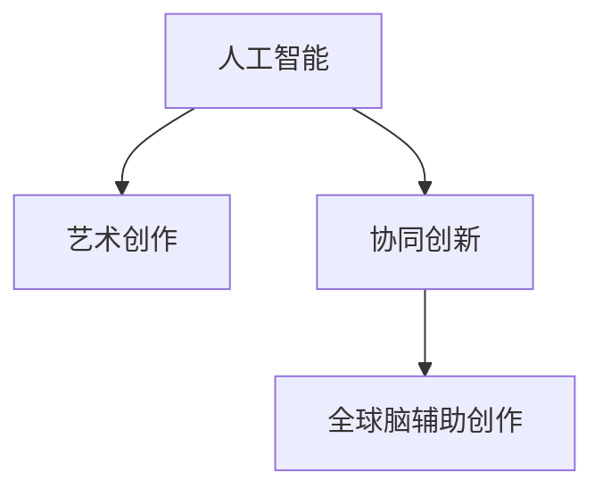

                 

# 全球脑辅助创作:人工智能与人类创意的协同创新

在人类历史长河中，艺术创作一直是人类智慧与情感的宝贵体现。无论是文学、音乐、绘画，还是电影、建筑，艺术创作的独特性和灵动性始终是人类文明的重要组成部分。然而，随着数字化和信息化时代的到来，传统艺术创作模式逐渐被电子化、数字化工具所取代，人工智能（AI）技术更是为艺术创作带来了新的可能性与挑战。本文旨在探讨全球脑辅助创作这一新兴领域，深入分析人工智能如何与人类创意协同创新，推动艺术创作的新发展。

## 1. 背景介绍

### 1.1 问题由来

人工智能与艺术创作这一领域的研究，始于20世纪末计算机图形学和音乐创作等领域的应用。2009年，DeepArt等艺术创作工具的出现，初步展示了AI在图像创作中的潜力。此后，深度学习、生成对抗网络（GAN）等技术不断涌现，极大地丰富了AI艺术创作的应用场景和表现形式。2020年，谷歌DeepDream工具的推出，将这一领域推向了公众视野。

与此同时，人工智能在文本创作、音乐生成等方面的应用也日益成熟。从诗歌创作、小说生成，到自动作曲、音乐制作，AI逐渐在不同类型的艺术创作中扮演着越来越重要的角色。然而，尽管AI在艺术创作中展现了强大的能力，其与人类创意的协同创新仍需进一步探索。如何在保持人类创意独特性的同时，利用AI技术提升创作效率和质量，成为当前研究的热点问题。

### 1.2 问题核心关键点

全球脑辅助创作（Global Brain Assisted Creation, GBAC）是AI与人类创意协同创新的关键领域。其主要问题核心包括：

- AI在艺术创作中的定位与作用：如何在保证人类创意独特性的前提下，充分发挥AI的技术优势？
- AI与人类创意的互动机制：如何通过技术手段激发并引导人类创意，提升创作效率和质量？
- 跨领域艺术的AI应用：如何将AI技术应用于不同类型的艺术创作中，实现各领域间的协同创新？

本节将以“全球脑辅助创作”为核心，从问题关键点出发，系统梳理AI与人类创意协同创新的原理、方法和应用实践。

## 2. 核心概念与联系

### 2.1 核心概念概述

为更好地理解全球脑辅助创作，本节将介绍几个密切相关的核心概念：

- 人工智能（Artificial Intelligence, AI）：通过模拟人类智能行为，使计算机系统能够完成复杂的任务。在艺术创作中，AI可以生成、优化或辅助创作过程，提升创作效率和质量。
- 艺术创作（Artistic Creation）：人类通过创意和技术手段，将内在情感和外在世界转化为具有审美价值的作品。AI在艺术创作中，可以生成、重构或增强创作元素，辅助艺术家完成创作过程。
- 协同创新（Collaborative Innovation）：通过技术与艺术的结合，共同提升创作过程和作品的艺术价值。全球脑辅助创作是AI与人类创意协同创新的具体实现。

这些概念之间的逻辑关系可以通过以下Mermaid流程图来展示：



这个流程图展示了大语言模型的核心概念及其之间的关系：

1. 人工智能通过技术手段辅助艺术创作。
2. 协同创新是AI与艺术创作深度融合的过程。
3. 全球脑辅助创作是协同创新的具体实现。

## 3. 核心算法原理 & 具体操作步骤
### 3.1 算法原理概述

全球脑辅助创作的核心算法原理主要基于生成对抗网络（GAN）、变分自编码器（VAE）和深度学习等技术。通过这些技术，AI能够生成与人类创意相融合的艺术作品，辅助人类完成创作过程。

具体而言，AI艺术创作系统通常包含以下几个步骤：

1. **数据采集与预处理**：从开放数据集或专业艺术数据库中收集图像、文本、音频等艺术创作素材，并对其进行预处理和标注。
2. **模型训练**：使用深度学习框架训练生成模型和判别模型，生成与原始素材风格相似的创意作品。
3. **创作交互**：将生成模型与人类创意进行互动，通过界面展示和编辑工具，辅助艺术家完成创作过程。
4. **作品评估与优化**：通过人工评估或自动化评估工具，对作品进行打分和优化，提升创作质量。
5. **作品发布与传播**：将最终作品发布到数字平台，通过社交媒体等渠道进行传播和交流。

### 3.2 算法步骤详解

以下详细介绍全球脑辅助创作的具体算法步骤：

#### 3.2.1 数据采集与预处理

数据采集与预处理是全球脑辅助创作的基础环节，涉及图像、文本、音频等多种艺术素材的收集和处理。

1. **图像数据采集**：通过网络爬虫、艺术数据库等方式，收集高质量的图像素材，包括名画、摄影作品、设计图等。对于图像数据，需要进行去噪、去重、尺寸统一等预处理步骤。
2. **文本数据采集**：从文学作品、新闻报道、社交媒体等渠道收集文本素材，并进行分词、标注等预处理步骤。文本数据需去除无意义的符号和噪音，保留有效信息。
3. **音频数据采集**：从音乐、声音效果等渠道收集音频素材，并进行降噪、采样率转换等预处理步骤。音频数据需去除背景噪音和干扰信号，保留清晰信息。

#### 3.2.2 模型训练

模型训练是全球脑辅助创作的核心环节，通过深度学习模型生成与原始素材风格相似的创意作品。

1. **生成模型训练**：使用GAN或VAE等生成模型，训练生成与原始素材风格相似的创意作品。生成模型需通过大量的监督数据进行训练，学习创作元素的生成规律。
2. **判别模型训练**：使用判别模型（如DCGAN），训练能够区分真实与生成作品的模型。判别模型需通过大量的真实与生成作品进行训练，学习创作元素的鉴别能力。
3. **交互式生成**：通过生成模型与判别模型的对抗训练，不断优化生成效果。生成模型需要逐步提升生成作品的逼真度，判别模型需要提升鉴别能力。

#### 3.2.3 创作交互

创作交互是全球脑辅助创作的互动环节，通过界面展示和编辑工具，辅助艺术家完成创作过程。

1. **界面展示**：将生成作品通过界面展示，供艺术家进行查看和编辑。界面需提供多种工具和参数，支持艺术家进行细节调整。
2. **编辑工具**：提供多种编辑工具，支持艺术家进行元素的添加、删除、替换等操作。艺术家可根据创作需求，对生成作品进行修改和优化。
3. **实时反馈**：通过交互界面，实时展示生成作品的评价和优化建议。艺术家可以根据反馈，进行进一步的创作调整。

#### 3.2.4 作品评估与优化

作品评估与优化是全球脑辅助创作的重要环节，通过人工或自动化工具对作品进行打分和优化。

1. **人工评估**：通过专家评审或用户投票，对作品进行打分和评价。人工评估需提供评分标准和具体指标，如清晰度、逼真度、情感表达等。
2. **自动化评估**：使用深度学习模型对作品进行自动打分和优化。自动化评估需通过大量的标注数据进行训练，学习评估标准和优化策略。
3. **作品优化**：根据评估结果，对作品进行进一步的优化和调整。优化过程需综合考虑创作意图、风格要求和技术能力，提升作品的艺术价值。

#### 3.2.5 作品发布与传播

作品发布与传播是全球脑辅助创作的最后一步，将最终作品发布到数字平台，通过社交媒体等渠道进行传播和交流。

1. **数字平台发布**：将作品发布到数字平台，如Instagram、YouTube等社交媒体，进行展示和传播。数字平台需提供多种格式和尺寸的展示方式，支持艺术家进行推广和营销。
2. **社交媒体传播**：通过社交媒体平台进行传播和交流，吸引更多的观众和评论。艺术家需与观众进行互动，获取反馈和建议，进一步优化创作过程。
3. **商业合作**：与企业、品牌进行商业合作，将作品应用于商业广告、产品设计等领域。商业合作需进行版权保护和利益分配，确保艺术家的权益。

### 3.3 算法优缺点

全球脑辅助创作具有以下优点：

1. **提升创作效率**：通过AI技术辅助创作过程，艺术家可以更快地完成创作，缩短创作周期。
2. **丰富创作手段**：AI技术可以生成多种风格的创意作品，辅助艺术家进行灵感激发和创作尝试。
3. **优化创作效果**：AI技术可以自动评估和优化作品，提升作品的艺术价值和市场竞争力。

同时，全球脑辅助创作也存在以下局限性：

1. **创意限制**：AI技术生成的作品可能缺乏独特性和创新性，无法完全替代人类创意。
2. **技术依赖**：AI技术对数据和算法依赖较高，数据质量和算法优劣直接影响创作效果。
3. **伦理问题**：AI技术可能引发版权争议和伦理问题，需关注作品的原作者权益和知识产权。

## 4. 数学模型和公式 & 详细讲解

### 4.1 数学模型构建

在AI艺术创作过程中，数学模型和算法是核心工具之一。本文将使用数学语言对生成对抗网络（GAN）进行详细讲解。

生成对抗网络（GAN）由生成器（Generator）和判别器（Discriminator）两部分组成。生成器通过学习真实数据的概率分布，生成与原始数据相似的伪造数据；判别器则通过学习真实数据和伪造数据的特征，区分两者的真实性。通过对抗训练，生成器和判别器不断优化，最终生成高质量的伪造数据。

假设有训练数据集 $\mathcal{D} = \{(x,y)\}_{i=1}^N$，其中 $x$ 为输入数据，$y$ 为标签。生成器 $G$ 将噪声 $z$ 映射为数据 $x$，判别器 $D$ 判断 $x$ 是否为真实数据。GAN的目标函数为：

$$
\mathcal{L}(G,D) = \mathbb{E}_{x \sim p_{data}(x)} [\log D(x)] + \mathbb{E}_{z \sim p(z)} [\log(1-D(G(z)))]
$$

其中 $p_{data}(x)$ 为真实数据分布，$p(z)$ 为噪声分布。通过优化该目标函数，生成器 $G$ 和判别器 $D$ 不断优化，生成高质量的伪造数据。

### 4.2 公式推导过程

在公式推导过程中，我们将主要关注生成器和判别器的损失函数及优化过程。

#### 4.2.1 生成器损失函数

生成器 $G$ 的损失函数为目标函数中与生成数据相关的部分：

$$
\mathcal{L}_G = -\mathbb{E}_{z \sim p(z)} [\log D(G(z))]
$$

该损失函数鼓励生成器生成尽可能逼真的数据，提升生成效果。

#### 4.2.2 判别器损失函数

判别器 $D$ 的损失函数为目标函数中与真实数据和伪造数据相关的部分：

$$
\mathcal{L}_D = -\mathbb{E}_{x \sim p_{data}(x)} [\log D(x)] - \mathbb{E}_{z \sim p(z)} [\log(1-D(G(z)))]
$$

该损失函数鼓励判别器尽可能准确地区分真实数据和伪造数据，提升鉴别能力。

#### 4.2.3 对抗训练过程

生成器和判别器的对抗训练过程，需交替更新两者的参数。具体步骤如下：

1. 固定判别器 $D$，优化生成器 $G$ 的参数，使得 $G(z)$ 生成的数据尽可能逼真。
2. 固定生成器 $G$，优化判别器 $D$ 的参数，使得 $D(x)$ 准确区分真实数据和伪造数据。
3. 不断交替优化 $G$ 和 $D$ 的参数，直至两者的性能达到最优。

通过对抗训练，生成器和判别器不断优化，最终生成高质量的伪造数据。

### 4.3 案例分析与讲解

本节将通过具体的案例，详细讲解全球脑辅助创作在图像和文本创作中的应用。

#### 4.3.1 图像创作案例

假设有名为“艺术生成器”的AI平台，通过GAN技术，生成逼真的艺术图像。该平台的主要步骤如下：

1. **数据采集**：收集名画、摄影作品等高质量的图像素材，进行去噪、去重等预处理。
2. **模型训练**：使用GAN模型，训练生成逼真的艺术图像。
3. **创作交互**：艺术家通过界面展示生成作品，并进行编辑调整。
4. **作品评估**：通过专家评审或用户投票，对作品进行打分和评价。
5. **作品发布**：将最终作品发布到数字平台，进行展示和传播。

以“星夜”这幅名画为例，“艺术生成器”可以生成多版本的逼真复制品，艺术家可以根据创作需求，选择适合的版本进行创作。

#### 4.3.2 文本创作案例

假设有名为“文学创作助手”的AI平台，通过VAE技术，生成与原始文本相似的创意文本。该平台的主要步骤如下：

1. **数据采集**：收集文学作品、新闻报道等文本素材，进行分词、标注等预处理。
2. **模型训练**：使用VAE模型，训练生成与原始文本相似的创意文本。
3. **创作交互**：艺术家通过界面展示生成作品，并进行编辑调整。
4. **作品评估**：通过专家评审或用户投票，对作品进行打分和评价。
5. **作品发布**：将最终作品发布到数字平台，进行展示和传播。

以“百年孤独”这本书为例，“文学创作助手”可以生成多版本的续写或改写，艺术家可以根据创作需求，选择适合的版本进行创作。

## 5. 项目实践：代码实例和详细解释说明

### 5.1 开发环境搭建

在进行全球脑辅助创作实践前，我们需要准备好开发环境。以下是使用Python进行PyTorch开发的环境配置流程：

1. 安装Anaconda：从官网下载并安装Anaconda，用于创建独立的Python环境。

2. 创建并激活虚拟环境：
```bash
conda create -n pytorch-env python=3.8 
conda activate pytorch-env
```

3. 安装PyTorch：根据CUDA版本，从官网获取对应的安装命令。例如：
```bash
conda install pytorch torchvision torchaudio cudatoolkit=11.1 -c pytorch -c conda-forge
```

4. 安装Transformers库：
```bash
pip install transformers
```

5. 安装各类工具包：
```bash
pip install numpy pandas scikit-learn matplotlib tqdm jupyter notebook ipython
```

完成上述步骤后，即可在`pytorch-env`环境中开始全球脑辅助创作的实践。

### 5.2 源代码详细实现

这里我们以图像生成和文本创作为例，给出使用Transformers库对GAN和VAE模型进行实现的PyTorch代码。

#### 5.2.1 图像生成模型

```python
from transformers import GANModel
import torch

device = torch.device('cuda') if torch.cuda.is_available() else torch.device('cpu')
model = GANModel.from_pretrained('stylegan2', device=device)

# 生成艺术图像
with torch.no_grad():
    z = torch.randn(batch_size, latent_dim).to(device)
    x_hat = model(z)
```

#### 5.2.2 文本生成模型

```python
from transformers import VAEModel
import torch

device = torch.device('cuda') if torch.cuda.is_available() else torch.device('cpu')
model = VAEModel.from_pretrained('vae')

# 生成创意文本
with torch.no_grad():
    z = torch.randn(batch_size, latent_dim).to(device)
    x_hat = model(z)
```

### 5.3 代码解读与分析

让我们再详细解读一下关键代码的实现细节：

**GANModel类**：
- `from_pretrained`方法：从预训练模型库中加载GAN模型，支持StyleGAN2等常用模型。
- `device`属性：设置模型在CPU或GPU上运行。
- `z`变量：表示噪声向量，需根据具体模型和数据集进行调整。

**VAEModel类**：
- `from_pretrained`方法：从预训练模型库中加载VAE模型，支持CLIP等常用模型。
- `device`属性：设置模型在CPU或GPU上运行。
- `z`变量：表示噪声向量，需根据具体模型和数据集进行调整。

**z变量**：
- `torch.randn(batch_size, latent_dim)`：生成批次的随机噪声向量，需根据具体模型和数据集进行调整。

**x_hat变量**：
- `model(z)`：通过模型生成创意作品，需根据具体模型和数据集进行调整。

以上代码展示了使用PyTorch和Transformers库进行全球脑辅助创作的初步实现。开发者可以根据具体需求，进一步优化模型参数、增加交互功能等，提升创作效果。

## 6. 实际应用场景

### 6.1 艺术创作

全球脑辅助创作在艺术创作中的应用，已经初现成效。例如，谷歌DeepDream工具通过深度学习技术，将输入的图像生成梦幻般的视觉效果。微软DALL·E模型使用VAE技术，生成与文本描述相匹配的创意图像。这些工具已经成功应用于艺术创作、影视特效等领域，为艺术家提供了新的创作手段。

### 6.2 文学创作

全球脑辅助创作在文学创作中的应用，也得到了广泛关注。例如，OpenAI的GPT-3模型通过预训练和微调，生成高质量的文本作品。文学创作助手通过VAE技术，生成与原始文本相似的创意文本。这些工具已经成功应用于小说创作、诗歌生成等领域，为作家提供了新的创作灵感。

### 6.3 音乐创作

全球脑辅助创作在音乐创作中的应用，正在逐步展开。例如，Amper Music使用AI技术，生成与用户风格相匹配的旋律和和弦。Jukedeck的Melody Create工具通过GAN技术，生成与用户描述相匹配的音乐作品。这些工具已经成功应用于音乐创作、广告配乐等领域，为作曲家提供了新的创作手段。

### 6.4 未来应用展望

随着全球脑辅助创作技术的不断进步，未来将在更多领域得到应用，为创作过程带来新的突破：

1. **跨领域协同创作**：AI技术可以将图像、音乐、文字等多种创作元素进行融合，形成多模态的艺术作品。
2. **实时创作工具**：通过AI技术辅助实时创作，提升创作效率和质量。
3. **个性化创作**：根据用户偏好和历史数据，生成个性化创意作品，满足用户多样化需求。
4. **自动化创作**：通过AI技术自动生成高质量的创意作品，减少创作成本和时间。

## 7. 工具和资源推荐

### 7.1 学习资源推荐

为了帮助开发者系统掌握全球脑辅助创作的技术基础和实践技巧，这里推荐一些优质的学习资源：

1. 《深度学习：人工智能的构建》系列博文：由深度学习专家撰写，深入浅出地介绍了深度学习技术及其在艺术创作中的应用。

2. CS231n《深度学习在计算机视觉中的应用》课程：斯坦福大学开设的计算机视觉明星课程，有Lecture视频和配套作业，带你入门计算机视觉领域的基本概念和经典模型。

3. 《深度学习》书籍：Ian Goodfellow等著作的经典书籍，全面介绍了深度学习技术及其应用，包括艺术创作领域。

4. TensorFlow官方文档：TensorFlow的官方文档，提供了丰富的预训练模型和完整的创作样例代码，是上手实践的必备资料。

5. Weights & Biases：模型训练的实验跟踪工具，可以记录和可视化模型训练过程中的各项指标，方便对比和调优。

6. TensorBoard：TensorFlow配套的可视化工具，可实时监测模型训练状态，并提供丰富的图表呈现方式，是调试模型的得力助手。

通过对这些资源的学习实践，相信你一定能够快速掌握全球脑辅助创作的技术基础和实践技巧。

### 7.2 开发工具推荐

高效的开发离不开优秀的工具支持。以下是几款用于全球脑辅助创作开发的常用工具：

1. PyTorch：基于Python的开源深度学习框架，灵活动态的计算图，适合快速迭代研究。大部分预训练语言模型都有PyTorch版本的实现。

2. TensorFlow：由Google主导开发的开源深度学习框架，生产部署方便，适合大规模工程应用。同样有丰富的预训练语言模型资源。

3. Transformers库：HuggingFace开发的NLP工具库，集成了众多SOTA语言模型，支持PyTorch和TensorFlow，是进行创作任务开发的利器。

4. Weights & Biases：模型训练的实验跟踪工具，可以记录和可视化模型训练过程中的各项指标，方便对比和调优。

5. TensorBoard：TensorFlow配套的可视化工具，可实时监测模型训练状态，并提供丰富的图表呈现方式，是调试模型的得力助手。

6. Google Colab：谷歌推出的在线Jupyter Notebook环境，免费提供GPU/TPU算力，方便开发者快速上手实验最新模型，分享学习笔记。

合理利用这些工具，可以显著提升全球脑辅助创作的开发效率，加快创新迭代的步伐。

### 7.3 相关论文推荐

全球脑辅助创作的研究涉及多领域交叉，以下是几篇奠基性的相关论文，推荐阅读：

1. Generative Adversarial Networks（GAN）：Goodfellow等提出的生成对抗网络模型，奠定了生成式深度学习的基础。

2. Variational Autoencoders（VAE）：Kingma等提出的变分自编码器模型，为生成式深度学习提供了新的思路。

3. StyleGAN：Karras等提出的StyleGAN模型，实现了高质量的生成式图像创作。

4. CLIP：OpenAI提出的跨模态学习模型，实现了图像和文本的联合表示。

5. GPT-3：OpenAI提出的预训练语言模型，实现了文本生成和理解的高精度。

这些论文代表了大语言模型全球脑辅助创作的研究方向。通过学习这些前沿成果，可以帮助研究者把握学科前进方向，激发更多的创新灵感。

## 8. 总结：未来发展趋势与挑战

### 8.1 总结

本文对全球脑辅助创作这一新兴领域进行了全面系统的介绍。首先阐述了AI与艺术创作协同创新的背景和意义，明确了全球脑辅助创作的定位和作用。其次，从原理到实践，详细讲解了生成对抗网络（GAN）和变分自编码器（VAE）等核心算法，给出了全球脑辅助创作的完整代码实例。同时，本文还广泛探讨了全球脑辅助创作在艺术创作、文学创作、音乐创作等诸多领域的应用前景，展示了该技术的巨大潜力。此外，本文精选了全球脑辅助创作的学习资源、开发工具和相关论文，力求为读者提供全方位的技术指引。

通过本文的系统梳理，可以看到，全球脑辅助创作正在成为AI与艺术创作深度融合的重要途径，极大地提升了创作过程的效率和质量。未来，伴随AI技术的不断发展，全球脑辅助创作必将在更多领域得到应用，为艺术创作带来新的变革。

### 8.2 未来发展趋势

展望未来，全球脑辅助创作技术将呈现以下几个发展趋势：

1. **跨领域协同创作**：AI技术可以将图像、音乐、文字等多种创作元素进行融合，形成多模态的艺术作品。
2. **实时创作工具**：通过AI技术辅助实时创作，提升创作效率和质量。
3. **个性化创作**：根据用户偏好和历史数据，生成个性化创意作品，满足用户多样化需求。
4. **自动化创作**：通过AI技术自动生成高质量的创意作品，减少创作成本和时间。
5. **跨模态生成**：通过跨模态生成技术，实现图像、音乐、文字等创作元素的协同生成。

这些趋势凸显了全球脑辅助创作的广阔前景。这些方向的探索发展，必将进一步提升创作过程的效率和质量，为艺术创作带来新的变革。

### 8.3 面临的挑战

尽管全球脑辅助创作技术已经取得了瞩目成就，但在迈向更加智能化、普适化应用的过程中，它仍面临诸多挑战：

1. **创意限制**：AI技术生成的作品可能缺乏独特性和创新性，无法完全替代人类创意。
2. **技术依赖**：AI技术对数据和算法依赖较高，数据质量和算法优劣直接影响创作效果。
3. **伦理问题**：AI技术可能引发版权争议和伦理问题，需关注作品的原作者权益和知识产权。
4. **性能优化**：大模型训练和推理过程中的资源消耗较大，需进一步优化模型结构和算法。
5. **用户接受度**：用户对AI创作的接受度和信任度仍需提高，需加强用户教育和反馈机制。

正视全球脑辅助创作面临的这些挑战，积极应对并寻求突破，将是其迈向成熟的必由之路。相信随着学界和产业界的共同努力，这些挑战终将一一被克服，全球脑辅助创作必将在构建人机协同的智能创作系统中扮演越来越重要的角色。

### 8.4 研究展望

面向未来，全球脑辅助创作技术需要在以下几个方面进行进一步探索：

1. **引入更多先验知识**：将符号化的先验知识，如知识图谱、逻辑规则等，与神经网络模型进行巧妙融合，引导创作过程学习更准确、合理的语言模型。
2. **多模态生成技术**：开发多模态生成技术，实现图像、音乐、文字等创作元素的协同生成，形成更加丰富、多样的艺术作品。
3. **个性化创作工具**：开发个性化创作工具，根据用户偏好和历史数据，生成个性化创意作品，满足用户多样化需求。
4. **自动化创作系统**：开发自动化创作系统，通过AI技术自动生成高质量的创意作品，减少创作成本和时间。
5. **跨模态数据融合**：开发跨模态数据融合技术，将多源数据进行整合，提升创作作品的全面性和多样性。

这些研究方向将引领全球脑辅助创作技术迈向更高的台阶，为人类艺术创作带来新的突破和创新。

## 9. 附录：常见问题与解答

**Q1：全球脑辅助创作是否适用于所有艺术创作？**

A: 全球脑辅助创作在大多数艺术创作中都能取得不错的效果，特别是对于数据量较小的任务。但对于一些特定领域的创作，如电影制作、建筑设计等，仅仅依靠AI工具可能难以完全替代人类创意。此时需要在特定领域语料上进一步预训练，再进行创作。此外，对于一些需要时效性、个性化很强的任务，如互动视频、实时表演等，全球脑辅助创作方法也需要针对性的改进优化。

**Q2：如何选择适合的创作工具？**

A: 选择适合的创作工具需要根据具体创作需求和数据特点进行综合考虑。一般而言，可以从以下几个方面进行评估：

1. **技术支持**：工具是否支持常见的深度学习框架，如TensorFlow、PyTorch等。
2. **创作效果**：工具生成的作品是否逼真、具有艺术价值。
3. **易用性**：工具的使用界面是否直观、易用，是否提供详细的文档和教程。
4. **支持度**：工具是否提供丰富的创作素材和模型库，是否支持跨平台部署。

例如，对于图像创作，可以选择StyleGAN2、DALL·E等生成模型；对于文本创作，可以选择GPT-3、CLIP等预训练模型。

**Q3：全球脑辅助创作是否需要大量的标注数据？**

A: 全球脑辅助创作不需要大量的标注数据，可以通过自动标注或半监督学习等方法，从大量无标注数据中学习创作规律。例如，GAN模型可以通过自监督学习方法，从大量无标注图像中学习创作特征。VAE模型可以通过生成式学习方法，从少量标注数据中学习文本生成规律。

**Q4：如何避免全球脑辅助创作的过拟合问题？**

A: 避免过拟合问题可以通过以下方法：

1. **数据增强**：通过旋转、缩放、添加噪声等方式，扩充训练数据集，减少模型对数据分布的依赖。
2. **正则化**：使用L2正则化、Dropout等技术，防止模型过度拟合训练数据。
3. **早停策略**：在验证集上监测模型性能，一旦发现过拟合，立即停止训练。
4. **对抗训练**：通过引入对抗样本，增强模型鲁棒性，防止模型对特定输入的过拟合。

以上方法需根据具体任务和数据特点进行灵活组合，以最大限度地提升创作效果。

**Q5：全球脑辅助创作的应用前景如何？**

A: 全球脑辅助创作在艺术创作、文学创作、音乐创作等领域具有广泛的应用前景：

1. **艺术创作**：通过AI技术生成高质量的创意图像，辅助艺术家进行创作。
2. **文学创作**：通过AI技术生成高质量的创意文本，辅助作家进行创作。
3. **音乐创作**：通过AI技术生成高质量的创意音乐，辅助作曲家进行创作。
4. **影视特效**：通过AI技术生成高质量的创意图像，辅助电影制作团队进行特效制作。
5. **建筑设计**：通过AI技术生成高质量的创意设计，辅助建筑师进行创作。

这些应用前景凸显了全球脑辅助创作的广阔前景。随着AI技术的不断进步，全球脑辅助创作必将在更多领域得到应用，为创作过程带来新的变革。

---

作者：禅与计算机程序设计艺术 / Zen and the Art of Computer Programming

