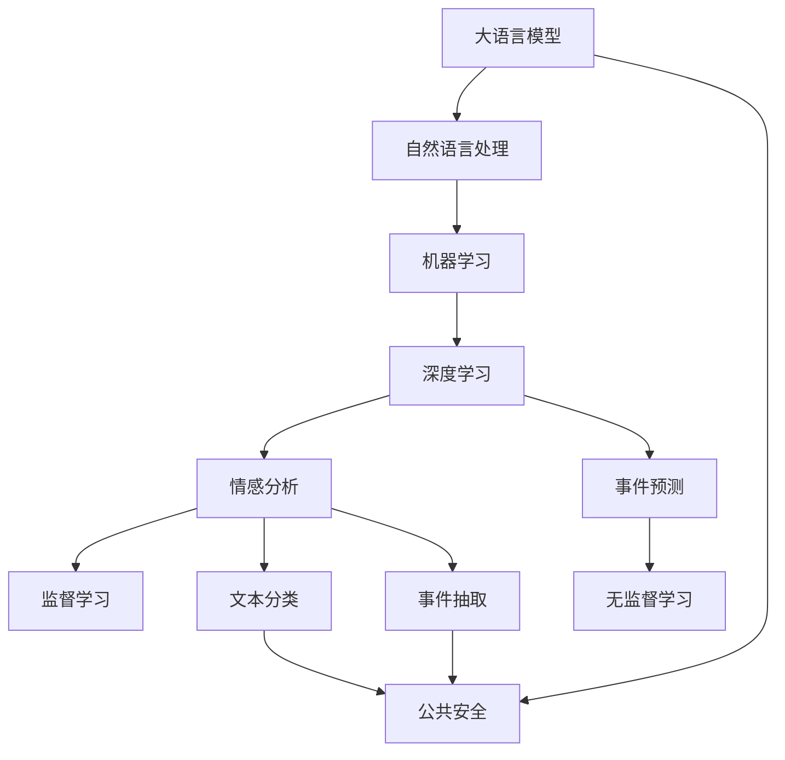

                 

# 公共安全和 LLM：预防和应对紧急情况

> 关键词：人工智能，公共安全，紧急情况，自然语言处理，机器学习，深度学习

## 1. 背景介绍

### 1.1 问题由来

随着社会信息化程度的不断提升，公共安全事件逐渐成为现代社会的一项重要挑战。自然灾害、恐怖袭击、公共卫生事件、交通事故等突发情况频繁发生，给人民生命财产安全带来重大威胁。如何高效、及时地响应公共安全事件，保障人民的生命安全和财产安全，是当今社会亟需解决的重要课题。

近年来，人工智能技术在公共安全领域的应用取得了显著进展。尤其是大规模语言模型(Large Language Model, LLM)的引入，为公共安全事件的预防和应对带来了新的可能性。例如，基于自然语言处理(Natural Language Processing, NLP)的文本分析、情感识别、事件预测等技术，可以辅助政府机构和公共服务部门更迅速、更准确地响应各类紧急情况。

### 1.2 问题核心关键点

在公共安全领域应用LLM的主要目标包括：
- 实时监测：利用自然语言处理技术，对社交媒体、新闻报道、论坛讨论等文本数据进行实时监测，及时发现和预警潜在的公共安全风险。
- 事件分类：根据文本数据自动分类事件类型，如自然灾害、恐怖袭击、公共卫生事件等，以便快速响应。
- 应急决策：根据事件类型和内容，生成建议的应急措施，如疏散、封锁、救援等，辅助决策者做出高效、合理的应对策略。
- 预测预警：利用机器学习算法，对历史数据进行建模，预测未来可能发生的公共安全事件，提前做好防范准备。

本文将从核心概念与联系、核心算法原理、数学模型构建、项目实践、实际应用场景、未来展望等方面，系统介绍大语言模型在公共安全领域的应用方法和技术细节。

## 2. 核心概念与联系

### 2.1 核心概念概述

为更好地理解大语言模型在公共安全领域的应用，本节将介绍几个密切相关的核心概念：

- 大语言模型(Large Language Model, LLM)：以自回归(如GPT)或自编码(如BERT)模型为代表的大规模预训练语言模型。通过在大规模无标签文本语料上进行预训练，学习通用的语言表示，具备强大的语言理解和生成能力。

- 自然语言处理(Natural Language Processing, NLP)：利用计算机技术处理、理解、生成自然语言的技术，包括文本分类、情感分析、事件抽取、问答系统等。

- 公共安全(Public Safety)：涉及防范和应对自然灾害、恐怖袭击、公共卫生事件、交通事故等突发情况，保障人民生命财产安全的领域。

- 机器学习(Machine Learning)：通过数据驱动的学习算法，自动提升模型性能的技术，包括监督学习、无监督学习、半监督学习等。

- 深度学习(Deep Learning)：一种基于多层神经网络的机器学习技术，可以处理大规模复杂数据，实现高级模式识别和预测。

- 情感分析(Sentiment Analysis)：通过自然语言处理技术，自动分析文本中的情感倾向，分为正面、负面、中性等类别。

- 事件预测(Event Prediction)：利用机器学习算法，对未来事件的发生概率进行预测，以便提前做好防范准备。

这些核心概念之间的逻辑关系可以通过以下Mermaid流程图来展示：



这个流程图展示了大语言模型与自然语言处理、公共安全、机器学习、深度学习等概念的联系：

1. 大语言模型通过预训练学习通用的语言表示，为自然语言处理任务提供基础。
2. 自然语言处理技术可以对文本数据进行文本分类、情感分析、事件抽取等处理，辅助公共安全决策。
3. 机器学习和深度学习算法可以自动提升模型性能，对历史数据进行建模预测。
4. 情感分析和事件预测作为具体的NLP任务，可以实时监测和预警突发情况。

这些概念共同构成了大语言模型在公共安全领域的应用框架，使其能够在各类突发事件中发挥强大的分析和决策支持能力。

## 3. 核心算法原理 & 具体操作步骤

### 3.1 算法原理概述

大语言模型在公共安全领域的应用，主要基于自然语言处理技术和机器学习算法。其核心思想是：利用自然语言处理技术对公共安全事件相关的文本数据进行实时监测和分析，自动分类事件类型，预测未来事件，生成应急措施，辅助决策者做出高效、合理的应对策略。

具体而言，可以分为以下几个步骤：

1. **数据收集**：收集公共安全相关的文本数据，如社交媒体帖子、新闻报道、论坛讨论等。
2. **文本预处理**：对收集到的文本进行清洗、分词、去停用词等处理，以便进行后续分析。
3. **特征提取**：将预处理后的文本转化为模型能够处理的数值特征，如TF-IDF、Word Embedding等。
4. **事件分类**：利用自然语言处理技术，对特征提取后的文本进行事件分类，如自然灾害、恐怖袭击、公共卫生事件等。
5. **应急决策**：根据事件类型和内容，利用机器学习算法生成建议的应急措施，如疏散、封锁、救援等。
6. **预测预警**：利用机器学习算法对历史数据进行建模，预测未来可能发生的公共安全事件，提前做好防范准备。

### 3.2 算法步骤详解

#### 数据收集

数据收集是公共安全分析的第一步。为了实现实时监测，需要从多个渠道收集数据：

1. **社交媒体**：利用API接口，获取Twitter、Facebook、Weibo等社交媒体的公开数据。
2. **新闻报道**：从新闻网站、RSS订阅等渠道，抓取最新的新闻报道。
3. **论坛讨论**：收集百度贴吧、知乎、Reddit等论坛的讨论内容。

#### 文本预处理

文本预处理包括文本清洗、分词、去停用词等步骤：

1. **文本清洗**：去除噪音文本，如广告、垃圾信息等。
2. **分词**：将文本转化为分词序列，以便后续分析。
3. **去停用词**：去除常见的停用词，如“的”、“是”、“在”等，以提高模型性能。

#### 特征提取

特征提取是将文本转化为数值特征的过程，常用的方法包括：

1. **TF-IDF**：计算每个词在文本中的重要性，生成向量表示。
2. **Word Embedding**：利用预训练的词向量模型，如Word2Vec、GloVe等，将单词转化为低维向量表示。
3. **句子表示**：利用预训练的Transformer模型，如BERT、GPT等，将整个句子转化为高维向量表示。

#### 事件分类

事件分类是公共安全分析的核心步骤，常用的方法包括：

1. **朴素贝叶斯分类器**：利用贝叶斯公式，计算文本属于不同事件类型的概率。
2. **支持向量机(SVM)**：通过构造超平面，将文本分类到不同的事件类型。
3. **深度学习模型**：利用预训练的Transformer模型，进行事件分类。

#### 应急决策

应急决策的目的是根据事件类型和内容，生成建议的应急措施。常用的方法包括：

1. **规则引擎**：根据预定义的规则，自动生成应急措施。
2. **自然语言生成(NLG)**：利用自然语言生成技术，生成应急措施的文本描述。
3. **混合决策**：结合规则引擎和NLG，生成更精准的应急措施。

#### 预测预警

预测预警的目标是根据历史数据，预测未来可能发生的公共安全事件。常用的方法包括：

1. **时间序列分析**：利用时间序列分析模型，预测事件的发生概率。
2. **深度学习模型**：利用预训练的Transformer模型，进行事件预测。
3. **强化学习**：利用强化学习算法，优化预测模型的决策策略。

### 3.3 算法优缺点

基于自然语言处理和机器学习算法的大语言模型在公共安全领域的应用具有以下优点：

1. **实时性高**：能够实时监测和分析文本数据，及时发现和预警潜在的公共安全风险。
2. **适应性强**：可以自动分类事件类型，生成应急措施，适应不同领域和场景的需求。
3. **预测准确**：利用历史数据进行建模，能够预测未来可能发生的公共安全事件，提前做好防范准备。

但同时，也存在一些局限性：

1. **依赖高质量数据**：数据收集和预处理的准确性直接影响模型的性能。
2. **模型复杂度高**：大语言模型需要大量的计算资源和时间进行预训练和微调。
3. **可解释性差**：模型内部决策过程复杂，难以进行解释和调试。
4. **鲁棒性不足**：面对域外数据和噪声文本，模型性能可能下降。

尽管存在这些局限性，但就目前而言，基于自然语言处理和机器学习算法的大语言模型在公共安全领域仍是最主流的方法。未来相关研究的重点在于如何进一步降低数据收集和预处理的成本，提高模型的可解释性和鲁棒性。

### 3.4 算法应用领域

基于大语言模型的公共安全事件分析和应急决策，已经被广泛应用于多个领域：

1. **自然灾害监测**：对地震、洪水、台风等自然灾害进行实时监测和预警。
2. **恐怖袭击预警**：对恐怖袭击事件进行分析和预测，辅助安全部门进行防范。
3. **公共卫生事件预警**：对新冠疫情、流感等公共卫生事件进行监测和预警，辅助医疗部门进行疫情防控。
4. **交通管理**：对交通事故进行分析和预测，辅助交通部门进行疏导和应急处理。
5. **环境保护**：对环境污染事件进行监测和预警，辅助环保部门进行治理。

除了上述这些经典应用外，大语言模型还被创新性地应用到更多场景中，如社会稳定预测、城市安全管理、公共危机应对等，为公共安全治理提供了新的技术手段。

## 4. 数学模型和公式 & 详细讲解  
### 4.1 数学模型构建

本节将使用数学语言对基于大语言模型的公共安全事件分析和应急决策进行更加严格的刻画。

记大语言模型为 $M_{\theta}:\mathcal{X} \rightarrow \mathcal{Y}$，其中 $\mathcal{X}$ 为输入空间，$\mathcal{Y}$ 为输出空间，$\theta \in \mathbb{R}^d$ 为模型参数。假设公共安全事件监测任务的训练集为 $D=\{(x_i,y_i)\}_{i=1}^N, x_i \in \mathcal{X}, y_i \in \mathcal{Y}$。

定义模型 $M_{\theta}$ 在输入 $x$ 上的事件分类概率为 $P(y|x) = M_{\theta}(x)$，其中 $y$ 为事件类型，$x$ 为文本数据。则事件分类的损失函数为：

$$
\ell(y,x) = -\log M_{\theta}(x)
$$

在得到损失函数后，通过梯度下降等优化算法，最小化损失函数，更新模型参数 $\theta$。

### 4.2 公式推导过程

以事件分类为例，推导损失函数的梯度计算公式。

假设模型 $M_{\theta}$ 在输入 $x$ 上的事件分类概率为 $P(y|x) = M_{\theta}(x)$，则事件分类的损失函数为：

$$
\ell(y,x) = -\log M_{\theta}(x)
$$

根据链式法则，损失函数对参数 $\theta_k$ 的梯度为：

$$
\frac{\partial \ell(y,x)}{\partial \theta_k} = -\frac{\partial}{\partial \theta_k} \log M_{\theta}(x)
$$

具体而言，可以利用自动微分技术计算模型的对数概率，并根据求导公式得到梯度：

$$
\frac{\partial \ell(y,x)}{\partial \theta_k} = -\frac{\partial}{\partial \theta_k} \sum_{i=1}^n \log M_{\theta}(x_i)
$$

在得到梯度后，即可带入梯度下降等优化算法，更新模型参数 $\theta$，完成模型的迭代优化。

## 5. 项目实践：代码实例和详细解释说明
### 5.1 开发环境搭建

在进行公共安全事件分析和应急决策的微调实践前，我们需要准备好开发环境。以下是使用Python进行PyTorch开发的环境配置流程：

1. 安装Anaconda：从官网下载并安装Anaconda，用于创建独立的Python环境。

2. 创建并激活虚拟环境：
```bash
conda create -n pytorch-env python=3.8 
conda activate pytorch-env
```

3. 安装PyTorch：根据CUDA版本，从官网获取对应的安装命令。例如：
```bash
conda install pytorch torchvision torchaudio cudatoolkit=11.1 -c pytorch -c conda-forge
```

4. 安装Transformers库：
```bash
pip install transformers
```

5. 安装各类工具包：
```bash
pip install numpy pandas scikit-learn matplotlib tqdm jupyter notebook ipython
```

完成上述步骤后，即可在`pytorch-env`环境中开始微调实践。

### 5.2 源代码详细实现

下面我以事件分类任务为例，给出使用Transformers库对BERT模型进行微调的PyTorch代码实现。

首先，定义事件分类任务的数据处理函数：

```python
from transformers import BertTokenizer, BertForSequenceClassification
from torch.utils.data import Dataset, DataLoader
import torch

class EventDataset(Dataset):
    def __init__(self, texts, labels, tokenizer, max_len=128):
        self.texts = texts
        self.labels = labels
        self.tokenizer = tokenizer
        self.max_len = max_len
        
    def __len__(self):
        return len(self.texts)
    
    def __getitem__(self, item):
        text = self.texts[item]
        label = self.labels[item]
        
        encoding = self.tokenizer(text, return_tensors='pt', max_length=self.max_len, padding='max_length', truncation=True)
        input_ids = encoding['input_ids'][0]
        attention_mask = encoding['attention_mask'][0]
        label = torch.tensor(label, dtype=torch.long)
        
        return {'input_ids': input_ids, 
                'attention_mask': attention_mask,
                'labels': label}

# 加载数据
tokenizer = BertTokenizer.from_pretrained('bert-base-cased')
train_dataset = EventDataset(train_texts, train_labels, tokenizer)
dev_dataset = EventDataset(dev_texts, dev_labels, tokenizer)
test_dataset = EventDataset(test_texts, test_labels, tokenizer)
```

然后，定义模型和优化器：

```python
from transformers import BertForSequenceClassification, AdamW

model = BertForSequenceClassification.from_pretrained('bert-base-cased', num_labels=4)

optimizer = AdamW(model.parameters(), lr=2e-5)
```

接着，定义训练和评估函数：

```python
from tqdm import tqdm

device = torch.device('cuda') if torch.cuda.is_available() else torch.device('cpu')
model.to(device)

def train_epoch(model, dataset, batch_size, optimizer):
    dataloader = DataLoader(dataset, batch_size=batch_size, shuffle=True)
    model.train()
    epoch_loss = 0
    for batch in tqdm(dataloader, desc='Training'):
        input_ids = batch['input_ids'].to(device)
        attention_mask = batch['attention_mask'].to(device)
        labels = batch['labels'].to(device)
        model.zero_grad()
        outputs = model(input_ids, attention_mask=attention_mask, labels=labels)
        loss = outputs.loss
        epoch_loss += loss.item()
        loss.backward()
        optimizer.step()
    return epoch_loss / len(dataloader)

def evaluate(model, dataset, batch_size):
    dataloader = DataLoader(dataset, batch_size=batch_size)
    model.eval()
    preds, labels = [], []
    with torch.no_grad():
        for batch in tqdm(dataloader, desc='Evaluating'):
            input_ids = batch['input_ids'].to(device)
            attention_mask = batch['attention_mask'].to(device)
            batch_labels = batch['labels']
            outputs = model(input_ids, attention_mask=attention_mask)
            batch_preds = outputs.logits.argmax(dim=2).to('cpu').tolist()
            batch_labels = batch_labels.to('cpu').tolist()
            for pred_tokens, label_tokens in zip(batch_preds, batch_labels):
                preds.append(pred_tokens[:len(label_tokens)])
                labels.append(label_tokens)
                
    print(classification_report(labels, preds))
```

最后，启动训练流程并在测试集上评估：

```python
epochs = 5
batch_size = 16

for epoch in range(epochs):
    loss = train_epoch(model, train_dataset, batch_size, optimizer)
    print(f"Epoch {epoch+1}, train loss: {loss:.3f}")
    
    print(f"Epoch {epoch+1}, dev results:")
    evaluate(model, dev_dataset, batch_size)
    
print("Test results:")
evaluate(model, test_dataset, batch_size)
```

以上就是使用PyTorch对BERT进行事件分类任务微调的完整代码实现。可以看到，得益于Transformers库的强大封装，我们可以用相对简洁的代码完成BERT模型的加载和微调。

### 5.3 代码解读与分析

让我们再详细解读一下关键代码的实现细节：

**EventDataset类**：
- `__init__`方法：初始化文本、标签、分词器等关键组件。
- `__len__`方法：返回数据集的样本数量。
- `__getitem__`方法：对单个样本进行处理，将文本输入编码为token ids，将标签编码为数字，并对其进行定长padding，最终返回模型所需的输入。

**模型和优化器**：
- 使用BERT模型作为预训练模型，并设置标签数量。
- 选择合适的优化算法及其参数，如AdamW、SGD等，设置学习率、批大小、迭代轮数等。

**训练和评估函数**：
- 使用PyTorch的DataLoader对数据集进行批次化加载，供模型训练和推理使用。
- 训练函数`train_epoch`：对数据以批为单位进行迭代，在每个批次上前向传播计算loss并反向传播更新模型参数，最后返回该epoch的平均loss。
- 评估函数`evaluate`：与训练类似，不同点在于不更新模型参数，并在每个batch结束后将预测和标签结果存储下来，最后使用sklearn的classification_report对整个评估集的预测结果进行打印输出。

**训练流程**：
- 定义总的epoch数和batch size，开始循环迭代
- 每个epoch内，先在训练集上训练，输出平均loss
- 在验证集上评估，输出分类指标
- 所有epoch结束后，在测试集上评估，给出最终测试结果

可以看到，PyTorch配合Transformers库使得BERT微调的事件分类任务代码实现变得简洁高效。开发者可以将更多精力放在数据处理、模型改进等高层逻辑上，而不必过多关注底层的实现细节。

当然，工业级的系统实现还需考虑更多因素，如模型的保存和部署、超参数的自动搜索、更灵活的任务适配层等。但核心的微调范式基本与此类似。

## 6. 实际应用场景
### 6.1 智能交通管理

智能交通管理系统可以有效提高城市交通效率，减少交通拥堵和事故发生率。大语言模型可以在此领域中发挥重要作用，通过实时监测交通数据和公共舆情，进行事件分类和应急决策。

例如，通过分析社交媒体、导航App等数据，可以实时监测到交通事故、道路施工等突发事件。利用事件分类模型，对事件类型进行快速判断，并生成应急建议，如调整信号灯、关闭路段、提供绕行路线等。对于重大交通事故，还可以自动生成事故现场描述，辅助应急响应。

### 6.2 医疗健康监测

医疗健康监测系统需要实时获取和分析各类健康数据，以预防和应对公共卫生事件。大语言模型可以在此领域中发挥重要作用，通过分析在线咨询、社交媒体、新闻报道等数据，进行事件分类和预测预警。

例如，通过分析医院咨询记录、社交媒体上的健康话题、新闻报道中的疫情信息等，可以实时监测到新的公共卫生事件。利用事件分类模型，对事件类型进行快速判断，并生成应急建议，如提醒加强防护、关闭学校、隔离治疗等。对于可能爆发的疫情，还可以利用预测预警模型，提前做好防控准备。

### 6.3 城市灾害管理

城市灾害管理系统需要实时监测和预警各类自然灾害，如地震、洪水、台风等，以保障城市安全。大语言模型可以在此领域中发挥重要作用，通过分析社交媒体、气象数据、地质数据等，进行事件分类和应急决策。

例如，通过分析地震后的社交媒体讨论、气象数据中的异常天气预报、地质数据中的地质变化等，可以实时监测到自然灾害的预警信号。利用事件分类模型，对灾害类型进行快速判断，并生成应急建议，如发布预警信息、疏散人群、提供避难所等。对于正在发生的灾害，还可以自动生成应急处理方案，辅助应急响应。

### 6.4 未来应用展望

随着大语言模型和事件分类技术的不断发展，基于微调范式将在更多领域得到应用，为公共安全治理带来新的突破。

在智慧城市治理中，大语言模型可以用于城市事件监测、舆情分析、应急指挥等环节，提高城市管理的自动化和智能化水平，构建更安全、高效的城市治理体系。

在社会稳定预测中，利用大语言模型的语言理解和生成能力，可以对各类社会事件进行分析和预测，提前做好防范准备。

在公共安全预警中，通过结合多源数据和知识图谱，可以构建更全面、准确的预测模型，预测各类公共安全事件，提前做好防范准备。

此外，在智慧农业、灾害预防、社会治理等众多领域，基于大语言模型的公共安全事件分析和应急决策，必将在未来得到更广泛的应用，为社会发展和人民福祉提供新的保障。

## 7. 工具和资源推荐
### 7.1 学习资源推荐

为了帮助开发者系统掌握大语言模型在公共安全领域的应用理论基础和实践技巧，这里推荐一些优质的学习资源：

1. 《深度学习理论与实践》系列博文：由大模型技术专家撰写，深入浅出地介绍了深度学习的基本原理、模型构建和优化方法。

2. 《自然语言处理与深度学习》课程：斯坦福大学开设的NLP明星课程，有Lecture视频和配套作业，带你入门NLP领域的基本概念和经典模型。

3. 《Transformers实战》书籍：详细介绍了Transformer模型在NLP任务中的实现方法和微调技术，提供了丰富的代码和实例。

4. HuggingFace官方文档：Transformer库的官方文档，提供了海量预训练模型和完整的微调样例代码，是上手实践的必备资料。

5. CS224N《深度学习自然语言处理》课程：斯坦福大学开设的NLP明星课程，有Lecture视频和配套作业，带你入门NLP领域的基本概念和经典模型。

通过对这些资源的学习实践，相信你一定能够快速掌握大语言模型在公共安全领域的应用精髓，并用于解决实际的公共安全问题。
###  7.2 开发工具推荐

高效的开发离不开优秀的工具支持。以下是几款用于大语言模型在公共安全领域应用开发的常用工具：

1. PyTorch：基于Python的开源深度学习框架，灵活动态的计算图，适合快速迭代研究。大部分预训练语言模型都有PyTorch版本的实现。

2. TensorFlow：由Google主导开发的开源深度学习框架，生产部署方便，适合大规模工程应用。同样有丰富的预训练语言模型资源。

3. Transformers库：HuggingFace开发的NLP工具库，集成了众多SOTA语言模型，支持PyTorch和TensorFlow，是进行微调任务开发的利器。

4. Weights & Biases：模型训练的实验跟踪工具，可以记录和可视化模型训练过程中的各项指标，方便对比和调优。与主流深度学习框架无缝集成。

5. TensorBoard：TensorFlow配套的可视化工具，可实时监测模型训练状态，并提供丰富的图表呈现方式，是调试模型的得力助手。

6. Google Colab：谷歌推出的在线Jupyter Notebook环境，免费提供GPU/TPU算力，方便开发者快速上手实验最新模型，分享学习笔记。

合理利用这些工具，可以显著提升大语言模型在公共安全领域的应用开发效率，加快创新迭代的步伐。

### 7.3 相关论文推荐

大语言模型和事件分类技术的发展源于学界的持续研究。以下是几篇奠基性的相关论文，推荐阅读：

1. Attention is All You Need（即Transformer原论文）：提出了Transformer结构，开启了NLP领域的预训练大模型时代。

2. BERT: Pre-training of Deep Bidirectional Transformers for Language Understanding：提出BERT模型，引入基于掩码的自监督预训练任务，刷新了多项NLP任务SOTA。

3. Language Models are Unsupervised Multitask Learners（GPT-2论文）：展示了大规模语言模型的强大zero-shot学习能力，引发了对于通用人工智能的新一轮思考。

4. Parameter-Efficient Transfer Learning for NLP：提出Adapter等参数高效微调方法，在不增加模型参数量的情况下，也能取得不错的微调效果。

5. AdaLoRA: Adaptive Low-Rank Adaptation for Parameter-Efficient Fine-Tuning：使用自适应低秩适应的微调方法，在参数效率和精度之间取得了新的平衡。

这些论文代表了大语言模型在公共安全领域事件分类技术的发展脉络。通过学习这些前沿成果，可以帮助研究者把握学科前进方向，激发更多的创新灵感。

## 8. 总结：未来发展趋势与挑战

### 8.1 总结

本文对基于大语言模型的公共安全事件分析和应急决策进行了全面系统的介绍。首先阐述了大语言模型和事件分类技术的研究背景和意义，明确了基于微调范式在公共安全领域的应用前景。其次，从核心概念与联系、核心算法原理、数学模型构建、项目实践、实际应用场景、未来展望等方面，详细讲解了大语言模型在公共安全领域的应用方法和技术细节。

通过本文的系统梳理，可以看到，大语言模型在公共安全事件分析和应急决策中具有强大的分析能力和辅助决策能力，为公共安全治理提供了新的技术手段。未来，伴随预训练语言模型和事件分类方法的不断演进，基于微调范式必将在公共安全领域实现更广泛的应用，为构建安全、可靠、高效的公共安全系统铺平道路。

### 8.2 未来发展趋势

展望未来，基于大语言模型的公共安全事件分析和应急决策技术将呈现以下几个发展趋势：

1. **数据驱动性增强**：随着数据采集和存储技术的进步，数据的来源和维度将更加丰富。大语言模型可以通过结合更多类型的数据，提升事件的分类和预测准确性。

2. **模型鲁棒性提高**：面对噪声数据和异常事件，大语言模型需要具备更强的鲁棒性。未来的研究方向包括引入对抗样本、鲁棒正则化等技术。

3. **实时性提升**：随着计算资源的提升，大语言模型的推理速度将进一步提升，实现更高效的实时分析和应急决策。

4. **多源数据融合**：未来的系统将能够融合多种类型的数据源，如文本、图像、语音等，提升事件分类和预测的全面性和准确性。

5. **模型通用性增强**：大语言模型将具备更强的跨领域迁移能力，能够应用于更广泛的公共安全场景。

6. **跨模态分析**：未来的系统将能够结合多模态数据，提升事件分类和预测的准确性和鲁棒性。

以上趋势凸显了大语言模型在公共安全事件分析和应急决策领域的广阔前景。这些方向的探索发展，必将进一步提升公共安全系统的性能和应用范围，为社会发展和人民福祉提供新的保障。

### 8.3 面临的挑战

尽管基于大语言模型的公共安全事件分析和应急决策技术已经取得了显著进展，但在迈向更加智能化、普适化应用的过程中，它仍面临诸多挑战：

1. **数据采集和预处理的难度**：大语言模型需要大量的高质量数据，但数据采集和预处理的成本较高，且需要多源数据的融合，这对技术实现提出了较高要求。

2. **模型的可解释性不足**：大语言模型内部决策过程复杂，难以进行解释和调试，这对实际应用中的可解释性和可审计性提出了挑战。

3. **模型的鲁棒性不足**：面对噪声数据和异常事件，模型性能可能下降，如何提高模型的鲁棒性，避免灾难性遗忘，还需要更多理论和实践的积累。

4. **计算资源的限制**：大语言模型需要大量的计算资源和时间进行预训练和微调，这对模型的部署和应用提出了较高要求。

5. **伦理道德的考量**：大语言模型可能学习到有偏见、有害的信息，如何确保模型的输出符合伦理道德，避免恶意用途，也将是重要的研究课题。

6. **模型通用性不足**：现有的模型往往局限于特定领域和任务，如何开发更通用的模型，适应更多类型的公共安全事件，还需进一步研究。

正视这些挑战，积极应对并寻求突破，将是大语言模型在公共安全领域走向成熟的必由之路。相信随着学界和产业界的共同努力，这些挑战终将一一被克服，大语言模型在公共安全领域的应用必将在构建安全、可靠、高效的公共安全系统中发挥更大的作用。

### 8.4 研究展望

未来，基于大语言模型的公共安全事件分析和应急决策技术需要在以下几个方面进行深入研究：

1. **跨领域知识融合**：结合专家知识、逻辑规则等先验信息，提升模型的跨领域迁移能力。

2. **多源数据融合技术**：开发更高效的数据融合算法，提升模型的全面性和鲁棒性。

3. **对抗样本生成与防御**：研究对抗样本生成技术和防御方法，提升模型的鲁棒性。

4. **模型的可解释性**：开发更强的模型可解释性工具，帮助用户理解和信任模型的决策过程。

5. **计算资源优化**：优化模型的计算图和推理算法，降低计算成本，提高部署效率。

6. **伦理道德保障**：建立模型训练和应用的伦理道德框架，确保模型的输出符合人类价值观和伦理道德。

7. **跨模态分析**：结合多模态数据，提升模型的准确性和鲁棒性。

这些研究方向将推动大语言模型在公共安全领域的应用不断深入，为构建更加安全、可靠、高效的公共安全系统提供新的动力。总之，基于大语言模型的公共安全事件分析和应急决策技术需要在多方面进行优化和突破，才能在实际应用中发挥更大的作用，为公共安全治理提供更加智能化的技术支持。

## 9. 附录：常见问题与解答

**Q1：大语言模型在公共安全领域的应用是否适用于所有类型的公共安全事件？**

A: 大语言模型在公共安全领域的应用具有一定的普适性，可以处理不同类型的公共安全事件，如自然灾害、恐怖袭击、公共卫生事件等。但对于一些非常特殊的领域，如航空安全、核安全等，需要结合领域知识，进行专门的模型设计和训练。

**Q2：大语言模型在公共安全领域应用的性能如何？**

A: 大语言模型在公共安全领域的应用具有较高的准确性和实时性。通过结合多源数据和知识图谱，可以构建更全面、准确的预测模型，提升事件的分类和预测准确性。但对于极端情况和异常事件，模型的鲁棒性仍需进一步提升。

**Q3：如何优化大语言模型在公共安全领域的应用？**

A: 优化大语言模型在公共安全领域的应用需要从多个方面进行改进：
1. 提升模型的鲁棒性，通过对抗样本生成和防御技术，避免模型过拟合和泛化能力不足的问题。
2. 优化模型的可解释性，通过开发更强的可解释性工具，提升模型的可信度和用户接受度。
3. 优化模型的计算资源效率，通过优化计算图和推理算法，降低计算成本，提高部署效率。
4. 结合多源数据和知识图谱，提升模型的全面性和准确性，构建更可靠的预测模型。

**Q4：大语言模型在公共安全领域的应用有哪些具体案例？**

A: 大语言模型在公共安全领域的应用包括：
1. 智能交通管理：通过实时监测交通数据和公共舆情，进行事件分类和应急决策，提高城市交通效率。
2. 医疗健康监测：通过分析在线咨询、社交媒体、新闻报道等数据，进行事件分类和预测预警，提前做好防控准备。
3. 城市灾害管理：通过分析社交媒体、气象数据、地质数据等，进行事件分类和应急决策，保障城市安全。
4. 社会稳定预测：利用大语言模型的语言理解和生成能力，对各类社会事件进行分析和预测，提前做好防范准备。

**Q5：大语言模型在公共安全领域的应用是否存在安全风险？**

A: 大语言模型在公共安全领域的应用需要高度关注数据隐私和安全问题。由于大语言模型需要处理大量的文本数据，因此需要采取数据加密、匿名化等措施，防止敏感信息泄露。同时，模型的输入输出需要经过严格的审计和验证，确保其输出的合法性和可信度。

以上常见问题的解答，可以帮助读者更好地理解大语言模型在公共安全领域的应用，并为实际应用中的优化和改进提供参考。

---

作者：禅与计算机程序设计艺术 / Zen and the Art of Computer Programming

