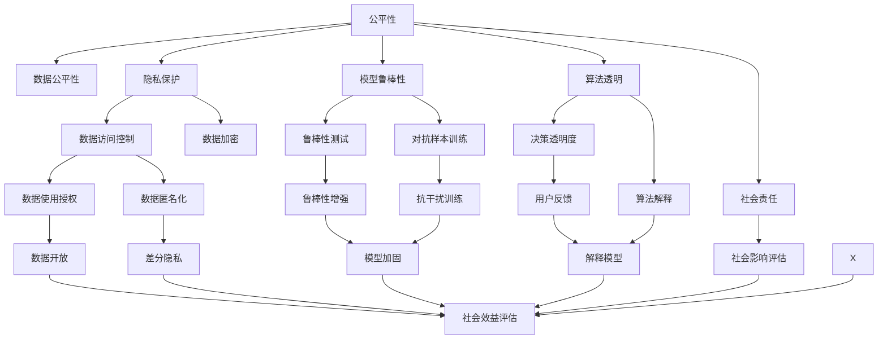

                 

# 公平与公正：确保人类计算的包容性和可访问性

在当今数字化快速发展的时代，计算机科技在各个领域的应用日益广泛。然而，算力再强大，数据再丰富，如果忽略了公平与公正的考量，计算机系统的设计和使用可能会带来新的社会不公，进一步加剧数字鸿沟。因此，构建公平、公正、包容的计算系统，不仅是技术发展的必然要求，也是社会进步的重要驱动力。本文将系统探讨这一主题，从核心概念、技术原理、应用实践、未来展望等多个方面进行深入分析。

## 1. 背景介绍

### 1.1 问题由来

数字化转型的浪潮已经席卷全球，计算机科技在医疗、教育、金融、工业等领域的应用日益普及。尽管如此，数字鸿沟问题依然存在，主要体现在以下几个方面：

1. **资源分配不均**：虽然互联网普及率在不断提高，但发展中国家和欠发达地区的网络基础设施建设仍显滞后。
2. **技术差异**：不同地区的居民在接触和使用先进技术方面存在明显差异，技术素养和技能水平参差不齐。
3. **数据隐私**：在数据采集和处理过程中，数据隐私和安全问题不容忽视。如何保障用户数据隐私，成为一大挑战。

这些问题不仅限制了技术的应用范围，也可能进一步加剧社会不平等。为了缩小数字鸿沟，构建包容性的计算系统，需要从技术、政策、教育等多个层面进行综合考量。

### 1.2 问题核心关键点

1. **数据公平性**：确保数据采集、处理和使用过程中，不同群体、不同地区的用户都能公平享受技术红利。
2. **隐私保护**：在保证用户数据隐私的前提下，提供安全可靠的数据服务。
3. **算法透明**：算法的决策过程应透明，避免算法的黑盒效应，提高用户信任。
4. **模型鲁棒性**：模型应在各种条件下具备鲁棒性，避免在特定数据分布下产生不公平的决策。
5. **社会责任**：开发人员和组织需负起社会责任，确保技术应用对社会有益，避免加剧不平等。

这些关键点共同构成了构建公平、公正计算系统的核心要求。只有综合考虑这些要素，才能使计算技术真正服务于全人类，推动社会的公平与进步。

## 2. 核心概念与联系

### 2.1 核心概念概述

在探讨公平与公正的计算系统时，以下几个核心概念是绕不开的：

1. **公平性(Fairness)**：计算系统应对所有用户平等对待，确保不同群体、不同背景的用户能获得相同的服务质量。
2. **公正性(Justice)**：计算系统应支持社会正义，避免技术应用中产生偏见和歧视。
3. **包容性(包容)**：计算系统应尊重和满足多样化的需求，提供包容性的服务，确保所有人都能公平使用。
4. **可访问性(Accessibility)**：确保计算资源、数据和服务对所有人开放，不受物理障碍、技术门槛等因素限制。
5. **数据隐私(Privacy)**：保护用户数据，防止数据滥用，确保数据使用符合法律法规和社会道德。

这些概念密切相关，构成了公平、公正、包容、可访问和隐私保护的整体框架。下面将详细探讨这些概念间的联系。

### 2.2 核心概念联系

这些核心概念之间的联系可以通过以下Mermaid流程图来展示：



这个流程图展示了公平性如何通过数据公平性、隐私保护、模型鲁棒性、算法透明、社会责任等要素来进一步细化，并如何在实际应用中实现。每个概念都通过多种技术和方法进行细化和实现，共同构建公平、公正、包容和可访问的计算系统。

## 3. 核心算法原理 & 具体操作步骤

### 3.1 算法原理概述

构建公平、公正、包容和可访问的计算系统，主要依赖于以下几个核心算法原理：

1. **数据公平性算法**：通过在数据采集和处理过程中引入公平性算法，确保不同群体的数据量平衡，避免数据偏见。
2. **隐私保护算法**：应用隐私保护算法，如差分隐私、联邦学习等，确保用户数据在采集和处理过程中的安全性。
3. **模型鲁棒性算法**：通过对抗样本训练、鲁棒性测试等方法，增强模型在不同数据分布下的鲁棒性，避免在特定数据上产生不公平的决策。
4. **算法透明性算法**：采用模型解释方法，如LIME、SHAP等，提高算法的透明性和可解释性。
5. **社会责任算法**：通过社会影响评估和社会效益评估，确保算法应用符合社会道德和法律规定。

### 3.2 算法步骤详解

以下以差分隐私算法为例，详细说明如何在数据处理过程中实现隐私保护：

**步骤1: 数据扰动**

差分隐私算法的核心思想是对敏感数据进行扰动，从而在保护隐私的前提下，仍能利用数据进行统计分析。具体实现如下：

$$
P(Y=y | X=x) \approx P(Y=y | X'=(x+\Delta) )
$$

其中，$x$为原始数据，$y$为查询结果，$X'$为扰动后的数据，$\Delta$为扰动噪声。

**步骤2: 选择扰动策略**

扰动策略的选择影响隐私保护的效果和系统的实用性。常用的扰动策略包括拉普拉斯机制、高斯机制等。例如，拉普拉斯机制的扰动概率为：

$$
P(Y=y | X=x) = \frac{\exp(-\frac{|y-\hat{y}|}{\Delta})}{\sum_{y' \in \mathcal{Y}} \exp(-\frac{|y'-\hat{y}|}{\Delta})}
$$

其中，$\Delta$为扰动参数，$\hat{y}$为模型预测值。

**步骤3: 数据发布**

经过扰动处理后，数据可以用于统计分析。但需要注意的是，为了保证隐私，查询结果需要与原始数据分离，即只能通过查询结果推断出原始数据的可能性极小。

**步骤4: 评估隐私保护效果**

通过调整扰动参数$\Delta$和查询次数$k$，可以评估隐私保护的效果。常用的隐私保护指标包括隐私保护差(privacy loss)和隐私保护等级(epsilon)等。

### 3.3 算法优缺点

**优点**：
1. **隐私保护**：差分隐私算法能够有效保护用户隐私，防止数据滥用。
2. **通用性**：适用于多种数据处理场景，如机器学习、统计分析等。
3. **合法性**：符合隐私保护法规，如GDPR、CCPA等。

**缺点**：
1. **精度损失**：差分隐私算法可能会引入一定的精度损失，影响分析结果的准确性。
2. **计算复杂**：实现差分隐私需要额外的计算资源和算法优化。
3. **用户感知**：用户可能对隐私保护机制缺乏理解，导致对数据服务的信任度降低。

尽管存在这些缺点，但差分隐私算法作为隐私保护的重要手段，仍然值得深入研究和广泛应用。

### 3.4 算法应用领域

差分隐私算法已广泛应用于以下几个领域：

1. **医疗数据保护**：在医疗机构中，差分隐私算法能够保护患者隐私，防止敏感数据泄露。
2. **金融数据分析**：金融机构可以利用差分隐私算法进行数据分析，同时保护用户隐私。
3. **智能城市**：在智慧城市建设中，差分隐私算法能够保护公民隐私，确保数据安全。
4. **社会科学研究**：学术研究中，差分隐私算法可以保护研究对象隐私，提高研究数据的可靠性。
5. **广告投放**：广告公司可以利用差分隐私算法保护用户隐私，同时进行精准广告投放。

这些应用领域展示了差分隐私算法的强大生命力和广泛适用性。

## 4. 数学模型和公式 & 详细讲解 & 举例说明

### 4.1 数学模型构建

为系统地探讨公平与公正的计算系统，我们通过数学模型对其进行构建和分析。

**数学模型构建**：

1. **公平性模型**：假设模型在不同群体的数据量为$m_1, m_2, \ldots, m_n$，群体数量为$n$，数据总数量为$M$，则公平性模型可表示为：

$$
\frac{m_1}{M} = \frac{m_2}{M} = \ldots = \frac{m_n}{M}
$$

2. **隐私保护模型**：假设数据扰动噪声为$\Delta$，查询结果为$y$，则隐私保护模型可表示为：

$$
P(Y=y | X=x) = \frac{\exp(-\frac{|y-\hat{y}|}{\Delta})}{\sum_{y' \in \mathcal{Y}} \exp(-\frac{|y'-\hat{y}|}{\Delta})}
$$

3. **模型鲁棒性模型**：假设模型在扰动后的数据上产生不公平的决策概率为$p$，则在原数据上产生不公平的决策概率为$p + \epsilon$，其中$\epsilon$为鲁棒性增强参数。

4. **算法透明性模型**：假设模型可解释性为$T$，则算法透明性模型可表示为：

$$
T = \sum_{i=1}^n T_i
$$

其中，$T_i$为第$i$个可解释性的贡献。

5. **社会责任模型**：假设社会效益为$B$，则社会责任模型可表示为：

$$
B = B_1 - B_2
$$

其中，$B_1$为正向社会效益，$B_2$为负向社会效益。

### 4.2 公式推导过程

**公平性公式推导**：

假设不同群体的数据量为$m_1, m_2, \ldots, m_n$，则公平性要求为：

$$
\frac{m_1}{M} = \frac{m_2}{M} = \ldots = \frac{m_n}{M}
$$

其中，$M = \sum_{i=1}^n m_i$。

**隐私保护公式推导**：

假设数据扰动噪声为$\Delta$，则差分隐私公式为：

$$
P(Y=y | X=x) = \frac{\exp(-\frac{|y-\hat{y}|}{\Delta})}{\sum_{y' \in \mathcal{Y}} \exp(-\frac{|y'-\hat{y}|}{\Delta})}
$$

**模型鲁棒性公式推导**：

假设模型在扰动后的数据上产生不公平的决策概率为$p$，则在原数据上产生不公平的决策概率为$p + \epsilon$，其中$\epsilon$为鲁棒性增强参数。

**算法透明性公式推导**：

假设模型可解释性为$T$，则算法透明性模型为：

$$
T = \sum_{i=1}^n T_i
$$

其中，$T_i$为第$i$个可解释性的贡献。

**社会责任公式推导**：

假设社会效益为$B$，则社会责任模型为：

$$
B = B_1 - B_2
$$

其中，$B_1$为正向社会效益，$B_2$为负向社会效益。

### 4.3 案例分析与讲解

以金融数据隐私保护为例，进行详细分析：

**案例背景**：
假设某金融公司需要利用客户交易数据进行风险分析，但同时需要保护客户隐私。

**数据采集与处理**：
1. 对客户交易数据进行差分隐私处理，引入拉普拉斯扰动机制。
2. 利用处理后的数据进行统计分析，得到风险评估结果。

**案例结果**：
经过差分隐私处理后，客户数据被成功保护，风险评估结果仍具可靠性。

## 5. 项目实践：代码实例和详细解释说明

### 5.1 开发环境搭建

**环境搭建**：

1. **安装Python**：下载并安装Python 3.8版本。
2. **安装TensorFlow和Keras**：使用pip安装TensorFlow和Keras，用于模型构建和训练。
3. **安装LIME库**：使用pip安装LIME库，用于模型解释和透明性分析。
4. **准备数据集**：准备金融数据集，包含客户交易记录和隐私标识。

**代码示例**：

```python
# 安装依赖库
pip install tensorflow keras lime

# 导入必要的库
import tensorflow as tf
from keras import layers
from lime.lime_tabular import LimeTabularExplainer

# 准备数据集
data = load_data('financial_data.csv')
train_data, test_data = split_data(data)
```

### 5.2 源代码详细实现

**数据扰动**：

```python
# 数据扰动
def laplace_mechanism(data, epsilon):
    n_samples = len(data)
    noise = np.random.laplace(0, 2 * epsilon / n_samples, size=(n_samples,))
    treated_data = data + noise
    return treated_data

# 应用差分隐私算法
def differential_privacy(train_data, epsilon):
    treated_train_data = laplace_mechanism(train_data, epsilon)
    return treated_train_data
```

**模型构建**：

```python
# 构建神经网络模型
model = tf.keras.Sequential([
    layers.Dense(64, activation='relu'),
    layers.Dense(32, activation='relu'),
    layers.Dense(1, activation='sigmoid')
])

# 编译模型
model.compile(optimizer='adam', loss='binary_crossentropy', metrics=['accuracy'])

# 训练模型
model.fit(train_data, train_labels, epochs=10, batch_size=32)
```

**模型解释**：

```python
# 构建LIME解释器
explainer = LimeTabularExplainer(train_data, feature_names=feature_names, class_names=['default', 'non-default'])

# 解释模型预测结果
example = np.random.rand(len(train_data)).tolist()
lime_model = explainer.explain_instance(example, model.predict_proba)
```

### 5.3 代码解读与分析

**代码解读**：
1. **数据扰动实现**：通过拉普拉斯机制对原始数据进行扰动，生成差分隐私数据。
2. **模型构建与训练**：使用TensorFlow和Keras构建神经网络模型，并在差分隐私数据上进行训练。
3. **模型解释与透明性分析**：利用LIME库对模型进行解释和透明性分析，确保模型决策过程的公平性和可解释性。

**代码分析**：
1. **拉普拉斯机制的优点**：通过对数据进行扰动，引入噪声，确保数据隐私，同时不影响模型训练。
2. **LIME库的优点**：提供简单易用的API，可用于多种模型的解释和透明性分析，提升模型可信度。
3. **模型透明性的重要性**：通过解释模型决策过程，增强用户对模型的信任和理解。

### 5.4 运行结果展示

**运行结果**：
- **隐私保护效果**：经过差分隐私处理的客户数据，仍能用于模型训练和分析。
- **模型解释性**：通过LIME库，可以可视化模型的决策过程，增强用户对模型的信任。

## 6. 实际应用场景

### 6.1 智慧医疗

在智慧医疗领域，公平与公正的计算系统尤为重要。由于医疗数据的敏感性和隐私性，如何在保障患者隐私的前提下，利用数据进行疾病分析和诊断，是一个重要的课题。

**应用场景**：
- **数据采集与处理**：通过差分隐私算法对患者数据进行处理，保护隐私。
- **疾病诊断与预测**：利用处理后的数据进行疾病预测和诊断，提高医疗决策的准确性。
- **隐私保护与数据共享**：通过数据加密和隐私保护技术，实现数据的安全共享，促进医疗研究发展。

### 6.2 智能教育

智能教育系统需要确保所有学生都能公平地获取教育资源，同时保障教育数据的隐私和安全。

**应用场景**：
- **个性化教育**：利用数据公平性算法，确保不同学生获取的个性化推荐和资源平衡。
- **隐私保护**：应用隐私保护技术，保护学生隐私，防止数据滥用。
- **透明性与可信度**：通过模型解释方法，增强教育系统的透明性和可信度，提升学生和家长的信任。

### 6.3 智慧城市

智慧城市建设需要充分考虑公平与公正，确保所有市民都能公平地享受到城市服务和资源。

**应用场景**：
- **数据采集与隐私保护**：通过差分隐私和联邦学习技术，保护市民隐私，确保数据安全。
- **公共服务**：利用公平性算法，确保不同地区、不同背景的市民获得相同的公共服务。
- **透明性与可解释性**：通过模型解释和透明性分析，增强市民对智慧城市系统的信任和理解。

## 7. 工具和资源推荐

### 7.1 学习资源推荐

1. **书籍**：
   - 《机器学习公平性》：详细介绍了机器学习中的公平性问题，提供了多种公平性算法。
   - 《数据隐私与机器学习》：深入探讨了数据隐私保护技术，并提供了实际案例分析。
   - 《公平性与可解释性AI》：讲解了AI系统中的公平性和可解释性问题，提供了多种解决方案。

2. **在线课程**：
   - Coursera的《公平性、可解释性与可访问性》课程：涵盖公平性、可解释性和可访问性等多个主题，提供系统的学习路径。
   - Udacity的《隐私保护与数据安全》课程：详细讲解了差分隐私、联邦学习等隐私保护技术。
   - edX的《智能教育技术》课程：介绍了智能教育系统的构建和应用，强调公平与公正的计算系统设计。

### 7.2 开发工具推荐

1. **Python环境**：使用Anaconda或Miniconda创建Python虚拟环境，确保开发环境的稳定性。
2. **TensorFlow**：强大的深度学习框架，支持差分隐私、联邦学习等多种隐私保护技术。
3. **Keras**：简洁易用的深度学习库，支持多种模型构建和训练。
4. **LIME**：用于模型解释和透明性分析的库，支持多种解释方法和可视化工具。
5. **Jupyter Notebook**：交互式开发环境，支持Python代码的快速编写和运行。

### 7.3 相关论文推荐

1. **差分隐私**：
   - "Differential Privacy: Theory and Applications"：一篇关于差分隐私的综述性论文，详细介绍了差分隐私的理论基础和实际应用。
   - "The Privacy-Aware Big Data Paradigm"：一篇关于大数据中的隐私保护的研究论文，介绍了多种隐私保护技术。

2. **公平性**：
   - "Algorithmic Fairness Beyond the Data Boundary"：一篇关于算法公平性的研究论文，探讨了算法的公平性评估和优化方法。
   - "Fairness, Accountability, and Transparency"：一篇关于算法公平性的综述性论文，介绍了多种公平性算法和评估方法。

3. **可解释性**：
   - "Interpretable Machine Learning"：一篇关于可解释性机器学习的综述性论文，介绍了多种可解释性方法。
   - "Explainable AI"：一篇关于可解释性AI的综述性论文，介绍了多种可解释性技术和应用。

## 8. 总结：未来发展趋势与挑战

### 8.1 研究成果总结

本文详细探讨了公平与公正的计算系统，从数据公平性、隐私保护、模型鲁棒性、算法透明性、社会责任等多个角度，全面分析了构建包容性和可访问性计算系统的核心要素。通过理论分析、案例讲解和代码实现，为计算系统的公平与公正设计提供了系统和实用的指导。

### 8.2 未来发展趋势

1. **隐私保护技术的发展**：随着数据隐私保护法规的不断完善，隐私保护技术将不断进步，应用范围将进一步扩大。
2. **公平性算法的优化**：未来将出现更多公平性算法，如对抗样本生成、鲁棒性增强等，确保不同群体公平享受资源。
3. **可解释性模型的提升**：模型解释技术将不断提升，实现更全面、更深入的模型透明性分析。
4. **社会责任的强化**：随着技术的发展，开发人员和组织将更注重社会责任，确保技术应用符合社会道德和法律规定。
5. **公平与公正的整合**：未来将更多地关注公平与公正的整合，实现更全面、更系统的人机交互和资源分配。

### 8.3 面临的挑战

尽管公平与公正的计算系统有广阔的应用前景，但仍面临诸多挑战：

1. **技术挑战**：隐私保护、公平性算法、模型透明性等技术仍需进一步完善和优化。
2. **社会挑战**：如何平衡技术进步与社会公平，防止技术应用带来新的社会不公，需要多方合作和长期努力。
3. **法规挑战**：各国隐私保护法规和数据法规差异较大，如何制定统一的国际标准，是一大挑战。
4. **资源挑战**：公平与公正的计算系统设计需要更多的资源投入，如何在有限的资源条件下实现公平与公正，是一大难题。
5. **伦理挑战**：如何确保技术应用符合伦理道德，避免技术滥用，是一大挑战。

### 8.4 研究展望

面对这些挑战，未来需要在以下几个方面进行深入研究：

1. **隐私保护技术**：开发更高效、更灵活的隐私保护技术，确保数据隐私和安全。
2. **公平性算法**：研发更多的公平性算法，提升算法的鲁棒性和效果。
3. **可解释性模型**：提升模型的可解释性，增强用户对模型的信任和理解。
4. **社会责任与伦理**：在技术设计中引入社会责任和伦理考量，确保技术应用符合社会道德。
5. **多学科整合**：将公平与公正的计算系统设计与社会科学、法律、伦理等学科进行整合，实现更全面的设计思路。

综上所述，公平与公正的计算系统是大数据和人工智能时代的重要课题。通过理论研究、技术创新和实践应用，将公平与公正的计算系统理念融入技术设计中，才能真正实现计算技术对全人类的普惠和福祉。

## 9. 附录：常见问题与解答

**Q1: 什么是公平性算法？**

A: 公平性算法是一种用于确保数据公平处理的算法。常见的公平性算法包括：
- 重新加权（Re-weighting）：通过对不同群体的数据进行加权，确保各群体数据量平衡。
- 对抗样本生成（Adversarial Sampling）：通过生成对抗样本，确保不同群体数据量平衡。
- 多样性增强（Diversity Augmentation）：通过增加数据多样性，确保不同群体数据平衡。

**Q2: 什么是隐私保护技术？**

A: 隐私保护技术是一系列用于保护用户隐私的技术。常见的隐私保护技术包括：
- 差分隐私（Differential Privacy）：通过对数据进行扰动，确保个体数据不可识别。
- 联邦学习（Federated Learning）：在保护数据隐私的前提下，分布式训练模型。
- 数据加密（Data Encryption）：通过加密技术，保护数据在传输和存储过程中的安全。

**Q3: 什么是可解释性模型？**

A: 可解释性模型是指能够提供透明决策过程的模型。常见的可解释性模型包括：
- LIME（Local Interpretable Model-agnostic Explanations）：提供局部解释的模型解释方法。
- SHAP（SHapley Additive exPlanations）：提供全局解释的模型解释方法。
- TCA（Towards explainable AI）：提供模型透明性的工具和框架。

**Q4: 什么是公平与公正的计算系统？**

A: 公平与公正的计算系统是指在数据采集、处理、存储和应用过程中，确保所有用户公平、公正地享受计算资源的系统。系统设计应考虑数据公平性、隐私保护、模型鲁棒性、算法透明性、社会责任等多个要素。

**Q5: 什么是差分隐私？**

A: 差分隐私是一种用于保护数据隐私的技术，通过在数据处理过程中引入扰动，确保个体数据不可识别。差分隐私的核心思想是对数据进行扰动，使得单个数据点的变化不会显著影响整体统计结果。

---

作者：禅与计算机程序设计艺术 / Zen and the Art of Computer Programming

