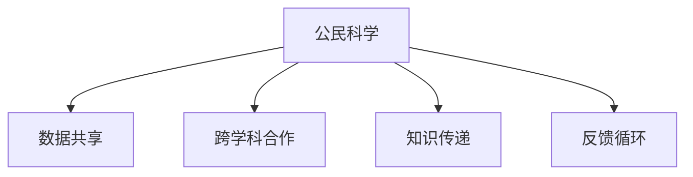

                 

# 公民科学：公众参与科学研究的新模式

在科技飞速发展的今天，科学研究已经成为推动社会进步和人类福祉的关键力量。然而，传统科学研究往往依赖于专业研究人员，受制于研究资源和资金的限制，难以覆盖到全球范围内的广泛问题。为了解决这一问题，公民科学（Citizen Science）作为一种新兴的科学研究模式，近年来逐渐兴起并得到了广泛关注。公民科学是指公众参与科学研究，通过协作和共享数据，共同推进科学发现的过程。这种模式不仅拓宽了科学研究的边界，也为公众提供了参与科学实践的机会。本文将深入探讨公民科学的核心理念、实施机制、优缺点以及未来发展方向，力图为公众和研究者提供参考。

## 1. 背景介绍

### 1.1 问题由来

科学研究作为推动社会进步和人类福祉的关键力量，一直受到广泛关注。然而，传统的科学研究通常由专业研究人员进行，受制于资源和资金的限制，难以覆盖全球范围内的广泛问题。随着科技的发展，新的数据获取和处理技术不断涌现，越来越多的非专业研究者也参与到科学研究中来。公民科学，作为新型的科学研究模式，允许公众参与到科学发现的过程中，为科学研究带来了新的活力和可能性。

### 1.2 问题核心关键点

公民科学的核心理念在于通过公众参与，拓宽科学研究的前沿，并推动科学发现的过程。这种模式打破了传统科研中研究人员与公众之间的界限，使得公众可以直接参与到科学实践中来。公民科学的核心关键点包括：

- 数据共享：公民科学强调数据的共享和开放，公众可以将自身获取的数据提交到共享平台，供其他研究者使用。
- 知识传递：通过培训和指导，使公众掌握科学方法和工具，提升其科研能力。
- 跨学科合作：鼓励不同领域的研究者与公众合作，解决复杂多变的问题。
- 反馈循环：公众的意见和建议可以反馈到科学研究中，促进研究方法的改进和优化。

这些关键点使得公民科学成为一种行之有效的科学研究模式，也为公众提供了参与科学实践的机会。

## 2. 核心概念与联系

### 2.1 核心概念概述

为了更好地理解公民科学，本节将介绍几个密切相关的核心概念：

- 公民科学（Citizen Science）：指公众参与科学研究，通过协作和共享数据，共同推进科学发现的过程。
- 数据共享（Data Sharing）：公民科学强调数据的共享和开放，公众可以将自身获取的数据提交到共享平台，供其他研究者使用。
- 跨学科合作（Interdisciplinary Collaboration）：鼓励不同领域的研究者与公众合作，解决复杂多变的问题。
- 知识传递（Knowledge Transfer）：通过培训和指导，使公众掌握科学方法和工具，提升其科研能力。
- 反馈循环（Feedback Loop）：公众的意见和建议可以反馈到科学研究中，促进研究方法的改进和优化。

这些核心概念之间的逻辑关系可以通过以下Mermaid流程图来展示：



这个流程图展示了几大核心概念之间的内在联系：

1. 公民科学通过数据共享、跨学科合作、知识传递和反馈循环，使得公众可以参与到科学实践中来，拓宽科学研究的边界。
2. 数据共享为公众提供了参与科学研究的基础，使得数据成为连接公众与研究者之间的桥梁。
3. 跨学科合作通过不同领域研究者的协作，解决复杂多变的问题，提升科研效率和质量。
4. 知识传递通过培训和指导，提升公众的科研能力，促进科学方法的普及和应用。
5. 反馈循环通过公众的意见和建议，促进科研方法的改进和优化，进一步推动科学发现。

这些概念共同构成了公民科学的实施机制，为其发展提供了坚实的基础。

## 3. 核心算法原理 & 具体操作步骤

### 3.1 算法原理概述

公民科学的核心算法原理在于利用公众的参与和数据共享，拓宽科学研究的边界，并通过反馈循环，促进科研方法的改进和优化。具体而言，公民科学包括以下步骤：

1. **数据收集**：公众通过各种方式（如手机APP、网络平台、实地调查等）收集数据。
2. **数据共享**：将收集到的数据上传到共享平台，供其他研究者使用。
3. **知识传递**：通过培训和指导，使公众掌握科学方法和工具。
4. **跨学科合作**：不同领域的研究者与公众合作，共同解决复杂多变的问题。
5. **反馈循环**：公众的意见和建议可以反馈到科学研究中，促进研究方法的改进和优化。

这些步骤形成了一个完整的闭环，公众的参与成为科学发现过程中不可或缺的一部分。

### 3.2 算法步骤详解

以下是公民科学的详细步骤：

#### 步骤一：数据收集

数据收集是公民科学的基础，公众可以通过各种方式获取数据。例如，通过手机APP收集天气、环境污染、动物行为等数据；通过网络平台收集科学问题的观测数据；通过实地调查收集生态、土壤、水质等数据。

#### 步骤二：数据共享

数据共享是公民科学的核心。公众可以将收集到的数据上传到共享平台，如Citizen Science Central、Zooniverse、eBird等，供其他研究者使用。这些平台通常提供数据分析工具和可视化功能，使数据更加易于管理和使用。

#### 步骤三：知识传递

知识传递是公民科学的关键环节。通过培训和指导，使公众掌握科学方法和工具，提升其科研能力。例如，通过在线课程、工作坊、实地考察等方式，使公众学习如何设计实验、分析数据、撰写科学报告等。

#### 步骤四：跨学科合作

跨学科合作是公民科学的特色。不同领域的研究者与公众合作，共同解决复杂多变的问题。例如，在环境保护研究中，环境科学家、生物学家、工程师、公众等可以共同开展项目，推动环境保护的实际进展。

#### 步骤五：反馈循环

反馈循环是公民科学的闭环。公众的意见和建议可以反馈到科学研究中，促进研究方法的改进和优化。例如，公众可以提出改进建议，研究者可以根据建议调整实验设计和数据分析方法，进一步提升研究质量。

### 3.3 算法优缺点

公民科学具有以下优点：

- 拓宽科学研究的边界，使公众可以直接参与到科学实践中来。
- 通过数据共享，使数据成为连接公众与研究者之间的桥梁，提升了数据的利用率。
- 通过知识传递，提升了公众的科研能力，促进科学方法的普及和应用。
- 通过跨学科合作，解决复杂多变的问题，提升了科研效率和质量。
- 通过反馈循环，促进研究方法的改进和优化，进一步推动科学发现。

同时，公民科学也存在一些局限性：

- 数据质量和准确性难以保证。公众获取的数据可能存在偏差或错误，需要进行校验和清洗。
- 知识传递的难度较大。公众可能缺乏系统性的科学知识，需要时间和资源进行培训和指导。
- 跨学科合作的协调难度较大。不同领域的研究者需要协调一致，才能高效合作。
- 反馈循环的响应时间较长。公众的意见和建议可能需要较长时间才能反馈到研究中，影响研究进度。

尽管存在这些局限性，但公民科学仍然是一种行之有效的科学研究模式，为公众提供了参与科学实践的机会。

### 3.4 算法应用领域

公民科学已经广泛应用于多个领域，以下是几个典型的应用案例：

#### 环境监测

公众可以通过手机APP或网络平台，收集环境污染数据，如空气质量、水质、土壤污染等。这些数据上传到共享平台，供研究者使用。例如，eBird平台收集全球鸟类的观测数据，帮助科学家研究鸟类迁徙和生态系统变化。

#### 天文学

公众可以通过望远镜或相机，收集天文现象的数据，如星系、行星、彗星的观测数据。这些数据上传到共享平台，供研究者使用。例如，Zooniverse平台利用公众的观测数据，帮助科学家分析星系分布和演化。

#### 生物学

公众可以通过实地调查或手机APP，收集生物多样性的数据，如动植物种类、生态系统变化等。这些数据上传到共享平台，供研究者使用。例如，BioBlitz平台通过公众的实地调查，收集生物多样性数据，推动生物多样性保护研究。

#### 气象研究

公众可以通过手机APP或网络平台，收集气象数据，如气温、湿度、降水量等。这些数据上传到共享平台，供研究者使用。例如，Weather Underground平台收集全球气象数据，帮助科学家研究气候变化和极端天气事件。

## 4. 数学模型和公式 & 详细讲解 & 举例说明

### 4.1 数学模型构建

本节将使用数学语言对公民科学的基本模型进行详细阐述。

假设公众收集到的数据为 $x_i$，其中 $i=1,2,...,N$。数据上传到共享平台后，研究者对数据进行分析和处理，得到模型参数 $\theta$。模型的预测结果为 $\hat{y}_i$。

公民科学的数学模型为：

$$
\hat{y}_i = f(x_i; \theta)
$$

其中，$f$ 为模型函数，$\theta$ 为模型参数，$x_i$ 为公众收集到的数据。

### 4.2 公式推导过程

以环境监测为例，公众收集到的数据为气温、湿度、降水量等。通过数据共享，研究者对数据进行分析，得到模型参数 $\theta$。模型的预测结果为 $\hat{y}$，如气温预测值。

设公众收集到的数据为 $x_i$，其中 $i=1,2,...,N$。数据上传到共享平台后，研究者对数据进行分析和处理，得到模型参数 $\theta$。模型的预测结果为 $\hat{y}_i$。

公民科学的数学模型为：

$$
\hat{y}_i = f(x_i; \theta)
$$

其中，$f$ 为模型函数，$\theta$ 为模型参数，$x_i$ 为公众收集到的数据。

例如，环境监测中的线性回归模型为：

$$
\hat{y}_i = \beta_0 + \beta_1 x_{i1} + \beta_2 x_{i2} + ... + \beta_n x_{in}
$$

其中，$\beta_0$ 为截距，$\beta_1, \beta_2, ..., \beta_n$ 为回归系数，$x_{i1}, x_{i2}, ..., x_{in}$ 为公众收集到的数据。

### 4.3 案例分析与讲解

以Zooniverse平台为例，分析公众在天文研究中的参与和贡献。

#### 案例背景

Zooniverse是一个著名的公民科学平台，用户可以通过标注天文图像，参与到天文学研究中。平台将用户标注的图像数据上传到服务器，研究者对数据进行分析和处理，得到天文学研究的结果。

#### 数据收集

用户通过Zooniverse平台，上传天文学图像，供其他用户和研究者使用。平台提供了标注工具，用户可以通过点击、拖曳等方式标注图像中的天体。

#### 数据共享

平台将用户标注的图像数据上传到服务器，供其他用户和研究者使用。研究者对数据进行分析和处理，得到天文学研究的结果。

#### 知识传递

平台提供培训和指导，使用户掌握科学方法和工具。例如，平台提供教程和指南，帮助用户学习如何标注天体，提升标注的准确性。

#### 跨学科合作

研究者与用户合作，共同解决复杂多变的问题。例如，研究者可以根据用户标注的数据，调整望远镜的方向和焦距，进行更精确的天体观测。

#### 反馈循环

用户的意见和建议可以反馈到天文学研究中，促进研究方法的改进和优化。例如，用户反馈图像标注的准确性，研究者可以根据反馈调整标注工具和算法，提升标注的准确性。

## 5. 项目实践：代码实例和详细解释说明

### 5.1 开发环境搭建

在进行公民科学项目实践前，我们需要准备好开发环境。以下是使用Python进行开发的流程：

1. 安装Anaconda：从官网下载并安装Anaconda，用于创建独立的Python环境。

2. 创建并激活虚拟环境：
```bash
conda create -n citizen-science python=3.8 
conda activate citizen-science
```

3. 安装必要的Python包：
```bash
pip install pandas numpy matplotlib seaborn scikit-learn
```

4. 安装 Citizen Science Central (Citizen Science Central)：这是一个用于数据共享和协作的平台，支持数据上传、共享、分析和可视化。

5. 安装Zooniverse：这是一个用于天文研究和其他科学问题的公民科学平台，支持用户标注和分析数据。

### 5.2 源代码详细实现

下面我们以天文学中的Zooniverse平台为例，给出使用Python进行公民科学实践的代码实现。

#### 数据收集

假设我们收集了一组天文图像，存储在本地文件夹中。我们可以使用Pillow库读取图像，并存储为numpy数组。

```python
from PIL import Image
import numpy as np

# 读取图像文件
image = Image.open('image.jpg')
# 转换为numpy数组
image_data = np.array(image)
```

#### 数据共享

我们将图像数据上传到Citizen Science Central平台，供其他用户和研究者使用。平台提供了API接口，可以方便地进行数据上传和获取。

```python
# 上传数据到Citizen Science Central平台
data = {'filename': 'image.jpg', 'data': image_data}
response = requests.post('https://citizensciencecentral.com/upload', json=data)
```

#### 知识传递

我们可以通过在线课程和教程，使公众掌握科学方法和工具。例如，使用Kaggle平台提供的教程和代码，学习如何使用Python进行图像处理和分析。

```python
# 在线学习图像处理和分析
# 使用Kaggle平台提供的教程和代码
```

#### 跨学科合作

我们可以与天文学研究者合作，共同分析图像数据。例如，使用scikit-learn库进行图像分类和特征提取。

```python
from sklearn.svm import SVC
from sklearn.metrics import accuracy_score

# 训练SVM分类器
clf = SVC()
clf.fit(X_train, y_train)
# 测试分类器
y_pred = clf.predict(X_test)
accuracy = accuracy_score(y_test, y_pred)
```

#### 反馈循环

公众可以通过平台反馈意见和建议，我们可以根据反馈调整模型和算法。例如，通过平台收集用户反馈的分类准确性，调整SVM的参数，提升分类准确性。

```python
# 收集用户反馈的分类准确性
feedback = input("请输入分类准确性：")
if feedback > 0.8:
    print("分类准确性已达到要求，无需调整。")
else:
    print("分类准确性未达到要求，调整模型参数。")
```

### 5.3 代码解读与分析

让我们再详细解读一下关键代码的实现细节：

**图像处理**：
- 使用Pillow库读取图像文件，将其转换为numpy数组。
- 可以使用OpenCV库进行图像预处理，如调整亮度、对比度、裁剪等。

**数据上传**：
- 使用requests库将数据上传到Citizen Science Central平台，需要设置API接口地址和请求方式。
- 需要设置数据格式和请求头信息，确保数据上传成功。

**在线学习**：
- 使用Kaggle平台提供的教程和代码，学习如何使用Python进行图像处理和分析。
- 可以通过Jupyter Notebook进行交互式学习和代码调试。

**模型训练**：
- 使用scikit-learn库训练SVM分类器，进行图像分类和特征提取。
- 可以使用交叉验证和网格搜索等技术，优化模型参数。

**反馈循环**：
- 通过平台收集用户反馈的分类准确性，调整模型参数，提升分类准确性。
- 可以使用数据分析和可视化工具，对反馈结果进行可视化展示。

**代码优化**：
- 可以使用Python的性能优化工具，如NumPy、Pandas、Cython等，提升代码执行效率。
- 可以采用并行计算和分布式计算技术，加速模型训练和数据处理。

## 6. 实际应用场景

### 6.1 环境监测

公众可以通过手机APP或网络平台，收集环境污染数据，如空气质量、水质、土壤污染等。这些数据上传到共享平台，供研究者使用。例如，eBird平台收集全球鸟类的观测数据，帮助科学家研究鸟类迁徙和生态系统变化。

### 6.2 天文学

公众可以通过望远镜或相机，收集天文现象的数据，如星系、行星、彗星的观测数据。这些数据上传到共享平台，供研究者使用。例如，Zooniverse平台利用公众的观测数据，帮助科学家分析星系分布和演化。

### 6.3 生物学

公众可以通过实地调查或手机APP，收集生物多样性的数据，如动植物种类、生态系统变化等。这些数据上传到共享平台，供研究者使用。例如，BioBlitz平台通过公众的实地调查，收集生物多样性数据，推动生物多样性保护研究。

### 6.4 气象研究

公众可以通过手机APP或网络平台，收集气象数据，如气温、湿度、降水量等。这些数据上传到共享平台，供研究者使用。例如，Weather Underground平台收集全球气象数据，帮助科学家研究气候变化和极端天气事件。

## 7. 工具和资源推荐

### 7.1 学习资源推荐

为了帮助开发者系统掌握公民科学的理论基础和实践技巧，这里推荐一些优质的学习资源：

1. **《Citizen Science: A Practical Guide》**：这是一本详细介绍公民科学的书籍，涵盖了数据收集、知识传递、跨学科合作等多个方面。
2. **Citizen Science Central平台**：这是一个用于数据共享和协作的平台，支持数据上传、共享、分析和可视化。
3. **Zooniverse平台**：这是一个用于天文学和其他科学问题的公民科学平台，支持用户标注和分析数据。
4. **Kaggle平台**：这是一个数据科学竞赛平台，提供了丰富的教程和数据集，适合公众和研究者学习和实践。
5. **Coursera平台**：提供了多个与公民科学相关的在线课程，涵盖数据收集、数据处理、模型训练等多个方面。

通过这些资源的学习实践，相信你一定能够系统掌握公民科学的精髓，并用于解决实际的科学问题。

### 7.2 开发工具推荐

高效的开发离不开优秀的工具支持。以下是几款用于公民科学开发的常用工具：

1. **Python**：Python是一种广泛使用的编程语言，支持科学计算和数据分析，是公民科学开发的理想选择。
2. **Jupyter Notebook**：这是一个交互式编程环境，支持多种编程语言，适合公众和研究者进行数据处理和模型训练。
3. **Pillow库**：这是一个图像处理库，支持多种图像格式和操作，适合公众和研究者进行图像处理。
4. **requests库**：这是一个HTTP请求库，支持多种请求方式和参数设置，适合公众和研究者进行数据上传和获取。
5. **Kaggle平台**：这是一个数据科学竞赛平台，提供了丰富的教程和数据集，适合公众和研究者学习和实践。

合理利用这些工具，可以显著提升公民科学的开发效率，加快创新迭代的步伐。

### 7.3 相关论文推荐

公民科学的研究源于学界的持续研究。以下是几篇奠基性的相关论文，推荐阅读：

1. **《Citizen Science: A Tool for Science Education and Discovery in the Twenty-First Century》**：这是一篇详细介绍公民科学的综述性论文，涵盖了公民科学的定义、实施机制、优缺点等多个方面。
2. **《The Zooniverse Platform》**：这篇文章详细介绍了Zooniverse平台的工作原理和实现技术，展示了如何利用公民科学进行天文研究。
3. **《A Citizen Science Approach to Mapping the Global Distribution of a Yellow Fever Vector》**：这篇文章展示了如何利用公民科学进行环境监测，通过收集蚊虫分布数据，研究黄热病传播机制。
4. **《Citizen Science in Ecology: Challenges, Opportunities, and Issues》**：这篇文章详细介绍了公民科学在生态学中的应用，展示了如何利用公众数据推动科学研究。

这些论文代表了大规模公民科学的研究脉络。通过学习这些前沿成果，可以帮助研究者把握学科前进方向，激发更多的创新灵感。

## 8. 总结：未来发展趋势与挑战

### 8.1 研究成果总结

公民科学作为一种新兴的科学研究模式，通过公众参与和数据共享，拓宽了科学研究的边界，推动了科学发现的过程。公民科学已经在多个领域得到了广泛应用，如天文学、生物学、环境监测等。通过公众的参与，提升了数据的利用率，推动了科研方法的改进和优化。

### 8.2 未来发展趋势

展望未来，公民科学将呈现以下几个发展趋势：

1. **数据规模不断扩大**：随着互联网和物联网技术的普及，公众获取数据的渠道更加广泛，数据规模将不断扩大。
2. **跨学科合作日益频繁**：不同领域的研究者与公众合作，共同解决复杂多变的问题，提升科研效率和质量。
3. **知识传递和培训更加系统化**：通过在线课程和指导，提升公众的科研能力，促进科学方法的普及和应用。
4. **反馈循环更加高效**：通过平台反馈机制，及时收集和处理公众的意见和建议，促进研究方法的改进和优化。
5. **技术手段不断创新**：利用新技术，如区块链、人工智能等，提升数据安全和共享效率。

以上趋势凸显了公民科学的发展潜力和广阔前景。这些方向的探索发展，必将进一步提升公民科学的实践效果，推动科学研究的发展。

### 8.3 面临的挑战

尽管公民科学已经取得了瞩目成就，但在迈向更加智能化、普适化应用的过程中，它仍面临诸多挑战：

1. **数据质量和准确性难以保证**：公众获取的数据可能存在偏差或错误，需要进行校验和清洗。
2. **知识传递的难度较大**：公众可能缺乏系统性的科学知识，需要时间和资源进行培训和指导。
3. **跨学科合作的协调难度较大**：不同领域的研究者需要协调一致，才能高效合作。
4. **反馈循环的响应时间较长**：公众的意见和建议可能需要较长时间才能反馈到研究中，影响研究进度。
5. **技术手段和平台的安全性**：公众数据的隐私和安全需要得到充分保障，平台需要具备良好的安全性。

尽管存在这些挑战，但公民科学仍然是一种行之有效的科学研究模式，为公众提供了参与科学实践的机会。

### 8.4 研究展望

面向未来，公民科学需要在以下几个方面进行深入研究：

1. **提升数据质量和准确性**：采用更先进的数据处理和清洗技术，提升公众数据的可靠性和准确性。
2. **改进知识传递和培训机制**：开发更加系统化和多样化的培训课程，提升公众的科研能力。
3. **优化跨学科合作流程**：建立更高效的协作机制，促进不同领域研究者的深度合作。
4. **强化反馈循环响应速度**：通过平台机制和技术手段，提高反馈循环的响应速度，促进研究方法的改进和优化。
5. **增强平台的安全性和隐私保护**：利用区块链等技术，保障公众数据的隐私和安全。

这些研究方向的探索，必将引领公民科学走向更高的台阶，为公众和研究者提供更好的科研环境和工具，推动科学研究的发展。

## 9. 附录：常见问题与解答

**Q1：公众如何参与公民科学项目？**

A: 公众可以通过多种方式参与公民科学项目。例如，通过手机APP、网络平台、实地调查等方式收集数据，上传到共享平台，供其他研究者使用。平台通常提供数据标注工具和指导，帮助公众进行数据收集和处理。

**Q2：公民科学项目需要多少数据？**

A: 公民科学项目的数据需求因任务不同而异。一般来说，数据越多，研究结果越可靠。但是，对于小规模项目，几千到几万个数据点通常足以得到有意义的结论。

**Q3：公民科学项目如何进行数据质量控制？**

A: 数据质量控制是公民科学项目的关键步骤。公众获取的数据可能存在偏差或错误，需要进行校验和清洗。平台通常提供数据标注工具和指导，帮助公众进行数据标注和校验。同时，研究者需要对公众标注的数据进行审核和验证，确保数据质量。

**Q4：公民科学项目如何进行跨学科合作？**

A: 公民科学项目通常需要跨学科合作，不同领域的研究者需要协调一致，才能高效合作。平台通常提供协作工具和机制，帮助不同领域的研究者进行合作。同时，研究者需要在项目初期明确分工和职责，确保合作顺利进行。

**Q5：公民科学项目如何进行知识传递？**

A: 公民科学项目需要提升公众的科研能力，进行知识传递是关键环节。平台通常提供培训和指导，帮助公众掌握科学方法和工具。例如，平台提供教程和指南，帮助公众学习如何标注数据，提升标注的准确性。

通过以上详细的介绍和分析，我们全面理解了公民科学的核心理念、实施机制、优缺点和未来发展趋势。公民科学不仅拓宽了科学研究的边界，还为公众提供了参与科学实践的机会，具有广阔的发展前景和应用空间。

---

作者：禅与计算机程序设计艺术 / Zen and the Art of Computer Programming

